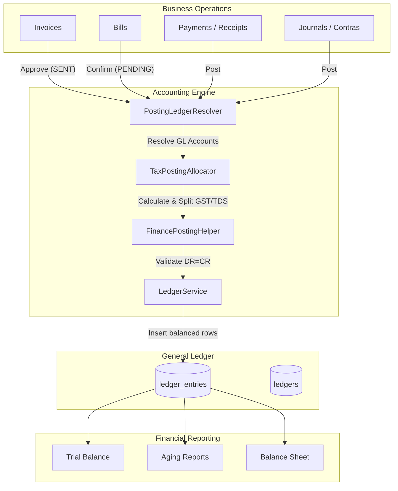
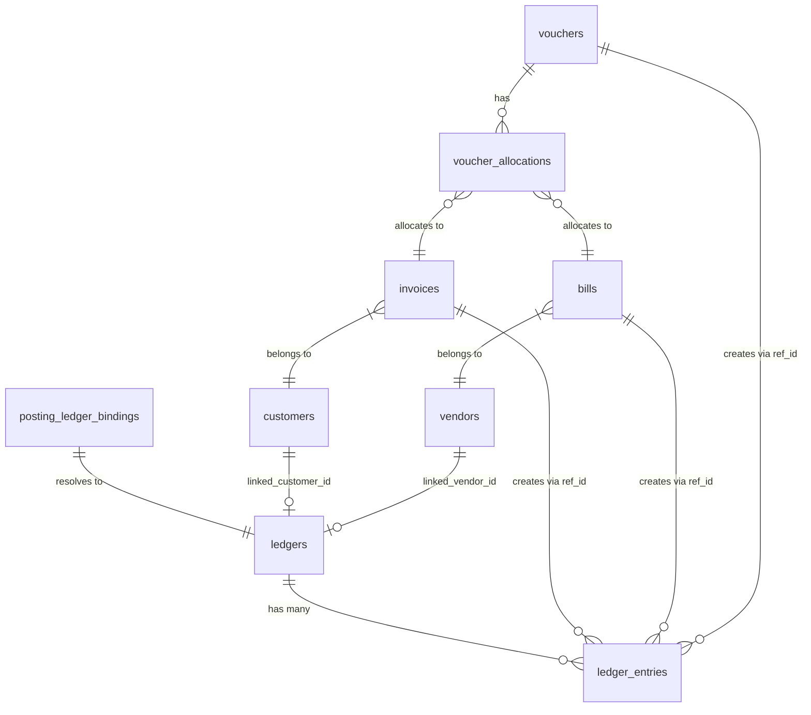

# ERP Accounts Module: Master Enterprise Architecture & Migration Guide

This document is the **definitive technical blueprint** for the Seravion ERP Accounts Module backend. It is written for Principal Architects, Senior Backend Engineers, Database Architects, and ERP Migration Specialists. It deconstructs the entire accounting engine, exact DR/CR logic, the database schema, and the exact dependency flow required to safely execute a direct database migration without corrupting financial integrity.

---

## SECTION 1 — COMPLETE SYSTEM ARCHITECTURE

The accounting system follows a strict, asynchronous-style (though executed synchronously in service methods) **Document-to-Ledger** architecture. No financial balances are permanently hardcoded on master entities (Customer/Vendor); instead, everything is dynamically derived from double-entry accounting records.

### The Core Pipeline



### Architecture Fundamentals
- **Business Documents** (`invoices`, `bills`, `vouchers`) track operational status (`DRAFT`, `SENT`, `PAID`) and store calculated totals.
- **Accounting Engine** (`FinancePostingHelper`, `TaxPostingAllocator`) translates the operational totals into strict double-entry debits and credits.
- **General Ledger** (`ledger_entries`) is the absolute, immutable source of financial truth.
- **Reports** (Trial Balance, Outstanding, P&L) derive dynamically by querying `SUM(dr_amount) - SUM(cr_amount)` from `ledger_entries`.

---

## SECTION 2 — COMPLETE DATABASE ANALYSIS

Below is the deep analysis of all affected tables during financial transactions.

### 1. Table: `ledgers`
* **Purpose:** Represents an individual financial account.
* **Fields:**
  - `id` (varchar, PK) — E.g., `LED-12345678`
  - `ledger_code` (varchar) — Unique code (`SALES_INCOME`, `GST_CGST_OUTPUT`)
  - `ledger_name` (varchar) — Display name
  - `ledger_type` (varchar) — `CUSTOMER`, `VENDOR`, `BANK`, `CASH`, `TAX`, `INTERNAL`
  - `linked_customer_id` (varchar, FK) — Links to `customers.id`
  - `linked_vendor_id` (varchar, FK) — Links to `vendors.id`
  - `opening_balance` (decimal) — Static initial balance
  - `opening_balance_type` (varchar) — `DR` or `CR`
  - `status` (varchar) — `ACTIVE`, `INACTIVE`
* **Service Owner:** `LedgerServiceImpl`
* **Usage:** Read by `FinancePostingHelper` to fetch target accounts. Written during setup. Used by all financial reports.

### 2. Table: `ledger_entries`
* **Purpose:** The atomic, double-entry financial transaction log.
* **Fields:**
  - `id` (varchar, PK) — E.g., `LE-87654321`
  - `voucher_no` (varchar) — The document number (e.g., `INV-2026-0001`)
  - `entry_date` (date) — Transaction date
  - `ledger_id` (varchar, FK) — Points to `ledgers.id`
  - `dr_amount` (decimal) — Debit value
  - `cr_amount` (decimal) — Credit value
  - `ref_type` (varchar) — `INVOICE`, `BILL`, `RECEIPT`, `PAYMENT`, `JOURNAL`, `CONTRA`
  - `ref_id` (varchar) — Points to `invoices.id`, `bills.id`, `vouchers.id`
  - `posting_status` (varchar) — Usually `POSTED`
* **Service Owner:** `LedgerServiceImpl.postEntry()`
* **Usage:** Inserted into by `FinancePostingHelper`. Read heavily by Aging, Trial Balance, Summary endpoints.

### 3. Table: `posting_ledger_bindings`
* **Purpose:** Resolves hardcoded accounting events to dynamic ledger IDs.
* **Fields:**
  - `posting_key` (varchar, PK) — E.g., `INVOICE_APPROVE_INCOME`
  - `ledger_id` (varchar, FK) — Points to `ledgers.id`
* **Service Owner:** `PostingLedgerResolver`

### 4. Table: `invoices`
* **Purpose:** Tracks sales to customers.
* **Fields:** `id` (PK), `invoice_number`, `customer_id` (FK), `grand_total`, `taxable_amount`, `cgst_amount`, `status`, `received_amount`, `pending_amount`.
* **Service Owner:** `InvoicingServiceImpl`
* **Affected Tables on Approve:** `invoices` (status update), `ledger_entries` (new rows inserted).

### 5. Table: `bills` (`purchase_bills`)
* **Purpose:** Tracks vendor purchases.
* **Fields:** `id` (PK), `bill_number`, `vendor_id` (FK), `net_payable`, `tds_amount`, `status`, `paid_amount`, `pending_amount`.
* **Service Owner:** `BillsServiceImpl`
* **Affected Tables on Confirm:** `bills` (status update), `ledger_entries` (new rows).

### 6. Table: `vouchers`
* **Purpose:** Tracks receipts, payments, journals, and contras.
* **Fields:** `id` (PK), `voucher_type` (`RECEIPT`, `PAYMENT`), `bank_ledger_id` (FK), `party_id` (FK), `gross_amount`, `allocated_amount`, `unallocated_amount`.
* **Service Owner:** `PaymentsServiceImpl`
* **Affected Tables on Post:** `vouchers`, `voucher_allocations`, `invoices`/`bills` (balance updates), `ledger_entries`.

### 7. Table: `voucher_allocations`
* **Purpose:** Maps a portion of a voucher's cash to a specific Invoice/Bill.
* **Fields:** `id`, `voucher_id`, `document_type` (`INVOICE`/`BILL`), `document_id`, `allocated_amount`, `shortfall_amount`.

---

## SECTION 3 — COMPLETE TABLE RELATIONSHIP FLOW



### Relationship Resolution Mechanics
1. **Customer resolution:** `SELECT id FROM ledgers WHERE linked_customer_id = ? AND ledger_type = 'CUSTOMER'`
2. **Vendor resolution:** `SELECT id FROM ledgers WHERE linked_vendor_id = ? AND ledger_type = 'VENDOR'`
3. **Internal resolution:** `SELECT ledger_id FROM posting_ledger_bindings WHERE posting_key = 'INVOICE_APPROVE_INCOME'`

---

## SECTION 4 — COMPLETE AUTO POSTING FLOW

This is the exact sequence of events when standard documents are approved.

### 4.1. INVOICE FLOW (Approval)

* **Trigger:** `PUT /api/v1/invoices/{id}/approve`
* **Controller:** `InvoiceController.approveSend()`
* **Service:** `InvoicingServiceImpl.approveSend()`
* **Execution Path:**
  1. Updates `invoices.status` to `SENT`.
  2. Looks up `Customer Ledger` using `invoice.customer_id`.
  3. Looks up `Income Ledger` using `PostingLedgerResolver` (`INVOICE_APPROVE_INCOME`).
  4. Calls `TaxPostingAllocator.allocate()` to split GST.
  5. Calls `FinancePostingHelper.postBalancedEntries()`.

**Exact DR/CR Matrix Generated:**

| Target Ledger | Direction | Amount Source |
|---|---|---|
| **Customer Ledger** (`linked_customer_id`) | **DR** | `invoices.grand_total` |
| **Income Ledger** (`INVOICE_APPROVE_INCOME`) | **CR** | `invoices.taxable_amount` |
| **CGST Output Ledger** | **CR** | Allocated `cgst_amount` |
| **SGST/IGST Output Ledger** | **CR** | Allocated `sgst`/`igst_amount` |

*Note: All 4 rows are inserted into `ledger_entries` simultaneously.*

### 4.2. BILL FLOW (Confirmation)

* **Trigger:** `PUT /api/v1/bills/{id}/confirm`
* **Controller:** `BillsController.confirm()`
* **Service:** `BillsServiceImpl.confirm()`
* **Execution Path:**
  1. Updates `bills.status` to `PENDING`.
  2. Looks up `Vendor Ledger`.
  3. Looks up `Expense Ledger` (`BILL_CONFIRM_EXPENSE`).
  4. Looks up `TDS Ledger` (`TDS_PAYABLE`).
  5. Posts to `ledger_entries`.

**Exact DR/CR Matrix Generated:**

| Target Ledger | Direction | Amount Source |
|---|---|---|
| **Purchase Expense** (`BILL_CONFIRM_EXPENSE`) | **DR** | `bills.taxable_amount` |
| **CGST Input Ledger** | **DR** | Allocated `cgst_amount` |
| **SGST/IGST Input Ledger** | **DR** | Allocated `sgst`/`igst_amount` |
| **Vendor Ledger** (`linked_vendor_id`) | **CR** | `bills.net_payable` |
| **TDS Payable Ledger** | **CR** | `bills.tds_amount` |

### 4.3. PAYMENT FLOW (Receipt)

* **Trigger:** `POST /api/v1/payments/receipts`
* **Service:** `PaymentsServiceImpl.createReceipt()`

**Exact DR/CR Matrix Generated:**

| Target Ledger | Direction | Amount Source |
|---|---|---|
| **Bank/Cash Ledger** (Selected) | **DR** | `amount_received` (Cash to bank) |
| **Advance Ledger** (`CUSTOMER_ADVANCE`) | **DR** | `advance_applied` |
| **Customer Ledger** | **CR** | `total_settlement` (Cash + Advance) |

*(Simultaneously, `invoices.received_amount` and `pending_amount` are updated, and `voucher_allocations` are created to link the receipt to specific invoices).*

---

## SECTION 5 — COMPLETE GST & TDS ENGINE

### TaxPostingAllocator Logic
The `TaxPostingAllocator.allocate()` service maps document taxes to specific GL ledgers.
1. **Line-Level Granularity:** It reads `sales_invoice_lines` to extract the `hsn_sac` code.
2. **Tax Type Lookup:** Queries the DB to find `TaxTypes` attached to that HSN.
3. **Intra vs Inter State:** Compares `branchState` vs `customerState`. If matching, it uses CGST/SGST. If different, IGST.
4. **Fallback:** If line-level mapping fails, it uses `PostingLedgerResolver` to get the default ledger for `TAX_CGST_OUTPUT`, etc., and posts the header-level `cgst_amount`.

### TDS Logic
TDS is simpler. It is a direct deduction calculated on the document header.
- During Bill Confirmation, `bills.tds_amount` is credited to the `TDS_PAYABLE` ledger.
- During Payment generation, if TDS is recorded against the payment, it is credited to `TDS_PAYABLE` and added to the Vendor's debit.

---

## SECTION 6 — COMPLETE `ledger_entries` ANALYSIS

```text
ledger_entries IS THE ACTUAL ACCOUNTING TRUTH.
```

Why?
- If an invoice says `grand_total = 1000` but `ledger_entries` shows `500` for that Customer, the Trial Balance, Balance Sheet, and Customer Outstanding reports will show `500`.
- The reporting APIs (`LedgerServiceImpl.summary()`, `ageing()`, `statement()`) **do not query the `invoices` table**. They execute `SUM(dr) - SUM(cr)` directly on `ledger_entries`.

**Fields & Purpose:**
- `dr_amount` / `cr_amount`: Must be balanced at the document level.
- `ref_type`: Links the accounting entry to the operational domain (`INVOICE`, `RECEIPT`).
- `ref_id`: The exact UUID of the operational document.
- `posting_status`: `POSTED` (Only posted entries are calculated).

---

## SECTION 7 — COMPLETE MIGRATION ANALYSIS

### Why Direct DB Migration Fails
If a Data Engineer executes:
```sql
INSERT INTO invoices (id, invoice_number, status, grand_total...) 
VALUES ('INV-123', '2026-001', 'SENT', 1180);
```
**What happens:**
- The Invoice appears in the UI.
- The user can view the PDF.
- The Invoice list shows the document.

**What breaks:**
- The `ledger_entries` table is empty.
- The Customer's Outstanding Balance remains 0.00.
- The Sales Income account remains 0.00.
- The GST Output accounts remain 0.00.
- Trial Balance does not match operational data.

**Why?**
The backend service `FinancePostingHelper.postBalancedEntries()` was skipped. The database itself has no `TRIGGER` to create accounting entries; it is 100% reliant on the Java application tier.

---

## SECTION 8 — HOW TO WRITE MIGRATION SCRIPTS

To safely migrate historical data, your migration scripts (Python, SQL Stored Procs, or ETL tools) MUST replicate the `FinancePostingHelper` logic.

### Migration Script Architecture (Step-by-Step)

#### Phase 1: Master Data
1. Migrate `customers`.
2. Generate a `LEDGER` for each customer (Type: `CUSTOMER`). Update `ledgers.linked_customer_id`.
3. Migrate `vendors`.
4. Generate a `LEDGER` for each vendor (Type: `VENDOR`). Update `ledgers.linked_vendor_id`.

#### Phase 2: Resolve System Ledgers
Query `posting_ledger_bindings` to cache the `ledger_id` for:
- `INVOICE_APPROVE_INCOME`
- `BILL_CONFIRM_EXPENSE`
- `TAX_CGST_OUTPUT`, `TAX_SGST_OUTPUT`, `TAX_IGST_OUTPUT`
- `TAX_CGST_INPUT`, `TAX_SGST_INPUT`, `TAX_IGST_INPUT`
- `TDS_PAYABLE`

#### Phase 3: Migrate Invoices
For each Invoice in the legacy system:
1. `INSERT INTO invoices (id, status, grand_total, taxable_amount...) VALUES (..., 'SENT', ...);`
2. `INSERT INTO sales_invoice_lines (...)`
3. **Generate Ledger Entries (The Critical Step):**
   ```sql
   -- DR Customer
   INSERT INTO ledger_entries (id, voucher_no, entry_date, ledger_id, dr_amount, cr_amount, ref_type, ref_id, posting_status)
   VALUES ('LE-1', legacy_invoice_no, legacy_date, resolved_customer_ledger_id, legacy_grand_total, 0, 'INVOICE', new_invoice_id, 'POSTED');

   -- CR Income
   INSERT INTO ledger_entries (id, ...)
   VALUES ('LE-2', legacy_invoice_no, legacy_date, resolved_income_ledger_id, 0, legacy_taxable_amount, 'INVOICE', new_invoice_id, 'POSTED');

   -- CR Taxes (Iterate for CGST, SGST, IGST if > 0)
   INSERT INTO ledger_entries (id, ...)
   VALUES ('LE-3', legacy_invoice_no, legacy_date, resolved_cgst_ledger_id, 0, legacy_cgst_amount, 'INVOICE', new_invoice_id, 'POSTED');
   ```

#### Phase 4: Migrate Payments (Receipts)
For each payment:
1. `INSERT INTO vouchers (id, voucher_type, gross_amount, ...) VALUES (..., 'RECEIPT', ...);`
2. `INSERT INTO voucher_allocations` (to link to invoices and reduce invoice `pending_amount`).
3. **Generate Ledger Entries:**
   ```sql
   -- DR Bank
   INSERT INTO ledger_entries (...) VALUES (..., resolved_bank_ledger, legacy_cash_received, 0, ...);
   -- CR Customer
   INSERT INTO ledger_entries (...) VALUES (..., resolved_customer_ledger, 0, legacy_total_settlement, ...);
   ```

---

## SECTION 9 — COMPLETE MAPPING SYSTEM

When writing migration scripts, you cannot rely on sequential IDs. You must maintain intermediate mapping tables during migration.

### Required ETL Mapping Tables

**1. Customer Migration Map**
| legacy_customer_id | new_customer_id | new_ledger_id |
|--------------------|-----------------|---------------|
| `CUST-991` | `CUST-A1B2C3D4` | `LED-88889999`|

**2. Invoice Migration Map**
| legacy_invoice_no | new_invoice_id | legacy_customer_id |
|-------------------|----------------|--------------------|
| `INV-2023-01` | `INV-X9Y8Z7` | `CUST-991` |

**How to use:**
When processing Legacy Payment `PAY-500` against Legacy Invoice `INV-2023-01`, you join against the `Invoice Migration Map` to find `new_invoice_id`, and then join the `Customer Migration Map` to find the exact `new_ledger_id` to Credit in `ledger_entries`.

---

## SECTION 10 — VALIDATION & RECONCILIATION

After running migration scripts, execute these absolute assertions. If any assertion fails, the migration is corrupt and must be rolled back.

### Assertion 1: Global Trial Balance Zero
```sql
SELECT SUM(dr_amount) - SUM(cr_amount) AS trial_balance 
FROM ledger_entries 
WHERE posting_status = 'POSTED';
-- Expected Result: 0.00
```

### Assertion 2: Document Balance Integrity
```sql
SELECT ref_id, ref_type, SUM(dr_amount) as dr, SUM(cr_amount) as cr
FROM ledger_entries 
GROUP BY ref_id, ref_type 
HAVING SUM(dr_amount) <> SUM(cr_amount);
-- Expected Result: 0 rows returned. (Every document must be perfectly balanced internally).
```

### Assertion 3: Operational vs. Financial Reconciliation (Customer Outstanding)
```sql
WITH OperationalPending AS (
    SELECT customer_id, SUM(pending_amount) as total_pending
    FROM invoices 
    WHERE status IN ('SENT', 'PARTIAL', 'OVERDUE')
    GROUP BY customer_id
),
FinancialBalance AS (
    SELECT l.linked_customer_id, SUM(le.dr_amount) - SUM(le.cr_amount) as ledger_balance
    FROM ledger_entries le
    JOIN ledgers l ON le.ledger_id = l.id
    WHERE l.ledger_type = 'CUSTOMER'
    GROUP BY l.linked_customer_id
)
SELECT op.customer_id, op.total_pending, fb.ledger_balance
FROM OperationalPending op
LEFT JOIN FinancialBalance fb ON op.customer_id = fb.linked_customer_id
WHERE op.total_pending <> fb.ledger_balance;
-- Expected Result: 0 rows returned. (Operational pending must perfectly match the GL Ledger balance).
```

### Conclusion
By treating `ledger_entries` as the immutable core and understanding the exact DR/CR pairs generated by the Java Application Layer, a data migration specialist can construct SQL/Python scripts that faithfully reproduce the financial state of the ERP without routing millions of historical records through the REST APIs.
