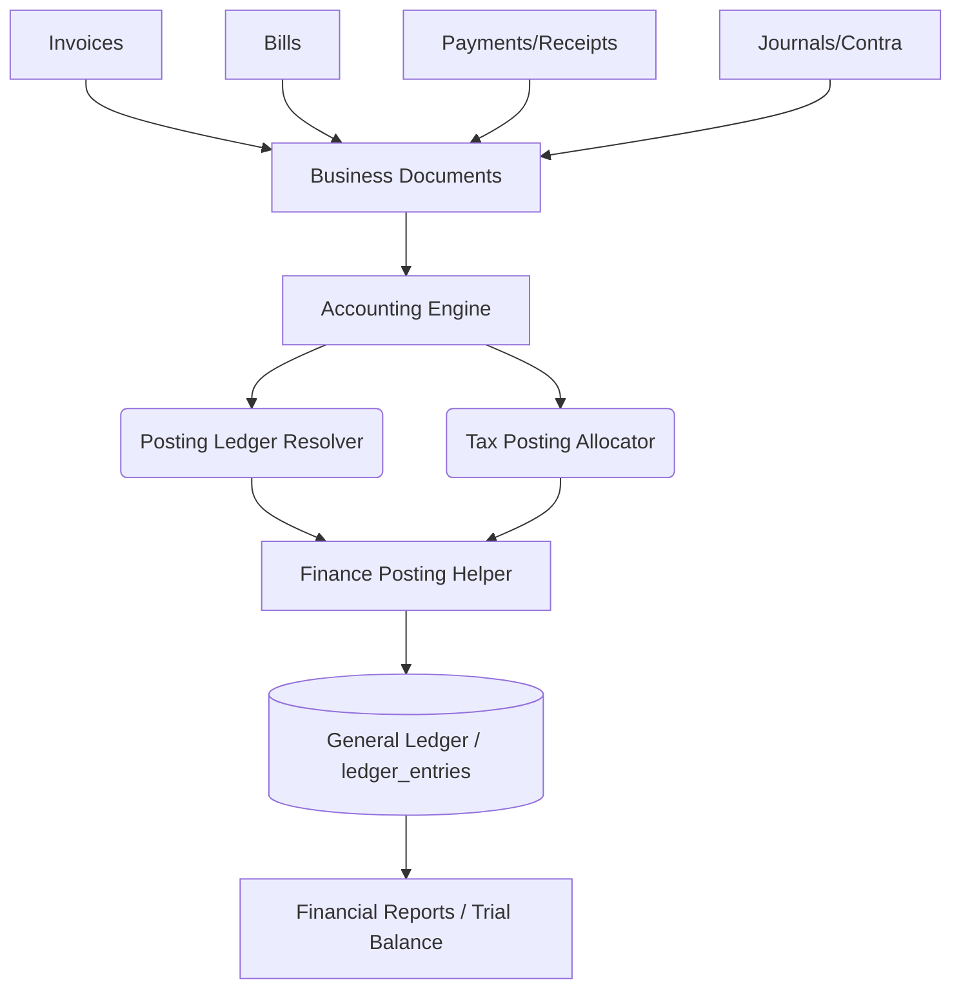
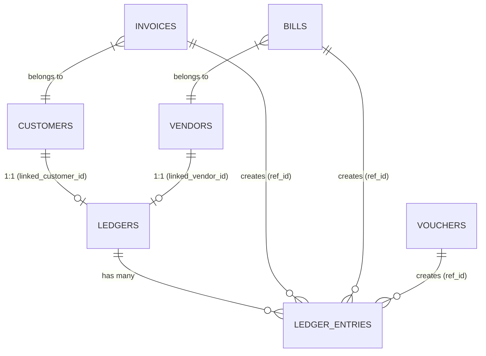

# ERP Accounts Module: Backend Architecture & Accounting Flow

This document provides a comprehensive technical breakdown of the Accounts module backend, designed for Database Architects, Data Analysts, and ERP Migration Specialists. It details the internal database flows, automatic ledger posting mechanisms, service dependencies, and strategies for direct data migration.

## 1. High-Level Architecture

The Seravion ERP Accounts module follows a strict **Document-to-Ledger** accounting model. All business documents (Invoices, Bills, Receipts) act as the source for financial transactions, which are then asynchronously/synchronously translated into double-entry accounting records (Ledger Entries) by the Accounting Engine.



**Key Concept:** The `ledger_entries` table is the **Absolute Source of Truth** for all financial balances. Document tables (like `invoices` and `bills`) track operational state, but accounting reports derive entirely from `ledgers` and `ledger_entries`.

---

## 2. Complete Module Flow

### 1. COA (Chart of Accounts)
- **Purpose:** Defines the financial structure (Assets, Liabilities, Equity, Income, Expense).
- **Backend Flow:** Managed via Account Heads and Ledgers.
- **Status Lifecycle:** Active / Inactive. Only Active ledgers can accept postings.

### 2. Ledger
- **Purpose:** Represents individual financial accounts (Customer, Vendor, Bank, Cash, Tax, Internal).
- **Backend Flow:** Balances are not stored as a static column (except for `opening_balance`). Closing balances are calculated dynamically: `Opening Balance + sum(DR) - sum(CR)`.
- **Relationships:** Linked to `customers` via `linked_customer_id` and `vendors` via `linked_vendor_id`.

### 3. Invoice (Sales)
- **Purpose:** Records sales to customers.
- **Lifecycle:** `DRAFT` ➔ `SENT` (Approved) ➔ `PARTIAL` ➔ `PAID`.
- **Posting Trigger:** Auto-posting occurs when status changes from `DRAFT` to `SENT` via `InvoicingServiceImpl.approveSend()`.

### 4. Bills (Purchases)
- **Purpose:** Records purchases from vendors.
- **Lifecycle:** `DRAFT` ➔ `PENDING` (Confirmed) ➔ `PARTIAL` ➔ `PAID`.
- **Posting Trigger:** Auto-posting occurs when status changes from `DRAFT` to `PENDING` via `BillsServiceImpl.confirm()`.

### 5. Payments (Receipts & Payments)
- **Purpose:** Records cash/bank inflow and outflow, and allocates them against Invoices/Bills.
- **Lifecycle:** Created as `POSTED`.
- **Posting Trigger:** Ledger entries are created synchronously during `PaymentsServiceImpl.createReceipt()` and `createPayment()`.

---

## 3. Database Analysis

### Table: `ledgers`
Maintains all accounting accounts.
| Field | Type | Purpose |
|-------|------|---------|
| `id` | varchar(50) | Primary Key (`LED-xxx`) |
| `ledger_code` | varchar(50) | Unique identifier for accounting (e.g., `SALES_INCOME`) |
| `ledger_type` | varchar(20) | Type: `CUSTOMER`, `VENDOR`, `BANK`, `CASH`, `TAX`, `INTERNAL` |
| `linked_customer_id` | varchar(50) | FK to `customers` table |
| `linked_vendor_id` | varchar(50) | FK to `vendors` table |
| `opening_balance` | decimal(14,2) | Base amount before any transactions |
| `opening_balance_type` | varchar(2) | `DR` or `CR` |

### Table: `ledger_entries`
The core accounting table. Every financial impact results in balanced rows here.
| Field | Type | Purpose |
|-------|------|---------|
| `id` | varchar(50) | Primary Key (`LE-xxx`) |
| `voucher_no` | varchar(50) | Document identifier (e.g., Invoice No, Receipt No) |
| `entry_date` | date | Transaction date |
| `ledger_id` | varchar(50) | FK to `ledgers` |
| `dr_amount` | decimal(14,2) | Debit Amount |
| `cr_amount` | decimal(14,2) | Credit Amount |
| `ref_type` | varchar(30) | Document Type (`INVOICE`, `BILL`, `RECEIPT`, `PAYMENT`, etc.) |
| `ref_id` | varchar(50) | FK to source document (`invoices.id`, `bills.id`) |

### Table: `posting_ledger_bindings`
Maps generic accounting events to specific ledgers.
| Field | Type | Purpose |
|-------|------|---------|
| `posting_key` | varchar(64) | Event type (e.g., `INVOICE_APPROVE_INCOME`, `BILL_CONFIRM_EXPENSE`) |
| `ledger_id` | varchar(50) | FK to `ledgers`. The ledger that will be hit. |

---

## 4. Complete Relationship Mapping



**Resolution Flow:**
When an Invoice is posted, the backend looks up the Customer's ID. It queries `ledgers` for `linked_customer_id == invoice.customer_id` and `ledger_type == CUSTOMER`. This is the target for the Debit entry.

---

## 5. Auto Ledger Entry Flow (Accounting DR/CR Logic)

This is the exact double-entry flow hardcoded into the Application Layer.

### Scenario A: Invoice Approved (`InvoicingServiceImpl.approveSend`)
| Ledger Resolved Via | DR/CR | Amount |
|---------------------|-------|--------|
| Customer Ledger (`linked_customer_id`) | **DR** | `Grand Total` |
| Income Ledger (`PostingLedgerKey.INVOICE_APPROVE_INCOME`) | **CR** | `Taxable Amount` |
| CGST Output (`TaxPostingAllocator`) | **CR** | `CGST Amount` |
| SGST Output (`TaxPostingAllocator`) | **CR** | `SGST Amount` |
| IGST Output (`TaxPostingAllocator`) | **CR** | `IGST Amount` |

### Scenario B: Bill Confirmed (`BillsServiceImpl.confirm`)
| Ledger Resolved Via | DR/CR | Amount |
|---------------------|-------|--------|
| Expense Ledger (`PostingLedgerKey.BILL_CONFIRM_EXPENSE`) | **DR** | `Taxable Amount` |
| CGST Input (`TaxPostingAllocator`) | **DR** | `CGST Amount` |
| SGST Input (`TaxPostingAllocator`) | **DR** | `SGST Amount` |
| IGST Input (`TaxPostingAllocator`) | **DR** | `IGST Amount` |
| Vendor Ledger (`linked_vendor_id`) | **CR** | `Net Payable` |
| TDS Ledger (`PostingLedgerKey.TDS_PAYABLE`) | **CR** | `TDS Amount` (If applicable) |

### Scenario C: Payment Receipt Posted (`PaymentsServiceImpl.createReceipt`)
| Ledger Resolved Via | DR/CR | Amount |
|---------------------|-------|--------|
| Bank/Cash Ledger (Selected by User) | **DR** | `Cash to Bank Amount` |
| Advance Ledger (`PostingLedgerKey.CUSTOMER_ADVANCE`) | **DR** | `Advance Applied` (If any) |
| Customer Ledger (`linked_customer_id`) | **CR** | `Total Settlement (Cash + Advance)` |

*(Note: Invoices are marked PAID via `voucher_allocations` table; the ledger handles the pure financial balance).*

---

## 6. GST & TDS Flow

### GST Logic (`TaxPostingAllocator.java`)
The application attempts a granular GST split based on HSN/SAC codes from the document lines.
1. It looks at the document lines and retrieves the `HSN/SAC` code.
2. It looks up the associated `TaxTypes` for that HSN.
3. It checks if the transaction is **Intra-state** (Branch State == Counterparty State).
4. If Intra-state, it posts to CGST/SGST ledgers. If Inter-state, IGST.
5. If line-level HSN is missing, it falls back to the header level CGST/SGST/IGST amounts and posts them to default tax ledgers defined in `PostingLedgerKey` (`TAX_CGST_OUTPUT`, etc.).

### TDS Logic
TDS is deducted at source during Bill Confirmation or Payment Outflow.
- It posts directly to the ledger mapped to `PostingLedgerKey.TDS_PAYABLE`.

---

## 7. Backend Service Flow

The execution chain for posting financial records is strictly orchestrated:

1. **Controller:** `InvoiceController.approveSend()`
2. **Service:** `InvoicingServiceImpl.approveSend()`
3. **Resolver:** `postingLedgerResolver.resolveForPosting(PostingLedgerKey.INVOICE_APPROVE_INCOME)`
4. **Tax Allocator:** `taxPostingAllocator.allocate(lines, branchState, customerState, OUTPUT, cgst, sgst, igst)`
5. **Posting Helper:** `FinancePostingHelper.postBalancedEntries()`
   - Validates `sum(DR) == sum(CR)` within a tolerance of `0.02`.
   - Rejects unbalanced transactions immediately.
6. **Ledger Service:** `LedgerServiceImpl.postEntry()`
   - Saves records into `ledger_entries`.

---

## 8. The Ledger Entry System (Source of Truth)

Unlike some ERPs that store a hardcoded `current_balance` on the customer/vendor record, Seravion calculates balances dynamically.

**How Balances are Calculated:**
```java
BigDecimal running = ledger.getOpeningBalance();
if (ledger.getOpeningBalanceType() == BalanceType.CR) {
    running = running.negate();
}
// Sum all POSTED entries
running = running.add(sum(DrAmount)).subtract(sum(CrAmount));
```

**Why is this critical?**
If a migration script manually inserts an `invoice` with `status = SENT`, the Customer's outstanding balance **will not change** unless a corresponding `ledger_entry` is also inserted. The reports read `ledger_entries`, not `invoices`.

---

## 9. Migration Analysis: Why Direct DB Migration Fails

Directly migrating data via SQL `INSERT INTO invoices` or `INSERT INTO bills` causes massive data corruption because:
1. **Missing Auto Entries:** The trigger for generating `ledger_entries` lives in the **Java Service Layer**, not in Database Triggers.
2. **Unbalanced Ledgers:** If you migrate an Invoice but don't migrate the double-entry accounting records, Trial Balances will break, and Customer Aging reports will show 0 outstanding.
3. **Status Disconnect:** An invoice might be marked `SENT`, but the General Ledger has no knowledge of the income or the receivable.

---

## 10. Migration Script Strategy

To safely migrate historical accounting data directly into the database, your SQL/Python migration scripts MUST replicate the Java application logic.

### Migration Flow Strategy:
1. **Migrate Master Data First:**
   - Migrate `customers` and `vendors`.
   - Migrate/Create `ledgers` for every Customer and Vendor. Populate `linked_customer_id` and `linked_vendor_id`.
   - Setup `posting_ledger_bindings`.

2. **Migrate Documents (Invoices/Bills):**
   - Insert into `invoices` with status `SENT` or `PAID`.
   - Insert line items into `sales_invoice_lines`.

3. **Generate Ledger Entries (The Critical Step):**
   - For every `SENT` or `PAID` invoice migrated, the script MUST execute `INSERT INTO ledger_entries`.
   - **Step A:** Look up the Customer's Ledger ID.
   - **Step B:** Look up the Income Ledger ID.
   - **Step C:** Look up Tax Ledger IDs.
   - **Step D:** Insert 1 DR row (Customer) and N CR rows (Income + Taxes).
   - Ensure `sum(DR) = sum(CR)` exactly.
   - Set `ref_type = 'INVOICE'` and `ref_id = invoice.id`.

4. **Migrate Payments:**
   - Insert into `vouchers`.
   - Insert into `voucher_allocations` to link the payment to the Invoice/Bill.
   - Insert into `ledger_entries` to DR Bank and CR Customer.

---

## 11. Validation & Reconciliation Logic

After migration, Data Analysts should run the following queries to ensure data integrity:

### A. Trial Balance Validation
```sql
-- Must equal exactly 0.00
SELECT SUM(dr_amount) - SUM(cr_amount) 
FROM ledger_entries 
WHERE posting_status = 'POSTED';
```

### B. Customer Outstanding Reconciliation
```sql
-- The sum of pending_amount on Invoices MUST equal the Customer Ledger Balance
SELECT c.id, 
       (SELECT SUM(pending_amount) FROM invoices WHERE customer_id = c.id AND status IN ('SENT', 'PARTIAL', 'OVERDUE')) as document_outstanding,
       (SELECT SUM(dr_amount) - SUM(cr_amount) FROM ledger_entries le JOIN ledgers l ON le.ledger_id = l.id WHERE l.linked_customer_id = c.id) as ledger_balance
FROM customers c;
-- The two columns should match.
```

### C. Tax Ledger Validation
Ensure that the sum of `tax_amount` across all `sales_invoice_lines` equals the credit balance of the CGST/SGST/IGST Output ledgers in `ledger_entries`.
