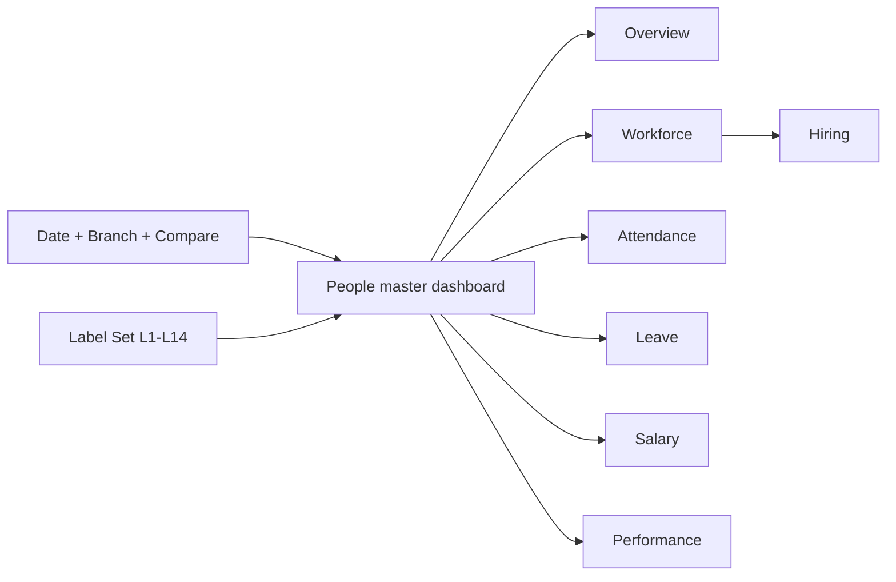
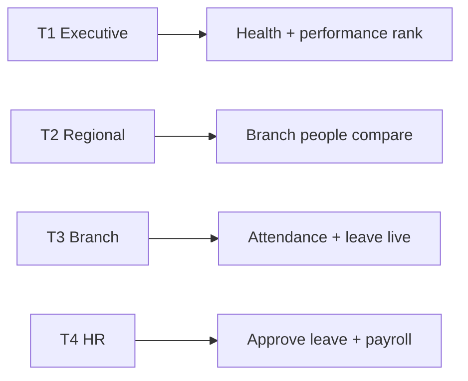
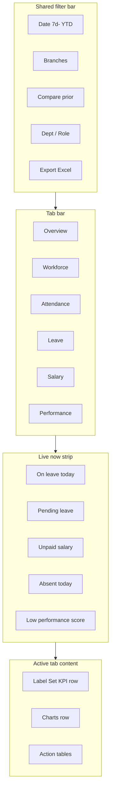
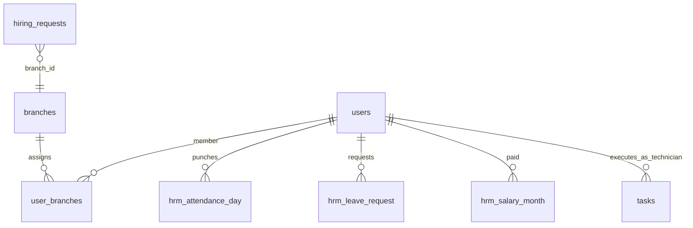
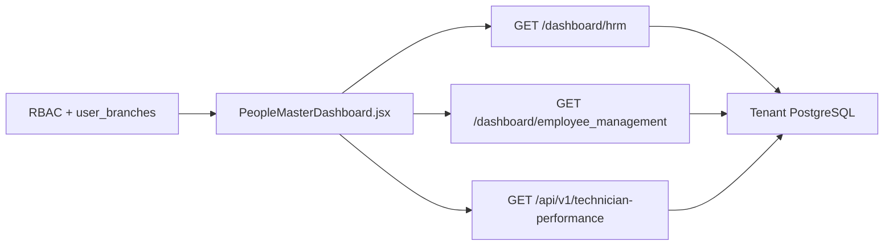

# People & Workforce Master Dashboard — HRM Cluster (PRD / BRD)

> **Document type:** PRD + BRD analytics spec (Easy English)  
> **Hub module:** **People & Workforce Master** (single combined dashboard)  
> **Modules combined:** HRM (attendance · leave · salary) · Employee User Management · Employee & Hiring Management · Performance Analytics (Technician Performance)  
> **Audience:** T1–T5  
> **Last analyzed:** 2026-07-28  
> **Sources:** `HRMAnalyticsService` (`GET /dashboard/hrm`), `EmployeeService` (`GET /dashboard/employee_management`), `HRMService` (classic), Java `/api/v1/hrm/*`, `/api/v1/technician-performance/*`, `HRMDashboard.jsx`, `EmployeeHiringDashboard.jsx`

---

## Business requirements (Easy English)

**Problem:** HR, branch managers, and ops leads open **four or more screens** today — HRM tab, Employee/User list, Hiring card, Technician Performance page — to answer one question: *“Do we have enough people, are they present, paid, and performing?”* Data is split across APIs and cards. Leave and attendance sit in HRM ops; headcount sits in user management; performance sits in a separate module.

**Goal:** One **master People & Workforce dashboard** on `/dashboard-v2` that combines HRM + User/Employee Management + Leave + Attendance + Salary + Performance Analytics under **one filter bar**, **one Label Set**, and **one Excel export** — with tabs for each domain and a Live now strip for today’s exceptions.

**Success looks like:**
1. A branch manager answers “Who is absent, on leave, unpaid, or under-performing?” in under 2 minutes on one page
2. HR approves pending leave and opens salary gaps from action tables without menu hunting
3. CEO compares Branch A vs Branch B on headcount, attendance %, payroll cost, and avg performance score
4. Auditor exports one workbook (Graphs + Attendance + Leave + Salary + Performance detail sheets) for the same filters

---

## 1. Purpose & Business Need

Pest-control operations depend on **technicians showing up**, **leave not blocking visits**, **payroll staying current**, and **field performance** (tasks completed on time). User/Employee Management is the people master; HRM is daily ops (punch, leave, payslip); Hiring fills gaps; Performance Analytics scores field staff from task execution.

**Outcomes today (fragmented):**

| Piece | Where it lives today | What it gives |
|-------|----------------------|---------------|
| HRM executive analytics | `GET /dashboard/hrm` | Snapshot, health grade, cards: department, **attendance**, **leave**, growth, branch workforce; recommendations; Excel export |
| HRM classic (unused on `/hrm`) | `HRMService` | KPIs: headcount, salary paid, leaves; charts: role, salary trend, dept/type; tables: employee_list, salary_slips; alerts: unpaid_salary, high_leave |
| Employee & Hiring | `GET /dashboard/employee_management` | KPIs: active workforce, open requisitions, payroll; charts: hiring pipeline, employment type, onboarding; tables: critical_hiring, compensation_audit; alerts: delayed_joining, low_leave_balance |
| HRM UI card | `HRMDashboard.jsx` | Calls `/dashboard/hrm` but expects classic `{kpis, charts, tables}` → **often empty / mismatch** |
| Hiring UI card | `EmployeeHiringDashboard.jsx` | Separate scroll card on Company Dashboard |
| User Management | `/user-management` route | **No analytics dashboard** — list/CRUD only |
| Performance Analytics | Java `GET /api/v1/technician-performance/summary`, `/dashboard`, `/employee` | Org summary + paginated performance table + employee detail; RBAC `TECHNICIAN_PERFORMANCE_READ` or CEO |
| Task productivity (partial) | Financial dashboard `technician_productivity` chart | Task count + revenue by tech — not wired into HRM cluster |

**Outcomes recommended (master dashboard):**

- **One card** replaces separate HRM + Employee/Hiring cards
- **Six tabs:** Overview · Workforce · Attendance · Leave · Salary · Performance (+ Hiring sub-panel under Workforce or own tab)
- Shared filters + Label Set across all tabs
- Live now strip: on leave today · pending leave · absent today · unpaid salary · low performers
- Action tables with View / Approve / Open employee / Open performance profile
- Unified export Excel with Graphs MGI covering all tabs
- New orchestrator API **`GET /dashboard/people`** (or extend `/dashboard/hrm`) merging executive + employee + performance summary — **Gap today**

---

## 2. Combined dashboard (nearby modules)

| Module / domain | Why on master dashboard (Easy English) | RBAC Read required | Tab / section |
|-----------------|------------------------------------------|--------------------|---------------|
| **Overview (hub)** | Health grade + cross-domain KPIs | HRM_MANAGEMENT and/or EMPLOYEE_USER_MANAGEMENT | Tab 1 — Overview |
| **Workforce / User & Employee** | Who works here — roles, dept, branches | EMPLOYEE_USER_MANAGEMENT | Tab 2 — Workforce |
| **Attendance** | Present vs absent — field capacity today | HRM_MANAGEMENT | Tab 3 — Attendance |
| **Leave** | Approved / pending / balance | HRM_MANAGEMENT | Tab 4 — Leave |
| **Salary & Payroll** | Paid vs pending, cost trend | HRM_MANAGEMENT | Tab 5 — Salary |
| **Hiring** | Open seats, pipeline, delayed joining | EMPLOYEE_USER_MANAGEMENT (hiring) | Sub-tab under Workforce or Tab 6 |
| **Performance Analytics** | Task completion, score, revenue by technician | TECHNICIAN_PERFORMANCE_READ (or CEO) | Tab 7 — Performance |
| Salary & Leave Config (optional) | Policy rules | Config Read | Link-out only |

Hide entire tab if user lacks Read. Overview tab visible if user has **any** people-module Read.



---

## 3. Comparison Label Set

Same label = same formula in UI, Excel Graphs, and branch comparison.

| Label ID | Display label (Easy English) | Meaning | Unit | Used on |
|----------|------------------------------|---------|------|---------|
| L1 | Active headcount | Active employees in branch scope | count | KPI, bar, Excel |
| L2 | Attendance % | Present days ÷ expected working days × 100 | % | KPI, line, Excel |
| L3 | On leave today | Approved leave overlapping today | count | Live, KPI |
| L4 | Pending leave | Leave requests awaiting decision | count | Live, alerts |
| L5 | Payroll cost | Net salary paid in period | ₹ | KPI, axis |
| L6 | Unpaid salary | Salary months/slips not paid | count / ₹ | Live, alerts |
| L7 | Attrition % | Inactive ÷ total × 100 | % | KPI |
| L8 | Open positions | Hiring requisitions still open | count | Live, KPI |
| L9 | Health grade | Excellent…Critical (weighted score) | text | Overview KPI |
| L10 | Avg performance score | Mean technician performance score in period | score (0–100) | Performance tab |
| L11 | Tasks completed | Tasks completed by scoped technicians | count | Performance |
| L12 | On-time task % | Tasks completed on/before schedule ÷ completed × 100 | % | Performance |
| L13 | Leave balance low | Employees with ≤1 day casual or sick | count | Alerts |
| L14 | New joiners | Users joined in period | count | Workforce KPI |

**Compare modes:** Branch vs Branch · Current vs Prior period · Do not mix ₹ (L5) and counts (L1) on one unlabelled axis

---

## 4. Users & Roles (who sees what)

| Tier | Roles | Scope | Primary questions |
|------|-------|-------|-------------------|
| T1 Executive | CEO, Owner | All branches | Health grade, payroll cost, attrition, branch performance |
| T2 Regional | Multi-branch HR / ops | Assigned | Branch attendance & leave variance; low performers |
| T3 Branch | Branch manager | Own branch(es) | Who is absent / on leave today; pending approvals |
| T4 Functional | HR exec, dispatcher | Assigned | Process leave, salary, view team performance |
| T5 Audit | Auditor | Read + Export | Trails; exports; no approve |



---

## 5. Access Control (RBAC)

| Widget / tab | Module permission | CEO bypass | Branch scope |
|--------------|-------------------|------------|--------------|
| Overview | HRM_MANAGEMENT and/or EMPLOYEE_USER_MANAGEMENT Read | Yes | user_branches ∩ filter |
| Workforce tab | EMPLOYEE_USER_MANAGEMENT Read | Yes | same |
| Attendance / Leave / Salary tabs | HRM_MANAGEMENT Read | Yes | via users → user_branches |
| Hiring sub-tab | EMPLOYEE_USER_MANAGEMENT Read | Yes | hiring_requests.branch_id |
| Performance tab | TECHNICIAN_PERFORMANCE_READ or CEO | Yes | branchId on Java API |
| Export Excel | Export on any included module (or CEO) | Yes | same filters |
| Leave Approve | HRM_MANAGEMENT Approve | Yes | request user’s branches |
| Salary slip PDF | HRM_MANAGEMENT Export | Yes | employee in scope |

**Auth map note:** Dashboard service lists `hrm` → `[HRM_MANAGEMENT, EMPLOYEE_MANAGEMENT]` but frontend uses `EMPLOYEE_USER_MANAGEMENT` — align keys (Gap P0).

| Widget / tab | T1 | T2 | T3 | T4 | T5 |
|--------------|----|----|----|----|-----|
| Overview health + L1–L9 | ✓ | ✓ | partial | partial | ✓ |
| Attendance / Leave / Salary | ✓ | ✓ | ✓ | ✓ | ✓ read |
| Workforce / Hiring | ✓ | ✓ | ✓ | ✓ | ✓ |
| Performance L10–L12 | ✓ | ✓ | ✓ | team only | ✓ |
| Live strip | ✓ | ✓ | ✓ | ✓ | ✓ |
| Export | ✓ | ✓ | ✓ | if Export | ✓ |

---

## 6. Global Filters & Live Update

| Filter | Type | Default | API param | Behavior |
|--------|------|---------|-----------|----------|
| Date range | 7d / 15d / 30d / MTD / QTD / YTD / custom | Last 30d | period / from_date, to_date | Map UI `7days` → `7D`; Performance Java uses WEEK/MONTH/QUARTER/CUSTOM_RANGE |
| Branch | Multi-select | User branches | branch / branchIds | CEO: all active |
| Compare to | prior_period / prior_year | prior_period | compareMode | KPI deltas (HRM executive already supports) |
| Department / Role | Multi | All | departmentIds, roleIds | Workforce + Performance filters |
| Employment status | Multi | Active | status | Workforce tab |

| Widget group | Layer | Method | Interval |
|--------------|-------|--------|----------|
| Live strip (L3, L4, L6, absent today, low score) | Live | Poll | 30–60s |
| Overview snapshot + cards | Period | Filter + poll | 60–120s |
| Attendance / Leave / Salary charts | Period | Filter change | 60–120s |
| Performance table | Period | Filter + paginate | on demand |
| Action tables | Period | Manual + filter | — |

---

## 7. Existing vs Recommended — Summary

| Area | Existing today | Recommended (master dashboard) | Priority |
|------|----------------|--------------------------------|----------|
| UI structure | 2 separate cards (HRM + Employee/Hiring) | **One master card, 6–7 tabs** | P0 |
| User Management analytics | List screen only | Workforce tab with headcount, role/dept charts | P0 |
| Attendance / Leave / Salary | Executive cards in `/dashboard/hrm`; classic tables unused | Dedicated tabs + action tables from `hrm_attendance_day`, `hrm_leave_request`, `hrm_salary_month` | P0 |
| Performance | Separate `/technician-performance` page (Java) | Tab 7 embedded; summary + rank table + drill to employee | P0 |
| UI ↔ API | HRMDashboard expects classic shape | Remap to executive **or** unified `/dashboard/people` payload | P0 |
| Alerts | Service-level only | Live strip + Action Table 2 all domains | P0 |
| Label Set | Mixed executive labels | L1–L14 fixed UI + Excel | P0 |
| Excel | HRM executive sheets only | Full cluster workbook + **Graphs MGI** (6 charts) | P1 |
| Unified API | 3 sources (hrm, employee_management, technician-performance) | `GET /dashboard/people` orchestrator | P1 |

---

## 8. Visual Representation (master dashboard layout)

### Wireframe



### Tab content map

| Tab | Live widgets | Period KPIs | Charts | Action tables |
|-----|--------------|-------------|--------|---------------|
| **Overview** | All Live strip items | L1, L2, L5, L7, L9, L10 | Health + branch multi-bar | Branch summary + merged alerts |
| **Workforce** | New joiners today (optional) | L1, L14, L8 | Dept/role donut; onboarding line; hiring pipeline | employee_list; critical_hiring; compensation_audit |
| **Attendance** | Absent today count | L2 | Attendance % trend line; branch compare bar | Low attendance employees; daily punch exceptions |
| **Leave** | L3, L4 | Pending count; on-leave count | Leave type stacked; balance donut | Pending leave queue (Approve); high_leave; low_leave_balance |
| **Salary** | L6 | L5 | Salary trend line; branch payroll bar | salary_slips; unpaid_salary alerts |
| **Performance** | Below-target techs | L10, L11, L12 | Horizontal rank bar (score); on-time % trend | Technician performance table (paginated); row → detail |

### Widget placement map

| Zone | Widgets | Desktop | Mobile | Live/Period |
|------|---------|---------|--------|-------------|
| Top | Filters + Export | full | stacked | — |
| Tabs | 6–7 tabs | scroll | dropdown | — |
| Live strip | L3, L4, L6, absent, low score | full | scroll | Live |
| KPI row | 4–6 per tab | 4–6 | 2-col | Period |
| Charts | 2–4 per tab | 60/40 | stacked | Period |
| Tables | 1–2 per tab | full | full | Period |

---

## 9. KPI Stat Cards (Label Set) — by domain

### Overview tab

| # | Label ID | Title | Formula | Format | Delta | Layer |
|---|----------|-------|---------|--------|-------|-------|
| 1 | L1 | Active headcount | COUNT active users in scope | count | vs prior | Period |
| 2 | L2 | Attendance % | present ÷ expected working days × 100 | % | vs prior | Period |
| 3 | L5 | Payroll cost | SUM(net_salary) paid in period | ₹ | vs prior | Period |
| 4 | L7 | Attrition % | inactive ÷ total × 100 | % | vs prior | Period |
| 5 | L9 | Health grade | Weighted score → grade | text | — | Period |
| 6 | L10 | Avg performance score | AVG(performanceScore) scoped techs | score | vs prior | Period |

### Attendance tab

| # | Label ID | Title | Formula | Layer |
|---|----------|-------|---------|-------|
| 1 | L2 | Attendance % | From `hrm_attendance_day` status = PRESENT | Period |
| 2 | — | Absent today | COUNT absent today | Live |
| 3 | — | Late punch-ins | COUNT late (if tracked) | Live |

```
Card L2 Attendance % (recommended source)
  Formula: present_days / NULLIF(expected_working_days, 0) * 100
  Tables: hrm_attendance_day a
          JOIN users u ON u.id = a.user_id
          JOIN user_branches ub ON ub.user_id = u.id
  Filters: ub.branch_id = ANY(:branchIds); a.attendance_date BETWEEN :from AND :to
  Exclude: holidays from denominator via hrm_holiday
  Gap today: executive attendance card may proxy via hrm_holidays — replace with attendance_day
```

### Leave tab

| # | Label ID | Title | Formula | Layer |
|---|----------|-------|---------|-------|
| 1 | L3 | On leave | Approved leave overlapping period/today | Live + Period |
| 2 | L4 | Pending leave | status = PENDING (or equivalent) | Live |
| 3 | L13 | Low leave balance | casual ≤1 OR sick ≤1 | Alerts |

```
Card L4 Pending leave
  Tables: hrm_leave_request
  Filters: status pending; user in branch scope
  Action: Approve → /hrm leave inbox
```

### Salary tab

| # | Label ID | Title | Formula | Layer |
|---|----------|-------|---------|-------|
| 1 | L5 | Payroll cost | SUM(hrm_salary_month.net) paid in period | Period |
| 2 | L6 | Unpaid salary | COUNT/SUM unpaid slips or months | Live + Alerts |

**Existing:** `HRMService` uses `hrm_salary_month`; tables `salary_slips`, alert `unpaid_salary`.

### Performance tab

| # | Label ID | Title | Formula | Layer |
|---|----------|-------|---------|-------|
| 1 | L10 | Avg performance score | From TechnicianPerformanceService summary | Period |
| 2 | L11 | Tasks completed | Sum completed tasks per scoped techs | Period |
| 3 | L12 | On-time task % | On-time ÷ completed × 100 | Period |

**Existing Java API:** `GET /api/v1/technician-performance/summary` (org cards); `/dashboard` (paginated rows with `performanceScore`, sort default).

**Gap:** Not in `seravion_connect_dashboard` HRM registry — embed via BFF call or new performance card in analytics service.

---

## 10. Charts & Visualizations

### Graph 1 — Branch people compare (Overview)

| Attribute | Spec |
|-----------|------|
| Type | Clustered multi-bar |
| Layer | Period |
| X-axis title | Branch name |
| Y-axis title | Count / % (dual axis if L1 + L2) |
| Legend | Active headcount (L1) · Attendance % (L2) |

**Existing seed:** `branch_workforce` executive card

### Graph 2 — Attendance % trend (Attendance tab)

| Attribute | Spec |
|-----------|------|
| Type | Line |
| Layer | Period |
| X-axis title | Day / Week |
| Y-axis title | Attendance % |
| Legend | Attendance % · prior period dashed |

**Existing seed:** `attendance_analytics` card

### Graph 3 — Leave mix (Leave tab)

| Attribute | Spec |
|-----------|------|
| Type | Stacked column or donut |
| Layer | Period |
| Legend | Leave type / Pending vs Approved |

**Existing seed:** `leave_analytics` card

### Graph 4 — Salary trend (Salary tab)

| Attribute | Spec |
|-----------|------|
| Type | Line |
| Layer | Period |
| X-axis title | Month |
| Y-axis title | Payroll cost (₹) |
| Legend | Payroll cost (L5) |

**Existing seed:** `salary_trend` in classic HRMService charts

### Graph 5 — Hiring pipeline (Workforce tab)

| Attribute | Spec |
|-----------|------|
| Type | Horizontal bar / funnel |
| Layer | Period |
| Legend | Open positions (L8) by status |

**Existing seed:** `hiring_pipeline` in EmployeeService

### Graph 6 — Technician performance rank (Performance tab)

| Attribute | Spec |
|-----------|------|
| Type | Horizontal bar sorted desc |
| Layer | Period |
| X-axis title | Performance score |
| Y-axis title | Technician name |
| Legend | Performance score (L10) |

**Existing:** Java `/technician-performance/dashboard`; partial: financial `technician_productivity` (tasks + revenue)

```
Performance score by technician (ASCII)
Ravi K   |████████████████████  88
Asha M   |████████████████      76
Imran S  |████████████          62  !
Neha P   |█████████             55  !
         0        50       100
         ! = below branch target (example 65)
```

---

## 11. Action Tables

### Action Table 1 — Branch people summary (Overview)

| Column | Field | Format | Sort | Notes |
|--------|-------|--------|------|-------|
| Branch | branch_name | text | yes | All Branches first |
| Active headcount | L1 | count | yes | |
| Attendance % | L2 | % | yes | |
| On leave | L3 | count | yes | |
| Payroll cost | L5 | ₹ | yes | |
| Avg performance score | L10 | score | yes | if Performance Read |
| Actions | — | View | — | filter other tabs |

### Action Table 2 — Unified alerts queue

| Column | Field | Notes |
|--------|-------|-------|
| Severity | high / medium | |
| Domain | Attendance · Leave · Salary · Hiring · Performance | |
| Type | Pending leave · Unpaid salary · Low attendance · Delayed joining · Low score · Low leave balance | |
| Employee / Request | name or id | |
| Recommended action | Approve leave · Pay salary · Open employee · View performance · Advance hiring | Easy English |

**Existing table ids to merge:**

| Domain | Source API | Table / alert ids |
|--------|------------|-------------------|
| Workforce | `/dashboard/employee_management` | critical_hiring, compensation_audit; alerts: delayed_joining, low_leave_balance |
| HRM classic | `HRMService` | employee_list, salary_slips; alerts: unpaid_salary, high_leave |
| HRM executive | `/dashboard/hrm` | executive_recommendations → map to rows |
| Performance | Java `/technician-performance/dashboard` | rows below threshold |

**Row actions (recommended):**

| Action | Route |
|--------|-------|
| View employee | `/user-management` |
| Approve leave | `/hrm` (leave inbox) |
| View payslip / salary | `/hrm` salary screen |
| View performance | `/technician-performance` or employee detail API |
| Open hiring request | hiring module route |

---

## 12. Branch Comparison View

| Label ID | Aggregation | Company total | Per-branch | Variance rule |
|----------|-------------|---------------|------------|---------------|
| L1 | COUNT | top | one row | — |
| L2 | ratio | top | one row | red if below attendance SLA |
| L3 | COUNT | top | one row | capacity risk |
| L5 | SUM | top | one row | cost control |
| L7 | ratio | top | one row | red if high attrition |
| L8 | COUNT | top | one row | hiring pressure |
| L10 | AVG | top | one row | red if below target score |
| L12 | ratio | top | one row | field SLA |

---

## 13. Data Model & Table Map

| Domain | Primary tables | Branch link |
|--------|----------------|-------------|
| Workforce / users | `users`, `user_branches`, `user_profile_extension`, `user_salary_details`, `user_leave_details` | user_branches |
| Attendance | `hrm_attendance_day` | via users |
| Leave | `hrm_leave_request`, `hrm_holiday` (calendar only) | via users |
| Salary | `hrm_salary_month`, `hrm_salary_slip` | via users |
| Hiring | `hiring_requests` | branch_id |
| Performance | `tasks`, `task_technicians`, service execution (Java module 26) | task.branch_id / user branches |





---

## 14. Excel Export Package — Multiple Graphical Interface

### Export trigger

| Item | Spec |
|------|------|
| UI | **One Export Excel** on master dashboard (all tabs) |
| Permission | HRM Export and/or Employee Export and/or Performance Export (or CEO) |
| Endpoint | **Gap — recommended:** `GET /dashboard/people/export/excel?includeCharts=true` merging HRM + employee + performance |
| Existing partial | `/dashboard/hrm/export/excel` (executive only) |
| includeCharts | true |

### Workbook sheets

| Sheet | Purpose |
|-------|---------|
| Cover | Filters, tabs included, who exported, Label Set list |
| Summary_KPIs | L1–L14 + deltas |
| Branch_Comparison | All Label IDs × branches |
| Trend_Attendance | L2 time series |
| Trend_Salary | L5 time series |
| Trend_Performance | L10 / L12 time series |
| **Graphs** | **6 charts MGI** |
| Charts_Data | All series (Excel Tables) |
| Workforce_Detail | employee_list rows |
| Attendance_Detail | punch/day rows |
| Leave_Detail | leave requests |
| Salary_Detail | salary_slips / months |
| Hiring_Detail | hiring_requests |
| Performance_Detail | technician performance rows |
| Alerts | Unified queue |
| Dictionary | Label Set + formulas + source tables |

### Graphs sheet — chart list (master cluster)

| Chart | Type | X-axis title | Y-axis title | Grid | Legend | Details |
|-------|------|--------------|--------------|------|--------|---------|
| A | Clustered multi-bar | Branch | Active headcount | Major ON | L1 | Branch_Comparison |
| B | Line | Week | Attendance % | Major ON | L2 | Trend_Attendance |
| C | Stacked column | Branch | Leave count | Major ON | Leave type | Leave_Detail |
| D | Line | Month | Payroll cost (₹) | Major ON | L5 | Trend_Salary |
| E | Horizontal bar | Performance score | Technician | Major ON | L10 | Performance_Detail |
| F | Donut | — | — | — | Employment type | Workforce_Detail |

### Analytic value (Easy English)
1. One file for audit: people + pay + presence + performance
2. Compare branch attendance before blaming task delays
3. Spot unpaid salary and low performers in same Alerts sheet

### Existing vs recommended export

| Area | Existing | Recommended |
|------|----------|-------------|
| Excel | HRM executive_summary + card sheets only | Full master cluster + Graphs MGI + all detail sheets |
| Employee export | No dedicated export on card | Include in master workbook |
| Performance export | Java module may export separately | Include Performance_Detail sheet |

---

## 15. API Specification (existing + proposed)

### Existing APIs

| Method | Path | Purpose | Used by tab |
|--------|------|---------|-------------|
| GET | `/dashboard/hrm` | Executive snapshot + analytics_cards + recommendations | Overview, Attendance, Leave (cards) |
| GET | `/dashboard/hrm/export/excel` | Executive Excel | Partial export |
| GET | `/dashboard/employee_management` | Workforce + hiring KPIs/charts/tables | Workforce, Hiring |
| GET | `/api/v1/technician-performance/summary` | Org performance summary cards | Performance |
| GET | `/api/v1/technician-performance/dashboard` | Paginated performance table | Performance |
| GET | `/api/v1/technician-performance/employee?userId=` | Individual profile | Performance drill-down |
| GET | `/api/v1/hrm/*` | Attendance / leave / salary CRUD + approve | Action buttons |
| — | `HRMService` classic | kpis/charts/tables (not on `/hrm` route) | Salary/Workforce tables if wired |

### Proposed APIs (master dashboard)

| Method | Path | Params | Response | Notes |
|--------|------|--------|----------|-------|
| GET | `/dashboard/people` | fromDate, toDate, branch, compareMode, include | `{ overview, workforce, attendance, leave, salary, performance, alerts, live }` | Orchestrator — **Gap** |
| GET | `/dashboard/people/export/excel` | same + includeCharts=true | xlsx with Graphs | Merges 3 sources |
| GET | `/dashboard/hrm` | extend | Add classic `tables` + `alerts` + Label Set aliases | Fix UI mismatch |
| GET | `/dashboard/people/live` | branch | today absent, on leave, pending counts | Live strip poll |

**Frontend merge (fast path without new API):**  
`PeopleMasterDashboard.jsx` → parallel fetch `/dashboard/hrm` + `/dashboard/employee_management` + `/api/v1/technician-performance/summary` with shared params → merge in client.

---

## 16. Cross-Module Interactions

| Related module | Connection | Master dashboard impact |
|----------------|------------|-------------------------|
| Task Management | Technicians execute tasks | L11, L12, L10 from task completion |
| Live Tracking | Field location | Optional Live link on Performance tab |
| Overview (company) | Headcount cost | L5 feeds company Overview |
| Salary & Leave Config | Policy | Explains L2/L4 rules — link-out |
| User Management CRUD | users master | Workforce tab deep-links |

---

## 17. Rules, Validations & Data Quality

- Branch filter ∩ user_branches (except CEO)
- Same Label ID = same formula in UI and Excel
- Attendance from `hrm_attendance_day` — not holiday row counts as absence
- Leave from `hrm_leave_request` — not `hrm_holidays` creator counts
- Performance scope = technicians with TECHNICIAN_PERFORMANCE_READ (or CEO sees all accessible branches)
- IST display; money/% numeric in Excel
- Align `EMPLOYEE_MANAGEMENT` vs `EMPLOYEE_USER_MANAGEMENT` in auth map

---

## 18. Gaps & Implementation Notes

1. **P0** — Replace 2 cards with one `PeopleMasterDashboard` + tab bar
2. **P0** — Fix HRMDashboard ↔ `/dashboard/hrm` response mismatch
3. **P0** — Wire attendance/leave/salary to correct tables in analytics cards
4. **P0** — Embed Performance tab (Java API) with RBAC gate
5. **P0** — Unified Live strip + alerts from all services
6. **P1** — Add `/dashboard/people` orchestrator + single Excel export
7. **P1** — Graphs MGI with 6 charts; wire Export button
8. **P1** — Add `salary_card.py` to HRM analytics (noted as future in HRMAnalyticsService comments)
9. **P2** — Link low performance ↔ task overdue in cross-alert rules

---

## 19. Acceptance criteria (Easy English)

- [ ] One master dashboard card replaces separate HRM and Employee/Hiring cards
- [ ] Tabs visible only if user has Read for that domain
- [ ] Shared date + branch + compare filter drives **all** tabs
- [ ] Attendance, Leave, Salary each have own tab with Label Set KPIs and charts
- [ ] Workforce tab covers user/employee master + hiring pipeline
- [ ] Performance tab shows summary + rank table from technician-performance APIs
- [ ] Live strip shows on leave, pending leave, unpaid salary, absent today (where data exists)
- [ ] Action tables have View / Approve where permissions allow
- [ ] Excel export includes Graphs sheet with ≥4 chart types, axes, grid ON, detail sheets per domain
- [ ] CEO sees all branches; others only assigned branches
- [ ] No empty KPIs due to API shape mismatch

---

## 20. Tips for Stakeholders

- **CEO:** Overview tab — L9 health grade, L7 attrition, L10 avg performance by branch weekly
- **Branch manager:** Live strip every morning; clear L4 pending leave before dispatching tasks
- **HR:** Leave + Salary tabs for approvals; Workforce tab for hiring backlog
- **Ops / dispatcher:** Performance tab — sort by L12 on-time % and L10 score
- **Auditor:** Export once; read Cover + Dictionary first; verify L2 formula uses attendance_day

---

## 21. Existing Functionality Summary

**Available today:**
- Executive HRM API with prior-period compare, health score, attendance/leave/department/branch cards, recommendations, Excel
- Employee/Hiring dashboard API (workforce, pipeline, compensation, hiring alerts)
- Separate UI cards for HRM and Employee/Hiring on `/dashboard-v2`
- Java Technician Performance module (summary, dashboard table, employee detail)
- Classic HRMService data (salary trend, employee_list, salary_slips) — not bound to live `/hrm` route
- User Management screen — operational, no analytics

**Not available (recommended — master dashboard):**
- Single combined UI with tabs for Attendance · Leave · Salary · Workforce · Performance
- User Management analytics on same dashboard
- Unified Live strip and alert queue across all people domains
- Performance embedded in HRM cluster view
- One Excel export for whole people cluster with Graphs MGI
- `/dashboard/people` orchestrator API
