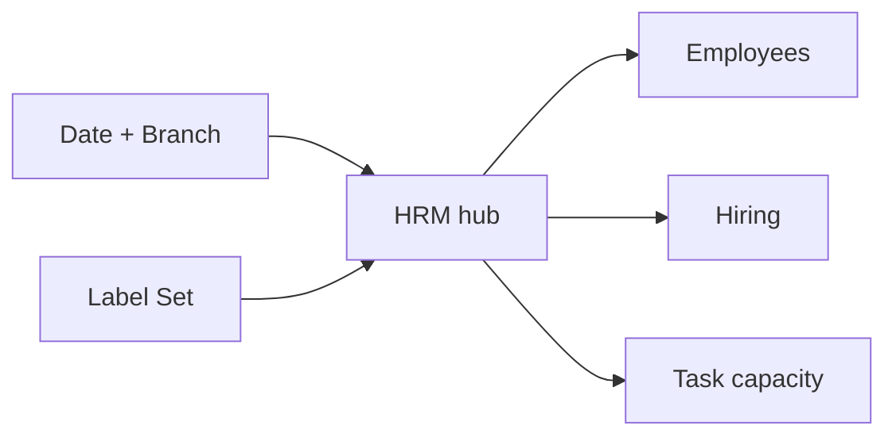
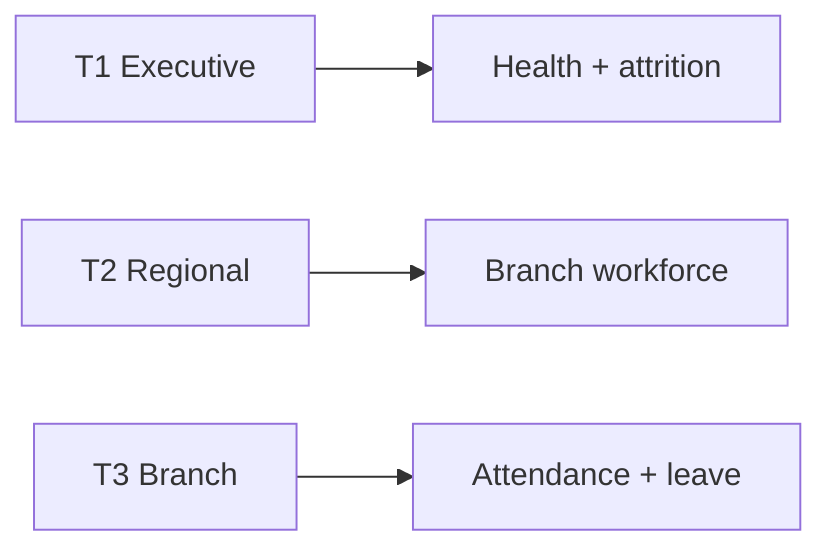
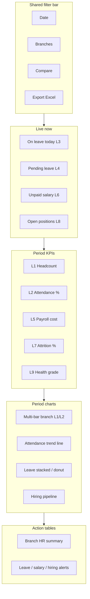
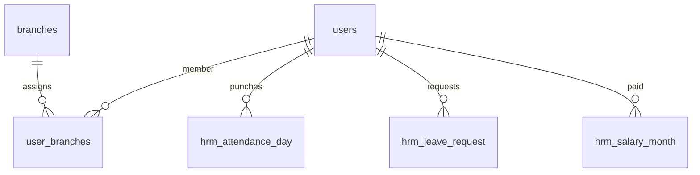

# HRM Cluster — Analytics Dashboard (PRD / BRD)

> **Document type:** PRD + BRD analytics spec (Easy English)  
> **Hub module:** HRM (attendance, leave, salary analytics)  
> **Nearby modules combined:** Employee User Management · Hiring · (optional) Salary & Leave Configuration · Task capacity link  
> **Audience:** T1–T5  
> **Last analyzed:** 2026-07-28  
> **Sources:** `HRMAnalyticsService` (`GET /dashboard/hrm`), `hrm_service.py` (classic, not in registry), `HRMDashboard.jsx`, Java `/api/v1/hrm/*`

---

## Business requirements (Easy English)

**Problem:** HR and branch leaders cannot quickly see if people are present, on leave, paid, and enough hired — across branches — without opening HRM, employee list, and hiring screens separately. Field capacity depends on this.

**Goal:** One **HRM cluster** dashboard that shows workforce health with Employee and Hiring nearby, clear Branch A vs Branch B and this period vs last period comparisons, a Live now strip for today’s absence/leave/payroll problems, and Excel with multiple graphs.

**Success looks like:**
1. A manager answers “Who is away today and is payroll stuck?” in under 2 minutes
2. An auditor exports Excel with Graphs + headcount/attendance/leave rows for the same filters
3. Pending leave, unpaid salary, and open positions appear without hunting menus

---

## 1. Purpose & Business Need

Pest-control work needs technicians to show up. HRM answers: Is the workforce present, paid, and stable? Nearby Employee Management is the people master; Hiring fills open seats; Tasks consume capacity.

**Outcomes today:**
- Dedicated executive API: `GET /dashboard/hrm` → `snapshot` (metrics + attrition + health score/grade), `analytics_cards[]` (department, attendance, leave, growth, branch workforce), `executive_recommendations[]`
- Prior-period compare via `period_utils` (stronger than other modules)
- Excel: `GET /dashboard/hrm/export/excel` (executive_summary + card tables + recommendations)
- Company Dashboard tab gated by `HRM_MANAGEMENT` Read; sibling Employee/Hiring card separate
- **Gap:** `HRMDashboard.jsx` expects classic `{kpis, charts, tables}` — often empty vs executive shape
- Attendance/leave in analytics may still proxy via holidays in places — must use `hrm_attendance_day` / `hrm_leave_request`

**Outcomes recommended:**
- Remap UI to executive response **or** dual classic+executive payload
- Combined HRM + Employee + Hiring sections with shared Label Set
- Live strip (on leave today, pending leave, unpaid salary, open positions)
- Action tables with Approve leave / open employee / hiring request
- Excel Graphs MGI (not only executive tables)

---

## 2. Combined dashboard (nearby modules)

| Module | Why connected (Easy English) | RBAC Read required | Section on page |
|--------|------------------------------|--------------------|-----------------|
| **HRM (hub)** | Attendance, leave, payroll health | HRM_MANAGEMENT | Main |
| Employee User Management | Who works here (master list) | EMPLOYEE_USER_MANAGEMENT | Tab / panel |
| Hiring | Open seats and delayed joining | Hiring / employee hiring Read | Tab / panel |
| Salary & Leave Config (optional) | Rules behind the numbers | Config Read | Link-out |
| Task (capacity link) | Field load vs people | TASK Read | Optional strip |

Shared filters apply to **all** sections. Hide a section if the user has no Read.



---

## 3. Comparison Label Set

| Label ID | Display label (Easy English) | Meaning | Unit | Used on |
|----------|------------------------------|---------|------|---------|
| L1 | Active headcount | Active employees in scope | count | KPI, bar, Excel |
| L2 | Attendance % | Present days ÷ expected working days × 100 | % | KPI, line, Excel |
| L3 | On leave | People with approved leave overlapping period/today | count | Live, KPI |
| L4 | Pending leave | Leave requests waiting decision | count | Live, alerts |
| L5 | Payroll cost | Net salary paid in period | ₹ | KPI, axis |
| L6 | Unpaid salary | Slips / months not paid | count / ₹ | Alerts |
| L7 | Attrition % | Inactive ÷ total × 100 | % | KPI |
| L8 | Open positions | Hiring seats still open | count | Live, KPI |
| L9 | Health grade | Excellent…Critical from weighted score | text | KPI T1–T2 |

**Compare modes:** Branch vs Branch · Current vs Prior · Do not mix ₹ (L5) with % (L2) on one unlabelled axis

---

## 4. Users & Roles (who sees what)

| Tier | Roles | Scope | Primary questions |
|------|-------|-------|-------------------|
| T1 Executive | CEO, Owner | All branches | Health grade, attrition, payroll cost |
| T2 Regional | Multi-branch HR / ops | Assigned | Branch attendance & leave variance |
| T3 Branch | Branch manager | Own | Who is absent / on leave today |
| T4 Functional | HR executive | Assigned | Process leave, salary, attendance |
| T5 Audit | Auditor | Read + Export | Trails; no approve |



---

## 5. Access Control (RBAC)

| Widget / section | Module permission | CEO bypass | Branch scope |
|------------------|-------------------|------------|--------------|
| HRM section | HRM_MANAGEMENT Read | Yes | via user_branches |
| Employee panel | EMPLOYEE_USER_MANAGEMENT Read | Yes | same |
| Hiring panel | Hiring / employee module Read | Yes | same |
| Export Excel | Export or CEO | Yes | same filters |
| Leave Approve | HRM Approve | Yes | request user’s branches |
| Salary slip PDF | HRM Export | Yes | employee in scope |

**Note:** Dashboard map may say `EMPLOYEE_MANAGEMENT` while frontend uses `EMPLOYEE_USER_MANAGEMENT` — align names.

| Widget | T1 | T2 | T3 | T4 | T5 |
|--------|----|----|----|----|-----|
| Health grade / attrition | ✓ | ✓ | — | — | ✓ |
| Label Set KPIs | ✓ | ✓ | ✓ | ✓ | ✓ |
| Live strip | ✓ | ✓ | ✓ | ✓ | ✓ |
| Branch compare | ✓ | ✓ | own | — | ✓ |
| Pending leave actions | ✓ | ✓ | ✓ | ✓ | read |
| Export | ✓ | ✓ | ✓ | if Export | ✓ |

---

## 6. Global Filters & Live Update

| Filter | Type | Default | API param | Behavior |
|--------|------|---------|-----------|----------|
| Date range | 7d / 15d / 30d / MTD / QTD / YTD / custom | Last 30d | period / from_date, to_date | Map UI `7days` → `7D` |
| Branch | Multi-select | User branches | branch | Join user_branches |
| Compare to | prior_period / prior_year | prior_period | compareMode | Already partial in snapshot |
| Department / Role | Multi | All | optional | Cards already use department |

| Widget group | Layer | Method | Interval |
|--------------|-------|--------|----------|
| Live now (on leave, pending leave, unpaid) | Live | Poll | 60s |
| Period cards / charts | Period | Filter + poll | 60–120s |
| Action tables | Period | Manual + filter | — |

---

## 7. Existing vs Recommended — Summary

| Area | Existing today | Recommended | Priority |
|------|----------------|-------------|----------|
| Combined nearby modules | Separate HRM + Hiring cards | One cluster with shared filters | P0 |
| Label Set / comparison | Executive labels vary | Fixed L1–L9 UI + Excel | P0 |
| Live strip | Recommendations list only | On leave / pending / unpaid / open roles | P0 |
| UI ↔ API | Shape mismatch | Remap HRMDashboard or dual payload | P0 |
| Attendance / leave source | Possible holiday proxy | `hrm_attendance_day` / `hrm_leave_request` | P0 |
| Excel Graphs (MGI) | Executive sheets, no Graphs MGI | 4 charts + axes + grid + details | P1 |
| Export UI on card | Often missing | Wire Export button | P1 |

---

## 8. Visual Representation (dashboard layout)

### Wireframe



### Widget placement map

| Zone | Widgets | Desktop | Mobile | Live/Period |
|------|---------|---------|--------|-------------|
| Top | Filters + Export | full | stacked | — |
| Live strip | L3, L4, L6, L8 | full | scroll | Live |
| KPI | L1, L2, L5, L7, L9 | 4–6 | 2-col | Period |
| Charts | multi-bar / line / stacked / hiring | 60/40 | stacked | Period |
| Tables | Branch + Alerts | full | full | Period |

---

## 9. KPI Stat Cards (Label Set)

| # | Label ID | Title | Formula | Format | Delta | Layer | Tier |
|---|----------|-------|---------|--------|-------|-------|------|
| 1 | L1 | Active headcount | COUNT active users in branch scope | count | vs prior | Period | T1–T5 |
| 2 | L2 | Attendance % | present ÷ expected working days × 100 | % | vs prior | Period | T1–T4 |
| 3 | L3 | On leave | Distinct users on approved leave | count | vs prior | Live | T1–T4 |
| 4 | L5 | Payroll cost | SUM net paid in period | ₹ | vs prior | Period | T1–T3, T5 |
| 5 | L7 | Attrition % | inactive ÷ total × 100 | % | vs prior | Period | T1–T2 |
| 6 | L9 | Health grade | Weighted score → grade | text | — | Period | T1–T2 |

```
Card L2 Attendance % (recommended)
  Formula: present_days / NULLIF(expected_working_days, 0) * 100
  Tables: hrm_attendance_day a
          JOIN users u; JOIN user_branches ub
  Filters: ub.branch_id = ANY(:branchIds); attendance_date in range
  Tips: Do NOT count holiday master rows as absences
```

```
Card L7 Attrition %
  Formula: inactive_count / NULLIF(total_employees, 0) * 100
  Tips: Define inactive the same way in snapshot and Excel
```

**Existing evidence:** Snapshot already returns value/prev/diff/pct_change/trend for several metrics; health_score / health_grade present.

---

## 10. Charts & Visualizations

### Graph 1 — Branch workforce compare (multi-bar)

| Attribute | Spec |
|-----------|------|
| Type | Clustered multi-bar |
| Layer | Period |
| X-axis title | Branch name |
| Y-axis title | Headcount / Attendance % (use dual axis only if both labelled) |
| Legend | Active headcount (L1); Attendance % (L2) on secondary if needed |

**Existing seed:** `branch_workforce` analytics card

### Graph 2 — Attendance % trend (line)

| Attribute | Spec |
|-----------|------|
| Type | Line |
| Layer | Period |
| X-axis title | Day / Week |
| Y-axis title | Attendance % |
| Legend | Attendance % · prior period dashed |

### Graph 3 — Leave mix (stacked or donut)

| Attribute | Spec |
|-----------|------|
| Type | Stacked column by branch **or** donut by leave type |
| Layer | Period |
| Legend | Leave types / On leave vs Pending |

### Graph 4 — Hiring pipeline (rank / funnel bars)

| Attribute | Spec |
|-----------|------|
| Type | Horizontal bar or simple funnel stages |
| Layer | Period |
| X-axis title | Open positions / stage count |
| Y-axis title | Department or stage |
| Legend | Open positions (L8) |

**Existing executive cards:** department_analytics, attendance_analytics, leave_analytics, employee_growth, branch_workforce — keep insights, map titles to Label Set.

---

## 11. Action Tables

### Action Table 1 — Branch HR summary

| Column | Field | Format | Sort | Notes |
|--------|-------|--------|------|-------|
| Branch | branch_name | text | yes | All Branches first |
| Active headcount | L1 | count | yes | |
| Attendance % | L2 | % | yes | |
| On leave | L3 | count | yes | |
| Pending leave | L4 | count | yes | |
| Payroll cost | L5 | ₹ | yes | |
| Actions | — | View | — | → `/hrm` / `/user-management` |

### Action Table 2 — Alerts

| Column | Field | Notes |
|--------|-------|-------|
| Severity | high / medium | |
| Type | Pending leave · Unpaid salary · Low attendance · Delayed joining · Open position | |
| Recommended action | Approve leave · Pay salary · Call employee · Advance hiring | Easy English |

**Classic unused tables:** `employee_list`, `salary_slips` + alerts `unpaid_salary`, `high_leave`  
**Executive:** recommendations already sorted by priority — map into Action Table 2  
**Routes:** `/hrm` · `/user-management` · hiring request screens when present

---

## 12. Branch Comparison View

| Label ID | Aggregation | Company total | Per-branch | Variance rule |
|----------|-------------|---------------|------------|---------------|
| L1 | COUNT | top | one row | — |
| L2 | ratio | top | one row | red if below attendance SLA |
| L3 | COUNT | top | one row | capacity risk |
| L5 | SUM | top | one row | cost control |
| L7 | ratio | top | one row | red if high attrition |
| L8 | COUNT | top | one row | hiring pressure |

---

## 13. Data Model & Table Map

| Module | Tables | Branch link |
|--------|--------|-------------|
| Employees | `users`, `user_branches`, profile | user_branches |
| Attendance | `hrm_attendance_day` | via users |
| Leave | `hrm_leave_request`, leave balances, `hrm_holiday` | via users |
| Salary | `hrm_salary_month`, `hrm_salary_slip`, user salary details | via users |
| Hiring | hiring_requests (or equivalent) | `branch_id` |



---

## 14. Excel Export Package — Multiple Graphical Interface

### Export trigger

| Item | Spec |
|------|------|
| UI | Export Excel on HRM cluster |
| Permission | HRM Export (or CEO) |
| Endpoint | Extend `/dashboard/hrm/export/excel?includeCharts=true` |
| includeCharts | true |

### Workbook sheets

| Sheet | Purpose |
|-------|---------|
| Cover | Filters, modules included (HRM + Employee + Hiring) |
| Summary_KPIs | L1–L9 + deltas |
| Branch_Comparison | Matrix |
| Trend | Attendance % series |
| **Graphs** | 4 charts MGI |
| Charts_Data | Series tables |
| Employees_Detail · Attendance_Detail · Leave_Detail · Salary_Detail · Hiring_Detail · Alerts | Rows |
| Dictionary | Label Set + formulas |

### Graphs sheet — chart list

| Chart | Type | X-axis title | Y-axis title | Grid | Legend | Details |
|-------|------|--------------|--------------|------|--------|---------|
| A | Clustered multi-bar | Branch | Active headcount | Major ON | L1 | Branch_Comparison |
| B | Line | Week | Attendance % | Major ON | L2 | Trend |
| C | Stacked column | Branch | Leave count | Major ON | Leave type | Leave_Detail |
| D | Horizontal bar | Open positions | Department | Major ON | L8 | Hiring_Detail |

### Analytic value (Easy English)
1. Compare branch attendance before blaming field delays
2. See payroll cost next to headcount
3. Use Alerts for leave approvals and unpaid salary chase

### Existing vs recommended export

| Area | Existing | Recommended |
|------|----------|-------------|
| Excel | executive_summary + card sheets + recommendations | Add Graphs MGI, Charts_Data, Dictionary Label Set, Cover filters |
| PDF charts | Empty (`get_charts` → `{}`) | Optional later; prefer Excel Graphs |

---

## 15. API Specification (existing + proposed)

### Existing

| Method | Path | Purpose | Widget / export |
|--------|------|---------|-----------------|
| GET | `/dashboard/hrm` | Executive snapshot + cards + recommendations | Should drive UI |
| GET | `/dashboard/hrm/export/excel` | Executive Excel | Export |
| GET | `/api/v1/hrm/*` | Attendance / leave / salary ops | Actions |
| — | `HRMService` classic | kpis/charts/tables | Not registered on `/hrm` |

### Proposed

| Method | Path | Params | Response | Widgets |
|--------|------|--------|----------|---------|
| GET | `/dashboard/hrm` | fromDate, toDate, branch, compareMode | Keep executive + add `kpis` Label Set aliases for FE | Fix mismatch |
| GET | `/dashboard/hrm/export.xlsx` | includeCharts=true | Graphs workbook | Export |
| GET | cluster tables | page, size | pending leave, unpaid salary action rows | Action Table 2 |

---

## 16. Cross-Module Interactions

| Related module | Connection | Dashboard impact |
|----------------|------------|------------------|
| Employee User Management | users master | L1, employee list |
| Hiring | open seats | L8, delayed joining |
| Task | technicians | Capacity vs overdue tasks (Overview/Task cluster) |
| Salary & Leave Config | policy | Explains attendance/leave rules |

---

## 17. Rules, Validations & Data Quality

- Branch ∩ user_branches (except CEO)
- Same Label ID = same formula in UI and Excel
- Holidays only adjust expected working days — not “absence counts”
- IST display; money/% numeric in Excel
- Align RBAC module name EMPLOYEE_USER_MANAGEMENT vs EMPLOYEE_MANAGEMENT

---

## 18. Gaps & Implementation Notes

1. Fix UI ↔ executive API contract (P0)
2. Correct attendance/leave source tables
3. Combine Employee + Hiring panels; shared filters + Label Set
4. Live strip + actionable Approve/View rows
5. Upgrade Excel to Graphs MGI; wire Export on card
6. Canonical period codes (`7D` vs `7days` vs `7d`)

---

## 19. Acceptance criteria (Easy English)

- [ ] User sees only HRM / Employee / Hiring sections they can Read
- [ ] Shared date + branch filter drives all HRM cluster widgets
- [ ] Charts use Label Set on axes and legends
- [ ] Bar/slice click filters the table below
- [ ] Excel Graphs has multiple chart types with axes + grid + details
- [ ] Live strip shows last-updated time for leave / unpaid / open roles
- [ ] CEO all branches; others only assigned
- [ ] Frontend shows real numbers from `/dashboard/hrm` (no empty classic mismatch)

---

## 20. Tips for Stakeholders

- **CEO:** L9 health grade, L7 attrition, L5 payroll by branch monthly  
- **Branch manager:** Live strip every morning; clear pending leave  
- **Auditor:** Graphs + Dictionary; check attendance formula notes on Cover  

---

## 21. Existing Functionality Summary

**Available today:** Executive HRM API with prior-period metrics, analytics cards, recommendations, Excel executive export; separate Employee/Hiring dashboard cards; Java HRM ops APIs  

**Not available (recommended):** Working classic UI binding; combined cluster shell; Live strip; Label Set everywhere; Graphs MGI; attendance/leave from correct tables; row Approve/View from dashboard
