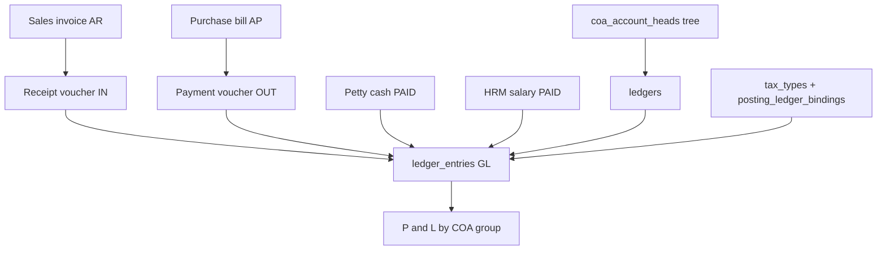
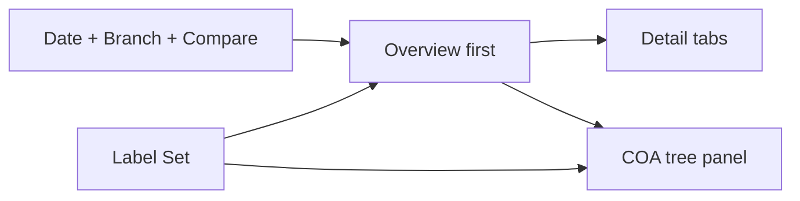
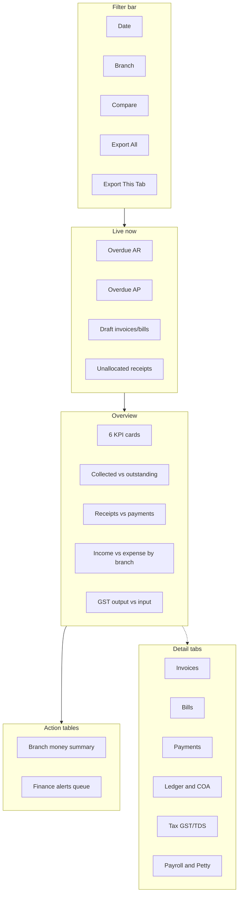

# Accounts & Finance Master Dashboard — Invoices · Bills · Payments · COA · GST/TDS · P&L (PRD / BRD)

> **Document type:** PRD + BRD analytics spec (Easy English)  
> **Hub module:** **Accounts & Finance Master** (one combined dashboard — Overview-first)  
> **Modules combined:** Sales Invoices (AR) · Purchase Bills (AP) · Vouchers / Payments (in & out) · Chart of Accounts · Ledgers · GST/TDS mapping · Payroll (HRM salary) · Petty Cash · (link-out) Procurement PO  
> **Audience:** T1–T5 (CEO → CFO → branch finance → auditor)  
> **Last analyzed:** 2026-07-28  
> **Sources:** Java Module 29 (Accounts), `FinancialService`, `InvoicingServiceImpl.summary`, `BillsServiceImpl.summary`, `PaymentsServiceImpl.summary`, `CoaAccountHead`, `posting_ledger_bindings`, `TaxTypeServiceImpl`, `AccountsDashboard.jsx`, `V109__seed_default_coa_and_ledgers.sql`

---

## Business requirements (Easy English)

**Problem:** Money data lives in many places — invoices, vendor bills, receipt/payment vouchers, ledgers, COA, tax config, salary, petty cash. Today the **Financial** dashboard card shows mostly **invoice revenue** plus unrelated task/stock charts. Finance cannot answer in one screen: What is our **true profit and loss**? How much **GST output vs input**? Which **COA nodes** are mapped for posting? What **TDS** is due? Are **receivables and payables** overdue? How much went to **salary and petty cash**?

**Goal:** One **Accounts & Finance Master** page — Overview-first — that ties **money in, money out, ledger truth, tax mapping, and operating costs** (salary + petty cash), with branch compare, COA tree health, action tables, and Excel export overall or per tab.

**Success looks like:**
1. CFO answers “Are we profitable this month and why?” in **under 3 minutes on Overview**
2. Finance lead sees **overdue AR + AP**, **net cash flow**, and **unallocated receipts** on Live strip
3. Accountant verifies **COA node → ledger → GST/TDS posting binding** without opening five modules
4. Auditor exports workbook with P&L trend, tax summary, ageing, and row-level invoice/bill/voucher detail

---

## Visualization strategy (data-analyst view)

### Design rule: Overview first — cash + books + tax together

| Layer | What user sees | Purpose |
|-------|----------------|---------|
| **1. Live strip** | Overdue invoices · Overdue bills · Net cash today · Draft docs · Unallocated receipts | Stop cash and compliance pain **today** |
| **2. Overview** | 6 KPIs + 3–4 charts + 2 action tables | Company money health |
| **3. Detail tabs** | Invoices · Bills · Payments · Ledger & COA · Tax (GST/TDS) · Payroll & Petty | Drill-down |
| **4. Excel export** | Overall or per-tab; graph + detail per sheet | Audit / GST filing / board pack |

### Money flow (Seravion)



### What belongs on Overview vs detail tabs

| Decision question | Put on Overview? | Put on detail tab? |
|-------------------|------------------|--------------------|
| Revenue / invoiced ₹ | Yes — KPI | Invoice list + ageing |
| Collected vs outstanding | Yes — KPI + donut | Receipt allocations |
| Payables / bills due | Yes — KPI + Live | Bill list + vendor ageing |
| Net cash flow (receipts − payments) | Yes — KPI | Voucher detail |
| Gross profit / expense ₹ (ledger-based) | Yes — KPI — **Gap** | COA P&L tree |
| GST output vs input | Yes — bar — **Gap** | Tax tab + HSN mapping |
| TDS payable / deducted | Yes — Live optional — **Gap** | Tax tab |
| COA mapping health (unbound keys) | No — config | COA / Tax tab |
| Salary + petty cash spend | Yes — stacked expense — **Gap** | Payroll & Petty tab |
| Technician productivity / stock | No — wrong domain | Link-out Task / Inventory |

### Overview “must-see” priority (ranked)

| Rank | Insight | Why first | Widget |
|------|---------|-----------|--------|
| 1 | Live exceptions | Cash stuck | Live strip |
| 2 | Outstanding AR + AP | Liquidity | KPI L3/L6 |
| 3 | Net cash flow | Bank reality | KPI L9 |
| 4 | Invoiced / collected | Sales health | KPI L1/L2 |
| 5 | P&L snapshot | Profit | KPI L11/L12 — **Gap** |
| 6 | GST net position | Compliance | Chart — **Gap** |
| 7 | Branch compare | Who owes / spends | Action Table 1 |
| 8 | What to do | Chase / pay / post | Action Table 2 |

---

## 1. Purpose & Business Need

| Stage | Business meaning | Key tables |
|-------|------------------|------------|
| **Sales invoice** | Customer revenue (AR) | `sales_invoices`, `sales_invoice_lines` — taxable_amount, cgst/sgst/igst, received/pending |
| **Purchase bill** | Vendor expense (AP) | `purchase_bills`, `purchase_bill_lines` — tds_applicable, tds_amount, expense_category |
| **Voucher** | Money in (RECEIPT) / out (PAYMENT) / journal / contra | `vouchers`, `voucher_allocations`, `voucher_journal_lines` |
| **COA tree** | Account structure | `coa_account_heads` — primary_group, parent_head_id, affects_gp, is_postable |
| **Ledger** | Posting account (party or internal) | `ledgers` — account_head_id, tds_applicable, tds_section, party_gstin |
| **GL entries** | Books of account | `ledger_entries` — dr/cr, ref_type, voucher_no |
| **Posting bindings** | System posting map | `posting_ledger_bindings` — posting_key → ledger_id |
| **Tax types** | HSN/GST rates + ledger map | `tax_types` — tax_category, sales_output_ledger_id, purchase_input_ledger_id |
| **Salary** | Payroll cost | `hrm_salary_month` — gross_salary, net_salary, pf, esi, tds, payment_status |
| **Petty cash** | Internal employee expense | `petty_cash_requests` — category, approved_amount, status PAID |

**Invoice status (`InvoiceStatus`):** `DRAFT` · `SENT` · `PARTIAL` · `PAID` · `OVERDUE` · `CANCELLED`  
**Bill status (`BillStatus`):** `DRAFT` · `PENDING` · `PARTIAL` · `PAID` · `OVERDUE` · `CANCELLED`  
**Voucher types:** `RECEIPT` · `PAYMENT` · `JOURNAL` · `CONTRA` (status `POSTED` / `VOID`)  
**COA primary groups (`CoaPrimaryGroup`):** `ASSET` · `LIABILITY` · `INCOME` · `EXPENSE` · `CAPITAL`

**Posting keys (`PostingLedgerKey`) — seeded defaults:**

| posting_key | Default ledger_code | Use |
|-------------|---------------------|-----|
| INVOICE_APPROVE_INCOME | SALES_INCOME | Sales income on invoice approve |
| BILL_CONFIRM_EXPENSE | PURCHASE_EXPENSE | Expense on bill confirm |
| TAX_CGST/SGST/IGST/CESS _OUTPUT | GST_*_OUTPUT | Sales GST |
| TAX_*_INPUT | GST_*_INPUT | Purchase GST credit |
| TDS_PAYABLE | TDS_PAYABLE | TDS liability |
| CUSTOMER_ADVANCE | CUSTOMER_ADVANCE | On-account receipts |

---

## 2. Combined dashboard (nearby modules)

Per [module-clusters.md](module-clusters.md) **Finance cluster**:

| Module | Why combined | RBAC Read | Where shown |
|--------|--------------|-----------|-------------|
| **Sales Invoices (hub)** | AR, revenue, GST out | `INVOICE_MANAGEMENT` | Overview + Invoices tab |
| **Purchase Bills** | AP, expense, GST in, TDS | `BILLS_MANAGEMENT` | Overview + Bills tab |
| **Payments / Vouchers** | Cash in & out | Payments Read (vouchers) | Overview + Payments tab |
| **COA + Ledgers** | P&L structure, balances | `LEDGER_MANAGEMENT` / COA Read | Ledger & COA tab |
| **Tax config** | GST/TDS ledger mapping | Tax Read | Tax tab |
| **HRM Salary** | Payroll expense | HRM / Salary Read | Payroll tab |
| **Petty Cash** | Internal spend | `PETTY_CASH_MANAGEMENT` | Payroll & Petty tab |
| **Procurement PO** | Pre-bill commitment | `PURCHASE_ORDER_MANAGEMENT` | Link-out only |

Hide each section if user lacks Read.



---

## 3. Comparison Label Set

| Label ID | Display label (Easy English) | Meaning | Unit | Overview? |
|----------|------------------------------|---------|------|-----------|
| L1 | Invoiced amount | SUM grand_total (approved invoices in period) | ₹ | KPI |
| L2 | Collected amount | SUM received_amount or receipt allocations | ₹ | KPI |
| L3 | Outstanding receivable | SUM pending_amount (SENT/PARTIAL/OVERDUE) | ₹ | KPI + Live |
| L4 | Collection rate | L2 / L1 × 100 (same period) | % | KPI |
| L5 | Bills confirmed | SUM net_payable (confirmed bills in period) | ₹ | KPI |
| L6 | Payables outstanding | SUM pending_amount (PENDING/PARTIAL/OVERDUE) | ₹ | KPI + Live |
| L7 | Bills paid | SUM net_payable where status = PAID (period) | ₹ | Detail |
| L8 | Overdue receivable | SUM pending where status = OVERDUE | ₹ | Live |
| L9 | Net cash flow | Receipt vouchers − Payment vouchers (POSTED, period) | ₹ | KPI |
| L10 | Receipts in | SUM gross_amount RECEIPT POSTED | ₹ | Chart |
| L11 | Payments out | SUM gross_amount PAYMENT POSTED | ₹ | Chart |
| L12 | Gross income | SUM CR−DR on COA INCOME (ledger_entries, period) — **Gap** | ₹ | KPI |
| L13 | Total expense | SUM DR−CR on COA EXPENSE (ledger_entries, period) — **Gap** | ₹ | KPI |
| L14 | Gross profit | L12 − expense on heads where affects_gp = true — **Gap** | ₹ | KPI |
| L15 | Net profit (simple) | L12 − L13 — **Gap** | ₹ | Optional KPI |
| L16 | GST output | SUM cgst+sgst+igst on sales_invoices (period) | ₹ | Chart |
| L17 | GST input | SUM cgst+sgst+igst on purchase_bills (period) | ₹ | Chart |
| L18 | GST net payable | L16 − L17 (simplified) | ₹ | Chart |
| L19 | TDS deducted | SUM tds_amount on bills + vouchers (period) — **Gap** | ₹ | Tax tab |
| L20 | TDS payable balance | Closing CR balance on TDS_PAYABLE ledger — **Gap** | ₹ | Tax tab |
| L21 | Payroll cost | SUM net_salary PAID in hrm_salary_month (period) | ₹ | Chart |
| L22 | Petty cash paid | SUM approved_amount status=PAID (period) | ₹ | Chart |
| L23 | Unallocated receipts | SUM unallocated_amount on POSTED RECEIPT — **Gap** | ₹ | Live |
| L24 | Ageing bucket | 0–30 / 31–60 / 61–90 / 90+ days on pending AR or AP | ₹ | Action table |

**Rules:** Same Label ID on UI, Excel axes, and Dictionary. Do not mix counts and ₹ on one axis without dual axis labels.

---

## 4. Users & Roles

| Tier | Roles | Scope | Uses Overview for… |
|------|-------|-------|---------------------|
| T1 Executive | CEO / CFO | All branches | P&L, cash, overdue, branch compare |
| T2 Regional | Finance head | Multi-branch | Ageing, GST net, payroll + petty |
| T3 Branch | Branch accountant | Own branch | Live strip, chase list |
| T4 Functional | AR/AP clerk | Assigned docs | Invoice / bill / voucher queues |
| T5 Audit | Auditor | Read + Export | Excel + COA mapping sheet |

---

## 5. Access Control (RBAC)

| Section | Permission | CEO bypass | Branch scope |
|---------|------------|------------|--------------|
| Invoice widgets | `INVOICE_MANAGEMENT` | Yes | sales_invoices.branch_id |
| Bill widgets | `BILLS_MANAGEMENT` | Yes | purchase_bills.branch_id |
| Payment widgets | Voucher Read | Yes | vouchers.branch_id |
| COA / Ledger | `LEDGER_MANAGEMENT` | Yes | ledger.branch_id / COA branch_scope |
| Tax bindings | Tax + Ledger Read | Yes | Company-wide |
| Salary | HRM Read | Yes | via user_branches |
| Petty cash | `PETTY_CASH_MANAGEMENT` | Yes | requester_branch_id |
| Export Excel (All) | Export on each included module | Yes | scope=overall |
| Export Excel (This tab) | Per active tab | Yes | scope=overview\|invoices\|… |

---

## 6. Global Filters & Live Update

| Filter | Type | Default | API param | Applies to |
|--------|------|---------|-----------|------------|
| Date range | 7d–YTD / custom | Last 30d | fromDate, toDate | invoice_date, bill_date, voucher_date, entry_date |
| Branch | Multi-select | User branches | branchIds | All money modules |
| Compare to | prior_period | prior_period | compareMode | KPI deltas — **Gap** |
| Document status | Multi | Active AR/AP set | status | Invoices / bills |
| COA group | Multi | INCOME+EXPENSE | primaryGroup | P&L charts |
| Fiscal period | MTD/QTD/YTD | MTD | fiscalMode | P&L — **Gap** |

| Widget group | Layer | Refresh |
|--------------|-------|---------|
| Live strip (overdue, unallocated) | Live | 60–120s |
| Outstanding AR/AP | Live | Ignores date filter (current balance) |
| Period revenue / expense / GST | Period | On filter change |

**Timezone:** IST for due dates, voucher dates, and ageing buckets.

---

## 7. Existing vs Recommended — Summary

| Area | Existing today | Recommended | Priority |
|------|----------------|-------------|----------|
| Layout | Financial card = invoice-heavy mix | **One Accounts master Overview-first** | P0 |
| KPIs | `get_kpis` returns `{}` | Wire Java summaries + ledger P&L | P0 |
| Charts | Revenue, tasks, stock, employee join | Finance-only charts + GST + cash | P0 |
| Vendor outstanding table | Uses **purchase_order**, not bills | Use **purchase_bills** pending | P0 |
| COA tree view | CRUD only, no analytics | Tree widget + mapping status | P0 |
| GST/TDS dashboard | Fields in entities, not aggregated | L16–L20 charts + binding audit | P0 |
| P&L | Not computed from GL | ledger_entries × coa_account_heads | P0 |
| Salary + petty | Not in financial service | L21/L22 expense stack | P1 |
| Live strip | None | Overdue AR/AP, drafts, unallocated | P0 |
| Mock UI | `FinancialDashboard.jsx`, `AccountFinancialSummary.jsx` use **static JSON** | Wire to master API | P1 |
| Excel | `accounts` in `modulesWithExport` (PDF charts only) | Full workbook + per-tab | P1 |
| Backend summaries | `/invoices/summary`, `/bills/summary`, `/payments/summary` exist | Orchestrator consumes them | P1 |

---

## 8. Visual Representation — Overview-first layout

### Wireframe



### ASCII Overview sketch

```
+------------------------------------------------------------------------+
| Filters: Date | Branch | Compare              [Export All][This Tab] |
+------------------------------------------------------------------------+
| LIVE: Overdue AR ₹12L | Overdue AP ₹4L | Drafts 6 | Unallocated ₹80K   |
+------------------------------------------------------------------------+
| KPI: Invoiced | Collected | Outstanding AR | Payables | Net cash | GP   |
+-----------------------------------+------------------------------------+
| Collected vs Outstanding (donut)  | Receipts vs Payments (line)        |
+-----------------------------------+------------------------------------+
| Branch Income vs Expense (bar)    | GST Output vs Input (clustered)    |
+------------------------------------------------------------------------+
| Action Table 1: Branch summary (AR, AP, cash, payroll, petty)          |
| Action Table 2: Chase invoice / Pay bill / Allocate receipt / Post     |
+------------------------------------------------------------------------+
| Tabs: [Invoices][Bills][Payments][Ledger&COA][Tax][Payroll&Petty]    |
+------------------------------------------------------------------------+
```

---

## 9. Live strip (detail)

| Chip | Label | Source |
|------|-------|--------|
| L8 | Overdue receivable | `InvoiceSummaryResponse.overdueAmount` or SUM pending OVERDUE |
| — | Overdue payables | `BillSummaryResponse.overdueAmount` |
| — | Draft invoices | `InvoiceSummaryResponse.draftCount` |
| — | Draft bills | `BillSummaryResponse.draftCount` |
| L23 | Unallocated receipts | `VoucherSummaryResponse.unallocatedAdvance` |
| — | Bills due in 7 days | due_date BETWEEN today AND today+7 — **Gap** |

---

## 10. Overview KPIs (6 cards)

| KPI | Label | Formula / source |
|-----|-------|------------------|
| 1 | Invoiced | L1 — SUM grand_total filtered period |
| 2 | Collected | L2 — existing `collection_vs_outstanding.collected` or summary paid MTD extended |
| 3 | Outstanding AR | L3 — `totalReceivable` from `/api/v1/invoices/summary` |
| 4 | Payables outstanding | L6 — `totalPayable` from `/api/v1/bills/summary` |
| 5 | Net cash flow | L9 — `/api/v1/payments/summary` netCashFlow (period-scoped — **Gap** in Java today) |
| 6 | Gross profit | L14 — ledger-based — **Gap** |

**Fast path (recommended orchestrator):** Parallel dashboard MS queries + Java summary endpoints until `GET /dashboard/accounts-finance/overview` exists.

---

## 11. Overview charts

| # | Chart | Type | Labels | Existing / Gap |
|---|-------|------|--------|----------------|
| 1 | Collected vs outstanding | Donut | L2, L3 | **Existing** `collection_vs_outstanding` |
| 2 | Receipts vs payments trend | Line (2 series) | Month · L10, L11 | **Gap** — extend voucher queries |
| 3 | Branch income vs expense | Clustered bar | Branch · L12, L13 | **Gap** — ledger_entries |
| 4 | GST output vs input | Clustered bar | Month · L16, L17 | **Gap** — invoice + bill tax columns |
| 5 | Operating cost stack | Stacked bar | L5+L21+L22 by branch | **Gap** |
| 6 | Invoice status | Donut | Status counts | **Existing** `invoice_status` |

**Remove from Accounts master (wrong domain):** `employee_growth`, `technician_productivity`, `chemical_consumption`, `task_summary` — keep on Task/HRM/Inventory dashboards.

---

## 12. COA tree & ledger configuration (detail tab)

### Purpose

Show **which COA node** exists, how it is configured, and how it connects to **GST, TDS, and posting**.

### COA tree widget (recommended)

**Data:** `coa_account_heads` self-join on `parent_head_id`.

| Column / node field | Meaning |
|---------------------|---------|
| code · name | Display in tree |
| primary_group | ASSET / LIABILITY / INCOME / EXPENSE / CAPITAL |
| nature | DR / CR |
| is_postable | Can post transactions? |
| affects_gp | Counts toward gross profit? |
| branch_scope | ALL or branch-specific |
| ledger_count | COUNT ledgers for this head — **Gap query** |
| period_balance | SUM signed movement from ledger_entries — **Gap** |

**ASCII tree example (seed COA):**

```
ASSET
├── 1000-SD Sundry Debtors
├── 1100-CASH Cash in Hand
├── 1200-BANK Bank Accounts
└── 1300-GST_INPUT GST Input Credit
LIABILITY
├── 2000-SC Sundry Creditors
├── 2100-GST_OUTPUT GST Output Payable
├── 2200-TDS_PAYABLE TDS Payable
└── 2300-CUSTOMER_ADV Customer Advance
INCOME
├── 4000-SALES_INCOME Sales Income [affects_gp]
└── 4100-SALES_ADJ Sales Adjustment
EXPENSE
├── 5000-PURCHASE_EXP Purchase Expense [affects_gp]
└── 5100-PURCHASE_ADJ Purchase Adjustment
```

### Posting binding matrix (Tax tab / COA tab)

**Source:** `GET /api/v1/ledgers/posting-bindings`

| posting_key | Effective ledger | GST/TDS role | Configured? |
|-------------|------------------|--------------|-------------|
| INVOICE_APPROVE_INCOME | ledger_name | Income | Yes/No |
| TAX_CGST_OUTPUT | … | GST out | Yes/No |
| TDS_PAYABLE | … | TDS | Yes/No |
| … | … | … | … |

**Alert:** posting_key with no binding AND no default ledger_code row — **Gap** audit widget.

### Tax type → ledger map

**Source:** `tax_types` — `sales_output_ledger_id`, `purchase_input_ledger_id` per `tax_category` (CENTRAL/STATE/INTEGRATED/CESS).

| tax_type name | rate | category | sales ledger | purchase ledger |
|---------------|------|----------|--------------|-----------------|
| GST 9% CGST | 9 | CENTRAL | GST_CGST_OUTPUT | GST_CGST_INPUT |

### Party ledger GST/TDS flags

From `ledgers`: `tds_applicable`, `tds_section`, `party_gstin`, `party_pan` — show count of active party ledgers missing GSTIN where invoices exist — **Gap** data quality KPI.

---

## 13. P&L & expense tracking (recommended logic)

### Gross income (L12) — from GL

```sql
SELECT COALESCE(SUM(le.cr_amount - le.dr_amount), 0)
FROM ledger_entries le
JOIN ledgers l ON l.id = le.ledger_id
JOIN coa_account_heads h ON h.id = l.account_head_id
WHERE h.primary_group = 'INCOME'
  AND le.posting_status = 'POSTED'
  AND le.entry_date BETWEEN :from AND :to
  AND (:branchIds IS NULL OR le.branch_id = ANY(:branchIds))
```

### Total expense (L13)

```sql
SELECT COALESCE(SUM(le.dr_amount - le.cr_amount), 0)
FROM ledger_entries le
JOIN ledgers l ON l.id = le.ledger_id
JOIN coa_account_heads h ON h.id = l.account_head_id
WHERE h.primary_group = 'EXPENSE'
  AND le.posting_status = 'POSTED'
  AND le.entry_date BETWEEN :from AND :to
  AND (:branchIds IS NULL OR le.branch_id = ANY(:branchIds))
```

### Gross profit (L14)

Same as L12 minus expense movement on heads where `affects_gp = true` only.

### Operating expense breakdown (Overview stack)

| Source | COA / table | Label |
|--------|-------------|-------|
| Vendor bills | purchase_bills.expense_category + GL | L5 |
| Payroll | hrm_salary_month.net_salary PAID | L21 |
| Petty cash | petty_cash_requests PAID by category | L22 |
| PO commitment | purchase_order (informational only) | Link-out |

**Note:** Until all modules post to GL, show **document-based** and **ledger-based** side-by-side with reconciliation flag — **Gap** UX.

---

## 14. Action tables

### Action Table 1 — Branch money summary

| Column | Source |
|--------|--------|
| branch_name | branches |
| invoiced | L1 per branch |
| collected | L2 per branch |
| outstanding_ar | L3 per branch |
| payables | L6 per branch |
| net_cash | L9 per branch — **Gap** |
| payroll_paid | L21 per branch — **Gap** |
| petty_paid | L22 per branch |
| Action | Filter branch |

### Action Table 2 — Finance alerts queue

| severity | domain | Examples | Actions |
|----------|--------|----------|---------|
| Critical | AR | Overdue &gt; 90d, large pending | **Send reminder**, **Record receipt** |
| Critical | AP | Overdue bill, TDS mismatch | **Pay bill**, **View bill** |
| High | Cash | Unallocated receipt | **Allocate voucher** |
| High | Tax | Missing posting binding | **Open COA config** |
| Medium | AR | Due in 7 days | **View invoice** |
| Medium | Docs | Draft invoice/bill aging | **Approve / Confirm** |

**Ageing (L24):** Bucket pending_amount by `due_date` vs today for invoices and bills.

---

## 15. Detail tabs

### Tab: Invoices

| Widget | Layer | Source |
|--------|-------|--------|
| KPI strip | Live + Period | Invoice summary |
| Status donut | Period | `invoice_status` chart |
| Revenue trend | Period | `country_revenue` / monthly |
| Ageing bar | Live | L24 AR |
| Table | Period | `invoice_details` + customer_revenue |

### Tab: Bills

| Widget | Layer | Source |
|--------|-------|--------|
| KPI strip | Live + Period | Bill summary |
| Status / expense category | Period | **Gap** — GROUP BY expense_category |
| Vendor payables table | Live | Replace PO-based vendor_outstanding with **purchase_bills** |
| TDS on bills | Period | SUM tds_amount — **Gap** |

### Tab: Payments

| Widget | Layer | Source |
|--------|-------|--------|
| Receipts vs payments | Period | vouchers by month |
| Net cash flow KPI | Period | L9 |
| Unallocated queue | Live | vouchers.unallocated_amount &gt; 0 |
| Voucher list | Period | **Gap** table |

### Tab: Ledger & COA

| Widget | Layer | Source |
|--------|-------|--------|
| COA tree + balances | Period | coa + ledger_entries |
| Top ledgers by movement | Period | **Gap** |
| Trial balance snapshot | Live | **Gap** |
| Posting binding list | Config | posting-bindings API |

### Tab: Tax (GST / TDS)

| Widget | Layer | Source |
|--------|-------|--------|
| GST output vs input | Period | L16/L17 |
| GST net | Period | L18 |
| TDS deducted | Period | L19 |
| TDS payable balance | Live | L20 |
| Tax type ledger map table | Config | tax_types |
| HSN mapping health | Config | **Gap** — unmapped HSN count |

### Tab: Payroll & Petty

| Widget | Layer | Source |
|--------|-------|--------|
| Payroll paid MTD | Period | hrm_salary_month |
| PF / ESI / TDS on salary | Period | sum columns |
| Petty cash by category | Period | petty_cash_requests |
| Unpaid salary count | Live | payment_status = UNPAID/DUE |

---

## 16. Excel Export — Overall + Per-Tab

### Export modes

| Mode | Workbook |
|------|----------|
| Export Excel (All) | All tabs user can Read |
| Export Excel (This tab) | Active tab only |

**Filename:** `Seravion_AccountsFinance_{scope}_{YYYYMMDD}.xlsx`

### API

| Item | Spec |
|------|------|
| Overall | `GET /dashboard/accounts-finance/export/excel?scope=overall&includeCharts=true` |
| Per tab | `?scope=overview \| invoices \| bills \| payments \| ledger \| tax \| payroll_petty` |
| Existing | `/dashboard/financial` PDF export via router — invoice charts only |

### Workbook sheets (overall)

| Sheet | Graph(s) | Detail |
|-------|----------|--------|
| Cover | — | Filters, Label Set, branch list |
| Overview_Summary | — | L1–L24 KPI values |
| Overview_Graphs | Donut collected/outstanding · Line cash · Bar GST · Bar branch P&L | Mini tables under each chart |
| Overview_Branch | — | Action Table 1 |
| Overview_Alerts | — | Action Table 2 + ageing |
| Invoices_Summary | Status pie · Revenue trend | invoice_details rows |
| Bills_Summary | Status · Expense category | purchase_bills rows — **Gap** |
| Payments_Summary | Receipts vs payments line | vouchers rows — **Gap** |
| COA_Tree | — | Full tree + balances + binding status |
| Tax_Summary | GST bar · TDS | tax_types + totals |
| Payroll_Petty | Stacked expense | salary + petty detail |
| Charts_Data | — | Excel Tables for dynamic charts |
| Dictionary | — | Label IDs, formulas, tables |

**Graphs sheet (MGI):** Minimum 4 charts — clustered branch bar (L12/L13), line cash (L10/L11), GST bar (L16/L17), donut AR (L2/L3). Axis titles = Label Set display labels. Major gridlines ON. Legend ON.

---

## 17. API Specification

### Existing — Dashboard microservice

| Method | Path | Purpose |
|--------|------|---------|
| GET | `/dashboard/financial` | Charts + tables (invoice-centric; KPIs empty) |

**Existing charts:** country_revenue, branch_revenue, revenue_breakup, collection_vs_outstanding, invoice_status, employee_growth, technician_productivity, chemical_consumption  

**Existing tables:** revenue_summary, customer_revenue, invoice_details, vendor_outstanding (PO-based), product_consumption, task_summary

### Existing — Java backend summaries

| Method | Path | Response fields |
|--------|------|-----------------|
| GET | `/api/v1/invoices/summary` | totalReceivable, overdueAmount, paidAmount (MTD), draftCount |
| GET | `/api/v1/bills/summary` | totalPayable, overdueAmount, paidAmount, draftCount |
| GET | `/api/v1/payments/summary` | totalReceipts, totalPayments, netCashFlow, unallocatedAdvance |
| GET | `/api/v1/ledgers/posting-bindings` | posting_key → effective ledger |
| GET | `/api/v1/chart-of-accounts/...` | COA CRUD list (no analytics) |

### Proposed — Orchestrator

| Method | Path | Response | Notes |
|--------|------|----------|-------|
| GET | `/dashboard/accounts-finance/overview` | live, kpis, charts, branchSummary, alerts | Thin BFF |
| GET | `/dashboard/accounts-finance/pl` | L12–L15 by period/branch | ledger_entries |
| GET | `/dashboard/accounts-finance/gst-summary` | L16–L18 | invoices + bills |
| GET | `/dashboard/accounts-finance/coa-tree` | tree nodes + balances + bindings | COA tab |
| GET | `/dashboard/accounts-finance/ageing` | L24 AR + AP | due_date buckets |
| GET | `/dashboard/accounts-finance/payroll-petty` | L21, L22 | HRM + petty |
| GET | `/dashboard/accounts-finance/export/excel` | scope + includeCharts | Recommended |

### Proposed GST summary (Gap)

```sql
SELECT
  COALESCE(SUM(si.cgst_amount + si.sgst_amount + si.igst_amount), 0) AS gst_output,
  (SELECT COALESCE(SUM(pb.cgst_amount + pb.sgst_amount + pb.igst_amount), 0)
   FROM purchase_bills pb WHERE {bill_filters}) AS gst_input
FROM sales_invoices si
WHERE si.status NOT IN ('DRAFT','CANCELLED') AND {invoice_filters}
```

### Proposed fix — vendor payables table

```sql
-- Replace PO-based vendor_outstanding
SELECT v.vendor_name,
       COALESCE(SUM(pb.paid_amount), 0),
       COALESCE(SUM(pb.pending_amount), 0),
       COALESCE(SUM(pb.net_payable), 0)
FROM vendors v
LEFT JOIN purchase_bills pb ON pb.vendor_id = v.id
  AND pb.status NOT IN ('DRAFT','CANCELLED')
WHERE {filters}
GROUP BY v.vendor_name
```

---

## 18. Cross-Module Interactions

| Module | Connection |
|--------|------------|
| Sales Order / Contract | Invoice source — sales_order_id, contract_id |
| Customer | AR party — customer_id, GST registrations |
| Vendor | AP party — vendor_id, vendor GSTIN snapshot on bill |
| Procurement PO | purchase_order_id on bill; PO ≠ payables |
| HRM | hrm_salary_month → expense; user tdsApplicable |
| Petty Cash | Internal expense; may link task_id |
| Tax / HSN | tax_types on invoice/bill lines |
| Inventory | Stock ledger NOT finance GL — do not mix on P&L |

---

## 19. Rules & Data Quality

- Branch scope: `user_branches` ∩ filter (CEO bypass)
- **Outstanding** KPIs = current balance (Live), not period-filtered
- Period revenue/expense uses document date or entry_date consistently — document in Dictionary
- Invoice `received_amount` / `pending_amount` maintained on invoice entity
- Bill `tds_amount` on confirm; voucher `tds_amount` on payment
- Voucher summary today is **all-time POSTED** — add date filter for period charts — **Gap**
- Do not use `purchase_order.grand_total` as vendor outstanding (existing bug)
- COA tree: inactive heads hidden by default
- IST for ageing and due dates

---

## 20. Gaps & Implementation Notes

1. **P0** — Accounts master page; Overview-first; remove non-finance widgets from financial card
2. **P0** — Implement KPIs (wire Java summaries + invoice/bill SQL)
3. **P0** — Fix vendor_outstanding → purchase_bills
4. **P0** — Live strip: overdue AR/AP, drafts, unallocated receipts
5. **P0** — P&L from ledger_entries + COA tree panel
6. **P0** — GST output/input charts; posting binding audit
7. **P0** — Action Table 2 with deep-links (receipt, payment, approve invoice, confirm bill)
8. **P1** — Payroll + petty cash expense widgets
9. **P1** — Ageing buckets L24
10. **P1** — Excel overall + per-tab with Graphs MGI
11. **P1** — Period filter on `/payments/summary`
12. **P2** — Document vs ledger reconciliation view
13. **P2** — Trial balance export
14. **P2** — Replace mock `FinancialDashboard` / `AccountFinancialSummary` JSON

---

## 21. Acceptance criteria

- [ ] Overview shows AR, AP, cash, and profit signals without opening tabs
- [ ] Live strip: overdue receivable, overdue payable, draft counts, unallocated receipts
- [ ] ≤6 KPIs use Label Set names; charts ≤4 on Overview
- [ ] Detail tabs: Invoices · Bills · Payments · Ledger&COA · Tax · Payroll&Petty (RBAC-gated)
- [ ] COA tree shows node config (group, nature, affects_gp, postable) and balance — **when API ready**
- [ ] GST/TDS mapping visible: posting bindings + tax_type ledger columns
- [ ] P&L numbers traceable to ledger_entries + coa_account_heads formulas in Dictionary
- [ ] Vendor payables use purchase_bills, not purchase_order
- [ ] Export Excel (All) and (This tab); Graphs sheet with axes, legend, gridlines, detail
- [ ] User sees only modules they can Read

---

## 22. Tips for Stakeholders

- **CFO:** Start Overview KPI row + GST chart; export Overview for board pack
- **AR clerk:** Live overdue chip → Action Table 2 → Record receipt
- **AP clerk:** Bills tab + overdue Live → Payment voucher
- **Accountant:** Ledger & COA tab to verify posting bindings before month-end
- **Auditor:** Export All — COA_Tree + Invoices_Detail + Bills_Detail + Dictionary

---

## 23. Existing Functionality Summary

**Available today:** Dashboard `/dashboard/financial` with invoice revenue trends, collection vs outstanding, invoice status, branch/customer revenue tables; Java summary endpoints for invoices, bills, and vouchers; full COA + ledger + posting binding + tax type APIs; rich tax columns on invoices/bills; seeded default COA and GST/TDS ledgers (`V109`); frontend `AccountsDashboard.jsx` wired to financial API (but KPIs empty and charts include non-finance data); accounts module listed for PDF export.

**Not available (recommended):** Unified Accounts & Finance master Overview; real KPIs; ledger-based P&L; COA tree analytics; GST/TDS dashboard aggregation; salary and petty cash on finance overview; correct AP/vendor ageing from bills; Live finance strip; ageing buckets; document vs GL reconciliation; full Excel workbook with per-tab Graphs + detail; removal of mock financial dashboards.

**Related spec:** Internal employee expenses also covered in [operations-support-spend-dashboard.md](operations-support-spend-dashboard.md) (Petty Cash + Support cluster).
