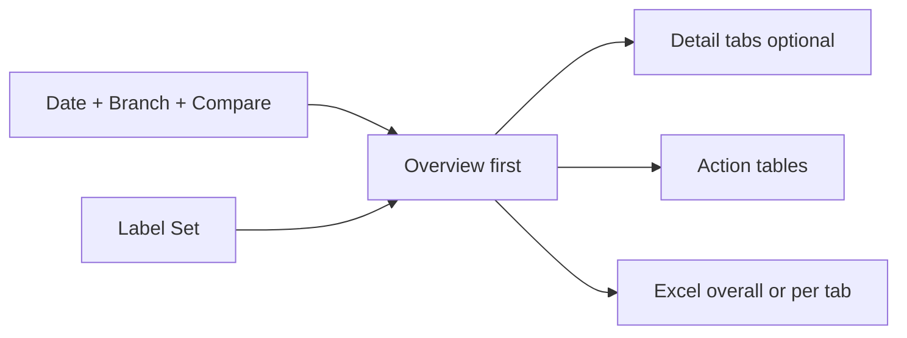
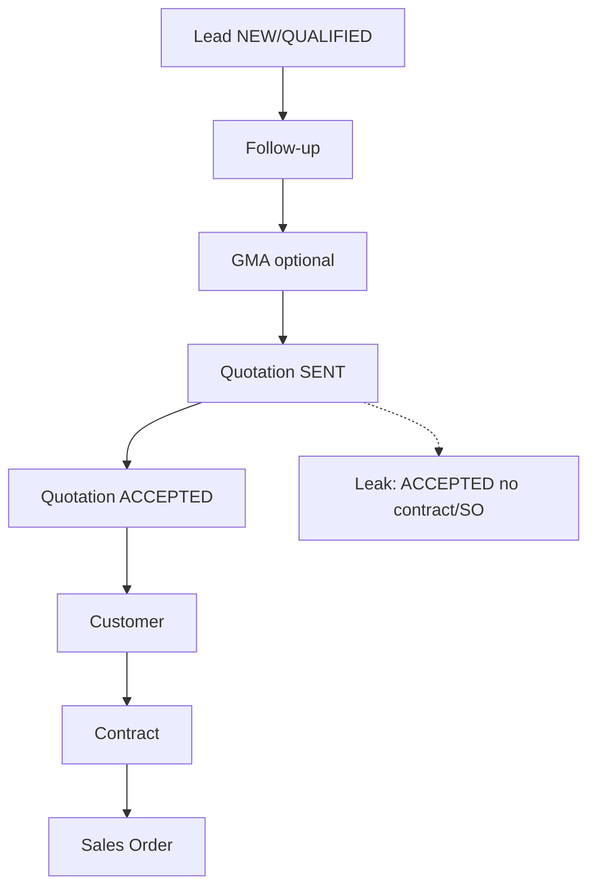
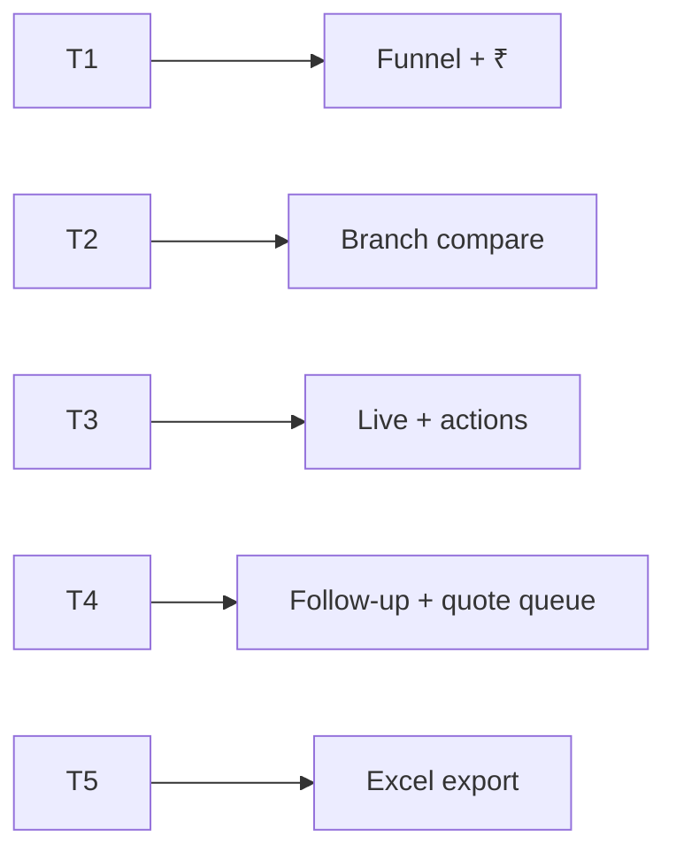
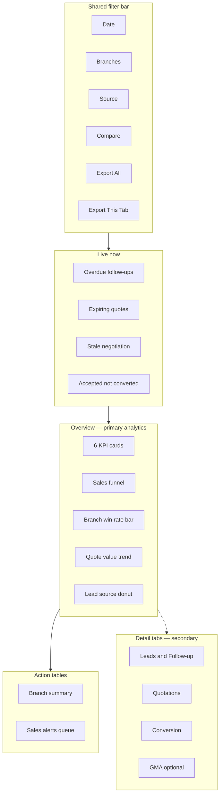

# CRM Sales Pipeline Master Dashboard — Lead · Follow-up · Quotation · Contract / SO (PRD / BRD)

> **Document type:** PRD + BRD analytics spec (Easy English)  
> **Hub module:** **CRM Sales Pipeline Master** (one combined dashboard — Overview-first)  
> **Modules combined:** Lead Management · Follow-up Management · Quotation Management · Conversion to Contract & Sales Order · (optional) GMA from Lead  
> **Audience:** T1–T5  
> **Last analyzed:** 2026-07-28  
> **Sources:** `LeadService`, `QuotationService`, `GMAService`, `ContractService`, `SalesOrderService`, `overview_service.py`, Java modules 15–16–21–22, frontend `LeadDashboard` / `QuotationDashboard`

---

## Business requirements (Easy English)

**Problem:** Sales leaders open **Lead** and **Quotation** as separate dashboard cards. They cannot see in one place: How healthy is the **pipeline**? How many leads become **quotations**, then **contracts**, then **sales orders**? Which follow-ups are **overdue**? Which **accepted quotes** never became a contract or SO?

**Goal:** One **CRM Sales Pipeline** page — Overview-first — that shows the full **Lead → Follow-up → Quotation → Contract → Sales Order** story, with conversion insights, action tables, and Excel export overall or per tab.

**Success looks like:**
1. Sales manager answers “What is stuck in the funnel and what must we call today?” in **under 2 minutes on Overview**
2. CEO sees **win rate**, **quote acceptance**, and **quote-to-contract / quote-to-SO** conversion by branch
3. Reps use action tables to follow up, chase expiring quotes, and convert accepted quotes to contract/SO
4. Auditor exports workbook with funnel charts **and** row-level lead/quote/conversion detail

---

## Visualization strategy (data-analyst view)

### Design rule: Overview first — not a tab-heavy home

| Layer | What user sees | Purpose |
|-------|----------------|---------|
| **1. Overview (always visible)** | Live strip + 6 KPIs + 3–4 primary charts + 2 action tables | Answer “how healthy is CRM pipeline?” |
| **2. Detail tabs (secondary)** | Leads · Quotations · Conversion funnel · (optional) GMA | Drill when Overview is not enough |
| **3. Action tables** | Branch summary + sales alerts queue | What to do next |
| **4. Excel export** | Overall workbook **or** per-tab workbook; each sheet = KPI + graph(s) + detail table | Stand-up / audit / branch review |

**Anti-pattern:** Four equal tabs as home — user must click before seeing pipeline health.

### What belongs on Overview vs detail tabs

| Decision question | Put on Overview? | Put on detail tab? |
|-------------------|------------------|--------------------|
| Active leads + qualified count | Yes — KPI | Full lead list by status |
| Overdue / pending follow-ups | Yes — Live + KPI | Full follow-up calendar |
| Lead win rate % | Yes — KPI | Monthly created vs converted |
| Quote acceptance % + pipeline ₹ | Yes — KPI | Quote status deep-dive |
| **Quote → Contract / SO conversion** | Yes — KPI or funnel chart | Full conversion bridge table |
| Lead source / priority mix | Yes — one chart each or combined | Source × branch matrix |
| Stale negotiation / urgent leads | Yes — Live + alert table | Full negotiation list |
| GMA pending from lead | Optional Live chip | GMA detail tab |
| Full recent leads / high-value quotes | No — noise | Domain tab + Excel |

### Overview “must-see” priority (ranked)

| Rank | Insight | Why first | Widget |
|------|---------|-----------|--------|
| 1 | Live exceptions | Revenue stops today | Live strip |
| 2 | Pipeline value | How much ₹ in play? | KPI L14 / L10 |
| 3 | Win + acceptance rates | Are we closing? | KPI L4, L9 |
| 4 | **Funnel conversion** | Lead → Quote → Contract → SO | Funnel chart |
| 5 | Branch compare | Who is behind? | Multi-bar |
| 6 | Follow-up discipline | Calls happening? | Line L7 |
| 7 | What to do | Who to call / convert | Action tables |

---

## 1. Purpose & Business Need

CRM core chain in Seravion Connect:

```
Lead (prospect)
  → Follow-up (interactions, next_follow_up_date)
    → GMA (optional — cost/price from lead, gma_status on lead)
      → Quotation (FROM_LEAD / FROM_CUSTOMER / NEW_PROSPECT)
        → Customer (on quote accept / manual convert)
          → Contract (quotations.contract_id, event CONVERTED_TO_CONTRACT)
            → Sales Order (quotations.sales_order_consumed, eligible accepted quotes)
```

| Stage | Business meaning | Key fields / tables |
|-------|------------------|---------------------|
| **Lead** | Raw opportunity | `leads.status`, `source`, `priority`, `assigned_to_id`, `gma_status` |
| **Follow-up** | Sales touchpoints | `follow_ups`, `leads.next_follow_up_date` |
| **Quotation** | Priced offer | `quotations.status`, `grand_total`, `lead_id`, `valid_till`, `contract_id`, `sales_order_consumed` |
| **Contract** | Signed AMC / agreement | `contracts` linked via `quotations.contract_id` |
| **Sales Order** | Booked work / revenue | `sales_orders`; quote `sales_order_consumed = true` when used |

**Lead statuses (`LeadStatus`):** `DRAFT` · `NEW` · `QUALIFIED` · `QUOTATION_SENT` · `NEGOTIATION` · `LOST` · `CONVERTED`

**Quotation statuses (`QuotationStatus`):** `DRAFT` · `SENT` · `VIEWED` · `ACCEPTED` · `REJECTED` · `EXPIRED` · `REVISED`

**Evidence — lead updates on quote flow (Java `QuotationServiceImpl`):**
- Quote **sent** → lead may move to `QUOTATION_SENT`
- Quote **accepted** → lead moves to `CONVERTED`

### Conversion definitions (product language)

| Metric | Easy English | Formula (recommended) | Exists today? |
|--------|--------------|----------------------|---------------|
| **Lead win rate (L4)** | Of closed leads, how many won? | CONVERTED ÷ (CONVERTED + LOST) × 100 | Yes — `LeadRepository.conversion_rate` |
| **Quote acceptance (L9)** | Of all quotes in period, how many accepted? | ACCEPTED ÷ total quotes × 100 | Yes — `QuotationRepository.accepted_rate` |
| **Lead → Quote rate** | Qualified leads that got a quote | DISTINCT lead_id on quotations ÷ qualified leads | **Gap** on dashboard |
| **Quote → Contract rate (L12)** | Accepted quotes that became contract | COUNT(contract_id NOT NULL AND status=ACCEPTED) ÷ ACCEPTED × 100 | **Gap** — field exists |
| **Quote → SO rate (L13)** | Accepted quotes consumed as SO | COUNT(sales_order_consumed=true) ÷ ACCEPTED × 100 | **Gap** — field exists |
| **Pipeline leakage** | Accepted but no contract **and** no SO | ACCEPTED · contract_id IS NULL · sales_order_consumed=false | **Gap** — high-value action insight |

### Outcomes today

| Area | What exists |
|------|-------------|
| Lead card | `GET /dashboard/lead_followup` — KPIs: active, qualified, conversion_rate, pending_followups; charts: status, source, priority, followup_activity; tables: recent_leads, upcoming_followups; alerts: urgent, pending negotiation, overdue_followups |
| Quotation card | `GET /dashboard/quotation` — KPIs: total_quotes, accepted_rate, total_value, average_value; charts: status, monthly value, branch, source; tables: high_value_quotes, expiring_quotes; alerts: low_acceptance, high_value_pending, critical_expiry |
| GMA card | Separate `/dashboard/gma` — `FROM_LEAD` source in GMA entity |
| Overview | Partial lead + quotation KPIs; charts `cmp_leads_created_vs_converted`, `cmp_quotations_vs_sales_orders` (monthly counts only — **not** linked funnel) |
| Alerts | Computed in services — **router does not return alerts** to standard GET; UI never shows them |
| Conversion bridge | **No** unified quote→contract→SO analytics |
| Excel export | Lead/Quotation **not** in frontend `modulesWithExport` list |
| RBAC split | `lead_followup` needs `LEADS_MANAGEMENT` + `FOLLOW_UP_MANAGEMENT`; quotation needs `QUOTATION_MANAGEMENT` |

### Outcomes recommended

- One master page, **Overview-first**
- Unified funnel: Lead → Quote → Contract → SO with branch compare
- Live strip + action tables with deep-links (`/lead-management`, `/quotation-management`, contract/SO screens)
- Excel **overall + per tab**; each module sheet = KPI + graph(s) + detail rows
- Optional GMA-from-lead tab for pricing stage visibility

---

## 2. Combined dashboard (nearby modules)

| Module | Why combined | RBAC Read | Where shown |
|--------|--------------|-----------|-------------|
| **Lead (hub)** | Top of funnel | `LEADS_MANAGEMENT` | Overview KPIs + Leads tab |
| **Follow-up** | Drives conversion | `FOLLOW_UP_MANAGEMENT` | Live strip + Leads tab |
| **Quotation** | Priced pipeline | `QUOTATION_MANAGEMENT` | Overview KPIs + Quotes tab |
| **Contract conversion** | Quote → signed deal | `CUSTOMER_CONTRACT` / Contract Read | Funnel + Conversion tab |
| **Sales Order conversion** | Quote → booked revenue | `SALES_ORDER_MANAGEMENT` | Funnel + Conversion tab |
| **GMA (optional)** | Pre-quote pricing from lead | `GMA_SHEET_MANAGEMENT` | Optional tab / Live chip |

Hide domain widgets if no Read. Overview shows whatever user can see.



### Business flow



---

## 3. Comparison Label Set

| Label ID | Display label (Easy English) | Meaning | Unit | Overview? |
|----------|------------------------------|---------|------|-----------|
| L1 | Active leads | status NOT IN (LOST, CONVERTED) | count | KPI |
| L2 | New leads | created in period | count | KPI |
| L3 | Qualified leads | status = QUALIFIED | count | KPI / funnel |
| L4 | Lead win rate % | CONVERTED ÷ (CONVERTED + LOST) × 100 | % | KPI |
| L5 | Pending follow-ups | next_follow_up_date ≥ today (open leads) | count | Live |
| L6 | Overdue follow-ups | next_follow_up_date &lt; today (open leads) | count | Live + KPI |
| L7 | Follow-up activity | COUNT follow_ups in period | count | Line chart |
| L8 | Total quotations | quotes in period | count | KPI / funnel |
| L9 | Quote acceptance % | ACCEPTED ÷ total quotes × 100 | % | KPI |
| L10 | Quotation value | SUM grand_total in period | ₹ | KPI |
| L11 | Accepted quote value | SUM grand_total where ACCEPTED | ₹ | KPI / funnel |
| L12 | Quote → Contract % | quotes with contract_id ÷ ACCEPTED × 100 | % | KPI + funnel — **Gap** |
| L13 | Quote → SO % | sales_order_consumed=true ÷ ACCEPTED × 100 | % | KPI + funnel — **Gap** |
| L14 | Pipeline value | SUM grand_total SENT \| VIEWED \| NEGOTIATION-stage open | ₹ | KPI |
| L15 | Expiring quotes 3d | valid_till within 3 days, status SENT | count | Live |
| L16 | Stale negotiation | NEGOTIATION past threshold (urgent 2d / normal 7d) | count | Live |
| L17 | Urgent new leads | priority URGENT + status NEW | count | Live |
| L18 | Accepted not converted | ACCEPTED · no contract_id · not sales_order_consumed | count | Live — **Gap** |
| L19 | GMA pending from lead | leads gma_status NOT_CREATED (qualified+) | count | Detail — optional |
| L20 | Lead → Quote % | leads with ≥1 quotation ÷ qualified × 100 | % | Funnel — **Gap** |

**Rules:** Same Label ID = same formula in Overview, detail tabs, Excel axes. Never mix ₹ and counts on one unlabelled axis.

**Compare modes:** Branch vs Branch · Current vs Prior period · Source vs Source (same unit only)

---

## 4. Users & Roles (who sees what)

| Tier | Roles | Scope | Uses Overview for… |
|------|-------|-------|---------------------|
| T1 Executive | CEO, Owner | All branches | L4, L9, L12, L13, funnel, branch bar |
| T2 Regional | Sales head / RM | Multi-branch | Branch compare + conversion leakage |
| T3 Branch | Branch sales lead | Own branch | Live strip + action tables |
| T4 Functional | Sales rep / inside sales | Assigned leads | Overdue follow-ups + expiring quotes |
| T5 Audit | Auditor | Read + Export | Excel overall + Dictionary |



---

## 5. Access Control (RBAC)

| Section | Permission | CEO bypass | Branch scope |
|---------|------------|------------|--------------|
| Overview (partial) | Any of Leads / Follow-up / Quotation Read | Yes | user_branches ∩ filter |
| Lead widgets | `LEADS_MANAGEMENT` Read | Yes | leads.branch_id |
| Follow-up widgets | `FOLLOW_UP_MANAGEMENT` Read | Yes | via leads.branch_id |
| Quotation widgets | `QUOTATION_MANAGEMENT` Read | Yes | quotation_locations.branch_id |
| Conversion (Contract/SO) | Quotation Read + Contract and/or SO Read | Yes | join branches |
| GMA (optional) | `GMA_SHEET_MANAGEMENT` Read | Yes | gma branch |
| Export Excel (All) | Export on included modules (or CEO) | Yes | scope=overall |
| Export Excel (This tab) | Export on active tab module | Yes | scope=overview\|leads\|quotations\|conversion\|gma |

| Widget | T1 | T2 | T3 | T4 | T5 |
|--------|----|----|----|----|-----|
| Live strip | ✓ | ✓ | ✓ | ✓ | ✓ |
| Overview KPIs + funnel | ✓ | ✓ | ✓ | partial | ✓ |
| Detail tabs | ✓ | ✓ | ✓ | ✓ | ✓ |
| Action tables | ✓ | ✓ | ✓ | ✓ | ✓ |
| Export | ✓ | ✓ | ✓ | if Export | ✓ |

---

## 6. Global Filters & Live Update

| Filter | Type | Default | API param | Behavior |
|--------|------|---------|-----------|----------|
| Date range | 7d / 15d / 30d / MTD / QTD / YTD / custom | Last 30d | fromDate, toDate | Shared by Overview + tabs + Excel |
| Branch | Multi-select | User branches | branchIds | Leads by branch_id; quotes by quotation_locations |
| Compare to | prior_period / prior_year | prior_period | compareMode | KPI deltas (**Gap** on lead/quote cards) |
| Lead source | Multi | All | leadSource | Filters lead charts/tables |
| Quote source | Multi | All | sourceType | FROM_LEAD / FROM_CUSTOMER / NEW_PROSPECT |
| Assigned to | User (T4) | All | assignedToId | Rep-scoped view |
| Service mode | Multi | All | serviceMode | ONE_TIME / CONTRACT on quotations |

| Widget group | Layer | Method | Interval |
|--------------|-------|--------|----------|
| Live strip | Live | Poll | 60–120s |
| Overview KPIs / charts | Period | Filter + poll | 60–120s |
| Detail tabs | Period | On tab open + filter | — |
| Action tables | Period | Filter + pagination | — |

---

## 7. Existing vs Recommended — Summary

| Area | Existing today | Recommended | Priority |
|------|----------------|-------------|----------|
| Layout | Separate Lead + Quotation cards | **One page: Overview-first + detail tabs** | P0 |
| Overview content | None unified | Live + 6 KPIs + funnel + 2 action tables | P0 |
| Conversion funnel | Overview monthly compare charts only | **Lead → Quote → Contract → SO** with L12/L13 | P0 |
| Follow-up discipline | Chart exists; alerts unused | Live L5/L6 + Action Table 2 | P0 |
| Quote leakage | No insight | L18 Accepted-not-converted queue | P0 |
| Alerts | In services; not in UI | Wire overdue follow-up, expiring quotes, stale negotiation | P0 |
| Action tables | Display-only | Branch summary + queue with deep-links | P0 |
| GMA from lead | Separate card | Optional detail tab / Live L19 | P1 |
| Excel | Not in UI export list | **Overall + per-tab**; graph + detail per sheet | P1 |
| Unified API | 2 endpoints | `GET /dashboard/crm-pipeline/overview` | P1 |

---

## 8. Visual Representation — Overview-first layout

### Wireframe



### Widget placement map

| Zone | Widgets | Desktop | Mobile | Live/Period |
|------|---------|---------|--------|-------------|
| Top | Filters + Export buttons | full | stacked | — |
| Live strip | L6, L15, L16, L18 | full | scroll | Live |
| Overview KPIs | L1, L4, L9, L10, L12, L14 *(swap if partial RBAC)* | 6 cards | 2-col | Period |
| Overview charts | Funnel + branch bar + quote trend + source | 2×2 | stacked | Period |
| Action tables | Branch summary + Sales queue | full | full | Period |
| Detail tabs | Below fold | full | accordion | Period |

### ASCII Overview sketch

```
+------------------------------------------------------------------+
| Filters: Date | Branches | Source | Compare  [Export All] [Tab]  |
+------------------------------------------------------------------+
| LIVE: Overdue F/U 12 | Expiring quotes 5 | Stale neg 8 | Leak 3  |
+------------------------------------------------------------------+
| KPI: Active | Win% | Accept% | Quote ₹ | Quote→Contract% | Pipe ₹|
+-----------------------------------+--------------------------------+
| Sales funnel (Lead→Quote→Contract→SO) | Branch win rate (bar)      |
+-----------------------------------+--------------------------------+
| Quote value trend (line)          | Lead source mix (donut)        |
+------------------------------------------------------------------+
| Action Table 1: Branch summary                                     |
| Action Table 2: Call today / Send quote / Convert accepted         |
+------------------------------------------------------------------+
| Tabs: [Leads] [Quotations] [Conversion] [GMA]                      |
+------------------------------------------------------------------+
```

---

## 9. Live strip (detail)

| Chip | Label | Formula / source | Deep-link |
|------|-------|------------------|-----------|
| L6 | Overdue follow-ups | `next_follow_up_date < today` · open lead | Action Table 2 · domain=followup |
| L15 | Expiring quotes | `valid_till` ≤ today+3 · status SENT | Action Table 2 · domain=quote |
| L16 | Stale negotiation | Existing `pending_leads` alert logic | Action Table 2 · domain=lead |
| L17 | Urgent new leads | Existing `urgent_leads` alert | Action Table 2 · domain=lead |
| L18 | Accepted not converted | ACCEPTED · no contract_id · not sales_order_consumed | Conversion tab — **Gap** |

Empty state: “No live sales exceptions — pipeline looks on track.”

---

## 10. Overview KPIs (detail)

| KPI | Label | Formula | Delta | Empty |
|-----|-------|---------|-------|-------|
| 1 | Active leads (L1) | NOT IN (LOST, CONVERTED) | vs prior | 0 |
| 2 | Lead win rate (L4) | CONVERTED ÷ (CONVERTED+LOST) | pp vs prior | — |
| 3 | Quote acceptance (L9) | ACCEPTED ÷ total quotes | pp vs prior | — |
| 4 | Quotation value (L10) | SUM grand_total | vs prior | ₹0 |
| 5 | Quote → Contract (L12) | contract_id set ÷ ACCEPTED | pp vs prior | — |
| 6 | Pipeline value (L14) | SUM open quote ₹ (SENT/VIEWED) | vs prior | ₹0 |

**Optional swap:** No Contract Read → show L11 (Accepted quote ₹) instead of L12.

**Fast path (P0):** Parallel `GET /dashboard/lead_followup` + `GET /dashboard/quotation`. Map existing KPIs. L12/L13/L18 need new queries (**Gap**).

---

## 11. Overview charts (detail)

| # | Chart | Type | Labels | Data source | Empty |
|---|-------|------|--------|-------------|-------|
| 1 | **Sales funnel** | Funnel / stacked bar | L3 → L8 → L11 → L12 stage counts | New orchestrator — **Gap** | “No pipeline data” |
| 2 | Branch lead win rate | Clustered column | Branch · L4 | Branch × conversion — **Gap** | — |
| 3 | Quotation value trend | Line | Month · L10 | Quotation `monthly` chart | — |
| 4 | Lead source mix | Donut | Source · count | Lead `source` chart | — |

**Optional 5th:** `cmp_leads_created_vs_converted` from Overview API (monthly line) on Conversion tab.

**Chart click → table filter:** Funnel stage click → Action Table 2; branch bar → Action Table 1 branch row.

### Funnel stages (recommended)

| Stage | Count definition |
|-------|------------------|
| Qualified leads | L3 |
| Leads with quotation | DISTINCT lead_id on quotations (FROM_LEAD) — **Gap** |
| Quotes sent | status IN (SENT, VIEWED, ACCEPTED, REJECTED) |
| Quotes accepted | status = ACCEPTED (L11 count + ₹) |
| Contracts created | ACCEPTED AND contract_id IS NOT NULL |
| Sales orders booked | ACCEPTED AND sales_order_consumed = true |

### Detail tabs (secondary)

#### Tab A — Leads & Follow-up

| Widget | Source |
|--------|--------|
| Status donut | Lead `status_wise` |
| Priority bar | Lead `priority` |
| Follow-up activity line | Lead `followup_activity` |
| Tables | `recent_leads`, `upcoming_followups` + View → lead detail |
| Actions | Log follow-up, Qualify, Mark lost |

#### Tab B — Quotations

| Widget | Source |
|--------|--------|
| Status donut | Quotation `status` |
| Branch value bar | Quotation `branch` |
| Source mix | Quotation `source` |
| Tables | `high_value_quotes`, `expiring_quotes` |
| Actions | Send, Accept, Revise, View |

#### Tab C — Conversion (Contract & Sales Order)

| Widget | Purpose |
|--------|---------|
| Monthly created vs converted leads | Overview `cmp_leads_created_vs_converted` |
| Monthly quotations vs sales orders | Overview `cmp_quotations_vs_sales_orders` |
| **Conversion bridge table** | lead_id → quote # → contract_id → SO consumed |
| KPI strip | L12, L13, L18, L20 |
| Actions | Create contract from quote, Create SO from accepted quote |

**Conversion bridge columns (Action-ready):**

| Column | Source |
|--------|--------|
| lead_name / lead_id | leads |
| quotation_number | quotations |
| quote_status | quotations.status |
| grand_total | quotations |
| accepted_at | quotations |
| contract_id | quotations |
| contract_status | contracts join — **Gap** |
| sales_order_consumed | quotations |
| so_number | sales_orders join on quote — **Gap** if no FK |
| branch_name | leads / quotation_locations |
| assigned_to | leads.assigned_to_id |
| days_since_accepted | calc |
| Action | Convert / View contract / Create SO |

#### Tab D — GMA from Lead (optional)

| Widget | Source |
|--------|--------|
| Pending GMA from leads | leads.gma_status + gma_sheets.lead_id |
| GMA KPIs | `/dashboard/gma` filtered source_type FROM_LEAD |
| Actions | Create GMA, Approve |

---

## 12. Action tables

### Action Table 1 — Branch summary

| Column | Label | Source |
|--------|-------|--------|
| branch_name | Branch | branches |
| active_leads | L1 | leads |
| qualified | L3 | leads |
| win_rate_pct | L4 | calc |
| quotations | L8 | quotations via quotation_locations |
| acceptance_pct | L9 | calc |
| quote_value | L10 | SUM grand_total |
| quote_to_contract_pct | L12 | calc — **Gap** |
| pipeline_value | L14 | open quotes |
| Action | View branch | Apply filter |

First row: **All Branches**.

### Action Table 2 — Sales alerts queue

Unified queue: severity · domain · ref · customer/lead · next action.

| Column | Easy English | Source |
|--------|--------------|--------|
| severity | Critical / High / Medium | rule map |
| domain | Follow-up / Lead / Quote / Conversion | — |
| ref_no | Lead # / Quote # | ids |
| lead_or_client_name | Name | leads / quotation client |
| branch_name | Branch | join |
| amount | ₹ if quote | grand_total |
| due_or_expiry_date | next_follow_up / valid_till | dates |
| status | Lead or quote status | — |
| message | Reason | e.g. “Follow-up 3 days overdue” |
| Action | **Call** / **Send quote** / **Convert** / **View** | deep-links |

**Existing alert seeds (wire first):**

| Alert | Module | Action |
|-------|--------|--------|
| `overdue_followups` | Lead | Call / reschedule |
| `urgent_leads` | Lead | Qualify / assign |
| `pending_leads` | Lead | Close negotiation |
| `expiring_quotes` | Quotation | Extend / call client |
| `high_value_pending` | Quotation | Chase acceptance |
| `critical_expiry` | Quotation | Same-day action |
| `low_acceptance_alert` | Quotation | Branch coaching flag |

**New rows (Gap):** L18 accepted-not-converted; qualified lead with no quotation &gt; N days.

---

## 13. Insights we can provide (complete CRM view)

| # | Insight | Easy English question | Data | Decision |
|---|---------|----------------------|------|----------|
| 1 | Pipeline health | How many active leads? | L1, L3 | Hiring / capacity |
| 2 | Follow-up discipline | Who missed calls? | L6, overdue list | Daily stand-up |
| 3 | Win rate | Are we closing leads? | L4 by branch/source | Coaching |
| 4 | Quote velocity | Qualified → quote speed | L20, timestamps | Process fix |
| 5 | Acceptance rate | Are quotes good? | L9 | Pricing / scope |
| 6 | Pipeline ₹ | Money in play? | L14, L10 | Forecast |
| 7 | **Quote → Contract** | Accepted deals signed? | L12, L18 | Legal / ops push |
| 8 | **Quote → SO** | Revenue booked? | L13 | Handoff to field ops |
| 9 | Source ROI | Which source converts? | source × L4/L9 | Marketing spend |
| 10 | Rep performance | Win rate by assigned_to | leads.assigned_to_id | Targets |
| 11 | Expiring quotes | Quotes about to die? | L15 | Urgent chase |
| 12 | Stale negotiation | Deals going cold? | L16 | Manager escalation |
| 13 | GMA bottleneck | Qualified but no pricing sheet? | L19 | Pre-quote block |
| 14 | Branch compare | Mumbai vs Pune funnel | Action Table 1 | Resource shift |
| 15 | Leakage ₹ | Accepted ₹ not on contract/SO | SUM grand_total L18 rows | CEO priority list |

---

## 14. Excel Export Package — Overall + Per-Tab (Graph + Detail on Every Sheet)

### Export modes

| Mode | UI button | Workbook scope |
|------|-----------|----------------|
| **Overall** | `Export Excel (All)` | Full CRM pipeline — all modules user can Read |
| **Per tab** | `Export Excel (This tab)` | Active tab only + mini Cover |

**Filename:** `Seravion_CRM_{scope}_{YYYYMMDD}_{from}_to_{to}_{branchCount}br.xlsx`

### Core rule: every module sheet = KPI + graph(s) + detail table

### Export trigger (API)

| Item | Spec |
|------|------|
| Overall | `GET /dashboard/crm-pipeline/export/excel?scope=overall&includeCharts=true` |
| Per tab | `?scope=overview \| leads \| quotations \| conversion \| gma` |
| Params | fromDate, toDate, branchIds, compareMode, leadSource, sourceType |
| Existing partial | Generic `/dashboard/lead_followup/export/excel`, `/dashboard/quotation/export/excel` (tables only if wired) |

### A. Overall export workbook

| Sheet | Graph(s) | Detail on same sheet |
|-------|----------|----------------------|
| Cover | — | Filters, Label Set index |
| Overview_Summary | — | L1–L20 KPI block + deltas |
| Overview_Graphs | Funnel · Branch win bar · Quote trend · Source donut | Mini tables under charts |
| Overview_Branch | Clustered bar | Action Table 1 rows |
| Overview_Alerts | — | Action Table 2 rows |
| Leads_Summary | Status donut · Priority bar · Follow-up line | KPI L1–L7 |
| Leads_Detail | — | recent_leads + overdue_followups + urgent + stale |
| Followups_Detail | — | upcoming_followups + follow_ups log rows — **Gap** full log export |
| Quotations_Summary | Status donut · Branch value · Source mix | KPI L8–L11, L14 |
| Quotations_Detail | — | high_value + expiring + all quotes in period |
| Conversion_Summary | Created vs converted line · Quotes vs SO line | KPI L12, L13, L18, L20 |
| Conversion_Bridge | Funnel chart | lead → quote → contract → SO rows (§11 Tab C) |
| GMA_From_Lead *(optional)* | Status donut | gma_sheets where lead_id set |
| Charts_Data | — | Excel Tables for all charts |
| Dictionary | — | Label Set + formulas + source tables |

### B. Per-tab exports

| scope | Sheets |
|-------|--------|
| overview | Cover · Overview_Summary · Overview_Graphs · Overview_Branch · Overview_Alerts · Charts_Data_Overview |
| leads | Cover · Leads_Summary · Leads_Detail · Followups_Detail · Charts_Data_Leads |
| quotations | Cover · Quotations_Summary · Quotations_Detail · Charts_Data_Quotations |
| conversion | Cover · Conversion_Summary · Conversion_Bridge · Charts_Data_Conversion |
| gma | Cover · GMA_From_Lead · Charts_Data_GMA |

### Graph settings (mandatory)

Axes titled · Legend = Label Set · Major gridlines ON · Data from `Charts_Data_*` Excel Tables · Detail rows below charts on same sheet.

---

## 15. API Specification (existing + proposed)

### Existing

| Method | Path | Purpose | Overview use |
|--------|------|---------|--------------|
| GET | `/dashboard/lead_followup` | Lead + follow-up KPIs/charts/tables/alerts | L1–L7, lead charts, tables |
| GET | `/dashboard/quotation` | Quotation KPIs/charts/tables/alerts | L8–L11, L14–L15, quote charts |
| GET | `/dashboard/gma` | GMA KPIs (optional) | GMA tab |
| GET | `/dashboard/overview` | Company overview incl. lead/quote compare charts | Funnel seed charts |
| GET | `/api/v1/leads` | Lead CRUD/list | Deep-links |
| GET | `/api/v1/quotations` | Quotation list/filter | Deep-links |

### Proposed

| Method | Path | Params | Response | Widgets |
|--------|------|--------|----------|---------|
| GET | `/dashboard/crm-pipeline/overview` | fromDate, toDate, branchIds, compareMode | `{ live, kpis, charts, branchSummary, alerts }` | Overview fast path |
| GET | `/dashboard/crm-pipeline/funnel` | same | stage counts L3→SO | Funnel chart — **Gap** |
| GET | `/dashboard/crm-pipeline/conversion-bridge` | same + pagination | lead/quote/contract/SO linked rows | Conversion tab — **Gap** |
| GET | `/dashboard/crm-pipeline/export/excel` | same + scope + includeCharts | xlsx | Export All / Tab |
| GET | `/dashboard/crm-pipeline/branch-win-rate` | same | branch × L4, L9 | Overview Graph 2 — **Gap** |

**Fast path (P0):** Frontend calls `lead_followup` + `quotation` in parallel; manually merge KPIs. Wire alerts when router exposes `get_alerts`.

### Proposed conversion-bridge query (logic — Gap until implemented)

```sql
-- Illustrative join — verify SO link column in tenant schema
SELECT l.id, l.lead_name, q.quotation_number, q.status, q.grand_total,
       q.accepted_at, q.contract_id, q.sales_order_consumed, l.branch_id
FROM leads l
LEFT JOIN quotations q ON q.lead_id = l.id AND q.is_deleted = FALSE
WHERE l.status = 'CONVERTED' OR q.status = 'ACCEPTED'
-- Filter: branch, date on q.created_at or l.created_at
```

For L18 leakage:

```sql
SELECT q.*
FROM quotations q
WHERE q.status = 'ACCEPTED'
  AND (q.contract_id IS NULL OR q.contract_id = '')
  AND q.sales_order_consumed = FALSE
  AND q.is_deleted = FALSE
```

---

## 16. Cross-Module Interactions

| Related module | Connection | Impact on CRM dashboard |
|----------------|------------|------------------------|
| GMA | `gma_sheets.lead_id`, `leads.gma_status` | Pre-quote pricing stage |
| Customer | Created on lead convert / quote accept | Post-conversion identity |
| Contract | `quotations.contract_id` | L12 conversion |
| Sales Order | Accepted quotes eligible; `sales_order_consumed` | L13 conversion |
| Task / Field Ops | After SO — not on CRM home | Link-out only |
| Support | Separate from pipeline | Not on Overview |

---

## 17. Rules, Validations & Data Quality

- Branch ∩ user_branches (except CEO)
- Same Label ID everywhere (Overview / tabs / Excel)
- Lead win rate (L4): denominator = CONVERTED + LOST only (matches `LeadRepository.conversion_rate`)
- Quote acceptance (L9): all quotes in period — note this differs from “acceptance of sent quotes only”; document both if needed (L9b **Gap**)
- `pending_followups` counts future dates — Live L5; overdue uses lead `next_follow_up_date` not follow_ups table alone
- Quotation branch: join via `quotation_locations.branch_id` (matches `QuotationRepository.branch_performance`)
- Exclude `is_deleted = TRUE` on quotations
- IST display; ₹ numeric in Excel
- Lead card RBAC: KPIs gated by `allowed_modules` in `LeadService` — mirror on unified page

---

## 18. Gaps & Implementation Notes

1. **P0** — One master page; Overview-first (not separate cards only)
2. **P0** — Wire alerts to UI (router must return `get_alerts` or dedicated alerts endpoint)
3. **P0** — Funnel chart + L12/L13/L18 conversion KPIs
4. **P0** — Action Table 2 with deep-links (follow-up, quote, convert)
5. **P0** — Branch summary with win rate + acceptance by branch
6. **P1** — Conversion bridge table (lead → quote → contract → SO)
7. **P1** — Excel overall + per-tab; add lead/quote to UI export list
8. **P1** — Prior-period deltas on Overview KPIs
9. **P1** — GMA-from-lead optional tab
10. **P1** — Rep filter (`assigned_to_id`) for T4
11. **P2** — `/dashboard/crm-pipeline/overview` thin orchestrator
12. **P2** — Lead → Quote rate (L20); acceptance of sent-only variant

---

## 19. Acceptance criteria (Easy English)

- [ ] User sees CRM pipeline health on **Overview without opening tabs**
- [ ] Live strip shows overdue follow-ups, expiring quotes, stale negotiation, accepted-not-converted
- [ ] Overview has ≤6 KPIs and ≤4 charts using Label Set names
- [ ] **Sales funnel** shows Lead → Quote → Contract → SO stages (or marked Gap with partial funnel)
- [ ] Detail tabs optional: Leads · Quotations · Conversion · (optional) GMA
- [ ] Action tables under Overview with Call / Send quote / Convert actions where allowed
- [ ] Chart click filters related action table
- [ ] **Export Excel (All)** and **Export Excel (This tab)** work; each sheet has graph(s) + detail rows
- [ ] User only sees domains they can Read
- [ ] CEO all branches; others assigned branches only
- [ ] L4 and L9 formulas match dashboard microservice definitions unless explicitly improved

---

## 20. Tips for Stakeholders

- **CEO:** Overview funnel + L12/L13 + branch bar; **Export All** for monthly sales review
- **Sales head:** Action Table 2 every morning — overdue follow-ups first, then L18 leakage
- **Branch manager:** Branch summary row vs company — win rate and acceptance gaps
- **Sales rep:** Leads tab + overdue chip; log follow-up before end of day
- **Auditor:** Cover → Conversion_Bridge → Dictionary

---

## 21. Existing Functionality Summary

**Available today:** Separate Lead & Follow-up card (`/dashboard/lead_followup`) with active/qualified/conversion/pending follow-up KPIs, status/source/priority/follow-up charts, recent leads and upcoming follow-ups tables, alerts in service layer. Separate Quotation card (`/dashboard/quotation`) with quote count/acceptance/value KPIs, status/monthly/branch/source charts, high-value and expiring quote tables, alerts in service layer. Overview API has monthly lead converted and quotation vs SO count charts. Java backend links quote accept → lead CONVERTED; quotations have `contract_id` and `sales_order_consumed`. GMA can be created FROM_LEAD.

**Not available (recommended):** Unified CRM Sales Pipeline Overview-first page; full funnel Lead → Quote → Contract → SO; quote→contract and quote→SO conversion KPIs; accepted-not-converted leakage queue; wired alerts in UI; action tables with deep-links; branch conversion compare; **overall + per-tab Excel** with graph + detail per sheet; prior-period deltas on CRM KPIs.
