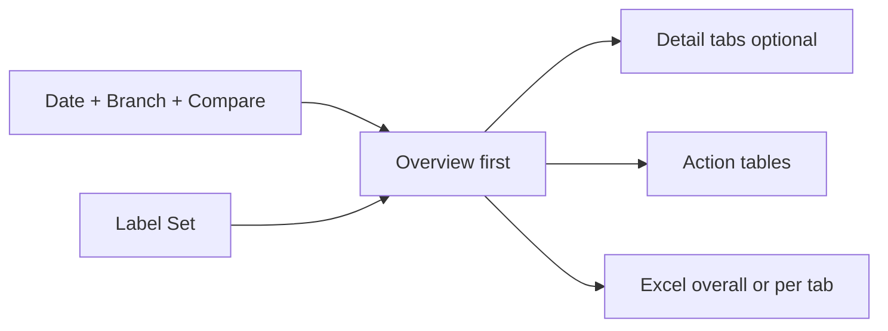
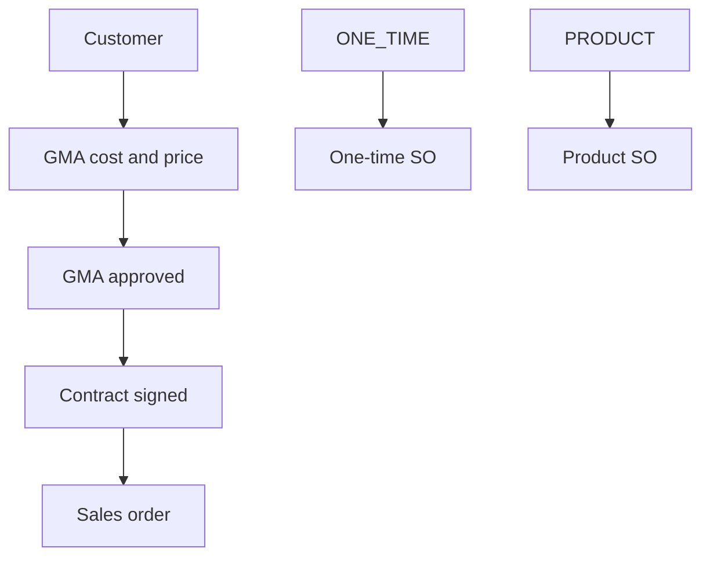
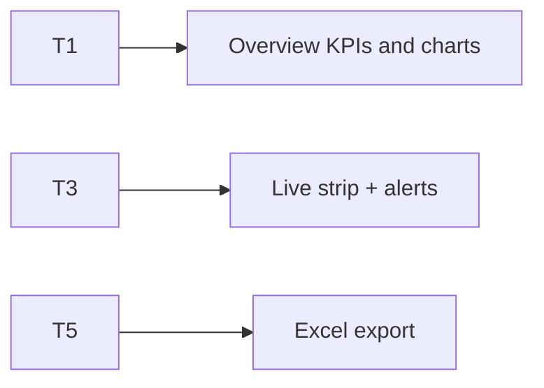
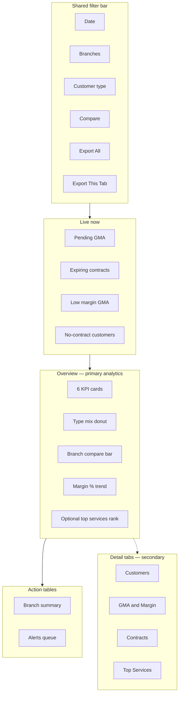
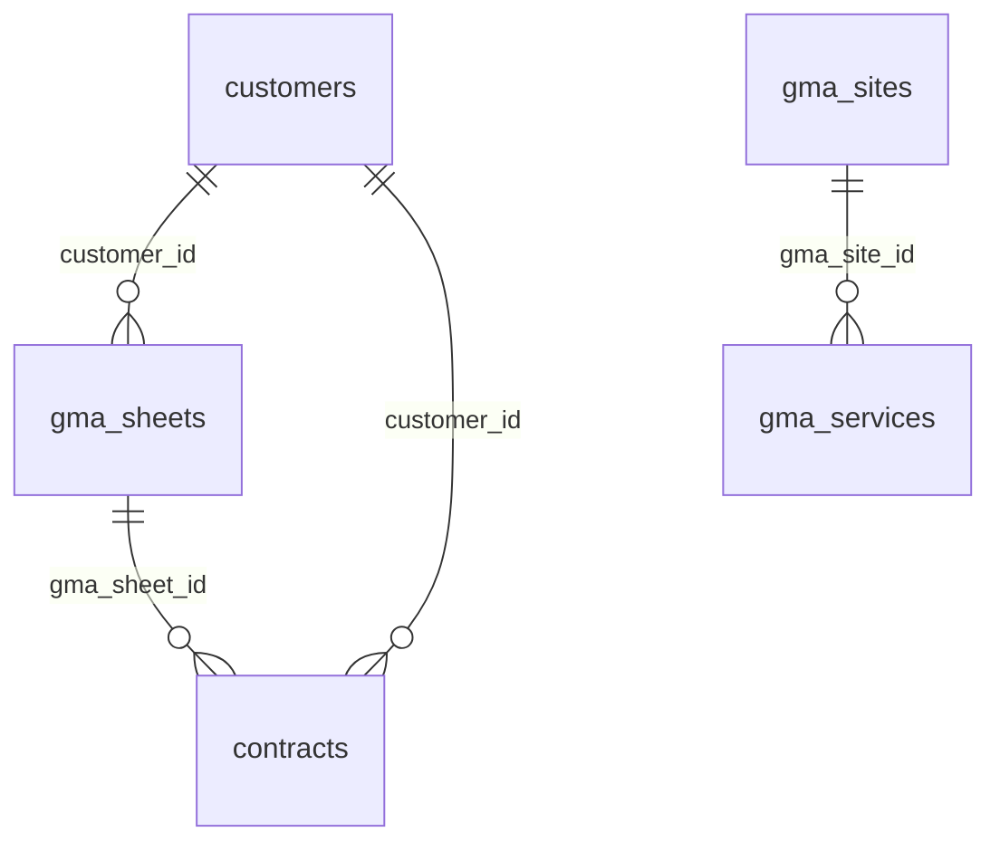
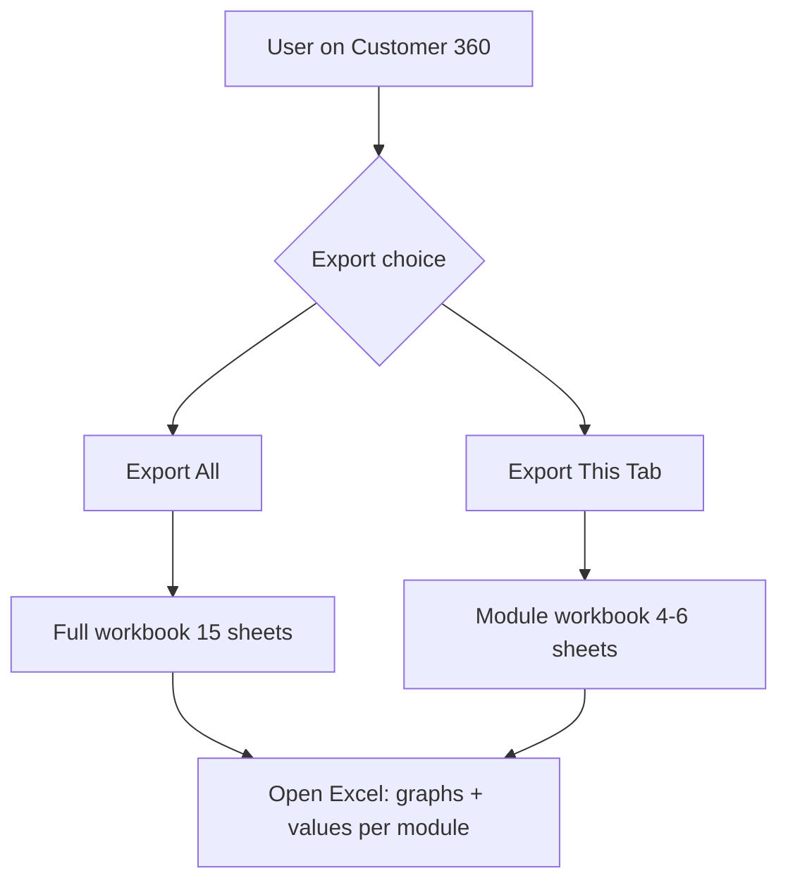

# Customer 360 Master Dashboard — Customer · Contract · GMA (PRD / BRD)

> **Document type:** PRD + BRD analytics spec (Easy English)  
> **Hub module:** **Customer 360 Master** (one combined dashboard — Overview-first)  
> **Modules combined:** Customer Management · Contract Management · GMA (Gross Margin Analysis)  
> **Audience:** T1–T5  
> **Last analyzed:** 2026-07-28  
> **Sources:** `CustomerService`, `ContractService`, `GMAService`, frontend dashboards, Java modules 17–19

---

## Business requirements (Easy English)

**Problem:** Sales and branch leaders open **three separate dashboard cards** and still cannot answer in one glance: Are we growing the right **customer types** (AMC / one-time / product)? Are **margins** healthy before we sign? Which **contracts** need renewal? Which **services** sell most?

**Goal:** One **Customer 360** page with an **Overview-first** layout — the most important numbers and charts on the first screen — then optional **detail tabs** for deeper charts, **action tables** for next steps, and **Excel export overall or per tab** (each sheet = graphs + detailed values).

**Success looks like:**
1. Manager answers the three big questions in **under 2 minutes without leaving Overview**
2. Detail tabs open only when someone needs deeper Customer / GMA / Contract / Service charts
3. Action tables drive renewals, pending GMA, and low-margin reviews
4. Auditor exports **overall workbook** or **single-tab workbook** — every sheet has charts **and** row-level detail for that module

---

## Visualization strategy (data-analyst view)

### Design rule: Overview first — not a tab-heavy home

| Layer | What user sees | Purpose |
|-------|----------------|---------|
| **1. Overview (always visible)** | Live strip + 6 KPIs + 3–4 primary charts + 2 action tables | Answer “how healthy is customer business?” |
| **2. Detail tabs (secondary)** | Extra charts for one domain only | Drill when Overview is not enough |
| **3. Action tables** | Branch summary + alerts queue | What to do next |
| **4. Excel export** | Overall workbook **or** per-tab workbook; each sheet = KPI + graph(s) + detail table | Offline analysis / audit / team handoff |

**Anti-pattern to avoid:** Five equal tabs as the home experience (user must click before seeing anything useful).

### What belongs on Overview vs detail tabs

| Decision question | Put on Overview? | Put on detail tab? |
|-------------------|------------------|--------------------|
| Active customers + growth | Yes — KPI | Optional monthly trend deep-dive |
| AMC vs One-time vs Product mix | Yes — one donut | Branch × type stacked bar |
| Active contract book value | Yes — KPI | Monthly revenue / status mix |
| Avg GMA gross margin % | Yes — KPI | Cost vs price monthly series |
| Pending GMA / expiring contracts / low margin | Yes — Live strip + alert table | Full GMA or contract lists |
| Top services sold | Optional thin rank bar **or** detail tab | Full Top Services tab |
| Margin bridge (GMA price vs signed contract) | No — too dense | GMA / Margin detail tab |
| Full recent customer / GMA / contract lists | No — noise | Domain detail tab + Excel |

### Overview “must-see” priority (ranked)

| Rank | Insight | Why it matters first | Widget |
|------|---------|----------------------|--------|
| 1 | Live exceptions | Stop loss today | Live strip |
| 2 | Book health | How big is AMC book? | KPI L7 |
| 3 | Margin health | Are we signing profitable deals? | KPI L12 |
| 4 | Customer mix | Right customer types? | Donut L3/L4/L5 |
| 5 | Branch compare | Which branch is behind? | Multi-bar L1 or L7 |
| 6 | Margin trend | Improving or slipping? | Line L12 |
| 7 | What to do | Who to call / approve | Action tables |

---

## 1. Purpose & Business Need

All three modules share **customer details** and one commercial chain:

```
Lead / Prospect / Customer  →  GMA (cost + price + margin)  →  Contract (AMC / sale value)  →  Sales Order / Tasks
```

| Stage | Business meaning | Key question |
|-------|------------------|--------------|
| **Customer** | Who we serve; tagged by type | How many AMC vs one-time vs product? |
| **GMA** | In-house cost vs proposed price | Is margin healthy? |
| **Contract** | Signed AMC / long-term agreement | Live contract value? Renewals due? |

**Customer types (`CustomerType`):**

| DB value | Display label | Focus |
|----------|---------------|-------|
| `CONTRACT` | AMC / Contract | Recurring service |
| `ONE_TIME` | One-time (Jobbing) | Single job |
| `PRODUCT` | Product purchase | Hardware / resell |

**GMA money fields:** `total_annual_cost` (in-house) · `total_annual_price` (sale) · `overall_gross_margin` % · `gm_with_doc` / `gm_without_doc`

**Outcomes today:** Three separate cards (`/dashboard/customer_management`, `/contract_management`, `/gma`); alerts mostly unused in UI; no Overview that joins margin + type + renewals; top services **Gap**.

**Outcomes recommended:**
- One master page, **Overview-first**
- Detail tabs only for domain deep-dives
- Action tables with View / Approve deep-links
- Excel export **overall** or **per tab**; each module sheet embeds graphs + detailed values

---

## 2. Combined dashboard (nearby modules)

| Module | Why combined | RBAC Read | Where shown |
|--------|--------------|-----------|-------------|
| Customer | Master identity + type mix | CUSTOMER_CONTRACT_MANAGEMENT | Overview KPIs/donut + Customers detail tab |
| GMA | Cost vs price before sign | GMA_SHEET_MANAGEMENT | Overview margin KPI/trend + GMA detail tab |
| Contract | Signed AMC value + renewals | CONTRACT / CUSTOMER_CONTRACT | Overview value KPI + Contracts detail tab |
| Services (derived) | What sells most | GMA + Contract Read | Optional Overview rank **or** Services detail tab |

Hide a domain’s widgets if no Read. Overview still shows whatever domains the user can see.



### Business flow



---

## 3. Comparison Label Set

| Label ID | Display label (Easy English) | Meaning | Unit | Overview? |
|----------|------------------------------|---------|------|-----------|
| L1 | Active customers | status = ACTIVE | count | KPI |
| L2 | New customers | created in period | count | KPI |
| L3 | AMC / Contract customers | type = CONTRACT | count | Donut |
| L4 | One-time customers | type = ONE_TIME | count | Donut |
| L5 | Product customers | type = PRODUCT | count | Donut |
| L6 | Contract coverage % | live contract ÷ active × 100 | % | KPI (optional 7th) |
| L7 | Active contract value | SUM ACTIVE total_sale_value | ₹ | KPI |
| L8 | Expiring contracts 30d | end within 30 days | count | Live |
| L9 | Total GMA | COUNT sheets | count | Detail |
| L10 | Approved GMA | status APPROVED | count | Detail |
| L11 | Pending GMA | status PENDING | count | Live |
| L12 | Avg gross margin % | AVG overall_gross_margin | % | KPI + line |
| L13 | GMA annual cost | SUM total_annual_cost | ₹ | Detail chart |
| L14 | GMA annual price | SUM total_annual_price | ₹ | Detail chart |
| L15 | Margin gap | L14 − L13 | ₹ | Detail |
| L16 | Low margin GMA | margin &lt; 10% | count | Live |

**Rules:** Same Label ID = same formula in Overview, detail tabs, Excel axes. Never mix ₹ and counts on one unlabelled axis.

---

## 4. Users & Roles (who sees what)

| Tier | Roles | Scope | Uses Overview for… |
|------|-------|-------|---------------------|
| T1 Executive | CEO, Owner | All branches | L7, L12, type mix, branch bar |
| T2 Regional | Multi-branch sales/ops | Assigned | Branch compare + alerts |
| T3 Branch | Branch / sales lead | Own | Live strip + action tables |
| T4 Functional | Sales / GMA approver | Assigned | Pending GMA + low margin |
| T5 Audit | Auditor | Read + Export | Excel Graphs + Dictionary |



---

## 5. Access Control (RBAC)

| Section | Permission | CEO bypass | Branch scope |
|---------|------------|------------|--------------|
| Overview (partial) | Any of Customer / GMA / Contract Read | Yes | user_branches ∩ filter |
| Customer widgets | CUSTOMER_CONTRACT_MANAGEMENT Read | Yes | customers.branch_id |
| GMA widgets | GMA_SHEET_MANAGEMENT Read | Yes | gma branch / sheet branches |
| Contract widgets | CONTRACT / CUSTOMER_CONTRACT Read | Yes | contracts.branch_id |
| Export Excel (All) | Export on included modules (or CEO) | Yes | same filters → scope=overall |
| Export Excel (This tab) | Export on active tab module | Yes | same filters → scope=overview/customers/gma/contracts/services |

| Widget | T1 | T2 | T3 | T4 | T5 |
|--------|----|----|----|----|-----|
| Live strip | ✓ | ✓ | ✓ | ✓ | ✓ |
| Overview KPIs + primary charts | ✓ | ✓ | ✓ | partial | ✓ |
| Detail tabs | ✓ | ✓ | ✓ | ✓ | ✓ |
| Action tables | ✓ | ✓ | ✓ | ✓ | ✓ |
| Export | ✓ | ✓ | ✓ | if Export | ✓ |

---

## 6. Global Filters & Live Update

| Filter | Type | Default | API param | Behavior |
|--------|------|---------|-----------|----------|
| Date range | 7d / 15d / 30d / MTD / QTD / YTD / custom | Last 30d | from_date, to_date / period | Shared by Overview + tabs + Excel |
| Branch | Multi-select | User branches | branch[] | Same for all layers |
| Compare to | prior_period / prior_year | prior_period | compareMode | KPI deltas (**Gap** — add like HRM) |
| Customer type | Multi | All | customerType | Filters Overview donut + tables |

| Widget group | Layer | Method | Interval |
|--------------|-------|--------|----------|
| Live strip | Live | Poll | 60–120s |
| Overview KPIs / charts | Period | Filter + poll | 60–120s |
| Detail tabs | Period | On tab open + filter | — |
| Action tables | Period | Filter + pagination | — |

---

## 7. Existing vs Recommended — Summary

| Area | Existing today | Recommended | Priority |
|------|----------------|-------------|----------|
| Layout | 3 separate cards | **One page: Overview-first + secondary detail tabs** | P0 |
| Overview content | None (must open each card) | Live + 6 KPIs + 3–4 charts + 2 action tables | P0 |
| Tabs | N/A / three cards | **Optional deep-dive only** (Customers / GMA / Contracts / Services) | P0 |
| Type + margin + renewals | Split across cards | Same Overview screen | P0 |
| Action tables | Display-only, no alerts UI | Branch summary + unified alerts with deep-links | P0 |
| Top services | Missing | Detail tab + Excel sheet (**Gap** API) | P1 |
| Margin bridge | gma_id on contract only | Detail tab + Excel Margin_Bridge | P1 |
| Excel | Separate GMA/Contract exports | **Overall + per-tab**; each sheet = graph(s) + detail values | P1 |

---

## 8. Visual Representation — Overview-first layout

### Wireframe



### Widget placement map

| Zone | Widgets | Desktop | Mobile | Live/Period |
|------|---------|---------|--------|-------------|
| Top | Filters + **Export overall** + **Export this tab** | full | stacked | — |
| Live strip | L11, L8, L16, no-contract count | full | scroll | Live |
| Overview KPIs | L1, L2, L7, L12, L3, L4 *(or L6)* | 6 cards | 2-col | Period |
| Overview charts | Donut + branch bar + margin line (+ optional services) | 2×2 | stacked | Period |
| Action tables | Branch summary + Alerts | full | full | Period |
| Detail tabs | Below fold / secondary nav | full | accordion | Period |

### ASCII Overview sketch

```
+------------------------------------------------------------------+
| Filters: Date | Branches | Type | Compare   [Export All] [Export This Tab] |
+------------------------------------------------------------------+
| LIVE: Pending GMA 12 | Expiring 8 | Low margin 5 | No contract 23 |
+------------------------------------------------------------------+
| KPI: Active | New | Contract ₹ | Margin % | AMC # | One-time #    |
+-----------------------------------+--------------------------------+
| Type mix (donut)                  | Branch contract value (bar)    |
| AMC / One-time / Product          | Mumbai / Pune / HO             |
+-----------------------------------+--------------------------------+
| Avg margin % trend (line)         | Top 5 services (rank bar) opt. |
+------------------------------------------------------------------+
| Action Table 1: Branch summary (All Branches + rows)               |
| Action Table 2: Alerts — Approve GMA / Renew / Review margin       |
+------------------------------------------------------------------+
| [ Customers ] [ GMA & Margin ] [ Contracts ] [ Top Services ]      |
|   ↑ detail tabs — open only for deep charts / long lists           |
+------------------------------------------------------------------+
```

---

## 9. KPI Stat Cards — Overview (primary)

Keep **exactly 6** on Overview (analyst budget — more creates noise).

| # | Label ID | Title | Formula | Format | Delta | Layer |
|---|----------|-------|---------|--------|-------|-------|
| 1 | L1 | Active customers | COUNT ACTIVE | count | vs prior | Period |
| 2 | L2 | New customers | created in period | count | vs prior | Period |
| 3 | L7 | Active contract value | SUM ACTIVE total_sale_value | ₹ | vs prior | Period |
| 4 | L12 | Avg gross margin % | AVG overall_gross_margin (prefer APPROVED) | % | vs prior | Period |
| 5 | L3 | AMC customers | type = CONTRACT | count | vs prior | Period |
| 6 | L4 | One-time customers | type = ONE_TIME | count | vs prior | Period |

**Swap option:** Replace L4 with **L6 Contract coverage %** if leadership cares more about “how many actives have a live contract” than jobbing count.

```
L12 Avg gross margin %
  Formula: AVG(g.overall_gross_margin)
  Tables: gma_sheets g WHERE is_deleted = FALSE
           AND status = 'APPROVED'  -- recommended for Overview
  Existing: GMAService avg_margin (all non-deleted — tighten for Overview)
```

```
L7 Active contract value
  Formula: SUM(c.total_sale_value) WHERE status = 'ACTIVE'
  Tables: contracts
  Existing: ContractService total_active_contract_value
```

**Detail-tab KPIs only (not Overview):** L9, L10, L13, L14, L15, L5 Product count, L8 as KPI (L8 stays Live strip).

---

## 10. Charts — Overview primary + detail secondary

### Overview Graph 1 — Customer type mix (must-have)

| Attribute | Spec |
|-----------|------|
| Type | Donut (3 slices max) |
| Layer | Period / Overview |
| Legend | AMC / Contract · One-time · Product |
| Data | Existing `customer_type` chart |
| Empty state | No customers for filters |
| Drill-down | Click slice → Action Table 2 filtered by type **or** open Customers detail tab |

**Notice:** Tells if book is AMC-heavy vs jobbing-heavy vs product-heavy.

### Overview Graph 2 — Branch comparison (must-have)

| Attribute | Spec |
|-----------|------|
| Type | Clustered / horizontal multi-bar |
| Layer | Period / Overview |
| X-axis title | Branch name |
| Y-axis title | Active contract value (₹) **or** Active customers |
| Legend | L7 preferred for money view; L1 if count view |
| Drill-down | Action Table 1 filtered to that branch |

**Notice:** Which branch carries the AMC book.

### Overview Graph 3 — Gross margin % trend (must-have)

| Attribute | Spec |
|-----------|------|
| Type | Line |
| Layer | Period / Overview |
| X-axis title | Month |
| Y-axis title | Avg gross margin % |
| Legend | L12 · prior period dashed (when compare on) |
| Threshold | 10% line (matches low_margin repo) |
| Data seed | `monthly_gma_value.avg_margin` |

**Notice:** Margin improving or slipping before renewals.

### Overview Graph 4 — Top services (optional on Overview)

| Attribute | Spec |
|-----------|------|
| Type | Horizontal rank bar (Top 5 only) |
| Layer | Period / Overview **or** Services detail only |
| Y-axis title | Service name |
| X-axis title | Count or ₹ |
| Data | **Gap** — `gma_services` + service catalog |

If API missing at launch: hide Overview Graph 4; keep **Top Services** detail tab + Excel sheet as P1.

### Detail tabs — specific visualizations only

| Detail tab | Charts / tables to add (not on Overview) |
|------------|------------------------------------------|
| **Customers** | Monthly new customers line; branch × type stacked bar; recent_customers; inactive list |
| **GMA & Margin** | Status donut; cost vs price stacked (`monthly_gma_value`); approved_summary; low_margin list; margin bridge vs contract value |
| **Contracts** | Status donut; monthly contract revenue; recent_contracts; expiring_contracts; no_sales_order alert |
| **Top Services** | Full Top 15 rank; optional AMC vs one-time split |

```
GMA cost vs price (Detail — not Overview)
₹ |
  |  [price====]
  |  [cost==]
  +----+----+---->
    Jan  Feb  Mar
```

---

## 11. Action Tables (always under Overview)

### Action Table 1 — Branch summary (overall + branch-wise)

| Column | Field | Format | Sort | Notes |
|--------|-------|--------|------|-------|
| Branch | branch_name | text | yes | **All Branches** first |
| Active customers | L1 | count | yes | |
| AMC / One-time / Product | L3/L4/L5 | count | — | compact split |
| Contract coverage % | L6 | % | yes | |
| Active contract value | L7 | ₹ | yes | |
| Avg GMA margin % | L12 | % | yes | red if &lt; threshold |
| Actions | — | View | — | Open detail tab for branch |

**Pagination:** pageSize 10 · **Export:** same filters · **Empty:** No branch data for filters

### Action Table 2 — Alerts queue (do next)

| Column | Field | Notes |
|--------|-------|-------|
| Severity | high / medium | |
| Domain | Customer · GMA · Contract | |
| Type | Pending GMA · Low margin · Expiring · No contract · No SO · Inactive | |
| Customer / ID | name + id | |
| Recommended action | Approve GMA · Renew · Create contract · Review margin | Easy English |
| Actions | View / Approve | Deep-link |

**Existing alert sources:** `inactive_customers`, `no_contract_customers`, `pending_alert`, `expiry_alert`, `no_sales_order`; wire `low_margin` (&lt;10%) into Live + this table.

| Action | Route |
|--------|-------|
| View customer | `/customer-list-v2` |
| View / approve GMA | GMA management / inbox |
| View contract | `/contract-management` |

**Chart ↔ table rule:** Click Overview donut slice or branch bar → filter Action Table 2 / Table 1 (same Label Set).

---

## 12. Branch Comparison View

| Label ID | Aggregation | Company total | Per-branch | Variance rule |
|----------|-------------|---------------|------------|---------------|
| L1 | COUNT | top | row | — |
| L7 | SUM | top | row | best-first |
| L12 | AVG | top | row | red if &lt; margin SLA |
| L8 | COUNT | top | row | worst-first |
| L3/L4/L5 | COUNT | top | row | mix shift |

Used on Overview Graph 2 + Action Table 1 + Excel `Branch_Comparison`.

---

## 13. Data Model & Table Map

| Domain | Tables | Branch link |
|--------|--------|-------------|
| Customer | `customers` | branch_id |
| GMA | `gma_sheets`, `gma_sheet_branches`, `gma_sites`, `gma_services` | branch_id / sheet branches |
| Contract | `contracts`, `contract_gma_sources`, `contract_sites` | branch_id |
| Services | `gma_services` + service catalog | via GMA |



---

## 14. Excel Export Package — Overall + Per-Tab (Graph + Detail on Every Sheet)

### Export modes (two buttons)

User can download Excel in **two ways**. Both use the **same filters** (date, branch, compare, customer type) active on screen.

| Mode | UI button | Who uses it | Workbook scope |
|------|-----------|-------------|----------------|
| **Overall export** | `Export Excel (All)` on filter bar | CEO, audit, weekly review | Full Customer 360 — Overview + all modules user can Read |
| **Per-tab export** | `Export Excel (This tab)` on each detail tab header | Sales / GMA / contract team | Only the active tab’s module sheets + mini Cover |

**RBAC:** Overall export includes only modules the user has **Export** (or Read+Export) permission for. Per-tab export blocked if user lacks Export on that module.

**Filename pattern:**

```
Seravion_Customer360_{scope}_{YYYYMMDD}_{from}_to_{to}_{branchCount}br.xlsx

Examples:
  Seravion_Customer360_overall_20260728_20260701_to_20260728_3br.xlsx
  Seravion_Customer360_gma_20260728_20260701_to_20260728_3br.xlsx
  Seravion_Customer360_customers_20260728_20260701_to_20260728_3br.xlsx
```

### Core rule: every module sheet = **Graph area + Detail values**

Do **not** put all charts on one lonely `Graphs` sheet only. Each **module block** in Excel follows this layout:

```
+------------------------------------------------------------------+
| Sheet: GMA_Margin (example)                                       |
+------------------------------------------------------------------+
| Row 1–8:   KPI summary table (Label Set values + prior + delta)   |
| Row 10–25: Chart A (embedded) | Chart B (embedded)                |
| Row 27+:   Detail data table (all rows, numeric + descriptive)    |
| Footer:    "Filters: … | Exported by … | IST timestamp"         |
+------------------------------------------------------------------+
```

| Sheet part | Content | Required? |
|------------|---------|-----------|
| **KPI block** | 4–8 Label Set values for that module | Yes |
| **Graph area** | 1–3 embedded Excel charts (axes + grid ON) | Yes |
| **Detail table** | Full row-level data (descriptive + numeric columns) | Yes |
| **Charts_Data** | Hidden or sibling sheet feeding charts (Excel Table) | Yes (can be separate tab in workbook) |

Charts bind to **Excel Tables** on `*_Charts_Data` sheets so values update when detail rows grow.

### Export trigger (API)

| Item | Spec |
|------|------|
| Overall | `GET /dashboard/customer360/export/excel?scope=overall&includeCharts=true` |
| Per tab | `?scope=overview \| customers \| gma \| contracts \| services` |
| Params | fromDate, toDate, branchIds, compareMode, customerType (same as UI) |
| Permission | Export on included module(s) or CEO |
| Existing partial | `/dashboard/gma/export/excel`, `/dashboard/contract/export/excel` — merge into new contract |
| includeCharts | true (always for recommended export) |

---

### A. Overall export workbook (full Customer 360)

One file when user clicks **Export Excel (All)**.

| Sheet order | Sheet name | Graph(s) on sheet | Detail values on same sheet |
|-------------|------------|-------------------|-----------------------------|
| 1 | **Cover** | — | Filters, scope=overall, modules included, Label Set index, export metadata |
| 2 | **Overview_Summary** | — | All Overview KPIs L1–L12 + Live counts + deltas |
| 3 | **Overview_Graphs** | Donut type mix · Branch contract value bar · Margin % line | Mini branch table under each chart (Branch \| Value \| Prior \| Delta %) |
| 4 | **Overview_Alerts** | — | Full Action Table 2 rows (severity, domain, action, deep-link hint) |
| 5 | **Overview_Branch** | Clustered bar L1/L7 by branch | Branch comparison numeric table (company total row first) |
| 6 | **Customers_Summary** | Donut AMC/One-time/Product · Line new customers | KPI block + `Customers_Detail` table below charts |
| 7 | **Customers_Detail** | *(optional 2nd chart: branch × type stacked)* | recent_customers, inactive_customers, no_contract_customers rows |
| 8 | **GMA_Summary** | Status donut · Stacked cost vs price · Margin % line | KPI block + approved_summary + low_margin rows |
| 9 | **GMA_Detail** | — | recent_gma full rows (cost, price, margin, source_type, branch) |
| 10 | **GMA_Margin_Bridge** | Combo bar: GMA price vs contract value | Linked deal rows (gma_id, contract_id, customer, cost, price, margin, contract_value, variance) |
| 11 | **Contracts_Summary** | Status donut · Branch value bar · Monthly revenue line | KPI block + expiring_contracts rows |
| 12 | **Contracts_Detail** | — | recent_contracts full rows (incl. gma_id, value, dates, status) |
| 13 | **Services_Summary** | Horizontal bar Top 15 services | Service rank table (name, count, value, AMC vs one-time split) — **Gap until API** |
| 14 | **Charts_Data** | — | All series tables (Excel Tables) feeding every chart |
| 15 | **Dictionary** | — | Label Set L1–L16, column definitions, formulas, source tables |

**Overall Graphs layout (sheet `Overview_Graphs` + module summary sheets):**

| Chart | Sheet | Type | X-axis | Y-axis | Grid | Detail mini-table |
|-------|-------|------|--------|--------|------|-------------------|
| A | Overview_Graphs | Donut | — | — | — | Customer_Type_Split |
| B | Overview_Graphs | Clustered column | Branch | Contract value (₹) | ON | Overview_Branch |
| C | Overview_Graphs | Line | Month | Avg gross margin % | ON | Trend on GMA_Summary |
| D | GMA_Summary | Stacked column | Month | Amount (₹) | ON | cost + price columns |
| E | Contracts_Summary | Line | Month | Contract revenue (₹) | ON | monthly_contract_revenue |
| F | Services_Summary | Horizontal bar | Count | Service name | ON | Services rank table |

---

### B. Per-tab export workbooks (one module each)

When user is on a **detail tab** and clicks **Export Excel (This tab)**, download a **smaller workbook** with only that module’s sheets (still graph + detail on each sheet).

#### B1 — Overview tab export (`scope=overview`)

| Sheet | Graph + detail |
|-------|----------------|
| Cover | Tab=Overview, filters |
| Overview_Summary | KPI values only |
| Overview_Graphs | 3 charts + mini tables |
| Overview_Branch | 1 chart + branch table |
| Overview_Alerts | Alert detail rows |
| Charts_Data_Overview | Series for Overview charts |
| Dictionary (subset) | Labels used on Overview |

#### B2 — Customers tab export (`scope=customers`)

| Sheet | Graph + detail |
|-------|----------------|
| Cover | Tab=Customers |
| Customers_Summary | KPIs L1–L6 + donut + monthly new line + branch bar |
| Customers_Detail | **Detail table:** customer_id, name, type, phone, branch_name, status, created_at |
| | **Rows:** recent_customers + inactive_customers + no_contract_customers (sections or flags) |
| Charts_Data_Customers | Feeds customer charts |
| Dictionary (subset) | L1–L6 |

**Detail columns (numeric + descriptive):**

| Column | Type | Source |
|--------|------|--------|
| customer_id | descriptive | customers.id |
| customer_name | descriptive | full_name |
| customer_type | descriptive | CONTRACT / ONE_TIME / PRODUCT |
| branch_name | descriptive | branches |
| status | descriptive | ACTIVE / INACTIVE |
| created_at | date | customers.created_at |
| phone | descriptive | customers.phone |
| alert_flag | descriptive | inactive / no_contract / none |

#### B3 — GMA & Margin tab export (`scope=gma`)

| Sheet | Graph + detail |
|-------|----------------|
| Cover | Tab=GMA |
| GMA_Summary | KPIs L9–L16 + status donut + cost/price stacked + margin line |
| GMA_Detail | **Detail table:** gma_id, source_type, customer_id, branch_name, status, total_annual_cost, total_annual_price, overall_gross_margin, gm_with_doc, gm_without_doc, total_visits_per_month, approved_on |
| | **Rows:** recent_gma + approved_summary + low_margin (section column) |
| GMA_Margin_Bridge | Chart + linked GMA↔contract rows |
| Charts_Data_GMA | Feeds GMA charts |
| Dictionary (subset) | L9–L16, margin formulas |

**Existing API fields to map:** `GMAService` tables `recent_gma`, `approved_summary`; repo `low_margin` (&lt;10%).

#### B4 — Contracts tab export (`scope=contracts`)

| Sheet | Graph + detail |
|-------|----------------|
| Cover | Tab=Contracts |
| Contracts_Summary | KPIs L7–L8 + status donut + branch bar + monthly revenue line |
| Contracts_Detail | **Detail table:** contract_id, customer_name, customer_id, gma_id, branch_name, start_date, end_date, total_sale_value, status, days_to_expiry |
| | **Rows:** recent_contracts + expiring_contracts + no_sales_order alert rows |
| Charts_Data_Contracts | Feeds contract charts |
| Dictionary (subset) | L7–L8 |

**Existing API fields:** `ContractService` recent_contracts (includes `gma_id`), expiring_contracts, alerts `no_sales_order`.

#### B5 — Top Services tab export (`scope=services`)

| Sheet | Graph + detail |
|-------|----------------|
| Cover | Tab=Services |
| Services_Summary | Horizontal bar Top 15 + KPI total service lines |
| Services_Detail | **Detail table:** service_name, service_category, gma_line_count, total_proposed_value, amc_count, one_time_count, branch_name |
| Charts_Data_Services | Feeds service chart |
| Dictionary (subset) | Service aggregation formula |

**Gap:** Requires `GET /dashboard/customer360/services/top` — until then per-tab export disabled with message “Coming soon”.

---

### Per-sheet graph specification (mandatory settings)

Every embedded chart on **any** sheet must use:

| Setting | Rule |
|---------|------|
| Chart type | From graph-catalog (donut / clustered bar / line / stacked / horizontal bar) |
| Title | Easy English — matches Label Set story |
| X-axis title | Never blank (Branch / Month / Service name) |
| Y-axis title | Never blank (Count / ₹ / %) |
| X/Y gridlines | **Major ON** |
| Legend | Label Set display names |
| Data source | Excel Table on matching `Charts_Data_*` sheet |
| Detail below chart | Mini table OR full detail starts next section on same sheet |

**Example — GMA_Summary Chart (cost vs price):**

| Setting | Value |
|---------|-------|
| Sheet | GMA_Summary |
| Chart type | Stacked column |
| Title | GMA annual cost vs price by month |
| X-axis title | Month |
| Y-axis title | Amount (₹) |
| Legend | GMA annual cost (L13) · GMA annual price (L14) |
| Gridlines | Major ON both axes |
| Data source | Table `Tbl_GMA_Monthly` on Charts_Data_GMA |
| Detail on sheet | Rows from GMA_Detail table below chart |

---

### Charts_Data sheets (one per scope)

| Charts_Data sheet | Feeds charts on |
|-------------------|-----------------|
| Charts_Data_Overview | Overview_Graphs, Overview_Branch |
| Charts_Data_Customers | Customers_Summary |
| Charts_Data_GMA | GMA_Summary, GMA_Margin_Bridge |
| Charts_Data_Contracts | Contracts_Summary |
| Charts_Data_Services | Services_Summary |

**Standard columns:**

| period_bucket | branch_name | label_id | label_display | value | prior_value | delta_pct | series_group |
|---------------|-------------|----------|---------------|-------|-------------|-----------|--------------|

---

### Export UX flow



| Location | Control | Behavior |
|----------|---------|----------|
| Filter bar | **Export Excel (All)** | Overall workbook |
| Overview (below action tables) | **Export Overview** | Same as scope=overview |
| Customers detail tab header | **Export Customers** | scope=customers |
| GMA detail tab header | **Export GMA** | scope=gma |
| Contracts detail tab header | **Export Contracts** | scope=contracts |
| Services detail tab header | **Export Services** | scope=services (when API ready) |

---

### Analytic value (Easy English)

1. **Overall export** — one file for CEO/audit: full story across Customer + GMA + Contract + margin bridge  
2. **Per-tab export** — sales team downloads only GMA sheet with charts **and** row-level GMA detail for offline review  
3. **Graph + values together** — every sheet readable without jumping between Graphs-only and Detail-only files  
4. **Same filters** — Excel Cover proves which date/branch/compare was used  

### Existing vs recommended export

| Area | Existing today | Recommended |
|------|----------------|-------------|
| Export modes | GMA + Contract separate; no customer | **Overall + per-tab** |
| Sheet pattern | Tables only or PDF charts | **Each sheet: KPI + graph(s) + detail table** |
| Overview parity | None | Overview_Summary matches UI KPIs |
| Margin bridge | None | GMA_Margin_Bridge sheet in overall + gma tab export |
| Services | None | Services_Summary + Detail when API ready |

---

## 15. API Specification (existing + proposed)

### Existing

| Method | Path | Purpose | Overview use |
|--------|------|---------|--------------|
| GET | `/dashboard/customer_management` | Customer KPIs/charts/tables/alerts | Type donut, L1–L5, customer alerts |
| GET | `/dashboard/contract_management` | Contract KPIs/charts/tables/alerts | L7, L8, branch/contracts |
| GET | `/dashboard/gma` | GMA KPIs/charts/tables/alerts | L11, L12, margin trend seed |
| GET | `/dashboard/gma/export/excel` | GMA Excel | Partial |
| GET | `/dashboard/contract/export/excel` | Contract Excel | Partial |

### Proposed

| Method | Path | Params | Response | Widgets |
|--------|------|--------|----------|---------|
| GET | `/dashboard/customer360/overview` | fromDate, toDate, branchIds, compareMode, customerType | `{ live, kpis, charts, branchSummary, alerts }` | Overview only (fast) |
| GET | `/dashboard/customer360` | same + `section=` | overview + optional detail sections | Full page |
| GET | `/dashboard/customer360/export/excel` | fromDate, toDate, branchIds, compareMode, customerType, **scope** (overall \| overview \| customers \| gma \| contracts \| services), includeCharts=true | xlsx — module sheets with embedded charts + detail tables | Export All / Export This Tab |
| GET | `/dashboard/customer360/services/top` | branch, from, to, limit | ranked services | Graph 4 / Services tab — **Gap** |
| GET | `/dashboard/customer360/margin-bridge` | branch, from, to | GMA vs contract linked rows | Detail + Excel — **Gap** |

**Fast path:** Frontend Overview calls three existing endpoints in parallel and maps to Label Set (no new API required for P0 Overview).

---

## 16. Cross-Module Interactions

| Related module | Connection | Impact |
|----------------|------------|--------|
| Leads | GMA FROM_LEAD | Source mix in GMA detail |
| Sales Order | After contract; customer `total_revenue` is SO booked | Label clearly — not GMA price |
| Quotation | Optional pre-step | Link-out only |
| Support | Tickets on customer | Not on Overview (noise) |

---

## 17. Rules, Validations & Data Quality

- Branch ∩ user_branches (except CEO)
- Same Label ID everywhere (Overview / tabs / Excel)
- `customer_type` ≠ live contract — use L6 for coverage truth
- Overview L12: prefer APPROVED GMA only
- Customer dashboard `total_revenue` = SO booked — do not show as “margin”
- Soft-delete: `gma_sheets.is_deleted = FALSE`
- Low margin threshold default **10%** (matches `GMARepository.low_margin`)
- IST display; money/% numeric in Excel

---

## 18. Gaps & Implementation Notes

1. **P0** — One master page; **Overview-first** layout (not five equal tabs)
2. **P0** — Live strip + Action Table 2 from existing alerts + wire `low_margin`
3. **P0** — Overview 6 KPIs + 3 charts from existing three APIs
4. **P0** — Row deep-links to customer / GMA / contract screens
5. **P1** — Detail tabs for domain deep-dives only
6. **P1** — Top services API + optional Overview Top-5 bar
7. **P1** — Margin bridge query + Excel sheet
8. **P1** — Excel export: **overall + per-tab**; each sheet = KPI + graph(s) + detail table (not charts-only central sheet)
9. **P1** — Prior-period deltas (`period_utils`)
10. **P2** — `/dashboard/customer360/overview` thin endpoint for faster first paint

---

## 19. Acceptance criteria (Easy English)

- [ ] User sees useful Customer 360 answers on **Overview without opening tabs**
- [ ] Live strip shows pending GMA, expiring contracts, low margin, no-contract
- [ ] Overview has ≤6 KPIs and ≤4 charts using Label Set names
- [ ] Detail tabs are optional deep-dives (Customers / GMA / Contracts / Services)
- [ ] Action tables sit under Overview with View / Approve where allowed
- [ ] Chart click filters the related action table
- [ ] **Export Excel (All)** downloads full workbook; **Export Excel (This tab)** downloads only active module
- [ ] Every exported module sheet has embedded chart(s) (axes + grid ON) **and** detailed row-level values on the same sheet
- [ ] Overview export includes Overview_Summary + Overview_Graphs + branch + alerts sheets
- [ ] Per-tab exports (Customers / GMA / Contracts / Services) match their detail tab data + charts
- [ ] User only sees domains they can Read
- [ ] CEO all branches; others only assigned
- [ ] Top services shown only when data API exists (or marked Gap)

---

## 20. Tips for Stakeholders

- **CEO:** Stay on Overview — L7, L12, type donut, branch bar; **Export All** for board pack
- **Branch manager:** Live strip + Action Table 2 every morning; **Export Overview** for branch review
- **Sales / GMA approver:** Low margin + pending GMA rows; **Export GMA** tab for offline margin review with charts + row detail
- **Auditor:** Cover → module summary sheets (each with graph + detail) → Margin_Bridge → Dictionary

---

## 21. Existing Functionality Summary

**Available today:** Three separate APIs/cards with type mix, contract value, GMA avg margin + monthly cost/price/margin, alerts in services (mostly unused in UI), GMA/Contract Excel exports.

**Not available (recommended):** Overview-first Customer 360 page; unified Live + action tables; secondary detail tabs only; top services; margin bridge; **overall + per-tab Excel** (graph + detail on every module sheet); prior-period deltas on Overview KPIs.
