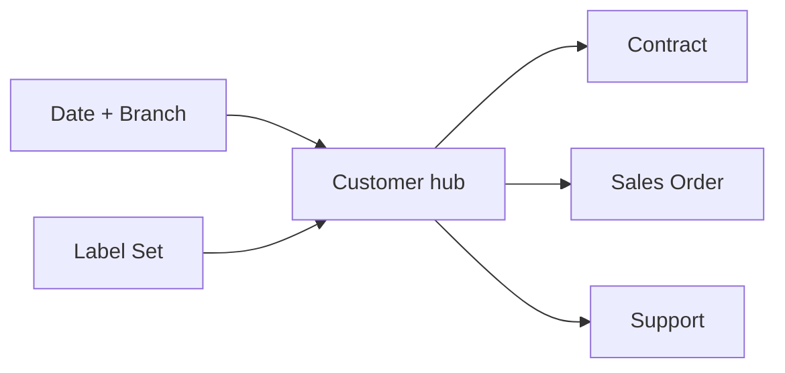
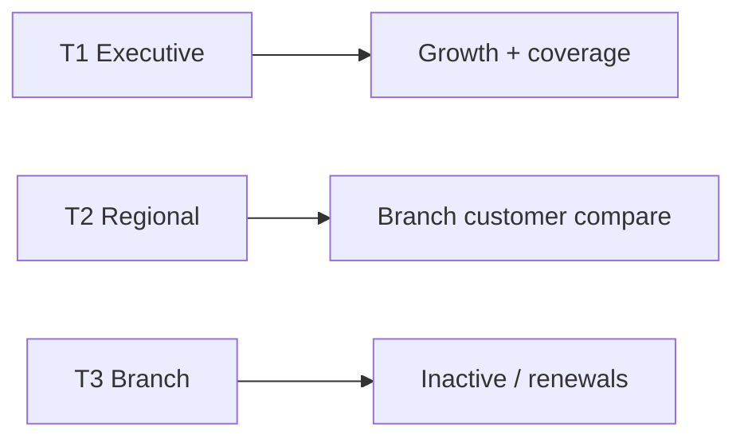
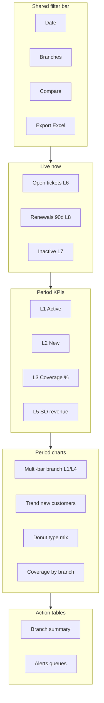
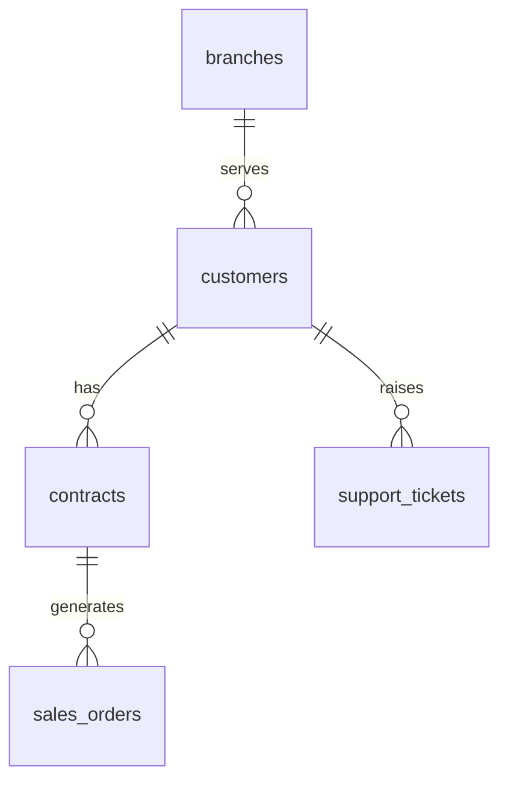

# Customer Management Cluster — Analytics Dashboard (PRD / BRD)

> **Document type:** PRD + BRD analytics spec (Easy English)  
> **Hub module:** Customer Management  
> **Nearby modules combined:** Contract · Sales Order · Support · (optional) GMA / Quotation  
> **Audience:** T1–T5  
> **Last analyzed:** 2026-07-28  
> **Sources:** `CustomerService` / `customer_repo.py`, `CustomerManagementDashboard.jsx`, Java `/api/v1/customer*`, Sidebar routes

---

## Business requirements (Easy English)

**Problem:** Sales and branch leaders cannot quickly see how many customers are live, under contract, bringing revenue, or needing attention (inactive / no contract / open tickets) across branches.

**Goal:** One **Customer cluster** dashboard that shows customers together with contracts, sales orders, and support — with Branch A vs Branch B and this period vs last period comparisons, Live now exceptions, and Excel with multiple graphs.

**Success looks like:**
1. A manager answers “Which branch is growing and who has no contract?” in under 2 minutes
2. An auditor exports Excel with Graphs + customer/contract/ticket rows for the same filters
3. Inactive customers, no-contract list, and open tickets appear without hunting menus

---

## 1. Purpose & Business Need

Customers are the spine of pest-control revenue: contracts, visits, and tickets hang off the customer record. Nearby modules show whether the relationship is contracted, billed (via SO), or unhappy (support).

**Outcomes today:**
- `GET /dashboard/customer_management` — KPIs: total / active / contract customers, total_revenue (SO grand_total); charts: type donut, branch bar, monthly trend; tables: recent_customers, active_contracts
- Service alerts: inactive_customers, no_contract_customers — **not in UI**
- Generic Excel/PDF export paths exist; Company Dashboard export UI often “coming soon”
- Tables have no row View deep-link
- “Contract customers” may use type flag, not live contract join

**Outcomes recommended:**
- Combined Customer + Contract + SO + Support sections
- Contract coverage %, renewals in 90 days, clear revenue label (SO booked ≠ collected)
- Live strip + action queues with links to `/customer-list-v2`, `/contract-management`, `/ticket-dash`
- Excel Graphs MGI with Label Set axes

---

## 2. Combined dashboard (nearby modules)

| Module | Why connected (Easy English) | RBAC Read required | Section on page |
|--------|------------------------------|--------------------|-----------------|
| **Customer (hub)** | Who we serve | CUSTOMER_CONTRACT_MANAGEMENT | Main |
| Contract | Long-term service promise | CONTRACT_MANAGEMENT | Tab / panel |
| Sales Order | Jobs / value released | SALES_ORDER_MANAGEMENT | Tab / panel |
| Support | Complaints and open tickets | CUSTOMER_SUPPORT_MANAGEMENT | Tab / panel |
| GMA / Quotation (optional) | How customer was won | GMA / QUOTATION Read | Optional |

Shared filters apply to **all** sections. Hide a section if the user has no Read.



---

## 3. Comparison Label Set

| Label ID | Display label (Easy English) | Meaning | Unit | Used on |
|----------|------------------------------|---------|------|---------|
| L1 | Active customers | Customers marked active | count | KPI, bar, Excel |
| L2 | New in period | Created in selected dates | count | KPI, line, Excel |
| L3 | Contract coverage % | Active customers with ≥1 live contract ÷ active × 100 | % | KPI, bullet/bar |
| L4 | Under contract | Customers with live contract | count | KPI, stacked |
| L5 | SO revenue booked | SUM sales_orders.grand_total in period | ₹ | KPI, axis |
| L6 | Open tickets | Support tickets still open | count | Live, KPI |
| L7 | Inactive customers | Not active / needs review | count | Alerts |
| L8 | Renewals due 90d | Contracts ending within 90 days | count | Live, alerts |

**Compare modes:** Branch vs Branch · Current vs Prior · Module vs Module only same unit (do not put L5 ₹ on same axis as L1 count)

---

## 4. Users & Roles (who sees what)

| Tier | Roles | Scope | Primary questions |
|------|-------|-------|-------------------|
| T1 Executive | CEO, Owner | All branches | Growth, coverage %, revenue booked |
| T2 Regional | Multi-branch managers | Assigned | Branch X vs Y customers |
| T3 Branch | Branch / sales lead | Own | New, inactive, renewals |
| T4 Functional | Sales / CRM exec | Assigned | Recent customers |
| T5 Audit | Auditor | Read + Export | Trails |



---

## 5. Access Control (RBAC)

| Widget / section | Module permission | CEO bypass | Branch scope |
|------------------|-------------------|------------|--------------|
| Customer section | CUSTOMER_CONTRACT_MANAGEMENT Read | Yes | customer branch ∩ user_branches |
| Contract panel | CONTRACT Read | Yes | same |
| SO panel | SALES_ORDER Read | Yes | same |
| Support panel | CUSTOMER_SUPPORT Read | Yes | same |
| Export | Export or CEO | Yes | same filters |
| Service history Excel (per customer) | Export | Yes | customer in scope |

| Widget | T1 | T2 | T3 | T4 | T5 |
|--------|----|----|----|----|-----|
| Live strip | ✓ | ✓ | ✓ | ✓ | ✓ |
| Label Set KPIs | ✓ | ✓ | ✓ | ✓ | ✓ |
| Branch compare | ✓ | ✓ | own | — | ✓ |
| Alerts tables | ✓ | ✓ | ✓ | ✓ | ✓ |
| Export | ✓ | ✓ | ✓ | if Export | ✓ |

---

## 6. Global Filters & Live Update

| Filter | Type | Default | API param | Behavior |
|--------|------|---------|-----------|----------|
| Date range | 7d / 15d / 30d / MTD / QTD / YTD / custom | Last 30d | from_date, to_date / period | New-in-period uses created_at |
| Branch | Multi-select | User branches | branch[] | |
| Compare to | prior_period / prior_year | prior_period | compareMode | |
| Status | Multi | ACTIVE (+ optional INACTIVE) | status | |
| Customer type | Multi | All | customerType | |

| Widget group | Layer | Method | Interval |
|--------------|-------|--------|----------|
| Live now (renewals, tickets, inactive) | Live | Poll | 60–120s |
| Period charts | Period | Filter + poll | 60–120s |
| Action tables | Period | Manual + filter | — |

---

## 7. Existing vs Recommended — Summary

| Area | Existing today | Recommended | Priority |
|------|----------------|-------------|----------|
| Combined nearby modules | Customer card only | + Contract, SO, Support | P0 |
| Label Set / comparison | Mixed names | L1–L8 fixed | P0 |
| Live strip | None | Renewals, open tickets, inactive | P0 |
| Charts | type, branch, monthly | + coverage by branch; chart→table | P1 |
| Excel Graphs (MGI) | Generic tables | Graphs 4 charts + Dictionary | P1 |
| Alerts UI | Service only | Action Table 2 | P0 |
| Revenue clarity | SO sum as “revenue” | Label L5 “SO revenue booked” | P1 |

---

## 8. Visual Representation (dashboard layout)

### Wireframe



### Widget placement map

| Zone | Widgets | Desktop | Mobile | Live/Period |
|------|---------|---------|--------|-------------|
| Top | Filters + Export | full | stacked | — |
| Live strip | L6, L7, L8 | full | scroll | Live |
| KPI | L1–L5 (+ L8) | 4–6 | 2-col | Period |
| Charts | multi-bar / line / donut / coverage | 60/40 | stacked | Period |
| Tables | Branch + Alerts | full | full | Period |

---

## 9. KPI Stat Cards (Label Set)

| # | Label ID | Title | Formula | Format | Delta | Layer | Tier |
|---|----------|-------|---------|--------|-------|-------|------|
| 1 | L1 | Active customers | status = ACTIVE | count | vs prior | Period | T1–T5 |
| 2 | L2 | New in period | created_at in range | count | vs prior | Period | T1–T4 |
| 3 | L3 | Contract coverage % | with live contract / active × 100 | % | vs prior | Period | T1–T3 |
| 4 | L4 | Under contract | distinct with live contract | count | vs prior | Period | T1–T3 |
| 5 | L5 | SO revenue booked | SUM(SO.grand_total) | ₹ | vs prior | Period | T1–T3 |
| 6 | L8 | Renewals due 90d | contracts end within 90 days | count | — | Live | T1–T3 |

```
Card L3 Contract coverage % (recommended)
  Formula: COUNT(DISTINCT c.id with live contract)
           / NULLIF(COUNT active c, 0) * 100
  Tables: customers c LEFT JOIN contracts ct ON ct.customer_id = c.id
          AND ct.status in live statuses
  Tips: Prefer live contract join over customer_type = 'CONTRACT' flag alone
```

```
Card L5 SO revenue booked
  Formula: SUM(sales_orders.grand_total)
  Tips: Not collections — Finance owns outstanding / collected
```

---

## 10. Charts & Visualizations

### Graph 1 — Customers by branch (multi-bar)

| Attribute | Spec |
|-----------|------|
| Type | Clustered multi-bar |
| Layer | Period |
| X-axis title | Branch name |
| Y-axis title | Customer count |
| Legend | Active customers · Under contract (L1, L4) |

### Graph 2 — New customers trend (line)

| Attribute | Spec |
|-----------|------|
| Type | Line |
| Layer | Period |
| X-axis title | Month |
| Y-axis title | New in period |
| Legend | New in period (L2) |

**Existing:** `monthly_trend`

### Graph 3 — Customer type mix (donut)

| Attribute | Spec |
|-----------|------|
| Type | Donut ≤6 slices |
| Layer | Period |
| Legend | Type names |

**Existing:** `customer_type`

### Graph 4 — Contract coverage by branch

| Attribute | Spec |
|-----------|------|
| Type | Bar with target line (e.g. 80%) |
| Layer | Period |
| X-axis title | Contract coverage % |
| Y-axis title | Branch name |
| Legend | Contract coverage % (L3) |

**Tips:** Below target = sales follow-up needed

---

## 11. Action Tables

### Action Table 1 — Branch summary

| Column | Field | Format | Sort | Notes |
|--------|-------|--------|------|-------|
| Branch | branch_name | text | yes | All Branches first |
| Active customers | L1 | count | yes | |
| New in period | L2 | count | yes | |
| Coverage % | L3 | % | yes | |
| SO revenue booked | L5 | ₹ | yes | |
| Open tickets | L6 | count | yes | if Support Read |
| Actions | — | View | — | → `/customer-list-v2` |

### Action Table 2 — Alerts

| Column | Field | Notes |
|--------|-------|-------|
| Severity | high / medium | |
| Type | Inactive · No contract · Renewal 90d · Open ticket | |
| Recommended action | Call customer · Create contract · Open ticket | Easy English |

**Existing:** `recent_customers`, `active_contracts` + alerts inactive / no_contract  
**Routes:** `/customer-list-v2` · `/contract-management` · `/ticket-dash`

---

## 12. Branch Comparison View

| Label ID | Aggregation | Company total | Per-branch | Variance rule |
|----------|-------------|---------------|------------|---------------|
| L1 | COUNT | top | one row | rank by growth |
| L3 | ratio | top | one row | red if &lt; target |
| L5 | SUM | top | one row | best-first |
| L6 | COUNT | top | one row | worst-first |

---

## 13. Data Model & Table Map

| Module | Tables | Branch link |
|--------|--------|-------------|
| Customer | `customers`, operating locations / location branches | branch / join |
| Contract | `contracts` | `branch_id` |
| Sales Order | `sales_orders` | `branch_id` |
| Support | `support_tickets` | branch where present |
| GMA (optional) | `gma_sheets` | sheet branches |



---

## 14. Excel Export Package — Multiple Graphical Interface

### Export trigger

| Item | Spec |
|------|------|
| UI | Export Excel |
| Permission | CUSTOMER_CONTRACT_MANAGEMENT Export (or CEO) |
| Endpoint | `/dashboard/customer_management/export/excel?includeCharts=true` |
| includeCharts | true |

### Workbook sheets

| Sheet | Purpose |
|-------|---------|
| Cover | Filters, modules included |
| Summary_KPIs | L1–L8 + deltas |
| Branch_Comparison | Matrix |
| Trend | New customers |
| **Graphs** | 4 charts MGI |
| Charts_Data | Series |
| Customers_Detail · Contracts_Detail · Tickets_Detail · Alerts | Rows |
| Dictionary | Label Set |

### Graphs sheet — chart list

| Chart | Type | X-axis title | Y-axis title | Grid | Legend | Details |
|-------|------|--------------|--------------|------|--------|---------|
| A | Clustered multi-bar | Branch | Customer count | Major ON | L1, L4 | Branch_Comparison |
| B | Line | Month | New in period | Major ON | L2 | Trend |
| C | Donut | — | — | — | Type | Customers_Detail |
| D | Bar | Coverage % | Branch | Major ON | L3 | mini table |

### Analytic value (Easy English)
1. See which branch grows customers vs which only has types flagged
2. Spot coverage gaps before renewals slip
3. Take Alerts sheet to sales standup

### Existing vs recommended export

| Area | Existing | Recommended |
|------|----------|-------------|
| Excel | Generic table dump / PDF | Graphs MGI + axes + grid + Dictionary |
| UI wire | Often missing | Wire Export on Customer card |

---

## 15. API Specification (existing + proposed)

### Existing

| Method | Path | Purpose | Widget / export |
|--------|------|---------|-----------------|
| GET | `/dashboard/customer_management` | KPIs, charts, tables | Customer UI |
| GET | `/dashboard/customer_management/export/excel\|pdf` | Export | Export |
| GET/POST | `/api/v1/customer*` | CRUD + service history Excel | Ops |

### Proposed

| Method | Path | Params | Response | Widgets |
|--------|------|--------|----------|---------|
| GET | `/dashboard/customer_management` | + compareMode, include=alerts | deltaPct, alerts, coverage | All |
| GET | cluster summary (optional) | same | customer+contract+SO+ticket KPIs | Combined |

---

## 16. Cross-Module Interactions

| Related module | Connection | Dashboard impact |
|----------------|------------|------------------|
| Contract | customer_id | L3, L4, L8 |
| Sales Order | customer / branch | L5 |
| Support | customer tickets | L6 |
| Quotation / GMA | pre-customer | Optional funnel |
| Task | service history | Per-customer Excel already |

---

## 17. Rules, Validations & Data Quality

- Branch ∩ user_branches (except CEO)
- Same Label ID = same formula in UI and Excel
- Soft-delete: use `is_deleted` consistently with status
- IST display; money numeric in Excel
- Do not call SO sum “collected”

---

## 18. Gaps & Implementation Notes

1. Render alerts + row View actions
2. Replace type-flag coverage with live contract join
3. Add Support / Contract / SO panels with RBAC hide
4. Wire Export UI; upgrade Graphs MGI
5. Retire or mark demo-only static CRM CustomerDashboard mock
6. Standard period presets + compare

---

## 19. Acceptance criteria (Easy English)

- [ ] User sees only nearby modules they can Read
- [ ] Shared date + branch filter drives all Customer cluster widgets
- [ ] Charts use Label Set on axes and legends
- [ ] Bar/slice click filters the table below
- [ ] Excel Graphs has multiple chart types with axes + grid + details
- [ ] Live strip shows renewals / tickets / inactive with last-updated time
- [ ] CEO all branches; others only assigned

---

## 20. Tips for Stakeholders

- **CEO:** L2 growth and L3 coverage by branch weekly  
- **Branch manager:** Action Table 2 (no contract + renewals) daily  
- **Auditor:** Graphs + Dictionary; confirm L5 is booked SO not cash  

---

## 21. Existing Functionality Summary

**Available today:** Customer KPIs/charts/tables on `/dashboard-v2`; SO revenue KPI; branch/type/monthly charts; recent + active contract tables; unused alerts  

**Not available (recommended):** Nearby Contract/SO/Support panels; Live strip; Label Set; actionable rows; true coverage %; Graphs MGI export wired in UI
