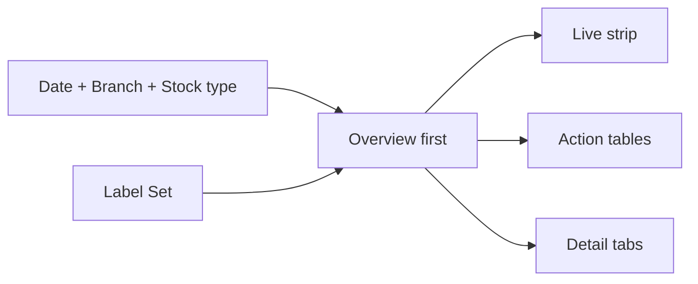
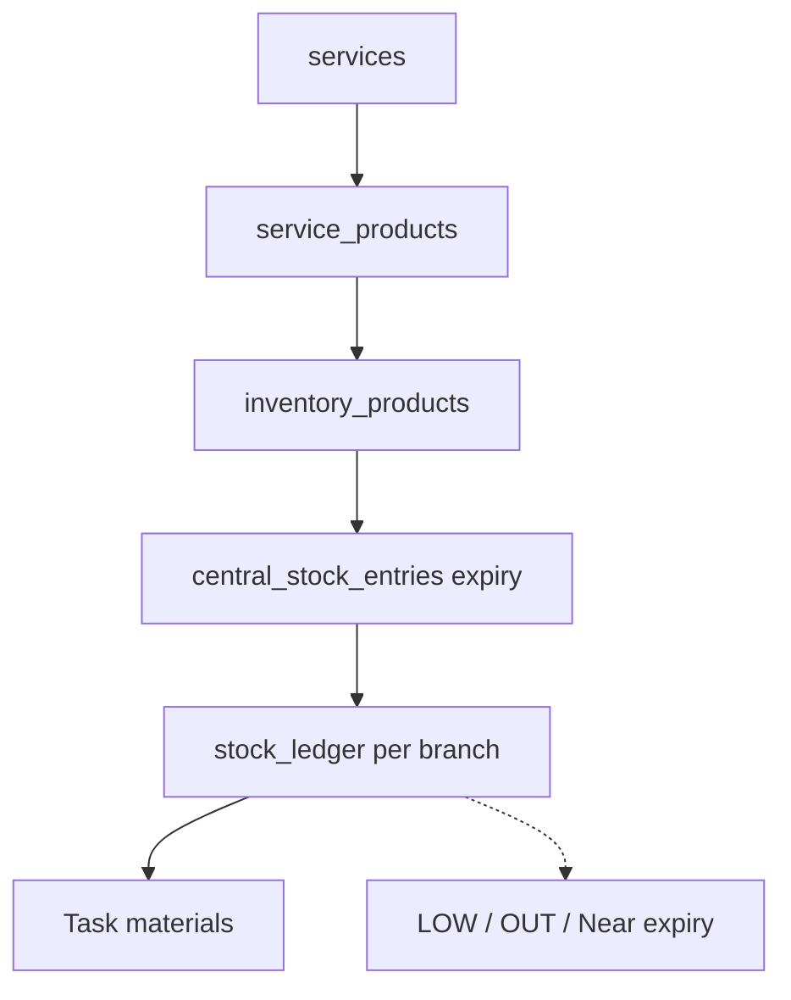
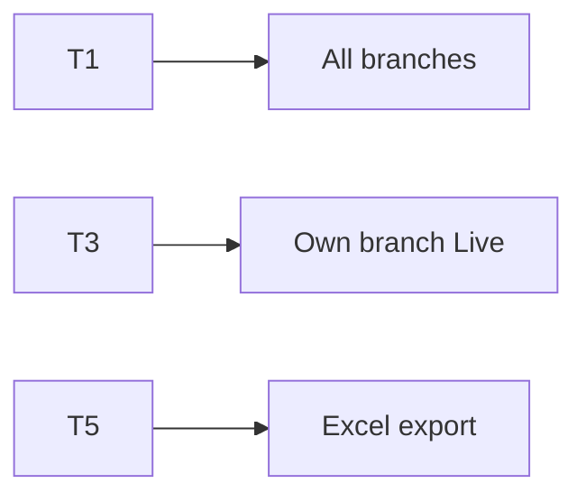
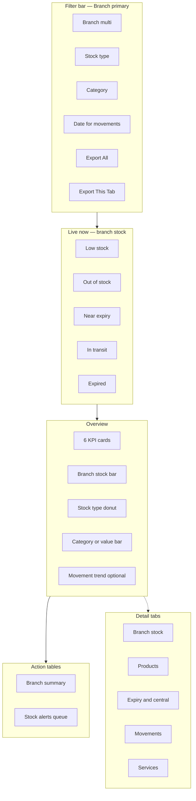

# Inventory & Product · Services Master Dashboard (PRD / BRD)

> **Document type:** PRD + BRD analytics spec (Easy English)  
> **Hub module:** **Inventory & Product · Services Master** (one combined dashboard — Overview-first, **branch-focused**)  
> **Modules combined:** Product Management · Stock Management · Central Stock · Service Catalog (pest-control services + linked products)  
> **Audience:** T1–T5  
> **Last analyzed:** 2026-07-28  
> **Sources:** `InventoryService`, `InventoryRepository`, `InventoryDashboard.jsx`, Java Module 10–11–14 (`inventory_products`, `stock_ledger`, `central_stock_entries`, `services`, `service_products`)

---

## Business requirements (Easy English)

**Problem:** Branch and HO inventory teams open one **Inventory** card but still cannot answer in one glance, **per branch**: What is **live stock** right now? Which **consumables expire soon**? Which SKUs are **low or out**? How is stock split across **Assets · Consumables · Resell**? Which **services** use which products?

**Goal:** One **branch-first** master page — Overview shows live stock health and exceptions first — then detail tabs for products, branch ledger, central stock/expiry, movements, and service catalog. **Action tables** drive reorder, transfer, and expiry disposal.

**Success looks like:**
1. Branch manager answers “What will run out this week in my branch?” in **under 2 minutes on Overview**
2. HO sees **branch compare** for stock value, low/out counts, and consumable expiry risk
3. Ops acts from **Low stock**, **Near expiry**, and **Out of stock** queues with deep-links
4. Auditor exports Excel **overall or per tab** — each sheet = graphs + row-level stock detail

---

## Visualization strategy (data-analyst view)

### Design rule: Branch-first · Live stock first · Overview-first

| Layer | What user sees | Purpose |
|-------|----------------|---------|
| **1. Live strip** | Low · Out · Near expiry · In transit · Expired | Stop field job failures **today** |
| **2. Overview (period + live KPIs)** | 6 KPIs + branch compare + type split + category/value charts | Branch health at a glance |
| **3. Action tables** | Branch summary + Stock alerts queue | Reorder / transfer / dispose |
| **4. Detail tabs** | Branch stock · Products · Expiry & central · Movements · Services | Drill-down |
| **5. Excel export** | Overall or per-tab; graph + detail on every sheet | Audit / HO review |

**Anti-pattern:** Eleven KPI tiles with six tables below — current UI packs too much on one scroll with no Live strip or unified action queue.

### Stock type model (do not confuse)

| Concept | Easy English | Where in data |
|---------|--------------|---------------|
| **Stock type (qty buckets)** | Assets · Consumables · Resell | `stock_ledger.assets_qty`, `consumable_qty`, `resell_qty` |
| **Product category** | CHEMICAL, SPRAYER, MACHINE, … | `inventory_products.category` + denormalized on ledger |
| **Availability status** | AVAILABLE · LOW · OUT · INACTIVE | `stock_ledger.status` (computed in Java stock service from min/reorder) |

Charts must label axes with **Stock type** (Assets/Consumables/Resell) or **Product category** — never mix without legend.

### Overview “must-see” priority (ranked)

| Rank | Insight | Why first | Widget |
|------|---------|-----------|--------|
| 1 | **Live exceptions** | Jobs stop without chemicals | Live strip |
| 2 | **Branch compare** | Which branch is starving? | Clustered bar by branch |
| 3 | **Stock type split** | Assets vs consumables vs resell | Donut L3/L4/L5 |
| 4 | **Inventory value ₹** | Money on shelf | KPI L2 |
| 5 | **Low + out counts** | Reorder pressure | KPI L6/L7 + Action Table 2 |
| 6 | **Near expiry consumables** | Waste + compliance | Live L11 + Action Table 2 |
| 7 | **What to do** | Reorder / transfer / dispose | Action tables |

---

## 1. Purpose & Business Need

Inventory chain in Seravion Connect:

```
Product master (inventory_products)
  → Central stock entry (batch, expiry_date, invoice)
    → Branch stock ledger (assets / consumable / resell qty, status)
      → Task material usage / SO product lines / transfers
Service catalog (services)
  → service_products → inventory_products (chemicals per service)
```

| Stage | Business meaning | Key tables |
|-------|------------------|------------|
| **Product** | SKU master, category, UOM, price | `inventory_products` |
| **Central stock** | HO receipt, batch, **expiry** | `central_stock_entries` |
| **Branch stock** | **Live qty** per branch | `stock_ledger` |
| **Movement** | Audit trail | `stock_movement_logs` |
| **Service** | Sellable pest-control service | `services` + `service_products` |

**Live stock definition:** Current quantities on `stock_ledger` (not period-filtered movement totals). Period filters apply to **movements** and **central entries**, not to on-hand KPIs.

### Outcomes today

| Area | What exists |
|------|-------------|
| Dashboard | Single card `GET /dashboard/inventory` — combined Product + Stock RBAC |
| KPIs | total/active products, total stock, inventory value, assets/consumables/resell, in_transit, reserved, low/out counts |
| Charts | stock_by_category, stock_by_type, branch_stock_chart, movement trend, value by category, monthly type comparison |
| Tables | low_stock, out_of_stock, branch_stock, central_stock_entries, recent_movements, stock_transfers |
| Alerts (service) | low_stock, out_of_stock, high_reserved, high_in_transit, **expired_consumables only** |
| UI | `InventoryDashboard.jsx` — 11 KPIs, 6 tables; branch names mapped client-side from branch_id |
| Excel/PDF | `inventory` in `modulesWithExport` |
| Services | Java Module 14 `services` + `service_products` — **no dashboard adapter** |
| Near expiry | **Not in repo** — only `expiry_date < CURRENT_DATE` (expired) |

### Outcomes recommended

- One master page, **Overview-first**, **branch-first**
- **Live strip** for low / out / near expiry / in transit
- **Action Table 2** unified queue (not six separate paginated tables on home)
- Branch summary with low/out/expiry counts per branch
- **Near expiry** window (e.g. 7 / 30 days) — **Gap** to implement
- Services catalog tab (active services, linked products) — **Gap**
- Excel overall + per tab with graph + detail per module sheet

---

## 2. Combined dashboard (nearby modules)

| Module | Why combined | RBAC Read | Where shown |
|--------|--------------|-----------|-------------|
| **Product (hub)** | SKU master | `PRODUCT_MANAGEMENT` | Overview product KPIs + Products tab |
| **Stock / Branch inventory** | Live branch qty | `STOCK_MANAGEMENT` | Live strip, branch charts, action tables |
| **Central stock** | Batches, expiry, HO receipts | `STOCK_MANAGEMENT` | Expiry tab + Action Table 2 |
| **Service catalog** | What we sell + chemicals used | `SERVICE_MANAGEMENT` | Services tab — **Gap** analytics |
| Purchase / Vendor (optional) | Inbound supply | `PURCHASE_ORDER` / `VENDOR` | Link-out from low stock row |

Hide widgets if no Read. Product-only users see catalog KPIs; stock users see live qty.



### Business flow



---

## 3. Comparison Label Set

| Label ID | Display label (Easy English) | Meaning | Unit | Overview? |
|----------|------------------------------|---------|------|-----------|
| L1 | Total live stock | SUM(assets + consumable + resell) on ledger | qty | KPI |
| L2 | Inventory value | SUM(qty × purchase_price) | ₹ | KPI |
| L3 | Assets qty | SUM assets_qty | qty | Donut / KPI |
| L4 | Consumables qty | SUM consumable_qty | qty | Donut / KPI |
| L5 | Resell qty | SUM resell_qty | qty | Donut / KPI |
| L6 | Low stock SKUs | status = LOW | count | Live + KPI |
| L7 | Out of stock SKUs | status = OUT | count | Live + KPI |
| L8 | In transit qty | SUM in_transit_qty | qty | Live |
| L9 | Reserved qty | SUM reserved_qty | qty | Detail |
| L10 | Active products | inventory_products status ACTIVE | count | KPI |
| L11 | Near expiry batches | expiry within N days, consumable_qty &gt; 0 | count | Live — **Gap** |
| L12 | Expired consumables | expiry_date &lt; today | count | Live |
| L13 | Branch stock (total) | Per branch SUM live qty | qty | Bar chart |
| L14 | Branch low count | LOW rows per branch | count | Branch table |
| L15 | Branch out count | OUT rows per branch | count | Branch table |
| L16 | Stock movement (period) | SUM deltas in period | qty | Line — Period |
| L17 | Active services | services status ACTIVE, not draft | count | Services tab — **Gap** |
| L18 | Services with products | services with ≥1 service_product | count | Services tab — **Gap** |

**Rules:** Live KPIs (L1–L7, L11–L12) ignore movement date filter — only **branch filter**. Same Label ID on UI and Excel.

**Compare modes:** Branch vs Branch · Current vs Prior period (movements only) · Stock type vs Stock type

---

## 4. Users & Roles (who sees what)

| Tier | Roles | Scope | Uses Overview for… |
|------|-------|-------|---------------------|
| T1 Executive | CEO, Owner | All branches | L2, branch bar, type donut, expiry risk |
| T2 Regional | HO / regional ops | Multi-branch | Branch compare + transfer decisions |
| T3 Branch | Branch inventory lead | Own branch(es) | Live strip + action queue |
| T4 Functional | Storekeeper / technician | Assigned branch | Low/out/expiry rows for own branch |
| T5 Audit | Auditor | Read + Export | Excel + movement trail |



---

## 5. Access Control (RBAC)

| Section | Permission | CEO bypass | Branch scope |
|---------|------------|------------|--------------|
| Product KPIs | `PRODUCT_MANAGEMENT` Read | Yes | product master (not branch-specific) |
| Stock / Live / Branch | `STOCK_MANAGEMENT` Read | Yes | stock_ledger.branch_id ∩ filter |
| Central / Expiry | `STOCK_MANAGEMENT` Read | Yes | central_stock_entries.assignee_branch_id |
| Services tab | `SERVICE_MANAGEMENT` Read | Yes | catalog (company-wide) |
| Export Excel (All) | Export on included modules | Yes | scope=overall |
| Export Excel (This tab) | Export on active tab | Yes | scope=overview\|branch\|products\|expiry\|movements\|services |

| Widget | T1 | T2 | T3 | T4 | T5 |
|--------|----|----|----|----|-----|
| Live strip | ✓ | ✓ | ✓ | ✓ | ✓ |
| Overview KPIs + charts | ✓ | ✓ | ✓ | partial | ✓ |
| Action tables | ✓ | ✓ | ✓ | ✓ | ✓ |
| Export | ✓ | ✓ | ✓ | if Export | ✓ |

---

## 6. Global Filters & Live Update

| Filter | Type | Default | API param | Applies to |
|--------|------|---------|-----------|------------|
| **Branch** | Multi-select | User branches | branch | **All live stock** (primary filter) |
| Date range | 7d–YTD / custom | Last 30d | fromDate, toDate | Movements, central entries (period) |
| Compare to | prior_period | prior_period | compareMode | Movement trend deltas — **Gap** |
| Stock type | Multi | All | stockType | assets / consumable / resell columns |
| Product category | Multi | All | category | CHEMICAL, SPRAYER, … |
| Availability | Multi | All | status | AVAILABLE, LOW, OUT |
| Near expiry window | 7d / 30d / 60d | 30d | expiryWithinDays | L11, expiry table — **Gap** |

| Widget group | Layer | Method | Interval |
|--------------|-------|--------|----------|
| Live strip | **Live now** | Poll | 30–60s |
| On-hand KPIs L1–L7 | **Live now** | Poll on branch change | 30–60s |
| Movement charts | Period | Filter change | 60–120s |
| Action tables | Live + Period | Filter + pagination | 60s poll for Live rows |

**Critical rule:** Changing **date range must not hide** live on-hand KPIs — only movement/history widgets.

---

## 7. Existing vs Recommended — Summary

| Area | Existing today | Recommended | Priority |
|------|----------------|-------------|----------|
| Layout | One long inventory card, 11 KPIs + 6 tables | **Overview-first + Live strip + 2 action tables** | P0 |
| Branch focus | branch_stock_chart (branch_id) | **Branch summary table first**; names on API | P0 |
| Live stock | KPIs exist but treated as period dashboard | **Live layer** explicit; poll 30–60s | P0 |
| Near expiry | Only expired alert | **Near expiry** 7/30/60d queue — **Gap** | P0 |
| Action tables | Six separate tables, no actions | **Unified alerts queue** + deep-links | P0 |
| Stock type insights | Donut exists | Overview **stacked bar by branch × type** | P1 |
| Alerts in UI | In service; router omits alerts | Wire alerts to Overview | P0 |
| Services | No analytics | Services tab + product linkage — **Gap** | P1 |
| Excel | Tables-only export | **Overall + per-tab**; graph + detail per sheet | P1 |
| Overview KPI count | 11 tiles | **6 on Overview**; rest on tabs | P0 |

---

## 8. Visual Representation — Overview-first layout

### Wireframe



### ASCII Overview sketch

```
+------------------------------------------------------------------+
| Branch: [Mumbai][Pune][HO]  Type: All  Category: All  [Export]   |
+------------------------------------------------------------------+
| LIVE: Low 24 | OUT 8 | Near expiry 12 | In transit 340 | Exp 3  |
+------------------------------------------------------------------+
| KPI: Live stock | Value ₹ | Assets | Consumables | Resell | Low |
+-----------------------------------+--------------------------------+
| Branch live stock (clustered bar) | Assets / Consumable / Resell |
| Mumbai Pune HO ...                | (donut L3 L4 L5)               |
+-----------------------------------+--------------------------------+
| Inventory value by category (bar) | Movement trend (line, period)  |
+------------------------------------------------------------------+
| Action Table 1: Branch summary (stock, low, out, expiry by branch)|
| Action Table 2: Reorder / Transfer / Dispose queue                 |
+------------------------------------------------------------------+
| Tabs: [Branch Stock][Products][Expiry][Movements][Services]         |
+------------------------------------------------------------------+
```

### Widget placement map

| Zone | Widgets | Desktop | Mobile | Live/Period |
|------|---------|---------|--------|-------------|
| Top | Branch filter prominent + Export | full | stacked | — |
| Live strip | L6, L7, L11, L8, L12 | full | scroll | **Live** |
| Overview KPIs | L1, L2, L3, L6, L7, L10 | 6 cards | 2-col | **Live** |
| Overview charts | Branch bar + type donut + category/value | 2×2 | stacked | Live + Period |
| Action tables | Branch summary + Alerts queue | full | full | Live |
| Detail tabs | Secondary nav | full | accordion | Mixed |

---

## 9. Live strip (detail)

| Chip | Label | Formula / source | Click action |
|------|-------|------------------|--------------|
| L6 | Low stock | `stock_ledger.status = 'LOW'` · branch filter | Filter Action Table 2 |
| L7 | Out of stock | `status = 'OUT'` | Filter Action Table 2 · priority Critical |
| L11 | Near expiry | `central_stock_entries.expiry_date` BETWEEN today AND today+N · consumable_qty &gt; 0 — **Gap** | Expiry tab |
| L8 | In transit | SUM in_transit_qty &gt; 0 SKUs | Transfers / movements |
| L12 | Expired | Existing `expired_consumables` | Dispose queue |

Empty state: “All branches stocked — no urgent inventory actions.”

---

## 10. Overview KPIs (detail)

| # | KPI | Label | Formula | Notes |
|---|-----|-------|---------|-------|
| 1 | Live stock | L1 | SUM(assets+consumable+resell) | Branch filter only |
| 2 | Inventory value | L2 | qty × purchase_price | Join inventory_products |
| 3 | Assets | L3 | SUM assets_qty | Or show Consumables L4 as 3rd tile by filter |
| 4 | Low stock SKUs | L6 | COUNT status LOW | Red if &gt; 0 |
| 5 | Out of stock SKUs | L7 | COUNT status OUT | Red if &gt; 0 |
| 6 | Active products | L10 | ACTIVE products | Product RBAC |

**Fast path (P0):** Reuse `GET /dashboard/inventory` KPIs; add Live strip from alerts when wired.

---

## 11. Overview charts (detail)

| # | Chart | Type | Labels | Source | Impact |
|---|-------|------|--------|--------|--------|
| 1 | **Branch live stock** | Clustered column | Branch · L13 | `branch_stock_chart` + branch names | **Primary** — user asked branch-focused |
| 2 | **Stock type mix** | Donut | L3 · L4 · L5 | `stock_by_type` | Assets vs consumable vs resell |
| 3 | **Branch × stock type** | Stacked column | Branch · three types | **Gap** — derive from branch_stock_table | Shows which branch lacks consumables |
| 4 | Inventory value by category | Bar | Category · ₹ | `inventory_value_by_category` | Money concentration |
| 5 | Movement trend | Line | Date · L16 | `stock_movement_trend` | Period only — secondary on Overview |

**Chart click → Action Table 1** filtered to that branch; type slice → filter Action Table 2 by stock type.

### Detail tabs (secondary)

#### Tab A — Branch stock

Full `branch_stock` table: product, category, assets/consumable/resell, in_transit, reserved, status. Actions: **Transfer**, **Request stock**, **View product**.

#### Tab B — Products

Product master KPIs: total/active, category mix from `inventory_products`. Table: products with group_key variants. Link to product detail.

#### Tab C — Expiry & central stock

| Widget | Source |
|--------|--------|
| Near expiry table | **Gap** — propose 30-day window |
| Expired table | `expired_consumables` alert |
| Central entries | `central_stock_entries` with expiry_date, batch, supplier |
| Actions | **Dispose**, **Transfer to branch**, **Create PO** |

**Near expiry columns (Action Table 2 / tab):**

| Column | Source |
|--------|--------|
| product_name | cse |
| batch_number | cse |
| expiry_date | cse |
| days_to_expiry | calc |
| consumable_qty | cse |
| branch_name | assignee_branch_id → branches |
| supplier_name | cse |
| Action | Transfer / Dispose / Use first (FEFO hint) |

#### Tab D — Movements & transfers

`recent_stock_movements`, `stock_transfers`, monthly stacked assets/consumable/resell (`monthly_stock_comparison`).

#### Tab E — Services catalog

| Widget | Source — **Gap** |
|--------|------------------|
| Active services count | `services` WHERE status ACTIVE |
| By price_type | FIXED / AREA_BASED / INSPECTION |
| Service ↔ product map | `service_products` JOIN inventory_products |
| Actions | View service, View linked chemicals |

---

## 12. Action tables

### Action Table 1 — Branch summary (primary — branch-focused)

| Column | Label | Source |
|--------|-------|--------|
| branch_name | Branch | branches |
| live_stock_qty | L13 | SUM qty on ledger |
| inventory_value | L2 | branch |
| assets_qty | L3 | SUM |
| consumables_qty | L4 | SUM |
| resell_qty | L5 | SUM |
| low_skus | L14 | COUNT LOW |
| out_skus | L15 | COUNT OUT |
| near_expiry_batches | L11 | COUNT near expiry for branch — **Gap** |
| in_transit_qty | L8 | SUM |
| Action | **View branch** | Apply branch filter |

First row: **All Branches** (company total). Sort default: **out_skus DESC**, then low_skus DESC.

### Action Table 2 — Stock alerts queue (actionable)

Unified queue sorted: **Critical → High → Medium**, then days_to_expiry / status.

| severity | domain | Rule |
|----------|--------|------|
| Critical | OUT | status = OUT |
| Critical | EXPIRED | expiry &lt; today |
| High | LOW | status = LOW |
| High | NEAR_EXPIRY | expiry within 7d — **Gap** |
| Medium | NEAR_EXPIRY | expiry within 30d — **Gap** |
| Medium | HIGH_IN_TRANSIT | in_transit_qty &gt; 100 (existing alert) |
| Medium | HIGH_RESERVED | reserved_qty &gt; 50 (existing alert) |

| Column | Easy English |
|--------|--------------|
| severity | Critical / High / Medium |
| alert_type | Low / Out / Near expiry / Expired / In transit / Reserved |
| product_name | SKU name |
| product_code | Code |
| branch_name | Branch |
| stock_type | Asset / Consumable / Resell (which qty bucket triggered) |
| qty_on_hand | Relevant qty |
| expiry_date | If consumable batch |
| days_to_expiry | calc |
| category | Product category |
| message | e.g. “OUT — reorder before next task week” |
| Action | **Reorder (PO)** · **Transfer** · **Request stock** · **View ledger** · **Dispose** |

**Existing alert seeds:** `low_stock_alerts`, `out_of_stock_alerts`, `expired_consumables`, `high_in_transit_stock`, `high_reserved_stock`.

**Deep-links (frontend routes):** stock dashboard, product detail, purchase order create, stock transfer, central stock entry.

---

## 13. Insights we can provide (impactful)

| # | Insight | Question | Decision |
|---|---------|----------|----------|
| 1 | **Branch starvation** | Which branch has most OUT SKUs? | Transfer from HO / peer branch |
| 2 | **Consumable runway** | Near expiry vs task demand | FEFO usage, dispose before waste |
| 3 | **Type imbalance** | Branch high assets but zero consumables | Misallocation |
| 4 | **Value at risk** | ₹ in near-expiry consumables | Write-off planning |
| 5 | **Reorder pressure** | Low + out by category | PO batching |
| 6 | **In-transit visibility** | Stock on road | Promise dates to branches |
| 7 | **Reserved trap** | High reserved, low available | Release or fulfill |
| 8 | **Category concentration** | 80% value in CHEMICAL? | Supplier negotiation |
| 9 | **Movement anomaly** | Spike OUT without IN | Shrinkage audit |
| 10 | **Service readiness** | Service active but linked product OUT | Pause selling / substitute |
| 11 | **Central vs branch** | Expiry at HO not yet transferred | Push transfer before expiry |
| 12 | **CEO branch compare** | Pune vs Mumbai health score | Capital allocation |

**Branch health score (optional P2):**  
`100 − (OUT×10 + LOW×3 + near_expiry×2)` capped 0–100 per branch — display on Branch summary.

---

## 14. Excel Export Package — Overall + Per-Tab (Graph + Detail on Every Sheet)

### Export modes

| Mode | Button | Workbook |
|------|--------|----------|
| Overall | Export Excel (All) | Full inventory + products + services |
| Per tab | Export Excel (This tab) | Active tab sheets only |

**Filename:** `Seravion_Inventory_{scope}_{YYYYMMDD}_{branches}.xlsx`

### API

| Item | Spec |
|------|------|
| Overall | `GET /dashboard/inventory-master/export/excel?scope=overall&includeCharts=true` |
| Per tab | `?scope=overview \| branch \| products \| expiry \| movements \| services` |
| Existing | `GET /dashboard/inventory/export/excel` (tables only) |

### Overall workbook sheets

| Sheet | Graph(s) | Detail rows |
|-------|----------|-------------|
| Cover | — | Filters, branches, Label Set |
| Overview_Summary | — | L1–L18 live/KPI |
| Overview_Graphs | Branch bar · Type donut · Category value bar · Movement line | Mini tables under charts |
| Overview_Branch | Branch summary | Action Table 1 |
| Overview_Alerts | — | Action Table 2 full queue |
| Branch_Stock_Summary | Stacked type by branch | KPI block |
| Branch_Stock_Detail | — | branch_stock all columns |
| Products_Summary | Category pie | L10 |
| Products_Detail | — | product master rows |
| Expiry_Summary | Near expiry timeline bar — **Gap** | L11/L12 |
| Expiry_Detail | — | near + expired + central_stock_entries |
| Movements_Summary | Monthly stacked assets/consumable/resell | L16 |
| Movements_Detail | — | recent_stock_movements + transfers |
| Services_Summary | Active by price_type — **Gap** | L17/L18 |
| Services_Detail | — | services + service_products |
| Charts_Data | — | Excel Tables |
| Dictionary | — | Labels + formulas |

Every module sheet: **KPI block + 1–2 charts + detail table** on same sheet (same rule as Customer/CRM specs).

---

## 15. API Specification (existing + proposed)

### Existing

| Method | Path | Purpose |
|--------|------|---------|
| GET | `/dashboard/inventory` | KPIs, charts, tables, modules list; RBAC split Product/Stock |
| GET | `/dashboard/inventory/export/excel` | Table export |
| GET | `/dashboard/inventory/export/pdf` | Chart PDF |

### Proposed

| Method | Path | Response | Notes |
|--------|------|----------|-------|
| GET | `/dashboard/inventory-master/overview` | live + kpis + branchSummary + alerts | Fast orchestrator |
| GET | `/dashboard/inventory-master/near-expiry` | expiryWithinDays, branchIds | L11 + Action Table 2 — **Gap** |
| GET | `/dashboard/inventory-master/branch-type-matrix` | branch × assets/consumable/resell | Stacked chart — **Gap** |
| GET | `/dashboard/inventory-master/services` | service catalog + product links | Services tab — **Gap** |
| GET | `/dashboard/inventory-master/export/excel` | scope + includeCharts | Recommended export |

**Router fix (P0):** Return `get_inventory_alerts()` on standard GET or dedicated `/alerts` endpoint.

### Proposed near-expiry SQL (Gap)

```sql
SELECT cse.product_name, cse.batch_number, cse.expiry_date,
       cse.consumable_qty, cse.assignee_branch_id, b.branch_name,
       (cse.expiry_date - CURRENT_DATE) AS days_to_expiry
FROM central_stock_entries cse
LEFT JOIN branches b ON cse.assignee_branch_id = b.id
WHERE cse.expiry_date BETWEEN CURRENT_DATE AND CURRENT_DATE + :expiry_days * INTERVAL '1 day'
  AND cse.consumable_qty > 0
  AND cse.deleted_at IS NULL
  AND (:branches IS NULL OR cse.assignee_branch_id = ANY(:branches))
ORDER BY cse.expiry_date ASC
```

---

## 16. Cross-Module Interactions

| Module | Connection |
|--------|------------|
| Purchase Order | Reorder from low/out rows |
| Vendor | Supplier on central_stock_entries |
| Task | Material usage reduces consumables |
| Sales Order | Product lines reduce resell |
| Service catalog | service_products → inventory_products |

---

## 17. Rules, Validations & Data Quality

- Branch ∩ user_branches (except CEO)
- **Live KPIs:** no date filter on on-hand qty
- Status LOW/OUT from Java `StockManagementServiceImpl` vs min/reorder — dashboard reads persisted `stock_ledger.status`
- Expiry on **central_stock_entries** today — branch-level expiry may need batch transfer tracking (**Gap** if branch batches not stored separately)
- Exclude `deleted_at IS NOT NULL` on products and ledger
- stock_by_type chart: three separate repo calls today — optimize to one query in orchestrator
- branch_stock_chart returns `branch_id` — API should include `branch_name` to avoid frontend-only mapping
- IST dates for expiry display

---

## 18. Gaps & Implementation Notes

1. **P0** — Overview-first layout; reduce home to 6 KPIs + Live strip + 2 action tables
2. **P0** — Wire alerts (low, out, expired, in transit, reserved) to UI
3. **P0** — Branch summary Action Table 1 as primary branch view
4. **P0** — Unified Action Table 2 with severity + deep-links
5. **P0** — Near expiry query (7/30/60d) — not just expired
6. **P0** — Live vs Period filter behaviour documented in API
7. **P1** — Branch × stock type stacked chart
8. **P1** — Services catalog tab (new repo queries on `services`, `service_products`)
9. **P1** — Excel overall + per-tab with embedded charts
10. **P1** — branch_name on branch_stock_chart API response
11. **P2** — Branch health score; FEFO task hint on near expiry rows
12. **P2** — WebSocket for Live strip on busy branches

---

## 19. Acceptance criteria (Easy English)

- [ ] **Branch filter** is primary; Overview answers per-branch stock health without opening tabs
- [ ] **Live strip** shows low, out, near expiry, in transit, expired with 30–60s refresh
- [ ] On-hand KPIs **do not change** when user only changes movement date range
- [ ] Overview has ≤6 KPIs and ≤4 charts using Label Set L3/L4/L5 on type donut
- [ ] **Action Table 1** lists all branches with live stock, low, out, near expiry counts
- [ ] **Action Table 2** merges low, out, near expiry, expired, in transit, reserved with actions
- [ ] Stock type (Assets/Consumables/Resell) clearly separated from product category in charts
- [ ] Detail tabs optional: Branch · Products · Expiry · Movements · Services
- [ ] Export Excel (All) and (This tab); each sheet has graph(s) + detail rows
- [ ] Product-only users see product widgets; stock widgets hidden without STOCK_MANAGEMENT Read
- [ ] Near expiry rows appear before expiry_date passes (not only expired)

---

## 20. Tips for Stakeholders

- **Branch manager:** Open Overview with **your branch only** — Live strip + Action Table 2 every morning
- **HO inventory:** Branch summary sorted by OUT count — plan transfers before PO
- **CEO:** Branch bar + inventory value by category — which branches tie up cash
- **Compliance:** Expiry tab + Export Expiry sheet for consumable audit trail
- **Service lead:** Services tab — ensure linked chemicals are not OUT in key branches

---

## 21. Existing Functionality Summary

**Available today:** Single `/dashboard/inventory` card combining Product + Stock RBAC; rich KPIs (qty, value, assets/consumables/resell, in/out transit/reserved, low/out counts); charts for category, type, branch, movement, value, monthly comparison; six paginated tables; five alert types in service (no near expiry); Excel/PDF export in UI; Java stock engine with LOW/OUT status and central_stock expiry fields; services module in backend without analytics dashboard.

**Not available (recommended):** Overview-first branch-focused master; Live strip; near expiry analytics; unified actionable alert queue; branch × stock type matrix; services catalog on analytics hub; alerts wired to UI; overall + per-tab Excel with graph + detail per sheet; branch names from API; live on-hand decoupled from movement date filter.
