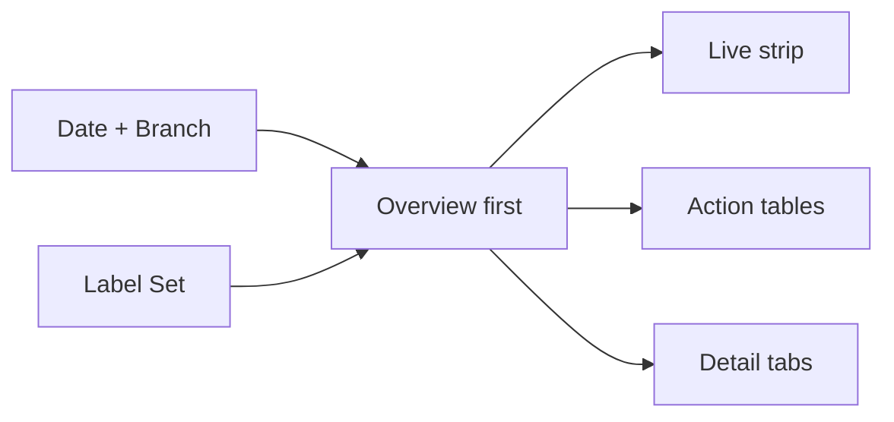
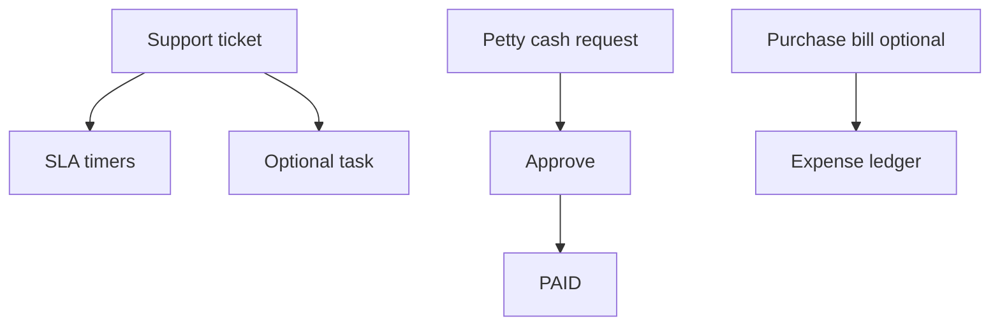
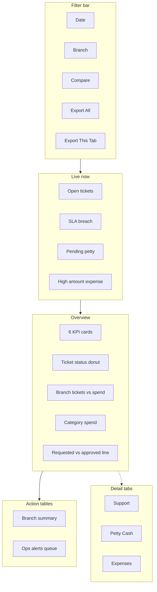

# Operations Support & Internal Spend Master Dashboard — Support · Petty Cash · Expenses (PRD / BRD)

> **Document type:** PRD + BRD analytics spec (Easy English)  
> **Hub module:** **Operations Support & Internal Spend Master** (one combined dashboard — Overview-first)  
> **Modules combined:** Customer Support · Petty Cash (internal employee expenses) · Purchase Bills / operating expenses (optional) · (link-out) Tasks, Finance  
> **Audience:** T1–T5  
> **Last analyzed:** 2026-07-28  
> **Sources:** `SupportService`, `PettyCashService`, `SupportRepository`, frontend `CustomerSupportDashboard` / `PettyCashDashboard`, Java Module 24 (Petty Cash) + Customer Support + Bills

---

## Business requirements (Easy English)

**Problem:** Branch ops and finance open **Customer Support** and **Petty Cash** as separate cards. They cannot see in one place: Which **tickets breach SLA**? How much **internal spend** is pending approval? Which **expense categories** (fuel, travel, office) drive cost by branch? Are customer issues and employee reimbursements both under control?

**Goal:** One **Operations Support & Internal Spend** page — Overview-first — joining **support tickets + petty cash (internal expenses) + optional purchase bills**, with Live exceptions, branch compare, action tables, and Excel export overall or per tab.

**Success looks like:**
1. Support lead answers “Which tickets are SLA-at-risk and which petty cash needs approval?” in **under 2 minutes on Overview**
2. Finance sees **requested vs approved ₹** by branch and category
3. Branch manager acts from unified queue: **Assign ticket**, **Approve expense**, **Pay petty cash**
4. Auditor exports workbook with support + expense charts **and** row detail

---

## Visualization strategy (data-analyst view)

### Design rule: Overview first — service load + spend together

| Layer | What user sees | Purpose |
|-------|----------------|---------|
| **1. Live strip** | Open tickets · SLA breach · Pending petty cash · High amount · Old pending | Stop customer pain + cash leakage **today** |
| **2. Overview** | 6 KPIs + 3–4 charts + 2 action tables | Branch health: issues + internal spend |
| **3. Detail tabs** | Support · Petty Cash · Expenses (bills) · (optional) Category deep-dive | Drill-down |
| **4. Excel export** | Overall or per-tab; graph + detail per sheet | Audit / monthly ops review |

**“Internal expenses” in Seravion:** Primary = **`petty_cash_requests`** (employee reimbursements with `PettyCashCategory`: FUEL, TRAVEL, OFFICE_EXPENSES, …). Secondary = **`purchase_bills`** (vendor operating bills with `expense_category`) — **no dashboard adapter today**.

### What belongs on Overview vs detail tabs

| Decision question | Put on Overview? | Put on detail tab? |
|-------------------|------------------|--------------------|
| Open tickets + SLA breach | Yes — Live + KPI | Full ticket list |
| Pending petty cash approvals | Yes — Live + KPI | All pending rows |
| Approved / paid spend ₹ | Yes — KPI | Payment detail |
| Branch ticket load vs branch spend | Yes — dual bar or table | Full branch matrix |
| Category spend mix (petty cash) | Yes — donut or bar — **Gap** | Category tab |
| Purchase bills overdue | Optional Live — **Gap** | Expenses tab |
| Ticket ↔ task link | No | Support tab |
| Full recent tables | No | Tabs + Excel |

### Overview “must-see” priority (ranked)

| Rank | Insight | Why first | Widget |
|------|---------|-----------|--------|
| 1 | Live exceptions | Customers + cash stuck | Live strip |
| 2 | SLA breach / at-risk tickets | Contract trust | Live L5/L6 |
| 3 | Pending petty cash | Cash out the door | Live L11 |
| 4 | Open tickets | Workload | KPI L1 |
| 5 | Internal spend ₹ | Budget control | KPI L9/L10 |
| 6 | Branch compare | Who needs help? | Action Table 1 |
| 7 | What to do | Assign / approve / pay | Action Table 2 |

---

## 1. Purpose & Business Need

Operations chain:

```
Customer issue
  → Support ticket (SLA, assignee, priority, link to task/SO)
    → Optional field task

Employee / branch need
  → Petty cash request (category, amount, approval, pay)
    → Internal expense posted

Vendor bill (optional)
  → Purchase bill (expense_category, due date, pay status)
    → Ledger expense
```

| Stage | Business meaning | Key tables |
|-------|------------------|------------|
| **Support** | Customer complaints / service issues | `support_tickets` — SLA fields, priority, status, branch_id |
| **Petty cash** | Internal employee expenses | `petty_cash_requests` — category, amount_requested, approved_amount, status |
| **Purchase bills** | Vendor operating expenses | `purchase_bills` — expense_category, status, due_date — **Gap** on dashboard |

**Support statuses (`SupportTicketStatus`):** `OPEN` · `ASSIGNED` · `IN_PROGRESS` · `PAUSED` · `RESOLVED` · `CLOSED`  
**Support priority:** `NORMAL` · `HIGH` · `URGENT` · `CRITICAL`  
**Petty cash status (`PettyCashStatus`):** `DRAFT` · `PENDING` · `APPROVED` · `REJECTED` · `RETURNED` · `PAID` · `REVOKED`  
**Petty cash categories (`PettyCashCategory`):** e.g. `FUEL`, `TRAVEL_EXPENSES`, `OFFICE_EXPENSES`, `LOCAL_CONVEYANCE`, `CHEMICAL`, … (19 values)

### Outcomes today

| Area | What exists |
|------|-------------|
| Support card | `GET /dashboard/customer_support` — KPIs: total, open (status=OPEN only), closed, high priority (HIGH only); charts: status, daily, priority; tables: recent_tickets, open_high_priority; alerts: high_priority, old_open (&gt;3d) |
| Petty cash card | `GET /dashboard/petty_cash` — KPIs: requested ₹, approved ₹, pending count, paid count; charts: status, branch_expense, monthly_requests; tables: recent_requests, approved_payments; alerts: high_amount (&gt;₹10k), pending_old (&gt;3d) |
| Overview | Support + petty cash KPIs; charts: open vs closed tickets monthly, petty monthly expense, requested vs approved |
| Excel | **Neither** petty cash nor support in `modulesWithExport` |
| Alerts | In services — **not returned** by standard dashboard GET; UI has no Live strip |
| SLA | Rich fields on `support_tickets` — **not in dashboard analytics** |
| Open ticket definition | Dashboard counts only `OPEN`; Java has ASSIGNED, IN_PROGRESS, etc. — **under-counts workload** |
| Purchase bills | Java Bills module — **no dashboard service** |

### Outcomes recommended

- One master page, **Overview-first**
- Unified Live strip + action queue (tickets + petty cash)
- **Open tickets** = not CLOSED (or OPEN+ASSIGNED+IN_PROGRESS+PAUSED)
- **SLA breach / at-risk** from `response_sla_breached`, `resolution_sla_breached`, `sla_risk_at`
- Petty cash **category breakdown** chart
- Optional **Purchase bills** tab for operating expenses
- Excel **overall + per tab**

---

## 2. Combined dashboard (nearby modules)

| Module | Why combined | RBAC Read | Where shown |
|--------|--------------|-----------|-------------|
| **Customer Support (hub)** | Customer satisfaction + SLA | `CUSTOMER_SUPPORT_MANAGEMENT` | Overview tickets + Support tab |
| **Petty Cash** | Internal branch/employee spend | `PETTY_CASH_MANAGEMENT` | Overview spend + Petty tab |
| **Purchase bills** | Vendor operating expenses | Bills / Finance Read — **Gap** | Expenses tab (optional) |
| Task (link-out) | Ticket → task | `TASK_MANAGEMENT` | Deep-link from ticket row |
| Sales Order (context) | Ticket may link SO | Read on SO | Support detail column |



### Business flow



---

## 3. Comparison Label Set

| Label ID | Display label (Easy English) | Meaning | Unit | Overview? |
|----------|------------------------------|---------|------|-----------|
| L1 | Open tickets | status NOT CLOSED (recommended) | count | KPI + Live |
| L2 | Closed tickets | status = CLOSED | count | Detail |
| L3 | Tickets created | COUNT in period | count | Trend |
| L4 | High+ priority open | priority IN (HIGH, URGENT, CRITICAL) · open | count | Live |
| L5 | SLA response breached | response_sla_breached = true · open | count | Live — **Gap** |
| L6 | SLA resolution breached | resolution_sla_breached = true · open | count | Live — **Gap** |
| L7 | SLA at risk | now &gt; sla_risk_at · open | count | Live — **Gap** |
| L8 | Avg resolution time | AVG(resolved_at − created_at) open/closed | hours | Detail — **Gap** |
| L9 | Petty cash requested | SUM amount_requested (period) | ₹ | KPI |
| L10 | Petty cash approved | SUM approved_amount (period) | ₹ | KPI |
| L11 | Pending petty cash | status = PENDING | count | Live + KPI |
| L12 | Paid petty cash | status = PAID (period) | count | Detail |
| L13 | Approval gap ₹ | L9 − L10 | ₹ | KPI optional |
| L14 | Branch ticket count | Open tickets by branch | count | Branch table |
| L15 | Branch petty spend | SUM approved_amount by branch | ₹ | Branch bar |
| L16 | Category spend | SUM approved by category | ₹ | Donut — **Gap** |
| L17 | High amount requests | amount_requested &gt; threshold | count | Live |
| L18 | Purchase bills due | status OVERDUE / due — **Gap** | count | Live optional |
| L19 | Operating expense ₹ | SUM purchase_bills — **Gap** | ₹ | Expenses tab |

**Rules:** Same Label ID on UI and Excel. Support = branch-scoped (`branch_id`). Petty cash = `requester_branch_id`.

---

## 4. Users & Roles

| Tier | Roles | Scope | Uses Overview for… |
|------|-------|-------|---------------------|
| T1 Executive | CEO | All branches | SLA breach, spend ₹, branch compare |
| T2 Regional | Ops / finance head | Multi-branch | Branch table + approval queue |
| T3 Branch | Branch manager | Own branch | Live strip + actions |
| T4 Functional | Support agent / approver | Assigned | Tickets + petty approvals |
| T5 Audit | Auditor | Read + Export | Excel |

---

## 5. Access Control (RBAC)

| Section | Permission | CEO bypass | Branch scope |
|---------|------------|------------|--------------|
| Support widgets | `CUSTOMER_SUPPORT_MANAGEMENT` | Yes | support_tickets.branch_id |
| Petty cash widgets | `PETTY_CASH_MANAGEMENT` | Yes | requester_branch_id |
| Purchase bills tab | Bills/Finance Read — **Gap** | Yes | bill branch if exists |
| Export Excel (All) | Export on included modules | Yes | scope=overall |
| Export Excel (This tab) | Per active tab | Yes | scope=overview\|support\|petty\|expenses |

---

## 6. Global Filters & Live Update

| Filter | Type | Default | API param | Applies to |
|--------|------|---------|-----------|------------|
| Date range | 7d–YTD / custom | Last 30d | fromDate, toDate | Ticket created_at; petty submitted_at |
| Branch | Multi-select | User branches | branchIds | Both modules |
| Compare to | prior_period | prior_period | compareMode | KPI deltas — **Gap** |
| Ticket status | Multi | Non-closed | status | Support |
| Petty status | Multi | All | pettyStatus | Petty cash |
| Category | Multi | All | category | Petty cash |

| Widget group | Layer | Refresh |
|--------------|-------|---------|
| Live strip | Live | 60–120s |
| Open ticket / pending petty counts | Live | 60–120s (may ignore date filter) |
| Period charts | Period | On filter change |

**Recommended:** Live open ticket count and pending petty **ignore date filter** (current queue). Period KPIs use date filter.

---

## 7. Existing vs Recommended — Summary

| Area | Existing today | Recommended | Priority |
|------|----------------|-------------|----------|
| Layout | Two separate cards | **One Overview-first master** | P0 |
| Live strip | None | SLA + pending + high amount + old open | P0 |
| Open ticket count | OPEN only | **Not CLOSED** (or active status set) | P0 |
| SLA analytics | Fields in DB, not in dashboard | L5–L7 Live + Support tab | P0 |
| Priority | HIGH only in KPI | HIGH + URGENT + CRITICAL | P1 |
| Petty category chart | None | L16 donut/bar — **Gap** | P1 |
| Action tables | Display-only | Unified queue + deep-links | P0 |
| Purchase bills | No analytics | Expenses tab — **Gap** | P2 |
| Excel | Not in export list | Overall + per-tab | P1 |
| Alerts in UI | Not wired | Wire service alerts | P0 |

---

## 8. Visual Representation — Overview-first layout

### Wireframe



### ASCII Overview sketch

```
+------------------------------------------------------------------+
| Filters: Date | Branch | Compare              [Export All][Tab] |
+------------------------------------------------------------------+
| LIVE: Open 42 | SLA breach 5 | Pending petty 8 | High ₹ 3         |
+------------------------------------------------------------------+
| KPI: Open | SLA risk | Pending ₹ req | Approved ₹ | Pending # | Gap|
+-----------------------------------+--------------------------------+
| Ticket status (donut)             | Branch: tickets vs spend (bar) |
+-----------------------------------+--------------------------------+
| Petty category spend (bar)        | Requested vs approved (line)     |
+------------------------------------------------------------------+
| Action Table 1: Branch summary (tickets, SLA, petty ₹)             |
| Action Table 2: Assign / Approve / Pay queue                       |
+------------------------------------------------------------------+
| Tabs: [Support] [Petty Cash] [Expenses]                            |
+------------------------------------------------------------------+
```

---

## 9. Live strip (detail)

| Chip | Label | Source |
|------|-------|--------|
| L1 | Open tickets | Not CLOSED — **Gap** vs today OPEN-only |
| L5/L6 | SLA breached | response/resolution_sla_breached — **Gap** |
| L7 | SLA at risk | sla_risk_at — **Gap** |
| L11 | Pending petty | status PENDING |
| L17 | High amount | amount_requested &gt; 10000 (existing alert) |
| — | Old open tickets | &gt;3 days OPEN (existing alert) |
| — | Old pending petty | PENDING &gt;3 days (existing alert) |

---

## 10. Overview KPIs (6 cards)

| KPI | Label | Formula |
|-----|-------|---------|
| 1 | Open tickets | L1 (recommended: NOT CLOSED) |
| 2 | SLA at risk / breached | L5+L6 or L7 — **Gap** |
| 3 | Petty requested | L9 |
| 4 | Petty approved | L10 |
| 5 | Pending petty | L11 |
| 6 | Approval gap | L13 = L9−L10 (optional) |

**Fast path:** Parallel `GET /dashboard/customer_support` + `GET /dashboard/petty_cash`.

---

## 11. Overview charts

| # | Chart | Type | Labels | Source |
|---|-------|------|--------|--------|
| 1 | Ticket status | Donut | All statuses | `status_chart` |
| 2 | Branch workload vs spend | Clustered bar | L14 + L15 | Join branch ticket count + `branch_expense` — **partial Gap** |
| 3 | Petty category spend | Horizontal bar | L16 | **Gap** — GROUP BY category |
| 4 | Requested vs approved | Line | Month · L9/L10 | Overview `cmp_petty_cash_requested_vs_approved` |

---

## 12. Action tables

### Action Table 1 — Branch summary

| Column | Source |
|--------|--------|
| branch_name | branches |
| open_tickets | L14 per branch |
| sla_breached | L5+L6 per branch — **Gap** |
| pending_petty | L11 per branch |
| approved_spend | L15 |
| requested_spend | L9 per branch |
| Action | Filter branch |

### Action Table 2 — Ops alerts queue

| severity | domain | Examples | Actions |
|----------|--------|----------|---------|
| Critical | Support | SLA breached, URGENT open | **Assign**, **View ticket**, Create task |
| High | Support | Old open, HIGH priority | **Assign**, **Resolve** |
| High | Petty | Pending &gt;3d, high amount | **Approve**, **Reject**, **Pay** |
| Medium | Petty | PENDING &lt;3d | **Approve** |

**Columns:** severity · domain · ref_no · customer/employee · branch · amount · due/SLA · message · Action

**Existing alert seeds:** `high_priority_alert`, `old_open_tickets`, `high_amount`, `pending_old`

---

## 13. Insights we can provide

| # | Insight | Question | Decision |
|---|---------|----------|----------|
| 1 | SLA compliance | Are we breaching response/resolution? | Staffing, escalation |
| 2 | Ticket backlog | Open by branch? | Reassign agents |
| 3 | Priority load | URGENT/CRITICAL open? | CEO escalation |
| 4 | Internal spend control | Requested vs approved ₹? | Tighten approval |
| 5 | Category leakage | Fuel vs travel vs office? | Policy |
| 6 | Branch compare | Mumbai tickets high + spend high? | Ops review |
| 7 | Approval bottleneck | Pending &gt;3 days? | Finance chase |
| 8 | High-value expenses | Requests &gt; ₹10k? | Extra scrutiny |
| 9 | Ticket → task | Issues needing field visit? | Link task from ticket |
| 10 | Customer impact | Open tickets per active customer — **Gap** | Account management |
| 11 | Pay cycle | APPROVED but not PAID — **Gap** | Cash disbursement |
| 12 | Operating bills | Vendor expenses due — **Gap** | Payables |

---

## 14. Excel Export — Overall + Per-Tab

### Export modes

| Mode | Workbook |
|------|----------|
| Export Excel (All) | Support + Petty + Expenses (if Read) |
| Export Excel (This tab) | Active tab only |

**Filename:** `Seravion_OpsSupport_{scope}_{YYYYMMDD}.xlsx`

### API

| Item | Spec |
|------|------|
| Overall | `GET /dashboard/ops-support/export/excel?scope=overall&includeCharts=true` |
| Per tab | `?scope=overview \| support \| petty \| expenses` |
| Existing | Generic `/dashboard/customer_support`, `/dashboard/petty_cash` — no export in UI list |

### Workbook sheets (overall)

| Sheet | Graph(s) | Detail |
|-------|----------|--------|
| Cover | — | Filters, Label Set |
| Overview_Summary | — | L1–L19 |
| Overview_Graphs | Status donut · Branch bar · Category bar · Requested vs approved | Mini tables |
| Overview_Branch | — | Action Table 1 |
| Overview_Alerts | — | Action Table 2 |
| Support_Summary | Priority bar · Daily line | L1–L8 |
| Support_Detail | — | recent_tickets + SLA columns — **Gap** |
| Petty_Summary | Status · Branch expense · Category | L9–L17 |
| Petty_Detail | — | recent_requests + approved_payments |
| Expenses_Summary | — | purchase_bills — **Gap** |
| Charts_Data | — | Excel Tables |
| Dictionary | — | Formulas |

---

## 15. API Specification

### Existing

| Method | Path | Purpose |
|--------|------|---------|
| GET | `/dashboard/customer_support` | Support KPIs/charts/tables/alerts |
| GET | `/dashboard/petty_cash` | Petty KPIs/charts/tables/alerts |
| GET | `/dashboard/overview` | Partial KPIs + compare charts |

### Proposed

| Method | Path | Response | Notes |
|--------|------|----------|-------|
| GET | `/dashboard/ops-support/overview` | live, kpis, charts, branchSummary, alerts | Orchestrator |
| GET | `/dashboard/ops-support/sla` | breach/at-risk counts | L5–L7 — **Gap** |
| GET | `/dashboard/ops-support/petty-by-category` | L16 series | **Gap** |
| GET | `/dashboard/ops-support/branch-matrix` | tickets + petty by branch | Action Table 1 |
| GET | `/dashboard/ops-support/export/excel` | scope + includeCharts | Recommended |

### Proposed SLA query (Gap)

```sql
SELECT COUNT(*) FILTER (WHERE response_sla_breached = TRUE AND status <> 'CLOSED'),
       COUNT(*) FILTER (WHERE resolution_sla_breached = TRUE AND status <> 'CLOSED'),
       COUNT(*) FILTER (WHERE sla_risk_at IS NOT NULL AND sla_risk_at <= NOW() AND status <> 'CLOSED')
FROM support_tickets st
WHERE (:branches IS NULL OR st.branch_id = ANY(:branches))
```

### Proposed petty category (Gap)

```sql
SELECT pc.category, COALESCE(SUM(pc.approved_amount), 0)
FROM petty_cash_requests pc
WHERE pc.status IN ('APPROVED', 'PAID') AND {filters}
GROUP BY pc.category ORDER BY SUM(pc.approved_amount) DESC
```

### Proposed open tickets (fix)

```sql
-- Recommended L1: active workload
WHERE st.status NOT IN ('CLOSED')
-- Today dashboard: WHERE st.status = 'OPEN' only (under-counts)
```

---

## 16. Cross-Module Interactions

| Module | Connection |
|--------|------------|
| Customer | Ticket customer_id |
| Task | related_task_id, SupportTicketTask link |
| Sales Order | sales_order_id on ticket |
| HRM / Users | requester_user_id on petty cash |
| Finance / Ledger | Petty PAID + purchase bill confirm |
| Inventory | Petty categories CHEMICAL, FUEL may tie to stock |

---

## 17. Rules & Data Quality

- Branch ∩ user_branches (except CEO)
- Petty cash date filter on `submitted_at` (existing)
- Support date filter on `created_at` (existing)
- **Fix open ticket definition** for KPI/Live vs Java status model
- **Fix priority KPI** to include URGENT/CRITICAL or rename label
- Support repo maps `subject` as `issue_type` in tables — document in Dictionary
- IST for SLA deadlines display
- Live queue counts should not hide behind period filter (recommended)

---

## 18. Gaps & Implementation Notes

1. **P0** — One master page; Overview-first
2. **P0** — Wire alerts; Live strip
3. **P0** — Open ticket = not CLOSED (or active set)
4. **P0** — Action Table 2 with Assign / Approve / Pay deep-links
5. **P0** — SLA breach/at-risk KPIs and Live chips
6. **P1** — Petty category chart (L16)
7. **P1** — Branch matrix (tickets + petty on one row)
8. **P1** — Excel overall + per-tab; add to export list
9. **P1** — Priority KPI: HIGH+URGENT+CRITICAL
10. **P2** — Purchase bills / operating expenses tab
11. **P2** — APPROVED-not-PAID queue
12. **P2** — `/dashboard/ops-support/overview` thin endpoint

---

## 19. Acceptance criteria

- [ ] Overview shows support + internal spend without opening tabs
- [ ] Live strip: open tickets, SLA breach (when API ready), pending petty, high amount
- [ ] ≤6 KPIs and ≤4 charts with Label Set names
- [ ] Detail tabs: Support · Petty Cash · Expenses (optional)
- [ ] Action tables with Assign / Approve / Pay / View actions
- [ ] Branch filter scopes both modules correctly
- [ ] Export Excel (All) and (This tab); each sheet has graph(s) + detail rows
- [ ] Open ticket count matches agreed definition (not CLOSED)
- [ ] User sees only domains they can Read

---

## 20. Tips for Stakeholders

- **Support lead:** Live SLA breach first, then Action Table 2 Assign
- **Finance:** Pending petty + approval gap ₹; Export Petty tab for audit
- **Branch manager:** Branch summary row — tickets vs spend same screen
- **CEO:** Overview requested vs approved line + SLA Live chips

---

## 21. Existing Functionality Summary

**Available today:** Separate Customer Support and Petty Cash dashboard cards with KPIs, charts, tables; alerts in service layer; Overview partial KPIs and petty requested vs approved monthly chart; Java rich SLA on tickets and 19 petty cash categories; petty cash linked to tasks for dropdown.

**Not available (recommended):** Unified Operations Support & Internal Spend master; Live strip; SLA analytics on dashboard; correct open-ticket and priority definitions; petty category breakdown; purchase bills / operating expenses analytics; wired alerts; action queue with deep-links; overall + per-tab Excel with graph + detail per sheet.
