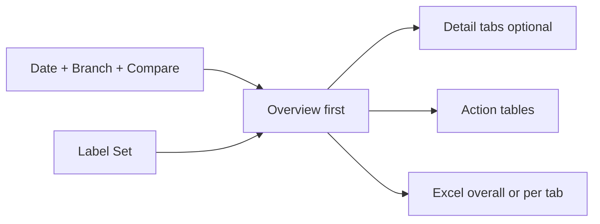
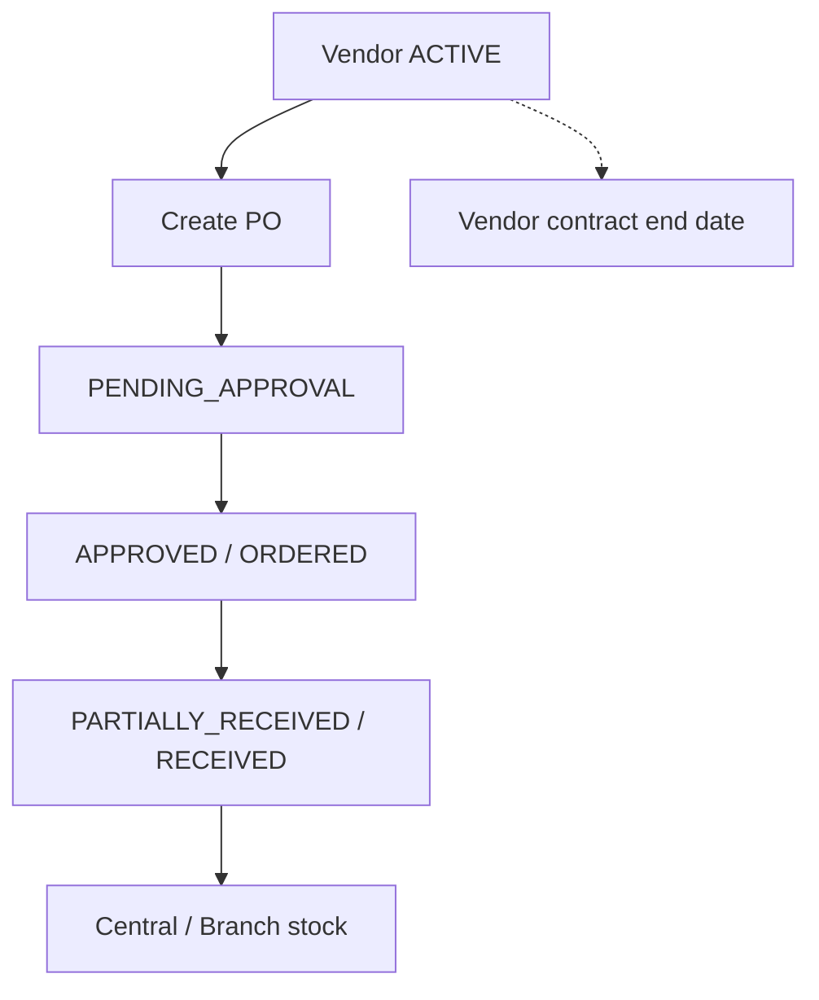
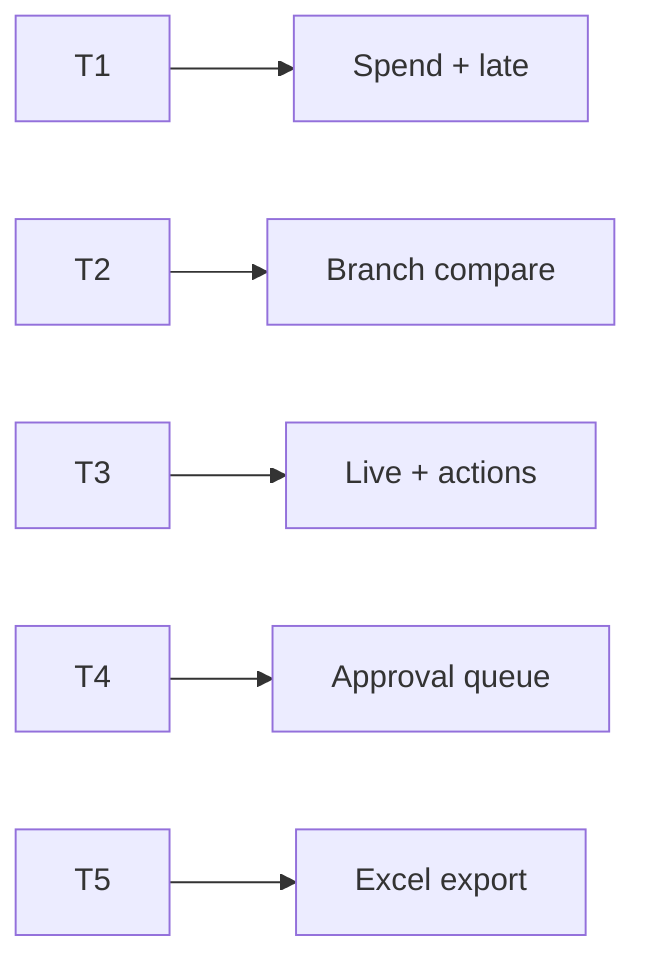
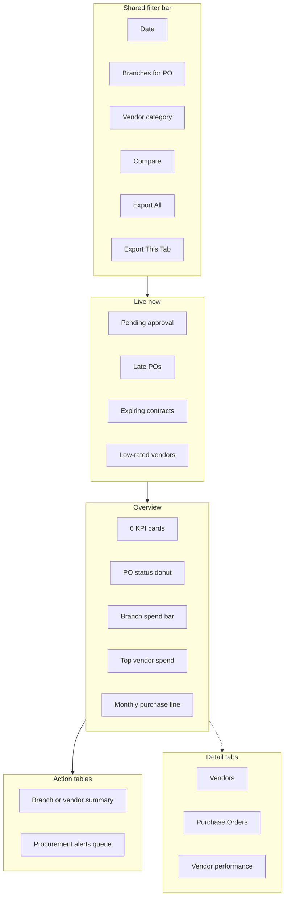

# Procurement Master Dashboard — Vendor · Purchase Order (PRD / BRD)

> **Document type:** PRD + BRD analytics spec (Easy English)  
> **Hub module:** **Procurement Master** (one combined dashboard — Overview-first)  
> **Modules combined:** Vendor Management · Purchase Order Management · (optional link) Inventory / Central Stock receive  
> **Audience:** T1–T5  
> **Last analyzed:** 2026-07-28  
> **Sources:** `VendorService`, `PurchaseService`, `VendorDashboard.jsx`, `PurchaseOrderDashboard.jsx`, Java Vendor + PurchaseOrder modules, `overview_service.py`

---

## Business requirements (Easy English)

**Problem:** Procurement and branch leaders open **Vendor** and **Purchase Order** as two separate dashboard cards. They cannot see in one place: How much are we **spending**? Which POs are **late** or stuck in **approval**? Which **vendor contracts expire** soon? Which vendors get most spend but score **low ratings**?

**Goal:** One **Procurement** page — Overview-first — that joins **vendors + purchase orders**, with Live exceptions, branch-aware PO spend, vendor performance insights, action tables, and Excel export overall or per tab.

**Success looks like:**
1. Procurement head answers “What to approve, chase, or renew today?” in **under 2 minutes on Overview**
2. CEO sees **purchase spend ₹**, late POs, and top vendors by spend vs rating
3. Store / branch lead uses action tables to chase late delivery and create PO for low stock (link-out)
4. Auditor exports workbook with spend charts **and** PO/vendor row detail

---

## Visualization strategy (data-analyst view)

### Design rule: Overview first — not two separate cards

| Layer | What user sees | Purpose |
|-------|----------------|---------|
| **1. Overview (always visible)** | Live strip + 6 KPIs + 3–4 charts + 2 action tables | Answer “is buying healthy?” |
| **2. Detail tabs (secondary)** | Vendors · Purchase Orders · Vendor performance | Drill when Overview is not enough |
| **3. Action tables** | Branch / vendor spend summary + procurement alerts queue | What to do next |
| **4. Excel export** | Overall or per-tab; each sheet = KPI + graph(s) + detail | Audit / monthly buy review |

**Anti-pattern:** Two equal cards (Vendor + PO) with no shared Live strip or conversion of spend → delivery.

### What belongs on Overview vs detail tabs

| Decision question | Put on Overview? | Put on detail tab? |
|-------------------|------------------|--------------------|
| Purchase spend ₹ this period | Yes — KPI | Monthly trend deep-dive |
| Pending / open POs | Yes — KPI + Live | Full PO list by status |
| Late deliveries | Yes — Live + KPI | Late PO detail list |
| Active vendors + avg rating | Yes — KPI | Category / rating charts |
| Expiring vendor contracts | Yes — Live | Full contract list |
| Top vendor spend | Yes — horizontal bar | Vendor × branch summary |
| Low-rated vendors with high spend | Optional thin insight | Vendor performance tab |
| Recent vendors / full PO lines | No — noise | Domain tab + Excel |

### Overview “must-see” priority (ranked)

| Rank | Insight | Why first | Widget |
|------|---------|-----------|--------|
| 1 | Live exceptions | Money / supply risk today | Live strip |
| 2 | Spend ₹ | How much bought? | KPI L5 |
| 3 | Late + pending POs | Delivery / approval stuck | KPI L6, L7 |
| 4 | Vendor health | Active + rating + contracts | KPI L1, L2, Live L4 |
| 5 | Who we buy from | Concentration risk | Rank bar L10 |
| 6 | Branch compare | Which branch spends / is late? | Multi-bar |
| 7 | What to do | Approve / chase / renew | Action tables |

---

## 1. Purpose & Business Need

Procurement chain in Seravion Connect:

```
Vendor (master + optional contract + product supplies)
  → Purchase Order (branch, vendor, lines, delivery_date, status)
    → Receive into Central / Branch stock (inventory)
      → Consumables / assets / resell on hand
```

| Stage | Business meaning | Key tables / fields |
|-------|------------------|---------------------|
| **Vendor** | Who we buy from | `vendors` — status, category, rating, has_contract, contract_end_date |
| **Vendor supplies** | What they sell + lead time | `vendor_product_supplies.delivery_lead_time_days` |
| **Purchase Order** | Buy request → order → receive | `purchase_order`, `purchase_order_item` |
| **Inventory** | Stock after receive | Link-out to Inventory master (optional) |

**Vendor status:** `ACTIVE` · `INACTIVE` · `BLOCKED`  
**Vendor category:** `CHEMICAL_SUPPLIER` · `EQUIPMENT_VENDOR` · `LOGISTICS_VENDOR` · `MAINTENANCE_VENDOR` · `OTHER`  
**PO status (`PurchaseOrderStatus`):** `DRAFT` · `PENDING_APPROVAL` · `APPROVED` · `ORDERED` · `PARTIALLY_RECEIVED` · `RECEIVED` · `CANCELLED`

**Open PO (recommended for L6):** status IN (`PENDING_APPROVAL`, `APPROVED`, `ORDERED`, `PARTIALLY_RECEIVED`) — matches existing `pending_orders` KPI.

### Outcomes today

| Area | What exists |
|------|-------------|
| Vendor card | `GET /dashboard/vendor_management` — active vendors, avg rating, expiring contracts (30d), avg delivery lead time; charts: category, has_contract split, rating distribution; tables: recent vendors, active contracts; alerts: rating &lt; 2, expiring contracts |
| PO card | `GET /dashboard/purchase` — spend ₹, pending POs, items qty, late deliveries; charts: status, vendor spending Top 10, daily PO count, monthly value; tables: recent_po, vendor_summary; alerts: late delivery, high value (&gt; ₹50k) |
| Overview | Vendor active count; purchase order count/pending/value; monthly purchase; revenue vs purchase |
| Excel/PDF | Both in `modulesWithExport` (`/dashboard/vendor/export/...`, `/dashboard/purchase/export/...`) |
| Alerts | Computed in services — **router does not return alerts**; UI never shows Live strip |
| Branch | PO filtered by `branch_id`; **Vendor filter has no branch** (vendors are company-wide) |
| Late PO bug | Repo compares `status != 'Received'` but Java status is **`RECEIVED`** — late KPI/alert may be wrong |

### Outcomes recommended

- One master page, **Overview-first**
- Unified Live strip: pending approval, late POs, expiring vendor contracts, low-rated vendors
- Vendor spend vs rating on one screen
- Action tables with Approve / View PO / Renew contract deep-links
- Excel **overall + per tab**; each sheet = KPI + graph(s) + detail rows
- Fix late-delivery status to `RECEIVED`

---

## 2. Combined dashboard (nearby modules)

| Module | Why combined | RBAC Read | Where shown |
|--------|--------------|-----------|-------------|
| **Vendor (hub)** | Supplier master + contracts + rating | `VENDOR_MANAGEMENT` | Overview vendor KPIs + Vendors tab |
| **Purchase Order** | Spend, delivery, approval queue | `PURCHASE_ORDER_MANAGEMENT` | Overview PO KPIs + PO tab |
| **Inventory (optional)** | Receive PO → stock | `STOCK_MANAGEMENT` | Link-out / “Receive” action |
| **Purchase bills / Finance (optional)** | Payables after PO | Finance Read | Link-out only |

Hide domain widgets if no Read.



### Business flow



---

## 3. Comparison Label Set

| Label ID | Display label (Easy English) | Meaning | Unit | Overview? |
|----------|------------------------------|---------|------|-----------|
| L1 | Active vendors | vendor_status = ACTIVE | count | KPI |
| L2 | Avg vendor rating | AVG vendor_rating | score | KPI |
| L3 | Vendors with contract | has_contract = TRUE | count | Detail |
| L4 | Expiring contracts 30d | contract_end within 30 days | count | Live |
| L5 | Purchase spend | SUM purchase_order.grand_total (period) | ₹ | KPI |
| L6 | Open purchase orders | Pending approval / approved / ordered / partial | count | KPI |
| L7 | Late delivery POs | delivery_date &lt; today AND status ≠ RECEIVED | count | Live + KPI |
| L8 | Pending approval POs | status = PENDING_APPROVAL | count | Live |
| L9 | Items purchased | SUM purchase_order_item.quantity | qty | Detail |
| L10 | Top vendor spend | SUM grand_total by vendor | ₹ | Rank bar |
| L11 | Avg delivery lead time | AVG vendor_product_supplies.delivery_lead_time_days | days | Detail |
| L12 | High-value open POs | grand_total &gt; 50000 (open statuses) | count | Live |
| L13 | Branch purchase spend | SUM grand_total by branch | ₹ | Branch bar |
| L14 | Monthly purchase value | SUM by month | ₹ | Line |
| L15 | Low-rated vendors | vendor_rating &lt; 2 | count | Live |
| L16 | PO acceptance cycle | Days DRAFT/PENDING → APPROVED (avg) | days | Detail — **Gap** |

**Rules:** Same Label ID on Overview, tabs, Excel. Never mix ₹ and counts on one unlabelled axis.  
**PO date axis:** Use `po_date` (matches `PurchaseRepository`).  
**Vendor KPIs:** Usually **not** branch-scoped (no branch on `vendors`); PO KPIs **are** branch-scoped.

**Compare modes:** Branch vs Branch (PO) · Current vs Prior period · Vendor vs Vendor (same unit)

---

## 4. Users & Roles (who sees what)

| Tier | Roles | Scope | Uses Overview for… |
|------|-------|-------|---------------------|
| T1 Executive | CEO, Owner | All branches | L5, L7, top vendors, branch spend |
| T2 Regional | Procurement / RM | Multi-branch | Branch compare + late queue |
| T3 Branch | Branch ops | Own branch POs | Live strip + Action Table 2 |
| T4 Functional | Buyer / approver | Assigned POs | Pending approval + late chase |
| T5 Audit | Auditor | Read + Export | Excel + Dictionary |



---

## 5. Access Control (RBAC)

| Section | Permission | CEO bypass | Branch scope |
|---------|------------|------------|--------------|
| Overview (partial) | Vendor and/or PO Read | Yes | PO: user_branches ∩ filter; Vendor: company |
| Vendor widgets | `VENDOR_MANAGEMENT` Read | Yes | No branch on vendors table |
| PO widgets | `PURCHASE_ORDER_MANAGEMENT` Read | Yes | purchase_order.branch_id |
| Export Excel (All) | Export on included modules | Yes | scope=overall |
| Export Excel (This tab) | Export on active tab | Yes | scope=overview\|vendors\|purchase_orders\|performance |

| Widget | T1 | T2 | T3 | T4 | T5 |
|--------|----|----|----|----|-----|
| Live strip | ✓ | ✓ | ✓ | ✓ | ✓ |
| Overview KPIs + charts | ✓ | ✓ | ✓ | partial | ✓ |
| Detail tabs | ✓ | ✓ | ✓ | ✓ | ✓ |
| Action tables | ✓ | ✓ | ✓ | ✓ | ✓ |
| Export | ✓ | ✓ | ✓ | if Export | ✓ |

---

## 6. Global Filters & Live Update

| Filter | Type | Default | API param | Behavior |
|--------|------|---------|-----------|----------|
| Date range | 7d / 15d / 30d / MTD / QTD / YTD / custom | Last 30d | fromDate, toDate | PO by `po_date`; vendor charts by `created_at` when period applied |
| Branch | Multi-select | User branches | branchIds | **PO only** — vendors stay company-wide |
| Compare to | prior_period / prior_year | prior_period | compareMode | KPI deltas — **Gap** |
| PO status | Multi | Open set | status | Filters PO charts/tables |
| Vendor category | Multi | All | vendorCategory | CHEMICAL_SUPPLIER, … |
| Vendor status | Multi | ACTIVE | vendorStatus | Vendor tables |

| Widget group | Layer | Method | Interval |
|--------------|-------|--------|----------|
| Live strip | Live | Poll | 60–120s |
| Overview KPIs / charts | Period + Live counts | Filter + poll | 60–120s |
| Detail tabs | Period | On tab open | — |
| Action tables | Live + Period | Filter + pagination | — |

**Live counts (L4, L7, L8, L15):** Prefer **current open set**, not only rows created in date range — document API accordingly.

---

## 7. Existing vs Recommended — Summary

| Area | Existing today | Recommended | Priority |
|------|----------------|-------------|----------|
| Layout | Separate Vendor + PO cards | **One page: Overview-first + detail tabs** | P0 |
| Live strip | None (alerts unused) | Pending approval, late, expiring contracts, low rating | P0 |
| Action tables | Display-only tables | Branch/vendor summary + alerts with deep-links | P0 |
| Late PO status | `!= 'Received'` (wrong case) | `status <> 'RECEIVED'` (and not CANCELLED) | P0 |
| Spend vs rating | Split across cards | One Overview insight + Performance tab | P1 |
| Branch spend | In recent_po only | Branch bar L13 + Action Table 1 | P0 |
| Excel | Separate vendor + purchase exports | **Overall + per-tab** workbook; graph + detail per sheet | P1 |
| Unified API | 2 endpoints | `GET /dashboard/procurement/overview` | P1 |

---

## 8. Visual Representation — Overview-first layout

### Wireframe



### ASCII Overview sketch

```
+------------------------------------------------------------------+
| Filters: Date | Branches (PO) | Category | Compare  [Export All] |
+------------------------------------------------------------------+
| LIVE: Pending approval 6 | Late PO 9 | Contracts 30d 4 | Low rate 2|
+------------------------------------------------------------------+
| KPI: Active vendors | Avg rating | Spend ₹ | Open PO | Late | Exp |
+-----------------------------------+--------------------------------+
| PO status (donut)                 | Branch purchase spend (bar)    |
+-----------------------------------+--------------------------------+
| Top 10 vendor spend (rank bar)    | Monthly purchase value (line)  |
+------------------------------------------------------------------+
| Action Table 1: Branch spend + late count (or vendor summary)      |
| Action Table 2: Approve / Chase late / Renew contract              |
+------------------------------------------------------------------+
| Tabs: [Vendors] [Purchase Orders] [Vendor Performance]             |
+------------------------------------------------------------------+
```

### Widget placement map

| Zone | Widgets | Desktop | Mobile | Live/Period |
|------|---------|---------|--------|-------------|
| Top | Filters + Export All / This tab | full | stacked | — |
| Live strip | L8, L7, L4, L15 | full | scroll | Live |
| Overview KPIs | L1, L2, L5, L6, L7, L4 | 6 cards | 2-col | Mixed |
| Overview charts | Status + branch + top vendor + monthly | 2×2 | stacked | Period |
| Action tables | Summary + alerts | full | full | Live |
| Detail tabs | Secondary | full | accordion | Period |

---

## 9. Live strip (detail)

| Chip | Label | Formula / source | Action |
|------|-------|------------------|--------|
| L8 | Pending approval | status = PENDING_APPROVAL | Action Table 2 · Approve |
| L7 | Late POs | delivery_date &lt; today · status NOT IN (RECEIVED, CANCELLED) | Chase vendor |
| L4 | Expiring contracts | Existing vendor alert (30d) | Renew |
| L15 | Low-rated vendors | rating &lt; 2 | Review / block |
| L12 | High-value open | optional 5th chip | Review |

Empty state: “No urgent procurement actions.”

---

## 10. Overview KPIs (detail)

| # | KPI | Label | Formula | Source seed |
|---|-----|-------|---------|-------------|
| 1 | Active vendors | L1 | ACTIVE count | Vendor `total_active_vendors` |
| 2 | Avg rating | L2 | AVG rating | Vendor `average_vendor_rating` |
| 3 | Purchase spend | L5 | SUM grand_total | PO `total_purchase_money` |
| 4 | Open POs | L6 | Open statuses count | PO `pending_purchase_orders` |
| 5 | Late deliveries | L7 | Late count (**fix RECEIVED**) | PO `late_delivery_orders` |
| 6 | Expiring contracts | L4 | 30-day window | Vendor `expiring_vendor_contracts` |

**Fast path (P0):** Parallel `GET /dashboard/vendor_management` + `GET /dashboard/purchase`; map to Label Set; wire alerts when available.

---

## 11. Overview charts (detail)

| # | Chart | Type | Labels | Source | Empty |
|---|-------|------|--------|--------|-------|
| 1 | PO status mix | Donut | Status counts | `po_status` | “No POs” |
| 2 | Branch purchase spend | Clustered column | Branch · L13 | Aggregate from recent_po / new query — **Gap** if missing | — |
| 3 | Top vendor spend | Horizontal bar | L10 | `vendor_spending` | — |
| 4 | Monthly purchase value | Line | Month · L14 | `monthly_purchase_value` | — |

**Chart click →** filter Action Table 1/2 (branch, vendor, or status).

### Detail tabs

#### Tab A — Vendors

| Widget | Source |
|--------|--------|
| Category pie | `vendors_by_category` |
| Contract split | `contract_status_split` |
| Rating distribution | `rating_distribution` |
| Tables | `recent_vendor_additions`, `active_contract_list` |
| Actions | View vendor, Renew contract, Edit rating |

#### Tab B — Purchase Orders

| Widget | Source |
|--------|--------|
| Status donut | `po_status` |
| Daily PO count | `daily_po` |
| Tables | `recent_po` (include delivery_date, branch) |
| Actions | Approve, View PO, Mark ordered, Receive (permissioned) |

#### Tab C — Vendor performance

| Widget | Purpose |
|--------|---------|
| Vendor spend vs rating scatter or dual table | Spot high spend + low rating |
| `vendor_summary` | Orders, amount, last purchase by vendor × branch |
| Avg lead time L11 | From `vendor_product_supplies` |
| Actions | Prefer alternate vendor, Block vendor |

---

## 12. Action tables

### Action Table 1 — Branch purchase summary

| Column | Label | Source |
|--------|-------|--------|
| branch_name | Branch | branches |
| po_count | Open + period POs | purchase_order |
| spend_amount | L13 | SUM grand_total |
| late_count | L7 for branch | calc |
| pending_approval | L8 for branch | calc |
| top_vendor | Highest spend vendor | join |
| Action | View branch | Apply branch filter |

First row: **All Branches**.

**Alternate view (if single branch):** Vendor summary table (`vendor_summary`) as Action Table 1.

### Action Table 2 — Procurement alerts queue

| severity | domain | Rule |
|----------|--------|------|
| Critical | Late PO | delivery past · not RECEIVED/CANCELLED |
| High | Pending approval | PENDING_APPROVAL (optionally older than 2 days) |
| High | Expiring contract | Within 30 days |
| Medium | High-value open | grand_total &gt; 50000 · open status |
| Medium | Low rating | rating &lt; 2 |

| Column | Easy English |
|--------|--------------|
| severity | Critical / High / Medium |
| domain | PO / Vendor |
| ref_no | PO # or Vendor id |
| vendor_name | Vendor |
| branch_name | Branch (PO) |
| amount | grand_total if PO |
| due_or_end_date | delivery_date or contract_end_date |
| status | PO or vendor status |
| message | e.g. “Delivery 5 days overdue” |
| Action | **Approve** · **Chase** · **View PO** · **Renew contract** · **View vendor** |

**Existing alert seeds:** `late_delivery`, `high_value`, `expiring_contract_alerts`, `low_vendor_rating_alerts`.

---

## 13. Insights we can provide

| # | Insight | Question | Decision |
|---|---------|----------|----------|
| 1 | Spend control | How much ₹ this period? | Budget vs actual |
| 2 | Approval bottleneck | How many stuck PENDING_APPROVAL? | Escalate approvers |
| 3 | Delivery reliability | Which POs / vendors are late? | Chase or switch vendor |
| 4 | Vendor concentration | Top 3 vendors % of spend | Diversify risk |
| 5 | Rating vs spend | High spend + low rating? | Renegotiate / block |
| 6 | Contract renewals | Contracts ending in 30 days? | Legal / commercial renew |
| 7 | Branch demand | Which branch buys most? | Stock planning with Inventory |
| 8 | Lead time | Avg delivery_lead_time_days | Plan reorder buffers |
| 9 | Category mix | Chemical vs equipment vendors | Align with inventory needs |
| 10 | High-value review | POs &gt; ₹50k | Extra approval scrutiny |
| 11 | Receive lag | ORDERED but not RECEIVED past date | Ops follow-up → stock |
| 12 | Inactive / blocked still ordered | PO on non-ACTIVE vendor | Data quality fix — **Gap** check |

---

## 14. Excel Export Package — Overall + Per-Tab (Graph + Detail on Every Sheet)

### Export modes

| Mode | Button | Workbook |
|------|--------|----------|
| Overall | Export Excel (All) | Vendor + PO full package |
| Per tab | Export Excel (This tab) | Active tab only |

**Filename:** `Seravion_Procurement_{scope}_{YYYYMMDD}_{from}_to_{to}.xlsx`

### API

| Item | Spec |
|------|------|
| Overall | `GET /dashboard/procurement/export/excel?scope=overall&includeCharts=true` |
| Per tab | `?scope=overview \| vendors \| purchase_orders \| performance` |
| Existing | `/dashboard/vendor/export/excel`, `/dashboard/purchase/export/excel` (tables / PDF charts) |

### Overall workbook sheets

| Sheet | Graph(s) | Detail |
|-------|----------|--------|
| Cover | — | Filters, Label Set |
| Overview_Summary | — | L1–L16 KPIs |
| Overview_Graphs | Status donut · Branch bar · Top vendor · Monthly line | Mini tables |
| Overview_Branch | — | Action Table 1 |
| Overview_Alerts | — | Action Table 2 |
| Vendors_Summary | Category · Rating · Contract split | L1–L4, L11, L15 |
| Vendors_Detail | — | recent vendors + active contracts + low rating |
| PO_Summary | Status · Daily · Monthly | L5–L9, L12–L14 |
| PO_Detail | — | recent_po all columns |
| Vendor_Performance | Spend rank · dual spend/rating | vendor_summary |
| Charts_Data | — | Excel Tables |
| Dictionary | — | Labels + formulas |

**Rule:** Each module sheet = KPI block + embedded chart(s) (axes + grid ON) + detail table.

---

## 15. API Specification (existing + proposed)

### Existing

| Method | Path | Purpose |
|--------|------|---------|
| GET | `/dashboard/vendor_management` (also `vendor`) | Vendor KPIs/charts/tables/alerts |
| GET | `/dashboard/purchase` | PO KPIs/charts/tables/alerts |
| GET | `/dashboard/vendor/export/excel` | Vendor Excel |
| GET | `/dashboard/purchase/export/excel` | PO Excel |
| GET | `/dashboard/overview` | Company purchase + vendor KPIs |

### Proposed

| Method | Path | Response | Notes |
|--------|------|----------|-------|
| GET | `/dashboard/procurement/overview` | live, kpis, charts, branchSummary, alerts | Fast path |
| GET | `/dashboard/procurement/branch-spend` | branch × L13, L7 | Overview Graph 2 — **Gap** |
| GET | `/dashboard/procurement/export/excel` | scope + includeCharts | Recommended |
| Fix | Late delivery SQL | `status NOT IN ('RECEIVED','CANCELLED')` | P0 bugfix |

**Fast path:** Frontend Overview calls vendor + purchase endpoints in parallel.

---

## 16. Cross-Module Interactions

| Related module | Connection | Impact |
|----------------|------------|--------|
| Inventory / Stock | PO receive → central/branch stock | Link “Receive” / Inventory master |
| Product | PO lines → inventory_products | Item qty L9 |
| Vendor product supplies | Lead time + products offered | L11, sourcing |
| Finance / Purchase bills | Payables after receive | Optional link-out |
| Branch | PO.branch_id | Branch filters and Action Table 1 |

---

## 17. Rules, Validations & Data Quality

- Soft-delete: `purchase_order.is_deleted = FALSE` (and items)
- **Late PO definition (recommended):** `delivery_date < CURRENT_DATE` AND `status NOT IN ('RECEIVED','CANCELLED')` — fix current `'Received'` mismatch
- Pending open set matches existing pending KPI statuses
- Vendor rating &lt; 2 = low (existing alert)
- Vendor contract expiry window = 30 days (existing)
- High-value threshold = ₹50,000 (existing) — make config later
- Branch filter applies to PO only; do not fake-filter vendors by branch unless a branch link is added later
- IST display; ₹ numeric in Excel
- Same Label ID everywhere

---

## 18. Gaps & Implementation Notes

1. **P0** — One master page; Overview-first (not two cards only)
2. **P0** — Wire alerts into UI (Live strip + Action Table 2)
3. **P0** — Fix late delivery status comparison (`RECEIVED`)
4. **P0** — Branch spend chart + Action Table 1
5. **P0** — Deep-links: Approve / View PO / View vendor / Renew
6. **P1** — Vendor performance tab (spend vs rating)
7. **P1** — Excel overall + per-tab with graphs on each sheet
8. **P1** — Prior-period deltas on Overview KPIs
9. **P1** — `/dashboard/procurement/overview` orchestrator
10. **P2** — PO cycle time L16; blocked vendor still used on PO check
11. **P2** — Inventory receive handoff widget

---

## 19. Acceptance criteria (Easy English)

- [ ] User sees procurement health on **Overview without opening tabs**
- [ ] Live strip shows pending approval, late POs, expiring contracts, low-rated vendors
- [ ] Overview has ≤6 KPIs and ≤4 charts using Label Set names
- [ ] Detail tabs optional: Vendors · Purchase Orders · Vendor Performance
- [ ] Action tables under Overview with Approve / Chase / Renew where allowed
- [ ] Chart click filters the related action table
- [ ] Late PO count uses **RECEIVED** (not `'Received'`)
- [ ] Branch filter scopes PO widgets; vendor widgets remain company-scoped
- [ ] Export Excel (All) and (This tab); each sheet has graph(s) + detail rows
- [ ] User only sees Vendor and/or PO domains they can Read

---

## 20. Tips for Stakeholders

- **CEO:** Overview spend L5 + late L7 + top vendors; Export All for monthly buy pack
- **Procurement head:** Live strip every morning — clear pending approval, then late POs
- **Branch lead:** Filter own branch — Action Table 1 + chase late deliveries
- **Approver:** Pending approval chip → Action Table 2 Approve
- **Auditor:** Cover → PO_Detail → Vendor_Performance → Dictionary

---

## 21. Existing Functionality Summary

**Available today:** Separate Vendor and Purchase Order dashboard cards with KPIs, charts, and tables; vendor contract expiry and low-rating alerts in service; PO late and high-value alerts in service; Excel/PDF export buttons for both; Overview company KPIs for purchase and vendor counts; Java PO status machine DRAFT → … → RECEIVED; vendor categories and ratings.

**Not available (recommended):** Overview-first Procurement master; Live strip; unified action queue with deep-links; correct late-PO status filter; branch spend comparison chart; spend-vs-rating performance view; overall + per-tab Excel with graph + detail on every sheet; prior-period deltas on procurement KPIs.
