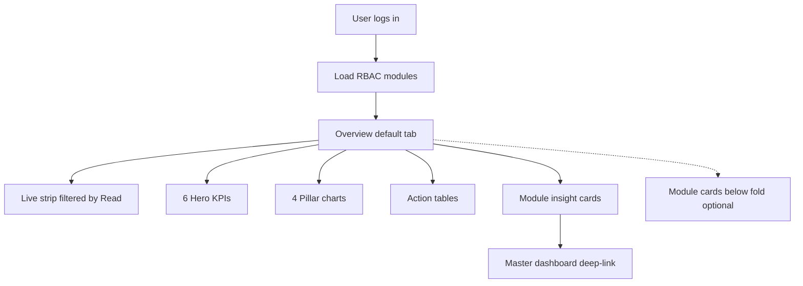
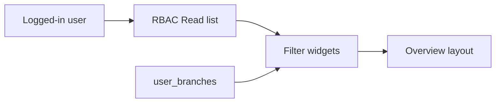
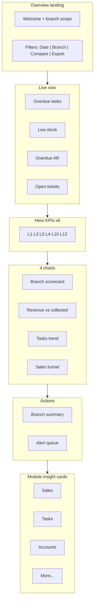

# Seravion Connect — Default Overview Dashboard (PRD / BRD)

> **Document type:** PRD + BRD analytics spec (Easy English)  
> **Hub module:** **Company Overview** — **default home screen after login**  
> **Purpose:** One cumulative page from **all modules** — major insights only — branch operations · sales · accounts · field tasks · (RBAC-gated extras)  
> **Audience:** Every logged-in user (T1–T5); layout adapts to permissions  
> **Last analyzed:** 2026-07-28  
> **Sources:** `OverviewService` (`/dashboard/overview`), `Pages/Dashboard/index.jsx`, all master cluster specs in `docs/modules/analytics/`

---

## Business requirements (Easy English)

**Problem:** After login, users land on `/dashboard-v2` and see a **long scroll of separate module cards** (Inventory, Vendor, Task, …). There is no single answer to: *How is my branch doing today?* Sales, money, field work, and stock live in different cards. Backend **`GET /dashboard/overview`** already aggregates 16 module KPI groups and 34 charts — but **the UI never calls it**.

**Goal:** Make **Overview the default first screen** for every user. Show **cumulative major insights** from all modules the user can Read — focused on **branch operations, sales pipeline, accounts/cash, and tasks** — with Live exceptions, 6 hero KPIs, 4 summary charts, 2 action tables, and compact links to deep-dive master dashboards.

**Success looks like:**
1. Branch manager opens app → sees overdue tasks + outstanding money + today's ops in **under 60 seconds**
2. CEO sees company-wide branch compare (sales + tasks + cash) without opening 10 cards
3. Technician (T4) sees **My tasks + my branch alerts** only — not finance they cannot Read
4. Auditor exports one Overview Excel with Graphs + branch summary + alert queue

---

## Visualization strategy

### Design rule: Overview = executive scoreboard, not module dump

| Layer | What user sees | Purpose |
|-------|----------------|---------|
| **0. Welcome + scope** | "Good morning · Branch X · Last updated" | Context |
| **1. Live strip** | Top 4–6 exceptions across readable modules | Act **now** |
| **2. Hero KPIs (6)** | Cross-pillar major numbers + delta | Health at a glance |
| **3. Pillar charts (4)** | Sales · Tasks · Money · Branch compare | Trends |
| **4. Action tables (2)** | Branch summary + unified alert queue | What to do |
| **5. Module insight cards** | One row per readable cluster → link to master dashboard | Drill-down |
| **6. Module cards (collapsed)** | Existing per-module dashboards — **below fold**, optional | Power users |

**Anti-pattern:** Showing all 15 module cards expanded by default with no shared Live strip or Label Set.

### Six pillars (major insight domains)

| Pillar | Easy English | Primary modules | Master spec doc |
|--------|--------------|-----------------|-----------------|
| **P1 Sales & pipeline** | Leads → quotes → customers → contracts → SO | Lead, Quotation, Customer, Contract, SO | [crm-sales-pipeline-dashboard.md](crm-sales-pipeline-dashboard.md) · [customer-management-dashboard.md](customer-management-dashboard.md) |
| **P2 Field operations** | Tasks, completion, overdue, tech load | Task, Live tracking | [task-management-dashboard.md](task-management-dashboard.md) |
| **P3 Accounts & money** | Invoiced, collected, outstanding, payables, cash | Invoice, Bills, Vouchers, Ledger | [accounts-finance-master-dashboard.md](accounts-finance-master-dashboard.md) |
| **P4 Branch operations** | Per-branch scorecard | All branch-scoped KPIs | This doc § Branch matrix |
| **P5 Supply & procurement** | Stock, PO, vendors | Stock, PO, Vendor | [inventory-product-services-dashboard.md](inventory-product-services-dashboard.md) · [procurement-vendor-po-dashboard.md](procurement-vendor-po-dashboard.md) |
| **P6 People & support** | HRM, tickets, petty cash | HRM, Support, Petty cash | [hrm-dashboard.md](hrm-dashboard.md) · [operations-support-spend-dashboard.md](operations-support-spend-dashboard.md) |

**Default prominence for most users:** P1 · P2 · P3 · P4 on Overview. P5–P6 show if user has Read.

---

## 1. Default landing behaviour (recommended)

| Item | Existing today | Recommended |
|------|----------------|-------------|
| Route after login | `/dashboard-v2` → all module cards expanded | `/dashboard-v2` → **Overview tab active first** |
| Overview API | `GET /dashboard/overview` exists | **Wire to new `OverviewDashboard.jsx`** |
| Module cards | Always visible, stacked | **Collapsed** "All module dashboards" section below |
| Filters | Per-card only | **Shared global bar** on Overview (date, branch, compare) |
| CEO accounts | Accounts card CEO-only | Overview shows finance KPIs if `INVOICE_MANAGEMENT` or CEO |



---

## 2. Role-based default layout

Each user sees **only widgets their permissions allow**. Empty pillar = hidden (not zero-filled noise).

| Tier | Who | Default Overview focus | Live strip | Hero KPIs | Charts |
|------|-----|------------------------|------------|-----------|--------|
| **T1 Executive** | CEO, Owner | Company-wide P1+P2+P3+P4 | All exceptions | All 6 pillars | Branch compare + trends |
| **T2 Regional** | Multi-branch head | Branch compare | Overdue, low stock, overdue AR | Revenue, tasks, outstanding | Multi-branch bars |
| **T3 Branch** | Branch manager | Own branch ops | Overdue tasks, tickets, pending petty | Open tasks, collection %, outstanding | Branch task + money |
| **T4 Functional** | Sales / tech / AR clerk | **My work** + branch context | Own overdue / assigned queue | 2–3 KPIs max | Minimal — 1 chart |
| **T5 Audit** | Auditor | Read-only full union | Same as T1 where Read | All readable | Export-first |

### T4 "My work" strip (recommended — **Gap**)

| Role hint | Live chips | Deep-link |
|-----------|------------|-----------|
| Technician | My tasks today · My overdue | Task mobile / task list |
| Sales | My open leads · Pending quotes | CRM modules |
| AR clerk | Invoices due · Unallocated receipts | Invoice / payment |
| Support agent | My open tickets · SLA breach | Support module |

---

## 3. Comparison Label Set (Overview cumulative)

Same labels on UI, charts, Excel. Pulled from module KPIs in `OverviewService.get_kpis` where noted.

| Label ID | Display label | Meaning | Unit | Pillar | OverviewService key |
|----------|---------------|---------|------|--------|---------------------|
| L1 | Revenue invoiced | SUM sales_invoices.grand_total (period) | ₹ | P3 | `financial.total_revenue` |
| L2 | Amount collected | SUM received_amount | ₹ | P3 | `financial.collected_amount` |
| L3 | Outstanding receivable | SUM pending_amount | ₹ | P3 | `financial.outstanding_amount` |
| L4 | Collection rate | L2 ÷ L1 × 100 | % | P3 | derived |
| L5 | Open tasks | Tasks not COMPLETED/CANCELLED | count | P2 | `task.open_tasks` |
| L6 | Overdue tasks | scheduled_date &lt; today AND open | count | P2 | **Gap** — not in overview KPIs today |
| L7 | Task completion % | completed ÷ total in period | % | P2 | derived from `task.*` |
| L8 | Low stock items | stock qty &gt; 0 and &lt; 5 | count | P5 | `inventory.low_stock_count` |
| L9 | Open support tickets | status OPEN (fix: not CLOSED — **Gap**) | count | P6 | `support.open_tickets` |
| L10 | Active customers | customers status ACTIVE | count | P1 | `customer.active_customers` |
| L11 | Active headcount | users is_active | count | P6 | `employee.active_employees` |
| L12 | Open sales orders | SO status DRAFT/OPEN | count | P1 | `sales_order.open_orders` |
| L13 | Pending quotations | quotation status PENDING | count | P1 | `quotation.pending_quotations` |
| L14 | Open leads | leads not LOST/CONVERTED | count | P1 | `lead.open_leads` |
| L15 | Pending purchase orders | PO in approval/delivery states | count | P5 | `purchase.pending_pos` |
| L16 | Pending petty cash | status PENDING | count | P6 | `petty_cash.pending_requests` |
| L17 | Payables outstanding | purchase_bills pending — **Gap** in overview | ₹ | P3 | **Gap** — only invoice side today |
| L18 | Net cash flow | receipts − payments — **Gap** | ₹ | P3 | **Gap** |
| L19 | Active contracts | contracts status ACTIVE | count | P1 | `contract.active_contracts` |
| L20 | Branch health score | Weighted index — **Gap** | 0–100 | P4 | optional |

---

## 4. Live strip (cross-module exceptions)

**Layer:** Live now · refresh 30–60s · **ignores date filter** (current queue)

| Chip | Label | Source module | Show if Read |
|------|-------|---------------|--------------|
| L6 | Overdue tasks | tasks | TASK_MANAGEMENT |
| L8 | Low stock | stock_ledger | STOCK / PRODUCT |
| L9 | Open tickets | support_tickets | CUSTOMER_SUPPORT |
| L3 | Overdue receivable | sales_invoices OVERDUE | INVOICE / CEO |
| L17 | Overdue payables | purchase_bills — **Gap** | BILLS |
| L16 | Pending petty cash | petty_cash_requests | PETTY_CASH |
| L15 | Late / pending PO | purchase_order — **Gap** alert | PURCHASE_ORDER |
| — | Pending approvals | GMA/PO/petty aggregate — **Gap** | union |

**Existing alert seeds (in module services, not returned by overview API):** task overdue, low stock, support old open, petty pending old, PO late — wire via **`GET /dashboard/overview/alerts`** orchestrator — **Gap**.

---

## 5. Hero KPI row (6 cards — period)

Pick **6** by tier; always use Label Set titles.

| Slot | Default (T1–T3) | T4 alternative | Formula |
|------|-----------------|----------------|---------|
| 1 | L1 Revenue invoiced | L5 My open tasks | Overview financial / task filter |
| 2 | L3 Outstanding | L14 My leads | financial / lead |
| 3 | L5 Open tasks | L9 My tickets | task / support |
| 4 | L4 Collection % | L7 Completion % | derived |
| 5 | L10 Active customers | — | customer |
| 6 | L12 Open sales orders | — | sales_order |

**Delta:** vs prior period (`compareMode=prior_period`) — **Gap** on overview KPIs today (all-time in `OverviewService`).

---

## 6. Overview charts (4 on landing — period)

| # | Chart | Type | Labels | OverviewService chart key | Pillar |
|---|-------|------|--------|---------------------------|--------|
| 1 | Branch scorecard | Clustered multi-bar | Branch · L1 + L3 + L5 | `revenue_by_branch` + task branch — **partial Gap** | P4 |
| 2 | Revenue vs collected trend | Dual line | Month · L1, L2 | `monthly_revenue_trend` + collection — **Gap merge** | P3 |
| 3 | Tasks created vs completed | Dual line / bar | Month · created, completed | `cmp_tasks_created_vs_completed` | P2 |
| 4 | Sales funnel snapshot | Donut or stacked | Leads · Quotes · SO | `lead_status` + `quotation_status` + `monthly_sales_orders` — **Gap combine** | P1 |

**Additional charts (expand / module insight cards):** `collection_vs_outstanding`, `revenue_vs_purchase`, `cmp_quotations_vs_sales_orders`, `cmp_tickets_open_vs_closed`, `salary_trend`, `petty_cash_monthly_expense` — 34 charts exist in backend; UI picks by RBAC.

**Known backend issue:** Overview charts ignore `branchIds` and date filters (all-time). **Recommended:** apply same filters as hero KPIs.

---

## 7. Action tables

### Action Table 1 — Branch operations summary

One row per branch in filter + company total row.

| Column | Label IDs | Notes |
|--------|-----------|-------|
| Branch name | — | |
| Revenue invoiced | L1 | |
| Outstanding | L3 | |
| Open tasks | L5 | |
| Overdue tasks | L6 | |
| Open tickets | L9 | if Read |
| Low stock | L8 | if Read |
| Collection % | L4 | |
| Action | — | **View branch** → filter Overview |

### Action Table 2 — Unified alert queue

| severity | pillar | example | action |
|----------|--------|---------|--------|
| Critical | P2 | Overdue task | Open task |
| Critical | P3 | Overdue invoice | Record receipt |
| High | P5 | Low stock | Issue stock / PO |
| High | P6 | SLA ticket breach | Assign ticket |
| Medium | P6 | Pending petty | Approve |
| Medium | P5 | Pending PO approval | Approve PO |

Aggregate from module alert services — **Gap** — propose `OverviewAlertsService.aggregate(module_alerts[])`.

---

## 8. Module insight cards (link to master dashboards)

Compact horizontal cards — **one per readable cluster** — not full module dashboard embed.

| Card | Shows (3 mini KPIs) | Deep-link master spec |
|------|---------------------|------------------------|
| Sales & CRM | L14, L13, L19 | crm-sales-pipeline + customer |
| Field ops | L5, L6, L7 | task-management |
| Accounts | L1, L3, L4 | accounts-finance-master |
| Procurement | L15, vendor active | procurement-vendor-po |
| Inventory | L8, out of stock | inventory-product-services |
| Ops support | L9, L16 | operations-support-spend |
| HRM | L11, unpaid salary | hrm-dashboard |

**UI pattern:** Card click → scroll to module section OR navigate `/dashboard-v2?module=task` with shared filters preserved.

---

## 9. Existing backend — OverviewService KPI map

`GET /dashboard/overview` returns `kpis` object (16 groups, **all-time, no branch filter today**):

| KPI group | Fields | Tables |
|-----------|--------|--------|
| branch | total_branches, active_branches | branches |
| customer | total_customers, active_customers | customers |
| contract | total_contracts, active_contracts, total_contract_value | contracts |
| sales_order | total_orders, open_orders, total_amount | sales_orders |
| quotation | total_quotations, pending_quotations, total_quotation_value | quotations |
| gma | total_gma, pending_gma, approved_gma | gma_sheets |
| task | total_tasks, open_tasks, completed_tasks, pending_tasks | tasks |
| support | total_tickets, open_tickets, high_priority_tickets | support_tickets |
| inventory | total_products, active_products, low_stock_count, out_of_stock_count | inventory_products, stock_ledger |
| purchase | total_purchase_orders, pending_pos, total_purchase_value | purchase_order |
| vendor | total_vendors, active_vendors | vendors |
| financial | total_revenue, collected_amount, outstanding_amount | sales_invoices |
| employee | total_employees, active_employees | users |
| petty_cash | total_requests, pending_requests, total_approved_amount | petty_cash_requests |
| lead | total_leads, open_leads, converted_leads | leads |
| hrm | total_salary_slips, unpaid_count, total_salary_paid | hrm_salary_month |

**Charts:** 34 series (26 single + 8 comparison). **Tables:** empty (`get_tables` returns `{}`).

---

## 10. RBAC & branch scope

| Rule | Behaviour |
|------|-----------|
| Widget visibility | Show pillar/widget only if user has **Read** on ≥1 module in pillar |
| CEO / Root | All branches; all modules |
| Others | `user_branches` ∩ branch filter |
| Accounts on Overview | Today Accounts card is **CEO-only** in `index.jsx` — **Recommended:** show L1–L4 on Overview if `INVOICE_MANAGEMENT_READ` |
| Export | Union of Export permissions on included pillars |



---

## 11. Global filters

| Filter | Default | API param | Applies to |
|--------|---------|-----------|------------|
| Date | Last 30d | fromDate, toDate / period | Period KPIs + charts |
| Branch | User branches | branchIds | All scoped queries |
| Compare | prior_period | compareMode | Hero KPI deltas |
| Pillar toggle | All readable | client | Hide pillar sections |

**Existing UI presets:** Now / 7d / 30d / 6m / 12m — extend to **7d \| 15d \| 30d \| MTD \| QTD \| YTD \| custom**.

Live strip **does not** use date filter.

---

## 12. Existing vs Recommended

| Area | Existing today | Recommended | Priority |
|------|----------------|-------------|----------|
| Default screen | Module card stack | **Overview first** | P0 |
| Overview UI | Not mounted | `OverviewDashboard.jsx` → `/dashboard/overview` | P0 |
| Live strip | None | Cross-module exceptions | P0 |
| Label Set | Mixed names per card | L1–L20 on Overview | P0 |
| Branch/date on overview | All-time global KPIs | Honor filters | P0 |
| Hero KPIs + 4 charts | 34 charts unused | Curated landing set | P0 |
| Action tables | None on overview | Branch summary + alerts | P0 |
| Module insight cards | None | Link to master dashboards | P1 |
| T4 my-work strip | None | Role-aware | P1 |
| Alerts API | Per-module, not aggregated | `/dashboard/overview/alerts` | P0 |
| Excel Overview export | Not wired | Full MGI workbook | P1 |
| Module cards | Expanded default | Below fold collapsed | P1 |
| Bills/payables on overview | Missing | Add L17 to OverviewService | P1 |
| Overdue tasks KPI | Missing | Add L6 query | P0 |

---

## 13. Visual wireframe



### ASCII placement

```
+------------------------------------------------------------------+
| Overview · Mumbai Branch · Updated 2 min ago                      |
| Date | Branch | Compare                    [Export Excel]       |
+------------------------------------------------------------------+
| LIVE: Overdue tasks 12 | Low stock 5 | Outstanding ₹8L | Tickets 3|
+------------------------------------------------------------------+
| [Invoiced] [Outstanding] [Open tasks] [Collection%] [Customers] [SO]|
+--------------------------------+---------------------------------+
| Branch scorecard (bar)         | Revenue vs collected (line)      |
+--------------------------------+---------------------------------+
| Tasks created vs completed     | Sales funnel (donut)             |
+------------------------------------------------------------------+
| Branch summary table                                              |
| Unified alert queue                                               |
+------------------------------------------------------------------+
| [Sales&CRM] [Field ops] [Accounts] [Inventory] [Support] ...      |
+------------------------------------------------------------------+
| ▼ All module dashboards (collapsed)                               |
+------------------------------------------------------------------+
```

---

## 14. Excel export — Overview workbook

| Sheet | Content |
|-------|---------|
| Cover | User, role, filters, modules included |
| Summary_KPIs | L1–L20 values + deltas |
| Branch_Comparison | Action Table 1 |
| Live_Alerts | Action Table 2 |
| **Graphs** | 4–6 charts: branch bar, revenue line, tasks line, funnel donut, collection donut |
| Charts_Data | Excel Tables |
| Pillar_Sales · Pillar_Tasks · Pillar_Finance · … | Mini detail per readable pillar |
| Dictionary | Label Set + formulas |

**API (Gap):** `GET /dashboard/overview/export/excel?includeCharts=true&fromDate&toDate&branchIds`

---

## 15. API specification

### Existing

| Method | Path | Notes |
|--------|------|-------|
| GET | `/dashboard/overview` | 16 KPI groups + 34 charts; no tables; no alerts; no filters |
| GET | `/dashboard/branches` | Branch picker |
| GET | `/dashboard/{module}` | Per-module cards |

### Proposed

| Method | Path | Response |
|--------|------|----------|
| GET | `/dashboard/overview/v2` | `{ live, heroKpis, charts, branchSummary, alerts, pillars, modulesIncluded }` |
| GET | `/dashboard/overview/alerts` | Aggregated alert queue |
| GET | `/dashboard/overview/branch-matrix` | Action Table 1 |
| GET | `/dashboard/overview/my-work` | T4 assigned items |
| GET | `/dashboard/overview/export/excel` | Full workbook |

### Proposed overdue tasks (add to OverviewService)

```sql
SELECT COUNT(*) FROM tasks t
WHERE t.scheduled_date < CURRENT_DATE
  AND t.status NOT IN ('COMPLETED','CANCELLED')
  AND (:branchIds IS NULL OR t.branch_id = ANY(:branchIds))
```

### Proposed branch-filter wrapper (apply to all overview KPI SQL)

```sql
-- Example: financial KPIs with branch + period
SELECT COALESCE(SUM(grand_total),0),
       COALESCE(SUM(received_amount),0),
       COALESCE(SUM(pending_amount),0)
FROM sales_invoices si
WHERE si.invoice_date BETWEEN :from AND :to
  AND (:branchIds IS NULL OR si.branch_id = ANY(:branchIds))
```

---

## 16. Cross-links to master dashboard specs

| User question | Overview shows | Deep-dive doc |
|---------------|----------------|---------------|
| Are we selling enough? | L1, L12, funnel chart | crm-sales-pipeline-dashboard |
| Are visits on track? | L5, L6, L7 | task-management-dashboard |
| Are we getting paid? | L1–L4 | accounts-finance-master-dashboard |
| Customer health? | L10, contracts | customer-management-dashboard |
| Buying / stock OK? | L8, L15 | procurement + inventory specs |
| People & tickets? | L9, L11, L16 | hrm + operations-support-spend |

---

## 17. Frontend implementation notes

| File | Change |
|------|--------|
| `Pages/Dashboard/index.jsx` | Add Overview as first tab/section; call `/dashboard/overview`; collapse module cards |
| **New** `OverviewDashboard.jsx` | Live + hero + charts + tables + insight cards |
| `getModules()` | Keep for below-fold cards; pass shared `fromDate, toDate, branchIds` |
| Accounts CEO-only | Extend finance widgets on Overview to invoice Read permission |

---

## 18. Gaps & priorities

1. **P0** — Mount Overview UI; default landing tab
2. **P0** — Live strip + unified alerts endpoint
3. **P0** — Branch + date filters on OverviewService KPIs/charts
4. **P0** — L6 overdue tasks KPI; branch matrix table
5. **P0** — Label Set L1–L20 on hero + charts + Excel
6. **P1** — Module insight cards → master dashboard links
7. **P1** — L17 payables from purchase_bills; L18 net cash from vouchers
8. **P1** — T4 my-work strip
9. **P1** — Overview Excel export with Graphs MGI
10. **P2** — L20 branch health score; WebSocket live refresh

---

## 19. Acceptance criteria

- [ ] Every user lands on Overview first after login (not empty module picker)
- [ ] User sees only pillars/modules they can Read
- [ ] Live strip shows cross-module exceptions with deep-links
- [ ] 6 hero KPIs use Label Set names and respect branch filter
- [ ] 4 landing charts use Label Set on axes/legends
- [ ] Branch summary + alert queue action tables work
- [ ] Module insight cards link to correct master dashboard area
- [ ] CEO sees all branches; others see assigned branches only
- [ ] Export Excel produces Graphs sheet with axes + grid + Dictionary
- [ ] Module cards remain available but collapsed below Overview

---

## 20. Tips for stakeholders

- **CEO:** Scan Live strip → Hero KPIs → Branch scorecard chart every Monday
- **Branch manager:** Clear L6 overdue and L3 outstanding from Action Table 2 first
- **Sales lead:** P1 funnel chart + link to CRM master dashboard
- **Finance:** L1–L4 + link to Accounts master — do not rely on PO for payables
- **Technician:** T4 my-work strip only — ignore finance pillars

---

## 21. Existing functionality summary

**Available today:** `OverviewService` with 16 KPI groups and 34 charts; `/dashboard/overview` registry entry; `/dashboard-v2` with 15+ RBAC-gated module cards; shared branch API; partial export on some modules; comprehensive master specs per cluster.

**Not available (recommended):** Overview as default landing UI; Live cross-module strip; filtered KPIs/charts; hero KPI row; branch matrix + alert tables; module insight cards; T4 my-work; alerts aggregation; Overview Excel; payables + net cash on overview; Label Set consistency; shared global filters driving Overview + cards.
