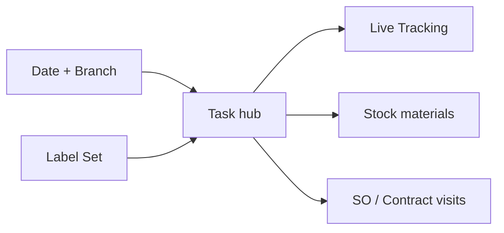
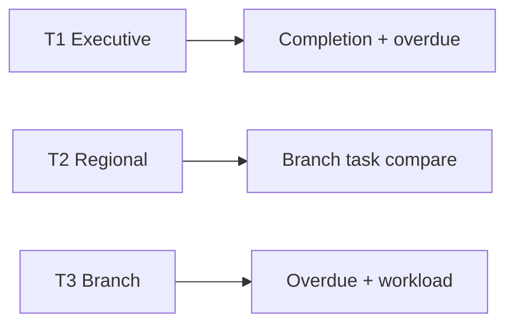
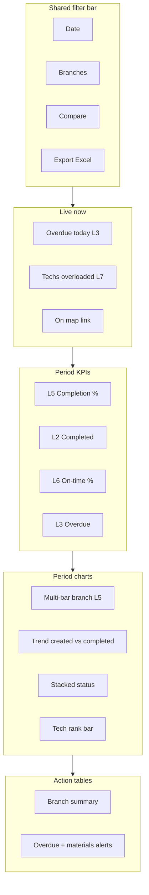
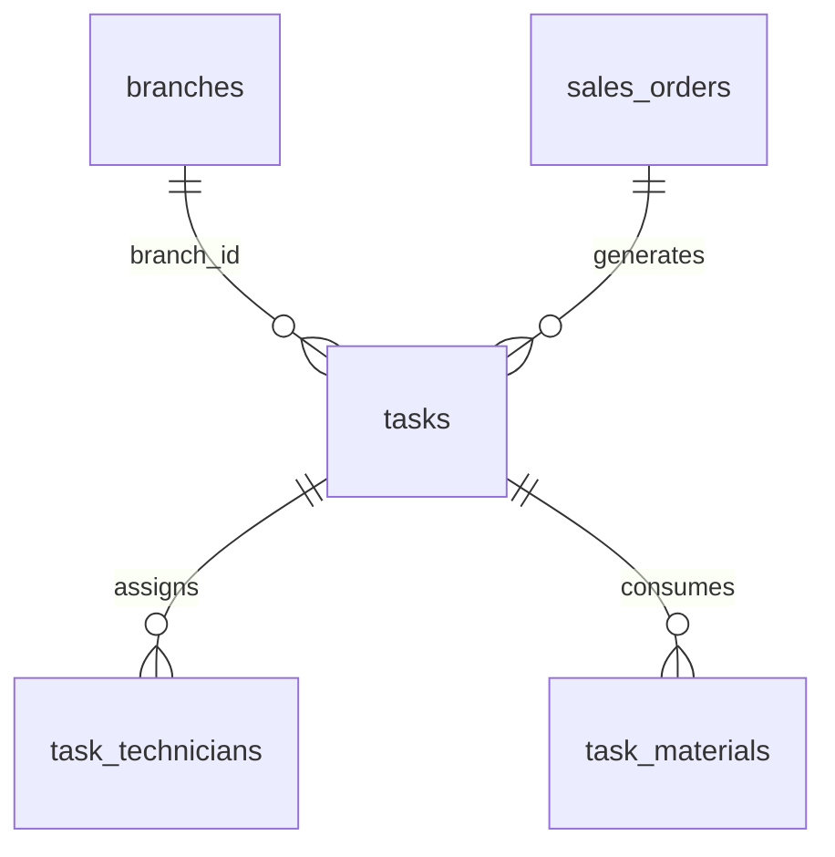

# Task Management Cluster — Analytics Dashboard (PRD / BRD)

> **Document type:** PRD + BRD analytics spec (Easy English)  
> **Hub module:** Task Management  
> **Nearby modules combined:** Live Tracking · Technician Performance · Stock (materials) · Contract visits / Sales Orders · (optional) Customer  
> **Audience:** T1–T5  
> **Last analyzed:** 2026-07-28  
> **Sources:** `TaskService` / `task_repository.py`, `TaskManagementDashboard.jsx`, Java `/api/v1/tasks*`, live-tracking & stock routes

---

## Business requirements (Easy English)

**Problem:** Ops leaders cannot quickly see which visits are late, who is overloaded, whether materials were used, and how Branch A compares to Branch B — without opening Task, Map, Stock, and Contract screens one by one.

**Goal:** One **Task cluster** dashboard that shows tasks + nearby field modules together, with clear comparisons (branch vs branch, this period vs last), a Live now strip, and Excel with multiple graphs.

**Success looks like:**
1. A branch manager answers “Who is late today and who is overloaded?” in under 2 minutes
2. An auditor exports Excel with Graphs + task/material rows for the same filters
3. Overdue and overload problems appear in Live now without hunting menus

---

## 1. Purpose & Business Need

Field visits are the product. Scheduled pest-control jobs must finish on time with materials logged. Nearby modules matter because: Live Tracking shows where techs are; Stock shows chemicals used; Contracts/SOs define visit budgets.

**Outcomes today:**
- `GET /dashboard/task_management` — KPIs: total, completed, pending, overdue; charts: status, monthly trend, technician workload; tables: recent_tasks, material_usage
- Alerts in service (overdue, technician overload) — **not in UI**
- Excel/PDF export wired for module id `task`
- UI tables have pagination only — **no row View actions**
- Overdue KPI may require status=`OVERDUE` while alert uses “open + past date” (definitions disagree)

**Outcomes recommended:**
- Combined cluster with Live Tracking / Stock materials / visit budget context
- One overdue rule + Completion % + On-time % with prior-period deltas
- Live strip + action tables with deep-links to `/task-manage`, `/fleet-tracking`, `/stock-dashboard`
- Excel Graphs MGI (multi-bar, line, stacked, rank bar)

---

## 2. Combined dashboard (nearby modules)

| Module | Why connected (Easy English) | RBAC Read required | Section on page |
|--------|------------------------------|--------------------|-----------------|
| **Task (hub)** | Planned and finished field visits | TASK_MANAGEMENT | Main |
| Live Tracking | Where technicians are right now | Live tracking / fleet Read | Live panel |
| Technician Performance | Who finishes well vs late | Technician performance Read | Tab |
| Stock (materials) | Chemicals used on jobs | STOCK_MANAGEMENT | Tab |
| Contract / Sales Order visits | Visit budget behind each task | CONTRACT / SALES_ORDER | Context strip |
| Customer (optional) | Who the job is for | CUSTOMER_CONTRACT_MANAGEMENT | Link-out |

Shared filters apply to **all** sections. Hide a section if the user has no Read.



---

## 3. Comparison Label Set

| Label ID | Display label (Easy English) | Meaning | Unit | Used on |
|----------|------------------------------|---------|------|---------|
| L1 | Scheduled | Tasks in period (or scheduled count) | count | KPI, axis, Excel |
| L2 | Completed | Status completed | count | KPI, stacked, Excel |
| L3 | Overdue | Past schedule and still open | count | Live, KPI, Excel |
| L4 | Pending | Waiting / not started | count | KPI, stacked |
| L5 | Completion % | Completed ÷ all (excl. cancelled) × 100 | % | KPI, multi-bar, Excel |
| L6 | On-time % | Finished on/before schedule ÷ completed × 100 | % | KPI, line |
| L7 | Tech workload | Tasks per primary technician | count | Rank bar |
| L8 | Material qty used | Quantity used on jobs | qty | Materials chart |

**Compare modes:** Branch vs Branch · Current vs Prior · Module vs Module only same unit

---

## 4. Users & Roles (who sees what)

| Tier | Roles | Scope | Primary questions |
|------|-------|-------|-------------------|
| T1 Executive | CEO, Owner | All branches | Completion %, overdue trend |
| T2 Regional | Multi-branch ops | Assigned | Branch SLA / workload |
| T3 Branch | Branch manager | Own | Today overdue, tech load |
| T4 Functional | Dispatcher / lead tech | Team | My queue, materials |
| T5 Audit | Auditor | Read + Export | Trails |



---

## 5. Access Control (RBAC)

| Widget / section | Module permission | CEO bypass | Branch scope |
|------------------|-------------------|------------|--------------|
| Task section | TASK_MANAGEMENT Read | Yes | tasks.branch_id ∩ user_branches |
| Live Tracking panel | Live tracking Read | Yes | same |
| Materials panel | STOCK Read | Yes | same |
| Export | Export or CEO | Yes | same filters |
| Complete / reschedule | Edit as per ops | Yes | task in scope |

| Widget | T1 | T2 | T3 | T4 | T5 |
|--------|----|----|----|----|-----|
| Live strip | ✓ | ✓ | ✓ | ✓ | ✓ |
| Label Set KPIs | ✓ | ✓ | ✓ | ✓ | ✓ |
| Tech workload | ✓ | ✓ | ✓ | ✓ | ✓ |
| Branch compare | ✓ | ✓ | own | — | ✓ |
| Action tables | ✓ | ✓ | ✓ | ✓ | ✓ |
| Export | ✓ | ✓ | ✓ | if Export | ✓ |

---

## 6. Global Filters & Live Update

| Filter | Type | Default | API param | Behavior |
|--------|------|---------|-----------|----------|
| Date range | 7d / 15d / 30d / MTD / QTD / YTD / custom | Last 30d | from_date, to_date / period | Align UI `7days` ↔ API |
| Branch | Multi-select | User branches | branch[] | |
| Compare to | prior_period | prior_period | compareMode | KPI deltas |
| Status | Multi | Ops statuses | status | |
| Technician | Multi | All | technicianIds | via task_technicians |

| Widget group | Layer | Method | Interval |
|--------------|-------|--------|----------|
| Live now (overdue, on map) | Live | Poll / WebSocket map | 30–60s |
| Period charts | Period | Filter + poll | 60–120s |
| Action tables | Period | Manual + filter | — |

---

## 7. Existing vs Recommended — Summary

| Area | Existing today | Recommended | Priority |
|------|----------------|-------------|----------|
| Combined nearby modules | Task card only | + Live Tracking, Stock materials, visit context | P0 |
| Label Set / comparison | Raw KPI names | L1–L8 everywhere | P0 |
| Live strip | None | Overdue today + overload | P0 |
| Charts | status, monthly, tech bar | + branch multi-bar / stacked; chart→table | P0 |
| Excel Graphs (MGI) | Tables + PDF charts | Graphs sheet 4 charts, axes, grid ON, details | P1 |
| Overdue definition | KPI vs alert disagree | One rule (open + past date) | P0 |

---

## 8. Visual Representation (dashboard layout)

### Wireframe



### Widget placement map

| Zone | Widgets | Desktop | Mobile | Live/Period |
|------|---------|---------|--------|-------------|
| Top | Filters + Export | full | stacked | — |
| Live strip | L3, overload, map link | full | scroll | Live |
| KPI | L1–L6 cards | 4–6 | 2-col | Period |
| Charts | multi-bar / line / stacked / rank | 60/40 | stacked | Period |
| Tables | Branch + Alerts + Materials | full | full | Period |

---

## 9. KPI Stat Cards (Label Set)

| # | Label ID | Title | Formula | Format | Delta | Layer | Tier |
|---|----------|-------|---------|--------|-------|-------|------|
| 1 | L1 | Scheduled | COUNT tasks in filter | count | vs prior | Period | T1–T5 |
| 2 | L2 | Completed | status = COMPLETED | count | vs prior | Period | T1–T5 |
| 3 | L5 | Completion % | L2 / NULLIF(L1,0) × 100 | % | vs prior | Period | T1–T4 |
| 4 | L4 | Pending | status = PENDING (+ in progress optional) | count | vs prior | Period | T1–T4 |
| 5 | L3 | Overdue | open + scheduled_date &lt; today | count | absolute | Live | T1–T4 |
| 6 | L6 | On-time % | on-time completed / completed × 100 | % | vs prior | Period | T1–T3 |

```
Card L3 Overdue (unified — recommended)
  Formula: COUNT(*) WHERE scheduled_date < CURRENT_DATE
           AND status NOT IN ('COMPLETED','CANCELLED')
  Tables: tasks
  Tips: Do not also require status='OVERDUE' unless a job keeps that flag in sync
```

```
Card L5 Completion %
  Formula: completed / NULLIF(total_excluding_cancelled, 0) * 100
  Filters: branch_id = ANY(:branchIds); scheduled_date or created_at in range
```

---

## 10. Charts & Visualizations

### Graph 1 — Branch completion compare

| Attribute | Spec |
|-----------|------|
| Type | Clustered multi-bar |
| Layer | Period |
| X-axis title | Branch name |
| Y-axis title | Completion % |
| Legend | Completion % (L5); optional prior period |

**Drill-down:** Branch summary table  
**Tips:** Low bar = late visits risk for that branch

### Graph 2 — Created vs completed trend

| Attribute | Spec |
|-----------|------|
| Type | Line |
| Layer | Period |
| X-axis title | Week / Month |
| Y-axis title | Task count |
| Legend | Scheduled / Created · Completed |

**Existing seed:** `monthly_trend` (extend to dual series)

### Graph 3 — Status mix by branch (stacked)

| Attribute | Spec |
|-----------|------|
| Type | Stacked column |
| Layer | Period |
| X-axis title | Branch name |
| Y-axis title | Task count |
| Legend | Completed · Pending · Overdue |

### Graph 4 — Technician workload (rank)

| Attribute | Spec |
|-----------|------|
| Type | Horizontal bar |
| Layer | Period / Live |
| X-axis title | Task count |
| Y-axis title | Technician name |
| Legend | Tech workload (L7) |

**Existing:** `technician_workload` (primary tech). Mark overload (e.g. &gt;5/day policy).

```
Tasks — created vs completed (ASCII)
120|  *C
100| / \    *C----*C
 80|*C  \  /   *X
  +----+----+----+---->
    Jan  Feb  Mar  Apr
```

---

## 11. Action Tables

### Action Table 1 — Branch summary

| Column | Field | Format | Sort | Notes |
|--------|-------|--------|------|-------|
| Branch | branch_name | text | yes | All Branches first |
| Scheduled | L1 | count | yes | |
| Completed | L2 | count | yes | |
| Completion % | L5 | % | yes | |
| Overdue | L3 | count | yes | worst-first option |
| Actions | — | View | — | → `/task-manage` filtered |

### Action Table 2 — Alerts

| Column | Field | Notes |
|--------|-------|-------|
| Severity | high / medium | |
| Type | Overdue task / Tech overload / Material mismatch | |
| Recommended action | Open task · Rebalance · Check stock | Easy English |

**Existing table ids:** `recent_tasks`, `material_usage` + alerts `overdue_tasks`, `technician_overload`  
**Row action:** View → `/task-manage` (and material lines → stock if needed)

---

## 12. Branch Comparison View

| Label ID | Aggregation | Company total | Per-branch | Variance rule |
|----------|-------------|---------------|------------|---------------|
| L5 | ratio | top | one row | red if below SLA |
| L3 | COUNT | top | one row | worst-first |
| L6 | ratio | top | one row | amber within 10% of target |
| L7 | avg/max | — | tech within branch | red if overload |

---

## 13. Data Model & Table Map

| Module | Tables | Branch link |
|--------|--------|-------------|
| Task | `tasks`, `task_technicians`, `task_materials`, photos | `branch_id` |
| Live tracking | technician_tracking / pings | via task |
| Stock | `stock_ledger`, products | `branch_id` |
| SO / Contract | `sales_orders`, visit ledger | `branch_id` |



---

## 14. Excel Export Package — Multiple Graphical Interface

### Export trigger

| Item | Spec |
|------|------|
| UI | Export Excel |
| Permission | TASK_MANAGEMENT Export (or CEO) |
| Endpoint | Existing `/dashboard/task/export/excel` → extend `includeCharts=true` |
| includeCharts | true |

### Workbook sheets

| Sheet | Purpose |
|-------|---------|
| Cover | Filters, modules included |
| Summary_KPIs | L1–L8 + deltas |
| Branch_Comparison | Branch matrix |
| Trend | Created vs completed |
| **Graphs** | 4 charts MGI |
| Charts_Data | Series tables |
| Tasks_Detail · Materials_Detail · Alerts | Rows |
| Dictionary | Label Set |

### Graphs sheet — chart list

| Chart | Type | X-axis title | Y-axis title | Grid | Legend | Details |
|-------|------|--------------|--------------|------|--------|---------|
| A | Clustered multi-bar | Branch | Completion % | Major ON | L5 | Branch_Comparison |
| B | Line | Week | Task count | Major ON | Created, Completed | Trend |
| C | Stacked column | Branch | Task count | Major ON | Status | Tasks_Detail |
| D | Horizontal bar | Task count | Technician | Major ON | L7 | Alerts overload |

### Analytic value (Easy English)
1. Compare branch on-time performance in one picture
2. Spot overloaded technicians before quality drops
3. Match material usage to jobs offline

### Existing vs recommended export

| Area | Existing | Recommended |
|------|----------|-------------|
| Excel | Generic table sheets + PDF charts | Graphs MGI + axes + grid + Dictionary |

---

## 15. API Specification (existing + proposed)

### Existing

| Method | Path | Purpose | Widget / export |
|--------|------|---------|-----------------|
| GET | `/dashboard/task_management` | KPIs, charts, tables | Task UI |
| GET | `/dashboard/task/export/excel\|pdf` | Export | Export buttons |
| GET | `/api/v1/tasks/calendar-summary` | Calendar (Java) | Ops |
| GET | `/api/v1/live-tracking/dashboard` | Fleet map | Nearby panel |
| GET | Mobile `/dashboard` | Tech day counts | Field app |

### Proposed

| Method | Path | Params | Response | Widgets |
|--------|------|--------|----------|---------|
| GET | `/dashboard/task_management` | + compareMode, include=alerts | kpis with deltaPct, alerts[], actionUrl | Live + tables |
| GET | `.../export.xlsx` | includeCharts=true | Graphs workbook | Export |

---

## 16. Cross-Module Interactions

| Related module | Connection | Dashboard impact |
|----------------|------------|------------------|
| Sales Order / Contract | Visit budget | Incomplete visits vs plan |
| Stock | Materials on task | L8 + low stock |
| Live Tracking | Location | Live strip |
| Customer | Site party | Context on row |
| HRM | Tech availability | Overload vs leave |

---

## 17. Rules, Validations & Data Quality

- Branch ∩ user_branches (except CEO)
- Same Label ID = same formula in UI and Excel
- Cancelled excluded from Completion % denominator (document once)
- Soft-delete if present
- IST display

---

## 18. Gaps & Implementation Notes

1. Surface alerts in API + UI; add View actions
2. Unify overdue definition
3. Add Completion % / On-time % + prior deltas
4. Combine Live Tracking / materials sections with RBAC hide
5. Upgrade Excel to Graphs MGI
6. Chart click filters action table

---

## 19. Acceptance criteria (Easy English)

- [ ] User sees only nearby sections they can Read
- [ ] Shared date + branch filter drives all Task cluster widgets
- [ ] Charts use Label Set on axes and legends
- [ ] Bar/slice click filters the table below
- [ ] Excel Graphs has multiple chart types with axes + grid + details
- [ ] Live strip shows overdue count and last-updated time
- [ ] CEO all branches; others only assigned

---

## 20. Tips for Stakeholders

- **CEO:** L5 and L3 weekly by branch  
- **Branch manager:** Live strip + Action Table 2 every morning  
- **Auditor:** Graphs + Tasks_Detail + Dictionary  

---

## 21. Existing Functionality Summary

**Available today:** Task KPIs/charts/tables on `/dashboard-v2`; export Excel/PDF; service alerts unused; material_usage table  

**Not available (recommended):** Cluster nearby modules; Live strip; Label Set; actionable rows; unified overdue; Graphs MGI; on-time %
