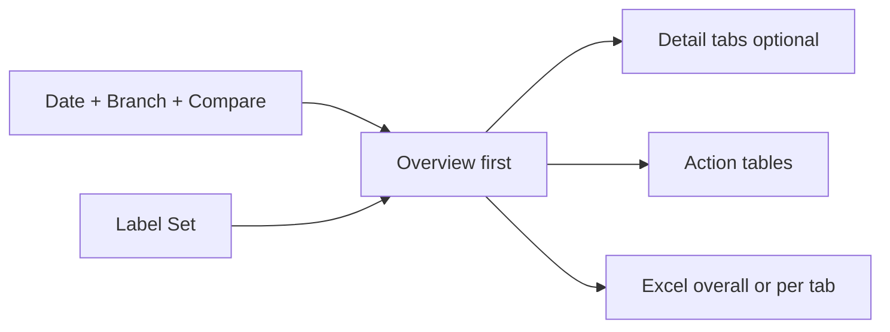
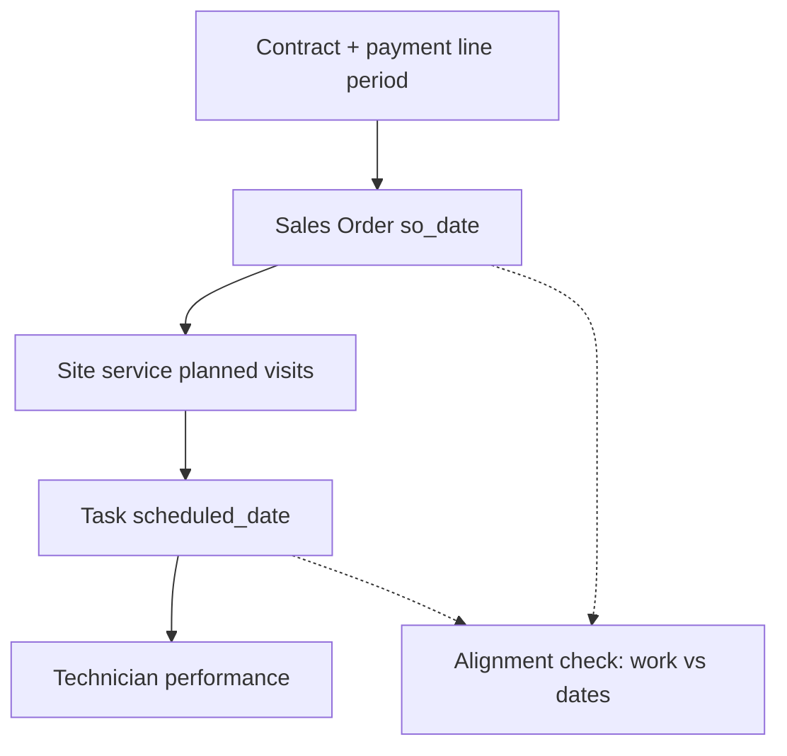
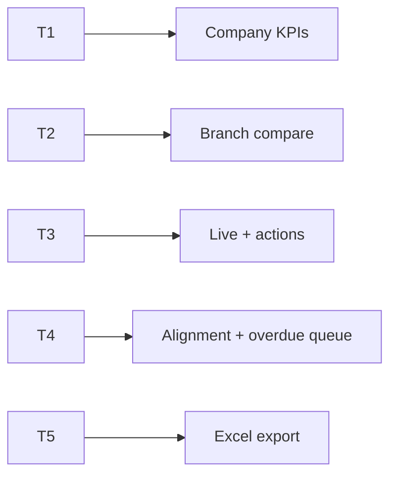
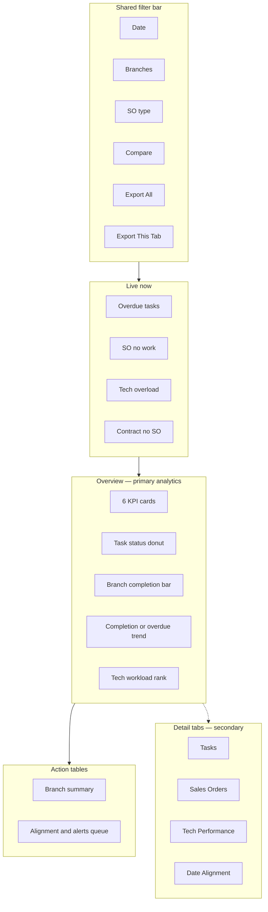

# Field Ops Master Dashboard — Task · Sales Order · Technician Performance (PRD / BRD)

> **Document type:** PRD + BRD analytics spec (Easy English)  
> **Hub module:** **Field Ops Master** (one combined dashboard — Overview-first)  
> **Modules combined:** Task Management · Sales Order Management · Technician Performance · Contract → SO date / visit alignment  
> **Audience:** T1–T5  
> **Last analyzed:** 2026-07-28  
> **Sources:** `TaskService`, `SalesOrderService`, `ContractService`, Java Task / Sales Order / Technician Performance (Module 26), frontend dashboard cards + `/technician-performance`

---

## Business requirements (Easy English)

**Problem:** Ops and branch leaders open **Task**, **Sales Order**, and **Technician Performance** separately and still cannot answer in one glance: Are visits finishing on time? Which **Sales Orders** from contracts have **no work scheduled** even though the SO date / billing period has started? Who is overloaded? Which technicians complete well?

**Goal:** One **Field Ops** page with an **Overview-first** layout — live exceptions, visit health, SO work-alignment, and tech performance on the first screen — then optional **detail tabs**, **action tables** for next steps, and **Excel export overall or per tab** (each sheet = graphs + detailed values).

**Success looks like:**
1. Manager answers “What is late today, and which contract SOs have no tasks?” in **under 2 minutes without leaving Overview**
2. Detail tabs open only for deeper Task / SO / Tech / Alignment lists
3. Action tables drive reschedule, create task from SO, and rebalance overloaded techs
4. Auditor exports **overall** or **single-tab** Excel — every sheet has charts **and** row-level detail

---

## Visualization strategy (data-analyst view)

### Design rule: Overview first — not a tab-heavy home

| Layer | What user sees | Purpose |
|-------|----------------|---------|
| **1. Overview (always visible)** | Live strip + 6 KPIs + 3–4 primary charts + 2 action tables | Answer “is field work healthy?” |
| **2. Detail tabs (secondary)** | Extra charts for one domain only | Drill when Overview is not enough |
| **3. Action tables** | Branch summary + alerts / alignment queue | What to do next |
| **4. Excel export** | Overall workbook **or** per-tab workbook; each sheet = KPI + graph(s) + detail table | Offline analysis / audit / standup pack |

**Anti-pattern to avoid:** Four equal tabs as the home experience (user must click before seeing anything useful).

### What belongs on Overview vs detail tabs

| Decision question | Put on Overview? | Put on detail tab? |
|-------------------|------------------|--------------------|
| Overdue / pending / completion % | Yes — KPI + Live | Full recent tasks list |
| SO open amount / open orders | Yes — KPI | Status mix + items deep-dive |
| **SO work not aligned with dates** | Yes — Live count + Action Table 2 | Full alignment list + period window columns |
| Tech avg completion / top performer | Yes — thin KPI or rank | Full tech scorecard (Module 26 fields) |
| Visit budget remaining (planned − scheduled) | Yes — optional KPI or Live | SO execution detail |
| Material usage | No — noise on home | Tasks detail tab |
| Preferred-day violations | No — secondary | Alignment detail tab |

### Overview “must-see” priority (ranked)

| Rank | Insight | Why it matters first | Widget |
|------|---------|----------------------|--------|
| 1 | Live exceptions | Stop loss today | Live strip |
| 2 | Overdue visits | Customer SLA risk | KPI L3 |
| 3 | **SO with no / late work** | Contract billed period with no field work | Live L14 + Action Table 2 |
| 4 | Completion % | Are we finishing the book? | KPI L5 |
| 5 | Branch compare | Which branch is behind? | Multi-bar L5 or L3 |
| 6 | Tech load / completion | Capacity & quality | Rank bar L7 / L10 |
| 7 | What to do | Create task / reschedule / reassign | Action tables |

---

## 1. Purpose & Business Need

Field work sits on one commercial chain:

```
Contract (AMC period + visit budget)
  → Sales Order (so_date, billing period, planned visits)
    → Task (scheduled_date, technicians, complete)
      → Technician performance (completion, on-time, re-task, rating)
```

| Stage | Business meaning | Key question |
|-------|------------------|--------------|
| **Contract** | Signed AMC; payment lines with `period_start` / `period_end` / planned visits | Is there an SO for this period? |
| **Sales Order** | Work order for a billing period (`so_date`, site services, `visits`) | Has work started? Visits left? |
| **Task** | Actual field visit on a date | On time? Overdue? Who does it? |
| **Tech performance** | How well techs finish work | Completion %, re-task %, score |

### “SO not works aligned with dates” (product definition)

**Easy English:** A Sales Order (usually from a contract payment line) whose **work dates have started**, but **tasks are missing, late, or scheduled outside the billing window**.

| Alignment case (recommended) | Rule (proposed — **Gap** as analytics API today) | Severity |
|------------------------------|--------------------------------------------------|----------|
| **A. SO due, no tasks** | SO status `OPEN` · `so_date ≤ today` · remaining visits &gt; 0 · zero non-cancelled tasks | Critical |
| **B. Period ending, visits unfinished** | Payment line `period_end` within N days · remaining visits &gt; 0 | High |
| **C. Task outside billing period** | `task.scheduled_date` ∉ `[period_start, period_end]` (when line linked) | High |
| **D. Task far from SO date** | No period dates · `ABS(scheduled_date − so_date) &gt; X days` (config, default 30) | Medium |
| **E. Contract with no SO** | Active contract · no linked sales order (existing `ContractService` alert `no_sales_order`) | High |
| **F. Preferred-day miss** | Weekday of `scheduled_date` ∉ `preferred_days` (hint only today — not enforced in create) | Low |

**Evidence today:** Visit **count** budget is enforced at task create (`plannedVisits − non-cancelled tasks`). Preferred days / billing-period schedule are **guidance only** (`AddTask.jsx`). **No** dashboard query for cases A–D yet — mark as **Gap**.

### Outcomes today

| Area | What exists |
|------|-------------|
| Task card | `GET /dashboard/task_management` — KPIs total/completed/pending/overdue; charts status, monthly trend, tech workload; tables recent_tasks, material_usage |
| SO card | `GET /dashboard/sales_order` — KPIs orders/amount/open/completed; charts status, monthly revenue, branch sales; tables recent_orders, sales_order_items |
| Tech performance | Java `GET /api/v1/technician-performance/summary\|dashboard\|employee` — **not** in Python dashboard registry |
| Alerts | Computed in Task/SO services — **router does not return alerts**; UI never shows them |
| Overdue definitions | KPI needs `status='OVERDUE'`; alert uses open + past `scheduled_date` — **disagree** |
| Excel | Task export in UI list; SO export API exists but **not** in frontend `modulesWithExport` |
| Date alignment | **No** Field Ops analytics for SO↔task date windows |

### Outcomes recommended

- One master page, **Overview-first**
- Unified Live strip: overdue tasks, tech overload, SO-no-work, contract-no-SO
- One overdue rule + Completion % + On-time % + prior-period deltas
- Action tables with deep-links (`/task-manage`, `/sales-order-detail`, `/technician-performance`)
- Detail tabs: Tasks · Sales Orders · Tech Performance · Date Alignment
- Excel **overall + per tab**; each module sheet = KPI + graph(s) + detail rows

---

## 2. Combined dashboard (nearby modules)

| Module | Why combined | RBAC Read | Where shown |
|--------|--------------|-----------|-------------|
| **Task (hub)** | Planned and finished field visits | `TASK_MANAGEMENT` | Overview KPIs/charts + Tasks detail tab |
| **Sales Order** | Work orders that must produce tasks | `SALES_ORDER_MANAGEMENT` | Overview SO KPIs + SO detail tab |
| **Technician Performance** | Who finishes well vs late | Tech performance / Module 26 Read (often gated with live-tracking flags today) | Overview thin KPI + Tech detail tab |
| **Contract → SO alignment** | Period / `so_date` vs scheduled work | `CONTRACT` / `CUSTOMER_CONTRACT` + SO + Task Read | Live strip + Alignment tab + Action Table 2 |
| Live Tracking (optional) | Where techs are right now | Live tracking Read | Link-out / Live panel (not required for P0) |
| Stock materials (optional) | Chemicals used on jobs | `STOCK_MANAGEMENT` | Tasks detail only |

Hide a domain’s widgets if no Read. Overview still shows whatever domains the user can see.



### Business flow



---

## 3. Comparison Label Set

| Label ID | Display label (Easy English) | Meaning | Unit | Overview? |
|----------|------------------------------|---------|------|-----------|
| L1 | Scheduled tasks | Tasks in period (excl. cancelled) | count | KPI |
| L2 | Completed tasks | status = COMPLETED | count | KPI / stacked |
| L3 | Overdue tasks | Past schedule and still open (**one rule** — see §17) | count | Live + KPI |
| L4 | Pending tasks | status = PENDING (and optionally TRAVEL_STARTED / IN_PROGRESS as “in flight”) | count | Detail |
| L5 | Completion % | L2 ÷ L1 × 100 | % | KPI + multi-bar |
| L6 | On-time % | Completed on/before scheduled_date ÷ L2 × 100 | % | KPI / line — **Gap** if not computed |
| L7 | Tech workload | Tasks per primary technician | count | Rank bar |
| L8 | Open sales orders | status DRAFT \| OPEN | count | KPI |
| L9 | Open SO amount | SUM grand_total for DRAFT\|OPEN | ₹ | KPI |
| L10 | Tech avg completion % | Module 26 `avgCompletionRatePercent` | % | KPI thin |
| L11 | Visits remaining | SUM (planned visits − non-cancelled tasks) for OPEN service SOs | count | Live / detail — **Gap** dashboard |
| L12 | SO with no work | Alignment case A count | count | Live |
| L13 | Tasks outside period | Alignment case C count | count | Live / Alignment tab — **Gap** |
| L14 | Contract no SO | Existing `no_sales_order` alert count | count | Live |
| L15 | Tech overload days | Primary tech + date with task_count &gt; 5 | count | Live (existing alert) |
| L16 | Material qty used | Quantity used on jobs | qty | Tasks detail only |

**Rules:** Same Label ID = same formula in Overview, detail tabs, Excel axes. Never mix ₹ and counts on one unlabelled axis.

**Compare modes:** Branch vs Branch · Current vs Prior period · Module vs Module (same unit only)

---

## 4. Users & Roles (who sees what)

| Tier | Roles | Scope | Uses Overview for… |
|------|-------|-------|---------------------|
| T1 Executive | CEO, Owner | All branches | L5, L9, L12, branch bar |
| T2 Regional | Multi-branch ops | Assigned | Branch compare + alignment queue |
| T3 Branch | Branch / ops lead | Own | Live strip + action tables |
| T4 Functional | Dispatcher / tech lead | Assigned | Overdue + overload + create task from SO |
| T5 Audit | Auditor | Read + Export | Excel overall / Dictionary |



---

## 5. Access Control (RBAC)

| Section | Permission | CEO bypass | Branch scope |
|---------|------------|------------|--------------|
| Overview (partial) | Any of Task / SO / Tech / Contract Read | Yes | user_branches ∩ filter |
| Task widgets | `TASK_MANAGEMENT` Read | Yes | tasks.branch_id |
| SO widgets | `SALES_ORDER_MANAGEMENT` Read | Yes | sales_orders.branch_id |
| Tech performance | Module 26 / performance Read | Yes | employee branch / user_branches |
| Alignment (Contract↔SO↔Task) | Needs Task + SO Read; Contract Read for L14 / period dates | Yes | join on branch |
| Export Excel (All) | Export on included modules (or CEO) | Yes | same filters → scope=overall |
| Export Excel (This tab) | Export on active tab module | Yes | scope=overview\|tasks\|sales_orders\|tech\|alignment |

| Widget | T1 | T2 | T3 | T4 | T5 |
|--------|----|----|----|----|-----|
| Live strip | ✓ | ✓ | ✓ | ✓ | ✓ |
| Overview KPIs + primary charts | ✓ | ✓ | ✓ | partial | ✓ |
| Detail tabs | ✓ | ✓ | ✓ | ✓ | ✓ |
| Action tables | ✓ | ✓ | ✓ | ✓ | ✓ |
| Export | ✓ | ✓ | ✓ | if Export | ✓ |

---

## 6. Global Filters & Live Update

| Filter | Type | Default | API param | Behavior |
|--------|------|---------|-----------|----------|
| Date range | 7d / 15d / 30d / MTD / QTD / YTD / custom | Last 30d | fromDate, toDate | Shared by Overview + tabs + Excel |
| Branch | Multi-select | User branches | branchIds | Same for all layers |
| Compare to | prior_period / prior_year | prior_period | compareMode | KPI deltas (**Gap** on Task/SO today) |
| Task status | Multi | Active set | status | Filters task charts/tables |
| SO type | Multi | All | orderType | SERVICE_CONTRACT / ONE_TIME / PRODUCT |
| Alignment severity | Multi | Critical+High | severity | Action Table 2 / Alignment tab |

| Widget group | Layer | Method | Interval |
|--------------|-------|--------|----------|
| Live strip | Live | Poll | 60–120s |
| Overview KPIs / charts | Period | Filter + poll | 60–120s |
| Detail tabs | Period | On tab open + filter | — |
| Action tables | Period | Filter + pagination | — |

---

## 7. Existing vs Recommended — Summary

| Area | Existing today | Recommended | Priority |
|------|----------------|-------------|----------|
| Layout | Separate Task + SO cards; Tech on its own page | **One page: Overview-first + secondary detail tabs** | P0 |
| Overview content | None | Live + 6 KPIs + 3–4 charts + 2 action tables | P0 |
| Date alignment | Visit count only at create; preferred days not enforced | **SO work vs dates** Live + Action Table 2 + Alignment tab | P0 |
| Alerts | In services; not returned by router; not in UI | Wire alerts + alignment cases A–E | P0 |
| Overdue rule | KPI vs alert disagree | One definition (see §17) | P0 |
| Action tables | Display-only tables | Branch summary + queue with deep-links | P0 |
| Tech performance | Java Module 26 only | Overview KPI + Tech detail tab (proxy or new adapter) | P1 |
| Excel | Task tables only; SO export not in UI | **Overall + per-tab**; graph + detail per sheet | P1 |
| Unified API | 2 dashboard endpoints + Java tech | `GET /dashboard/fieldops/overview` orchestrator | P1 |

---

## 8. Visual Representation — Overview-first layout

### Wireframe



### Widget placement map

| Zone | Widgets | Desktop | Mobile | Live/Period |
|------|---------|---------|--------|-------------|
| Top | Filters + **Export overall** + **Export this tab** | full | stacked | — |
| Live strip | L3, L12, L15, L14 | full | scroll | Live |
| Overview KPIs | L1, L2, L3, L5, L8, L9 *(swap L10 if SO hidden)* | 6 cards | 2-col | Period |
| Overview charts | Status donut + branch bar + trend + tech rank | 2×2 | stacked | Period |
| Action tables | Branch summary + Alignment/alerts | full | full | Period |
| Detail tabs | Below fold / secondary nav | full | accordion | Period |

### ASCII Overview sketch

```
+------------------------------------------------------------------+
| Filters: Date | Branches | SO type | Compare  [Export All] [Tab] |
+------------------------------------------------------------------+
| LIVE: Overdue 18 | SO no work 7 | Tech overload 3 | No SO 4      |
+------------------------------------------------------------------+
| KPI: Scheduled | Completed | Overdue | Completion% | Open SO | ₹  |
+-----------------------------------+--------------------------------+
| Task status (donut)               | Branch completion % (bar)      |
+-----------------------------------+--------------------------------+
| Completion / overdue trend (line) | Tech workload Top 10 (rank)    |
+------------------------------------------------------------------+
| Action Table 1: Branch summary (All Branches + rows)               |
| Action Table 2: Alignment & alerts — Create task / Reschedule      |
+------------------------------------------------------------------+
| Detail tabs: [Tasks] [Sales Orders] [Tech Performance] [Alignment] |
+------------------------------------------------------------------+
```

---

## 9. Live strip (detail)

| Chip | Label | Formula / source | Deep-link |
|------|-------|------------------|-----------|
| L3 | Overdue tasks | Unified overdue (§17) | Filter Action Table 2 · domain=task |
| L12 | SO no work | Alignment case A | Action Table 2 · domain=alignment |
| L15 | Tech overload | Existing `technician_overload` (count &gt; 5 / day) | Action Table 2 · domain=tech |
| L14 | Contract no SO | Existing `ContractRepository.no_sales_order` | Contract / create SO |

Empty state: “No live exceptions — field book looks clear.”

---

## 10. Overview KPIs (detail)

| KPI | Label | Formula | Delta | Empty |
|-----|-------|---------|-------|-------|
| 1 | Scheduled tasks (L1) | COUNT tasks in period, status ≠ CANCELLED | vs prior | 0 |
| 2 | Completed (L2) | status = COMPLETED | vs prior | 0 |
| 3 | Overdue (L3) | Unified overdue | vs prior | 0 |
| 4 | Completion % (L5) | L2 ÷ L1 × 100 | pp vs prior | — |
| 5 | Open sales orders (L8) | DRAFT \| OPEN | vs prior | 0 |
| 6 | Open SO amount (L9) | SUM amount DRAFT\|OPEN | vs prior | ₹0 |

**Optional swap:** If user has Tech Read but not SO Read → show L10 (avg completion %) instead of L8/L9.

**Fast path (P0):** Parallel call existing `GET /dashboard/task_management` + `GET /dashboard/sales_order` (+ optional Java tech `/summary`). Map to Label Set. Alignment Live chips need new queries (**Gap**).

---

## 11. Overview charts (detail)

| # | Chart | Type | Labels | Data source | Empty |
|---|-------|------|--------|-------------|-------|
| 1 | Task status mix | Donut | L2 / L3 / L4 / in-progress | Task `status_chart` | “No tasks” |
| 2 | Branch completion % | Clustered column | Branch · L5 | Branch × completed/total — **Gap** if only company totals | “No branches” |
| 3 | Monthly task trend | Line | Month · L1 or L2 | Task `monthly_trend` (today by `created_at` — prefer `scheduled_date` **Gap**) | — |
| 4 | Tech workload Top 10 | Horizontal bar | L7 | Task `technician_workload` | “No assignments” |

**Chart click → table filter:** Click overdue slice → Action Table 2 domain=task; click branch → Action Table 1 that branch; click tech bar → filter overload / tech detail.

### Detail tabs (secondary)

#### Tab A — Tasks

| Widget | Source |
|--------|--------|
| Status stacked by week | Task charts |
| On-time % trend (L6) | **Gap** — need completed_at vs scheduled_date |
| Tables | `recent_tasks`, `material_usage` + View → `/task-manage` |
| Actions | Reschedule, Reassign, Complete (permissioned) |

#### Tab B — Sales Orders

| Widget | Source |
|--------|--------|
| Status donut | SO `status_chart` |
| Monthly revenue / branch sales | Existing SO charts |
| Tables | `recent_orders` (show **`so_date`**, not only `created_at` — **Gap** in current table), execution summary columns |
| Visit progress | `planned / executed / remaining` from Java `execution-summary` pattern — **Gap** on dashboard card |
| Actions | View SO · Create task (eligible) |

#### Tab C — Technician Performance

| Widget | Source |
|--------|--------|
| Org cards | Java `/technician-performance/summary` |
| Scorecard table | `/technician-performance/dashboard` rows: assigned, completed, overdue, completion %, utilization, rating, re-task %, score, grade |
| Rank | Top / bottom performers |
| Actions | View employee profile |

**Note:** `BranchTechnicianPerformance.jsx` mock JSON is **not** the source of truth — use Module 26 APIs.

#### Tab D — Date Alignment (Contract → SO → Task)

| Widget | Purpose |
|--------|---------|
| KPI strip | L11, L12, L13, L14 |
| Stacked bar | Alignment cases A–E counts by branch |
| **Action-ready table** | Full queue (see §12 Action Table 2 columns) |
| Optional | Preferred-day miss (case F) toggle |

---

## 12. Action tables

### Action Table 1 — Branch summary

| Column | Label | Source |
|--------|-------|--------|
| branch_name | Branch | branches |
| scheduled | L1 | tasks |
| completed | L2 | tasks |
| overdue | L3 | tasks |
| completion_pct | L5 | calc |
| open_so | L8 | sales_orders |
| so_no_work | L12 | alignment — **Gap** |
| Action | View branch | Apply branch filter |

First row: **All Branches** (company total).

### Action Table 2 — Alignment & alerts queue

Unified queue sorted by severity then oldest date.

| Column | Easy English | Source |
|--------|--------------|--------|
| severity | Critical / High / Medium | case map |
| domain | Task / SO / Tech / Contract / Alignment | — |
| ref_no | Task # / SO # / Contract # | ids |
| customer_name | Customer | join |
| branch_name | Branch | join |
| so_date | SO date | sales_orders.so_date |
| period_start / period_end | Billing window | contract_payment_lines — **Gap** on dashboard |
| scheduled_date | Task date (if any) | tasks |
| days_delta | scheduled − so_date or vs period | calc |
| visits_planned / remaining | Visit budget | site services / task counts |
| message | Easy English reason | e.g. “OPEN SO past so_date with 3 visits left, 0 tasks” |
| Action | **Create task** / **View SO** / **Reschedule** / **Reassign** / **View contract** | deep-links |

**Existing alert seeds (wire first):**

| Alert | Module | Wire to |
|-------|--------|---------|
| `overdue_tasks` | Task | domain=task |
| `technician_overload` | Task | domain=tech |
| `pending_orders` | SO (DRAFT\|OPEN older than 7d) | domain=so |
| `high_value_orders` | SO | domain=so (optional filter) |
| `no_sales_order` | Contract | domain=contract |

**New alignment rows (P0/P1 Gap):** cases A–D from §1.

---

## 13. Insights we can provide (analyst view)

| # | Insight | Easy English question | Data | Decision |
|---|---------|----------------------|------|----------|
| 1 | Overdue pressure | Which visits are late today? | L3 + overdue list | Reschedule / add tech |
| 2 | **SO work lag** | Which contract SOs started by date but have no tasks? | L12 case A | Create tasks from eligible SO |
| 3 | Period risk | Which billing periods end soon with visits left? | Case B | Prioritize scheduling |
| 4 | Mis-scheduled jobs | Tasks booked outside payment period? | Case C | Move date or fix SO link |
| 5 | Branch SLA | Which branch has worst completion %? | L5 × branch | Coaching / capacity |
| 6 | Tech overload | Who has &gt;5 jobs same day? | L15 | Reassign |
| 7 | Tech quality | Who completes well with low re-task? | Module 26 score | Reward / train |
| 8 | Contract leak | Active contracts with no SO? | L14 | Create SO for period |
| 9 | Open book value | How much open SO ₹ is waiting on field? | L9 | Ops + finance sync |
| 10 | Material discipline | Used vs required qty | material_usage | Stock follow-up |

---

## 14. Excel Export Package — Overall + Per-Tab (Graph + Detail on Every Sheet)

### Export modes (two buttons)

| Mode | UI button | Who uses it | Workbook scope |
|------|-----------|-------------|----------------|
| **Overall export** | `Export Excel (All)` | CEO, ops weekly review | Full Field Ops — all modules user can Read |
| **Per-tab export** | `Export Excel (This tab)` | Dispatcher / tech lead / SO desk | Only active tab’s sheets + mini Cover |

**Filename:**

```
Seravion_FieldOps_{scope}_{YYYYMMDD}_{from}_to_{to}_{branchCount}br.xlsx

Examples:
  Seravion_FieldOps_overall_20260728_20260701_to_20260728_3br.xlsx
  Seravion_FieldOps_alignment_20260728_20260701_to_20260728_3br.xlsx
```

### Core rule: every module sheet = Graph area + Detail values

```
+------------------------------------------------------------------+
| Sheet: Alignment_SO_Dates (example)                               |
+------------------------------------------------------------------+
| Row 1–8:   KPI summary (L11–L14 + deltas)                         |
| Row 10–25: Chart A | Chart B (embedded, axes + grid ON)           |
| Row 27+:   Detail table (SO #, so_date, period, visits, delta…)   |
| Footer:    Filters · exporter · IST timestamp                     |
+------------------------------------------------------------------+
```

### Export trigger (API)

| Item | Spec |
|------|------|
| Overall | `GET /dashboard/fieldops/export/excel?scope=overall&includeCharts=true` |
| Per tab | `?scope=overview \| tasks \| sales_orders \| tech \| alignment` |
| Params | fromDate, toDate, branchIds, compareMode, orderType (same as UI) |
| Existing partial | `GET /dashboard/task/export/excel`, `GET /dashboard/sales_order/export/excel` (tables only; SO missing from UI export list) |

---

### A. Overall export workbook

| Sheet order | Sheet name | Graph(s) on sheet | Detail values on same sheet |
|-------------|------------|-------------------|-----------------------------|
| 1 | **Cover** | — | Filters, scope=overall, modules included, Label Set index |
| 2 | **Overview_Summary** | — | L1–L15 Live/KPI block + deltas |
| 3 | **Overview_Graphs** | Status donut · Branch L5 bar · Trend line · Tech rank | Mini tables under charts |
| 4 | **Overview_Branch** | Clustered bar | Branch summary Action Table 1 |
| 5 | **Overview_Alerts** | — | Full Action Table 2 rows |
| 6 | **Tasks_Summary** | Status donut · Monthly line · Workload bar | KPI L1–L7 |
| 7 | **Tasks_Detail** | — | recent_tasks + overdue rows |
| 8 | **Tasks_Materials** | Optional bar used vs required | material_usage |
| 9 | **SO_Summary** | Status donut · Monthly revenue · Branch sales | KPI L8–L9 |
| 10 | **SO_Detail** | — | recent_orders with **so_date**, amount, status, type |
| 11 | **SO_Items** | — | sales_order_items |
| 12 | **Tech_Summary** | Completion rank · Score distribution | Module 26 summary cards |
| 13 | **Tech_Detail** | — | Performance dashboard rows |
| 14 | **Alignment_Summary** | Cases A–E by branch (stacked) | KPI L11–L14 |
| 15 | **Alignment_Detail** | — | Full alignment queue columns (§12) |
| 16 | **Charts_Data** | — | Excel Tables feeding all charts |
| 17 | **Dictionary** | — | Label Set L1–L16, formulas, source tables |

### B. Per-tab export workbooks

#### B1 — Overview (`scope=overview`)

Cover · Overview_Summary · Overview_Graphs · Overview_Branch · Overview_Alerts · Charts_Data_Overview · Dictionary subset

#### B2 — Tasks (`scope=tasks`)

Cover · Tasks_Summary (graphs + KPIs) · Tasks_Detail · Tasks_Materials · Charts_Data_Tasks · Dictionary subset (L1–L7, L16)

**Detail columns:** task_number, customer, so_number, service, scheduled_date, start_time, end_time, status, primary_tech, branch_name

#### B3 — Sales Orders (`scope=sales_orders`)

Cover · SO_Summary · SO_Detail · SO_Items · Charts_Data_SO · Dictionary subset (L8–L9)

**Detail columns:** so_number, customer_name, order_type, so_date, amount, status, branch, contract_id, visits_planned, visits_remaining (**Gap** columns until wired)

#### B4 — Tech Performance (`scope=tech`)

Cover · Tech_Summary · Tech_Detail · Charts_Data_Tech · Dictionary subset (L7, L10)

#### B5 — Date Alignment (`scope=alignment`)

Cover · Alignment_Summary · Alignment_Detail · Charts_Data_Alignment · Dictionary subset (L11–L14)

---

### Per-sheet graph specification (mandatory)

| Setting | Rule |
|---------|------|
| Chart type | From graph-catalog |
| Title | Easy English Label Set story |
| X/Y axis titles | Never blank |
| Gridlines | Major ON |
| Legend | Label Set display names |
| Data source | Excel Table on `Charts_Data_*` |
| Detail | Mini table or full detail below on same sheet |

**Example — Alignment_Summary stacked bar:**

| Setting | Value |
|---------|-------|
| Chart type | Stacked column |
| Title | SO / task date alignment issues by branch |
| X-axis title | Branch name |
| Y-axis title | Issue count |
| Legend | No work · Period ending · Outside period · Far from SO date · Contract no SO |
| Gridlines | Major ON |
| Data source | `Tbl_Alignment_By_Branch` |

### Analytic value (Easy English)

1. **Overall export** — one file for ops weekly: visits + open SO ₹ + who is late + which SOs have no work  
2. **Per-tab export** — dispatcher downloads Alignment only with charts + row detail  
3. **Graph + values together** — no jumping between Graphs-only and Detail-only files  
4. **Same filters** — Cover proves date/branch/compare used  

### Existing vs recommended export

| Area | Existing today | Recommended |
|------|----------------|-------------|
| Export modes | Task tables; SO API unused in UI | **Overall + per-tab** |
| Sheet pattern | Tables only / PDF charts | **Each sheet: KPI + graph(s) + detail** |
| Alignment | None | Alignment_Summary + Detail |
| Tech | None in dashboard Excel | Tech_Summary from Module 26 |

---

## 15. API Specification (existing + proposed)

### Existing

| Method | Path | Purpose | Overview use |
|--------|------|---------|--------------|
| GET | `/dashboard/task_management` | Task KPIs/charts/tables | L1–L5 seed, charts, recent_tasks |
| GET | `/dashboard/task/.../export/excel` | Task table Excel | Partial |
| GET | `/dashboard/sales_order` | SO KPIs/charts/tables | L8–L9, SO charts |
| GET | `/dashboard/sales_order/export/excel` | SO table Excel | Partial; **not** in UI export list |
| GET | `/api/v1/technician-performance/summary` | Org tech cards | L10 |
| GET | `/api/v1/technician-performance/dashboard` | Tech scorecard rows | Tech tab |
| GET | `/api/v1/sales-orders/eligible-for-tasks` | SOs that can take tasks | Create-task action |
| GET | `/api/v1/sales-orders/{id}/execution-summary` | Visit executed/remaining | SO detail — **Gap** on analytics card |
| Alerts on adapters | Task/SO/Contract `get_alerts` | Not returned by standard dashboard GET | Wire or fold into fieldops |

### Proposed

| Method | Path | Params | Response | Widgets |
|--------|------|--------|----------|---------|
| GET | `/dashboard/fieldops/overview` | fromDate, toDate, branchIds, compareMode, orderType | `{ live, kpis, charts, branchSummary, alerts }` | Overview only (fast) |
| GET | `/dashboard/fieldops` | same + `section=` | overview + optional detail sections | Full page |
| GET | `/dashboard/fieldops/alignment` | same + severity | Alignment cases A–E rows | Live L12/L13 + Action Table 2 + Alignment tab — **Gap** |
| GET | `/dashboard/fieldops/export/excel` | same + **scope** + includeCharts=true | xlsx per §14 | Export All / This tab |
| GET | `/dashboard/fieldops/branch-completion` | same | Branch × L1/L2/L5 | Overview Graph 2 — **Gap** if missing |

**Fast path:** Frontend Overview calls Task + SO dashboard endpoints (+ tech summary) in parallel; add alignment endpoint for Live chips and Action Table 2.

### Proposed alignment query (logic — do not invent columns)

```
Tables: sales_orders so
  JOIN sales_order_site_services soss
  LEFT JOIN contract_payment_lines cpl ON so.contract_payment_line_id = cpl.id
  LEFT JOIN tasks t ON t.sales_order_id = so.id AND t.status <> 'CANCELLED'
  LEFT JOIN contracts c ON so.contract_id = c.id

Case A: so.status = 'OPEN'
     AND so.so_date <= CURRENT_DATE
     AND (soss.visits - COUNT(tasks per so_site_service)) > 0
     AND COUNT(tasks for so) = 0

Case C: t.scheduled_date IS NOT NULL
     AND cpl.period_start IS NOT NULL AND cpl.period_end IS NOT NULL
     AND (t.scheduled_date < cpl.period_start OR t.scheduled_date > cpl.period_end)
```

Mark as **Gap** until implemented in `seravion_connect_dashboard`.

---

## 16. Cross-Module Interactions

| Related module | Connection | Impact |
|----------------|------------|--------|
| Contract | Payment line → SO → tasks | Alignment + L14 |
| Customer | Task/SO customer | Action table name |
| Stock | Task materials | Tasks_Materials sheet |
| Live Tracking | Tech location | Optional Live panel |
| Invoice / Payment | After FULFILLED/BILLED SO | Not on Field Ops home (finance noise) |
| Support tickets | `sourceType=CUSTOMER_TICKET` tasks | Filter on Tasks detail |

---

## 17. Rules, Validations & Data Quality

- Branch ∩ user_branches (except CEO)
- Same Label ID everywhere (Overview / tabs / Excel)
- **One overdue rule (recommended):** `scheduled_date < CURRENT_DATE` AND status ∉ (`COMPLETED`, `CANCELLED`) — align KPI, alert, Live chip, Excel (today KPI requires status=`OVERDUE` only)
- SO must be `OPEN` to create tasks (Java already enforces)
- Visit **count** budget enforced at create; date window **not** enforced — analytics must still surface misalignment
- Soft-delete / cancelled tasks excluded from visit remaining
- Prefer `so_date` on SO tables (not only `created_at`)
- Prefer task trend by `scheduled_date` (today monthly_trend uses `created_at` — document as Gap)
- IST display; money/% numeric in Excel
- Tech performance: use Module 26 live APIs, not mock `dashboardData.json`

---

## 18. Gaps & Implementation Notes

1. **P0** — One master page; **Overview-first** layout (not four equal tabs)
2. **P0** — Wire existing alerts into UI (router currently omits `get_alerts`)
3. **P0** — Unify overdue definition
4. **P0** — Action Table 2 with deep-links (Create task / Reschedule / View SO)
5. **P0** — Alignment case A (+ E from contract `no_sales_order`) Live chips
6. **P1** — Alignment cases B–D API + Alignment detail tab
7. **P1** — Branch completion % chart; SO table show `so_date` + visit remaining
8. **P1** — Tech Performance tab via Module 26 (adapter or BFF)
9. **P1** — Excel overall + per-tab (graph + detail every sheet); add SO to UI export list
10. **P1** — Prior-period deltas on Overview KPIs
11. **P2** — On-time % (L6); preferred-day violations (case F); Live Tracking panel
12. **P2** — Thin `GET /dashboard/fieldops/overview` for faster first paint

---

## 19. Acceptance criteria (Easy English)

- [ ] User sees useful Field Ops answers on **Overview without opening tabs**
- [ ] Live strip shows overdue tasks, SO-no-work, tech overload, contract-no-SO
- [ ] Overview has ≤6 KPIs and ≤4 charts using Label Set names
- [ ] Detail tabs are optional deep-dives (Tasks / Sales Orders / Tech / Alignment)
- [ ] Action tables sit under Overview with Create task / View / Reschedule where allowed
- [ ] Chart click filters the related action table
- [ ] **SO not aligned with dates** appears as Live count + Action Table 2 rows (at least case A)
- [ ] **Export Excel (All)** and **Export Excel (This tab)** both work
- [ ] Every exported module sheet has embedded chart(s) (axes + grid ON) **and** detailed row values
- [ ] User only sees domains they can Read
- [ ] CEO all branches; others only assigned
- [ ] Overdue KPI and overdue alert use the **same** rule
- [ ] Tech Performance uses Module 26 APIs (not mock JSON)

---

## 20. Tips for Stakeholders

- **CEO:** Stay on Overview — L5, L9, L12, branch bar; **Export All** for weekly ops pack
- **Branch manager:** Live strip + Action Table 2 every morning — clear SO-no-work first
- **Dispatcher:** Alignment tab + Create task from eligible SO; **Export Alignment** for stand-up
- **Tech lead:** Tech tab scorecard + overload rows; reassign from Action Table 2
- **Auditor:** Cover → Overview_Graphs → Alignment_Detail → Dictionary

---

## 21. Existing Functionality Summary

**Available today:** Separate Task and Sales Order dashboard cards (KPIs/charts/tables); Task alerts and SO alerts in services (not exposed to UI); Contract `no_sales_order` alert; Java visit budget at task create + `eligible-for-tasks` + `execution-summary`; Module 26 Technician Performance page; Task Excel export in UI; SO Excel API without UI button.

**Not available (recommended):** Overview-first Field Ops master; unified Live strip; **SO / task date alignment analytics**; action tables with deep-links; wired alerts; one overdue rule; Tech Performance on the analytics hub; **overall + per-tab Excel** with graph + detail on every module sheet; prior-period deltas on Overview KPIs.
