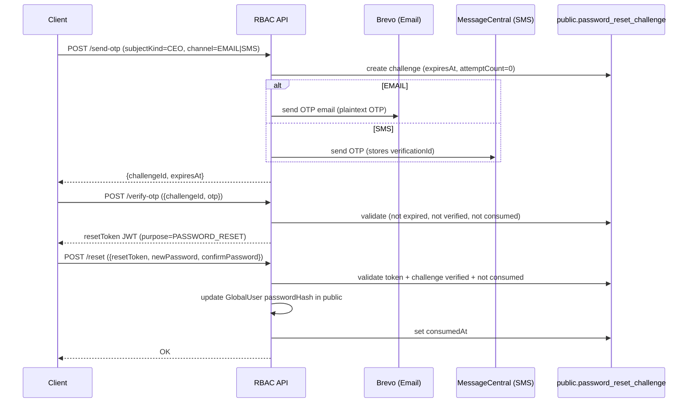
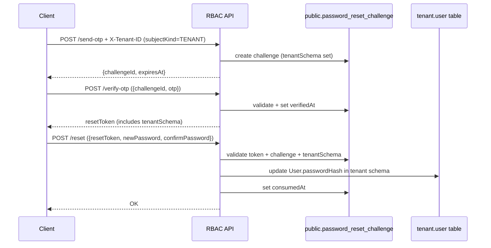

# Forgot Password (OTP) — CEO + Tenant Users

This document describes the **Forgot Password** flow implemented under:

- **Base path**: `/api/v1/auth/forgot-password`
- **Mode**: OTP (Email or SMS) → Verify OTP → Receive short-lived reset token (JWT) → Reset password

The implementation lives primarily in:

- `src/main/java/com/security/rbac/modules/auth/passwordreset/controller/ForgotPasswordController.java`
- `src/main/java/com/security/rbac/modules/auth/passwordreset/service/impl/ForgotPasswordServiceImpl.java`

---

## Overview

### User types (subject kind)

The flow supports two independent “subjects”:

- **CEO user**: stored in `public` schema as `GlobalUser`
- **TENANT user**: stored in a tenant schema as `User`

The API differentiates them via the request field `subjectKind`:

- `CEO`
- `TENANT`

### Channels

OTP can be delivered using:

- `EMAIL`: OTP is generated server-side (6 digits), hashed with password encoder, and emailed.
- `SMS`: OTP is handled by MessageCentral; the server stores a `verificationId` for later verification.

`channel` values:

- `EMAIL`
- `SMS`

---

## Tenant resolution (important for TENANT flow)

Tenant schema is resolved per request using the header:

- `X-Tenant-ID: <tenantSchema>`

Rules:

- **CEO flow** always runs in `public` schema (internally sets tenant to `public`).
- **TENANT flow** requires `X-Tenant-ID` to be present and not equal to `public`.
  - If missing (or resolves to `public`), API returns **400** with message:  
    `X-Tenant-ID header is required for tenant password recovery`

---

## Data model: password reset challenge (server-side session)

Each OTP request creates a row in **public** schema table:

- `public.password_reset_challenge`

Key fields:

- `id` (UUID): `challengeId` returned to client
- `subject_kind`: `CEO` or `TENANT`
- `channel`: `EMAIL` or `SMS`
- `identifier_normalized`: lowercased email OR normalized 10-digit mobile digits
- `tenant_schema`: set **only for TENANT** flows
- `target_user_id`: CEO `GlobalUser.id` or tenant `User.id`
- OTP storage:
  - `otp_hash` for EMAIL flow
  - `verification_id` + `mobile_digits` + `country_code` for SMS flow
- lifecycle markers:
  - `expires_at`: OTP expiry time
  - `verified_at`: set when OTP is verified
  - `consumed_at`: set after successful password reset (prevents reuse)
  - `attempt_count`: failed verify attempts

---

## Security & limits

### OTP expiry

- **OTP TTL**: `app.password-reset.otp-expiration-minutes` (default **10 minutes**)

### OTP verify attempt limit

- **Max attempts per challenge**: `app.password-reset.max-otp-attempts` (default **3**)
- After reaching max attempts, verify returns **429**: `Maximum OTP verification attempts exceeded`

### OTP resend throttling (by identifier)

Server enforces throttles per normalized identifier (email/mobile):

- **Max sends per window**: **5** requests
- **Window duration**: **15 minutes**
- **Minimum resend interval**: **60 seconds** between OTP sends

On violation, API returns **429** with a descriptive message.

### Reset token (JWT)

After OTP verification, server returns a short-lived JWT:

- **Purpose claim**: `purpose = "PASSWORD_RESET"`
- **Expires in**: `app.password-reset.reset-token-expiration-ms` (default **900000 ms = 15 minutes**)
- Contains claims:
  - `purpose`
  - `subjectKind`
  - `challengeId`
  - `userId`
  - `tenantSchema` (only for TENANT)

### Password policy (reset step)

New password must match:

- minimum 8 chars
- at least 1 uppercase
- at least 1 digit
- at least 1 special character

If invalid: **400** `Password must be at least 8 characters and include uppercase, digit, and special character`

---

## Response formats

### Success response wrapper (most endpoints here)

Forgot password endpoints use the wrapper:

```json
{
  "status": 200,
  "message": "…",
  "data": {}
}
```

Where `data` depends on endpoint.

### Error responses

Errors are returned via centralized exception handling and typically look like:

```json
{
  "timestamp": "2026-05-07T12:34:56.789",
  "status": 400,
  "error": "Bad Request",
  "message": "…",
  "path": "/api/v1/auth/forgot-password/…",
  "validationErrors": null
}
```

Validation errors (e.g., missing required fields) use `validationErrors` map.

---

## API: Endpoints, payloads, and responses

### 1) Send OTP

- **Method**: `POST`
- **Path**: `/send-otp`
- **Auth**: none
- **Tenant header**:
  - **CEO**: not required
  - **TENANT**: **required** → `X-Tenant-ID: <tenantSchema>`

#### Request body (`ForgotPasswordSendRequest`)

Provide **either** `email` (EMAIL) **or** `mobile` (SMS):

```json
{
  "subjectKind": "CEO | TENANT",
  "channel": "EMAIL | SMS",
  "email": "user@example.com",
  "mobile": "9876543210"
}
```

Notes:

- For `channel=EMAIL`, `email` must be present and valid.
- For `channel=SMS`, `mobile` must be a valid **10-digit Indian** number (normalized).

#### Success response (`ForgotPasswordSendResponse`)

```json
{
  "status": 200,
  "message": "OTP sent successfully",
  "data": {
    "challengeId": "8f4c9b36-6d2a-4a42-8e3c-2c9a0b1e4e76",
    "expiresAt": "2026-05-07T12:55:00.000Z"
  }
}
```

---

### 2) Verify OTP (returns reset token)

- **Method**: `POST`
- **Path**: `/verify-otp`
- **Auth**: none
- **Tenant header**: not required

#### Request body (`ForgotPasswordVerifyRequest`)

```json
{
  "challengeId": "8f4c9b36-6d2a-4a42-8e3c-2c9a0b1e4e76",
  "otp": "123456"
}
```

Constraints:

- `otp` must be exactly **6 digits**.

#### Success response (`ForgotPasswordVerifyResponse`)

```json
{
  "status": 200,
  "message": "OTP verified",
  "data": {
    "resetToken": "eyJhbGciOiJIUzI1NiIsInR5cCI6IkpXVCJ9.…",
    "expiresInSeconds": 900
  }
}
```

Common failure messages:

- **400** `Invalid or expired recovery session` (challengeId invalid)
- **400** `OTP has expired. Please request a new one.`
- **400** `Invalid OTP`
- **429** `Maximum OTP verification attempts exceeded`
- **400** `This recovery session is no longer valid` (already consumed)
- **400** `OTP already verified for this session`

---

### 3) Reset password

- **Method**: `POST`
- **Path**: `/reset`
- **Auth**: none (uses reset token in body)
- **Tenant header**: not required

#### Request body (`ForgotPasswordResetRequest`)

```json
{
  "resetToken": "eyJhbGciOiJIUzI1NiIsInR5cCI6IkpXVCJ9.…",
  "newPassword": "StrongPass1!",
  "confirmPassword": "StrongPass1!"
}
```

#### Success response

```json
{
  "status": 200,
  "message": "Password reset successfully. Please login with your new password.",
  "data": "OK"
}
```

Common failure messages:

- **400** `Passwords do not match`
- **400** `Password must be at least 8 characters and include uppercase, digit, and special character`
- **400** `Invalid or expired reset token`
- **400** `Invalid reset token` (wrong purpose/user/subjectKind mismatch)
- **400** `Reset token already used`
- **400** `OTP verification required before resetting password`
- **404** `User not found` (user deleted after OTP)

---

## Workflow: CEO user (GlobalUser) password reset

### Preconditions

- CEO must exist in **public** schema (`GlobalUser`)
- CEO must be active (`isActive=true`), otherwise **403** `Account is disabled`

### Step-by-step

1. **Send OTP**
   - Call `POST /api/v1/auth/forgot-password/send-otp`
   - Body includes `"subjectKind": "CEO"`
   - Choose `EMAIL` or `SMS`
2. **User receives OTP**
   - EMAIL: OTP is generated by server and emailed via Brevo
   - SMS: OTP is issued by MessageCentral (server stores verification id)
3. **Verify OTP**
   - Call `POST /api/v1/auth/forgot-password/verify-otp`
   - Provide `challengeId` and `otp`
   - On success, you receive a **resetToken** (JWT)
4. **Reset password**
   - Call `POST /api/v1/auth/forgot-password/reset`
   - Provide `resetToken`, `newPassword`, `confirmPassword`
   - Server updates `GlobalUser.passwordHash` in `public` schema
   - Challenge is marked as **consumed** (`consumedAt` set) so token cannot be reused

### CEO examples

#### Send OTP (CEO, Email)

```http
POST /api/v1/auth/forgot-password/send-otp
Content-Type: application/json

{
  "subjectKind": "CEO",
  "channel": "EMAIL",
  "email": "ceo@example.com"
}
```

#### Send OTP (CEO, SMS)

```http
POST /api/v1/auth/forgot-password/send-otp
Content-Type: application/json

{
  "subjectKind": "CEO",
  "channel": "SMS",
  "mobile": "9876543210"
}
```

---

## Workflow: TENANT user (User) password reset

### Preconditions

- Tenant schema must be resolvable from `X-Tenant-ID`
- User must exist in that tenant schema (`User`)
- User must be active:
  - `isActive=true`
  - `status="ACTIVE"`
  - otherwise **403** `Account is disabled`

### Step-by-step

1. **Send OTP (tenant-scoped)**
   - Call `POST /api/v1/auth/forgot-password/send-otp`
   - Must include header `X-Tenant-ID: <tenantSchema>`
   - Body includes `"subjectKind": "TENANT"`
2. **User receives OTP**
   - EMAIL: OTP generated by server and emailed via Brevo
   - SMS: OTP issued by MessageCentral
3. **Verify OTP**
   - Call `POST /api/v1/auth/forgot-password/verify-otp`
   - Provide `challengeId` and `otp`
   - On success you receive reset JWT containing `tenantSchema`
4. **Reset password**
   - Call `POST /api/v1/auth/forgot-password/reset` with the reset token
   - Server switches internally to the `tenantSchema` stored in the challenge and updates `User.passwordHash`
   - Challenge is marked as **consumed** (`consumedAt` set)

### TENANT examples

#### Send OTP (TENANT, Email)

```http
POST /api/v1/auth/forgot-password/send-otp
Content-Type: application/json
X-Tenant-ID: acme

{
  "subjectKind": "TENANT",
  "channel": "EMAIL",
  "email": "user@example.com"
}
```

#### Send OTP (TENANT, SMS)

```http
POST /api/v1/auth/forgot-password/send-otp
Content-Type: application/json
X-Tenant-ID: acme

{
  "subjectKind": "TENANT",
  "channel": "SMS",
  "mobile": "9876543210"
}
```

---

## End-to-end sequence diagrams

### CEO flow



### TENANT flow



---

## Quick checklist for clients (frontend/mobile)

- **Always store** `challengeId` returned by `/send-otp` and use it for `/verify-otp`.
- **Never send OTP to `/reset`** — only `resetToken` from `/verify-otp` is accepted.
- **TENANT flow requires `X-Tenant-ID`** on `/send-otp` (and generally for tenant auth operations).
- Expect `429` for throttling or too many OTP attempts.
- Reset token is short-lived; prompt user to complete reset quickly.
