# Accounting scenarios, COA, ledger linkage, GST & TDS (Seravion — as implemented)

Single reference for **chart of accounts (COA)**, **ledgers**, **GST cross-entries**, and **TDS cross-entries** across invoices, bills, receipts, payments, credit notes, and debit notes.

**Backend behaviour (V94+):** `InvoicingServiceImpl`, `BillsServiceImpl`, `PaymentsServiceImpl`, `TaxPostingAllocator`, `PostingLedgerResolver`, `FinancePostingHelper`.  
**Also see:** `docs/coa-ledger-posting-system-map.md` (API-focused).

---

## 0. Two timelines — “on the document” vs “in the GL”

| Phase                                  | What happens                                                                                                  | GST in GL?                  | TDS in GL?                                          |
| -------------------------------------- | ------------------------------------------------------------------------------------------------------------- | --------------------------- | --------------------------------------------------- |
| **Save draft** (invoice / bill)        | Amounts stored on header & lines (`taxableAmount`, `cgst/sgst/igst`, `tdsAmount`, `netPayable`, `grandTotal`) | **No**                      | **No**                                              |
| **Approve invoice** / **Confirm bill** | Auto `postEntry` to ledgers                                                                                   | **Yes** (if tax > 0)        | **Bill only** — Cr `TDS_PAYABLE` if `tdsAmount > 0` |
| **Receipt** / **Payment**              | Cash/bank vs party                                                                                            | **No** (GST already posted) | **Payment only** — if voucher `tdsAmount > 0`       |
| **Credit / debit note**                | Prorated reversal of parent                                                                                   | **Yes** (prorated)          | **Debit note** — prorated TDS Dr                    |

**Sales invoice:** there is **no TDS ledger posting** on approve or receipt in the current backend. TDS on **purchase** is bill + payment.

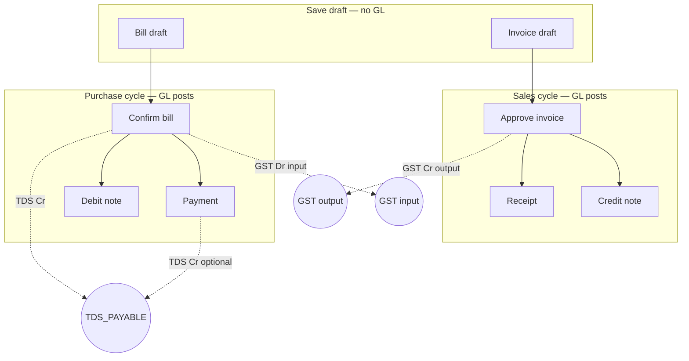

---

## 1. How to read Dr / Cr

| Idea               | Receivable (customer / we sell) | Payable (vendor / we buy) |
| ------------------ | ------------------------------- | ------------------------- |
| They owe us more   | **Dr** Customer (AR ↑)          | —                         |
| They pay us        | **Cr** Customer (AR ↓)          | —                         |
| We owe vendor more | —                               | **Cr** Vendor (AP ↑)      |
| We pay vendor      | —                               | **Dr** Vendor (AP ↓)      |
| Money in           | **Dr** Bank / Cash              | **Dr** Bank / Cash        |
| Money out          | **Cr** Bank / Cash              | **Cr** Bank / Cash        |

Every voucher: **Σ Dr = Σ Cr**.

---

## 2. COA vs ledger vs posting role

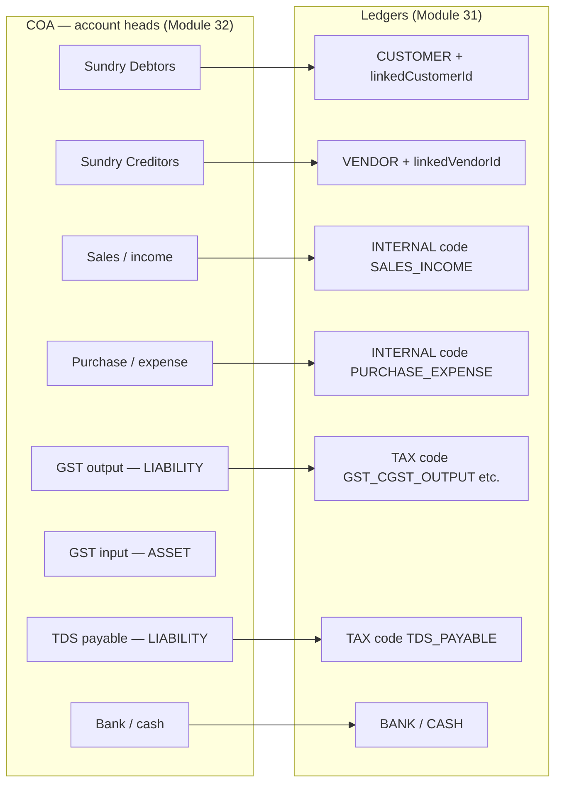

| Layer                   | Purpose                                                      | Example                            |
| ----------------------- | ------------------------------------------------------------ | ---------------------------------- |
| **COA head**            | Classification; **postable** = can pick when creating ledger | “Duties & Taxes – GST Output”      |
| **Ledger**              | Book with balance; `ledgerType` + **`ledgerCode`**           | `GST_CGST_OUTPUT`, type `TAX`      |
| **Posting key**         | System role → ledger (binding or default code)               | `TAX_CGST_OUTPUT`, `TDS_PAYABLE`   |
| **Tax type** (Module 9) | Rate master + optional ledger override                       | CGST 9% → `sales_output_ledger_id` |
| **Document**            | Commercial record; posts on **approve/confirm/pay**          | Invoice `INV-2026-0001`            |

**Posting never hits COA head ID directly** — only **ledger** IDs in `ledger_entries`.

---

## 3. Master data setup (order matters)

### 3.1 COA heads (frontend: Chart of Accounts → Add Account)

| Purpose                             | Suggested primary group | Nature | Postable |
| ----------------------------------- | ----------------------- | ------ | -------- |
| Sundry debtors                      | ASSET                   | DR     | Yes      |
| Sundry creditors                    | LIABILITY               | CR     | Yes      |
| Sales / income                      | INCOME                  | CR     | Yes      |
| Purchase / expense                  | EXPENSE                 | DR     | Yes      |
| GST output (CGST/SGST/IGST payable) | LIABILITY               | CR     | Yes      |
| GST input (ITC)                     | ASSET                   | DR     | Yes      |
| TDS payable                         | LIABILITY               | CR     | Yes      |
| Bank / cash                         | ASSET                   | DR     | Yes      |

Parent head optional (e.g. “Duties & Taxes” under LIABILITY with children).

### 3.2 Ledgers (frontend: Create Ledger)

| Ledger code (exact)   | `ledgerType`    | COA head       | Used when                        |
| --------------------- | --------------- | -------------- | -------------------------------- |
| _(per customer)_      | CUSTOMER        | Debtors        | Invoice approve, receipt, CN     |
| _(per vendor)_        | VENDOR          | Creditors      | Bill confirm, payment, DN        |
| `SALES_INCOME`        | INTERNAL        | Income         | Invoice approve — Cr **taxable** |
| `SALES_ADJUSTMENT`    | INTERNAL        | Income/returns | Credit note — Dr taxable portion |
| `PURCHASE_EXPENSE`    | INTERNAL        | Expense        | Bill confirm — Dr **taxable**    |
| `PURCHASE_ADJUSTMENT` | INTERNAL        | Expense        | Debit note — Cr taxable portion  |
| `GST_CGST_OUTPUT`     | TAX or INTERNAL | GST output     | Invoice — Cr CGST                |
| `GST_SGST_OUTPUT`     | TAX or INTERNAL | GST output     | Invoice — Cr SGST                |
| `GST_IGST_OUTPUT`     | TAX or INTERNAL | GST output     | Invoice — Cr IGST                |
| `GST_CGST_INPUT`      | TAX or INTERNAL | GST input      | Bill — Dr CGST                   |
| `GST_SGST_INPUT`      | TAX or INTERNAL | GST input      | Bill — Dr SGST                   |
| `GST_IGST_INPUT`      | TAX or INTERNAL | GST input      | Bill — Dr IGST                   |
| `TDS_PAYABLE`         | TAX or INTERNAL | TDS            | Bill confirm Cr; payment Cr      |
| Bank / cash code      | BANK / CASH     | Bank           | Receipt Dr; payment Cr           |

**Posting bindings:** `PUT /api/v1/ledgers/posting-bindings` maps `PostingLedgerKey` → `ledgerId` (overrides default code).

**Tax types:** `PUT /api/v1/tax-types` optional `salesOutputLedgerId` / `purchaseInputLedgerId` per CGST/SGST/IGST row.

### 3.3 Tax module vs ledger module

| Module                      | Stores                                   | Does **not** post by itself  |
| --------------------------- | ---------------------------------------- | ---------------------------- |
| **Tax types**               | Rates, category CENTRAL/STATE/INTEGRATED | —                            |
| **HSN**                     | Links to tax types                       | —                            |
| **Invoice/bill lines**      | `hsnSac`, `taxAmount`, `taxPct`          | —                            |
| **Ledgers + bindings**      | Where GL lines go                        | —                            |
| **Approve / confirm / pay** | —                                        | **Creates** `ledger_entries` |

---

## 4. GST — how amounts are built (before GL)

### 4.1 On save (invoice / bill draft)

Per line (typical):

- `taxableAmount` = (qty × rate) − discount
- `taxAmount` = taxable × tax%
- `lineTotal` = taxable + tax

Header (intra-state: branch state = customer/vendor state):

- `cgst` + `sgst` = total tax (50/50 split)
- `igst` = 0

Inter-state:

- `igst` = total tax
- `cgst` = `sgst` = 0

Invoice: `grandTotal` = taxable + cgst + sgst + igst (+ round-off).  
Bill: `netPayable` = **sum(lineTotal) − tdsAmount**.

### 4.2 On approve / confirm (GST in GL)

`TaxPostingAllocator`:

1. For each line with `taxAmount > 0` and `hsnSac` → load HSN → active **tax types**.
2. Intra: use CENTRAL + STATE (+ CESS); skip INTEGRATED. Inter: use INTEGRATED.
3. Split line tax by each type’s `defaultRate`.
4. Ledger: tax type’s `sales_output_ledger_id` / `purchase_input_ledger_id`, else posting key from category (`TAX_CGST_OUTPUT`, etc.).
5. Reconcile to header `cgst` / `sgst` / `igst` (± ₹0.02) or **400**.

If no line tax but header tax > 0 → allocate from header buckets only.

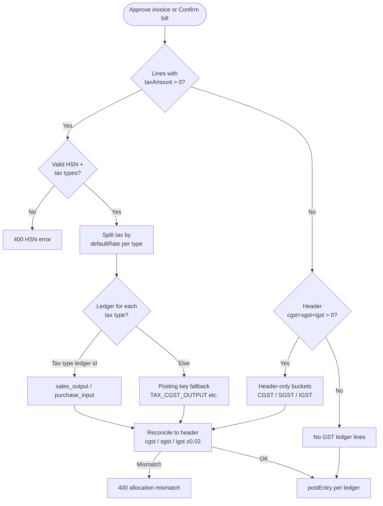

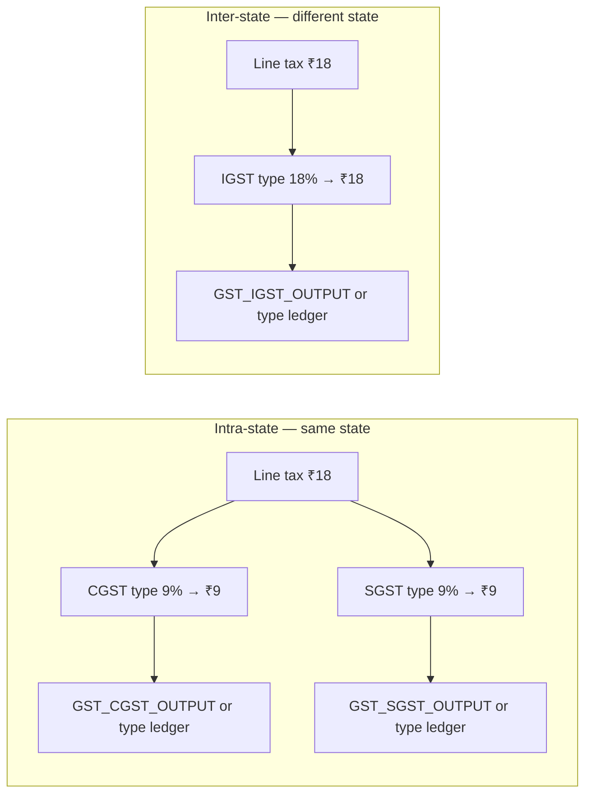

---

## 5. TDS — full lifecycle (purchase side only)

### 5.1 What “TDS yes” on bill **creation** means

On **bill save** (draft), you can set:

| Field           | Role                                      |
| --------------- | ----------------------------------------- |
| `tdsApplicable` | Flag on bill                              |
| `tdsSection`    | e.g. 194C, 194J                           |
| `tdsRate`       | % on base                                 |
| `tdsAmount`     | ₹ withheld                                |
| `netPayable`    | **Must equal** sum(lineTotal) − tdsAmount |

**At save:** nothing posts to `TDS_PAYABLE` or vendor yet. Only validation + storage.

**Economic meaning:** vendor is credited for **net** payable; company will later owe govt the TDS portion.

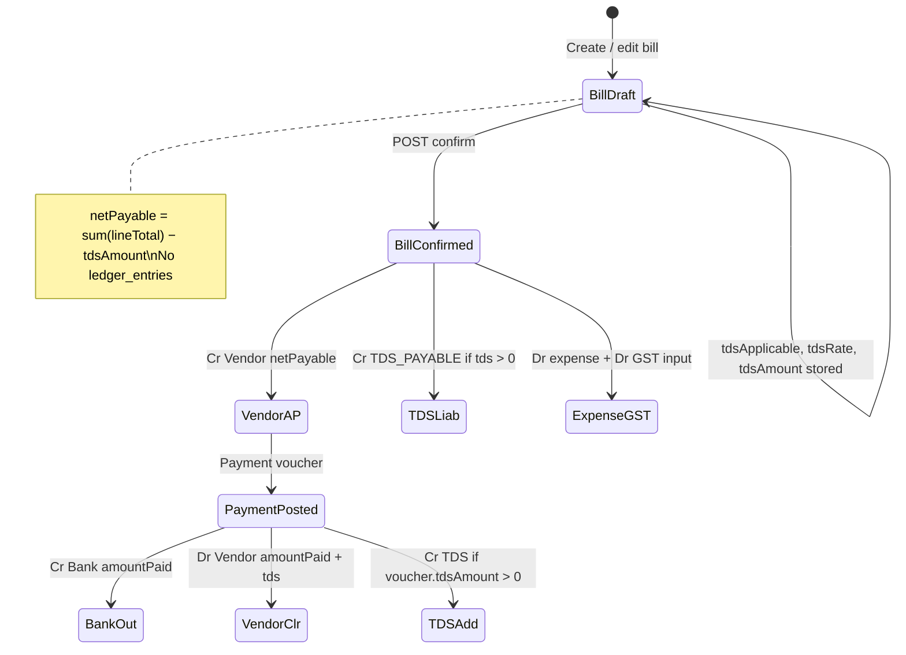

### 5.2 Bill **confirm** — TDS + GST + expense (first GL hit)

**Trigger:** `POST /api/v1/bills/confirm` (DRAFT → PENDING).

**Example** (intra-state, 18% GST on ₹1,000 taxable, 2% TDS on taxable base):

| Field          | Value                    |
| -------------- | ------------------------ |
| taxableAmount  | 1,000.00                 |
| cgst / sgst    | 90.00 / 90.00            |
| Line tax total | 180.00                   |
| tdsAmount      | 20.00 (e.g. 2% of 1,000) |
| sum(lineTotal) | 1,180.00                 |
| netPayable     | 1,160.00 (= 1,180 − 20)  |

**Ledger entries posted:**

| #   | Account                                   | Dr       | Cr       |
| --- | ----------------------------------------- | -------- | -------- |
| 1   | PURCHASE_EXPENSE                          | 1,000.00 |          |
| 2   | GST_CGST_INPUT (and/or SGST/IGST ledgers) | 180.00   |          |
| 3   | Vendor (AP)                               |          | 1,160.00 |
| 4   | TDS_PAYABLE                               |          | 20.00    |

Check: Dr 1,180 = Cr 1,160 + 20 ✓

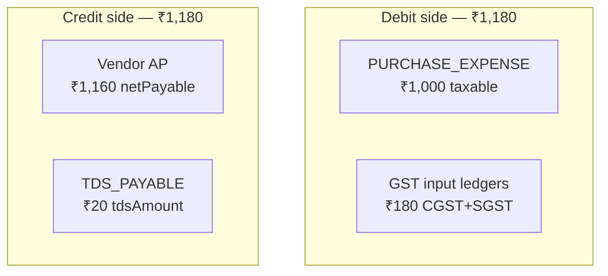

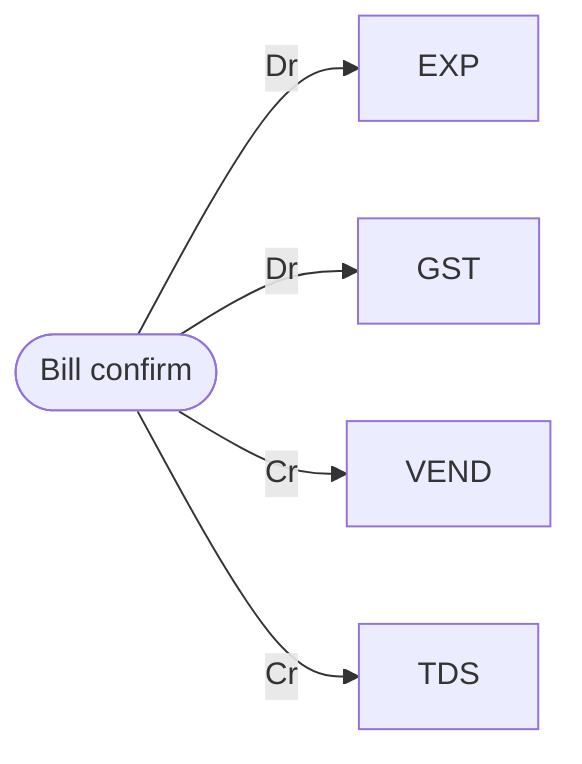

**Needs:** vendor ledger, `PURCHASE_EXPENSE`, GST input ledgers (or bindings), `TDS_PAYABLE` if tds > 0.

### 5.3 Vendor **payment** — with and without TDS on voucher

**Trigger:** `POST /api/v1/vouchers/payments`.

Bill already raised AP **net** (1,160) and TDS payable (20). Payment clears bank + may post **additional** TDS if withheld at payment time.

#### A) Pay full net, no TDS on voucher (`tdsAmount = 0`)

Pay ₹1,160 to bank:

| Account | Dr       | Cr       |
| ------- | -------- | -------- |
| Vendor  | 1,160.00 |          |
| Bank    |          | 1,160.00 |

TDS payable (20) **still shows** on `TDS_PAYABLE` until you deposit to govt (separate journal / challan — not auto in app today).

#### B) Payment voucher with TDS (`tdsAmount > 0`)

Example: pay ₹1,140 net, withhold ₹20 TDS on payment (total liability clearance 1,160):

| Account     | Dr                                    | Cr                    |
| ----------- | ------------------------------------- | --------------------- |
| Vendor      | **1,160.00** (amountPaid + tdsAmount) |                       |
| Bank        |                                       | 1,140.00 (amountPaid) |
| TDS_PAYABLE |                                       | 20.00 (tdsAmount)     |

**Rule in code:** Dr vendor = `amountPaid + tdsAmount`; Cr bank = `amountPaid`; Cr TDS = `tdsAmount`.

**Needs:** `TDS_PAYABLE` ledger resolved when voucher `tdsAmount > 0`.

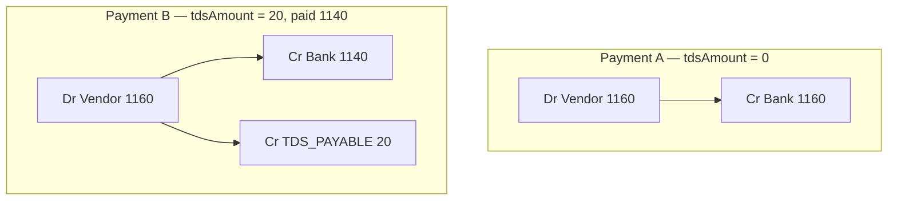

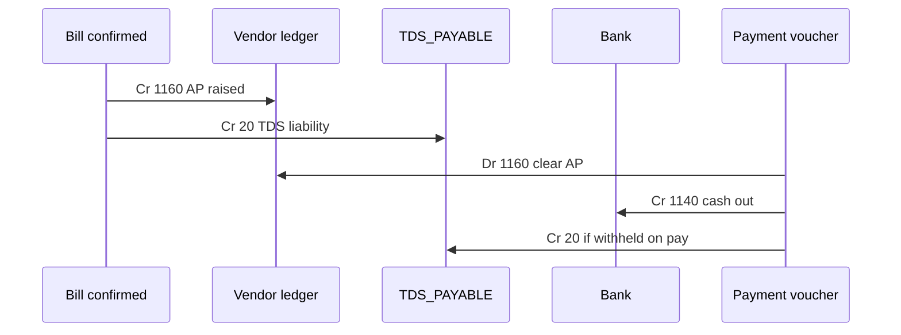

#### C) Bill had **no** TDS at confirm, TDS only on payment

If bill confirm had `tdsAmount = 0`, vendor Cr = full gross. Payment can still pass `tdsAmount` on voucher → 3-line payment pattern above.

### 5.4 Debit note (purchase) — prorated TDS reversal

**Trigger:** debit note against bill.

Ratio = `debitAmount / (netPayable + tdsAmount)`.

| Dr                                 | Cr                                     |
| ---------------------------------- | -------------------------------------- |
| Vendor (prorated net)              |                                        |
| TDS_PAYABLE (prorated tds, if any) |                                        |
|                                    | PURCHASE_ADJUSTMENT (prorated taxable) |
|                                    | GST input ledgers (prorated tax)       |

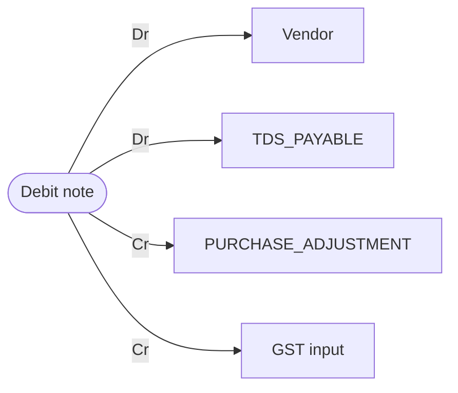

---

## 6. GST + TDS — sales invoice (no TDS on invoice)

### 6.1 Draft invoice — “TDS” confusion

**Sales invoice UI** does **not** post TDS. Customer TDS (194Q etc.) is **not** modeled on invoice approve in this backend.

If you need **TDS receivable** on sales, use **manual journal** or a future feature — not auto today.

### 6.2 Invoice **approve** — cross entries (GST split)

**Trigger:** `POST /api/v1/invoices/approve-send`.

**Example** (intra-state, taxable ₹10,000, GST ₹1,800 → cgst 900, sgst 900, grandTotal ₹11,800):

| #   | Account         | Dr        | Cr        |
| --- | --------------- | --------- | --------- |
| 1   | Customer        | 11,800.00 |           |
| 2   | SALES_INCOME    |           | 10,000.00 |
| 3   | GST_CGST_OUTPUT |           | 900.00    |
| 4   | GST_SGST_OUTPUT |           | 900.00    |

**Line count:** 2 + number of tax ledgers (here 4 lines).

Inter-state (IGST ₹1,800 only):

| Dr Customer 11,800 | Cr SALES 10,000 | Cr GST_IGST_OUTPUT 1,800 |

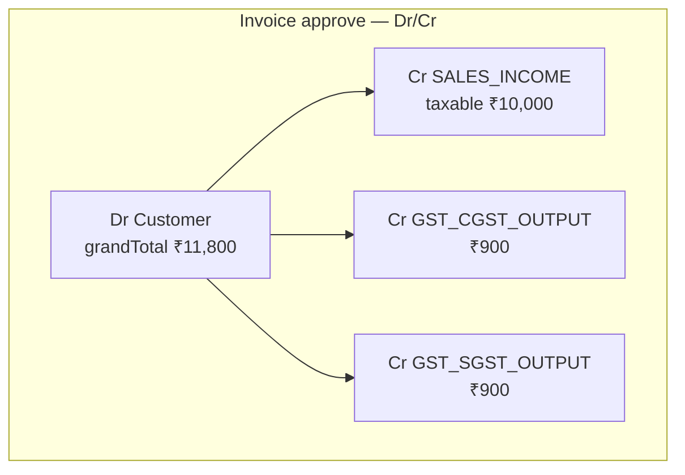

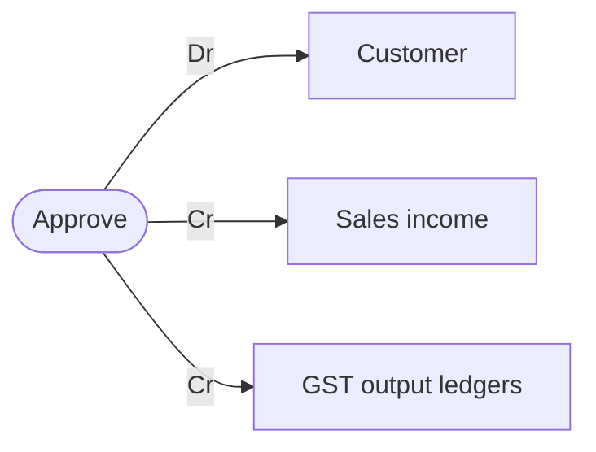

### 6.3 Receipt (customer pays) — **no** GST lines

Customer pays ₹11,800 by bank:

| Dr Bank 11,800 | Cr Customer 11,800 |

GST output ledgers **unchanged** — liability remains until return/payment to govt (outside this doc).

### 6.4 Credit note — prorated GST reversal

Ratio = `creditAmount / grandTotal`.

Example: CN ₹2,360 on ₹11,800 invoice (20%):

| Dr SALES_ADJUSTMENT | 2,000.00 (20% of taxable) |
| Dr GST output ledgers | 360.00 (20% of tax) |
| Cr Customer | 2,360.00 |

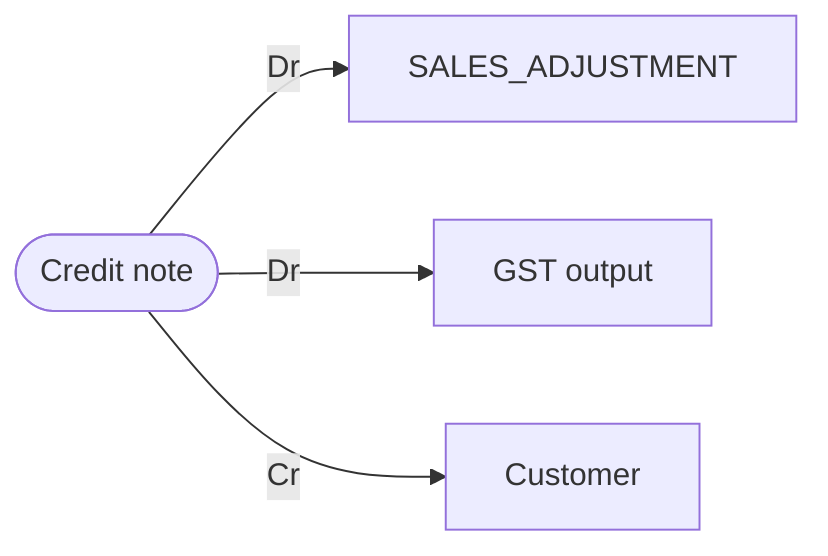

---

## 7. End-to-end scenarios (numbered examples)

### Scenario A — Invoice approved → fully paid (bank)

| Step | Event   | Customer  | Sales     | GST out  | Bank      |
| ---- | ------- | --------- | --------- | -------- | --------- |
| 1    | Approve | Dr 11,800 | Cr 10,000 | Cr 1,800 | —         |
| 2    | Receipt | Cr 11,800 | —         | —        | Dr 11,800 |

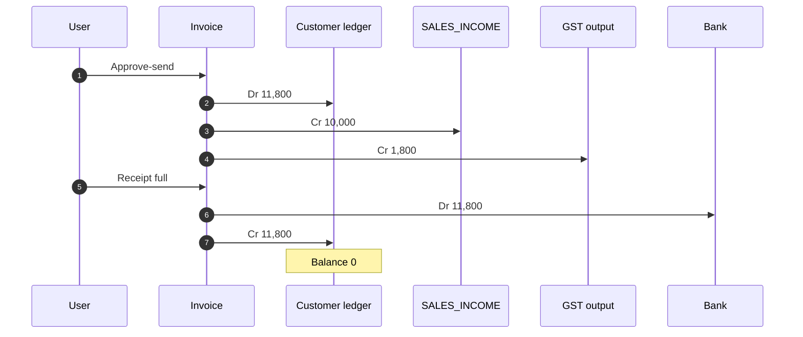

### Scenario B — Invoice → partial receipt + credit note

| Step | Event          | Customer  | Sales/adj            | GST out       | Bank     |
| ---- | -------------- | --------- | -------------------- | ------------- | -------- |
| 1    | Approve        | Dr 11,800 | Cr 10,000 + Cr 1,800 |               | —        |
| 2    | Receipt ₹5,000 | Cr 5,000  | —                    | —             | Dr 5,000 |
| 3    | CN balance     | Cr 6,800  | Dr (prorated)        | Dr (prorated) | —        |

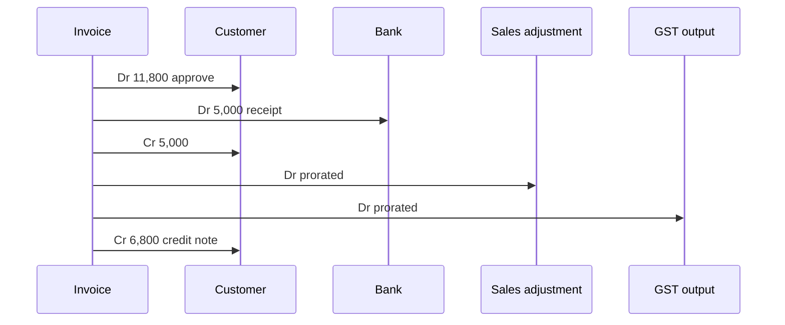

### Scenario C — Bill with TDS → confirm → pay net (no pay-TDS)

Bill: taxable 1,000, GST 180, TDS 20, net 1,160.

| Step | Event     | Expense  | GST in | Vendor   | TDS pay | Bank     |
| ---- | --------- | -------- | ------ | -------- | ------- | -------- |
| 1    | Confirm   | Dr 1,000 | Dr 180 | Cr 1,160 | Cr 20   | —        |
| 2    | Pay 1,160 | —        | —      | Dr 1,160 | —       | Cr 1,160 |

TDS payable still Cr 20 until manual clearance to govt.

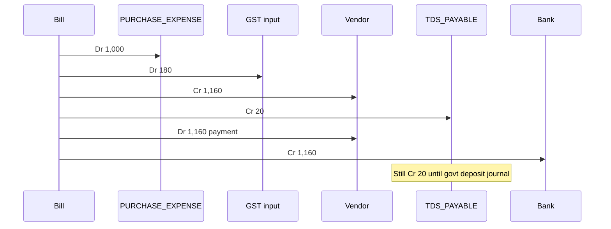

### Scenario D — Bill confirm → payment **with** TDS on voucher

After confirm (same as C step 1). Payment: amountPaid 1,140, tdsAmount 20:

| Dr Vendor 1,160 | Cr Bank 1,140 | Cr TDS_PAYABLE 20 |

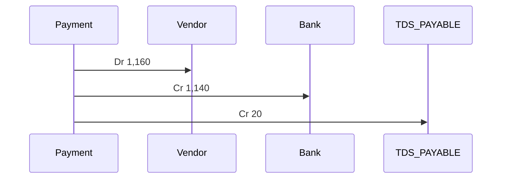

### Scenario E — Bill → partial pay + debit note

| Step           | Vendor                 | Expense/adj   | GST in        | Bank   |
| -------------- | ---------------------- | ------------- | ------------- | ------ |
| 1 Confirm      | Cr 1,160 (+ TDS Cr 20) | Dr 1,000      | Dr 180        | —      |
| 2 Pay 400      | Dr 400                 | —             | —             | Cr 400 |
| 3 DN remainder | Dr (prorated)          | Cr (prorated) | Cr (prorated) | —      |

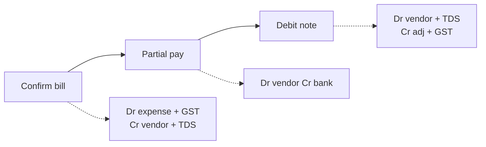

---

## 8. When does GL post? (cheat sheet)

| Document      | User action      | GST ledgers?   | TDS ledger?                    | Lines (typical) |
| ------------- | ---------------- | -------------- | ------------------------------ | --------------- |
| Sales invoice | **Approve-send** | Yes if tax > 0 | **No**                         | 3+              |
| Sales invoice | Save draft       | No             | No                             | 0               |
| Receipt       | Post receipt     | No             | No                             | 2               |
| Credit note   | Issue CN         | Yes (prorated) | No                             | 3+              |
| Purchase bill | **Confirm**      | Yes if tax > 0 | Yes if bill `tdsAmount > 0`    | 3–5+            |
| Purchase bill | Save draft       | No             | No                             | 0               |
| Payment       | Post payment     | No             | Yes if voucher `tdsAmount > 0` | 2 or **3**      |
| Debit note    | Issue DN         | Yes (prorated) | Yes (prorated Dr)              | 4+              |
| Journal       | Manual           | User-defined   | User-defined                   | n               |

---

## 9. Posting keys → default ledger codes

| Posting key                    | Default code        | Side on document    |
| ------------------------------ | ------------------- | ------------------- |
| INVOICE_APPROVE_INCOME         | SALES_INCOME        | Invoice Cr taxable  |
| INVOICE_CREDIT_NOTE_ADJUSTMENT | SALES_ADJUSTMENT    | CN Dr taxable       |
| BILL_CONFIRM_EXPENSE           | PURCHASE_EXPENSE    | Bill Dr taxable     |
| BILL_DEBIT_NOTE_ADJUSTMENT     | PURCHASE_ADJUSTMENT | DN Cr taxable       |
| TAX_CGST_OUTPUT                | GST_CGST_OUTPUT     | Invoice Cr          |
| TAX_SGST_OUTPUT                | GST_SGST_OUTPUT     | Invoice Cr          |
| TAX_IGST_OUTPUT                | GST_IGST_OUTPUT     | Invoice Cr          |
| TAX_CGST_INPUT                 | GST_CGST_INPUT      | Bill Dr             |
| TAX_SGST_INPUT                 | GST_SGST_INPUT      | Bill Dr             |
| TAX_IGST_INPUT                 | GST_IGST_INPUT      | Bill Dr             |
| TDS_PAYABLE                    | TDS_PAYABLE         | Bill Cr; Payment Cr |

---

## 10. Strict errors (why approve/confirm fails)

| Condition                         | Typical 400 message                            |
| --------------------------------- | ---------------------------------------------- |
| Tax > 0, no GST ledger / binding  | Missing ledger for posting key / tax type      |
| Line HSN missing or inactive      | Active HSN not found                           |
| Allocator ≠ header cgst/sgst/igst | Tax allocation does not match header GST split |
| No customer/vendor ledger         | Customer/Vendor ledger not found/active        |
| Payment tds > 0, no TDS ledger    | TDS_PAYABLE not configured                     |

Fix: create ledgers → `posting-bindings` → optional tax type ledger IDs → retry.

---

## 11. Big picture diagram (documents → ledgers)

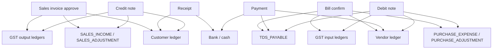

---

## 12. Company expenses, assets, capital (unchanged)

| Event                    | Typical posting      |
| ------------------------ | -------------------- |
| Expense paid from bank   | Dr Expense · Cr Bank |
| Asset on credit          | Dr Asset · Cr Vendor |
| Owner capital introduced | Dr Bank · Cr Capital |

Use **journal voucher** or expense flow — not invoice/bill GST allocator.

---

## 13. Frontend / API map

| Topic                 | Path / doc                              |
| --------------------- | --------------------------------------- |
| COA                   | Module 32, `/api/v1/coa/heads`          |
| Ledgers               | Module 31, `/api/v1/ledgers`            |
| Posting bindings      | `/api/v1/ledgers/posting-bindings`      |
| Tax types             | `/api/v1/tax-types`                     |
| Invoice approve       | `POST /api/v1/invoices/approve-send`    |
| Bill confirm          | `POST /api/v1/bills/confirm`            |
| Payment               | `POST /api/v1/vouchers/payments`        |
| Implementation detail | `docs/coa-ledger-posting-system-map.md` |

---

## 14. One-page cross-entry summary

| Document           | Main Dr                          | Main Cr                         | Cash            |
| ------------------ | -------------------------------- | ------------------------------- | --------------- |
| Invoice approve    | Customer **grandTotal**          | Sales **taxable** + **GST**     | —               |
| Receipt            | Bank                             | Customer                        | In              |
| Credit note        | Adjustment + **GST** (prorated)  | Customer                        | Refund optional |
| Bill confirm       | Expense **taxable** + **GST in** | Vendor **net** + **TDS**        | —               |
| Payment (no TDS)   | Vendor                           | Bank                            | Out             |
| Payment (with TDS) | Vendor **paid+tds**              | Bank **paid** + **TDS**         | Out             |
| Debit note         | Vendor + **TDS** (prorated)      | Adjustment + **GST** (prorated) | —               |

---

## 15. Whole account graph (master view)

Single diagram: **master data**, **tax engine**, **all ledgers**, and **every document** that writes `ledger_entries`. Read top → bottom as setup first, then operations.

```mermaid
flowchart TB
  subgraph MASTER["Master data — configure once"]
    direction TB
    subgraph M9["Module 9 — Tax"]
      TT[Tax types<br/>CGST SGST IGST rates]
      HSN[HSN codes<br/>linked tax types]
      TTL[sales_output_ledger_id<br/>purchase_input_ledger_id optional]
      TT --- HSN
      TT --- TTL
    end

    subgraph M32["Module 32 — COA"]
      PG_ASSET[Primary ASSET]
      PG_LIAB[Primary LIABILITY]
      PG_INC[Primary INCOME]
      PG_EXP[Primary EXPENSE]
      COA_HEADS[Postable account heads<br/>Debtors Creditors GST TDS Bank Income Expense]
      PG_ASSET --> COA_HEADS
      PG_LIAB --> COA_HEADS
      PG_INC --> COA_HEADS
      PG_EXP --> COA_HEADS
    end

    subgraph M31["Module 31 — Ledgers"]
      L_CUST_L[("CUSTOMER ledgers<br/>per customer")]
      L_VEND_L[("VENDOR ledgers<br/>per vendor")]
      L_INT[("INTERNAL<br/>SALES_INCOME PURCHASE_EXPENSE adjustments")]
      L_TAX_GST[("TAX or INTERNAL<br/>GST OUTPUT and INPUT codes")]
      L_TDS_L[("TAX / INTERNAL<br/>TDS_PAYABLE")]
      L_BANK_L[("BANK / CASH")]
    end

    subgraph BIND["Posting bindings + keys"]
      PK[PostingLedgerKey to ledgerId<br/>or default ledger_code]
    end

    COA_HEADS --> L_CUST_L
    COA_HEADS --> L_VEND_L
    COA_HEADS --> L_INT
    COA_HEADS --> L_TAX_GST
    COA_HEADS --> L_TDS_L
    COA_HEADS --> L_BANK_L
    PK --> L_INT
    PK --> L_TAX_GST
    PK --> L_TDS_L
    TTL --> L_TAX_GST
    HSN --> ALLOC_FN
  end

  subgraph ALLOC["TaxPostingAllocator"]
    ALLOC_FN[HSN lines split by rate then ledger map then reconcile GST header]
  end

  subgraph SALES_CYCLE["Sales cycle"]
    direction TB
    INV_D[Invoice DRAFT<br/>save — no GL]
    INV_A[Approve invoice<br/>Dr Customer Cr Sales Cr GST]
    RCP_V[Receipt<br/>Dr Bank Cr Customer]
    CN_V[Credit note<br/>Dr Adj Dr GST Cr Customer]
    INV_D --> INV_A
    INV_A --> RCP_V
    INV_A --> CN_V
  end

  subgraph PURCHASE_CYCLE["Purchase cycle"]
    direction TB
    BILL_D[Bill DRAFT<br/>tds fields stored — no GL]
    BILL_C[Confirm bill<br/>Dr Exp Dr GST Cr Vendor Cr TDS]
    PAY_V[Payment<br/>Dr Vendor Cr Bank Cr TDS optional]
    DN_V[Debit note<br/>Dr Vendor Dr TDS Cr Adj Cr GST]
    BILL_D --> BILL_C
    BILL_C --> PAY_V
    BILL_C --> DN_V
  end

  subgraph OTHER["Other"]
    JRN[Journal voucher<br/>manual any ledger]
  end

  INV_A --> L_CUST_L
  INV_A --> L_INT
  INV_A --> L_TAX_GST
  INV_A --> ALLOC_FN

  BILL_C --> L_VEND_L
  BILL_C --> L_INT
  BILL_C --> L_TAX_GST
  BILL_C --> L_TDS_L
  BILL_C --> ALLOC_FN

  RCP_V --> L_CUST_L
  RCP_V --> L_BANK_L
  PAY_V --> L_VEND_L
  PAY_V --> L_BANK_L
  PAY_V --> L_TDS_L
  CN_V --> L_CUST_L
  CN_V --> L_INT
  CN_V --> L_TAX_GST
  DN_V --> L_VEND_L
  DN_V --> L_INT
  DN_V --> L_TAX_GST
  DN_V --> L_TDS_L
  JRN --> L_INT
  JRN --> L_BANK_L
```

### 15.1 Ledger balance sheet map (where accounts sit)

```mermaid
flowchart LR
  subgraph ASSETS["ASSETS — normal Dr balance"]
    AR[Customer / debtors]
    GSTIN[GST input ITC]
    BANK[Bank & cash]
  end

  subgraph LIABILITIES["LIABILITIES — normal Cr balance"]
    AP[Vendor / creditors]
    GSTOUT[GST output payable]
    TDSP[TDS payable]
  end

  subgraph PNL["INCOME & EXPENSE — P&L"]
    SALES[Sales income]
    PURCH[Purchase expense]
    ADJ[Adjustments]
  end

  INV_OP[Invoice approve] --> AR
  INV_OP --> SALES
  INV_OP --> GSTOUT
  BILL_OP[Bill confirm] --> PURCH
  BILL_OP --> GSTIN
  BILL_OP --> AP
  BILL_OP --> TDSP
  RCP_OP[Receipt] --> BANK
  PAY_OP[Payment] --> BANK
```

### 15.2 Money flow overview

```mermaid
flowchart TB
  CUST((Customer))
  VEND((Vendor))
  CO((Company))
  GOVT((Govt GST and TDS))

  CUST -->|Pays invoice| CO
  CO -->|Bank receipt| CO
  CO -->|Pays vendor net| VEND
  CO -->|TDS withheld| GOVT
  CO -->|GST output liability| GOVT
  CO -->|GST input credit| GOVT

  subgraph legend["Document touchpoints"]
    direction LR
    L1[Invoice and CN touch Customer Sales GST out]
    L2[Bill and DN touch Vendor Expense GST in TDS]
    L3[Receipt and Payment touch Bank and party]
  end
```

### 15.3 Quick reference — which ledger moves when

```mermaid
flowchart TB
  ROOT["Seravion GL"]

  subgraph SETUP["Setup first"]
    S1[COA heads]
    S2[Ledgers and codes]
    S3[Posting bindings]
    S4[Tax types and HSN]
  end

  subgraph SALES["Sales cycle"]
    INV_A[Approve invoice]
    INV_C[Dr Customer]
    INV_S[Cr Sales income]
    INV_G[Cr GST output]
    RCP[Receipt]
    RCP_B[Dr Bank]
    RCP_C[Cr Customer]
    CN[Credit note]
    CN_A[Dr Adjustment]
    CN_G[Dr GST output]
    CN_C[Cr Customer]
    INV_A --> INV_C
    INV_A --> INV_S
    INV_A --> INV_G
    RCP --> RCP_B
    RCP --> RCP_C
    CN --> CN_A
    CN --> CN_G
    CN --> CN_C
  end

  subgraph PURCHASE["Purchase cycle"]
    BILL_C[Confirm bill]
    BILL_E[Dr Expense]
    BILL_G[Dr GST input]
    BILL_V[Cr Vendor]
    BILL_T[Cr TDS payable]
    PAY[Payment]
    PAY_V[Dr Vendor]
    PAY_B[Cr Bank]
    PAY_T[Cr TDS on voucher]
    DN[Debit note]
    DN_V[Dr Vendor]
    DN_T[Dr TDS payable]
    DN_A[Cr Adjustment]
    DN_G[Cr GST input]
    BILL_C --> BILL_E
    BILL_C --> BILL_G
    BILL_C --> BILL_V
    BILL_C --> BILL_T
    PAY --> PAY_V
    PAY --> PAY_B
    PAY --> PAY_T
    DN --> DN_V
    DN --> DN_T
    DN --> DN_A
    DN --> DN_G
  end

  ROOT --> SETUP
  ROOT --> SALES
  ROOT --> PURCHASE
```

---

_Document version: 2.1 — reflects V94 GST/TDS ledger posting; expanded Mermaid diagrams. Training / UX reference; not statutory tax advice._
