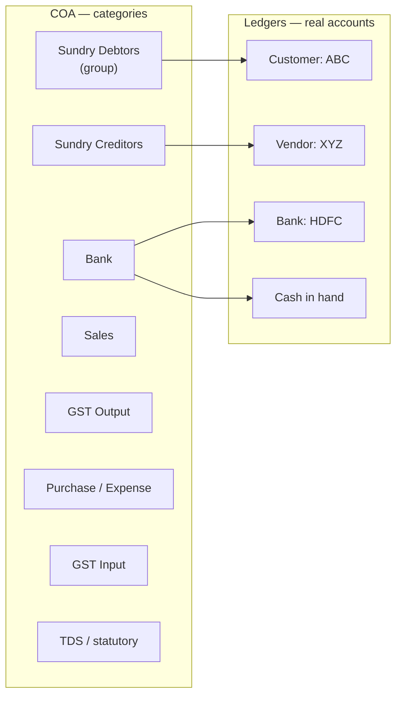
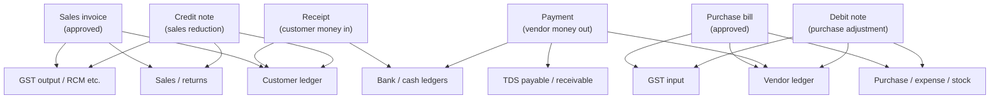
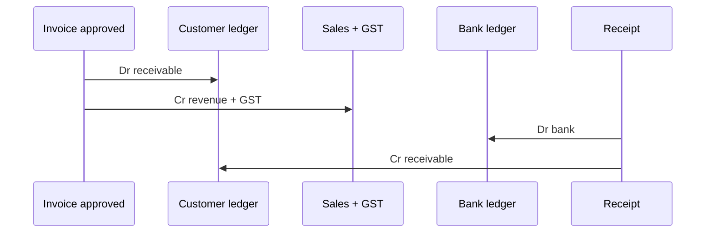
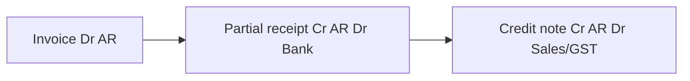
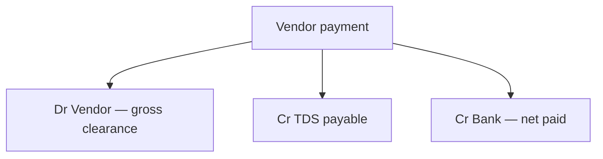

# Accounting scenarios, COA, and ledger linkage

This document gives a **single place** to see how **chart of accounts (COA)**, **ledgers**, and **commercial documents** (invoice, bill, receipt, payment, credit note, debit note) connect, with **Debit (Dr) / Credit (Cr)** patterns for typical Indian GST setups.  
Amounts are illustrative; your COA names may differ, but the **economic meaning** stays the same.

---

## 1. How to read Dr / Cr here

| Idea                       | Receivable side (customer / “we are seller”) | Payable side (vendor / “we are buyer”) |
| -------------------------- | -------------------------------------------- | -------------------------------------- |
| **They owe us more**       | Dr Customer ledger (AR ↑)                    | —                                      |
| **They pay us**            | Cr Customer ledger (AR ↓)                    | —                                      |
| **We owe vendor more**     | —                                            | Cr Vendor ledger (AP ↑)                |
| **We pay vendor**          | —                                            | Dr Vendor ledger (AP ↓)                |
| **Money into bank/cash**   | Dr Bank / Dr Cash-in-hand                    | Dr Bank / Dr Cash-in-hand              |
| **Money out of bank/cash** | Cr Bank / Cr Cash-in-hand                    | Cr Bank / Cr Cr Cash-in-hand           |

**Double entry**: every voucher balances: **sum(Dr) = sum(Cr)**.

---

## 2. COA basics and linkage to ledgers (easy view)

**COA** = list of **account heads** (categories): e.g. Sundry Debtors, Sales, GST output, Bank, TDS payable.  
**Ledger** = **actual book** under a head: e.g. customer “ABC Ltd” sits under **Sundry Debtors**; “HDFC Current” under **Bank**.

| Layer                  | What it is                                             | Example                            |
| ---------------------- | ------------------------------------------------------ | ---------------------------------- |
| **COA head**           | Classification + rules (postable or not, nature Dr/Cr) | “Sundry Debtors”                   |
| **Ledger**             | Balance tracked for one party / one bank account       | “ABC Ltd” under that head          |
| **Voucher / document** | Event that **posts lines** to ledgers                  | Approved invoice, receipt, payment |

---

## 3. Big picture: documents touch which ledgers

---

## 4. Scenario A — Invoice approved → **fully paid** (bank)

**Story**: You raised ₹100 + GST on credit; customer pays full amount to bank.

| Step | Event            | Customer (AR) | Sales (ex-GST) | GST output | Bank       |
| ---- | ---------------- | ------------- | -------------- | ---------- | ---------- |
| 1    | Invoice approved | **Dr** 118    | **Cr** 100     | **Cr** 18  | —          |
| 2    | Receipt (full)   | **Cr** 118    | —              | —          | **Dr** 118 |

After step 2: customer balance **0**; bank up by 118.

---

## 5. Scenario B — Invoice approved → **fully paid** (cash in hand)

Same as A, but receipt hits **cash ledger** instead of bank.

| Step | Event            | Customer   | Sales + GST output     | Cash in hand |
| ---- | ---------------- | ---------- | ---------------------- | ------------ |
| 1    | Invoice approved | **Dr** 118 | **Cr** 100 + **Cr** 18 | —            |
| 2    | Receipt (cash)   | **Cr** 118 | —                      | **Dr** 118   |

---

## 6. Scenario C — Invoice → **partial pay** + **credit note** (balance cleared)

**Story**: Invoice ₹118; customer pays **₹50** by bank; you issue **credit note** for the rest (₹68) for agreed discount/return.

| Step | Event             | Customer   | Sales / returns         | GST output            | Bank      |
| ---- | ----------------- | ---------- | ----------------------- | --------------------- | --------- |
| 1    | Invoice approved  | **Dr** 118 | **Cr** 100              | **Cr** 18             | —         |
| 2    | Partial receipt   | **Cr** 50  | —                       | —                     | **Dr** 50 |
| 3    | Credit note (₹68) | **Cr** 68  | **Dr** (return portion) | **Dr** (GST reversal) | —         |

_Exact split between net and GST on the credit note follows your product posting rules; net effect: **AR back to 0** after receipt + CN._

---

## 7. Scenario D — Bill approved → **fully paid** (bank)

**Story**: Vendor bill ₹118 (incl. GST you can claim); you pay from bank.

| Step | Event          | Vendor (AP) | Purchase / expense | GST input    | Bank       |
| ---- | -------------- | ----------- | ------------------ | ------------ | ---------- |
| 1    | Bill approved  | **Cr** 118  | **Dr** (net)       | **Dr** (GST) | —          |
| 2    | Payment (full) | **Dr** 118  | —                  | —            | **Cr** 118 |

---

## 8. Scenario E — Bill approved → **fully paid** (cash)

| Step | Event         | Vendor     | Purchase + GST input       | Cash       |
| ---- | ------------- | ---------- | -------------------------- | ---------- |
| 1    | Bill approved | **Cr** 118 | **Dr** 118 (split net+GST) | —          |
| 2    | Payment       | **Dr** 118 | —                          | **Cr** 118 |

---

## 9. Scenario F — Bill → **partial pay** + **debit note** (vendor credit)

**Story**: Bill ₹118; you pay **₹40**; vendor issues **debit note** ₹78 (quality claim) so you owe less.

| Step | Event               | Vendor     | Purchase / returns       | GST input             | Bank      |
| ---- | ------------------- | ---------- | ------------------------ | --------------------- | --------- |
| 1    | Bill approved       | **Cr** 118 | **Dr** …                 | **Dr** …              | —         |
| 2    | Partial payment     | **Dr** 40  | —                        | —                     | **Cr** 40 |
| 3    | Debit note accepted | **Dr** 78  | **Cr** (purchase/adjust) | **Cr** (GST reversal) | —         |

Net: payable moves toward **zero** via payment + debit note.

---

## 10. Payments + **GST** and **TDS** (concept)

**GST (simplified)**

- **Sales invoice**: output tax **Cr** (liability to govt unless adjusted).
- **Purchase bill**: input **Dr** (asset to set off).
- **Credit / debit notes**: reverse the relevant GST leg in line with net.

**TDS on payment to vendor (typical)**  
You pay vendor ₹100 gross but deduct TDS ₹2; vendor receives ₹98.

| Line                        | Dr / Cr    | Ledger          |
| --------------------------- | ---------- | --------------- |
| Vendor (clear payable)      | **Dr** 100 | Vendor          |
| Bank (actual outflow)       | **Cr** 98  | Bank            |
| TDS payable (deposit later) | **Cr** 2   | TDS / statutory |

_Your COA may use “TDS payable” under duties or creditors per auditor preference._

---

## 11. **Company own expenses** (no customer/vendor)

Examples: rent, salaries, fuel, internal consumables.

| Event                           | Typical posting                                                   |
| ------------------------------- | ----------------------------------------------------------------- |
| Expense booked (paid from bank) | **Dr** Expense (P&amp;L) · **Cr** Bank                            |
| Expense accrued (not paid)      | **Dr** Expense · **Cr** Expense creditor / “outstanding expenses” |

No customer/vendor ledger unless you use an internal “staff advance” ledger.

---

## 12. **Assets** (company-owned)

| Event                     | Typical posting                                                                |
| ------------------------- | ------------------------------------------------------------------------------ |
| Buy asset on credit       | **Dr** Asset (BS) · **Cr** Vendor                                              |
| Buy asset, bank paid      | **Dr** Asset · **Cr** Bank                                                     |
| Depreciation (period end) | **Dr** Depreciation (P&amp;L) · **Cr** Accumulated depreciation (contra-asset) |

---

## 13. **Capital** (owners / equity)

| Event              | Typical posting                                |
| ------------------ | ---------------------------------------------- |
| Owner brings money | **Dr** Bank · **Cr** Capital / current account |
| Drawings           | **Dr** Drawings / partner loan · **Cr** Bank   |

---

## 14. One-page “cross entry” cheat sheet

| Document               | Main Dr                | Main Cr                   | Cash/Bank                      |
| ---------------------- | ---------------------- | ------------------------- | ------------------------------ |
| Sales invoice (credit) | Customer               | Sales + GST out           | —                              |
| Receipt from customer  | Bank/Cash              | Customer                  | Money **in**                   |
| Credit note (sales)    | Sales + GST (reversal) | Customer                  | Sometimes refund → Bank **Cr** |
| Purchase bill (credit) | Purchase + GST in      | Vendor                    | —                              |
| Payment to vendor      | Vendor                 | Bank + maybe TDS          | Money **out**                  |
| Debit note (purchase)  | Vendor                 | Purchase + GST (reversal) | —                              |
| Internal expense       | Expense                | Bank / creditor           | **Out** if paid                |
| Asset purchase         | Asset                  | Bank / vendor             | **Out** if paid                |

---

## 15. How this maps to your app (Seravion / Aurifex)

- **COA** (Module 32): defines **heads** and which are **postable** for ledgers.
- **Ledgers** (Module 31): party/bank/GL books **under** those heads.
- **Invoices / bills / credit notes / debit notes / vouchers**: create **ledger entries** that show in **ledger statements** and roll into **AR / AP / cash** summaries.

For API-level paths, see also: `finance-28-32-api-workflow-guide.md`, `module-28-invoicing.md`, `module-29-bills.md`, `module-30-payments.md`, `module-31-ledger.md`, `module-32-coa.md`.

---

## 16. Full linkage overview (COA → parties → documents → stock/tax)

Single diagram: **account heads**, **party ledgers**, **operating documents**, and typical links to **inventory** and **tax** ledgers. Arrows show **who is affected** by each document type (not every possible GL line).

```mermaid
flowchart TB
  subgraph COA["Chart of accounts (COA)"]
    direction TB
    H_AR["Receivable-type heads<br/>e.g. Sundry Debtors"]
    H_AP["Payable-type heads<br/>e.g. Sundry Creditors"]
    H_BANK["Bank / cash-in-hand"]
    H_SALES["Sales / revenue"]
    H_PURCHASE["Purchase / expense / COGS"]
    H_ASSET["Fixed assets / prepayments"]
    H_CAP["Capital / reserves"]
    H_EXP["Internal / staff / admin expense"]
  end

  subgraph PARTIES["Party ledgers (sub-ledgers under COA)"]
    L_CUST["Customer ledger"]
    L_VEND["Vendor ledger"]
  end

  subgraph OPS["Operating documents"]
    INV["Sales invoice"]
    BILL["Purchase bill"]
    PAY["Payment voucher<br/>(bank/cash out)"]
    RCP["Receipt voucher<br/>(bank/cash in)"]
    CN["Credit note<br/>(sales-side reduction)"]
    DN["Debit note<br/>(purchase-side adjustment)"]
  end

  subgraph STOCK["Inventory / tax (typical cross-posts)"]
    INV_STK["Stock / consumption"]
    TAX["GST / TDS ledgers"]
  end

  COA --> PARTIES
  H_AR --> L_CUST
  H_AP --> L_VEND

  INV --> L_CUST
  INV --> H_SALES
  INV --> TAX
  INV --> INV_STK

  CN --> L_CUST
  CN --> H_SALES
  CN --> TAX

  BILL --> L_VEND
  BILL --> H_PURCHASE
  BILL --> TAX
  BILL --> INV_STK

  DN --> L_VEND
  DN --> H_PURCHASE
  DN --> TAX

  RCP --> L_CUST
  RCP --> H_BANK

  PAY --> L_VEND
  PAY --> H_BANK

  PAY --> H_EXP
  RCP --> H_SALES

  H_EXP --> H_BANK
  H_ASSET --> H_BANK
  H_CAP --> H_BANK

  classDef debtor fill:#e0f2fe,stroke:#0369a1;
  classDef creditor fill:#fef3c7,stroke:#b45309;
  classDef cash fill:#ecfdf5,stroke:#047857;
  classDef memo fill:#f3f4f6,stroke:#6b7280,color:#111827;

  class L_CUST debtor;
  class L_VEND creditor;
  class H_BANK cash;
  class INV,CN,RCP debtor;
  class BILL,DN,PAY creditor;
```

---

_Document version: 1.1 — narrative model for training and UX; not a substitute for statutory accounting advice._
