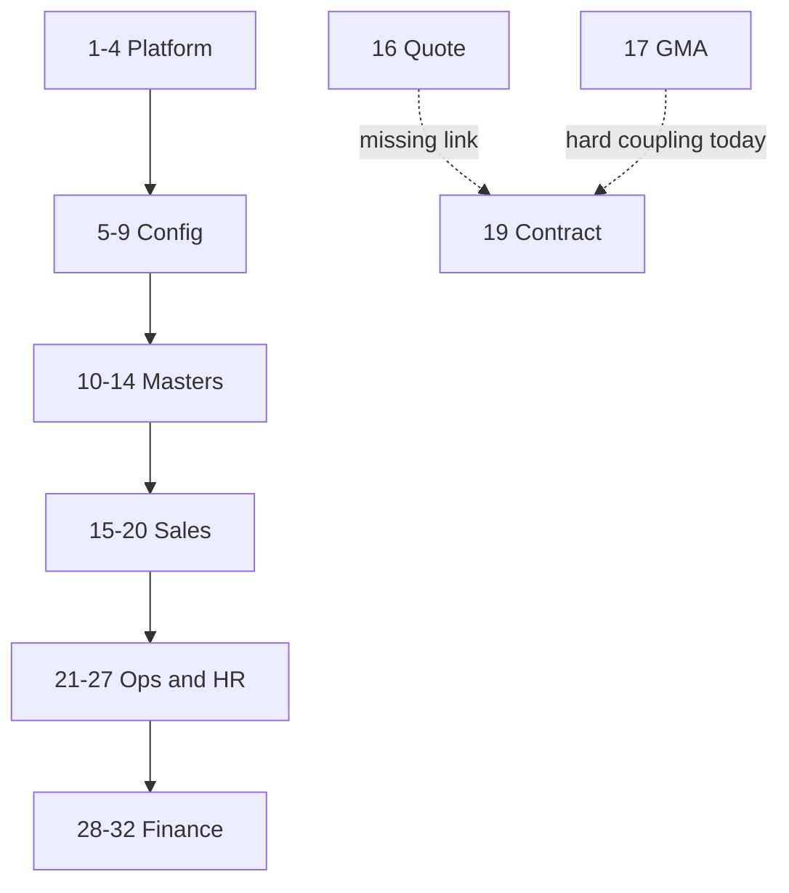
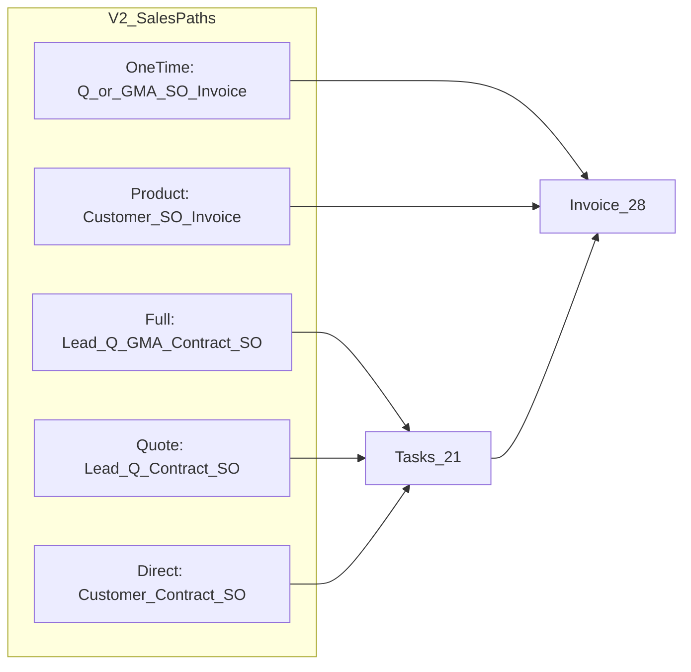
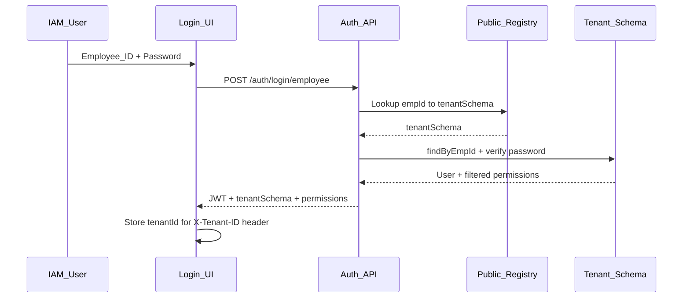
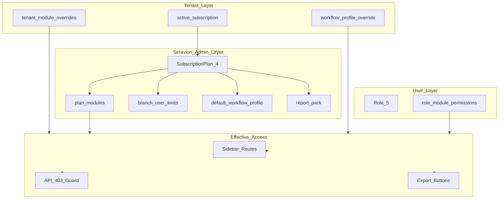
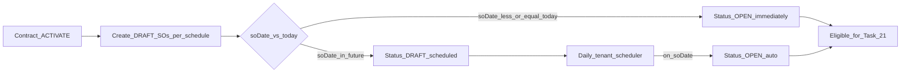
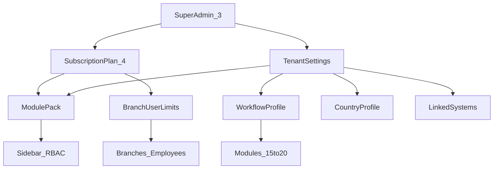
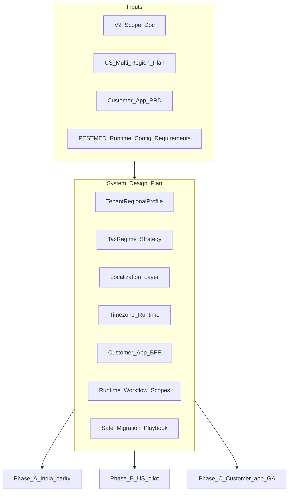

# Seravion ERP — Version 2 Scope (Modules 1–32)

---

## Table of Contents

1. [Executive Summary](#1-executive-summary)
2. [How to Read This Document](#2-how-to-read-this-document)
3. [System Layers & End-to-End Flow](#3-system-layers--end-to-end-flow)
4. [Cross-Cutting V2 Themes](#4-cross-cutting-v2-themes)
   - [4.6 RBAC Export & Download](#46-rbac-export--download-governance)
   - [4.7 IAM Employee-ID Login](#47-iam-employee-id-login-no-account-id)
   - [4.8 CEO Reports Hub](#48-ceo-reports--analytics-p2)
   - [4.9 Tenant Module Subscriptions](#49-tenant-module-subscriptions--dynamic-access)
   - [4.10 Contract SO Auto-open](#410-contract-activated-so-auto-open-scheduled-date)
5. [Super Admin V2 — Dedicated Section](#5-super-admin-v2--dedicated-section)
6. [Module-by-Module Scope (1–32)](#6-module-by-module-scope-132)
7. [Critical Loopholes & Business Risk Register](#7-critical-loopholes--business-risk-register)
8. [Recommended Rollout Phases](#8-recommended-rollout-phases)
9. [Appendix: Dependency Matrix](#9-appendix-dependency-matrix)
10. [Additional Scope — Global Support Version (System Design)](#10-additional-scope--global-support-version-system-design)

---

## 1. Executive Summary

Seravion ERP is a **multi-tenant pest-control and field-service ERP** with 32 product modules organized in six layers: Platform, Configuration, Operational Masters, Sales Pipeline, Operations & HR, and Finance.

**What works today:** Core backend APIs exist for most modules. Company onboarding, subscription purchase, role-based access, inventory, sales pipeline (leads through sales orders), field tasks, HRM, and finance (invoices through chart of accounts) are largely implemented.

**Why Version 2 is needed:**

| Problem                                                                                                                     | Business effect                                                                            |
| --------------------------------------------------------------------------------------------------------------------------- | ------------------------------------------------------------------------------------------ |
| **Tight module coupling** — Contracts require GMA; quotations cannot convert to contracts                                   | Tenants with simpler sales models cannot use the system without workarounds or bulk import |
| **Manual SO release after contract activation** — Draft SOs require manual "Release to OPEN" even when service date arrives | Ops delay; missed visits; dispatch team bottleneck                                         |
| **Super Admin gaps** — No per-tenant module toggles, subscription limits not enforced, reports stubbed                      | Platform cannot control what each client sees or pays for                                  |
| **Spec vs implementation drift** — Finance dashboards, stock filters, invoice routes                                        | Users hit broken screens and re-enter data                                                 |
| **No workflow flexibility** — One hardcoded sales path (Lead → Quote → GMA → Contract)                                      | Poor fit for product-only, quote-only, or direct-contract tenants                          |
| **Platform services missing** — Events, notifications, regional profiles largely backlog                                    | Missed approvals, SLA breaches, blocked international rollout                              |
| **RBAC export gaps** — EXPORT action exists but DOWNLOAD removed from DB; many screens lack `canExport` gates               | Unauthorized exports; inconsistent download buttons                                        |
| **IAM login friction** — Field staff must know Account ID (tenant schema) + email                                           | Technicians cannot log in easily; support burden                                           |
| **No CEO reports hub** — Exports scattered per module; no plan-level report pack                                            | CEOs cannot get month-end critical-module reports in one place                             |
| **No module subscription model** — Plans have pricing only, not module packs                                                | Cannot sell CRM-only or Finance-only tiers                                                 |

**V2 goal:** Make the ERP **configurable per tenant**, **decouple optional modules**, **complete Super Admin controls**, and **close critical loopholes** — without rebuilding from scratch.

**Canonical module specs:** `seravion-connect-backend/Module1-10.md`, `Module11-20.md`, `Module21-onwards.md`

**Beyond V2 Phases 1–3:** See [§10 Additional Scope — Global Support Version](#10-additional-scope--global-support-version-system-design) for multi-country, Customer app, localization, time zones, safe migration, and **PESTMED user** runtime flow configuration.

---

## 2. How to Read This Document

### Priority labels

| Label  | Meaning                                                  |
| ------ | -------------------------------------------------------- |
| **P0** | Blocks revenue, compliance, or core workflow — fix first |
| **P1** | Important for usability and scale — fix in Phase 2       |
| **P2** | Polish, analytics, nice-to-have — Phase 3                |

### Rollout phases

| Phase       | Focus                                                                    |
| ----------- | ------------------------------------------------------------------------ |
| **Phase 1** | Foundation — decoupling, Super Admin controls, critical bugs             |
| **Phase 2** | Workflow platform — notifications, stock/finance alignment, integrations |
| **Phase 3** | Scale — multi-region, e-invoice, exports, mobile, analytics              |

### Dependency notation (Appendix)

| Symbol | Meaning                                                      |
| ------ | ------------------------------------------------------------ |
| **H**  | Hard dependency — downstream module blocked without upstream |
| **S**  | Soft dependency — optional or alternate path exists          |
| **—**  | Independent                                                  |

### Per-module template

Each module section includes: **Purpose**, **Current workflow**, **Depends on**, **Used by**, **Gaps**, **V2 fixes**, **Super Admin / tenant config**, **Business impact**, **Priority**.

---

## 3. System Layers & End-to-End Flow

### 3.1 Six layers

```
Layer 1: Platform & Auth        → Modules  1–4
Layer 2: System Configuration   → Modules  5–9
Layer 3: Operational Masters    → Modules 10–14
Layer 4: Sales Pipeline         → Modules 15–20
Layer 5: Operations & HR        → Modules 21–27
Layer 6: Finance & Accounts     → Modules 28–32
```

### 3.2 Architecture diagram



Module numbers match §3.1. Sales layer detail: Lead → Quote → GMA → Contract → SO (V2 adds optional paths in §4.1).

### 3.3 Intended happy path (pest-control tenant, today)

```
Signup → Company docs → Seravion approval → Subscription purchase → Tenant provisioned
  → Setup: Roles, Branches, Tax, Products, Services, Employees
  → Sales: Lead → Follow-up → Quotation → GMA (approve) → Contract (activate) → Draft SOs generated
  → V2: SOs auto-open on scheduled date (no manual release) → Tasks scheduled → Materials from stock → Completion report
  → Finance: Invoice from SO → Payment receipt → Ledger updated
```

### 3.4 V2 target — multiple valid sales paths



---

## 4. Cross-Cutting V2 Themes

### 4.1 Tenant Workflow Profile (flagship decoupling)

**Problem:** Contract creation always requires an approved, unconsumed GMA sheet. Database column `contracts.gma_sheet_id` is NOT NULL. Tenants who do not use margin worksheets cannot create contracts through the product UI.

**V2 solution:** Introduce a **Tenant Workflow Profile** — configurable at Super Admin (default per plan) and overridable per tenant.

| Workflow mode               | Path                                                | Modules              |
| --------------------------- | --------------------------------------------------- | -------------------- |
| Full pest-control (default) | Lead → Quote → GMA → Contract → SO → Task → Invoice | 15→16→17→19→20→21→28 |
| Quote-to-contract           | Lead → Quote → Contract (skip GMA)                  | 15→16→19→20          |
| Direct contract             | Customer → Contract (manual sites/pricing)          | 18→19→20             |
| One-time only               | Quote or GMA → SO → Invoice (no contract)           | 16/17→20→28          |
| Product-only                | Customer → SO (product) → Invoice                   | 18→20→28             |

**Implementation outline:**

| Layer       | Change                                                                                                                              |
| ----------- | ----------------------------------------------------------------------------------------------------------------------------------- |
| Data        | `tenant_workflow_settings` table or extend company profile                                                                          |
| Flags       | `gma_required_for_contract`, `quotation_to_contract_enabled`, `direct_contract_enabled`, `default_sales_path`, `gma_module_enabled` |
| Backend     | Nullable `gma_sheet_id` when direct mode; alternate validation in `ContractServiceImpl`                                             |
| Frontend    | Hide GMA nav when off; "Create Contract" CTAs on Quote, GMA, Customer screens                                                       |
| Super Admin | Set defaults per subscription plan + per-tenant override                                                                            |

**Technical reference:** `ContractServiceImpl.java`, `ContractGmaConsolidationService.java`, `AddContract.jsx`, `ContractList.jsx`

---

### 4.2 Module packs & per-tenant toggles (summary)

**Today:** Global module catalog (`GET /api/v1/modules`) + role permissions. All tenants see the same module list in RBAC; sidebar hides by permission only. Subscription plans define pricing and branch/technician counts only — **no module list**.

**V2:** Subscription plan defines a **module pack**. Super Admin can enable/disable modules per tenant. Disabled modules: hidden from sidebar, APIs return 403 with clear message, downstream screens do not reference them.

**Full architecture, data model, Seravion Admin playbook, and runtime rules:** see [§4.9 Tenant Module Subscriptions & Dynamic Access](#49-tenant-module-subscriptions--dynamic-access).

**Affected:** Modules 3, 4, 5, all sidebar entries.

**Priority:** P0 — Phase 1

---

### 4.3 Events, notifications & exports platform

**Today:** Spec exists in `Implementation_PLan_for_events_notifications_exports.md` (v2.0, Apr 2026). In-app bell, WebSocket delivery, and most auto-events are **not built**.

**V2:**

| System               | Trigger                                                  | Delivery                |
| -------------------- | -------------------------------------------------------- | ----------------------- |
| System notifications | Status changes, approvals, escalations                   | In-app bell (WebSocket) |
| External sends       | User clicks Send (quotation, invoice, contract, receipt) | Email / WhatsApp        |

**Priority:** P1 — Phase 2 (approvals P0 for GMA, PO, stock requests)

---

### 4.4 Regional & multi-currency profile

**Today:** India-centric — GST, ₹, `country = "India"` defaults on entities, hardcoded 40% GMA auto-approve.

**V2 backlog** (from `us_multi-region_rollout` plan):

- `country_code` at Super Admin company approval
- Regional tax regime (`IN_GST`, `US_SALES_TAX`, etc.)
- `formatMoney` / address labels by region
- Timezone per tenant for schedulers and PDFs

**Priority:** P2 — Phase 3 (except `country_code` at approval: P1)

---

### 4.5 Branch scope consistency

**Today:** GMA dropdown is branch-scoped; contract `createEligibility` is tenant-wide. Users may see "Create Contract" enabled but empty GMA list.

**V2:** Single scope rule applied to eligibility, dropdowns, and list filters across modules 11, 15–20, 21, 28.

**Priority:** P0 — Phase 1

---

### 4.6 RBAC Export & Download Governance

**Problem:** Export and download permissions are inconsistent across the stack. The events/notifications spec documents per-screen export endpoints, but there is no unified RBAC policy tying UI buttons, role configuration, and backend guards together.

#### Current state

| Layer               | Status                                                                                                                                                                                                                    |
| ------------------- | ------------------------------------------------------------------------------------------------------------------------------------------------------------------------------------------------------------------------- |
| **DB actions**      | `EXPORT` exists in `public.actions`; `DOWNLOAD` was **removed** via `V17__remove_download_action_public.sql` and `V77__remove_download_action_tenant.sql`                                                                 |
| **Frontend RBAC**   | `rbac.js` defines both `EXPORT` and `DOWNLOAD`; `useRbac()` exposes `canExport` / `canDownload`                                                                                                                           |
| **Role UI**         | `CreateRoleModal.jsx` and `AddRoleModal.jsx` show EXPORT in matrix but **hide DOWNLOAD**                                                                                                                                  |
| **Backend**         | Many controllers use `@PreAuthorize("..._EXPORT")` (Invoicing, Contract, GMA, Ledger, Stock, Bills, COA, Vendor, HRM, Petty Cash, Sales Order, Customer)                                                                  |
| **Frontend wiring** | Only ~10 pages gate exports with `canExport` (Invoices, Bills, Ledger, Payment, COA, Quotation, SO list). GMA, Contract (`ViewContract.jsx` Export CSV), Customer, Stock, HRM lack checks or show buttons unconditionally |
| **Some pages**      | Still check `RBAC_ACTION.DOWNLOAD` as fallback (Quotation, SO list) though DOWNLOAD is not in DB                                                                                                                          |

#### V2 policy (single rule)

```
effective_export(M) = tenant_module_enabled(M)
                     AND role.permission(M, EXPORT)
                     AND (CEO report hub only) plan.report_pack.includes(M)
```

**Collapse DOWNLOAD into EXPORT:** All file downloads (PDF, uploaded invoice copy) and data exports (CSV, Excel, Tally) use the single `MODULE_MANAGEMENT_EXPORT` authority. Remove `DOWNLOAD` from `rbac.js` and frontend fallback checks.

#### Module × export matrix

| RBAC module                  | Product module | Example exports                         | Backend `@PreAuthorize` | Frontend `canExport` today | V2 action                                 |
| ---------------------------- | -------------- | --------------------------------------- | ----------------------- | -------------------------- | ----------------------------------------- |
| INVOICE_MANAGEMENT           | 28             | PDF, Tally CSV                          | Yes                     | Partial                    | Wire list/detail/toolbar; dashboard batch |
| BILLS_MANAGEMENT             | 29             | Bill PDF                                | Yes                     | Partial                    | Complete ViewBills gates                  |
| CONTRACT_MANAGEMENT          | 19             | CSV, PDF, execution log                 | Yes                     | **No** on ViewContract     | Gate Export CSV + PDF                     |
| GMA_SHEET_MANAGEMENT         | 17             | Sheet PDF                               | Yes                     | **No**                     | Add canExport on list/detail              |
| QUOTATION_MANAGEMENT         | 16             | Quote PDF                               | Yes                     | Yes                        | Remove DOWNLOAD fallback                  |
| SALES_ORDER_MANAGEMENT       | 20             | SO PDF/export                           | Yes                     | Partial                    | Standardize on EXPORT only                |
| CUSTOMER_CONTRACT_MANAGEMENT | 18             | Service history Excel                   | Yes                     | **No**                     | Gate customer tab export                  |
| STOCK_MANAGEMENT             | 11             | Dashboard export, invoice file download | Yes                     | **No**                     | Add export gates                          |
| LEDGER_MANAGEMENT            | 31             | Statement, ageing Excel/PDF             | Yes                     | Yes                        | Email statement = external send           |
| CHART_OF_ACCOUNTS_MANAGEMENT | 32             | COA CSV                                 | Yes                     | Partial                    | Complete dashboard export                 |
| VENDOR_MANAGEMENT            | 13             | Vendor list export                      | Yes                     | **No**                     | Add if UI button added                    |
| EMPLOYEE_USER_MANAGEMENT     | 8              | Employee export                         | Yes                     | **No**                     | Add for HR reports                        |
| HRM_MANAGEMENT               | 25             | Payroll summary, payslip                | Yes                     | **No**                     | Tie to §4.8 report pack                   |
| PETTY_CASH_MANAGEMENT        | 24             | Expenses Excel                          | Yes                     | **No**                     | Add on list tabs                          |
| LEADS_MANAGEMENT             | 15             | Pipeline export                         | Spec / backlog          | **No**                     | Add with CEO reports hub                  |
| TASK_MANAGEMENT              | 21             | Task completion export                  | Spec / backlog          | **No**                     | Add with CEO reports hub                  |
| PAYMENT_MANAGEMENT           | 30             | Voucher PDF                             | Partial (no PDF route)  | Partial                    | PDF route + EXPORT gate                   |

#### Role Management (Module 5) V2 fixes

- Show **EXPORT** column for every module **in the tenant's subscription pack** (see §4.9).
- Grey out EXPORT (and entire row) for modules not subscribed — cannot assign permission for unavailable module.
- Super Admin role templates: CEO = EXPORT on all plan modules; Technician = READ only (no EXPORT); Branch Manager = EXPORT on assigned modules only.
- At login, JWT permissions list excludes EXPORT for modules where `effective_module(M) = false`.

**Priority:** P1 — Phase 2 (align with export button wiring across modules)

**Technical reference:** `rbac.js`, `CreateRoleModal.jsx`, `AddRoleModal.jsx`, `Implementation_PLan_for_events_notifications_exports.md`

---

### 4.7 IAM Employee-ID Login (No Account ID)

**Problem:** IAM (field employee) login requires **Account ID** (tenant schema name) + Email/Username + Password. Technicians do not know their tenant schema; support teams must hand out Account IDs manually.

#### Current state

| Component             | Behavior                                                               |
| --------------------- | ---------------------------------------------------------------------- |
| **Login UI**          | `Login.jsx` — IAM tab fields: Account ID, Email/Username, Password     |
| **API**               | `POST /api/v1/auth/login` + mandatory `X-Tenant-ID` header             |
| **TenantAuthService** | Resolves user via `findByUsernameOrEmail` only — **not** `findByEmpId` |
| **User entity**       | `empId` exists; `UserRepository.findByEmpId` exists but unused in auth |

#### V2 design



| Approach            | Login input                         | Resolution                                                                                                             |
| ------------------- | ----------------------------------- | ---------------------------------------------------------------------------------------------------------------------- |
| **A (recommended)** | Employee ID + Password              | Public `iam_login_index(emp_id, company_id)` → `target_schema`; empId unique per tenant, globally resolvable via index |
| **B (fallback)**    | Employee ID + Account ID + Password | Account ID optional; if omitted, use A                                                                                 |

#### V2 scope items

| Layer                  | Change                                                                                                                        |
| ---------------------- | ----------------------------------------------------------------------------------------------------------------------------- |
| **Data**               | New public table `iam_login_index` (`emp_id`, `company_id`, `tenant_schema`, `user_id`) — populated on employee create/update |
| **Backend**            | New endpoint `POST /api/v1/auth/login/employee` with `{ empId, password }`; no `X-Tenant-ID` required on request              |
| **Backend**            | Extend `TenantAuthService` to resolve by `empId`; generic error message ("Invalid credentials") to prevent tenant enumeration |
| **Frontend**           | Replace "Account ID" field with "Employee ID" on IAM tab; help text: "Your Employee ID is on your payslip or ID card"         |
| **Frontend**           | Store resolved `tenantSchema` in `localStorage.tenantId` after login (unchanged API behavior post-login)                      |
| **Security**           | Rate limiting on employee login endpoint; lockout policy same as email login                                                  |
| **Mobile (Module 33)** | Same employee-ID login for technician app                                                                                     |

**Priority:** P0 — Phase 1

**Technical reference:** `Login.jsx`, `TenantAuthService.java`, `UserRepository.java`, `global_user` / `tenant_registry`

---

### 4.8 CEO Reports & Analytics (P2)

**Problem:** CEOs need downloadable reports across critical business modules for month-end review. Today exports exist per module (scattered buttons, inconsistent RBAC) and Super Admin `/seravionadmin/reports` is a stub. There is no consolidated **Reports hub** for tenant CEOs.

**Distinction from §4.6:** §4.6 governs per-screen export buttons and RBAC. §4.8 defines a **consolidated CEO Reports hub** and **plan-level report packs** configured by Seravion Admin.

#### Critical modules — default CEO report pack

Included by default on Professional / Enterprise plans (configurable per plan in §4.9):

| Product module | Report name                                     | Format     | RBAC authority                  |
| -------------- | ----------------------------------------------- | ---------- | ------------------------------- |
| 15 Leads       | Pipeline summary (open / qualified / converted) | Excel      | `LEADS_MANAGEMENT_EXPORT`       |
| 16 Quotation   | Open / won / lost quotations                    | Excel      | `QUOTATION_MANAGEMENT_EXPORT`   |
| 17 GMA         | Approved vs pending margin analysis             | Excel      | `GMA_SHEET_MANAGEMENT_EXPORT`   |
| 19 Contract    | Active / expiring contracts                     | Excel, PDF | `CONTRACT_MANAGEMENT_EXPORT`    |
| 20 Sales Order | Execution status by branch                      | Excel      | `SALES_ORDER_MANAGEMENT_EXPORT` |
| 21 Tasks       | Completion / overdue by technician              | Excel      | `TASK_MANAGEMENT_EXPORT`        |
| 28 Invoices    | Receivables ageing                              | Excel, PDF | `INVOICE_MANAGEMENT_EXPORT`     |
| 29 Bills       | Payables summary                                | Excel      | `BILLS_MANAGEMENT_EXPORT`       |
| 31 Ledger      | Ageing report (AR/AP)                           | Excel, PDF | `LEDGER_MANAGEMENT_EXPORT`      |
| 25 HRM         | Payroll summary by period                       | Excel      | `HRM_MANAGEMENT_EXPORT`         |

#### V2 UX — tenant Reports hub

| Feature               | Detail                                                                                     |
| --------------------- | ------------------------------------------------------------------------------------------ |
| **Route**             | `/reports` in tenant app (sidebar under Finance or top-level for CEO)                      |
| **Access**            | CEO + roles with new `REPORTS_READ` permission (or CEO role always)                        |
| **Visibility rule**   | Report card shown = subscribed module AND role has EXPORT AND module in plan `report_pack` |
| **Per-report action** | Download with date range + branch filter                                                   |
| **Batch export**      | "Export all month-end reports" — async job; in-app notification when ZIP ready             |
| **Super Admin**       | Configure `report_pack` checklist per subscription plan (§4.9 Step 1)                      |

#### Super Admin platform reports (separate)

| Audience       | Route                    | Content                                                                      |
| -------------- | ------------------------ | ---------------------------------------------------------------------------- |
| Seravion Admin | `/seravionadmin/reports` | Cross-tenant: active subscriptions, module adoption, overdue trials, revenue |
| Tenant CEO     | `/reports`               | Single-tenant operational and finance reports (table above)                  |

**Priority:** P2 — Phase 3

**Technical reference:** `Implementation_PLan_for_events_notifications_exports.md`, Module 3 Super Admin reports, Modules 28–31 finance exports

---

### 4.9 Tenant Module Subscriptions & Dynamic Access

This section is the **full model** for how Seravion Admin controls what each tenant can see and use. §4.2 is a summary; implement against this section.

#### 4.9.1 Three layers of access control



**Formulas:**

```
effective_module(M) = plan.includes(M)
                   AND tenant_override(M) != DISABLED
                   AND (workflow_profile requires M OR M is not workflow-gated)

visible_action(M, A) = effective_module(M) AND role.permission(M, A)
```

Example: GMA module (17) is `effective_module = false` when plan excludes it OR tenant override DISABLED OR workflow profile sets `gma_module_enabled = false`. Role permissions for GMA are ignored when module is not effective.

#### 4.9.2 Target data model (V2)

| Table                       | Schema | Purpose                                                                         |
| --------------------------- | ------ | ------------------------------------------------------------------------------- |
| `subscription_plans`        | public | Existing — add `tier_code`, `report_pack_json`, `default_workflow_profile_json` |
| `subscription_plan_modules` | public | **NEW** — `plan_id`, `module_id`, `included` (bool)                             |
| `tenant_subscriptions`      | public | Existing — links `company_id` to active `plan_id`                               |
| `tenant_module_overrides`   | public | **NEW** — `company_id`, `module_id`, `state` (ENABLED / DISABLED / INHERITED)   |
| `tenant_workflow_settings`  | public | **NEW** — GMA required, direct contract, default sales path (extends §4.1)      |
| `iam_login_index`           | public | **NEW** — empId → tenant resolution (§4.7)                                      |
| `modules`                   | public | Existing — add `layer` (1–6), `is_core` (bool)                                  |
| `role_permissions`          | tenant | Existing — filtered at login by `effective_module()`                            |

#### 4.9.3 Core vs optional modules

**Core (always on, not sellable):**

| Module                      | Reason                |
| --------------------------- | --------------------- |
| 1 Authentication            | Entry point           |
| 2 Onboarding (CEO)          | Company setup         |
| 27 User Profile             | Every user            |
| 5 Role Management (minimal) | CEO must assign roles |
| 7 Branch (at least 1)       | Tenant structure      |

**Optional (sellable in packs):**

| Pack name   | Product modules | Typical buyer           |
| ----------- | --------------- | ----------------------- |
| CRM Basic   | 15, 16, 18      | Inside sales only       |
| CRM Pro     | 15–20           | Full pest-control sales |
| Operations  | 11, 12, 21, 22  | Field service           |
| Finance     | 28–32           | Accounts team           |
| HRM         | 6, 8, 25, 26    | HR department           |
| Procurement | 10, 13, 14, 11  | Inventory-heavy         |
| Support     | 23              | Customer service desk   |
| Petty Cash  | 24              | Field expense tracking  |

Plans can combine packs (e.g. CRM Pro + Operations + Finance = full ERP).

#### 4.9.4 Seravion Admin — configuration playbook

**Step 1 — Create subscription plan** (`/seravionadmin/subscription-plans`)

1. Set plan name, pricing, `branch_count`, `technician_count`, duration.
2. **Module pack checklist** — all optional modules grouped by layer/pack; check included modules.
3. **Default workflow profile** — Full pest-control / Quote-to-contract / Direct contract / One-time / Product-only (§4.1).
4. **Report pack checklist** — which CEO reports (§4.8) are included.
5. Save → writes `subscription_plan_modules` and `report_pack_json`.

**Step 2 — Approve company** (`/seravionadmin/company-management/details`)

1. Approve / reject / trial; document verification (existing).
2. **Assign plan** — or confirm plan CEO will purchase.
3. **Country code** / regional profile.
4. **Per-tenant module overrides** — e.g. disable GMA for this client while keeping CRM Pro pack.
5. **Workflow profile override** — e.g. `gma_required_for_contract = false`.
6. On approve + trial → provision tenant schema; seed CEO; apply plan module visibility.

**Step 3 — Tenant settings** (new screen: `/seravionadmin/company-management/settings?companyId=`)

1. View **effective modules** = plan modules ± overrides.
2. Toggle override per module (cannot ENABLE module not in plan — show "Upgrade plan").
3. View usage vs limits: branches, users, technicians.
4. Edit workflow profile override.
5. Phase 3: linked systems (Razorpay, SMTP, e-invoice).

**Step 4 — Role templates** (`/seravionadmin/role-management`)

1. Permission matrix shows **only modules in selected plan preview** (or full catalog with greyed unsubscribed).
2. EXPORT column per module (§4.6).
3. Seed templates: CEO (all plan modules), Branch Manager, Technician, Accountant.

**Step 5 — CEO subscription purchase** (Module 2, `/subscription`)

1. CEO sees plans with **module list preview**: "Includes: CRM Pro + Operations".
2. Payment success → `tenant_subscriptions` active → refresh effective modules **without re-provisioning schema**.
3. Downgrade: modules disabled at period end; data retained read-only or hidden per policy.

#### 4.9.5 Runtime behavior (engineering)

| Layer               | V2 behavior                                                                                              |
| ------------------- | -------------------------------------------------------------------------------------------------------- |
| **Login**           | `PermissionQueryService.getGroupedPermissions()` filters out modules where `effective_module(M) = false` |
| **Sidebar**         | `Sidebar.jsx` — hide nav item if module not effective OR user lacks READ                                 |
| **Routes**          | `ProtectedRoute` + new `ModuleEnabledGuard` — redirect to dashboard with upgrade banner                  |
| **API**             | `@RequiresModule("GMA_SHEET_MANAGEMENT")` or servlet filter → 403 `{ code: "MODULE_NOT_SUBSCRIBED" }`    |
| **Role editor**     | CEO `/role-configuration` — matrix rows limited to effective modules                                     |
| **Upgrade CTA**     | Banner: "Finance module not in your plan — contact Seravion to upgrade"                                  |
| **Super Admin API** | `GET/PUT /api/v1/super-admin/tenants/{companyId}/modules` for overrides                                  |

#### 4.9.6 Dynamic access resolution example

Tenant "Acme Pest" on **CRM Basic** plan (modules 15, 16, 18) with override DISABLED on GMA (not in plan anyway):

| User role  | Sees in sidebar                           | Can API-call                |
| ---------- | ----------------------------------------- | --------------------------- |
| CEO        | Leads, Quotation, Customer, Setup modules | Same                        |
| Sales exec | Leads, Quotation, Customer                | Same (per role permissions) |
| Technician | Profile only (no Operations pack)         | 403 on Tasks                |

CEO upgrades to **CRM Pro + Operations** → modules 17–21 appear after subscription refresh; roles must be re-checked for new module permissions.

**Priority:** P0 — Phase 1 (foundation for all other V2 tenant configuration)

---

### 4.10 Contract-activated SO auto-open (scheduled date)

**Problem:** When a contract is **activated**, the system creates **DRAFT** sales orders per the contract payment / service schedule (`ContractSoDraftService.createAllDraftSalesOrders` on `onContractActivated`). Today, operations staff must still **manually release** each SO to `OPEN` via the UI ("Release to OPEN" on `SalesOrderDetail.jsx` / `AddSalesOrder.jsx`) before tasks can be scheduled — even when the SO service date has arrived.

A daily backend job exists (`SalesOrderStatusScheduler` → `autoReleaseDueDraftSalesOrders`) that moves `DRAFT` → `OPEN` when `soDate <= today`, but this is **not treated as a guaranteed product workflow**: the UI still prompts manual release, failures are logged silently, timezone is global (`Asia/Kolkata`), and users are unaware SOs will auto-open.

#### Intended V2 behavior (P0)



| Rule                     | Detail                                                                                                                               |
| ------------------------ | ------------------------------------------------------------------------------------------------------------------------------------ |
| **On contract activate** | Generate all period SOs as today; SOs whose `soDate` is today or in the past → **OPEN immediately** (no manual step)                 |
| **Future-dated SOs**     | Remain `DRAFT` until `soDate`; **auto-transition to OPEN** on that date — no manual "Release to OPEN"                                |
| **Scheduler**            | Per-tenant timezone (not single global TZ); idempotent; audit log + in-app notification on auto-open                                 |
| **UI**                   | Remove or hide manual release for **contract-generated** SOs; show badge: "Opens automatically on {date}" / "Open — ready for tasks" |
| **Contract tab**         | SO schedule shows: Scheduled (draft) → Open → In progress → Fulfilled                                                                |
| **Downstream**           | OPEN SOs eligible for task creation (Module 21) without ops intervention                                                             |

#### V2 implementation outline

| Layer        | Change                                                                                                                               |
| ------------ | ------------------------------------------------------------------------------------------------------------------------------------ |
| **Backend**  | On `onContractActivated`, after creating draft SOs, call `autoReleaseDueDraftSalesOrders(today)` for that contract's SOs immediately |
| **Backend**  | Harden `SalesOrderStatusScheduler` — tenant timezone, error alerting, notification `SO_AUTO_OPENED`                                  |
| **Frontend** | Contract SO schedule + SO detail: no primary "Release to OPEN" for `SERVICE_CONTRACT` type from contract                             |
| **Frontend** | Optional manual override: "Open now" (early release) for managers with `SALES_ORDER_MANAGEMENT_EDIT` only                            |
| **QA**       | AMC with monthly periods: activate contract → verify first SO open immediately; future SOs open on scheduled date without login      |

**Modules affected:** 19 (Contract), 20 (Sales Order), 21 (Task)

**Priority:** **P0 — Phase 1**

**Technical reference:** `ContractServiceImpl.onContractActivated`, `ContractSoDraftService.java`, `SalesOrderStatusScheduler.java`, `SalesOrderServiceImpl.autoReleaseDueDraftSalesOrders`, `releaseDraft`

---

## 5. Super Admin V2 — Dedicated Section

**Portal:** `/seravionadmin` — Company Management, Subscription Plans, Role Management, Reports (stub)

**Auth:** `SERAVION` role, `POST /api/v1/auth/root/login`, no `X-Tenant-ID` header

### 5.1 Implemented today

| Area                               | Status | Location                              |
| ---------------------------------- | ------ | ------------------------------------- |
| Company list & filters             | Done   | `Pages/SuperAdmin/CompanyManagement/` |
| Approve / reject / pending + trial | Done   | `CompanyDetailsPage.jsx`              |
| Document verification checkboxes   | Done   | Approval payload                      |
| Approved company read-only view    | Done   | `CompanyDetailsView.jsx`              |
| Subscription plans CRUD            | Done   | `Pages/SuperAdmin/SubscriptionPlans/` |
| Platform role templates            | Done   | `Pages/SuperAdmin/RoleManagement/`    |
| Tenant schema on approve + trial   | Done   | `CompanyManagementServiceImpl.java`   |

### 5.2 V2 must fix

| Item                       | Current state                                                       | V2 action                                                          | Priority |
| -------------------------- | ------------------------------------------------------------------- | ------------------------------------------------------------------ | -------- |
| Reports                    | `Reports Mock` in `Mainlayout.jsx`                                  | Real tenant analytics APIs + dashboard                             | P1       |
| Platform dashboard         | Orphaned mock JSON widgets                                          | Wire under `/seravionadmin/dashboard`                              | P1       |
| Per-tenant module toggles  | Spec only; no API/UI                                                | Enable/disable modules per tenant/plan                             | P0       |
| Subscription limits        | Documented; not enforced                                            | Block branch/user creation over plan limit                         | P0       |
| Trial provisioning         | Only `approve + enableTrial`; branch/tech counts ignored by backend | Persist limits; unify with subscription purchase                   | P0       |
| Role delete for Seravion   | Backend `DELETE` is CEO-only                                        | Allow SERAVION or hide delete in UI                                | P1       |
| Country / regional profile | Backlog                                                             | Set `country_code` at approval                                     | P1       |
| Linked systems panel       | None                                                                | Razorpay, SMTP, e-invoice gateway, WhatsApp credentials per tenant | P2       |
| Sidebar utilities          | Search, Support, Settings — no handlers                             | Implement or remove                                                | P2       |
| Tenant workflow profile UI | None                                                                | Configure sales path and GMA requirement                           | P0       |
| Module pack on plans       | Plans have pricing only                                             | Attach module list + limits to each plan                           | P0       |
| Tenant settings screen     | None                                                                | Post-approval module overrides, usage vs limits, workflow profile  | P0       |
| Report pack on plans       | None                                                                | Configure CEO report pack per plan (§4.8)                          | P2       |
| IAM login index            | None                                                                | Employee-ID login without Account ID (§4.7)                        | P0       |

### 5.3 Tenant settings screen (V2 — new)

**Route:** `/seravionadmin/company-management/settings?companyId={id}`

| Panel                | Purpose                                                                   |
| -------------------- | ------------------------------------------------------------------------- |
| **Subscription**     | Active plan, dates, branch/user/technician usage vs limits                |
| **Module pack**      | Effective modules (plan ± overrides); toggle DISABLED on optional modules |
| **Workflow profile** | Override GMA requirement, direct contract, default sales path             |
| **Regional**         | `country_code`, tax regime                                                |
| **Report pack**      | Which CEO reports included (read-only from plan; override in Phase 3)     |
| **Linked systems**   | Razorpay, SMTP, e-invoice (Phase 3)                                       |

Operators use this screen for post-provision adjustments without re-running approval. See §4.9.4 Step 3.

### 5.4 Super Admin config flow (V2 target)



### 5.5 What Super Admin configures that affects all modules

| Action                     | Downstream effect                                                      |
| -------------------------- | ---------------------------------------------------------------------- |
| Approve company            | CEO can complete onboarding and purchase subscription                  |
| Reject company             | Blocks progression                                                     |
| Enable trial + approve     | Provisions tenant DB schema, seeds CEO                                 |
| Verify documents           | KYC state visible to CEO (read-only)                                   |
| Create/edit plans          | Plans in CEO subscription UI; should define module pack + limits       |
| Create/edit platform roles | Template permissions for tenant users; drives sidebar and route guards |
| **V2:** Workflow profile   | Which sales paths (GMA required, direct contract, etc.)                |
| **V2:** Module toggles     | Which modules appear and accept API calls                              |
| **V2:** Regional profile   | Tax, currency, address validation for tenant                           |
| **V2:** Report pack        | Which CEO downloadable reports (§4.8) are included in plan             |
| **V2:** IAM login index    | Employee ID resolves to tenant on login (§4.7)                         |
| **V2:** EXPORT permissions | Filtered by subscribed modules (§4.6)                                  |

---

## 6. Module-by-Module Scope (1–32)

---

### Module 1 — Authentication

| Field                           | Detail                                                                                                                                                                                                                                  |
| ------------------------------- | --------------------------------------------------------------------------------------------------------------------------------------------------------------------------------------------------------------------------------------- |
| **Purpose**                     | Login and identity for Super Admin (Seravion), Company Admin (CEO), and IAM employees                                                                                                                                                   |
| **Current workflow**            | Seravion: root login. CEO: email/password → JWT includes `tenantSchema`. IAM: **Account ID** + email/username + password + `X-Tenant-ID` header                                                                                         |
| **Depends on**                  | — (entry point)                                                                                                                                                                                                                         |
| **Used by**                     | All modules                                                                                                                                                                                                                             |
| **Gaps**                        | IAM users must know tenant Account ID (schema name) — high friction for field staff; `empId` exists on user but not used for login; forgot-password flow needs E2E QA; regional signup not wired                                        |
| **V2 fixes**                    | **Employee-ID login** (§4.7): `POST /api/v1/auth/login/employee` with empId + password; public `iam_login_index`; replace Account ID field in IAM login UI; permissions filtered by §4.9 at login; refresh token hardening; MFA backlog |
| **Super Admin / tenant config** | Seravion root login unchanged; `iam_login_index` populated when employees created (Module 8)                                                                                                                                            |
| **Business impact**             | Field technicians cannot self-serve login; support cost; blocked daily operations                                                                                                                                                       |
| **Priority**                    | P0 (employee-ID login) — Phase 1; P1 (MFA, regional) — Phase 2/3                                                                                                                                                                        |

**Technical reference:** `modules/auth/`, `TenantAuthService.java`, `Login.jsx`, `authResponse.js`, `docs/forgot-password-flow.md`, §4.7

---

### Module 2 — User Onboarding

| Field                           | Detail                                                                                                                                                                    |
| ------------------------------- | ------------------------------------------------------------------------------------------------------------------------------------------------------------------------- |
| **Purpose**                     | Post-signup company profile, document upload, Seravion approval gate, subscription purchase                                                                               |
| **Current workflow**            | Signup → company information → documents → wait for approval → subscription → onboarding success → dashboard                                                              |
| **Depends on**                  | H: Module 1; S: Module 3 (approval), Module 4 (plans)                                                                                                                     |
| **Used by**                     | Module 3, 7 (first branch), 5 (CEO role)                                                                                                                                  |
| **Gaps**                        | Status machine can confuse users (pending docs vs approved vs subscription); US onboarding fields backlog; trial branch counts sent from UI but not persisted on approval |
| **V2 fixes**                    | Clear stepper with status badges; persist trial limits on approval; multi-country company form; redirect logic already in `apiServices` — align with backend states       |
| **Super Admin / tenant config** | Approval decision and trial dates set in Module 3                                                                                                                         |
| **Business impact**             | Stuck onboarding = no tenant revenue                                                                                                                                      |
| **Priority**                    | P0 (trial limits) — Phase 1; P1 (multi-country) — Phase 3                                                                                                                 |

**Technical reference:** `Pages/CompanyInformation/`, `CompanyDocuments/`, `Subscription/`, `modules/company/`, `subscriptionPurchase/`

---

### Module 3 — Super Admin (Seravion) Management

| Field                           | Detail                                                                                                                                                                                |
| ------------------------------- | ------------------------------------------------------------------------------------------------------------------------------------------------------------------------------------- |
| **Purpose**                     | Platform operator: tenant approval, subscription oversight, role templates                                                                                                            |
| **Current workflow**            | Login → company list → review docs → approve/reject/trial → view approved tenants; manage plans and roles                                                                             |
| **Depends on**                  | H: Module 1                                                                                                                                                                           |
| **Used by**                     | Module 2 (gates onboarding), Module 4, Module 5 (templates)                                                                                                                           |
| **Gaps**                        | Reports stub; no dashboard; no module toggles; no tenant settings screen; no workflow profile; no report pack config; role delete 403 for Seravion; sidebar mock utilities            |
| **V2 fixes**                    | See [Section 5](#5-super-admin-v2--dedicated-section) and §4.9; tenant settings screen; module pack + report pack on plans; platform analytics; CEO reports hub is tenant-side (§4.8) |
| **Super Admin / tenant config** | This module **is** the Super Admin surface                                                                                                                                            |
| **Business impact**             | Cannot govern tenant feature set or enforce plan limits                                                                                                                               |
| **Priority**                    | P0 — Phase 1                                                                                                                                                                          |

**Technical reference:** `Pages/SuperAdmin/`, `modules/superAdmin/`, `module-3-super-admin-management.md`

---

### Module 4 — Subscription Plans

| Field                           | Detail                                                                                                                                                                                                     |
| ------------------------------- | ---------------------------------------------------------------------------------------------------------------------------------------------------------------------------------------------------------- |
| **Purpose**                     | Seravion defines plans and pricing; CEOs purchase during onboarding                                                                                                                                        |
| **Current workflow**            | Super Admin creates plan → CEO selects plan → Razorpay payment → tenant provisioned (alternate path to trial approval)                                                                                     |
| **Depends on**                  | H: Module 3 (Seravion creates plans)                                                                                                                                                                       |
| **Used by**                     | Module 2, Module 7/8 (limits should apply)                                                                                                                                                                 |
| **Gaps**                        | Plans have pricing/limits only — no `subscription_plan_modules`; no report pack; no default workflow profile; expiry alerts not implemented; over-limit creation not blocked                               |
| **V2 fixes**                    | `subscription_plan_modules` table; module pack checklist UI; `report_pack_json`; `default_workflow_profile_json`; enforce limits on branch/employee create; CEO plan preview shows included modules (§4.9) |
| **Super Admin / tenant config** | Plans created here — module pack, report pack, workflow defaults (§4.9.4 Step 1)                                                                                                                           |
| **Business impact**             | Revenue leakage if limits not enforced                                                                                                                                                                     |
| **Priority**                    | P0 — Phase 1                                                                                                                                                                                               |

**Technical reference:** `Pages/SuperAdmin/SubscriptionPlans/`, `subscriptionPlan/`, `CompanySubscriptionServiceImpl.java`

---

### Module 5 — Role Management

| Field                           | Detail                                                                                                                                                                                                     |
| ------------------------------- | ---------------------------------------------------------------------------------------------------------------------------------------------------------------------------------------------------------- |
| **Purpose**                     | RBAC — role templates (Seravion) and client role customization (CEO)                                                                                                                                       |
| **Current workflow**            | Define role → assign module × action permissions → assign role to employees                                                                                                                                |
| **Depends on**                  | H: Module 1; S: global module catalog                                                                                                                                                                      |
| **Used by**                     | All modules (sidebar, `ProtectedRoute`, API `@PreAuthorize`)                                                                                                                                               |
| **Gaps**                        | Super Admin delete role blocked; permissions do not respect tenant module subscriptions; EXPORT shown for unsubscribed modules; DOWNLOAD removed from DB but still in frontend                             |
| **V2 fixes**                    | Permission matrix filtered by `effective_module()` (§4.9); EXPORT column per subscribed module only (§4.6); remove DOWNLOAD from `rbac.js`; fix Seravion delete API or hide action; clone-from-template UX |
| **Super Admin / tenant config** | Platform templates created here; matrix scoped to plan preview; CEO copies at `/role-configuration`                                                                                                        |
| **Business impact**             | Wrong permissions = data leaks; export access on unsubscribed modules                                                                                                                                      |
| **Priority**                    | P0 (module-aware matrix) — Phase 1; P1 (EXPORT wiring) — Phase 2                                                                                                                                           |

**Technical reference:** `rbac.js`, `rbacRouteMap.js`, `CreateRoleModal.jsx`, `AddRoleModal.jsx`, `RoleManagement/`, `RoleConfiguration/`, `modules/role/`, §4.6

---

### Module 6 — Role Salary & Leave Configuration

| Field                           | Detail                                                                                                 |
| ------------------------------- | ------------------------------------------------------------------------------------------------------ |
| **Purpose**                     | Role-wise salary structure, incentives, statutory deductions, leave policy                             |
| **Current workflow**            | Configure per role → defaults flow to new employees in Module 8 → used by Module 25 payroll            |
| **Depends on**                  | H: Module 5 (roles)                                                                                    |
| **Used by**                     | H: Module 8, S: Module 25                                                                              |
| **Gaps**                        | Employee hire without salary config can proceed with incomplete payroll data                           |
| **V2 fixes**                    | Validation warning/block on employee create if role has no compensation config; sync indicators in HRM |
| **Super Admin / tenant config** | None — tenant CEO configures                                                                           |
| **Business impact**             | Payroll errors, compliance risk                                                                        |
| **Priority**                    | P1 — Phase 2                                                                                           |

**Technical reference:** `Pages/SalaryLeaveConfig/`, `modules/rolecompensation/`

---

### Module 7 — Branch Management

| Field                           | Detail                                                                                         |
| ------------------------------- | ---------------------------------------------------------------------------------------------- |
| **Purpose**                     | Branch hierarchy, locations, contacts; place of supply for tax                                 |
| **Current workflow**            | CEO creates branches → used in stock, sales, tasks, finance filters                            |
| **Depends on**                  | H: Module 2 (tenant exists); S: Module 4 (limits)                                              |
| **Used by**                     | Modules 8, 11, 14, 15–21, 24, 28–31                                                            |
| **Gaps**                        | Subscription branch cap not enforced; branch scope inconsistency with GMA/contract eligibility |
| **V2 fixes**                    | Enforce `maxBranches` from plan; align branch filter behavior across CRM and ops               |
| **Super Admin / tenant config** | Limits set via plan; optional per-tenant override                                              |
| **Business impact**             | Over-provisioning; wrong tax jurisdiction                                                      |
| **Priority**                    | P0 — Phase 1                                                                                   |

**Technical reference:** `Pages/BranchManagement/`, `modules/branch/`

---

### Module 8 — Employee (Users) Management

| Field                           | Detail                                                                                                                 |
| ------------------------------- | ---------------------------------------------------------------------------------------------------------------------- |
| **Purpose**                     | Hiring workflow, employee lifecycle, role/salary/leave/branch assignment, documents                                    |
| **Current workflow**            | Hiring request (optional) → create employee → assign role, branch, compensation → active user can log in               |
| **Depends on**                  | H: Module 5, 7; S: Module 6                                                                                            |
| **Used by**                     | Modules 11, 21, 22, 24, 25, 26, 27                                                                                     |
| **Gaps**                        | User/technician limit not enforced; hiring → employee handoff incomplete in some paths; document expiry alerts missing |
| **V2 fixes**                    | Enforce plan user limits; complete hiring approval → employee create; expiry notifications                             |
| **Super Admin / tenant config** | `maxUsers` / `maxTechnicians` from plan                                                                                |
| **Business impact**             | Unauthorized headcount; field ops without valid technicians                                                            |
| **Priority**                    | P0 (limits) — Phase 1                                                                                                  |

**Technical reference:** `Pages/UserManagement/`, `modules/user/`, hiring request APIs

---

### Module 9 — Tax Management

| Field                           | Detail                                                                                                        |
| ------------------------------- | ------------------------------------------------------------------------------------------------------------- |
| **Purpose**                     | GST tax types, HSN/SAC codes and rates — prerequisite for products and billing                                |
| **Current workflow**            | Configure tax types → HSN master → products and line items reference HSN                                      |
| **Depends on**                  | H: Module 2 (tenant)                                                                                          |
| **Used by**                     | H: Modules 10, 14, 16, 20, 28, 29                                                                             |
| **Gaps**                        | India-only GST model; US sales tax backlog; HSN not always enforced before invoice save                       |
| **V2 fixes**                    | Regional tax regime adapter; mandatory HSN gate on billing lines; Super Admin sets default regime at approval |
| **Super Admin / tenant config** | `tax_regime` per tenant (V2)                                                                                  |
| **Business impact**             | Tax compliance failures; blocked international expansion                                                      |
| **Priority**                    | P1 (regional) — Phase 3; P0 (HSN gates) — Phase 2                                                             |

**Technical reference:** `Pages/Tax/`, `Pages/HSN/`, `modules/tax/`

---

### Module 10 — Inventory & Services (Product Master)

| Field                           | Detail                                                                                    |
| ------------------------------- | ----------------------------------------------------------------------------------------- |
| **Purpose**                     | Product catalog: categories, brands, HSN-linked pricing, variants                         |
| **Current workflow**            | Create product → link HSN → stock entries reference product → PO and SO lines use product |
| **Depends on**                  | H: Module 9 (HSN)                                                                         |
| **Used by**                     | H: Module 11, 14; S: Module 20 (product SO), 28                                           |
| **Gaps**                        | Product grouping UX incomplete; variant ↔ stock linkage gaps                              |
| **V2 fixes**                    | Complete grouping UI per `module-10-product-master-grouping.md`; variant stock tracking   |
| **Super Admin / tenant config** | Module pack toggle                                                                        |
| **Business impact**             | Wrong stock and pricing on orders                                                         |
| **Priority**                    | P1 — Phase 2                                                                              |

**Technical reference:** `Pages/ProductManagement/`, `docs/module-10-*.md`, `modules/InventoryProduct/`

---

### Module 11 — Stock Management

| Field                           | Detail                                                                                                                                   |
| ------------------------------- | ---------------------------------------------------------------------------------------------------------------------------------------- |
| **Purpose**                     | Multi-branch stock (assets, consumables, resell), requests, transfers, central stock                                                     |
| **Current workflow**            | Central stock entry → branch stock → requests → approve → transfer → assign assets to employees → task material consumption              |
| **Depends on**                  | H: Module 10, 7; S: Module 8 (asset assign)                                                                                              |
| **Used by**                     | H: Module 14 (receive), 21 (materials); S: Module 26                                                                                     |
| **Gaps**                        | Frontend/backend filter mismatches; asset ID preview not wired; some filter params unsupported — see `MODULE11_FRONTEND_BACKEND_GAPS.md` |
| **V2 fixes**                    | Close all documented gaps; asset preview button; approval notifications; task consumption posts back to stock                            |
| **Super Admin / tenant config** | Module pack toggle                                                                                                                       |
| **Business impact**             | Stockouts undetected; failed transfers; incorrect field inventory                                                                        |
| **Priority**                    | P1 — Phase 2                                                                                                                             |

**Technical reference:** `Pages/StockDashboard/`, `MODULE11_FRONTEND_BACKEND_GAPS.md`, `modules/stock/`

---

### Module 12 — Service Management

| Field                           | Detail                                                                                            |
| ------------------------------- | ------------------------------------------------------------------------------------------------- |
| **Purpose**                     | Pest-control service catalog, pricing models, chemicals, warranty/revisit policies                |
| **Current workflow**            | Define services and price types → used in quotations, GMA, SO, tasks                              |
| **Depends on**                  | S: Module 9                                                                                       |
| **Used by**                     | H: Modules 16, 17, 20, 21; S: Module 28                                                           |
| **Gaps**                        | Price-type rules (fixed, area-based, inspection, custom) not fully consumed in invoice line modal |
| **V2 fixes**                    | Shared pricing engine used by Quote, GMA, SO, Invoice; chemical catalog linked to GMA costing     |
| **Super Admin / tenant config** | Module pack toggle                                                                                |
| **Business impact**             | Manual repricing; margin errors                                                                   |
| **Priority**                    | P1 — Phase 2                                                                                      |

**Technical reference:** `Pages/Services/`, `docs/module-12-service-management-frontend-api.md`, `modules/serviceManagement/`

---

### Module 13 — Vendor Management

| Field                           | Detail                                                               |
| ------------------------------- | -------------------------------------------------------------------- |
| **Purpose**                     | Supplier/service-provider master, payment terms, product mapping     |
| **Current workflow**            | Create vendor → link products → PO and bills reference vendor        |
| **Depends on**                  | S: Module 9                                                          |
| **Used by**                     | H: Module 14, 29                                                     |
| **Gaps**                        | Payment terms not always defaulting on bill create                   |
| **V2 fixes**                    | Vendor payment terms → bill due date defaults; vendor GST validation |
| **Super Admin / tenant config** | Module pack toggle                                                   |
| **Business impact**             | AP delays; wrong payment scheduling                                  |
| **Priority**                    | P2 — Phase 2                                                         |

**Technical reference:** `Pages/Vendors/`, `modules/Vendor/`

---

### Module 14 — Purchase Order

| Field                           | Detail                                                                                          |
| ------------------------------- | ----------------------------------------------------------------------------------------------- |
| **Purpose**                     | Procurement: PO creation, approval, partial/full receipt via stock                              |
| **Current workflow**            | Create PO from vendor + products → approve → receive → stock updated → bill from PO (Module 29) |
| **Depends on**                  | H: Module 13, 10, 7; S: Module 9                                                                |
| **Used by**                     | H: Module 11 (receive), 29                                                                      |
| **Gaps**                        | Approval notifications missing; receive ↔ stock validation edge cases                           |
| **V2 fixes**                    | Events on submit/approve; enforce qty on receive; PO → bill one-click                           |
| **Super Admin / tenant config** | Module pack toggle                                                                              |
| **Business impact**             | Procurement delays; inventory mismatch                                                          |
| **Priority**                    | P1 — Phase 2                                                                                    |

**Technical reference:** `Pages/PurchaseOrders/`, `docs/module-14-purchase-order-api.md`, `modules/PurchaseOrder/`

---

### Module 15 — Leads & Follow-up Management

| Field                           | Detail                                                                                                                        |
| ------------------------------- | ----------------------------------------------------------------------------------------------------------------------------- |
| **Purpose**                     | Lead capture, follow-ups, qualification, conversion to quotation/GMA/customer                                                 |
| **Current workflow**            | Create lead → follow-ups → qualify → convert to customer and/or create quotation/GMA                                          |
| **Depends on**                  | S: Module 7 (branch)                                                                                                          |
| **Used by**                     | S: Modules 16, 17, 18                                                                                                         |
| **Gaps**                        | Conversion CTAs not always obvious; multiple paths without guided wizard                                                      |
| **V2 fixes**                    | "Next step" actions based on tenant workflow profile (Quote, GMA, or skip to Customer); follow-up reminders via notifications |
| **Super Admin / tenant config** | Workflow profile defines available conversion targets                                                                         |
| **Business impact**             | Lost leads; sales team confusion                                                                                              |
| **Priority**                    | P1 — Phase 2                                                                                                                  |

**Technical reference:** `Pages/LeadManagement/`, `modules/lead/`

---

### Module 16 — Quotation Management

| Field                           | Detail                                                                                                                 |
| ------------------------------- | ---------------------------------------------------------------------------------------------------------------------- |
| **Purpose**                     | Service/product quotations from leads, customers, or prospects                                                         |
| **Current workflow**            | Create quote → send → accept → **should** convert to contract or SO — **contract path missing**                        |
| **Depends on**                  | S: Modules 15, 18, 12, 9                                                                                               |
| **Used by**                     | S: Module 19 (spec only), H: Module 20 (one-time SO)                                                                   |
| **Gaps**                        | **Quotation → Contract not implemented** (`canConvertToContract` in mapper but no API/UI); send/resend email not wired |
| **V2 fixes**                    | `POST /quotations/{id}/convert-to-contract` when workflow allows; accept → SO; Send Quotation external email           |
| **Super Admin / tenant config** | `quotation_to_contract_enabled` in workflow profile                                                                    |
| **Business impact**             | Sales re-enters all data into GMA/contract — major time waste                                                          |
| **Priority**                    | P0 — Phase 1                                                                                                           |

**Technical reference:** `Pages/QuotationManagement/`, `docs/module-16-quotation-management.md`, `modules/quotation/`

---

### Module 17 — Gross Margin Analysis (GMA)

| Field                           | Detail                                                                                                                                                                                                       |
| ------------------------------- | ------------------------------------------------------------------------------------------------------------------------------------------------------------------------------------------------------------ |
| **Purpose**                     | Multi-site cost/margin sheets, chemical costing, GM% approval                                                                                                                                                |
| **Current workflow**            | Create GMA from lead/customer/new → submit → auto-approve if GM ≥ 40% else pending → manual approve → select in contract create                                                                              |
| **Depends on**                  | S: Modules 15, 18, 12, 7                                                                                                                                                                                     |
| **Used by**                     | H: Module 19 (today); S: Module 20 (one-time SO)                                                                                                                                                             |
| **Gaps**                        | **Mandatory for contracts** — no tenant opt-out; 40% threshold hardcoded; eligibility tenant-wide vs dropdown branch-scoped; no "Create Contract" on GMA detail; import tool consumes GMA on DRAFT unlike UI |
| **V2 fixes**                    | Optional per workflow profile; configurable GM threshold; fix scope alignment; shortcut to contract; align import rules                                                                                      |
| **Super Admin / tenant config** | `gma_module_enabled`, `gma_auto_approve_threshold_pct`, `gma_required_for_contract`                                                                                                                          |
| **Business impact**             | Non-GMA tenants cannot use contracts; false UX enablement                                                                                                                                                    |
| **Priority**                    | P0 — Phase 1                                                                                                                                                                                                 |

**Technical reference:** `Pages/GMAManagement/`, `GmaSheetServiceImpl.java`, `docs/module-17-gma-frontend-api.md`

---

### Module 18 — Customer Management

| Field                           | Detail                                                                                                                       |
| ------------------------------- | ---------------------------------------------------------------------------------------------------------------------------- |
| **Purpose**                     | Customer 360° master: sites, contracts, service history, GST/billing                                                         |
| **Current workflow**            | Create customer (or from lead) → sites → linked quotes, GMAs, contracts, SOs, invoices in tabs                               |
| **Depends on**                  | S: Module 7                                                                                                                  |
| **Used by**                     | H: Modules 16–20, 28; S: 21, 23                                                                                              |
| **Gaps**                        | Multi-GST per customer sites incomplete; draft customer flow; contract tab may show primary GMA only for multi-GMA contracts |
| **V2 fixes**                    | Multi-GST sites per `customer-module-multi-gst-analysis.md`; "Create Contract" CTA when direct mode; full multi-GMA display  |
| **Super Admin / tenant config** | Regional address validation                                                                                                  |
| **Business impact**             | Wrong billing GSTIN; incomplete customer view                                                                                |
| **Priority**                    | P1 — Phase 2                                                                                                                 |

**Technical reference:** `Pages/CustomerList/`, `docs/module-18-customer.md`, `modules/customer/`

---

### Module 19 — Contract Management

| Field                           | Detail                                                                                                                                                                                                                                                              |
| ------------------------------- | ------------------------------------------------------------------------------------------------------------------------------------------------------------------------------------------------------------------------------------------------------------------- |
| **Purpose**                     | Legal/SLA agreements from approved GMA (today); AMC and one-time contracts; generates SOs on activation                                                                                                                                                             |
| **Current workflow**            | Check eligibility → select approved GMA(s) → consolidate preview → create draft → activate → consume GMA → draft SOs created                                                                                                                                        |
| **Depends on**                  | H: Module 17 (today), 18; S: Module 16 (V2)                                                                                                                                                                                                                         |
| **Used by**                     | H: Module 20; S: 21, 28                                                                                                                                                                                                                                             |
| **Gaps**                        | GMA always required; no quotation source; multi-GMA draft activate may not consume all GMAs; eligibility API error enables create button; legacy mock routes; **draft SOs from activation stay DRAFT until manual release** despite scheduled service dates (§4.10) |
| **V2 fixes**                    | Direct contract (no GMA); quotation source; fix consumption bug; fail-closed eligibility; remove legacy routes; "Create Contract" from GMA/Quote views; **auto-open SOs on scheduled date — no manual release** (§4.10)                                             |
| **Super Admin / tenant config** | `direct_contract_enabled`, `gma_required_for_contract`                                                                                                                                                                                                              |
| **Business impact**             | **Highest coupling risk** for non-GMA tenants; **missed service visits** if ops forget to release draft SOs                                                                                                                                                         |
| **Priority**                    | P0 — Phase 1                                                                                                                                                                                                                                                        |

**Technical reference:** `Pages/ContractManagement/`, `ContractServiceImpl.java`, `docs/module-19-contract-management.md`

---

### Module 20 — Sales Order (SO) Management

| Field                           | Detail                                                                                                                                                                                                                                                  |
| ------------------------------- | ------------------------------------------------------------------------------------------------------------------------------------------------------------------------------------------------------------------------------------------------------- |
| **Purpose**                     | Revenue/operations document — contract-driven, one-time service, or product sale                                                                                                                                                                        |
| **Current workflow**            | Create SO: type = Service Contract (from active contract), One-Time (GMA or quotation), or Product Sale → confirm → drives tasks and invoicing                                                                                                          |
| **Depends on**                  | H: Module 18; conditional H: 19, 17, or 16 by type                                                                                                                                                                                                      |
| **Used by**                     | H: Module 21, 28; S: 18 (history)                                                                                                                                                                                                                       |
| **Gaps**                        | Source type UX can confuse; branch-scoped dropdowns inconsistent; linked one-time requires `gmaSheetId` or `quotationId`; **contract SOs require manual "Release to OPEN"** even when `soDate` has passed; scheduler exists but not productized (§4.10) |
| **V2 fixes**                    | Clear wizard by SO type; respect workflow profile; **P0: auto-open contract SOs on `soDate`** — immediate OPEN if date ≤ today on activation, scheduler for future dates; UI shows auto-open status; optional manager "Open now" override only (§4.10)  |
| **Super Admin / tenant config** | Workflow profile                                                                                                                                                                                                                                        |
| **Business impact**             | Manual release delays dispatch and task scheduling; revenue and SLA risk on AMC contracts                                                                                                                                                               |
| **Priority**                    | **P0** (auto-open on date) — Phase 1; P1 (UX polish) — Phase 2                                                                                                                                                                                          |

**Technical reference:** `Pages/SalesOrderManagement/`, `SalesOrderServiceImpl.java`, `docs/module-20-sales-order-management.md`

---

### Module 21 — Task Management

| Field                           | Detail                                                                                                                                                                                                              |
| ------------------------------- | ------------------------------------------------------------------------------------------------------------------------------------------------------------------------------------------------------------------- |
| **Purpose**                     | Technician scheduling, SO-driven tasks, re-tasks, completion and material logs                                                                                                                                      |
| **Current workflow**            | SO confirmed → tasks generated/scheduled → assign technician → execute → complete → materials logged → service report                                                                                               |
| **Depends on**                  | H: Module 20, 8, 7; S: 12, 11, 18                                                                                                                                                                                   |
| **Used by**                     | S: Modules 22, 25, 26, 28; H: 23 (convert ticket)                                                                                                                                                                   |
| **Gaps**                        | Material consumption → stock posting incomplete; service report PDF + customer send not fully wired; mobile sync gaps; **tasks blocked until ops manually releases contract SOs to OPEN** (§4.10)                   |
| **V2 fixes**                    | Stock deduction on completion; PDF + external send; notification on assign/reschedule; SLA link from Module 23; **depends on P0 auto-open SOs** so tasks can be scheduled on service date without manual SO release |
| **Super Admin / tenant config** | Module pack toggle                                                                                                                                                                                                  |
| **Business impact**             | Field ops disconnected from inventory; no customer proof of service                                                                                                                                                 |
| **Priority**                    | P1 — Phase 2                                                                                                                                                                                                        |

**Technical reference:** `Pages/TaskManagement/`, `docs/module-21-task-management.md`, `modules/taskManagement/`

---

### Module 22 — Live Location & Travel Tracking

| Field                           | Detail                                                                           |
| ------------------------------- | -------------------------------------------------------------------------------- |
| **Purpose**                     | Real-time GPS, travel logs, task-correlated field workforce visibility           |
| **Current workflow**            | Technician app sends GPS → fleet map → correlate with active tasks               |
| **Depends on**                  | S: Module 8, 21                                                                  |
| **Used by**                     | S: Module 26                                                                     |
| **Gaps**                        | Timezone uses system default in some paths; privacy/consent not documented in UI |
| **V2 fixes**                    | Tenant timezone; consent flow; idle vs on-task states                            |
| **Super Admin / tenant config** | Feature flag per plan                                                            |
| **Business impact**             | Dispatch inefficiency; compliance (location tracking)                            |
| **Priority**                    | P2 — Phase 3                                                                     |

**Technical reference:** `Pages/FleetTracking/`, `modules/liveTracking/`, mobile tracking APIs

---

### Module 23 — Customer Support (SLA-driven)

| Field                           | Detail                                                                             |
| ------------------------------- | ---------------------------------------------------------------------------------- |
| **Purpose**                     | Helpdesk tickets, SLA escalation, convert-to-task (re-service)                     |
| **Current workflow**            | Raise ticket → assign → work → resolve/close → optional convert to re-service task |
| **Depends on**                  | S: Module 8, 7, 18                                                                 |
| **Used by**                     | S: Module 21                                                                       |
| **Gaps**                        | SLA escalation notifications not built; convert-to-task UX polish                  |
| **V2 fixes**                    | Events platform for SLA breach; clear link to SO/task on convert                   |
| **Super Admin / tenant config** | Module pack toggle                                                                 |
| **Business impact**             | SLA misses → customer churn                                                        |
| **Priority**                    | P1 — Phase 2                                                                       |

**Technical reference:** `Pages/TicketDash/`, `docs/module-23-customer-support.md`, `modules/customerSupport/`

---

### Module 24 — Petty Cash Management

| Field                           | Detail                                                                     |
| ------------------------------- | -------------------------------------------------------------------------- |
| **Purpose**                     | Field expense claims, approval, reimbursement                              |
| **Current workflow**            | Employee submits claim → approver acts → pay → linked to employee/branch   |
| **Depends on**                  | H: Module 8, 7                                                             |
| **Used by**                     | S: Module 25, 30                                                           |
| **Gaps**                        | **Not in main sidebar** — hard to discover; approval notifications missing |
| **V2 fixes**                    | Add to sidebar under Operations; notifications; optional post to finance   |
| **Super Admin / tenant config** | Module pack toggle                                                         |
| **Business impact**             | Field expenses untracked                                                   |
| **Priority**                    | P2 — Phase 2                                                               |

**Technical reference:** `Pages/PettyCashManagement/`, `docs/module-24-petty-cash.md`, `modules/pettycash/`

---

### Module 25 — HRM

| Field                           | Detail                                                                                                       |
| ------------------------------- | ------------------------------------------------------------------------------------------------------------ |
| **Purpose**                     | Salary processing, attendance (task-integrated), leave workflows                                             |
| **Current workflow**            | Select employee → salary run / attendance / leave approve → payslip                                          |
| **Depends on**                  | H: Module 8; S: Module 6, 21 (attendance)                                                                    |
| **Used by**                     | S: Module 26, 30 (payroll payment)                                                                           |
| **Gaps**                        | Attendance from tasks not fully automated; payroll → finance posting incomplete; salary slip email not wired |
| **V2 fixes**                    | Task completion → attendance; payroll journal entries; external send payslip                                 |
| **Super Admin / tenant config** | Module pack toggle                                                                                           |
| **Business impact**             | Payroll errors; manual attendance                                                                            |
| **Priority**                    | P1 — Phase 2                                                                                                 |

**Technical reference:** `Pages/HRM/`, `docs/module-25-hrm.md`, `modules/hrm/`

---

### Module 26 — Technician Performance & Productivity

| Field                           | Detail                                                    |
| ------------------------------- | --------------------------------------------------------- |
| **Purpose**                     | Read-only KPI analytics from tasks, SOs, HRM, stock       |
| **Current workflow**            | Dashboard of technician metrics                           |
| **Depends on**                  | S: Modules 21, 20, 25, 11                                 |
| **Used by**                     | — (read-only)                                             |
| **Gaps**                        | May use static or partial data; not live aggregation      |
| **V2 fixes**                    | Real-time KPIs from task/HRM APIs; filters by branch/date |
| **Super Admin / tenant config** | Module pack toggle                                        |
| **Business impact**             | Management flies blind on field productivity              |
| **Priority**                    | P2 — Phase 3                                              |

**Technical reference:** `Pages/TechnicianPerformance/`, `docs/module-26-technician-performance.md`, `modules/technicianperformance/`

---

### Module 27 — User Profile

| Field                           | Detail                                                                        |
| ------------------------------- | ----------------------------------------------------------------------------- |
| **Purpose**                     | 360° employee profile; CEO company-profile editing                            |
| **Current workflow**            | View/edit own profile; CEO edits company tab                                  |
| **Depends on**                  | H: Module 1, 8                                                                |
| **Used by**                     | —                                                                             |
| **Gaps**                        | Company documents read-only rules vs CEO edit scope; avatar upload edge cases |
| **V2 fixes**                    | Clear edit permissions; sync with Module 2 document state                     |
| **Super Admin / tenant config** | None                                                                          |
| **Business impact**             | Low — UX polish                                                               |
| **Priority**                    | P2 — Phase 3                                                                  |

**Technical reference:** `Pages/EditProfile/Profile.jsx`, `modules/profile/`

---

### Module 28 — Invoicing (Sales)

| Field                           | Detail                                                                                                                                                                                                                           |
| ------------------------------- | -------------------------------------------------------------------------------------------------------------------------------------------------------------------------------------------------------------------------------- |
| **Purpose**                     | AR: sales invoices, credit notes, GST/e-invoice, SO-linked billing                                                                                                                                                               |
| **Current workflow**            | Create from SO or direct → draft → approve & send → payment → credit note if needed                                                                                                                                              |
| **Depends on**                  | H: Module 32, 31 (posting); S: Module 20, 18, 9                                                                                                                                                                                  |
| **Used by**                     | H: Module 30, 31                                                                                                                                                                                                                 |
| **Gaps**                        | Dashboard summary cards missing; filters missing; broken routes (`/invoice-view`); Approve & Send missing on create; IGST not computed; e-invoice IRN not implemented; receivables report only via scattered export — no CEO hub |
| **V2 fixes**                    | Full spec alignment; fix routes; IGST logic; `voucherId` on ledger rows; e-invoice integration; receivables ageing in CEO Reports hub (§4.8); EXPORT gates on all PDF/Tally buttons (§4.6)                                       |
| **Super Admin / tenant config** | Include in plan `report_pack`; e-invoice gateway (linked systems); module availability per §4.9                                                                                                                                  |
| **Business impact**             | Revenue recognition delays; GST compliance risk; broken navigation                                                                                                                                                               |
| **Priority**                    | P0 (routes, core flow) — Phase 1; P1 (e-invoice) — Phase 3                                                                                                                                                                       |

**Technical reference:** `Pages/Invoices/`, `invoiceModule28.js`, `docs/module-28-invoicing.md`, `finance-view-backend-gaps.md`

---

### Module 29 — Bills (Purchases)

| Field                           | Detail                                                                                    |
| ------------------------------- | ----------------------------------------------------------------------------------------- |
| **Purpose**                     | AP: vendor bills, debit notes, PO-linked purchases, TDS/ITC                               |
| **Current workflow**            | Create from PO or direct → approve → payment → debit note                                 |
| **Depends on**                  | H: Module 32, 31; S: Module 13, 14, 9                                                     |
| **Used by**                     | H: Module 30, 31                                                                          |
| **Gaps**                        | Transaction ledger not on bill detail (UI composes client-side); list returns empty lines |
| **V2 fixes**                    | Backend `transactionLedger` on bill detail; PO → bill flow; parity with invoice module    |
| **Super Admin / tenant config** | None                                                                                      |
| **Business impact**             | AP visibility gaps; manual reconciliation                                                 |
| **Priority**                    | P1 — Phase 2                                                                              |

**Technical reference:** `Pages/Bills/`, `docs/module-29-bills.md`, `modules/bills/`

---

### Module 30 — Payments (Receipts & Vouchers)

| Field                           | Detail                                                                                               |
| ------------------------------- | ---------------------------------------------------------------------------------------------------- |
| **Purpose**                     | Receipts, payments, contra, journal, allocations to invoices/bills                                   |
| **Current workflow**            | Create voucher → allocate to invoice/bill → update pending amounts                                   |
| **Depends on**                  | H: Module 32, 31                                                                                     |
| **Used by**                     | Updates Modules 28, 29, 31                                                                           |
| **Gaps**                        | No voucher PDF endpoint; bill payment history requires N+1 allocation calls; receipt email not wired |
| **V2 fixes**                    | `GET /vouchers/by-bill/{id}` or document filters; PDF generation; `voucherId` on invoice ledger DTO  |
| **Super Admin / tenant config** | Payment gateway (Razorpay) at subscription; tenant receipt branding                                  |
| **Business impact**             | Slow payment recording; no customer receipts                                                         |
| **Priority**                    | P1 — Phase 2                                                                                         |

**Technical reference:** `Pages/PaymentDashboard/`, `docs/module-30-payments.md`, `modules/payments/`

---

### Module 31 — Ledger Management

| Field                           | Detail                                                                                 |
| ------------------------------- | -------------------------------------------------------------------------------------- |
| **Purpose**                     | Account books per customer/vendor/bank; statements, ageing                             |
| **Current workflow**            | Auto-created from COA + party → postings from invoices/bills/vouchers → statement view |
| **Depends on**                  | H: Module 32                                                                           |
| **Used by**                     | S: Modules 28–30                                                                       |
| **Gaps**                        | Running balance gaps on some views; email statement not implemented                    |
| **V2 fixes**                    | Consistent running balance; email statement action; ageing filters                     |
| **Super Admin / tenant config** | None                                                                                   |
| **Business impact**             | Collections/cash flow visibility                                                       |
| **Priority**                    | P1 — Phase 2                                                                           |

**Technical reference:** `Pages/LedgerDashboard/`, `docs/module-31-ledger.md`, `modules/ledger/`

---

### Module 32 — Chart of Accounts (COA)

| Field                           | Detail                                                                                                     |
| ------------------------------- | ---------------------------------------------------------------------------------------------------------- |
| **Purpose**                     | Account groups/heads classifying all financial postings                                                    |
| **Current workflow**            | CEO sets up COA → ledgers auto-created → all finance modules post here                                     |
| **Depends on**                  | H: Module 2 (tenant)                                                                                       |
| **Used by**                     | H: Modules 28, 29, 30, 31                                                                                  |
| **Gaps**                        | New tenants lack guided setup wizard; default chart India-only                                             |
| **V2 fixes**                    | Onboarding wizard after subscription; seed default COA per `country_code`; validation before first invoice |
| **Super Admin / tenant config** | Default COA template per region                                                                            |
| **Business impact**             | Finance module blocked until COA manually configured                                                       |
| **Priority**                    | P1 — Phase 2                                                                                               |

**Technical reference:** `Pages/ChartAccount/`, `docs/module-32-coa.md`, `docs/COA_and_Ledger_Setup_Flow_Beginner.md`, `modules/chartofaccounts/`

---

## 7. Critical Loopholes & Business Risk Register

| ID   | Loophole                                                          | Modules       | Business impact                              | V2 fix                                                                      | Priority |
| ---- | ----------------------------------------------------------------- | ------------- | -------------------------------------------- | --------------------------------------------------------------------------- | -------- |
| L-01 | Contract requires GMA always                                      | 17, 19        | Non-GMA tenants blocked from AMC/contracts   | Tenant workflow profile + direct contract                                   | P0       |
| L-02 | Quotation → Contract not built                                    | 16, 19        | Sales re-enters data                         | Conversion API + UI                                                         | P0       |
| L-03 | createEligibility tenant-wide vs GMA dropdown branch-scoped       | 17, 19        | Confusing UX, false enablement               | Align scope rules                                                           | P0       |
| L-04 | Eligibility API error → UI enables create                         | 19            | Users hit dead ends                          | Fail closed in `ContractList.jsx`                                           | P0       |
| L-05 | Multi-GMA draft activate may not consume all GMAs                 | 19            | Double-use / data integrity risk             | Mirror create-path in `updateDraft` activate                                | P0       |
| L-06 | No per-tenant module toggles                                      | 3, 5          | All tenants see full ERP                     | Super Admin module packs                                                    | P0       |
| L-07 | Subscription limits not enforced                                  | 3, 4, 7, 8    | Revenue leakage                              | Validate on branch/user create                                              | P0       |
| L-08 | Events/notifications platform largely unbuilt                     | All           | Missed approvals, SLA breaches               | Phase 2 platform per events spec                                            | P1       |
| L-09 | Finance API gaps (voucher id, bill ledger)                        | 28–31         | Broken drill-downs                           | Backend DTO enrichments                                                     | P1       |
| L-10 | Legacy mock routes (old Contract, invoice-view)                   | 19, 28        | Production navigation bugs                   | Route cleanup in `Mainlayout.jsx`                                           | P0       |
| L-11 | Import tool vs UI GMA consumption rules differ                    | 17, 19        | Migration data inconsistency                 | Align `customer-site-gma-contract-import`                                   | P1       |
| L-12 | Hardcoded India/₹ in finance & addresses                          | 9, 28–32      | US expansion blocked                         | Regional profile rollout                                                    | P2       |
| L-13 | GMA auto-approve threshold hardcoded 40%                          | 17            | Cannot match tenant margin policy            | Tenant-configurable threshold                                               | P1       |
| L-14 | Contract create needs GMA_READ permission                         | 17, 19        | Contract-only roles fail on Add Contract     | Separate contract GMA dropdown permission                                   | P1       |
| L-15 | Super Admin reports stub                                          | 3             | No platform visibility                       | Real analytics APIs                                                         | P1       |
| L-16 | DOWNLOAD action removed from DB but frontend still references it  | 5             | Confusing RBAC; dead permission checks       | Remove DOWNLOAD from `rbac.js`; use EXPORT only (§4.6)                      | P1       |
| L-17 | Export buttons without RBAC gate (Contract CSV, GMA, Stock, etc.) | 5, 17, 19, 11 | Unauthorized data export                     | Wire `canExport` on all export UI (§4.6 matrix)                             | P1       |
| L-18 | EXPORT assignable for modules tenant does not subscribe to        | 4, 5          | Permission on unavailable feature            | Filter matrix by `effective_module()` (§4.9)                                | P0       |
| L-19 | IAM login requires Account ID (tenant schema)                     | 1, 8          | Field staff cannot log in self-service       | Employee-ID login + `iam_login_index` (§4.7)                                | P0       |
| L-20 | Contract-activated SOs stay DRAFT until manual "Release to OPEN"  | 19, 20, 21    | Missed visits; ops bottleneck; tasks blocked | Auto-open on `soDate`; immediate OPEN when date ≤ today on activate (§4.10) | P0       |

---

## 8. Recommended Rollout Phases

### Phase 1 — Foundation (P0, unblock tenants)

**Goal:** Configurable sales workflow, Super Admin control, critical bug fixes.

| Work item                                                              | Modules    |
| ---------------------------------------------------------------------- | ---------- |
| Tenant Workflow Profile (GMA optional, direct contract)                | 3, 17, 19  |
| Quotation → Contract conversion                                        | 16, 19     |
| Module packs on subscription plans + per-tenant toggles                | 3, 4, 5    |
| Subscription limit enforcement                                         | 3, 4, 7, 8 |
| Branch/GMA/contract scope alignment                                    | 7, 17, 19  |
| Fail-closed contract eligibility; multi-GMA consume fix                | 19         |
| Legacy route cleanup                                                   | 19, 28     |
| Invoice navigation fixes; voucherId on ledger row                      | 28, 30, 31 |
| Trial limit persistence on approval                                    | 2, 3       |
| IAM Employee-ID login (`iam_login_index`, `/auth/login/employee`)      | 1, 8       |
| Tenant settings screen (module overrides, workflow)                    | 3          |
| `subscription_plan_modules` + plan module checklist UI                 | 4          |
| Role matrix filtered by subscribed modules (L-18)                      | 5          |
| **Contract SO auto-open on scheduled date** (L-20) — no manual release | 19, 20, 21 |

**Exit criteria:** A tenant with GMA disabled can create a direct contract and generate SOs; plan limits block excess branches/users; no broken invoice/contract routes; IAM user logs in with Employee ID only; role editor shows only subscribed modules; **activating a contract auto-opens due SOs and future SOs open on `soDate` without manual release**.

---

### Phase 2 — Workflow & platform (P1)

**Goal:** Operational completeness, notifications, finance parity.

| Work item                                                                     | Modules               |
| ----------------------------------------------------------------------------- | --------------------- |
| In-app notification platform (approvals: GMA, PO, stock, leave)               | All                   |
| Stock frontend/backend gap closure                                            | 11                    |
| Task material → stock posting                                                 | 11, 21                |
| Service pricing engine shared across quote/SO/invoice                         | 12, 16, 20, 28        |
| Bill transaction ledger API                                                   | 29                    |
| Payment allocation APIs (reduce N+1)                                          | 30                    |
| Petty cash in sidebar + notifications                                         | 24                    |
| Customer support SLA notifications                                            | 23                    |
| HRM attendance from tasks; payroll posting                                    | 21, 25, 30            |
| COA onboarding wizard                                                         | 32                    |
| Super Admin dashboard + basic reports                                         | 3                     |
| Import tool alignment with product GMA rules                                  | 17, 19                |
| RBAC EXPORT governance — wire `canExport` on all module export buttons (§4.6) | 5, all export modules |
| Remove DOWNLOAD from frontend; align with EXPORT-only policy                  | 5                     |

**Exit criteria:** Approvers receive in-app alerts; stock and finance spec gaps closed; new tenant can complete COA wizard; every export button respects EXPORT permission and module subscription.

---

### Phase 3 — Polish & scale (P2)

**Goal:** International, compliance, analytics, integrations.

| Work item                                                      | Modules                |
| -------------------------------------------------------------- | ---------------------- |
| Multi-region: country at approval, US tax, currency formatting | 2, 3, 9, 28–32         |
| E-invoice IRN generation                                       | 28                     |
| Voucher PDF; invoice batch export                              | 28, 30                 |
| External sends (email quotation, invoice, contract, receipt)   | 16, 19, 21, 28, 30, 31 |
| Live technician performance KPIs                               | 26                     |
| Linked systems panel (SMTP, WhatsApp, e-invoice)               | 3                      |
| Customer mobile app (Module 33+) integration                   | 21, 22, 23             |
| MFA; advanced Super Admin search                               | 1, 3                   |
| CEO Reports hub (`/reports`) with plan report_pack (§4.8)      | 3, 15–21, 25, 28–31    |
| Super Admin platform analytics + cross-tenant reports          | 3                      |
| Month-end batch export (async ZIP)                             | 28–31                  |

**Exit criteria:** US tenant can onboard with correct tax/address; e-invoice ready for India compliance; platform analytics live; CEO can download critical-module reports from `/reports` hub per plan and EXPORT permission.

---

## 9. Appendix: Dependency Matrix

**Legend:** H = hard, S = soft, — = none

### Key downstream rows (simplified)

| Module             | 1   | 2   | 3   | 4   | 5   | 7   | 9   | 10  | 12  | 15  | 16  | 17  | 18  | 19  | 20  | 21  | 28  | 32  |
| ------------------ | --- | --- | --- | --- | --- | --- | --- | --- | --- | --- | --- | --- | --- | --- | --- | --- | --- | --- |
| **19 Contract**    | S   | S   | —   | —   | —   | S   | —   | —   | —   | S   | S\* | H†  | H   | —   | —   | —   | —   | —   |
| **20 Sales Order** | —   | —   | —   | —   | —   | S   | S   | S   | S   | —   | S   | S   | H   | S   | —   | —   | —   | —   |
| **21 Task**        | —   | —   | —   | —   | —   | H   | —   | —   | S   | —   | —   | —   | S   | —   | H   | —   | —   | —   |
| **28 Invoice**     | —   | —   | —   | —   | —   | S   | H   | S   | S   | —   | —   | —   | S   | S   | S   | —   | —   | H   |

\* Module 16 → 19: **S today, H when quote-to-contract enabled in V2**  
† Module 17 → 19: **H today, S when `gma_required_for_contract = false` in V2**

### Full layer dependency summary

| Layer      | Modules | Must complete before                                            |
| ---------- | ------- | --------------------------------------------------------------- |
| 1 Platform | 1–4     | Any tenant work                                                 |
| 2 Config   | 5–9     | Masters and transactions                                        |
| 3 Masters  | 10–14   | Sales and ops (partially parallel)                              |
| 4 Sales    | 15–20   | Tasks and contract invoicing                                    |
| 5 Ops      | 21–27   | Can start once SO exists; finance can parallel for product-only |
| 6 Finance  | 28–32   | COA (32) before first invoice/bill                              |

### V2 dependency principle

After V2, **Module 19 (Contract)** should have **three valid upstream patterns**:

1. GMA (17) + Customer (18) — pest-control default
2. Quotation (16) + Customer (18) — quote-driven tenants
3. Customer (18) only — direct contract tenants

**Module 20 (SO)** should accept: Contract (19), GMA (17), Quotation (16), or Product (10) + Customer (18) — governed by tenant workflow profile.

### Default module pack matrix (V2 reference)

| Pack             | Modules included                                                                              |
| ---------------- | --------------------------------------------------------------------------------------------- |
| **Starter**      | Core (1, 2, 5, 7, 27) + CRM Basic (15, 16, 18)                                                |
| **Professional** | Starter + CRM Pro (17, 19, 20) + Operations (11, 12, 21)                                      |
| **Enterprise**   | Professional + Finance (28–32) + HRM (6, 8, 25, 26) + Procurement (10, 13, 14) + Support (23) |

Seravion Admin defines actual packs per commercial offering; tenants can override DISABLE on optional modules within plan bounds (§4.9).

### Access control quick reference

| Question                               | Answer                                                                         |
| -------------------------------------- | ------------------------------------------------------------------------------ |
| Why doesn't user see GMA menu?         | Module not in plan, tenant override DISABLED, or workflow profile disabled GMA |
| Why is Export button hidden?           | No EXPORT permission on role, or module not subscribed (§4.6)                  |
| Why can't technician log in?           | Today: needs Account ID. V2: Employee ID + password (§4.7)                     |
| Where does Seravion configure modules? | Plan checklist (Step 1) + tenant settings overrides (Step 3) in §4.9.4         |

---

## Related documents

| Document                                      | Path                                                                               |
| --------------------------------------------- | ---------------------------------------------------------------------------------- |
| Module specs 1–10                             | `seravion-connect-backend/Module1-10.md`                                           |
| Module specs 11–20                            | `seravion-connect-backend/Module11-20.md`                                          |
| Module specs 21–32                            | `seravion-connect-backend/Module21-onwards.md`                                     |
| Stock gaps                                    | `aurifex-connect-frontend-web/MODULE11_FRONTEND_BACKEND_GAPS.md`                   |
| Finance field spec gaps                       | `aurifex-connect-frontend-web/MODULE_28_29_FIELD_SPEC_VS_IMPLEMENTATION.md`        |
| Finance API gaps                              | `aurifex-connect-frontend-web/docs/finance-view-backend-gaps.md`                   |
| Events & notifications spec                   | `seravion-connect-backend/Implementation_PLan_for_events_notifications_exports.md` |
| GMA–Contract branch design                    | `docs/gma-contract-branch-enhancement.md`                                          |
| Multi-region backlog                          | `.cursor/plans/us_multi-region_rollout_1f48fdf4.plan.md`                           |
| DB schema reference                           | `PROJECT_SCHEMA.md`                                                                |
| Cross-module API catalog                      | `seravion-connect-backend/.../ModuleIntegrationCatalog.java`                       |
| Customer app PRD                              | `docs/customer-application-product-requirements.md`                                |
| US multi-region rollout (engineering backlog) | `.cursor/plans/us_multi-region_rollout_1f48fdf4.plan.md`                           |
| Mobile / Module 33 APIs                       | `seravion-connect-backend/docs/module-33-mobile-apis.md`                           |

---

## 10. Additional Scope — Global Support Version (System Design)

> **Status:** Out of scope for V2 Phase 1–3 delivery above — requires a **dedicated system design document** and phased migration program before build.  
> **Trigger:** When Seravion targets **multi-country production** (beyond India) with the **Customer Application**, full **localization**, per-tenant **time zones**, and **runtime workflow scopes** configurable by the operating user (e.g. a **PESTMED**-class tenant admin who defines how their organization runs on the platform).

This section records the **additional product line** — call it **Global Support Version** — so V2 module work (§4.9 subscriptions, §4.10 contract SO auto-open, §4.7 IAM login) does not collide with international rollout without a plan.

### 10.1 What “Global Support Version” means

| Dimension                  | Today (India-first)                                     | Global Support Version target                                                                                                                                   |
| -------------------------- | ------------------------------------------------------- | --------------------------------------------------------------------------------------------------------------------------------------------------------------- |
| **Countries**              | India defaults (`GST`, `₹`, `en-IN`, `Asia/Kolkata`)    | Per-tenant `country_code`, tax regime, currency, address rules                                                                                                  |
| **Customer app**           | PRD drafted; Module 33 mobile APIs partial              | White-label customer app per pest company; OTP login; multi-site / multi-company                                                                                |
| **Localization**           | English UI; hardcoded formats                           | i18n (UI strings), `formatMoney` / `formatDate` from tenant profile                                                                                             |
| **Time zones**             | JVM / global scheduler TZ                               | Per-tenant `timezone` for SO auto-open (§4.10), tasks, HRM, reports                                                                                             |
| **Runtime scopes / flows** | Single pest-control path; workflow profile in V2 (§4.1) | **PESTMED user** (tenant power admin) selects operational scope: sales path, modules, report packs, regional rules — applied at **runtime** without code deploy |
| **Migration**              | Flyway per tenant schema                                | **Safe migration** — backfill existing India tenants; zero downtime; rollback                                                                                   |

### 10.2 Deliverable: System Design Plan (separate document)

Before implementation, produce **`docs/GLOBAL_SUPPORT_SYSTEM_DESIGN.md`** (or equivalent) covering:



| Design workstream                            | Contents                                                                                                                                                                                                                                                                                                                          |
| -------------------------------------------- | --------------------------------------------------------------------------------------------------------------------------------------------------------------------------------------------------------------------------------------------------------------------------------------------------------------------------------- |
| **A. Regional profile**                      | `TenantRegionalProfile`: `country_code`, `timezone`, `currency`, `locale`, `tax_regime`, `date_format`; set at Super Admin approval (§5) + tenant settings                                                                                                                                                                        |
| **B. Tax engine**                            | Strategy pattern: `IN_GST` (wrap existing), `US_MANUAL_SALES_TAX`, extensible; no removal of GST columns — additive `document_tax_lines` where needed                                                                                                                                                                             |
| **C. Safe migration**                        | Layer 0: UTC storage unchanged; `IN_GST` backfill all live tenants; feature flag `tenant.regional_profile_enabled`; regression suite for India; blue/green config rollout; rollback per tenant                                                                                                                                    |
| **D. Localization**                          | Frontend i18n resource bundles; backend PDF/email templates per locale; central `RegionalContext` (replace `ZoneId.systemDefault()` and hardcoded `₹` / `en-IN`)                                                                                                                                                                  |
| **E. Time zones**                            | All schedulers (contract SO auto-open §4.10, stock dispatch, HRM attendance) resolve TZ from **tenant profile**, not global `app.scheduler.business-timezone`                                                                                                                                                                     |
| **F. Customer application**                  | BFF/API boundary between ERP tenant data and customer-facing app; OTP auth (`module-33` / public APIs); tenant branding; read models for visits, invoices, tickets, contracts — aligned with `customer-application-product-requirements.md`                                                                                       |
| **G. Runtime scopes & flows (PESTMED user)** | Extends §4.1 workflow profile + §4.9 module packs: tenant admin configures **which flows are active at runtime** (e.g. GMA optional, direct contract, product-only, customer-app modules visible). Configuration stored as versioned JSON; effective at login; audit trail. No redeploy to change sales/ops path for that tenant. |
| **H. Cross-cutting QA**                      | India smoke + US pilot + customer-app E2E; timezone boundary tests (SO opens at local midnight); migration dry-run on copy of production schema                                                                                                                                                                                   |

### 10.3 PESTMED user — runtime flow configuration (concept)

**PESTMED user** here means the **tenant-level power administrator** (typically CEO or delegated platform config role) who defines how their organization uses Seravion — not Seravion Super Admin.

| Config area  | Example choices at runtime                                                                | Stored in                               |
| ------------ | ----------------------------------------------------------------------------------------- | --------------------------------------- |
| Sales path   | Full pipeline / Quote-to-contract / Direct contract / One-time / Product-only             | `tenant_workflow_settings` (§4.9)       |
| Module scope | CRM Pro + Operations only (no Finance)                                                    | `subscription_plan_modules` + overrides |
| Regional     | India GST vs US manual tax vs future EU                                                   | `TenantRegionalProfile`                 |
| Customer app | Enable customer OTP login; which modules customer sees (invoices, tickets, visit reports) | `tenant_customer_app_settings` (new)    |
| Time zone    | `Asia/Kolkata` vs `America/New_York`                                                      | `TenantRegionalProfile.timezone`        |
| Report pack  | Which CEO exports (§4.8)                                                                  | `report_pack_json` on plan              |

**Runtime resolution** (same pattern as §4.9):

```
effective_flow(step) = regional_profile.allows(step)
                    AND workflow_profile.includes(step)
                    AND module_subscription.includes(step)
                    AND customer_app_settings.includes(step)   // Global Support only
```

Seravion Super Admin sets **ceilings** (plan + country); PESTMED user configures **within** those ceilings.

### 10.4 Safe migration principles (non-negotiable)

| Principle                                        | Rationale                                                                                             |
| ------------------------------------------------ | ----------------------------------------------------------------------------------------------------- |
| **Additive schema only** for phase 1             | Existing India tenants keep working; no drop/rename of GST columns                                    |
| **Backfill with defaults**                       | All current tenants → `country_code=IN`, `tax_regime=IN_GST`, `timezone=Asia/Kolkata`, `currency=INR` |
| **Feature flags per tenant**                     | New regional behavior off until tenant profile explicitly set                                         |
| **Dual-write / read-fallback** during transition | e.g. dates displayed from `RegionalContext`, stored as UTC `Instant`                                  |
| **Customer app isolation**                       | Customer APIs read-only projections; no direct tenant schema exposure                                 |
| **Rollback**                                     | Per-tenant flag revert to India-only code paths documented in runbook                                 |

Detailed migration steps align with `.cursor/plans/us_multi-region_rollout_1f48fdf4.plan.md` (Layers 0–7).

### 10.5 Suggested phasing (after V2 Phase 1–3)

| Phase                            | Focus                                                                          | Depends on                                                   |
| -------------------------------- | ------------------------------------------------------------------------------ | ------------------------------------------------------------ |
| **G0 — Design**                  | Publish `GLOBAL_SUPPORT_SYSTEM_DESIGN.md`; sign-off from product + engineering | V2 Phase 1 complete (module subscriptions, workflow profile) |
| **G1 — Regional core**           | `TenantRegionalProfile`, `RegionalContext`, TZ-aware schedulers                | G0                                                           |
| **G2 — US pilot tenant**         | US onboarding, manual sales tax, USD COA seed                                  | G1                                                           |
| **G3 — Customer app MVP**        | OTP login, visits, invoices, tickets (single country)                          | G1, Module 33 APIs                                           |
| **G4 — Localization**            | i18n UI + PDF templates                                                        | G2 or G3                                                     |
| **G5 — PESTMED runtime console** | Tenant admin UI for workflow + customer-app scopes                             | §4.9, G3                                                     |
| **G6 — Multi-country GA**        | Additional countries; customer app multi-locale                                | G4, G5                                                       |

---
