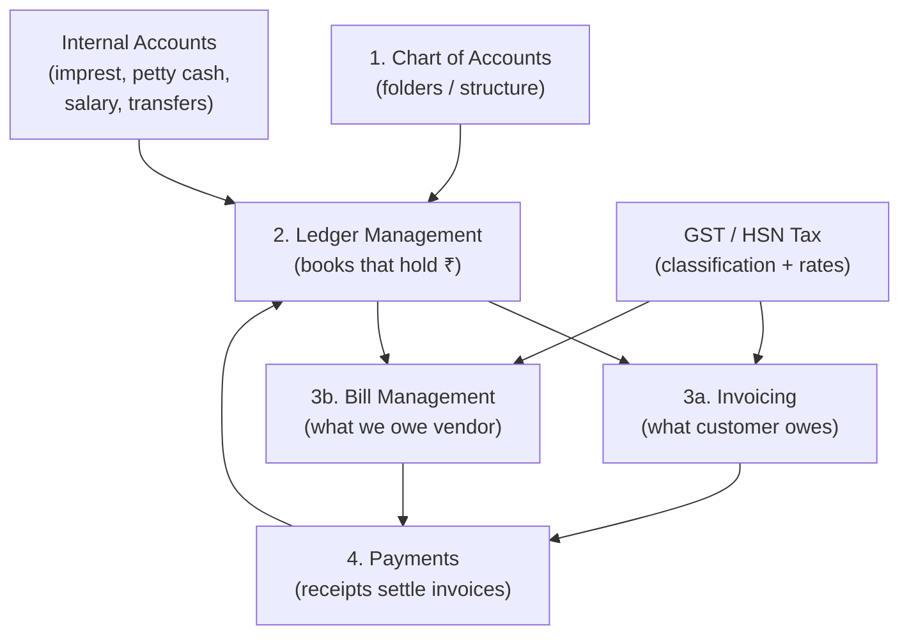

# Seravion ERP — Accounts & Finance Documentation Hub

This directory contains the **complete, in-depth documentation** for the Finance & Accounts domain of Seravion Connect. Every module document here reflects the **live codebase** as analysed from actual entity classes, service implementations, controllers, and frontend helpers.

---

## 📚 Document Index

| # | Document | What it covers |
|---|----------|----------------|
| 1 | [chart-of-accounts.md](./chart-of-accounts.md) | The five-group COA folder tree; postable heads; debit/credit rules; RBAC |
| 2 | [ledger-management.md](./ledger-management.md) | Named books (customer, vendor, cash, bank, tax); auto vs manual creation; statements; opening balances |
| 3 | [invoicing.md](./invoicing.md) | Sales invoicing — Direct, From SO, Auto-draft; B2B, B2C, GST state split; approve & post |
| 4 | [bill-management.md](./bill-management.md) | Purchase bills — PO-linked, URD rules, confirm & post; debit notes; status lifecycle |
| 5 | [gst-hsn-tax-workflow.md](./gst-hsn-tax-workflow.md) | GST in India; CGST/SGST/IGST rules; HSN/SAC; place of supply; URD procurement |
| 6 | [payments.md](./payments.md) | Receipt, Payment, Contra, Journal vouchers; allocation; settle & close; TDS |
| 7 | [internal-accounts.md](./internal-accounts.md) | Internal GL module — imprest, petty cash, salary, fund transfers; opening balance sync |
| 8 | [testing-scenarios.md](./testing-scenarios.md) | Dedicated end-to-end testing guide for all modules with positive and negative cases |

---

## 🗺️ System Flow (Big Picture)



---

## 📋 Key Design Principles

1. **Draft never hits ledgers.** Only Approve (invoice) or Confirm (bill) posts books.
2. **Every posting is balanced.** `Total Debit = Total Credit` on every voucher.
3. **Unregistered vendors (URD) cannot have GST.** The frontend strips tax; the backend enforces it at create and confirm.
4. **Unregistered branches cannot issue Tax Invoices.** The system enforces Proforma or Bill of Supply.
5. **B2C Place of Supply = Billing/Delivery Site State,** not the branch state.
6. **One active bill per PO.** A second bill can only be created after the first is cancelled.
7. **Opening balances sync automatically.** Updating a ledger's opening balance creates a matching `LedgerEntry` to keep books balanced.

---

## 🧾 GST State Decision Matrix

| Branch State | Customer/Vendor State | Tax Split |
|---|---|---|
| Same state | Same state | **CGST + SGST** (each = half) |
| Different states | Different states | **IGST** (full rate) |
| Vendor = Unregistered | Any | **No GST** (zero input tax) |
| Branch = Unregistered | Any | Cannot issue Tax Invoice |
| Customer = Unregistered (B2C) | Billing/Delivery site state used for POS | CGST+SGST or IGST based on site vs branch |

---

## 📊 Bill Status Lifecycle

```
DRAFT → PENDING → PARTIAL → PAID
              ↓
           OVERDUE → PARTIAL → PAID
              ↓
          CANCELLED (from DRAFT only)
```

## 📊 Invoice Status Lifecycle

```
DRAFT → SENT → PARTIAL → PAID (cash receipt)
           ↓                ↓
        OVERDUE → PARTIAL → ADJUSTED (credit note)
           ↓
       CANCELLED (from DRAFT only)
```

---

*All documentation in this directory is generated from live code analysis of the Seravion Connect backend (`BillsServiceImpl.java`, `InvoicingServiceImpl.java`, `LedgerService`, etc.) and the React frontend (`AddBills.jsx`, `EditBills.jsx`, `billTaxHelpers.js`, etc.).*
