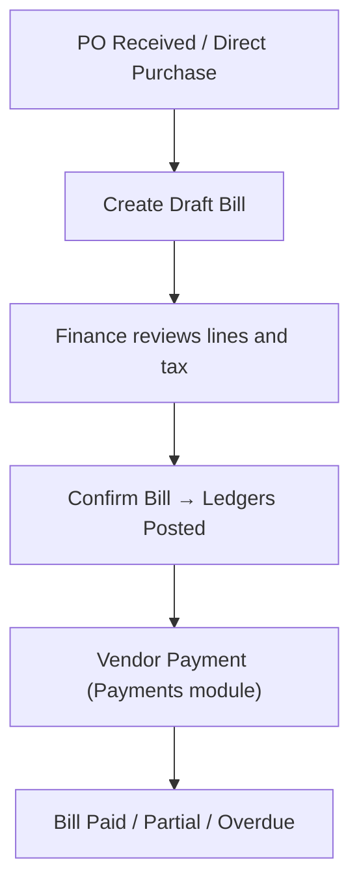
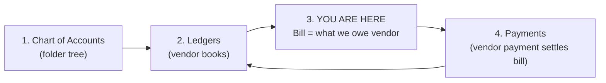
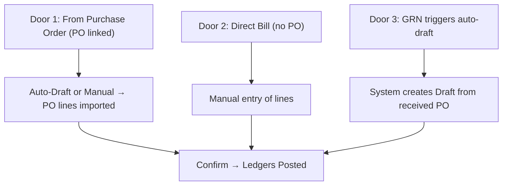
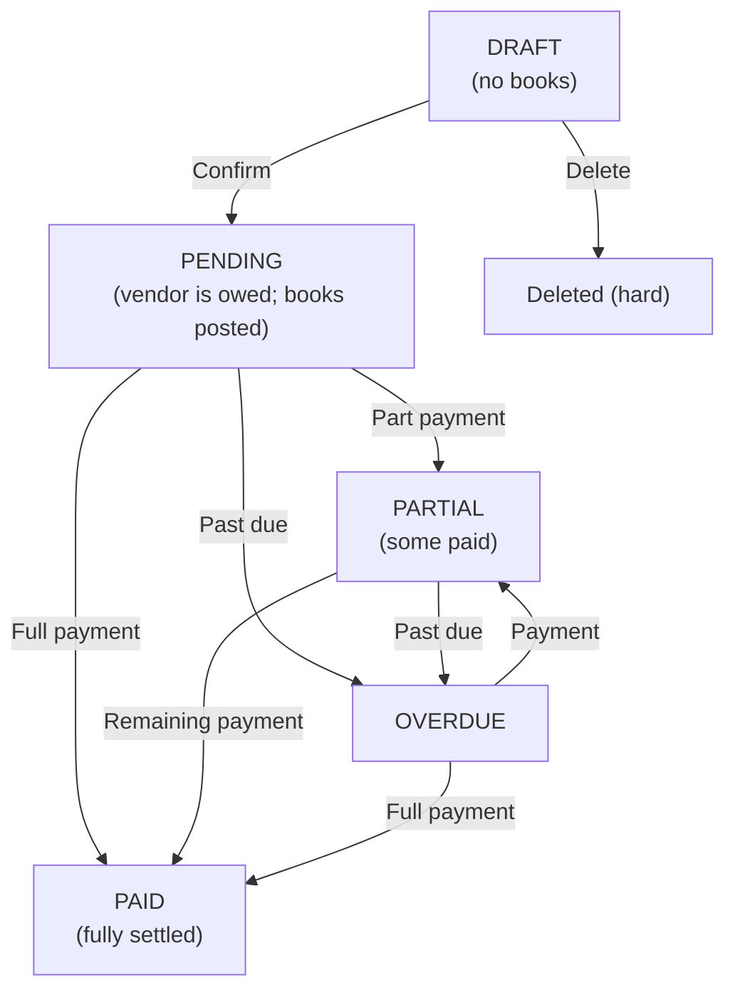

# Bill Management (Accounts Payable) — Complete Business & Technical Documentation

> **Related documents:** [Chart of Accounts](./chart-of-accounts.md) · [Ledger Management](./ledger-management.md) · [Payments](./payments.md) · [GST & HSN Workflow](./gst-hsn-tax-workflow.md) · [Testing Scenarios](./testing-scenarios.md)

This document is the **authoritative, in-depth reference** for Bill Management (Vendor Accounts Payable) in Seravion Connect. It covers every workflow, every status, every validation rule, and every real accounting journal entry — derived directly from `BillsServiceImpl.java`, `PurchaseBill.java`, `BillsController.java`, and the React frontend (`AddBills.jsx`, `EditBills.jsx`, `billTaxHelpers.js`).

---

## 1. Purpose & Business Need

When the company purchases goods or services from a vendor, they receive a **vendor invoice** (the vendor's demand for payment). The company must:

1. Record that they **owe** the vendor money.
2. Debit the correct **expense or inventory account**.
3. Claim **Input Tax Credit (ITC)** if the vendor is GST-registered.
4. Track when the bill is **due** and mark it **Overdue** if not paid on time.
5. Settle the bill via vendor **payments** — full or partial.

**Bill Management** is the Accounts Payable module that does all of this.



---

## 1.0 Quick Visual Atlas

### Where Bills Sit in the System



| Step | Module | What it does |
|------|--------|--------------|
| 1–2 | COA + Ledgers | Vendor ledger + expense/purchase ledgers must exist |
| 3 | **Bills** | Draft = paper only. Confirm = vendor **is owed** net payable |
| 4 | Payments | Payment voucher reduces pending → Partial / Paid |

**Draft never hits ledgers. Only Confirm posts books.**

### How a New Bill is Born (Three Doors)



| Door | When | Key rules |
|------|------|-----------|
| **PO-linked** | PO was raised; vendor delivered | Vendor on bill must match vendor on PO. Only 1 active bill per PO. |
| **Direct** | No PO was raised | Lines entered manually |
| **Auto-draft (GRN)** | `autoCreateDraftBillFromPo()` called on PO receipt | Draft created automatically; finance must Confirm |

---

## 2. Bill Status Lifecycle

### Status Map



| Status | Books posted? | Pending | Meaning | What user can do |
|--------|---------------|---------|---------|-----------------|
| **DRAFT** | No | Not in books | Created but not confirmed | Edit, delete, confirm |
| **PENDING** | Yes | = net payable | Vendor is owed full amount | Make Payment, Debit Note, Mark Overdue, PDF |
| **PARTIAL** | Yes | > 0 | Partially paid | Another payment, Debit Note |
| **PAID** | Yes | 0 | Fully settled (cash or debit note) | PDF only |
| **OVERDUE** | Yes | > 0 | Past due date | Same as PENDING |

> ⚠️ **Note:** Unlike invoices, bills have **no CANCELLED status**. Only DRAFT bills can be hard-deleted. Once confirmed, you must use a payment or debit note to close.

---

## 3. GST Rules for Bills

### 3.1 Registered Vendor (GST Registered)

- The vendor must have a valid GSTIN on their master record.
- The bill may include CGST + SGST (intra-state) or IGST (inter-state) on each line.
- On Confirm, Input GST is debited (`GST Input CGST`, `GST Input SGST`, or `GST Input IGST`).
- The company can claim **Input Tax Credit (ITC)**.

**State determination:**
- Branch State vs Vendor State (from snapshot on the bill)
- Same state → CGST + SGST
- Different state → IGST

### 3.2 Unregistered Vendor (URD — Unregistered Dealer)

The backend enforces strict rules at both **create** and **confirm**:

```java
// From BillsServiceImpl.java applyVendorGstRegistrationRules()
if (regType == VendorRegistrationType.UNREGISTERED) {
    rejectInputGstForUnregistered(cgst, sgst, igst, request.getLines());
    request.setVendorGstin("URP");
}
```

| What is enforced | Where |
|---|---|
| CGST + SGST + IGST on bill header must be ≤ ₹0.02 | Backend create + update |
| Tax % on each line must be 0 | Backend create + update |
| Tax amount on each line must be ≤ ₹0.02 | Backend confirm (re-validates stored bill) |
| Vendor GSTIN snapshot is set to `"URP"` | Backend create |
| Tax dropdowns are **disabled** in the UI | Frontend `AddBills.jsx`, `EditBills.jsx` |
| When product/HSN is added/changed, tax is auto-stripped to 0% | Frontend `billTaxHelpers.js` → `stripBillLineGst()` |

**Why?** An unregistered vendor has not collected GST from you; there is no GST invoice you can use to claim ITC. Posting Input GST from a URD would be fraudulent under Indian GST law.

### 3.3 Reverse Charge Mechanism (RCM) — Note

The system does **not** automatically apply RCM merely because the vendor is unregistered. If an RCM-applicable provision exists (e.g., transport, legal services from URD), the **company itself** must account for RCM liability via a manual journal entry in the Payments module. Bill Management only captures the direct supplier invoice.

---

## 4. Accounting Entries (What Confirm Posts)

### 4.1 Normal Bill (Registered Vendor, Intra-State)

**Example:** ₹10,000 taxable purchase, 18% GST (CGST 9% + SGST 9%), no TDS.

| Account | DR | CR |
|---------|----|----|
| Purchase Expense | ₹10,000 | |
| GST Input CGST | ₹900 | |
| GST Input SGST | ₹900 | |
| Vendor Ledger (Sundry Creditors) | | ₹11,800 |

Net payable = ₹11,800. Vendor ledger credited.

### 4.2 Normal Bill (Registered Vendor, Inter-State)

**Example:** ₹10,000 taxable purchase, 18% IGST, no TDS.

| Account | DR | CR |
|---------|----|----|
| Purchase Expense | ₹10,000 | |
| GST Input IGST | ₹1,800 | |
| Vendor Ledger | | ₹11,800 |

### 4.3 Bill with TDS

**Example:** ₹10,000 taxable, 18% GST (intra), TDS 10%.

- Gross line total = ₹11,800
- TDS = ₹1,180 (10% of ₹11,800)
- Net payable = ₹10,620

| Account | DR | CR |
|---------|----|----|
| Purchase Expense | ₹10,000 | |
| GST Input CGST | ₹900 | |
| GST Input SGST | ₹900 | |
| Vendor Ledger | | ₹10,620 |
| TDS Payable | | ₹1,180 |

### 4.4 Unregistered Vendor (URD) Bill

**Example:** ₹10,000 purchase, no GST.

| Account | DR | CR |
|---------|----|----|
| Purchase Expense | ₹10,000 | |
| Vendor Ledger | | ₹10,000 |

No GST accounts are touched.

### 4.5 Custom Vendor (No Vendor Master)

If `vendorId = "CUSTOM_VENDOR"`, the vendor ledger used is the system-seeded **Sundry Creditors (Others)** ledger, not a party-specific ledger.

---

## 5. Debit Notes

A **Debit Note** is the purchase-side equivalent of a credit note. It reduces what the company owes the vendor.

**When to use:**
- Vendor overcharged (pricing error)
- Goods were returned
- Settlement discount agreed

**Business rules (from code):**
- Debit amount cannot exceed `pendingAmount` on the bill.
- If debit amount = pending → bill becomes **PAID**.
- If debit amount < pending → bill becomes **PARTIAL**.

**Accounting entries for a Debit Note:**

| Account | DR | CR |
|---------|----|----|
| Vendor Ledger | Proportional amount | |
| Purchase Adjustment (DN adjustment) | | Taxable portion |
| GST Input CGST/SGST/IGST | | Proportional GST |

> The GST reversal is prorated based on `debitAmount / (netPayable + tdsAmount)`.

**Notification:** `DEBIT_NOTE_ISSUED` is sent to users with Bills Read/Add/Edit.

---

## 6. CRUD Operations

### 6.1 Create Bill

**Who:** CEO or `BILLS_MANAGEMENT_ADD`

**Steps:**
1. Select Branch, Vendor, Bill Type, Bill Date, Credit Period.
2. Optionally link a **Purchase Order** (PO). Lines are auto-populated from PO items.
3. Add/edit line items (Product or Service, HSN/SAC, qty, rate, discount, tax).
4. System calculates: taxable amount, CGST/SGST or IGST, TDS (optional), net payable.
5. For URD vendors: tax fields are disabled and stripped to zero automatically.
6. **Save** → status = **DRAFT**.

**Key validations at create:**
- Vendor must exist (or `CUSTOM_VENDOR`).
- If PO-linked: PO vendor must match bill vendor; only one non-cancelled bill per PO.
- If vendor is REGISTERED: vendor must have GSTIN.
- If vendor is UNREGISTERED: all tax must be zero.
- Line: `lineTotal = taxableAmount + taxAmount (±₹0.02)`.
- Header: `CGST + SGST + IGST = sum(line taxAmounts) (±₹0.02)`.
- Header: `netPayable = sum(lineTotal) - tdsAmount (±₹0.02)`.

### 6.2 Update Bill

**Who:** CEO or `BILLS_MANAGEMENT_EDIT`

Only **DRAFT** bills can be updated. Same validations as create apply.

### 6.3 Confirm Bill

**Who:** CEO or `BILLS_MANAGEMENT_APPROVE`

**What happens (from `BillsServiceImpl.confirm()`):**
1. Bill must be DRAFT.
2. Re-validates URD rules on stored data (double-check before posting).
3. Status → **PENDING**.
4. Resolves ledgers:
   - Expense ledger (from `BILL_CONFIRM_EXPENSE` posting key).
   - Vendor ledger (from vendor's active VENDOR-type ledger, or `SUNDRY_CREDITORS_OTHERS` for custom vendor).
   - Tax ledgers (CGST Input, SGST Input, or IGST Input — via `TaxPostingAllocator`).
   - TDS Payable ledger (if TDS > 0).
5. Posts balanced ledger entries.
6. Sends `BILL_CONFIRMED` notification.

### 6.4 Delete Bill

**Who:** CEO or `BILLS_MANAGEMENT_DELETE`

Only **DRAFT** bills can be deleted (hard delete from database).

### 6.5 List Bills

**API:** `GET /api/v1/bills`

Filters: `status`, `vendorId`, `search` (bill number or vendor name), `branchIds`.

**Summary cards (from `summary()`):**
- Total Payable = pending on PENDING + PARTIAL + OVERDUE
- Overdue Amount = pending on OVERDUE
- Paid Amount = netPayable of PAID bills
- Draft Count = count of DRAFT

> **Sync behaviour:** On `list()` and `summary()`, the system calls `syncMissingDraftBillsForReceivedPos()` — auto-creating draft bills for any received POs that don't yet have a bill.

### 6.6 Mark Overdue

**Who:** CEO or `BILLS_MANAGEMENT_EDIT`

Iterates all PENDING and PARTIAL bills. If `dueDate < today` and `pendingAmount > 0`, status → OVERDUE.

### 6.7 PDF Download

**Who:** CEO or `BILLS_MANAGEMENT_EXPORT`

Returns a PDF byte stream for the bill at `GET /api/v1/bills/pdf`.

---

## 7. Access Control (RBAC)

| Permission | Allows |
|------------|--------|
| `BILLS_MANAGEMENT_READ` | List, detail, summary, debit note list, PDF |
| `BILLS_MANAGEMENT_ADD` | Create bill, issue debit note |
| `BILLS_MANAGEMENT_EDIT` | Update draft bill, mark overdue |
| `BILLS_MANAGEMENT_DELETE` | Delete draft bill |
| `BILLS_MANAGEMENT_APPROVE` | Confirm bill |
| `BILLS_MANAGEMENT_EXPORT` | Download PDF |

**CEO:** Has all permissions automatically.

### Role × Action Matrix

| Role | View | Add | Edit | Delete Draft | Confirm | Export |
|------|------|-----|------|--------------|---------|--------|
| CEO | ✅ | ✅ | ✅ | ✅ | ✅ | ✅ |
| Bills READ only | ✅ | ❌ | ❌ | ❌ | ❌ | PDF only |
| Bills ADD | ✅ | ✅ | ❌ | ❌ | ❌ | ❌ |
| Bills EDIT | ✅ | ❌ | ✅ | ❌ | ❌ | ❌ |
| Bills APPROVE | ✅ | ❌ | ❌ | ❌ | ✅ | ❌ |
| Bills EXPORT | ✅ | ❌ | ❌ | ❌ | ❌ | ✅ |

---

## 8. Data Model

### PurchaseBill Entity Fields

| Field | Type | Notes |
|-------|------|-------|
| `id` | String(50) | Internal UUID-based ID |
| `billNumber` | String(50) | Auto-generated system number (unique) |
| `vendorBillNumber` | String(120) | Vendor's own invoice number |
| `billType` | String(20) | Type of bill (e.g., "PURCHASE") |
| `status` | BillStatus | DRAFT, PENDING, PARTIAL, PAID, OVERDUE |
| `billDate` | LocalDate | Date of vendor invoice |
| `creditPeriodDays` | Integer | Days until due |
| `dueDate` | LocalDate | `billDate + creditPeriodDays` |
| `branchId` | String | Branch receiving the goods/services |
| `vendorId` | String | Vendor id (or `"CUSTOM_VENDOR"`) |
| `purchaseOrderId` | String | Optional PO link |
| `grnReference` | String | Goods Receipt Note reference |
| `vendorNameSnapshot` | String | Vendor name at time of bill creation |
| `vendorGstinSnapshot` | String | Vendor GSTIN snapshot (or `"URP"` for URD) |
| `vendorStateSnapshot` | String | Vendor state (for inter-state determination) |
| `tdsApplicable` | boolean | Whether TDS is being deducted |
| `tdsSection` | String | TDS section (e.g., "194C") |
| `tdsRate` | BigDecimal | TDS rate % |
| `taxableAmount` | BigDecimal | Sum of line taxable amounts |
| `cgstAmount` | BigDecimal | CGST header total |
| `sgstAmount` | BigDecimal | SGST header total |
| `igstAmount` | BigDecimal | IGST header total |
| `tdsAmount` | BigDecimal | TDS withheld |
| `subTotal` | BigDecimal | Same as taxableAmount |
| `netPayable` | BigDecimal | `sum(lineTotal) - tdsAmount` |
| `paidAmount` | BigDecimal | Amount paid so far |
| `pendingAmount` | BigDecimal | `netPayable - paidAmount` |
| `expenseCategory` | String | Optional category label |
| `internalRemarks` | TEXT | Internal notes |
| `attachmentUrl` | TEXT | File attachment URL |
| `lines` | List\<PurchaseBillLine\> | One-to-many line items |

### PurchaseBillLine Entity Fields

| Field | Notes |
|-------|-------|
| `lineNo` | Line ordering |
| `itemType` | PRODUCT or SERVICE |
| `itemId` | Product/service id (optional) |
| `description` | Item description |
| `hsnSac` | HSN or SAC code |
| `qty` | Quantity (3 decimal places) |
| `uom` | Unit of measure |
| `rate` | Unit rate (2 decimal places) |
| `discountPct` | Discount % (3 decimal places) |
| `taxPct` | GST % applied (3 decimal places) |
| `taxableAmount` | `(qty × rate) × (1 - discount%)` |
| `taxAmount` | `taxableAmount × taxPct%` |
| `lineTotal` | `taxableAmount + taxAmount` |

---

## 9. API Reference

| Method | Endpoint | Permission | Description |
|--------|----------|------------|-------------|
| POST | `/api/v1/bills` | ADD | Create Draft Bill |
| PUT | `/api/v1/bills/update?id=` | EDIT | Update Draft Bill |
| GET | `/api/v1/bills/by-id?id=` | READ | Get Bill by ID (with lines) |
| DELETE | `/api/v1/bills/delete?id=` | DELETE | Delete Draft Bill |
| POST | `/api/v1/bills/confirm?id=` | APPROVE | Confirm Bill (posts ledgers) |
| GET | `/api/v1/bills` | READ | List Bills (paginated, filtered) |
| GET | `/api/v1/bills/summary` | READ | Summary cards |
| GET | `/api/v1/bills/purchase-orders-in-use` | READ/ADD/EDIT | PO IDs already billed |
| POST | `/api/v1/bills/debit-notes?billId=` | ADD | Issue Debit Note |
| GET | `/api/v1/bills/debit-notes?billId=` | READ | List Debit Notes for Bill |
| GET | `/api/v1/bills/debit-notes/by-id?id=` | READ | Get Debit Note by ID |
| POST | `/api/v1/bills/mark-overdue` | EDIT | Mark overdue bills |
| GET | `/api/v1/bills/pdf?id=` | EXPORT | Download Bill PDF |

---

## 10. Frontend Routes & Screens

| Route | Screen | Purpose |
|-------|--------|---------|
| `/finance/bills` | Bills List | Summary cards + paginated list |
| `/finance/bills/add` | AddBills.jsx | Create new draft bill |
| `/finance/bills/edit/:id` | EditBills.jsx | Edit draft bill |
| `/finance/bills/detail/:id` | ViewBills.jsx | View bill detail + debit notes |

---

## 11. Validation Rules Summary

| Rule | Outcome |
|------|---------|
| Vendor not found | 404 |
| Vendor is REGISTERED but GSTIN missing | 400 — "update vendor master before billing" |
| Vendor is UNREGISTERED and bill has GST | 400 — "cannot include GST, no ITC" |
| PO not found | 404 |
| PO vendor ≠ bill vendor | 400 |
| PO already has active bill | 409 — "bill already exists for this PO" |
| Line total ≠ taxableAmount + taxAmount (±₹0.02) | 400 |
| Header taxableAmount ≠ sum(line taxable) | 400 |
| CGST + SGST + IGST ≠ sum(line tax) | 400 |
| netPayable ≠ sum(lineTotal) − tdsAmount | 400 |
| No lines on bill | 400 — "at least one bill line required" |
| Edit non-DRAFT bill | 400 |
| Delete non-DRAFT bill | 400 |
| Confirm non-DRAFT bill | 400 |
| Debit amount > pending | 400 |
| Vendor ledger not found/active | 400 (on confirm) |
| Books not balanced | 500 (posting engine guard) |

---

## 12. Gaps & Known Limitations

1. **No CANCELLED status for confirmed bills.** Once PENDING, only payments/debit notes can close it. There is no "cancel" action for confirmed bills.
2. **No approval workflow.** Draft → Confirm is a direct one-step action (no request inbox / two-person approval).
3. **One bill per PO.** Partial delivery billing (multiple bills per PO) is not supported. Cancel the existing bill to create another.
4. **No stock update on bill confirm.** Bill confirmation does not auto-update stock/inventory (that is handled separately via GRN/stock module).
5. **Summary loads all bills.** `summary()` fetches all bills without pagination — may be slow for large datasets.
6. **Void/Cancel path missing.** Finance has no way to reverse a confirmed bill's ledger entries directly. A manual journal entry via Payments is needed.
7. **PO-linked bills block PO picker.** `purchase-orders-in-use` API returns all billed POs so the PO picker hides them — which is correct behaviour but blocks re-billing after mistake without cancellation.
