# Chart of Accounts (COA) — Product & Business Documentation

This document describes the **Chart of Accounts** module as it exists today in Seravion Connect. It is written so a new person — developer, accountant, or operator — can understand **what accounts are**, **what debit and credit mean**, **how the five account groups work**, **how the account tree is built**, and then **who can do what** on the live screens.

**Start here:** [§1.0 Quick visual atlas](#10-quick-visual-atlas-read-this-first) — whole-system flow, how a **new** head is born, **Yes/No**, **status**, and **enum** pickers. Same atlas style: [Ledgers](./ledger-management.md#10-quick-visual-atlas-read-this-first) · [Invoicing](./invoicing.md#10-quick-visual-atlas-read-this-first) · [Payments](./payments.md#10-quick-visual-atlas-read-this-first).

---

## 1. Purpose & Business Need

Every rupee that moves through the company must land in a **named bucket**. Sales money, vendor bills, GST, cash, bank, customer dues, and owner capital are not random notes — they are classified so the company can later answer:

- What do we **own**? (cash, bank, customer dues)
- What do we **owe**? (vendors, GST, advances)
- How much did we **earn** and **spend**?
- What is the owner’s **capital**?

**Chart of Accounts (COA)** is the company’s **official list and tree of those buckets**. It is the skeleton of the books. Ledgers (customer books, vendor books, cash book, sales book) hang **under** a COA head. Invoices and bills **never post to a COA head alone** — they post to **ledgers** that sit under a COA head.

**Outcomes today:** create and maintain account heads; nest a head under a parent of the same primary group; mark a head postable so ledgers can attach; set debit or credit nature; scope a head to all branches or one branch; activate or inactivate; export the catalogue; see which ledgers use a head.

**Sibling module:** Ledger Management — the actual books that receive money. COA is the folder; ledgers are the files inside.

---

### 1.0 Quick visual atlas (read this first)

Use this page to see **where COA sits in the whole money system**, then the **Yes / No**, **status**, and **dropdown (enum)** choices on this screen. Detail follows in 1.1 onward.

#### Whole accounting system (you are here)

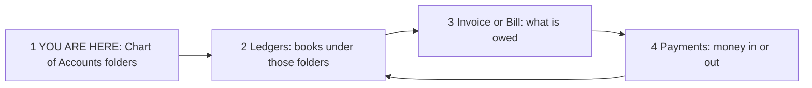

| Step | Module | What it does | Next |
|------|--------|--------------|------|
| 1 | **Chart of Accounts** | Named folders (Asset / Liability / Income / Expense / Capital) | Create or pick a **postable** folder |
| 2 | [Ledgers](./ledger-management.md) | Files inside the folder; rupees post here | Party or cash/bank/tax book must exist |
| 3 | [Invoicing](./invoicing.md) / Bills | Creates the debt | Customer owes / we owe vendor |
| 4 | [Payments](./payments.md) | Settles the debt | Receipt / Payment / Contra / Journal |

**If COA is wrong, every later step posts to the wrong drawer.**

#### How a **new** account head works

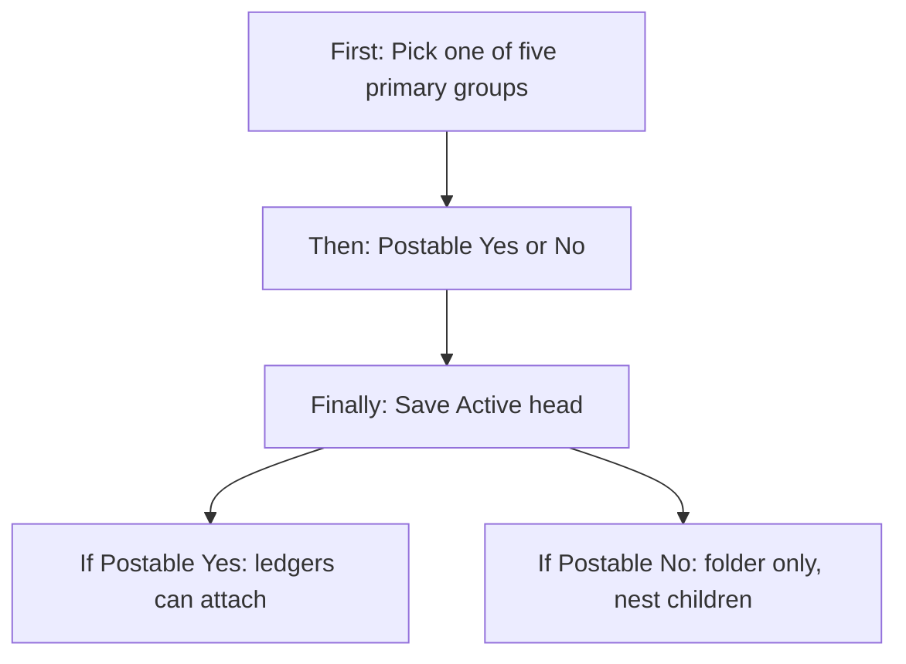

| New head | What you pick | What happens |
|----------|---------------|--------------|
| New company | Seeded folders already exist | Usually **do not** recreate Cash / Debtors / Sales |
| New custom folder | Add Account Head | New row, Active, code unique |
| New child under a group | Parent = group head, same primary group | Nested in the tree (list still looks flat) |
| New money book | **Not here** — go to Ledgers and pick this postable head | Ledger is the file; COA is only the folder |

#### Yes / No choices (this module)

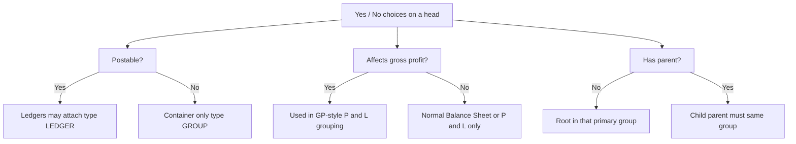

| Question | Yes | No |
|----------|-----|-----|
| Postable? | Ledgers can hang here | Group folder only |
| Affects GP? | Trading GP grouping | Default; most heads |
| Parent filled? | Nested child | Root head |
| Same primary group as parent? | Allowed | Form should block |
| Head Active? | In list; postable ones in ledger dropdown | Still listed; **removed from** new-ledger dropdown |
| Ledgers already using this head? | Used-by list shows them; do not change group carelessly | Safe to edit more fields |
| Hard delete? | **Not available** | Use Inactive |
| Request / approve to create a head? | **No** | Save = live |

#### Status map (this module)

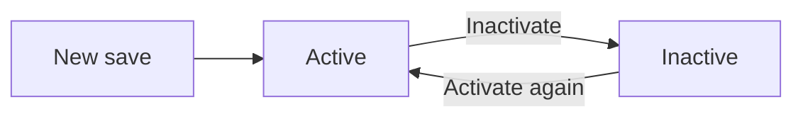

| Status | In list? | New ledger can pick it (if postable)? | Existing ledgers keep posting? |
|--------|----------|--------------------------------------|--------------------------------|
| **Active** | Yes | Yes | Yes |
| **Inactive** | Yes (filter) | **No** (dropped from dropdown) | Old ledgers still exist; do not assume posting is blocked here |

#### Dropdown / enum map (pick one)

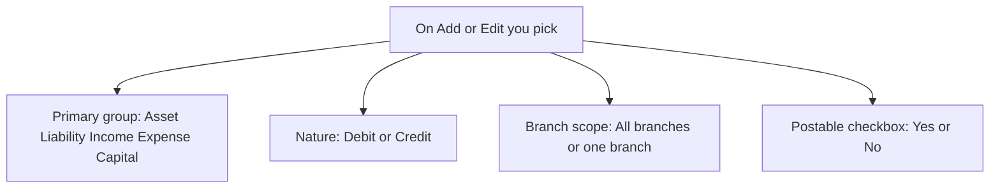

| Field | Options (exactly these) | Quick rule |
|-------|-------------------------|------------|
| Primary group | **Asset, Liability, Income, Expense, Capital** | Cannot invent a sixth. Parent must match. |
| Nature | **Debit (DR)** or **Credit (CR)** | Asset/Expense usually DR; Liability/Income/Capital usually CR |
| Branch scope | **All branches** or **Specific branch** | Specific → branch name required |
| Postable | **Yes** or **No** | Yes → type LEDGER (folder can take books). No → type GROUP |
| Status | **Active** or **Inactive** | No delete |
| Affects GP | **Yes** or **No** | Seeded Yes on sales/purchase trading heads |

**Primary group → usual nature (quick):**

| You picked | Usual nature | Report |
|------------|--------------|--------|
| Asset | Debit | Balance Sheet |
| Expense | Debit | Profit & Loss |
| Liability | Credit | Balance Sheet |
| Income | Credit | Profit & Loss |
| Capital | Credit | Balance Sheet |

---

### 1.1 What is a Chart of Accounts? (plain English)

Think of the company as a **house of money drawers**.

```text
  COMPANY BOOKS  =  a filing cabinet
  ┌─────────────────────────────────────────────┐
  │  Drawer 1  ASSET        (what we own)       │
  │  Drawer 2  LIABILITY    (what we owe)       │
  │  Drawer 3  INCOME       (what we earn)      │
  │  Drawer 4  EXPENSE      (what we spend)     │
  │  Drawer 5  CAPITAL      (owner’s stake)     │
  └─────────────────────────────────────────────┘
           │
           ▼
  Each drawer has FOLDERS (COA heads / groups)
           │
           ▼
  Each folder has FILES (Ledgers — where money is posted)
```

**Everyday example (pest-control company):**

| Real-life event | Which drawer? | Typical COA head | Typical ledger under it |
|-----------------|---------------|------------------|-------------------------|
| Customer owes ₹10,000 for a service | Asset (money to receive) | Sundry Debtors | Customer ledger “Acme Pvt Ltd” |
| You owe a chemical vendor ₹4,000 | Liability (money to pay) | Sundry Creditors | Vendor ledger “ChemCo” |
| You completed a paid service | Income (you earned) | Sales Income | System ledger `SALES_INCOME` |
| You bought chemicals | Expense (you spent) | Purchase Expense | System ledger `PURCHASE_EXPENSE` |
| Cash in the branch till | Asset | Cash in Hand | Cash – Main |
| GST you collected on invoice | Liability | GST Output Payable | CGST / SGST / IGST output ledgers |
| Owner put money into the company | Capital | Owner Equity (if created) | Capital ledger |

**Three layers you must not mix:**

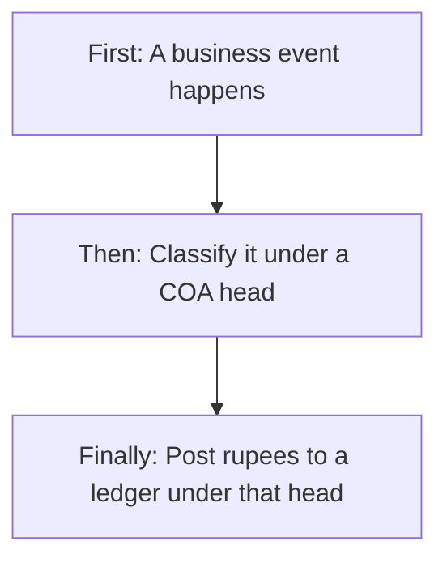

| Layer | Easy name | What it is | Example |
|-------|-----------|------------|---------|
| **1. Primary group** | The five drawers | Fixed types: Asset, Liability, Income, Expense, Capital | Asset |
| **2. COA head** | The folder | Named account group you create on Chart of Accounts | Sundry Debtors |
| **3. Ledger** | The file | The book that actually receives debit/credit entries | Customer “Acme Pvt Ltd” |

If you create only a COA head and no ledger, **invoices and bills cannot post**. The head is the label; the ledger is the book.

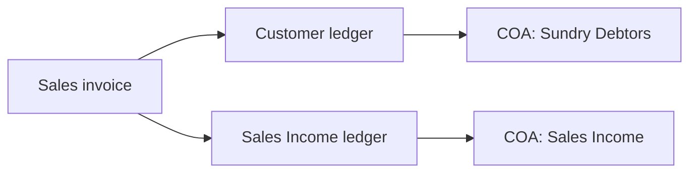

---

### 1.2 What is Debit and Credit? (easy, with examples)

Accounting uses two sides so **every transaction is balanced**. Money never “appears” on one side only.

**Golden rule (always):**

> **Total Debit = Total Credit** for every voucher, invoice, or bill.

If you put ₹10,000 on the debit side, you must put ₹10,000 on the credit side — usually on a **different** account.

#### Picture: a T-account (two pockets)

```text
        Any account (T-shape)
   ┌──────────────┬──────────────┐
   │   DEBIT      │   CREDIT     │
   │   (DR)       │   (CR)       │
   │   Left       │   Right      │
   └──────────────┴──────────────┘
```

**Debit** and **Credit** are **not** “good” and “bad”. They are just **left** and **right**. Whether a debit **increases** or **decreases** an account depends on the **primary group**.

#### Memory picture: which side grows the account?

```text
  ASSET and EXPENSE grow on the LEFT (Debit)
  LIABILITY, INCOME, CAPITAL grow on the RIGHT (Credit)

  Increase  →  put the amount on the "home" side
  Decrease  →  put the amount on the opposite side
```

| Primary group | Home nature in this product | To **increase** | To **decrease** | Real meaning |
|---------------|-----------------------------|-----------------|-----------------|--------------|
| **Asset** | Debit (DR) | Debit | Credit | More cash / more customer dues |
| **Expense** | Debit (DR) | Debit | Credit | More cost (purchases, rent) |
| **Liability** | Credit (CR) | Credit | Debit | More payable (vendors, GST) |
| **Income** | Credit (CR) | Credit | Debit | More sales / revenue |
| **Capital** | Credit (CR) | Credit | Debit | More owner investment |

**Product hint on Add Account Head:** when you pick a primary group, Nature is suggested as **DR** for Assets and Expense, and **CR** for Liabilities, Income, and Capital. You can override unless the head is already used by ledgers.

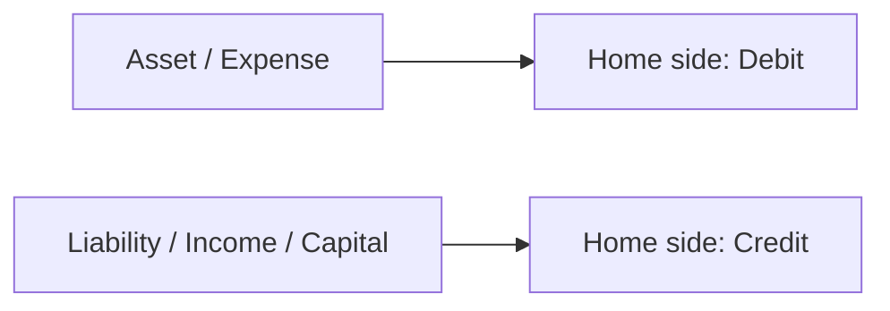

#### Story 1 — Customer pays nothing yet (you did the job)

Service invoice ₹10,000 (ignore tax for the lesson).

| Side | Account | Why |
|------|---------|-----|
| **Debit** ₹10,000 | Sundry Debtors (Asset) | Customer now owes you — asset went **up** |
| **Credit** ₹10,000 | Sales Income (Income) | You earned — income went **up** |

```text
  Sundry Debtors (Asset)          Sales Income (Income)
  Debit        Credit             Debit        Credit
  10,000                           │            10,000
  (customer owes us)               │            (we earned)
```

#### Story 2 — Customer pays cash later

Receipt ₹10,000.

| Side | Account | Why |
|------|---------|-----|
| **Debit** ₹10,000 | Cash in Hand (Asset) | Cash went **up** |
| **Credit** ₹10,000 | Sundry Debtors (Asset) | Customer no longer owes — that asset went **down** |

#### Story 3 — You buy chemicals on credit

Bill ₹5,000.

| Side | Account | Why |
|------|---------|-----|
| **Debit** ₹5,000 | Purchase Expense (Expense) | Cost went **up** |
| **Credit** ₹5,000 | Sundry Creditors (Liability) | You owe the vendor — liability went **up** |

#### Story 4 — You pay the vendor from bank

| Side | Account | Why |
|------|---------|-----|
| **Debit** ₹5,000 | Sundry Creditors (Liability) | You owe less — liability went **down** |
| **Credit** ₹5,000 | Bank Accounts (Asset) | Bank balance went **down** |

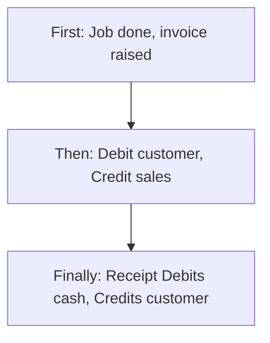

**One-line cheat for operators:**

- **Debit** something you **got / spent / are owed**.
- **Credit** something you **gave / earned / owe**.

**Nature on a COA head** is the **usual home side** of that folder. It does **not** stop opposite entries (a debtors head is DR-nature, but a receipt still **credits** the customer ledger). Nature is classification, not a lock on one side only.

---

### 1.3 The accounting equation (why five groups exist)

```text
        WHAT WE OWN              =     WHO HAS A CLAIM ON IT
  ┌─────────────────────┐            ┌──────────────────────────┐
  │  ASSETS             │     =      │  LIABILITIES  +  CAPITAL │
  │  cash, bank, dues   │            │  vendors, GST, owners    │
  └─────────────────────┘            └──────────────────────────┘

  Over a period, profit changes capital:

  Profit  =  INCOME  −  EXPENSE
```

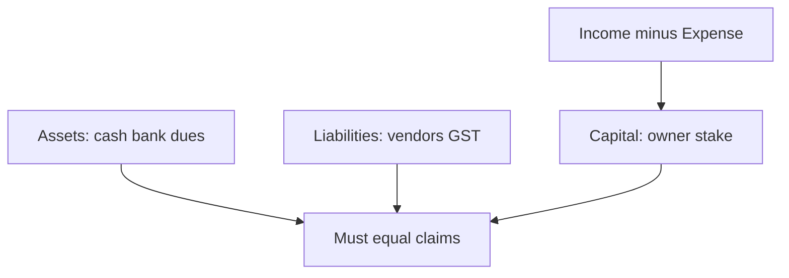

If books are correct, the equation holds. COA groups exist so reports can split **Balance Sheet** (Asset, Liability, Capital) from **Profit & Loss** (Income, Expense).

| Report | Groups included | Question it answers |
|--------|-----------------|---------------------|
| Balance Sheet | Asset, Liability, Capital | What do we own vs owe **as of a date**? |
| Profit & Loss | Income, Expense | Did we make profit **in a period**? |
| Gross profit grouping | Heads with **Affects GP** = Yes | Which income/expense is “trading” (sales vs purchase)? |

---

### 1.4 Each primary group (enum) with examples

The product has **exactly five** primary groups. You must pick one when creating a head. You cannot invent a sixth group.

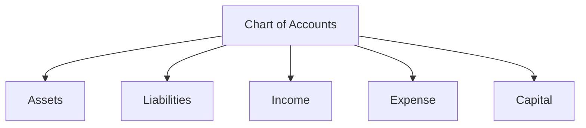

#### 1.4.1 ASSET — what the company owns or is owed

**Nature default:** Debit (DR).  
**Report:** Balance Sheet.  
**Affects GP:** usually No (except if you treat something unusually).

| Easy example | Seeded / typical head | Why it is an asset |
|--------------|----------------------|--------------------|
| Cash in the till | Cash in Hand (`1100-CASH`) | You can spend it |
| Money in bank | Bank Accounts (`1200-BANK`) | You can spend it |
| Customer has not paid yet | Sundry Debtors (`1000-SD`) | They owe you |
| GST you can claim from government | GST Input Credit (`1300-GST_INPUT`) | Government owes you a credit |

**If Asset goes up → Debit. If Asset goes down → Credit.**

#### 1.4.2 LIABILITY — what the company owes others

**Nature default:** Credit (CR).  
**Report:** Balance Sheet.  
**Affects GP:** usually No.

| Easy example | Seeded / typical head | Why it is a liability |
|--------------|----------------------|------------------------|
| Unpaid vendor bills | Sundry Creditors (`2000-SC`) | You owe the vendor |
| GST collected on sales | GST Output Payable (`2100-GST_OUTPUT`) | You owe GST to government |
| TDS deducted, not yet deposited | TDS Payable (`2200-TDS_PAYABLE`) | You owe TDS |
| Customer paid in advance | Customer Advance (`2300-CUSTOMER_ADV`) | You owe the customer a service or refund |

**If Liability goes up → Credit. If Liability goes down → Debit.**

#### 1.4.3 INCOME — what the company earns

**Nature default:** Credit (CR).  
**Report:** Profit & Loss.  
**Affects GP:** Yes on seeded Sales Income and Sales Adjustment.

| Easy example | Seeded / typical head | Why it is income |
|--------------|----------------------|------------------|
| Service / product sales | Sales Income (`4000-SALES_INCOME`) | You earned it |
| Credit notes / sales corrections | Sales Adjustment (`4100-SALES_ADJ`) | Adjusts income |

**If Income goes up → Credit. If Income is reversed → Debit.**

#### 1.4.4 EXPENSE — what the company spends to run

**Nature default:** Debit (DR).  
**Report:** Profit & Loss.  
**Affects GP:** Yes on seeded Purchase Expense and Purchase Adjustment (trading cost). Rent, salary, fuel would also be Expense; they may or may not affect GP depending on policy.

| Easy example | Seeded / typical head | Why it is expense |
|--------------|----------------------|-------------------|
| Chemicals / goods bought for jobs | Purchase Expense (`5000-PURCHASE_EXP`) | Cost of doing business |
| Purchase debit-note style corrections | Purchase Adjustment (`5100-PURCHASE_ADJ`) | Adjusts purchase cost |

**If Expense goes up → Debit. If Expense is reversed → Credit.**

#### 1.4.5 CAPITAL — owner’s stake in the company

**Nature default:** Credit (CR).  
**Report:** Balance Sheet.  
**Not seeded by default** — create if the company needs owner equity / drawings heads.

| Easy example | Typical head you may add | Why it is capital |
|--------------|--------------------------|-------------------|
| Owner invested ₹5 lakh | Owner Equity | Owner’s claim on the company |
| Profit kept in business | Retained earnings (if used) | Profit belongs to owners |

**If Capital goes up (investment, profit) → Credit. If Capital goes down (drawings) → Debit.**

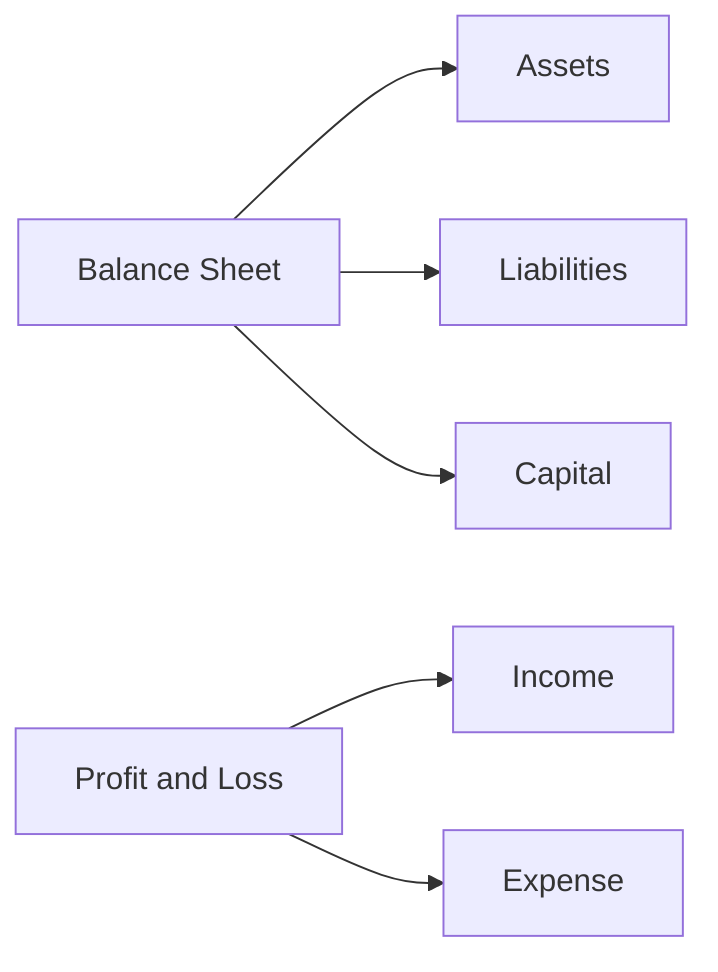

---

### 1.5 Every other enum and flag (complete map)

Besides primary group, each account head carries these choices.

#### Nature (DR / CR)

| Value on screen | Stored meaning | Easy meaning |
|-----------------|----------------|--------------|
| Debit (DR) | `DR` | This folder normally **lives on the debit side** (Assets, Expenses) |
| Credit (CR) | `CR` | This folder normally **lives on the credit side** (Liabilities, Income, Capital) |

This is **not** the same as a ledger’s opening balance type. A Cash head is DR-nature; a cash ledger can still have a credit opening if the books require it (unusual, but a different field).

#### Status (ACTIVE / INACTIVE)

| Value | Easy meaning | Effect today |
|-------|--------------|--------------|
| Active | Head is in use | Appears in list; if postable, appears in ledger “account group” dropdown |
| Inactive | Head is parked | Still in list (filterable); **removed from postable dropdown** so new ledgers should not pick it |

There is **no hard delete**. Inactive is the stop switch.

#### Type (derived — not typed by the user)

The form has a **Postable** checkbox. The system then labels the head:

| Postable checkbox | Type shown on list / export | Easy meaning |
|-------------------|-----------------------------|--------------|
| Yes (default) | LEDGER | This folder **can receive ledgers**. Money will post to those ledgers. |
| No | GROUP | This folder is a **container only** — a parent in the tree. Do not attach ledgers here. |

**Important naming trap:** Type **LEDGER** on COA does **not** mean a ledger record exists. It only means “this head is postable.” The actual ledger is created in **Ledger Management**.

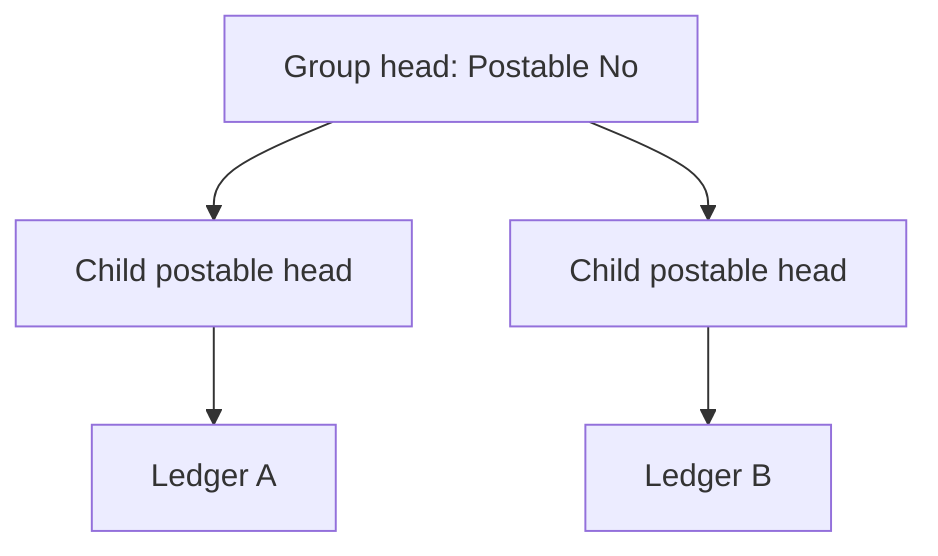

#### Branch scope (ALL / BRANCH)

| Value | Easy meaning |
|-------|----------------|
| All Branches | Head is company-wide |
| Specific Branch | Head is tied to one branch; branch name becomes required |

#### Affects GP (Yes / No)

| Value | Easy meaning |
|-------|----------------|
| No (default) | Do not treat this head as part of **gross profit** (trading) grouping |
| Yes | Include in gross-profit style P&L grouping (seeded on sales/purchase income and expense heads) |

#### Parent account head (optional)

Empty = this head is a **root** in its primary group.  
Filled = this head is a **child** of another head (same primary group on the form).

---

### 1.6 COA tree levels (how the hierarchy works)

The live list is a **flat table**. The **tree** is built by the **Parent account head** field. There is no separate “tree screen” today. Parent is how you nest.

#### Level map

```text
Level 0  PRIMARY GROUP          (fixed enum — not a saved row)
           │
Level 1  ROOT HEAD              (parent is blank)
           │
Level 2  CHILD HEAD             (parent = Level 1)
           │
Level 3  GRANDCHILD             (parent = Level 2)  … and so on
           │
Leaves   POSTABLE HEADS         (Postable = Yes) → LEDGERS attach here
```

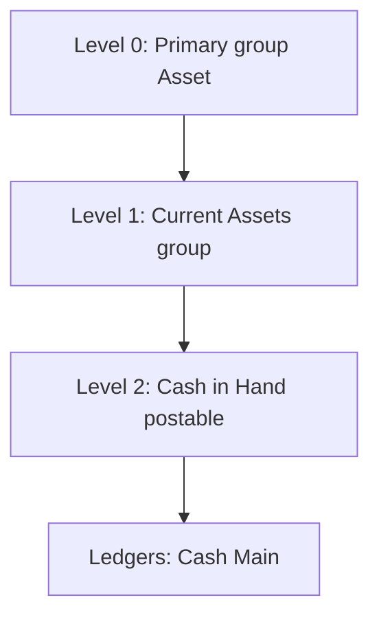

#### Worked tree (Assets) — how a tidy company *can* structure it

Seeded data today is **flat** (every default head has **no parent**). The tree below is the **intended shape** you can build with Parent account head. It is the picture accountants expect.

```text
ASSET  (Level 0 — primary group)
│
├── Current Assets                    GROUP   parent = none          Level 1
│   ├── Cash in Hand                  POSTABLE  parent = Current Assets   Level 2
│   │     └── Ledger: Cash - Main
│   ├── Bank Accounts                 POSTABLE  parent = Current Assets   Level 2
│   │     └── Ledger: Bank - Main
│   ├── Sundry Debtors                POSTABLE  parent = Current Assets   Level 2
│   │     ├── Ledger: Customer Acme
│   │     └── Ledger: Customer Beta
│   └── GST Input Credit              POSTABLE  parent = Current Assets   Level 2
│         ├── Ledger: GST CGST Input
│         └── Ledger: GST SGST Input
│
└── (you may add) Fixed Assets        GROUP   parent = none          Level 1
      └── Vehicles                    POSTABLE  parent = Fixed Assets     Level 2
```

#### Worked tree (Liabilities)

```text
LIABILITY
│
├── Current Liabilities               GROUP
│   ├── Sundry Creditors              POSTABLE
│   │     └── Ledger: Vendor ChemCo
│   ├── GST Output Payable            POSTABLE
│   │     ├── Ledger: GST CGST Output
│   │     └── Ledger: GST SGST Output
│   ├── TDS Payable                   POSTABLE
│   └── Customer Advance              POSTABLE
```

#### Worked tree (Income / Expense)

```text
INCOME                                      EXPENSE
│                                           │
└── Sales Income          POSTABLE          └── Purchase Expense     POSTABLE
    └── Ledger SALES_INCOME                     └── Ledger PURCHASE_EXPENSE
└── Sales Adjustment      POSTABLE          └── Purchase Adjustment  POSTABLE
    └── Ledger SALES_ADJUSTMENT                 └── Ledger PURCHASE_ADJUSTMENT
```

#### Rules the form enforces for the tree

| Rule | What you see |
|------|----------------|
| Parent list loads only after Primary Group is chosen | Placeholder: “Select Primary Group first” |
| Parent options are **other heads in the same primary group** | You cannot hang an Expense head under Assets |
| On Edit, the head cannot be its own parent | Self is removed from the dropdown |
| Parent is optional | First head in a group can be a root |
| Changing primary group clears parent | Prevents a leftover parent from the old group |

The save service does **not** re-check “same group” or “no circular parent.” The form is the main guard. See **Loopholes**.

#### What “level” means for reporting

| Level | Typical use |
|-------|-------------|
| Level 0 primary group | Balance Sheet / P&L section headers |
| Level 1 group heads (Postable = No) | Sub-totals (Current Assets, Current Liabilities) |
| Level 2+ postable heads | Account lines that have ledgers |
| Ledgers | Party-wise or book-wise balances (one customer, one bank) |

**Do not post to a GROUP head.** Create a child that is postable, then create ledgers under the child.

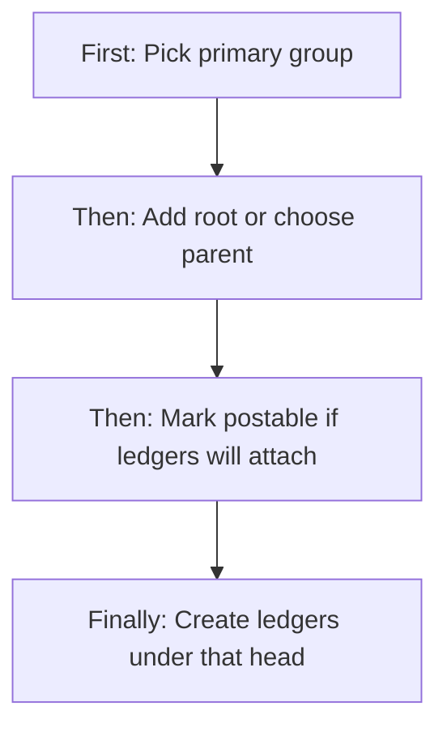

---

### 1.7 How a rupee travels (invoice and bill)

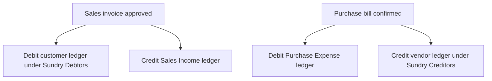

Company tenants are seeded with the baseline heads and system ledgers so sales approve and bill confirm have a place to post. Adding extra heads (rent, fuel, owner capital) is a finance setup task.

---

## 2. Users & Roles (who uses this and why)

### 2.1 Company CEO / Owner

Has full Chart of Accounts access without extra permission ticks. Sets up the company’s account tree, exports the catalogue, and can inactivate unused heads.

### 2.2 Finance / accounts staff (Chart of Accounts permissions)

Authorized employees maintain heads: add folders, nest parents, mark postable, set nature, and park unused heads. Typical users are accountants or finance leads who also maintain ledgers.

### 2.3 Ledger users (Ledger Management)

They do not need to edit COA. When they create a ledger they **pick a postable, active COA head** as the account group. Without Read on Chart of Accounts they may still use the postable dropdown only if that API is allowed — today that dropdown also requires Chart of Accounts **Read** (or CEO).

### 2.4 Super Admin / platform bypass

Platform Super Admin / Seravion sessions bypass module checks and can use all Chart of Accounts actions in the UI.

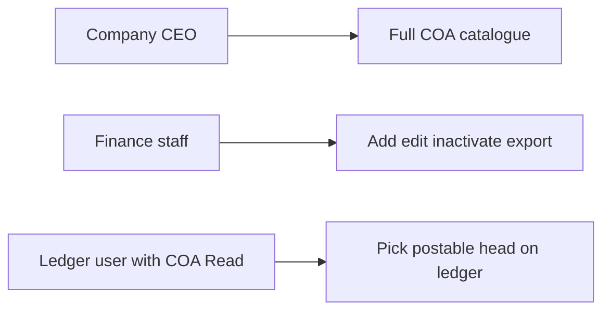

---

## 3. Access Control (RBAC)

### 3.1 How access works

- Sidebar **Finance & Accounts → Chart of Accounts (COA)** appears when the user has Chart of Accounts access (or CEO / Super Admin bypass).
- **CEO** may perform all COA operations (all actions except Request are granted on this module for CEO).
- Other employees need explicit **Chart of Accounts** actions on their role:

| Permission | Allows on this module |
|------------|------------------------|
| **Read** | Open list, search, filter, open detail, load postable heads, see used-by ledgers |
| **Add** | **+ Add Account Head** and Save on the add form |
| **Edit** | Row Edit, **Edit COA head** on detail, Update on the form, status Active/Inactive on the form; dedicated activate / inactivate actions on the service |
| **Export** | **Export CSV** on the list |
| **Delete** | May be granted on the role, but the COA list **does not show Delete**. There is no remove-from-database action. Use Inactive instead. |
| **Approve / Request** | Not used by this module |

### 3.2 Role × action matrix

| Role | View list | View detail | Add | Edit | Inactive / Delete | Submit request | Receive / act | Approve | Reject |
|------|-----------|-------------|-----|------|-------------------|----------------|---------------|---------|--------|
| Company CEO | Yes | Yes | Yes | Yes | Inactive via Edit (no hard delete) | No | No | No | No |
| Super Admin / Seravion bypass | Yes | Yes | Yes | Yes | Inactive via Edit | No | No | No | No |
| Staff with Chart of Accounts Read | Yes | Yes | No | No | No | No | No | No | No |
| Staff with Chart of Accounts Add | Yes | Yes | Yes | No | No | No | No | No | No |
| Staff with Chart of Accounts Edit | Yes | Yes | No | Yes | Inactive via Edit / status | No | No | No | No |
| Staff with Chart of Accounts Export | Yes | Yes | No | No | No | No | No | No | No |
| Staff with only Ledger Management | No COA menu | No | No | No | No | No | No | No | No |
| Other employees | No | No | No | No | No | No | No | No | No |

**Record-level rules:**

- Catalogue is **company-wide** (tenant). There is no “own records only.”
- Branch scope on a head is a **property of the head**, not a filter of who may edit it.
- If a head already has ledgers, the edit form **locks** Primary Group, Nature, and Code so posting classification cannot drift.
- Postable dropdown for new ledgers returns only **Active + Postable** heads.

This module does **not** use request / approve. Status is set directly (Active / Inactive).

---

## 4. Capabilities & Features

### 4.1 Account head catalogue

Each head stores: unique code, display name, primary group, optional parent, nature, branch scope and optional branch, postable flag, affects-GP flag, and status. System assigns an internal id on create.

### 4.2 Hierarchy (parent)

Optional parent of the same primary group. Used to build the logical COA tree. List still shows a flat grid including Parent Head ID.

### 4.3 Postable vs group

Postable heads appear in Ledger “account group.” Group heads are containers.

### 4.4 Used-by ledgers

Detail screen lists every ledger whose account group points at this head, with branch, closing balance, and a Statement shortcut (if the user can read Ledger Management).

### 4.5 Export

List **Export CSV** downloads a file named `coa-export-YYYY-MM-DD.csv` with code, name, type (LEDGER/GROUP), primary group, nature, and status.

### 4.6 Notifications

Creating a head raises a “New COA Account Created” notice. Inactivating via the dedicated inactivate action raises “COA Account Deactivated.” Saving Inactive only on the edit form uses the update path (no separate deactivate notice).

### 4.7 Baseline catalogue

New company schemas receive a starter set of postable heads (debtors, creditors, cash, bank, sales, purchase, GST, TDS, customer advance) plus matching system ledgers. All seeded heads are **roots** (no parent) until finance nests them.

---

## 5. CRUD Operations

### 5.1 Create (Add)

**Who:** CEO, Super Admin, or staff with Chart of Accounts **Add**.

**First:** From Chart of Accounts, click **+ Add Account Head**.  
**Then:** Enter name, pick primary group (nature suggests DR/CR), optionally pick parent, set postable, code, branch scope, affects GP, status.  
**Finally:** **Save**. Success message “Account Head Saved Successfully”; after a short pause the previous screen opens. Duplicate code is rejected.

**Required inputs:** Account Name, Primary Group, Nature, Code. Branch is required when scope is Specific Branch.

**Defaults if left alone:** Nature from primary group; Branch scope All Branches (unless the user has only one branch — the form then prefers that branch); Postable Yes; Affects GP No; Status Active.

### 5.2 Read — List

**Who:** Read (or CEO / bypass).

The list loads account heads sorted by **code**. Search (code or name) waits half a second after typing. Filters: Primary Group, Status, and Branch (branch filter hidden when the user has one or zero branches). Pagination is server-side when a single group/status is used; mixed filters try to filter on the client (see Gaps).

**Columns:** Code, Account Name, Primary Group, Parent Head ID, Type, Nature, Status, Branch Scope.

**Empty:** table empty / loading state while fetching.

**No checkboxes. No delete button.** Actions: view and edit (edit only with Edit permission).

### 5.3 Read — Detail / Get details

**Who:** Read.

**First:** Click view on a row (or open detail with the head id).  
**Then:** Screen loads the head and all ledgers under it; parent id is resolved to “code — name.”  
**Finally:** User can go back to the list, open **Edit COA head** (if Edit), or open a ledger Statement (if Ledger Read).

If no id is present: “No account head selected…”

### 5.4 Update (Edit)

**Who:** Edit (or CEO / bypass).

Opened from list Edit or detail **Edit COA head**. Same form as Add, prefilled.

**Locked when any ledger already uses the head:** Primary Group, Nature, Code. Name, parent, postable, branch, affects GP, and status remain editable.

**Save** sends the full head. Success: “Account Head Updated Successfully.” Changing code to one that already exists is rejected.

### 5.5 Inactive / Delete

**Inactive (supported):** On Add/Edit, set Status to Inactive and Update. Dedicated activate / inactivate actions also exist for the same result. Inactive heads stay in the list; they drop out of the postable dropdown.

**Confirmation:** none beyond Save. Inactivate does **not** block when ledgers still exist.

**Reactivation:** set Status back to Active (or use activate). Allowed for anyone with Edit.

**Hard delete:** **not offered**. Parent and ledger links are protected so a head in use cannot be removed from the database even if someone tried outside the UI.

---

## 6. Request & Approval Flows

This module does **not** use request / approve. There is no submit, inbox, approve, reject, or return. A user with Edit (or CEO) changes the head immediately, including Active / Inactive.

---

## 7. Forms — Add vs Edit Field Access

Add and Edit share one screen. Mode comes from “edit” plus the selected row.

| Field (business name) | On Add | On Edit | Notes |
|----------------------|--------|---------|-------|
| Account Name | Editable, required, max 150 | Editable | Display name |
| Primary Group | Editable, required | **Locked** if any ledger uses this head; else editable | Changing group clears parent and re-suggests nature |
| Parent account head | Optional; enabled after group chosen | Optional; can clear | Options = other heads in same group; not self |
| Postable | Checkbox, default Yes | Editable | Yes → type LEDGER; No → type GROUP |
| Nature | Required radios Debit / Credit; auto-suggested | **Locked** if ledgers exist | DR vs CR |
| Code | Editable, required, max 30, unique | **Locked** if ledgers exist | Duplicate rejected |
| Branch Scope | All Branches / Specific Branch | Editable | Specific shows Branch |
| Branch | Required if Specific Branch | Same | Hidden when scope is All; single-branch user sees read-only name |
| Affects GP (P&L) | Checkbox, default No | Editable | Gross profit grouping |
| Status | Active / Inactive radios, default Active | Editable | Inactive parks the head |
| Internal id | Hidden (system assigns) | Locked (not on form) | Used only to save |

**Role hiding:** Save/Update buttons follow Add vs Edit permission. Cancel is always available. Read-only users should not reach this form from the list Add/Edit buttons.

---

## 8. Lists, Dropdowns, Details & Data Rendering

### 8.1 List rendering

| Item | Behavior |
|------|----------|
| Sort | By account code |
| Pagination | Page size selectable; server page when filters are simple |
| Search | Code and name; 500 ms debounce; placeholder “Search by: Code, Account Name, Group…” |
| Filters | Primary Group (multi), Status tags Active/Inactive, Branch (multi, hidden if ≤1 branch) |
| Type badge | Shows LEDGER or GROUP from postable |
| Status | Status badge |
| Branch scope | Badge ALL or BRANCH |
| Parent | Raw parent id (not parent name) |
| Primary group / Nature | Stored values (ASSET, DR, …) |
| Loading | Table loading state |
| Refresh | Reloads when page, search, or filters change |
| Row actions | View detail; Edit if permitted |

### 8.2 Dropdowns & lookups

| Dropdown | What loads | Search | Depends on |
|----------|------------|--------|------------|
| Primary Group | Fixed: Assets, Liabilities, Income, Expense, Capital | No | Nothing |
| Parent account head | Heads of the **same primary group** (paged until complete, capped) | Select list | Primary Group; excludes self on edit |
| Branch Scope | All Branches, Specific Branch | No | Nothing |
| Branch | Current user’s branches | Select list | Shown only if scope = Specific Branch |
| Ledger “account group” (other module) | **Active + postable** heads only | Select list | Chart of Accounts Read (or CEO) |
| List filter Primary Group | Same five groups | Multi-select | Nothing |
| List filter Status | Active, Inactive | Tags | Nothing |
| List filter Branch | User’s branches | Multi-select | Hidden if one or zero branches |

### 8.3 Detail / get-details rendering

Opening a head loads:

1. **Account head** — name, code, primary group, parent (resolved to code — name), nature (Debit (Dr) / Credit (Cr)), status.
2. **Configuration** — branch scope, branch name if scoped, postable Yes/No, affects GP Yes/No, type LEDGER/GROUP.
3. **Used by ledgers** — name (link if Ledger Read), branch name, closing balance with type, **Statement** button.

Empty ledgers: “No ledgers assigned to this account head.” Loading: “Loading…”

---

## 9. How It Works (end-to-end user flows)

### 9.1 Finance / CEO — Add a postable head

**First:** Open Chart of Accounts and click Add Account Head.  
**Then:** Choose primary group (nature fills), enter name and unique code, leave postable on, optionally pick parent.  
**Finally:** Save. The head appears in the list and in the ledger account-group dropdown if Active and postable.

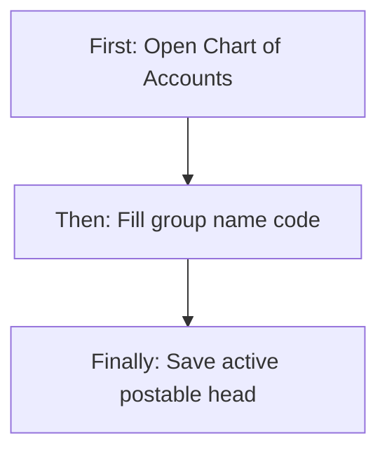

### 9.2 Finance — Build a tree (group then children)

**First:** Create a non-postable head (Postable unchecked), e.g. “Current Assets,” primary group Assets, no parent.  
**Then:** Create “Cash in Hand” with parent = Current Assets, Postable Yes.  
**Finally:** In Ledger Management, create Cash – Main under Cash in Hand. Group head stays a folder; cash posts to the ledger.

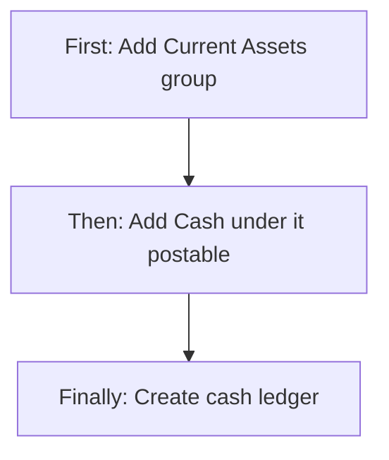

### 9.3 Finance — View who uses a head

**First:** On the list, view a row (e.g. Sundry Debtors).  
**Then:** Read configuration and the used-by ledger table.  
**Finally:** Open Statement on a customer ledger (if allowed) without changing the COA head.

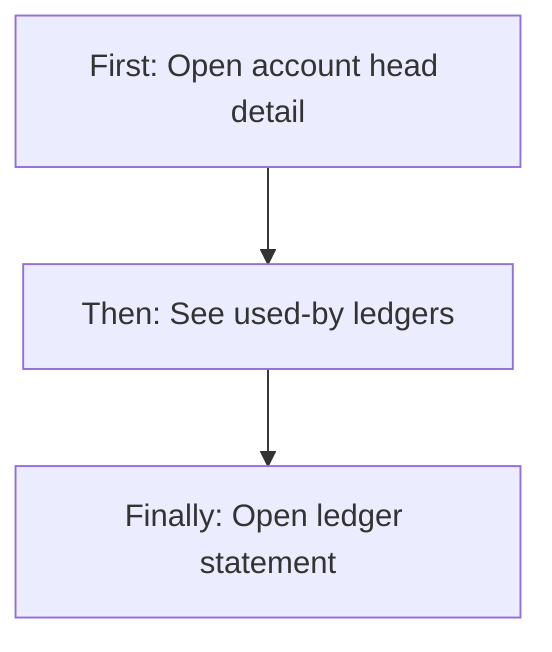

### 9.4 Finance — Edit safely after ledgers exist

**First:** Edit a head that already has ledgers.  
**Then:** Name, parent, branch, postable, GP, and status remain changeable; group, nature, and code are locked.  
**Finally:** Update. Posting classification stays stable.

```mermaid
flowchart TD
  openEdit["First: Open edit on used head"] --> changeSafe["Then: Change name parent status"]
  changeSafe --> keepClass["Finally: Group nature code stay locked"]
```

### 9.5 Finance — Inactivate a head

**First:** Edit the head, set Status Inactive, Update (or use inactivate).  
**Then:** Head remains searchable on the list as Inactive.  
**Finally:** New ledgers no longer see it in the postable dropdown. Existing ledgers are **not** auto-detached.

```mermaid
flowchart TD
  setInactive["First: Set status Inactive"] --> staysList["Then: Still on list as Inactive"]
  staysList --> hiddenDrop["Finally: Hidden from new ledger dropdown"]
```

### 9.6 Finance — Export the catalogue

**First:** On the list, click Export CSV (Export permission).  
**Then:** File downloads.  
**Finally:** Open in a spreadsheet for audit or backup of code, name, type, group, nature, status.

### 9.7 Read-only staff — Browse only

**First:** Open Chart of Accounts (Read).  
**Then:** Search, filter, open detail. Add, Edit, Export are hidden.  
**Finally:** Understand structure; cannot change it.

---

## 10. Cross-Module Interactions

```mermaid
flowchart LR
  coa["Chart of Accounts"] --> ledgers["Ledger Management"]
  ledgers --> invoices["Invoices"]
  ledgers --> bills["Bills"]
  ledgers --> payments["Payments"]
  roleCfg["Role Configuration"] --> coa
  branches["Branch Management"] --> coa
```

| Other area | Handoff |
|------------|---------|
| **Ledger Management** | Every ledger must pick a **postable active** COA head. Detail “used by ledgers” and Statement jump here. |
| **Invoices / Bills / Payments** | Post to **ledgers**, which inherit group/nature from the COA head. Sales/purchase system ledgers sit under seeded income/expense heads. |
| **Customers / Vendors** | Party ledgers typically hang under Sundry Debtors / Sundry Creditors. |
| **Tax / GST** | Seeded GST input (asset) and GST output (liability) heads hold tax ledgers. |
| **Branch Management** | Branch dropdown and branch-scoped heads. |
| **Role Configuration** | Grants Chart of Accounts Read / Add / Edit / Export / Delete (Delete unused in UI). |
| **Notifications** | Create and dedicated inactivate publish notices. |

COA does not create customers, vendors, invoices, or stock. It only classifies where those books will hang.

---

## 11. Data the Business Cares About

| Business name | Meaning |
|---------------|---------|
| Account name | Label people read |
| Code | Unique short key (max 30); seeded examples `1000-SD`, `4000-SALES_INCOME` |
| Primary group | ASSET, LIABILITY, INCOME, EXPENSE, CAPITAL |
| Parent | Optional parent head — tree link |
| Nature | DR or CR |
| Type | LEDGER (postable) or GROUP (folder) |
| Postable | Can ledgers attach? |
| Affects GP | Include in gross-profit grouping? |
| Branch scope | ALL or BRANCH |
| Branch | Required when BRANCH |
| Status | ACTIVE or INACTIVE |
| Used-by ledgers | Ledgers pointing at this head |
| Closing balance (on those ledgers) | Shown on detail, not stored on the head itself |

**Seeded starter heads (all Active, All Branches, no parent):**

| Code | Name | Group | Nature | Postable | Affects GP |
|------|------|-------|--------|----------|------------|
| 1000-SD | Sundry Debtors | Asset | DR | Yes | No |
| 2000-SC | Sundry Creditors | Liability | CR | Yes | No |
| 1100-CASH | Cash in Hand | Asset | DR | Yes | No |
| 1200-BANK | Bank Accounts | Asset | DR | Yes | No |
| 4000-SALES_INCOME | Sales Income | Income | CR | Yes | Yes |
| 5000-PURCHASE_EXP | Purchase Expense | Expense | DR | Yes | Yes |
| 4100-SALES_ADJ | Sales Adjustment | Income | CR | Yes | Yes |
| 5100-PURCHASE_ADJ | Purchase Adjustment | Expense | DR | Yes | Yes |
| 2100-GST_OUTPUT | GST Output Payable | Liability | CR | Yes | No |
| 1300-GST_INPUT | GST Input Credit | Asset | DR | Yes | No |
| 2200-TDS_PAYABLE | TDS Payable | Liability | CR | Yes | No |
| 2300-CUSTOMER_ADV | Customer Advance (On A/c) | Liability | CR | Yes | No |

---

## 12. Rules, Validations & Constraints

| Rule | What happens |
|------|----------------|
| Name required, max 150 | Error + snackbar; focus first error |
| Code required, max 30, unique | Duplicate: “Account head code already exists” / “COA code already exists” |
| Primary group required and must be one of five | Invalid group rejected |
| Nature required DR or CR | Invalid nature rejected |
| Branch required when scope is Specific Branch | Form error |
| Branch scope only ALL or BRANCH | Invalid scope rejected |
| Status only ACTIVE or INACTIVE | Invalid status rejected |
| Parent must exist if set | “The referenced parent account head no longer exists.” |
| Cannot remove a parent that still has children (database protect) | Not exposed as UI delete |
| Cannot remove a head that still has ledgers (database protect) | No UI delete |
| Defaults on create | Scope ALL, postable Yes, affects GP No, status Active |
| List sort | Code A→Z |
| Postable dropdown | Active and postable only |
| Edit lock | Group, nature, code locked when ledgers exist (UI only) |

```mermaid
flowchart TD
  draft["New head"] --> active["Active"]
  active --> inactive["Inactive"]
  inactive --> active
```

No other lifecycle stages (no draft, pending, approved).

---

## 13. Loopholes, Gaps & Current Limitations

Evidence from the live screens and services:

1. **No tree view.** Hierarchy exists only as Parent on the form and Parent Head ID on the list (raw id, not name). Users cannot expand/collapse a visual tree.
2. **Seed is flat.** Starter heads have no parents. A proper Current Assets / Current Liabilities tree is a manual setup job.
3. **Type LEDGER vs real ledger.** Easy to confuse COA type LEDGER with a ledger book. Type only means “postable.”
4. **Inactivate does not warn or block** if ledgers still use the head. Detail *shows* used-by ledgers, but Save Inactive does not require a confirmation based on that list.
5. **Edit locks are UI-only.** The save service still accepts a new group/nature/code even if ledgers exist. A non-UI caller can change classification.
6. **Parent same-group / no-cycle** is enforced on the form, not fully on save. A bad parent of another group or a circular parent is not explicitly rejected by business rules (database only checks parent exists).
7. **Single-branch auto filter.** If the user has exactly one branch, the list applies that branch in the background and hides the filter. Heads with **All Branches** (empty branch id) — including **all seeded heads** — can **disappear** from that filtered list. This is a serious browse gap for typical single-branch companies.
8. **Multi-filter client page.** When more than one group/status is selected, or a branch filter is on, the screen may only consider a small first page of results, then filter in the browser. Totals can be wrong.
9. **Type filter is half-wired.** List code mentions a Type filter; the filter panel does **not** offer Type.
10. **Activate / inactivate actions** exist for Edit permission but the UI uses Status on the form instead. Dedicated buttons are not on the list.
11. **Delete permission** can be granted on a role but the list hides delete. Dead permission for this module.
12. **Legacy mock screens** still routed: `/account` and `/add-account` show dummy / unrelated forms, not live COA. Live module is `/chart-account`.
13. **List Type badge** styles “Group” (title case) but values arrive as `GROUP` / `LEDGER`, so group styling may not apply.
14. **Export** does not include parent, branch, postable, or affects GP.
15. **No request/approve** for sensitive COA changes (renames, nature, inactivate).
16. **Postable dropdown requires Chart of Accounts Read.** A ledger clerk with Ledger Add but no COA Read cannot load account groups.
17. **Affects GP** is stored and shown; there is no separate GP report on this screen that uses the flag.
18. **Older API notes** in some internal collections still say list filters and export are stubs; **current** list filters (single group, status, search) and CSV export **are implemented**. Trust this product doc over those stale notes.

---

## 14. Existing Functionality Summary

Today a permitted user can:

- Open **Finance & Accounts → Chart of Accounts**
- Search, filter, page, and **export CSV**
- **Add** an account head with group, parent, nature, code, branch, postable, GP flag, status
- **Edit** a head (with UI locks on group/nature/code once ledgers exist)
- **View** full detail and **used-by ledgers**, and jump to ledger Statement
- **Activate / inactivate** via status (and via dedicated actions)
- Use **postable active heads** as account groups when creating ledgers
- Rely on a **seeded baseline** of debtors, creditors, cash, bank, sales, purchase, GST, TDS, and advances

They cannot: hard-delete a head; approve COA changes; see a visual tree; post invoices directly to a COA head (must use ledgers).

---

## 15. Reference — APIs, Screens & UI Actions

### 15.1 APIs

| Method | Path | Purpose (plain language) | Used by (screen/flow) |
|--------|------|--------------------------|------------------------|
| POST | `/api/v1/coa/heads` | Create account head | Add Account Head Save |
| PUT | `/api/v1/coa/heads/update` | Update account head (`id` query) | Edit Account Head Update |
| GET | `/api/v1/coa/heads/by-id` | Get one head (`id` query) | Account head detail; parent name resolve |
| GET | `/api/v1/coa/heads` | List heads (page, optional primaryGroup, status, search) | Chart of Accounts list; parent dropdown |
| GET | `/api/v1/coa/dropdowns/postable-heads` | Active postable heads | Ledger add/edit account group |
| GET | `/api/v1/coa/heads/used-by-ledgers` | Ledgers using a head (`headId`) | Detail used-by table; edit lock check |
| POST | `/api/v1/coa/heads/activate` | Set status Active (`id`) | Available; UI uses form status |
| POST | `/api/v1/coa/heads/inactivate` | Set status Inactive (`id`) | Available; UI uses form status |
| GET | `/api/v1/coa/export` | Download CSV catalogue | List Export CSV |

**Create/update body (business fields):** code, name, primaryGroup, parentHeadId, nature, branchScope, branchId, isPostable, affectsGp, status.

**Permissions:** ADD on create; EDIT on update/activate/inactivate; READ on get/list/dropdown/used-by; EXPORT on export. CEO bypasses.

### 15.2 Frontend Screen Routes

| Route | Screen purpose | Primary users |
|-------|----------------|---------------|
| `/chart-account` | Live COA list, search, filter, export, add | Finance, CEO |
| `/add-chart-account` | Add or Edit account head | Finance with Add/Edit |
| `/view-chart-account` | Read-only head detail + used-by ledgers | Finance with Read |
| `/ledger-dashboard` (related) | Ledgers that pick COA heads | Finance |
| `/account` | **Legacy mock list — not live COA** | Do not use |
| `/add-account` | **Legacy mock form — not live COA** | Do not use |

Sidebar entry: **Finance & Accounts → Chart of Accounts (COA)** → `/chart-account`.

### 15.3 Click Events, Filters, Search & Controls

| Screen / Route | Control | Type | What happens |
|----------------|---------|------|--------------|
| `/chart-account` | Search box | Text | Debounced 500 ms; filters by code/name; resets to first page |
| `/chart-account` | Filter: Primary Group | Multi-select | Assets, Liabilities, Income, Expense, Capital |
| `/chart-account` | Filter: Status | Tags | Active, Inactive |
| `/chart-account` | Filter: Branch | Multi-select | User branches; hidden if ≤1 branch; auto-applied if exactly 1 |
| `/chart-account` | Page / page size | Pagination | Loads next slice |
| `/chart-account` | Export CSV | Button | Downloads CSV (Export permission) |
| `/chart-account` | + Add Account Head | Button | Goes to add form (Add permission) |
| `/chart-account` | View (eye) | Row action | Goes to detail with head id (Read) |
| `/chart-account` | Edit | Row action | Goes to add form in edit mode (Edit) |
| `/add-chart-account` | Account Name | Text | Required |
| `/add-chart-account` | Primary Group | Select | Required; suggests nature; reloads parents |
| `/add-chart-account` | Parent account head | Select | Optional; same group; disabled until group chosen |
| `/add-chart-account` | Postable | Checkbox | Yes = ledgers may link |
| `/add-chart-account` | Nature | Radio | Debit (DR) / Credit (CR) |
| `/add-chart-account` | Code | Text | Required unique |
| `/add-chart-account` | Branch Scope | Select | All Branches / Specific Branch |
| `/add-chart-account` | Branch | Select or read-only | Shown if Specific Branch |
| `/add-chart-account` | Affects GP | Checkbox | Gross profit grouping |
| `/add-chart-account` | Status | Radio | Active / Inactive |
| `/add-chart-account` | Save / Update | Button | Validates and creates or updates |
| `/add-chart-account` | Cancel | Button | Goes back |
| `/view-chart-account` | Back to list | Button | `/chart-account` |
| `/view-chart-account` | Edit COA head | Button | Edit form (Edit permission) |
| `/view-chart-account` | Ledger name | Link | Opens ledger statement if Ledger Read |
| `/view-chart-account` | Statement | Button | Same as ledger name link |
| Ledger add/edit | Account group | Select | Loads postable active heads |

---

*Documented from the live Chart of Accounts screens, account-head service, starter catalogue, and ledger handoff. Accounting pictures in section 1 are teaching aids for the same five groups and DR/CR natures the product uses — not extra unbuilt features.*
