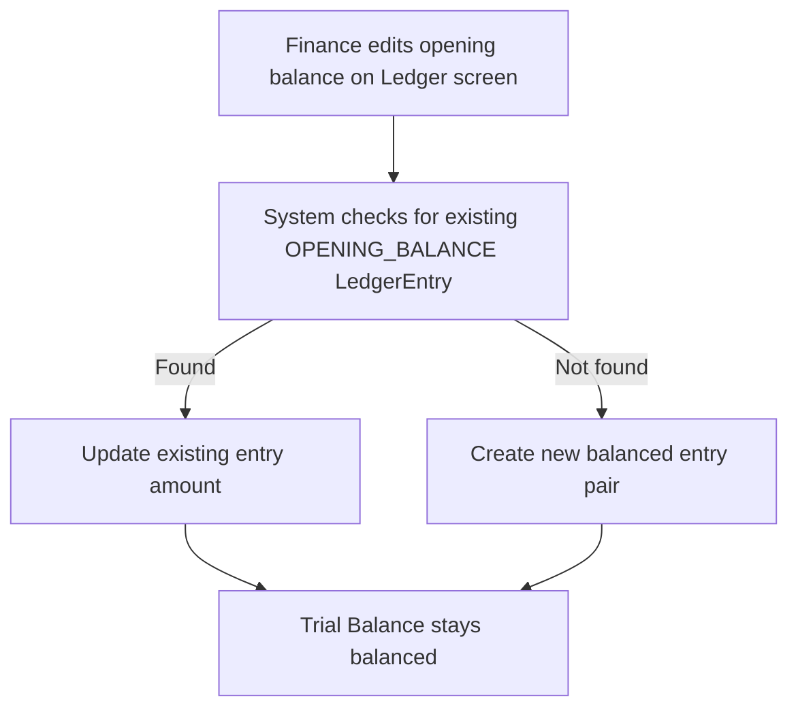

# Internal Accounts Module — Documentation

> **Related:** [Chart of Accounts](./chart-of-accounts.md) · [Ledger Management](./ledger-management.md) · [Payments](./payments.md) · [Testing Scenarios](./testing-scenarios.md)

This document covers the **Internal Accounts** implementation — a set of seeded GL accounts, new ledger posting keys, and finance workflows that extend the core Payments module to handle **branch-level internal financial operations** such as imprest funds, petty cash, manual expenses, salary disbursements, and inter-branch fund transfers.

---

## 1. Purpose & Business Need

Standard ERP modules cover *external* money flows:
- Customer → Invoice → Receipt (Payments module)
- Company → Bill → Vendor Payment (Payments module)

**Internal Accounts** handles *internal* company money flows:

| Internal Event | What it needs |
|---|---|
| Branch receives petty cash fund | Fund Transfer from head office |
| Staff submits petty cash claim | Petty expense entry hits correct GL head |
| Monthly salary is disbursed | Salary payment debits Salary Expense, credits bank |
| PF/ESI/PT deducted from salary | Separate statutory liability ledgers |
| Transfer between two branch bank accounts | Contra / Fund Transfer |

---

## 2. Seeded GL Structure

The Indian GL migration (`V160__internal_accounts_indian_gl.sql`) seeds the following COA heads and system ledgers:

### 2.1 New COA Heads

| Head Name | Primary Group | Nature | Purpose |
|-----------|---------------|--------|---------|
| Imprest & Petty Cash | Asset | Debit | Branch cash float |
| Salary & Wages | Expense | Debit | Staff salary expense |
| PF Contribution (Employer) | Expense | Debit | Employer PF share |
| ESI Contribution (Employer) | Expense | Debit | Employer ESI share |
| Professional Tax (Employer) | Expense | Debit | PT expense |
| Salary Payable | Liability | Credit | Salaries owed but not paid |
| PF Payable | Liability | Credit | PF amount to be deposited |
| ESI Payable | Liability | Credit | ESI amount to be deposited |
| PT Payable | Liability | Credit | PT amount to be deposited |
| Office Expenses | Expense | Debit | Sundry office costs |
| Branch Imprest Fund | Asset | Debit | Imprest float at branch |

### 2.2 System Ledgers

These are automatically available under the above heads without requiring manual ledger creation:

| Ledger Name | Type | COA Head |
|-------------|------|----------|
| Branch Imprest — Main | INTERNAL | Branch Imprest Fund |
| Petty Cash Expenses | INTERNAL | Imprest & Petty Cash |
| Salary & Wages — Staff | INTERNAL | Salary & Wages |
| PF Payable | INTERNAL | PF Payable |
| ESI Payable | INTERNAL | ESI Payable |
| PT Payable | INTERNAL | PT Payable |
| Salary Payable | INTERNAL | Salary Payable |

---

## 3. Opening Balance Synchronization

### Problem Solved
When finance updates a ledger's opening balance (e.g., sets the bank's opening balance to ₹5,00,000), the books must remain balanced. A ledger cannot have an isolated opening balance — the other side must go somewhere.

### How It Works (from `FinanceBooksServiceImpl.java`)
When `openingBalance` is updated:
1. The system looks for an existing `LedgerEntry` of type `OPENING_BALANCE` for that ledger.
2. If found: it **updates** the existing entry with the new amount and Dr/Cr side.
3. If not found: it **creates** a new balanced entry pair:
   - The ledger's entry (e.g., Bank Dr ₹5,00,000)
   - A contra entry to the Opening Balance Adjustment ledger (Cr ₹5,00,000)
4. The Trial Balance and Balance Sheet reflect the update immediately.

### Rules
- Opening balance on a **Debit-nature** ledger (Asset, Expense) → recorded as **Debit** entry.
- Opening balance on a **Credit-nature** ledger (Liability, Income, Capital) → recorded as **Credit** entry.
- The contra side always goes to the **Opening Balance Equity/Adjustment** ledger.

---

## 4. Fund Transfer (Internal)

Used when the company transfers money between its own ledgers internally (without going through the external Payments module for customer/vendor parties).

**Example: Branch receives ₹50,000 imprest from HO**

| Account | DR | CR |
|---------|----|----|
| Branch Imprest Fund | ₹50,000 | |
| HO Bank Account | | ₹50,000 |

This is done via **Contra** in the Payments module (Transfer From: HO Bank, Transfer To: Branch Imprest Fund).

---

## 5. Petty Cash Expense Posting

When a petty cash claim is paid:

**Example: ₹500 for office supplies**

| Account | DR | CR |
|---------|----|----|
| Office Expenses | ₹500 | |
| Branch Imprest Fund / Cash | | ₹500 |

This is done via **Journal** in the Payments module.

---

## 6. Salary Processing

### 6.1 Salary Payable Entry (Month-end accrual)

| Account | DR | CR |
|---------|----|----|
| Salary & Wages | ₹1,00,000 | |
| PF Contribution (Employer) | ₹12,000 | |
| ESI Contribution (Employer) | ₹3,250 | |
| Salary Payable | | ₹87,500 |
| PF Payable | | ₹24,000 |
| ESI Payable | | ₹3,250 |
| PT Payable | | ₹500 |

*(Employee PF: ₹12,000 is deducted from gross; Employer PF: ₹12,000 is additional cost)*

### 6.2 Salary Disbursement

| Account | DR | CR |
|---------|----|----|
| Salary Payable | ₹87,500 | |
| Bank Account | | ₹87,500 |

### 6.3 Statutory Deposit (PF to EPFO)

| Account | DR | CR |
|---------|----|----|
| PF Payable | ₹24,000 | |
| Bank Account | | ₹24,000 |

All above entries are posted via **Journal** or **Payment** in the Payments module referencing the new seeded ledgers.

---

## 7. RBAC & Access

The Internal Accounts module does not introduce new RBAC permission keys. It relies on:

| What | Permission needed |
|------|------------------|
| Viewing internal ledgers | `LEDGER_MANAGEMENT_READ` |
| Posting journals (petty cash, salary) | `PAYMENT_MANAGEMENT_ADD` |
| Creating internal ledgers | `LEDGER_MANAGEMENT_ADD` |
| Editing opening balances | `LEDGER_MANAGEMENT_EDIT` |

CEO has all access.

---

## 8. Migration Script Reference

The SQL migration `V160__internal_accounts_indian_gl.sql` inserts:
- New COA heads for all internal account types.
- System ledgers with `ledger_type = 'INTERNAL'` linked to those heads.
- These are **seeded once** per tenant on schema creation.

---

## 9. Known Limitations / Future Work

1. **No dedicated UI** for petty cash claim entry — currently done via Journal in Payments.
2. **No salary processing wizard** — payroll entries are manual journals.
3. **PF/ESI/PT computation is not automated** — finance must calculate amounts.
4. **No employee-wise salary ledger** — all salary expense goes to one `Salary & Wages` ledger.
5. **Fund Transfer tracking** — no branch-level imprest balance report yet (available via Ledger Statement).

---

## 10. Testing — Internal Accounts

See [testing-scenarios.md Part G](./testing-scenarios.md#part-g-internal-accounts) for step-by-step test cases.

Quick checklist:
- [ ] Opening balance set on an asset ledger → statement shows correct Dr opening.
- [ ] Opening balance set on a liability ledger → statement shows correct Cr opening.
- [ ] Trial Balance is balanced after every opening balance change.
- [ ] Seeded internal ledgers appear in Payments Journal ledger dropdown.
- [ ] Contra transfer between two internal ledgers updates both statements.
