# Invoicing (Sales) — Product & Business Documentation

This document describes **Invoicing** as it exists today. It is written in easy language so a new person — sales, finance, or tester — can understand **how a bill to the customer is created**, **how it links to a sales order or is typed by hand**, **when the system creates a draft by itself**, **how branch and customer control what you see**, and **what happens in the books when you approve**. Positive and negative tester cases are at the **end**.

Related: [Chart of Accounts](./chart-of-accounts.md) (folders) and [Ledger Management](./ledger-management.md) (books that receive rupees).

**Start here:** [§1.0 Quick visual atlas](#10-quick-visual-atlas-read-this-first) — whole-system flow, how a **new** invoice is born (Direct / From SO / Auto), **Yes/No**, **status**, and **mode** dropdowns. Same atlas: [COA](./chart-of-accounts.md#10-quick-visual-atlas-read-this-first) · [Ledgers](./ledger-management.md#10-quick-visual-atlas-read-this-first) · [Payments](./payments.md#10-quick-visual-atlas-read-this-first).

---

## 1. Purpose & Business Need

The company must tell the customer **how much to pay**, for which work or goods, with tax, due date, and a number they can quote when paying.

**Invoicing** is that official bill. Until an invoice is **approved and sent**, it is only a **draft** (no money in the books). After approve, the customer ledger is debited and sales/tax books are credited. Receipts later reduce pending amount.

**Outcomes today:** create drafts (manual, from sales order, or automatic from contract/product SO); edit/delete/cancel drafts; approve & send (posts ledgers); record receipts; issue credit notes; PDF/email; export Excel/Tally; mark overdue; branch and customer snapshots on the bill.

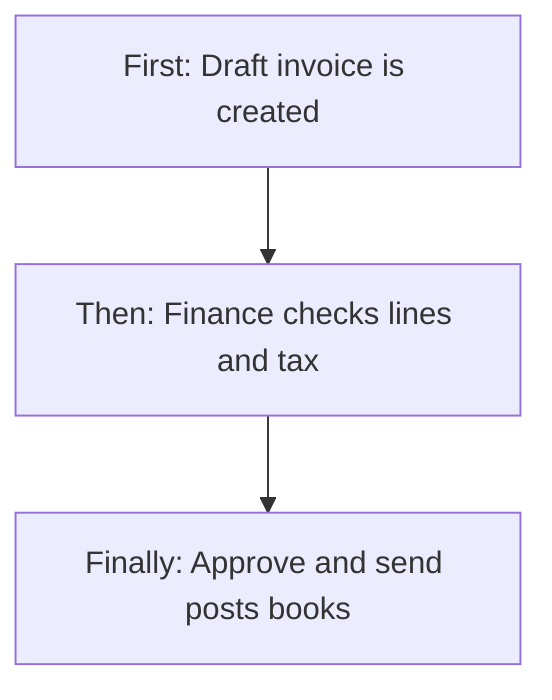

---

### 1.0 Quick visual atlas (read this first)

Use this to see **where Invoicing sits in the whole money system**, then **how a new bill is born**, **Yes / No**, **status**, and **mode dropdowns**. Detail follows in 1.1 onward.

#### Whole accounting system (you are here)

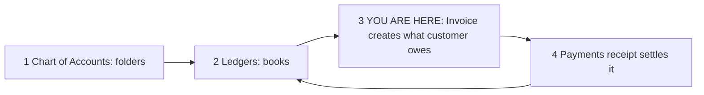

| Step | Module | What it does |
|------|--------|----------------|
| 1–2 | [COA](./chart-of-accounts.md) + [Ledgers](./ledger-management.md) | Customer book + sales/tax books must exist **before Approve** |
| 3 | **Invoicing** | Draft = paper only. Approve = customer **owes** grand total |
| 4 | [Payments](./payments.md) | Receipt reduces pending → Partial / Paid |

**Draft never hits ledgers. Only Approve & Send posts books.**

#### How a **new** invoice works (three doors)

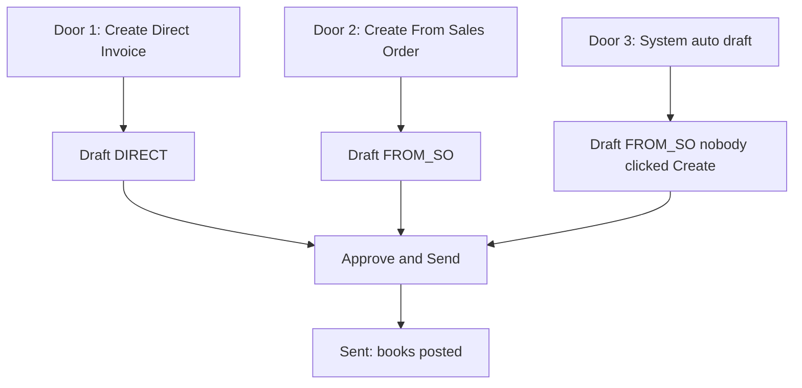

| Door | User action | Saved as | SO on invoice |
|------|-------------|----------|---------------|
| **Direct** | Create → Direct → branch + customer + lines | `DIRECT` | Usually none |
| **From SO** | Create → From Sales Order → pick one SO | `FROM_SO` | That SO (required) |
| **Auto** | Product SO opened, or contract periodic window, or visit task done | `FROM_SO` | Triggering SO |

#### Yes / No choices (this module)

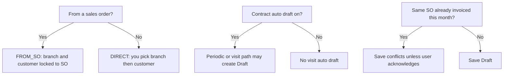

| Question | Yes | No |
|----------|-----|-----|
| Created from SO? | Mode FROM_SO; date ≥ SO date; SO not Draft/Cancelled | Mode DIRECT |
| Auto-draft invoice on contract? | Visit / every-N can fire on task complete | Those visit drafts do not run |
| Same SO + same month already has an invoice? | Conflict unless acknowledged | Normal save |
| Same state (branch vs customer)? | CGST + SGST | IGST |
| Can edit / delete / cancel? | **Only unpaid Draft** | Sent and later: no |
| Approve from the list? | **No** | Only create/edit form |
| Record Payment button? | Status Sent / Partial / Overdue | Draft / Paid / Cancelled |
| Request / approve queue? | **No** | Approve & Send is the post step |
| Draft posts ledgers? | **No** | Only after Approve |

#### Status map (this module)

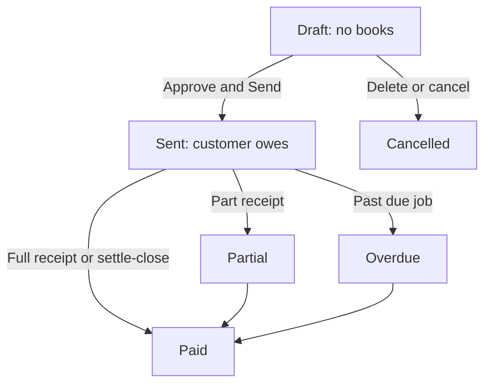

| Status | Books posted? | Pending | What user can do |
|--------|---------------|---------|------------------|
| **Draft** | No | Not in books | Edit, delete, cancel, Approve & Send |
| **Sent** | Yes | = grand total | Record Payment, credit note, PDF |
| **Partial** | Yes | > 0 | Another receipt |
| **Overdue** | Yes | > 0 | Same as Sent; marked past due |
| **Paid** | Yes | 0 | PDF; no Record Payment |
| **Cancelled** | No (never sent) | — | Stopped; only from unpaid Draft |

#### Dropdown / enum map (pick one)

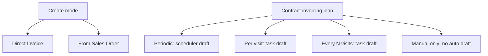

| Field | Options (live) | Quick rule |
|-------|----------------|------------|
| Creation mode | **DIRECT** or **FROM_SO** | Auto drafts are FROM_SO |
| Invoice status | **Draft, Sent, Partial, Paid, Overdue, Cancelled** | See status map |
| Tax type | Tax invoice (and proforma uses **same posting path** today) | Approve still posts |
| Contract plan | **Periodic / Per visit / Every N visits / Manual only** | Only first three auto-draft (visit needs Auto draft **on**) |
| Credit note reason | Payment Settlement, Pricing Error, Service Issue, Full Cancellation, Other | Settle & Close from Payments uses Payment Settlement |
| GST split | **CGST+SGST** or **IGST** | Same state vs different state |

**Auto-draft — will it create a Draft? (quick)**

| Situation | Auto draft? |
|-----------|-------------|
| Product SO opened (not left as Draft) | **Yes** (full SO) |
| One-time service SO opened | **No** |
| Contract Periodic + window + gates pass | **Yes** (full SO) |
| Contract Manual only | **No** |
| Per visit / Every N + Auto draft on + task done | **Yes** (visit line) |
| Per visit + Auto draft **off** | **No** |

---

### 1.1 Three ways a draft is born (easy picture)

| Way | What the user does | Saved as | Sales order on the invoice |
|-----|--------------------|----------|----------------------------|
| **Direct (manual)** | Create Invoice → choose **Direct Invoice** → pick branch + customer → type or pick lines | `DIRECT` | Usually none (you may copy lines from SOs but it still saves as Direct) |
| **From sales order** | Create Invoice → **From Sales Order** → pick one SO | `FROM_SO` | That SO id (required) |
| **Auto draft** | Nobody clicks Create — the system creates a **Draft** | `FROM_SO` | The SO that triggered it |

```text
  CUSTOMER  ←→  SALES ORDER (optional)  ←→  INVOICE DRAFT  →  APPROVE  →  LEDGERS
       │                │                        │
       │                │                        └── still no money until Approve
       └── must exist; name/GST/address copied onto the invoice (snapshot)
```

---

### 1.2 Auto-draft — exactly when it happens

The system creates a **Draft tax invoice** in these **live** cases only. It does **not** auto-approve.

#### A) Product sales order opened (not saved as draft)

When a **Product Sale** sales order is created **already Open** (not “save as draft”), or a **Draft product SO is released to Open**, the system immediately creates one **FROM_SO** draft: lines = product lines, branch/customer = SO, tax type = Tax Invoice, credit period 30 days, invoice date = today or SO date (whichever is later).

**Does not auto-draft:** One-time service SO, contract SO on open, product SO left as Draft.

#### B) Contract **periodic** billing (scheduler)

For **Active** contracts whose invoicing mode is **Periodic** (not Per visit / Every N visits / Manual only):

- There is an Open / Fulfilled / Billed **contract sales order**
- Payment line is due and billing gates pass (see below)
- Invoice date falls in the invoicing window for that frequency
- **No other non-cancelled invoice** already exists for that SO in the **same calendar month**

Then a full-SO draft is created (`create draft from sales order`).

**Skipped (no auto draft):**

- Contract invoicing mode **Manual only**, **Per visit**, or **Every N visits** (those use other paths)
- Advance-labelled payment lines that are not the last line
- First milestone/custom line that looks like an advance (not last)
- Frequency “on milestone” or “on service completion” until SO is Fulfilled or Billed
- 100% advance schedule until customer unused advance ≥ that line amount
- Earlier payment lines on the contract not yet “satisfied” (paid / enough received / enough advance)
- Another non-cancelled invoice already exists on a **different SO** for the same payment line + branch
- Duplicate SO+month already has an active invoice

#### C) Contract **per visit** / **every N visits** (when a task is completed)

If the contract has **Auto draft invoice** on, and mode is **Per visit** or **Every N visits**:

- Task has a sales order and a service line
- SO is not Draft/Cancelled
- This task has not already created a visit-invoice event

Then a **smaller** draft is created: **one service line**, quantity = 1 visit (or N visits when every-N fires). Duplicate-month check is **acknowledged** so several visit drafts can exist in one month.

**Every N visits** only fires when total executed visits on the SO is a multiple of N (and > 0).

**Does not fire if:** auto-draft is off; mode is Periodic or Manual only; task already invoiced; no SO service line on the task.

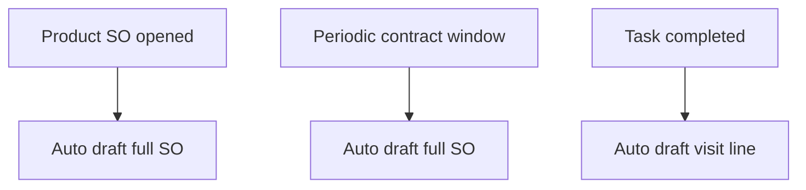

---

### 1.3 Manual vs From SO (what the Create screen does)

**From Sales Order**

- You must pick a sales order that is **not Draft and not Cancelled**
- Customer and branch come from that SO (must match)
- Invoice date cannot be before SO date
- Sites/GST can be loaded from the SO
- Saved with `FROM_SO` and `salesOrderId`
- If another non-cancelled invoice already exists for that SO in the **same month**, save returns a conflict unless the user **acknowledges the duplicate**

**Direct Invoice**

- You pick **branch** then **customer** (customers are listed for that branch)
- You add lines by hand, from catalog, or by ticking that customer’s orders to **copy lines only**
- Saved as `DIRECT` with **no** salesOrderId (copied SO lines do **not** link the invoice as FROM_SO)
- Same-month SO duplicate rule does **not** apply (no SO id)

**Approve & Send** on the create/edit form: save draft then immediately approve (needs Approve permission). List has no Approve button — only create/edit form does.

---

### 1.4 Branch scope (how it works)

Every invoice **must** have one **branch**.

| Step | Branch rule |
|------|-------------|
| Direct create | User picks a branch they can use; customer list is filtered to that branch |
| From SO / auto | Branch is the **sales order’s branch** — you cannot bill a Delhi SO on Mumbai branch |
| Ship-to site | Site must belong to the **same customer and same branch** |
| Billing extra SOs | Linked orders must be same customer + same branch |
| List filter | Optional branch chips; **single-branch users** get that branch auto-applied |
| List with no branch filter | Service returns **all invoices in the company** (not limited to the user’s branches) |
| Summary cards | Optional one branch; list screen currently loads summary **without** branch (company-wide cards) |
| Export Excel | Defaults to the logged-in user’s branches and issued statuses (Sent, Partial, Paid, Overdue) |
| Ledger posting | Uses the invoice’s branch on each book line |

**GST split:** branch **state** vs customer **state** (snapshots). Same state → CGST+SGST; different → IGST.

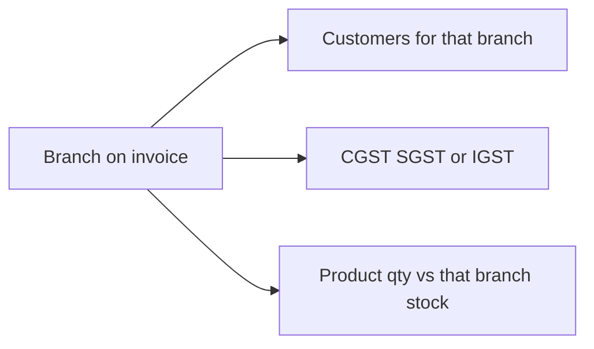

---

### 1.5 Customer linkage and cross effects

| Link | What happens |
|------|----------------|
| Invoice stores **customer id** plus **snapshots** (name, GSTIN, address, state, contact) | Later customer edits do **not** rewrite old invoices |
| GST registration / site | Optional; used to pick the right GSTIN for that branch/site |
| Active customer | Auto-creates a **customer ledger** (see Ledger docs). Approve **needs** that Active CUSTOMER ledger |
| Draft customer | You may still type a Direct invoice if the id exists, but **Approve fails** without an Active customer ledger |
| Receipt | Allocated to this invoice; pending down; status Partial or Paid |
| Credit note | Reduces pending; posts reverse books; source Manual or Auto-from-payment (settle-close) |
| SO cancel | Finance can cancel **unpaid drafts** on that SO; paid/sent invoices are left |

---

### 1.6 Account / ledger linkage (what approve writes)

**Draft = no ledger lines.**

On **Approve & Send** (Tax or Proforma — same posting path today):

| Book | Side | Amount |
|------|------|--------|
| Customer ledger (Active, linked to this customer) | Debit | Grand total |
| Sales Income (`SALES_INCOME` or posting binding) | Credit | Grand total minus GST |
| GST output ledgers (CGST/SGST/IGST as applicable) | Credit | Tax |

Then: status **Sent**; pending = grand total; notification “invoice generated.”

**Receipt** later: Bank Debit, Customer Credit (see Ledger doc). Pending falls; Partial or Paid.

**Credit note:** Sales Adjustment Debit, GST output Debit, Customer Credit. Pending falls.

**If approve fails:** draft should not stay Sent if posting throws (transaction rolls back). Typical messages: customer ledger not found/active; sales income missing; tax > grand total; unbalanced books.

---

## 2. Users & Roles (who uses this and why)

### 2.1 Company CEO / Owner

Full invoicing: create, edit drafts, delete/cancel unpaid drafts, approve, export, PDF, email, overdue run.

### 2.2 Sales / billing staff (Invoice Management permissions)

Create and edit drafts; view list/detail. Approve only if given **Approve**. Delete unpaid drafts if given **Delete**.

### 2.3 Finance

Approve & send, credit notes, receipts, overdue check, exports. Needs Invoice Approve plus Payments/Ledger as relevant.

### 2.4 Customer / site user (portal)

May download invoice PDF (export-style access on the PDF action). They do not run the company list.

### 2.5 Super Admin / platform bypass

Full UI access.

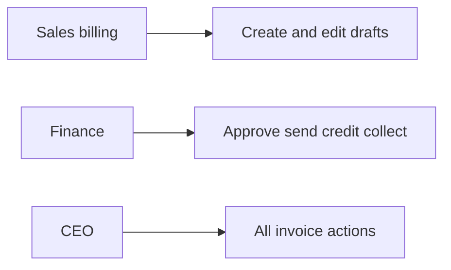

---

## 3. Access Control (RBAC)

Sidebar **Finance & Accounts → Invoicing (Sales)**.

| Permission | Allows |
|------------|--------|
| **Read** | List, detail, summary, credit-note list, billing sites, SO site addresses, attachment download |
| **Add** | Create Invoice; Issue credit note; Record payment shortcut on list (goes to receipt) |
| **Edit** | Edit **draft** only; Run overdue check; Cancel unpaid draft (also allowed with Delete) |
| **Delete** | Hard-delete unpaid draft; Cancel unpaid draft |
| **Approve** | Approve & Send (posts ledgers) |
| **Export** | Excel filtered, Tally CSV, PDF, PDF zip, Send/Resend email |
| **Request** | Not used |

### Role × action matrix

| Role | View list | View detail | Add | Edit | Inactive / Delete | Submit request | Receive / act | Approve | Reject |
|------|-----------|-------------|-----|------|-------------------|----------------|---------------|---------|--------|
| Company CEO | Yes | Yes | Yes | Draft only | Delete/cancel unpaid draft | No | No | Yes | No |
| Super Admin / Seravion | Yes | Yes | Yes | Draft only | Same | No | No | Yes | No |
| Staff with Invoice Read | Yes | Yes | No | No | No | No | No | No | No |
| Staff with Invoice Add | Yes | Yes | Yes | No | Credit note yes; no draft delete | No | No | No | No |
| Staff with Invoice Edit | Yes | Yes | No | Draft only | Cancel unpaid draft | No | No | No | No |
| Staff with Invoice Delete | Yes | Yes | No | No | Delete/cancel unpaid draft | No | No | No | No |
| Staff with Invoice Approve | Yes | Yes | No | No | No | No | No | Yes | No |
| Staff with Invoice Export | Yes | Yes | No | No | No | No | No | No | No |
| Customer / Site user | No company list | PDF if allowed | No | No | No | No | No | No | No |

**Record-level:** invoice belongs to one branch and one customer. List API does **not** by itself hide other branches; testers must apply branch filter. Sent invoices cannot be edited. Delete only unpaid drafts.

This module **does** use **Approve** (Approve & Send). It does **not** use a separate request inbox. Create is immediate as Draft.

---

## 4. Capabilities & Features

- List with search, status/type/branch/date filters, checkboxes, summary cards  
- Create Direct or From SO; optional multi-SO sites; attachment (PDF/JPG/PNG, max 5 MB)  
- Edit draft; delete or cancel unpaid draft  
- Approve & Send (ledger posting)  
- Credit notes (manual or auto from receipt settle-close)  
- PDF, email send/resend, batch PDF zip  
- Excel export (summary + per branch), Tally CSV  
- Run overdue check (Sent/Partial past due date → Overdue)  
- e-invoice **flag** when Tax + customer GSTIN + grand total > ₹50,000 (flag only; no IRN push in this screen)

---

## 5. CRUD Operations

### 5.1 Create (Add)

**Who:** Add or CEO.

**First:** **+ Create Invoice**. Choose Direct or From Sales Order.  
**Then:** Branch, customer (or SO), date (not future), credit period 1–365 days, lines (required for Tax), GST/sites, notes, optional file.  
**Finally:** **Save** → Draft. Or **Approve & Send** → save then approve if the user has Approve.

**Success:** Invoice number assigned; status Draft (or Sent if approved in the same click). Duplicate SO+month without acknowledge → conflict.

### 5.2 Read — List

**Who:** Read.

Columns: Invoice No, Date, Customer, SO No (link to SO), Amount, Pending, Due Date, Status, actions.

Search: invoice # / customer name / SO id. Filters: branch, status, type (Tax / Proforma / Credit note type), date range.

Cards: Total Receivable (pending on Sent/Partial/Overdue), Overdue pending, Paid this month (receipt allocations), Draft count.

### 5.3 Read — Detail

**Who:** Read.

Loads header snapshots, lines, sites, amounts, credit notes, audit. Actions: back, cancel unpaid draft, issue credit note (Add), PDF/email per status. **No Approve button on detail** — approve is on create/edit.

### 5.4 Update (Edit)

**Who:** Edit. **Draft only.**

Same fields as create (mode can stay From SO / Direct). Recalculates tax; pending = grand − received. Sent/Partial/Paid/Overdue/Cancelled cannot be updated.

### 5.5 Inactive / Delete

**Hard delete:** unpaid Draft only (confirm on list).  
**Cancel draft:** same rule; status → Cancelled (keeps the row).  
**Cancel issued invoice:** list “Cancel” opens **credit note** (does not set Cancelled by itself).  
No inactive flag. Cancelled drafts stay on the list if filtered.

---

## 6. Request & Approval Flows

There is **no submit-to-inbox** workflow.

### 6.1 Submit request

Not used. Saving creates Draft immediately.

### 6.2 Receive / inbox / pending actions

Not used. Drafts sit on the Invoicing list (status Draft).

### 6.3 Approve / Reject / Return

**Approve & Send** (Approve permission): only Draft → Sent + ledger posting. No reject/return status. To abandon a draft: delete or cancel (unpaid). To reverse a sent invoice: credit note and/or receipts.

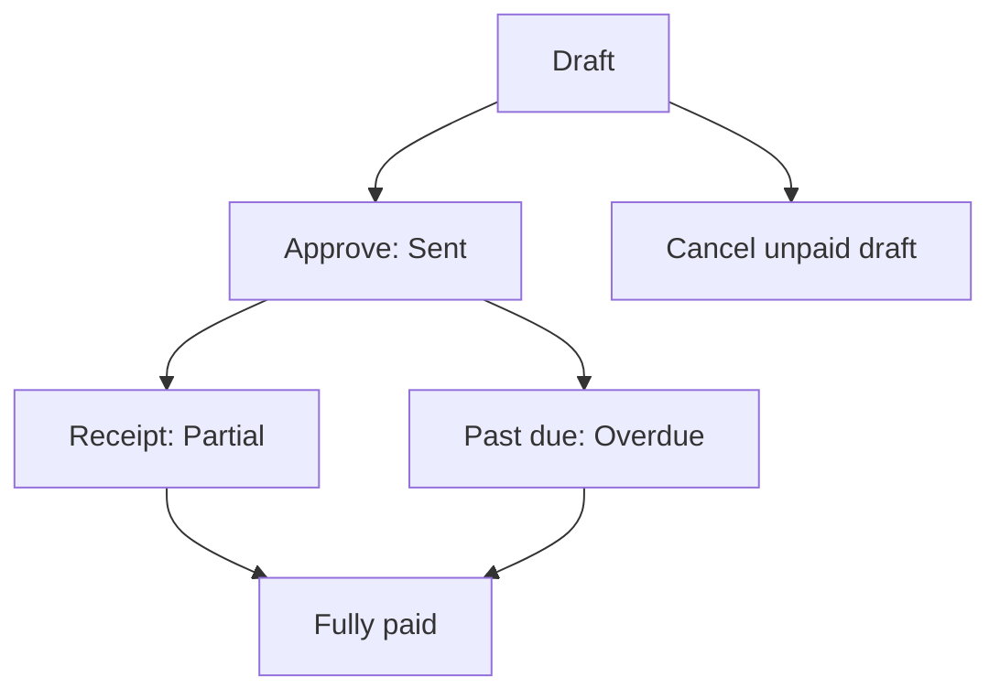

---

## 7. Forms — Add vs Edit Field Access

Create and edit share the same layout. Edit loads an existing **Draft**.

| Field (business name) | On Add | On Edit (Draft) | Notes |
|----------------------|--------|-----------------|-------|
| Creation mode Direct / From SO | Editable | Follows saved mode | Direct = no SO id |
| Branch | Required | Editable while draft | From SO uses SO branch |
| Customer | Required | Editable while draft | Must match SO if From SO |
| Sales order | Required if From SO | Same | Locked by mode |
| Linked extra SOs / sites | Optional | Editable | Same customer + branch |
| Ship-to site | Optional | Editable | Must match customer+branch |
| Invoice type Tax / Proforma | Editable | Editable | Tax needs ≥1 line |
| Invoice date | Required, not future | Editable | Not before SO date if From SO |
| Credit period (days) | 1–365, required | Editable | Due date = date + days |
| Line items | Required for Tax | Editable | Qty, rate, discount %, tax %, HSN |
| GSTIN / address / state | Filled from customer/SO | Editable snapshots | |
| Notes / internal remarks | Optional | Editable | |
| Attachment | Optional | Can replace | PDF/JPEG/PNG, 5 MB |
| Invoice number | Hidden (system) | Locked | |
| Status | Hidden (Draft) | Locked display | Changed by approve/cancel/receipts |
| Acknowledge duplicate SO month | Prompt on conflict | Same | |

**Approve & Send** visible on both forms; needs Approve. Save needs Add (create) or Edit (update).

---

## 8. Lists, Dropdowns, Details & Data Rendering

### 8.1 List rendering

Newest updated first. Pagination server-side. Checkboxes for batch PDF. Empty/loading states. SO number clickable. Status badge.

### 8.2 Dropdowns & lookups

| Dropdown | Options | Depends on |
|----------|---------|------------|
| Creation mode | Direct Invoice / From Sales Order | — |
| Branch | User’s branches | — |
| Customer | Customers for selected branch (Direct) | Branch |
| Sales order | Eligible SOs (not Draft/Cancelled); Direct filters to selected customer | Branch / customer |
| GST registration | Customer GST profiles for that branch | Customer + branch |
| Billing sites | Sites on selected SOs, optional GST filter | Customer + branch + SO ids |
| Line catalog | Services / products | Branch for product stock |
| Credit note reason | Payment settlement, pricing error, service issue, full cancellation, other | — |

### 8.3 Detail rendering

Header: number, type, mode, status, dates, branch, customer snapshots, SO/contract ids, ship-to, amounts (sub, discount, taxable, CGST/SGST/IGST, round off, grand, received, pending). Lines table. Sites. Credit notes. Audit. Transaction/receipt hints when present.

---

## 9. How It Works (end-to-end user flows)

### 9.1 Sales — Direct invoice

**First:** Create Invoice → Direct → branch + customer.  
**Then:** Add lines (or copy from that customer’s SOs without linking). Save as Draft.  
**Finally:** Finance Approve & Send when ready.

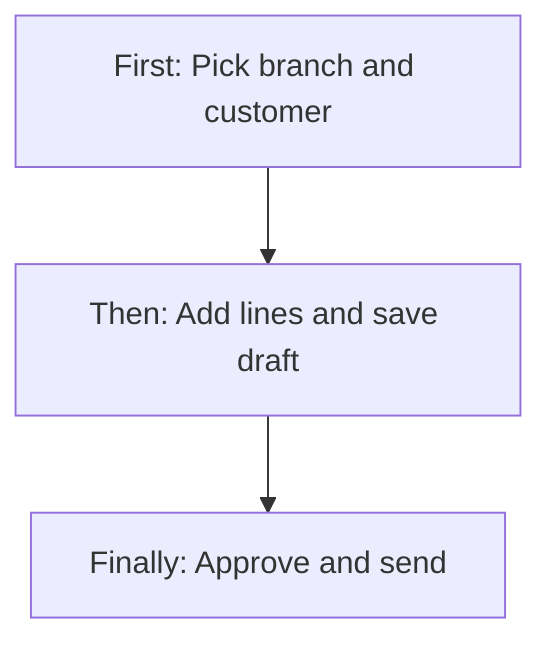

### 9.2 Sales — From sales order

**First:** Create Invoice → From Sales Order → pick Open (or eligible) SO.  
**Then:** Review pulled lines/sites/GST; save or acknowledge duplicate month.  
**Finally:** Approve & Send.

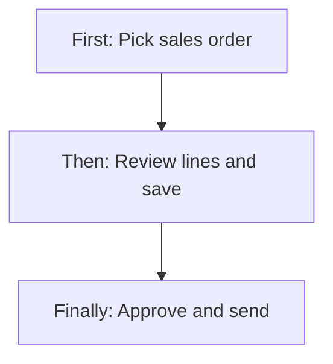

### 9.3 System — Auto draft then finance approve

**First:** Product SO opens, or periodic job runs, or visit task completes (see §1.2).  
**Then:** Draft appears on Invoicing list.  
**Finally:** Finance opens edit if needed, then Approve & Send.

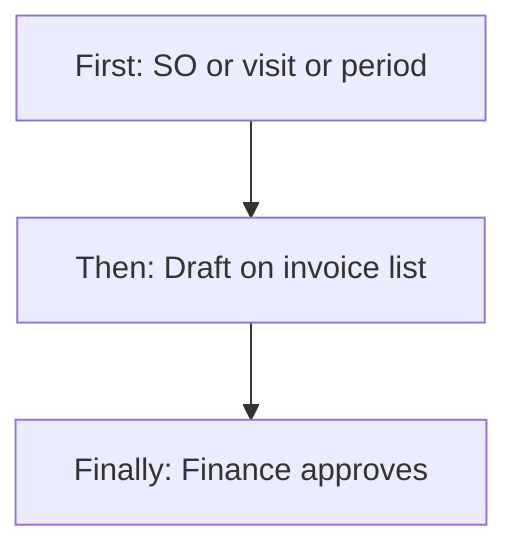

### 9.4 Finance — Approve, collect, credit

**First:** Approve & Send (customer + sales + GST books).  
**Then:** Customer pays → receipt allocated (Partial/Paid).  
**Finally:** If needed, credit note (manual or settle-close on receipt).

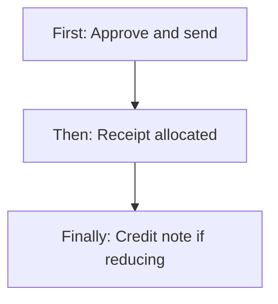

### 9.5 Finance — Drop an unpaid draft

**First:** Confirm delete or cancel on a Draft with no receipts.  
**Then:** Row gone (delete) or Cancelled (cancel).  
**Finally:** SO “invoice linked” flag refreshes if it was FROM_SO.

---

## 10. Cross-Module Interactions

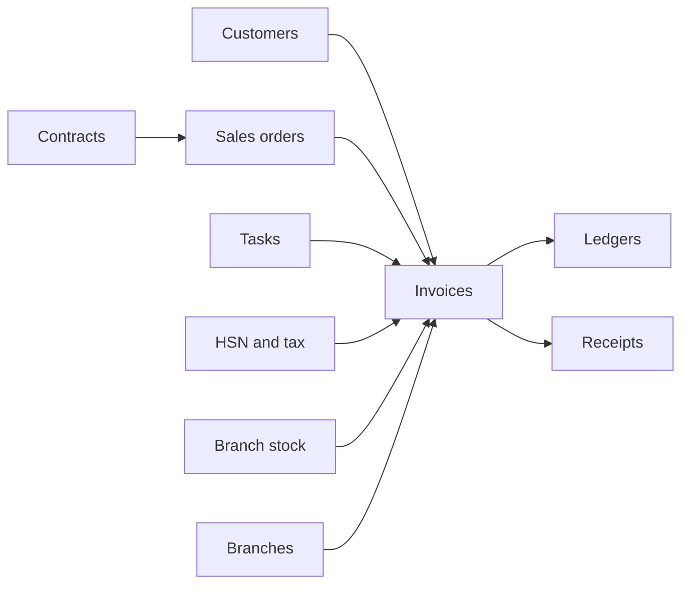

| Area | Handoff |
|------|---------|
| **Customers** | Party + GST + auto ledger; snapshots on invoice |
| **Sales orders** | FROM_SO drafts; product SO auto-draft; SO not editable if invoice-linked; SO cancel can cancel unpaid drafts |
| **Contracts** | Periodic / visit auto-draft; payment lines; Manual only = no auto invoice |
| **Tasks** | Completion can create visit draft |
| **Ledgers / COA** | Approve and credit notes post; receipts post customer + bank |
| **Payments** | Receipts allocate; settle-close auto credit note |
| **Tax / HSN** | Line HSN must be Active with CGST/SGST or IGST for the supply |
| **Stock** | Product line qty cannot exceed branch available qty on create/update |
| **Branches** | Invoice branch, GST state, stock, list/export scope |
| **Quotations / GMA** | Reach invoicing only via SO, not a separate invoice mode |

---

## 11. Data the Business Cares About

**Header:** Invoice number, type (Tax / Proforma), creation mode (FROM_SO / DIRECT), status (Draft, Sent, Partial, Paid, Overdue, Cancelled), dates, due date, credit days, branch, customer id + snapshots, GST registration, SO / extra SOs, contract, ship-to, amounts, received, pending, e-invoice required flag, notes, attachment.

**Lines:** Service or Product, item, description, HSN/SAC, qty, UOM, rate, discount %, tax %, taxable, tax amount, line total.

**Credit note:** Number, date, reason, amount, source Manual or Auto-from-payment, status Issued.

**Statuses (easy):**

| Status | Meaning |
|--------|---------|
| Draft | Not sent; no books |
| Sent | Approved; customer owes full pending |
| Partial | Some receipt/credit; still pending |
| Paid | Pending zero |
| Overdue | Sent/Partial past due date (after overdue run) |
| Cancelled | Abandoned unpaid draft (or listed after cancel path) |

---

## 12. Rules, Validations & Constraints

| Rule | Outcome |
|------|---------|
| Invoice date not in the future | Error |
| Tax invoice needs at least one line | Error |
| Grand total must match rounded line total ± ₹0.02 | Error |
| Credit period 1–365 | Error |
| FROM_SO needs SO; SO not Draft/Cancelled | Not eligible |
| Customer must match SO; date ≥ SO date | Error |
| Same SO + same month already invoiced | 409 unless acknowledged |
| Ship-to / extra SO must be same customer and branch | Error |
| HSN unknown / inactive / wrong GST mix | Error |
| Product qty > branch stock | Error |
| Attachment not PDF/JPEG/PNG or > 5 MB | Error |
| Only Draft can update / approve | Error |
| Only unpaid Draft can delete/cancel | Error |
| Credit amount > pending | Error |
| Approve needs Active customer ledger + sales income | Error |
| Invoice number unique | Conflict |

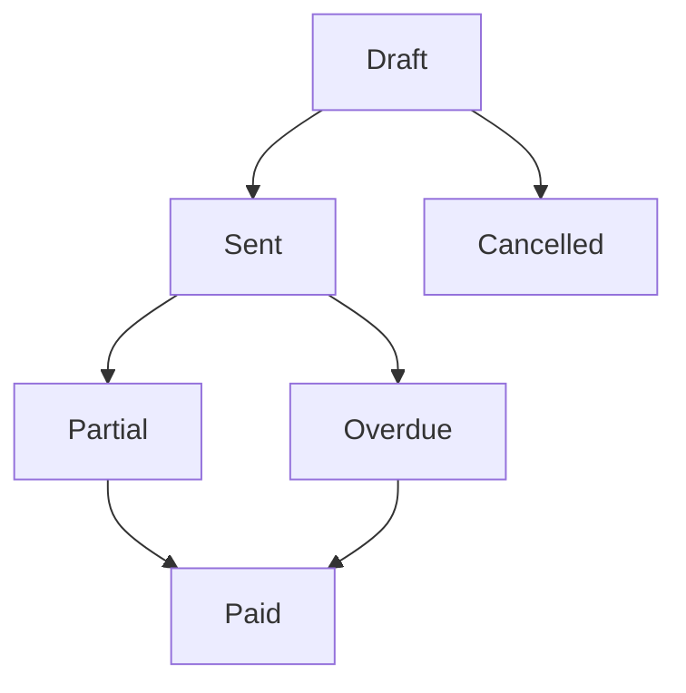

---

## 13. Loopholes, Gaps & Current Limitations

1. **List API is not branch-scoped by user.** Without a branch filter, any Read user can see all company invoices.  
2. **Summary cards** on the list are company-wide (no branch passed).  
3. **Multi-branch filter** may send several ids as one string; service treats `branchId` as a **single** id.  
4. **Approve is not on the list or detail** — only create/edit. Easy to miss.  
5. **Proforma uses the same ledger posting** as Tax on approve.  
6. **E-invoice** is only a flag (GSTIN + > ₹50,000); no IRN generation here.  
7. **Send email** uses Export, not Approve — a sent invoice can be emailed without Approve if already Sent.  
8. **List Cancel** on Sent opens credit note, not status Cancelled.  
9. **Credit note type** on the list filter does not mean a separate invoice type used for all CNs (CNs are child documents).  
10. **Direct “copy from SO”** does not set FROM_SO — SO reports may not see that invoice as linked.  
11. **Auto-draft failures** are logged; user may see no draft and no UI error.  
12. **Overdue** is not automatic until someone clicks Run Overdue Check (or a job if configured separately).  
13. **Tally export** is all invoices, not filtered.  
14. **Customer/site PDF** allowed without company Invoice Export for those roles.  
15. Draft with payment allocations cannot be deleted (correct) but UI may still show delete until the service rejects.

---

## 14. Existing Functionality Summary

Today a permitted user can create **Direct** or **From SO** drafts, receive **auto drafts** from product SO open, periodic contract billing, and visit/N-visit task completion, edit/delete/cancel **unpaid drafts**, **Approve & Send** (customer + sales + GST books), collect via receipts, issue credit notes, export Excel/Tally/PDF, email, and mark overdue. They cannot edit sent invoices, auto-approve, or push e-invoice IRN from this screen.

---

## 15. Reference — APIs, Screens & UI Actions

### 15.1 APIs

| Method | Path | Purpose (plain language) | Used by (screen/flow) |
|--------|------|--------------------------|------------------------|
| POST | `/api/v1/invoices` | Create draft | Create Invoice Save |
| PUT | `/api/v1/invoices/update` | Update draft (`id`) | Edit Save |
| GET | `/api/v1/invoices/by-id` | Full invoice | Detail, edit load |
| GET | `/api/v1/invoices` | Paged list | Invoicing list |
| GET | `/api/v1/invoices/summary` | Cards | List cards |
| DELETE | `/api/v1/invoices/delete` | Delete unpaid draft | List delete |
| POST | `/api/v1/invoices/cancel-draft` | Cancel unpaid draft | Detail cancel |
| POST | `/api/v1/invoices/approve-send` | Approve, post ledgers | Approve & Send |
| POST | `/api/v1/invoices/send` | Email PDF | Send |
| POST | `/api/v1/invoices/resend` | Re-email PDF | Resend |
| GET | `/api/v1/invoices/pdf` | PDF | Download |
| POST | `/api/v1/invoices/pdf-batch` | ZIP of PDFs | Batch PDF |
| GET | `/api/v1/invoices/attachment` | Attachment file | Detail |
| POST | `/api/v1/invoices/credit-notes` | Issue credit note | Credit note screen |
| GET | `/api/v1/invoices/credit-notes` | List CNs for invoice | Detail |
| GET | `/api/v1/invoices/credit-notes/by-id` | One CN | Credit note view |
| POST | `/api/v1/invoices/mark-overdue` | Sent/Partial past due → Overdue | Run Overdue Check |
| GET | `/api/v1/invoices/export/tally` | Tally CSV | Tally export |
| GET | `/api/v1/invoices/export/filtered` | Excel by filters | Export Excel |
| GET | `/api/v1/invoices/sales-order-site-addresses` | SO sites for customer | Create form |
| GET | `/api/v1/invoices/billing-sites` | Sites + GST for selected SOs | Create form |

Create body (business): invoiceType, creationMode, branchId, customerId, customerName, GST/address/state/contact, salesOrderId, linkedSalesOrderIds, selectedSiteIds, shipToSiteId, contractId, invoiceDate, creditPeriodDays, grandTotal, lines, notes, attachment, acknowledgeDuplicateSoInvoice.

### 15.2 Frontend Screen Routes

| Route | Screen purpose | Primary users |
|-------|----------------|---------------|
| `/Invoices` | List, cards, export, create | Sales, finance |
| `/add-invoices` | Create Direct or From SO | Add |
| `/edit-invoice` | Edit draft | Edit |
| `/invoice-detail` | View invoice | Read |
| `/credit-note` | Issue credit note | Add |
| `/receipt-entry` | Record receipt against invoice | Add + Payments |
| `/sales-order-detail` | Linked SO | From SO column |

Sidebar: **Finance & Accounts → Invoicing (Sales)**.

### 15.3 Click Events, Filters, Search & Controls

| Screen / Route | Control | Type | What happens |
|----------------|---------|------|--------------|
| `/Invoices` | Search | Text | Invoice # / customer / SO; 500 ms |
| `/Invoices` | Branch / Status / Type / Date | Filters | Reloads list |
| `/Invoices` | Export Excel | Button | Opens filter modal then Excel |
| `/Invoices` | Export PDF Batch | Button | ZIP of selected rows |
| `/Invoices` | Run Overdue Check | Button | Marks overdue |
| `/Invoices` | Tally export | Button | CSV download |
| `/Invoices` | + Create Invoice | Button | `/add-invoices` |
| `/Invoices` | Row select | Checkbox | For batch PDF |
| `/Invoices` | SO No | Link | Opens sales order |
| `/Invoices` | View / Edit / Delete | Icons | Detail / edit draft / delete draft |
| `/Invoices` | PDF | Icon | Download if issued |
| `/Invoices` | Payment / Receipt | Icons | Receipt entry or find voucher |
| `/Invoices` | Send / Resend | Icons | Email |
| `/Invoices` | Cancel | Icon | Credit note screen (issued invoices) |
| `/add-invoices` | Direct / From SO | Radio | Mode |
| `/add-invoices` | Branch, customer, SO, sites, GST, lines | Fields | Build draft |
| `/add-invoices` | Save | Button | Create Draft |
| `/add-invoices` | Approve & Send | Button | Create then approve |
| `/edit-invoice` | Same + Save / Approve & Send | Buttons | Update draft / approve |
| `/invoice-detail` | Cancel draft | Button | Unpaid draft → Cancelled |
| `/invoice-detail` | Issue Credit Note | Button | Credit note form |
| `/credit-note` | Reason, amount, date | Fields | Issues CN |

---

## 16. Tester guide — positive and negative scenarios (easy language)

Use this as a **checklist**. Expected results are what the product does **today**, including known gaps.

### 16.1 Positive — access and list

| # | Try this | Expect |
|---|----------|--------|
| P1 | User with Invoice Read | Sees list and detail; no Create |
| P2 | Add without Approve | Can save Draft; Approve & Send fails or hidden |
| P3 | Approve permission | Approve & Send turns Draft into Sent |
| P4 | Delete on unpaid Draft | Draft removed after confirm |
| P5 | Export permission | Excel, Tally, PDF work |
| P6 | Single-branch user | That branch auto-selected on list |
| P7 | Search by invoice number or customer name | Matching rows |
| P8 | Filter status Draft | Only drafts |
| P9 | Click SO number on FROM_SO row | Sales order detail opens |

### 16.2 Positive — Direct invoice

| # | Try this | Expect |
|---|----------|--------|
| P10 | Direct + branch + Active customer + one service line + Save | Draft; mode DIRECT; no SO id |
| P11 | Same then Approve & Send (ledgers exist) | Sent; customer Dr grand; sales Cr; GST Cr; pending = grand |
| P12 | Copy lines from customer’s SO on Direct mode | Lines appear; still DIRECT (not linked as FROM_SO) |
| P13 | Intra-state branch vs customer | CGST + SGST on header |
| P14 | Inter-state | IGST, no CGST/SGST |
| P15 | Credit period 30 | Due date = invoice date + 30 |
| P16 | Attach a small PDF | Saves; can download from detail |

### 16.3 Positive — From SO and auto draft

| # | Try this | Expect |
|---|----------|--------|
| P17 | From SO: pick Open service SO | Customer/branch/lines filled; FROM_SO |
| P18 | Create **Product Sale SO** as Open (not draft) | **Auto Draft** invoice appears on list |
| P19 | Release Draft product SO to Open | Auto Draft invoice created |
| P20 | Second invoice same SO same month with acknowledge | Allowed (conflict if not acknowledged) |
| P21 | Periodic Active contract, due window, no invoice this month | Scheduler creates Draft |
| P22 | Per-visit contract, auto-draft on, complete a task | Visit Draft (qty 1) |
| P23 | Every-N=2, complete 2nd visit | Draft with qty 2 |
| P24 | Approve auto draft | Same ledger posting as manual |

### 16.4 Positive — money after send

| # | Try this | Expect |
|---|----------|--------|
| P25 | Full receipt allocated | Status Paid; pending 0; list Payment icon becomes Receipt |
| P26 | Partial receipt | Status Partial; pending reduced |
| P27 | Manual credit note ≤ pending | CN issued; pending down; customer Cr on statement |
| P28 | Receipt settle-close shortfall | Auto credit note; invoice can go Paid |
| P29 | Run Overdue Check on Sent past due date | Status Overdue; overdue card increases |
| P30 | PDF on Sent | File downloads |
| P31 | Email send/resend | Success if mail configured |
| P32 | Cancel unpaid Draft from detail | Status Cancelled; row remains |

### 16.5 Negative — access and buttons

| # | Try this | Expect |
|---|----------|--------|
| N1 | No Invoice access | Menu hidden |
| N2 | Read only clicks Create | Button hidden / route blocked |
| N3 | Edit user opens Sent invoice in edit | Cannot update (only draft) |
| N4 | Delete user deletes Sent | Error: only unpaid draft |
| N5 | Add user clicks Approve & Send | Forbidden / no approve |
| N6 | Export-less user | PDF/Excel/Tally hidden |

### 16.6 Negative — create / SO rules

| # | Try this | Expect |
|---|----------|--------|
| N7 | Future invoice date | “Invoice date cannot be in the future” |
| N8 | Tax type with zero lines | At least one line required |
| N9 | Grand total not matching lines | Mismatch error ±0.02 |
| N10 | From SO with no SO selected | Sales order required |
| N11 | From SO using **Draft** or **Cancelled** SO | Not eligible for invoicing |
| N12 | Customer id ≠ SO customer | Must match SO customer |
| N13 | Invoice date before SO date | Cannot be before SO date |
| N14 | Second invoice same SO same month, no acknowledge | 409 conflict |
| N15 | Ship-to site from another branch | Must belong to invoice customer and branch |
| N16 | Credit period 0 or 366 | Validation fail |
| N17 | Unknown or inactive HSN | Error |
| N18 | HSN with only IGST on intra-state job | No tax types for intra-state |
| N19 | Product qty > branch stock | Exceeds available stock |
| N20 | Huge attachment / wrong type | Rejected |
| N21 | Duplicate invoice number (if forced) | Number already exists |

### 16.7 Negative — auto draft should **not** run

| # | Try this | Expect |
|---|----------|--------|
| N22 | Product SO saved **as Draft** | No auto invoice |
| N23 | One-time **service** SO opened | No auto invoice from product path |
| N24 | Contract mode **Manual only** | No periodic/visit auto draft |
| N25 | Periodic but **Per visit** mode | Periodic job skips that SO |
| N26 | Advance payment line (not last) | Skip auto invoice |
| N27 | Milestone SO still Open (not fulfilled) when frequency is on completion | No auto draft |
| N28 | 100% advance, customer advance too small | No auto draft |
| N29 | Already an invoice this month for that SO | No second auto (unless visit path with acknowledge) |
| N30 | Task complete but auto-draft **off** | No visit invoice |
| N31 | Same task completed twice | Second visit event skipped |
| N32 | Contract not Active | No auto draft |

### 16.8 Negative — approve, books, collect

| # | Try this | Expect |
|---|----------|--------|
| N33 | Approve with **no** Active customer ledger | Customer ledger not found/active; stays Draft |
| N34 | Approve with missing `SALES_INCOME` | No ledger configured; stays Draft |
| N35 | Approve already Sent | Only draft can be approved |
| N36 | Receipt against Draft | Should not treat as issued (allocate only issued invoices in payments) |
| N37 | Credit amount > pending | Cannot exceed pending |
| N38 | Credit note on Draft | Should fail / not offered |
| N39 | Delete draft after a receipt was allocated | Has payment activity; cannot delete |
| N40 | Inactive customer ledger then approve | Cannot post to inactive |
| N41 | Proforma approve | **Does post** same as Tax (gap — log if you expected no books) |

### 16.9 Negative — branch / customer / list

| # | Try this | Expect |
|---|----------|--------|
| N42 | Direct create without branch | Branch required; customer list empty |
| N43 | Customer of branch A while invoice branch B | Should not appear / GST sites won’t match |
| N44 | Multi-branch user, **no** branch filter | **Sees all company invoices** (gap) |
| N45 | Filter two branches at once | May not filter both (single branchId) |
| N46 | Edit customer name after Sent | Invoice still shows **old snapshot** |
| N47 | Overdue card before Run Overdue Check | Sent past due may still show Sent |

### 16.10 Suggested happy-path pack (minimum)

1. Active customer (ledger exists) + branch.  
2. Direct Tax invoice → Save Draft → Approve & Send → customer statement shows Debit.  
3. Product SO Open → auto Draft → Approve.  
4. From SO service order → Save → Approve.  
5. Receipt full amount → Paid.  
6. Credit note for a small amount on another Sent invoice.  
7. Unpaid Draft delete.  
8. Run Overdue Check on a Sent invoice with due date yesterday.  
9. PDF + Excel export.  
10. (If contract available) Per-visit auto draft on task complete → Approve.

If Approve fails, check: customer **Active** + **CUSTOMER** ledger Active, `SALES_INCOME` Active INTERNAL, HSN/tax masters, and branch stock for product lines.

---

*Documented from live Invoicing screens, invoice create/approve/credit-note services, sales-order auto-draft, contract periodic and visit billing, and ledger posting. Auto-draft rules are only the cases implemented today — not planned billing ideas.*
