# Ledger Management — Product & Business Documentation

This document describes **Ledger Management** as it exists today. It is written so a new person — operator, accountant, developer, or tester — can understand **what a ledger is**, **how books are created automatically vs by hand**, **how every money event writes debit and credit lines**, and **how the statement is built**. Negative and failure cases for testers are at the **end**.

Related: [Chart of Accounts](./chart-of-accounts.md) is the folder tree. Ledgers are the **files inside those folders** that actually receive rupees.

**Start here:** [§1.0 Quick visual atlas](#10-quick-visual-atlas-read-this-first) — whole-system flow, how a **new** book is born (auto vs manual), **Yes/No**, **status**, and **type** dropdowns. Same atlas: [COA](./chart-of-accounts.md#10-quick-visual-atlas-read-this-first) · [Invoicing](./invoicing.md#10-quick-visual-atlas-read-this-first) · [Payments](./payments.md#10-quick-visual-atlas-read-this-first).

---

## 1. Purpose & Business Need

Invoices, bills, receipts, and payments cannot post to a Chart of Accounts folder alone. They must post to a **ledger** — a named book for one party or one company account.

**Business need:** one place to:

- Create and maintain books (customer, vendor, cash, bank, tax, company income/expense)
- See opening, total debit, total credit, and closing balance
- Open a **statement** (dated lines with running balance)
- Know that sales, purchases, and money movement write **balanced** debit + credit pairs into those books

**Outcomes today:** list with summary cards; create/edit ledgers; statement with date range, PDF, and email; export catalogue and ageing file; automatic customer/vendor books when the party becomes Active; automatic posting when invoices are approved, bills confirmed, receipts/payments recorded, credit/debit notes issued, or contra/journal vouchers posted.

**What this screen does not do:** you do not type a random debit here. Money enters a ledger only when another module posts (or when you set an opening balance). There is no “add entry” button on Ledger Management.

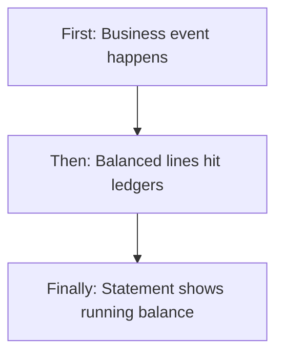

---

### 1.0 Quick visual atlas (read this first)

Use this to see **where Ledgers sit in the whole money system**, then **Yes / No**, **status**, and **type dropdowns**. Detail follows in 1.1 onward.

#### Whole accounting system (you are here)

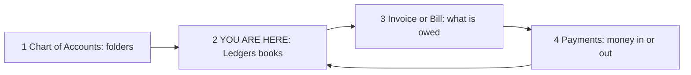

| Step | Module | What it does |
|------|--------|----------------|
| 1 | [Chart of Accounts](./chart-of-accounts.md) | Folder the book hangs under (must be **postable + Active**) |
| 2 | **Ledgers** | The book. Statement = running debit/credit |
| 3 | [Invoicing](./invoicing.md) / Bills | Approve/confirm **writes** into these books |
| 4 | [Payments](./payments.md) | Receipt/payment/contra/journal **writes** into these books |

**No ledger = invoice approve, bill confirm, and receipt/payment all fail.**

#### How a **new** ledger works (two doors)

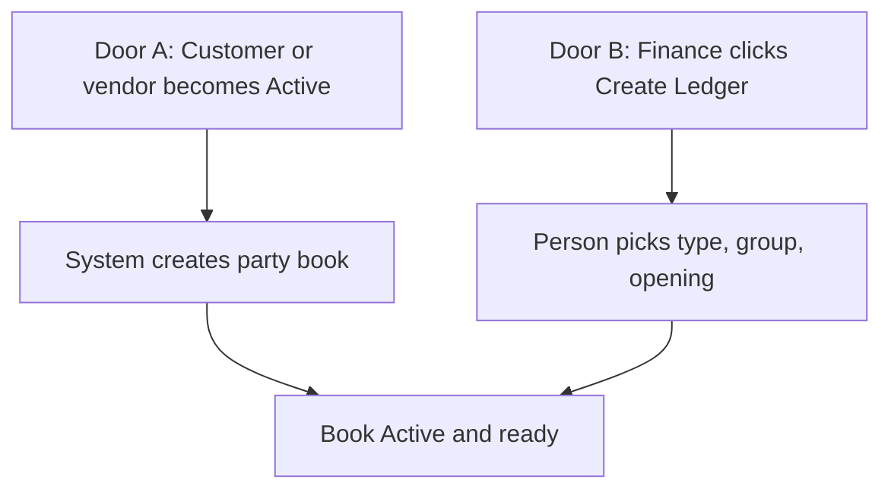

| How it is born | When | Type | Group (typical) |
|----------------|------|------|-----------------|
| **Automatic** | Customer saved **Active** | CUSTOMER | Sundry Debtors |
| **Automatic** | Vendor saved **Active** | VENDOR | Sundry Creditors |
| **Automatic** | New company seed | INTERNAL / BANK / CASH / TAX | Sales, purchase, cash, GST, TDS, advance |
| **Manual** | Create Ledger | You pick one of six types | You pick a **postable** COA head |
| **Not here** | Typing a debit on this screen | — | There is **no** add-entry button |

#### Yes / No choices (this module)

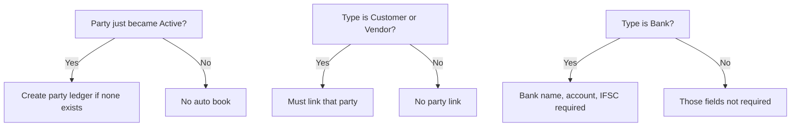

| Question | Yes | No |
|----------|-----|-----|
| Create automatically for Active party? | One book if missing | Already has Active book → skip |
| Must link customer / vendor? | When type is CUSTOMER / VENDOR | Other types |
| Bank name / IFSC required? | Type BANK | Other types |
| Can post new lines? | Status Active | Inactive → posting rejected |
| Can inactivate from this UI? | **No** (radios not saved) | Stays Active |
| Hard delete? | **No** | — |
| Request / approve to create a book? | **No** | Save = live |
| Type a random debit here? | **No** | Other modules post |
| Credit limit used to block invoice? | Stored / notified | Not a hard stop on approve |

#### Status map (this module)


| What | Values | Quick rule |
|------|--------|------------|
| Ledger status | **Active** (live UI). Inactive exists in data but **UI does not save Inactive** | Treat every on-screen book as Active |
| Statement line | **Posted** | Created by invoice / bill / voucher / note — not typed here |
| Opening side | **Debit** or **Credit** | Customer books usually Dr 0; vendor usually Cr 0 |

#### Dropdown / enum map (pick one)

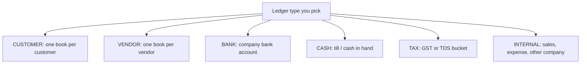

| Field | Options (exactly these) | Quick rule |
|-------|-------------------------|------------|
| Ledger type | **CUSTOMER, VENDOR, BANK, CASH, INTERNAL, TAX** | Drives which fields and which events can post |
| Opening balance type | **Debit (DR)** or **Credit (CR)** | Home side of opening |
| Account group | Postable **Active** COA heads | Folder must exist |
| Status on form | Active / Inactive shown | **Inactive is not persisted** from UI today |

**Type → who posts into it (quick):**

| Type | Typical incoming event |
|------|------------------------|
| CUSTOMER | Invoice approve (Dr), receipt (Cr), credit note (Cr) |
| VENDOR | Bill confirm (Cr), payment (Dr), debit note (Dr) |
| BANK / CASH | Receipt (Dr), payment (Cr), contra both ways |
| INTERNAL | Sales income (Cr), purchase expense (Dr), journal |
| TAX | GST on invoice/bill, TDS on vendor payment |

---

### 1.1 What is a ledger? (plain English)

| Layer | Easy name | Example |
|-------|-----------|---------|
| Chart of Accounts head | Folder | Sundry Debtors |
| **Ledger** | **File / book** | Customer “Acme Pvt Ltd” |
| Ledger entry | One line in that book | Invoice INV-12 Debit ₹11,800 |

**Customer ledger** = “how much this customer owes us / has paid.”  
**Vendor ledger** = “how much we owe this vendor / have paid.”  
**Cash / Bank ledger** = “money in the till or bank account.”  
**Internal ledger** = company buckets such as Sales Income, Purchase Expense.  
**Tax ledger** = GST / TDS buckets.

---

### 1.2 Two ways a ledger is born: automatic vs manual

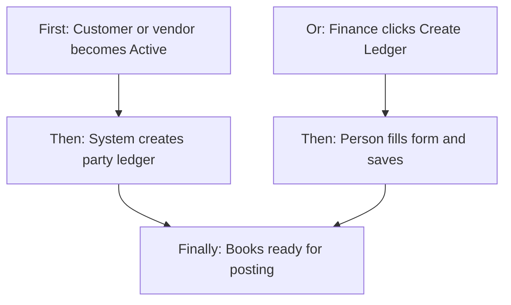

#### A) Automatic (party books)

When a **customer** is saved as **Active**, the system creates one **CUSTOMER** ledger (if none exists) under Chart of Accounts code **1000-SD (Sundry Debtors)**.

When a **vendor** is saved as **Active**, the system creates one **VENDOR** ledger under **2000-SC (Sundry Creditors)**.

| What is filled automatically | Customer book | Vendor book |
|------------------------------|---------------|-------------|
| Ledger type | CUSTOMER | VENDOR |
| Account group | Sundry Debtors | Sundry Creditors |
| Linked party | That customer | That vendor |
| Name | Customer full name | Vendor name |
| Code | `CUST_` + name slug + id (unique, max 50) | `VEND_` + name slug + id |
| Opening | 0 Debit, as-on today | 0 Credit, as-on today |
| Branch | Customer’s branch | (not copied as a required branch) |
| GST / PAN / contact | Copied from the party | Copied from the party |
| Status | Active | Active |

If that Active party **already has** an Active ledger of that type, nothing new is created (idempotent).

**Also automatic (one-shot repair):** a “bootstrap party ledgers” action can create missing books for every Active customer and vendor. It is available to Edit (or CEO). There is **no button** on the Ledger list for this today.

**Also automatic (company starter books):** new companies receive system ledgers such as `SALES_INCOME`, `PURCHASE_EXPENSE`, cash, bank, GST, TDS, customer advance — already linked to posting roles. See section 11.

#### B) Manual (Create Ledger)

Finance opens **+ Create Ledger**, picks a **postable** account group, ledger type, name/code, branch scope, opening, and (if customer/vendor) the linked party. Save creates the book immediately as **Active**.

If the ledger code is a known posting role (for example `SALES_INCOME`), Save also **links that book** so invoice/bill posting uses it.

#### When to use which

| Situation | Use |
|-----------|-----|
| New Active customer / vendor | Automatic party ledger is enough for invoices/bills |
| Extra customer book, or old party with no book | Manual Create, type CUSTOMER, link that customer |
| Cash / extra bank / rent expense / capital | Manual Create |
| Sales/purchase/tax system books missing | Manual with **exact** codes, or rely on company seed |
| Many old parties with no books | Bootstrap (service); or create one by one |

---

### 1.3 How money actually enters a ledger (cross entry)

A **cross entry** means: one business event writes **two or more lines** whose **total debit = total credit**. Each line sits on a **different** ledger. The statement of one ledger shows only **its** side; the other side is on the other book.

**Rule enforced on balanced postings:** totals must match within 2 paise; a line cannot be both debit and credit; you cannot post to an **Inactive** ledger; amounts cannot be negative.

```text
  Same voucher / invoice / bill
  ┌─────────────────────┬─────────────────────┐
  │ DEBIT (left)        │ CREDIT (right)      │
  │ Ledger A  ₹ X       │ Ledger B  ₹ X       │
  └─────────────────────┴─────────────────────┘
  Statement of A shows Dr ₹X
  Statement of B shows Cr ₹X
```

You do **not** create these lines on Ledger Management. They appear after the source document is posted.

---

## 2. Users & Roles (who uses this and why)

### 2.1 Company CEO / Owner

Full Ledger Management access. Sets up books, exports, reviews statements.

### 2.2 Finance / accounts staff

Staff with Ledger Management permissions maintain books, open statements, export, and email statements (email button on the statement screen is gated as Edit in the UI).

### 2.3 Sales / purchase operators (other modules)

They do not edit ledgers. Their **Approve invoice / Confirm bill / Record receipt or payment** writes into ledgers. They fail if the party ledger or system ledger is missing or inactive.

### 2.4 Super Admin / platform bypass

Full UI access.

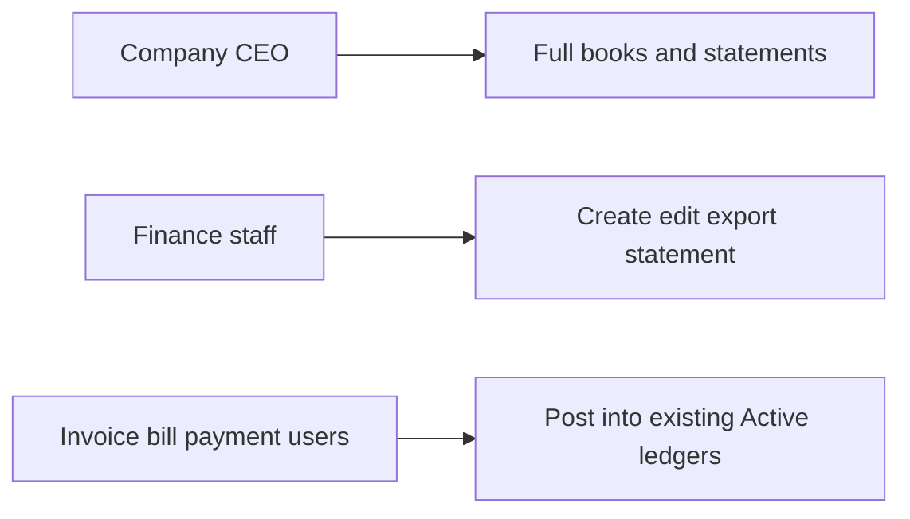

---

## 3. Access Control (RBAC)

### 3.1 How access works

Sidebar **Finance & Accounts → Ledger Management** requires Ledger Management access (or CEO / Super Admin).

| Permission | Allows |
|------------|--------|
| **Read** | List, summary cards, detail/statement, statement PDF (service), posting-binding list (service) |
| **Add** | **+ Create Ledger** and save new book |
| **Edit** | Edit ledger; rebuild postings (no-op); bootstrap party ledgers (no UI); posting-binding update (on save of known codes); **Email to Party** button on statement |
| **Export** | Export All CSV; Ageing Report Excel; statement PDF button on the statement screen |
| **Delete** | May be granted on a role; **no delete/inactivate action** on the list |
| **Approve / Request** | Not used by this module |

### 3.2 Role × action matrix

| Role | View list | View detail | Add | Edit | Inactive / Delete | Submit request | Receive / act | Approve | Reject |
|------|-----------|-------------|-----|------|-------------------|----------------|---------------|---------|--------|
| Company CEO | Yes | Yes | Yes | Yes | No hard delete; Inactive radio does not save | No | No | No | No |
| Super Admin / Seravion bypass | Yes | Yes | Yes | Yes | Same | No | No | No | No |
| Staff with Ledger Read | Yes | Yes | No | No | No | No | No | No | No |
| Staff with Ledger Add | Yes | Yes | Yes | No | No | No | No | No | No |
| Staff with Ledger Edit | Yes | Yes | No | Yes | Status radio visible but not saved | No | No | No | No |
| Staff with Ledger Export | Yes | Yes | No | No | No | No | No | No | No |
| Other employees | No | No | No | No | No | No | No | No | No |

**Record-level rules:**

- List is limited to the user’s branches **plus company-wide books** (no branch on the ledger).
- One Active **CUSTOMER** ledger per customer and one Active **VENDOR** ledger per vendor is what posting looks up. Extra manuals with the same party are not used by invoice/bill posting.
- Posting to Inactive is blocked.

This module does **not** use request / approve for creating or changing a ledger.

---

## 4. Capabilities & Features

### 4.1 Catalogue and summary

List of ledgers with search, status/branch/account-group filters, pagination. Four cards: Total Receivable, Total Payable, Cash & Bank, Overdue (>30d).

**How cards are computed today:**

| Card | Meaning in product today |
|------|--------------------------|
| Total Receivable | Sum of **positive (debit)** closings on **CUSTOMER** ledgers |
| Total Payable | Sum of **credit** closings (absolute) on **VENDOR** ledgers |
| Cash & Bank | Sum of **positive (debit)** closings on **BANK** and **CASH** ledgers |
| Overdue (>30d) | Always **₹ 0** — not calculated from due dates |

### 4.2 Create / edit ledger

Manual master for all six types. Party section for customer/vendor; bank section for BANK. Opening balance and credit limit/period/TDS on the financial section.

### 4.3 Statement

Dated lines for one ledger, default Indian financial year (1 Apr → today). Running balance, PDF, email to party (or override address), click-through to the source invoice/bill/voucher/credit note.

### 4.4 Export

- All ledgers CSV: id, code, name, type, status, contact email  
- Ageing Excel: id, name, type, balance, DR/CR — **not** 30/60/90 day buckets despite the list card label

### 4.5 Automatic party books and posting role links

See §1.2 and §10.

### 4.6 Notifications

New ledger created; credit limit exceeded after a posting (if credit limit > 0 and closing goes above it).

---

## 5. CRUD Operations

### 5.1 Create (Add)

**Who:** Add or CEO / bypass.

**First:** **+ Create Ledger**.  
**Then:** Choose postable account group (type is guessed, can override), name, optional code (else derived from the head), branch scope, opening, and linked customer/vendor if type is CUSTOMER/VENDOR. Bank fields required for BANK.  
**Finally:** **Save**. Book is **Active**. If code matches a posting role, it is linked for invoice/bill posting. User returns to the list.

**Required:** Name, account group, branch scope (all branches or one branch), opening type and as-on date, ledger type. Customer/vendor must be linked for those types. BANK requires bank name, account number, IFSC.

**Success:** “Ledger saved successfully” or “Ledger saved and linked for invoice/bill posting.” Duplicate code is rejected.

### 5.2 Read — List

**Who:** Read.

Loads the user’s branch set (or selected branches) including company-wide books. Search (name, code, GSTIN, PAN) after 500 ms. Filters: Status, Branch (hidden if one or zero branches; auto-applied if exactly one), Account Group (postable heads).

**Columns:** Ledger Name, Account Group (shows head **id**, not name), GSTIN/PAN, Opening, Total Debit, Total Credit, Closing, View / Edit.

**No checkboxes. No delete.**

### 5.3 Read — Detail / Statement

**Who:** Read. Open eye on a row → statement screen.

Loads ledger + statement lines for From/To. Default From = 1 April of current Indian FY; To = today (or 31 March if FY already ended). **Generate** reloads. See §8.3 and §9.3 for how the running balance is built.

### 5.4 Update (Edit)

**Who:** Edit.

From list pencil → edit form. **Locked:** ledger code, name, account group. **Editable:** type, branch, status radios (see gap), party, bank, opening and credit fields.

**Finally:** Save. May re-link posting role from the (locked) code.

### 5.5 Inactive / Delete

**Hard delete:** not offered.

**Inactive:** Status radios exist on the **edit** form (not on create). Save **does not send status**. Create always forces Active. There is no activate/inactivate action on the list. **You cannot park a ledger from the product UI today.** Filter “Inactive” will usually be empty.

---

## 6. Request & Approval Flows

This module does **not** use request / approve. Ledger create/update is immediate.

Invoice approve, bill confirm, and payment record are **other modules**. Those actions **post into** ledgers; they are not Ledger Management approvals.

---

## 7. Forms — Add vs Edit Field Access

Create uses **Create Ledger**. Edit uses **Edit Ledger** (separate screen).

| Field (business name) | On Add | On Edit | Notes |
|----------------------|--------|---------|-------|
| Ledger code | Editable; optional if head has a code | **Locked** | Exact codes needed for system posting (`SALES_INCOME`, etc.) |
| Ledger name | Required, editable | **Locked** | |
| Account group | Required; postable heads only | **Locked** | |
| Ledger type | Required after group; guessed from group | Editable | CUSTOMER / VENDOR / BANK / CASH / INTERNAL / TAX |
| Branch scope | Required; All branches or one | Editable | Single-branch user: read-only that branch |
| Status | Hidden (always Active on create) | Radios shown | **Not saved** |
| Linked customer / vendor | Required if type CUSTOMER / VENDOR | Editable | Selecting party fills GST, PAN, contact |
| GSTIN / PAN / contact / address | Shown for customer/vendor | Editable | GSTIN/PAN/phone/email format checks |
| Bank name / account / IFSC / type / branch | Shown and required for BANK | Editable | |
| Opening balance | Editable, ≥ 0 | Editable | Not a posted line; used as statement start |
| Opening type | DR / CR required | Editable | |
| Opening as on | Required, default today | Editable | |
| Credit limit / period | Editable | Editable | Limit triggers notice after posting |
| TDS applicable / section | Editable | Editable | Used as master data; bill/payment still carry their own TDS amounts |

---

## 8. Lists, Dropdowns, Details & Data Rendering

### 8.1 List rendering

| Item | Behavior |
|------|----------|
| Sort | Newest updated/created first (when not filtering by balance type) |
| Search | Name, code, GSTIN, PAN |
| Filters | Status, Branch, Account group |
| Pagination | Server-side |
| Summary cards | Recalculated from **all** ledgers (not only the current page/filter) |
| Account group column | Raw head id |
| Empty | Empty table / loading |

### 8.2 Dropdowns & lookups

| Dropdown | Options | Depends on |
|----------|---------|------------|
| Account group | **Active + postable** COA heads | Needs Chart of Accounts Read (or CEO) to load |
| Ledger type | Six types | After account group |
| Branch scope | All branches + user’s branches | |
| Linked customer | Customer dropdown | Type CUSTOMER |
| Linked vendor | Vendor dropdown | Type VENDOR |
| List account group filter | Same postable heads | |
| Payment/receipt bank picker (other module) | BANK and CASH ledgers | |

### 8.3 Statement rendering

| Control | What you see |
|---------|----------------|
| From / To | Date inputs; Generate reloads |
| Period line | “Statement period: from to to” |
| Basic / party / bank cards | Master fields |
| Opening / totals strip | If lines exist: opening inferred from first line’s running balance minus that line; period Dr/Cr; closing from last line. If **no lines**, uses ledger lifetime totals |
| Table | Date, Ref # (clickable), Particulars (type + narration), Debit, Credit, running Balance |
| Empty period | No rows; closing falls back to ledger closing |
| PDF / Ageing Excel / Export CSV / Email | Header buttons (Export vs Edit gates — see gaps) |

**Click Ref #:**

| Source type | Opens |
|-------------|--------|
| INVOICE | Invoice detail |
| BILL | Bill view |
| RECEIPT / PAYMENT / CONTRA / JOURNAL | Voucher view |
| CREDIT_NOTE | Credit note view |
| DEBIT_NOTE | **No screen linked** — number is plain text |

---

## 9. How It Works (end-to-end user flows)

### 9.1 Finance — Manual create

**First:** Create Ledger, pick group and type.  
**Then:** Fill name, opening, link party if needed.  
**Finally:** Save → list; book is Active and ready to receive postings.

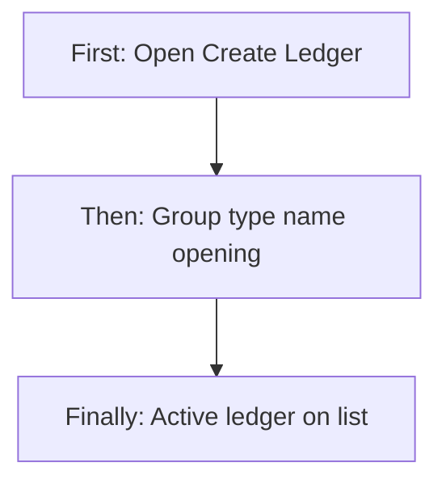

### 9.2 Sales / vendor admin — Automatic party book

**First:** Save customer or vendor as Active.  
**Then:** System creates Sundry Debtors / Creditors ledger if missing.  
**Finally:** Approve invoice / confirm bill can find that party book.

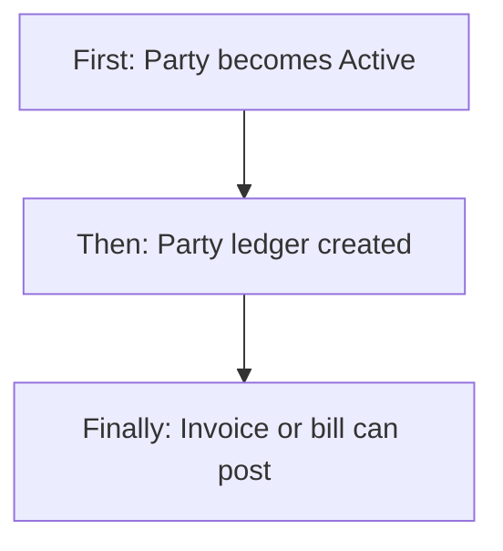

### 9.3 Finance — Read a statement

**First:** Open a ledger (eye). Default FY dates load.  
**Then:** Change From/To and Generate if needed.  
**Finally:** Read lines, download PDF, or email. Click a ref to open the source document.

**How each line’s running balance is built (in depth):**

1. Start with the ledger’s **opening balance**. If opening type is Credit, treat it as negative.  
2. Load **only entries whose date is between From and To** (oldest first).  
3. For each line: running = running + Debit − Credit.  
4. Show absolute amount and DR if running ≥ 0, else CR.  
5. **Entries before From are not added.** So a mid-year date range does **not** start from “balance as of From”; it starts from original opening plus only in-range lines. Testers must use this when checking numbers.

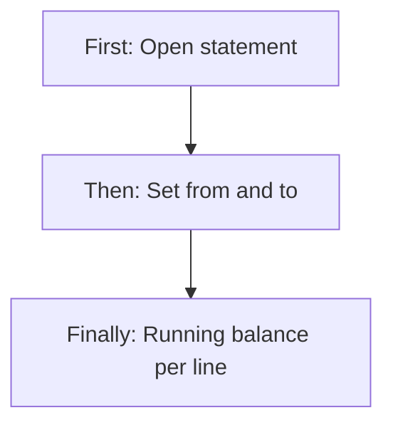

### 9.4 Finance — Edit after use

**First:** Edit.  
**Then:** Change contact, opening, type, branch — not code/name/group.  
**Finally:** Save. Historical statement lines are **not** rewritten.

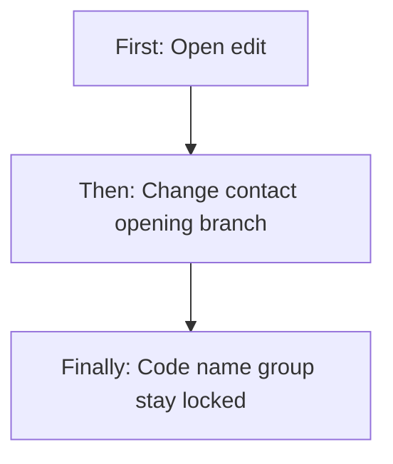

### 9.5 Operator — Invoice approved (sales cross entry)

**First:** Draft invoice exists; customer has Active CUSTOMER ledger; `SALES_INCOME` (or binding) is Active INTERNAL.  
**Then:** Approve and send.  
**Finally:** Customer book Debit grand total; Sales Income Credit (taxable-ish remainder); GST output ledgers Credit tax. All same voucher number = invoice number.

### 9.6 Operator — Bill confirmed (purchase cross entry)

**First:** Draft bill; vendor Active VENDOR ledger; `PURCHASE_EXPENSE` Active INTERNAL.  
**Then:** Confirm.  
**Finally:** Purchase Expense Debit taxable; GST input Debit tax; Vendor Credit net payable; if TDS, TDS Payable Credit TDS.

### 9.7 Operator — Receipt / payment / contra / journal

See §10.2 for exact debit/credit per case.

---

## 10. Cross-Module Interactions

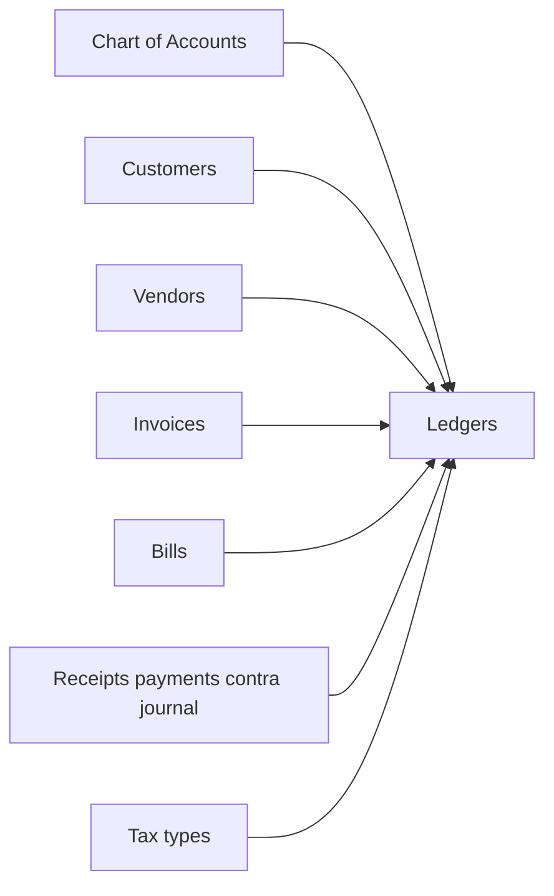

| Area | Handoff |
|------|---------|
| **Chart of Accounts** | Every ledger hangs on a postable head. Dropdown needs COA Read. |
| **Customers** | Active → auto CUSTOMER ledger. Invoice/receipt lookup: Active CUSTOMER ledger for that customer id. |
| **Vendors** | Active → auto VENDOR ledger. Bill/payment lookup: Active VENDOR ledger for that vendor id. |
| **Invoices** | Approve/send and credit notes post INVOICE / CREDIT_NOTE lines. |
| **Bills** | Confirm and debit notes post BILL / DEBIT_NOTE lines. Payment shortfall can auto-issue a debit note. |
| **Payments / Receipts** | RECEIPT, PAYMENT, CONTRA, JOURNAL lines. Bank/cash ledger id is chosen on the voucher. |
| **Tax** | GST split uses tax ledgers (TAX or INTERNAL) via posting roles. |
| **Role Configuration** | Ledger Management actions. |
| **Branches** | Branch scope on the book; list includes company-wide (no branch). |
| **Petty cash** | **Does not write** these GL ledger entries today. |
| **Stock “ledger”** | Inventory quantity books — **different product**, not this module. |

Posting-role list/update/clear exists as a finance setup service. The Ledger **list has no bindings screen**; bindings update when you save a ledger whose **code** matches a known role.

---

### 10.1 Posting roles (which system book is used)

Invoice/bill/tax/advance posting does **not** pick a ledger by name each time. It uses a **role**, then:

1. If a binding exists for that role → that ledger (must be Active; INTERNAL, or TAX/INTERNAL for tax roles).  
2. Else a ledger whose **code** is the default (e.g. `SALES_INCOME`) or the role name.

| Role (what happens) | Default ledger code | Typical type |
|---------------------|---------------------|--------------|
| Invoice approve (income) | SALES_INCOME | INTERNAL |
| Sales credit note | SALES_ADJUSTMENT | INTERNAL |
| Bill confirm (expense) | PURCHASE_EXPENSE | INTERNAL |
| Purchase debit note | PURCHASE_ADJUSTMENT | INTERNAL |
| GST CGST/SGST/IGST/CESS output | GST_*_OUTPUT | TAX |
| GST CGST/SGST/IGST/CESS input | GST_*_INPUT | TAX |
| TDS payable | TDS_PAYABLE | TAX |
| Customer advance (receipt with advance) | CUSTOMER_ADVANCE | INTERNAL |

---

### 10.2 Cross-entry map — what hits which ledger (every live scenario)

Use this as the source of truth for “what enters on payment / invoice / bill.” Amounts are the document amounts, not typed on the ledger screen.

#### Scenario A — Sales invoice approved and sent

| Ledger | Side | Amount | Statement ref |
|--------|------|--------|----------------|
| Customer (linked to invoice customer) | **Debit** | Grand total (incl. tax) | INVOICE |
| Sales Income (role) | **Credit** | Grand total minus GST credits | INVOICE |
| Each GST output ledger used | **Credit** | That tax amount | INVOICE |

**If this fails:** “Customer ledger not found/active”; missing/inactive `SALES_INCOME`; tax posting > grand total; unbalanced lines.

**Customer statement after invoice:** Debit (they owe more).  
**Sales Income statement:** Credit (revenue up).

#### Scenario B — Customer pays (receipt, no advance applied)

| Ledger | Side | Amount | Ref |
|--------|------|--------|-----|
| Bank or Cash chosen on receipt | **Debit** | Amount received | RECEIPT |
| Customer | **Credit** | Same amount | RECEIPT |

**Customer statement:** Credit (owe less). **Bank:** Debit (cash in).

#### Scenario C — Receipt that also applies customer advance

| Ledger | Side | Amount | Ref |
|--------|------|--------|-----|
| Bank/Cash | **Debit** | Cash portion | RECEIPT |
| Customer Advance | **Debit** | Advance applied | RECEIPT |
| Customer | **Credit** | Cash + advance | RECEIPT |

Advance applied cannot exceed unused advance for that customer.

#### Scenario D — Sales credit note

| Ledger | Side | Amount | Ref |
|--------|------|--------|-----|
| Sales Adjustment | **Debit** | Taxable portion (prorated) | CREDIT_NOTE |
| GST output (prorated) | **Debit** | Tax portion | CREDIT_NOTE |
| Customer | **Credit** | Credit note amount | CREDIT_NOTE |

Reduces what the customer owes.

#### Scenario E — Purchase bill confirmed

| Ledger | Side | Amount | Ref |
|--------|------|--------|-----|
| Purchase Expense | **Debit** | Taxable | BILL |
| GST input ledgers | **Debit** | Input tax | BILL |
| Vendor | **Credit** | Net payable | BILL |
| TDS Payable (if TDS on bill) | **Credit** | TDS amount | BILL |

**Vendor statement:** Credit (we owe more).

#### Scenario F — Payment to vendor (no TDS on voucher)

| Ledger | Side | Amount | Ref |
|--------|------|--------|-----|
| Vendor | **Debit** | Amount paid | PAYMENT |
| Bank/Cash chosen | **Credit** | Amount paid | PAYMENT |

**Vendor statement:** Debit (we owe less). **Bank:** Credit (money out).

#### Scenario G — Payment with TDS on the voucher

| Ledger | Side | Amount | Ref |
|--------|------|--------|-----|
| Vendor | **Debit** | Amount paid **+ TDS** | PAYMENT |
| Bank/Cash | **Credit** | Amount paid (cash out) | PAYMENT |
| TDS Payable | **Credit** | TDS | PAYMENT |

#### Scenario H — Purchase debit note

| Ledger | Side | Amount | Ref |
|--------|------|--------|-----|
| Vendor | **Debit** | Vendor portion (prorated net) | DEBIT_NOTE |
| Purchase Adjustment | **Credit** | Taxable portion | DEBIT_NOTE |
| GST input | **Credit** | Tax portion | DEBIT_NOTE |
| TDS Payable (if TDS portion) | **Debit** | TDS portion | DEBIT_NOTE |

#### Scenario I — Payment shortfall with “settle and close”

Creates an **automatic debit note** for the unpaid remainder, which posts Scenario H, then the payment posts Scenario F/G. Bill can become Paid.

#### Scenario J — Contra (cash ↔ bank or bank ↔ bank)

Only **Active BANK or CASH** ledgers. From and To must differ. Amount > 0. If source has a positive debit closing, amount cannot exceed it.

| Ledger | Side | Amount | Ref |
|--------|------|--------|-----|
| Destination (To) | **Debit** | Transfer amount | CONTRA |
| Source (From) | **Credit** | Transfer amount | CONTRA |

#### Scenario K — Manual journal (Payments module)

User enters two or more lines; totals must balance; each line one side only; ledgers Active.

| Each journal line | Side | Amount | Ref |
|-------------------|------|--------|-----|
| Chosen ledger | Debit or Credit | Line amount | JOURNAL |

#### Scenario L — Opening balance (not a voucher)

Stored on the ledger master. It is the **starting running figure** on the statement. It is **not** listed as a dated voucher line.

#### Scenario M — Credit limit breach

After a posting, if credit limit > 0 and closing (signed) **exceeds** the limit, a “Credit Limit Exceeded” notice is raised. Posting is **not** blocked.

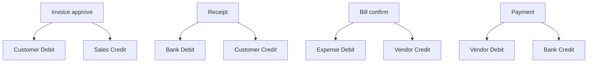

**Draft invoice / draft bill:** no ledger lines until approve / confirm.

---

### 10.3 Statement vs list closing

| Number | How it is built |
|--------|-----------------|
| List Total Debit / Credit | All **POSTED** lines on that ledger (all dates) |
| List Closing | Opening (± CR) + all posted Dr − all posted Cr |
| Statement lines | Lines with date in From–To (**does not skip** non-posted in the date query) |
| Statement running | Opening + **only in-range** lines |
| Summary cards | From all ledgers’ closings as above |

---

## 11. Data the Business Cares About

### 11.1 Ledger master

Ledger code (unique), name, account group, type (CUSTOMER, VENDOR, BANK, CASH, INTERNAL, TAX), linked customer or vendor, branch or all branches, opening amount/type/date, credit limit/period, TDS flags, party GST/PAN/contact, bank details, status (Active/Inactive in data; UI cannot change it), computed totals and closing.

### 11.2 Ledger entry (statement line)

Date, voucher number, branch, ledger, debit amount **or** credit amount, source type (INVOICE, BILL, RECEIPT, PAYMENT, CREDIT_NOTE, DEBIT_NOTE, JOURNAL, CONTRA), source id, narration, posting status (POSTED; REVERSED allowed in data but not used by current posting).

### 11.3 Seeded company books (typical new tenant)

| Code | Name | Type | Used for |
|------|------|------|----------|
| SALES_INCOME | Sales Income | INTERNAL | Invoice income |
| PURCHASE_EXPENSE | Purchase Expense | INTERNAL | Bill expense |
| SALES_ADJUSTMENT | Sales Adjustment | INTERNAL | Credit notes |
| PURCHASE_ADJUSTMENT | Purchase Adjustment | INTERNAL | Debit notes |
| GST_*_OUTPUT / INPUT | GST tax books | TAX | Tax on invoice/bill |
| TDS_PAYABLE | TDS Payable | TAX | TDS |
| CUSTOMER_ADVANCE | Customer Advance | INTERNAL | Receipt advance |
| CASH_MAIN / BANK_MAIN | Cash / Bank | CASH / BANK | Money in/out |

---

## 12. Rules, Validations & Constraints

| Rule | Outcome |
|------|---------|
| Code unique | “Ledger code already exists” |
| Name, group, type, opening type, opening date required | Cannot save |
| Customer/vendor type must link that party (form) | Error on Save |
| BANK requires bank name, account, IFSC (form) | Error |
| GSTIN / PAN / phone / email format if filled | Error |
| Opening / credit limit ≥ 0 (form) | Error |
| Sales income/adjustment heads expect exact codes `SALES_INCOME` / `SALES_ADJUSTMENT` (form) | Error |
| Cannot post to Inactive | “Cannot post to inactive ledger” |
| Balanced posting: Dr = Cr within ₹0.02 | “Unbalanced posting…” |
| One line cannot be both Dr and Cr | Rejected |
| Invoice approve needs Active customer ledger | “Customer ledger not found/active” |
| Bill confirm / payment needs Active vendor ledger | “Vendor ledger not found/active” |
| Receipt/payment needs existing bank/cash ledger id | Not found |
| Contra: different Active BANK/CASH; amount ≤ source positive balance | Error |
| Journal: ≥ 2 lines, balanced, Active ledgers | Error |
| Email statement needs an email (override or contact email) | “Party email not available…” |
| COA head must exist | Cannot save ledger to a deleted head |
| Parent COA / ledger delete restricted at database | No UI delete anyway |

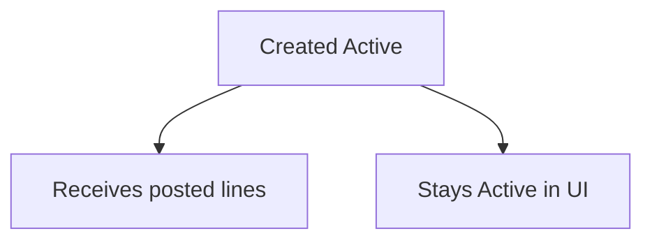

No Inactive transition from the product screens.

---

## 13. Loopholes, Gaps & Current Limitations

1. **Cannot inactivate from UI.** Status radios on edit are not saved; create always Active.  
2. **Delete permission** unused.  
3. **Overdue card always ₹0.** Ageing Excel is current balance only, not 30/60/90 days.  
4. **Statement date range** ignores activity before From when computing running balance.  
5. **Account group** on list/detail shows head id, not name (detail may show name only if provided; response today has id only).  
6. **Email** button gated as **Edit**; PDF gated as **Export**; services allow PDF on **Read** and email on **Read**. Mismatch for testers.  
7. **Rebuild postings** does nothing.  
8. **Bootstrap party ledgers** has no list button.  
9. **No posting-bindings screen**; only auto-link on save of known codes.  
10. **Debit note** refs are not clickable on the statement.  
11. **Print** on statement is commented out.  
12. **Opening change on edit** changes future statement start without rewriting history as a voucher.  
13. **Edit locks** are UI-only (code/name/group).  
14. **Petty cash** does not post here.  
15. **Credit limit** notifies but does not block.  
16. **Duplicate party ledgers:** posting uses the lookup “one Active CUSTOMER/VENDOR for that id” — a second manual book for the same party will not receive invoice/bill lines.  
17. **COA Read required** to load account groups on Create.  
18. **Legacy `/ledger`** mock-style route still exists; live list is `/ledger-dashboard`.  
19. **Add Ledger Save** on create screen is not wrapped in the same permission button helper as the list (route is still protected).  
20. **GSTIN required** on edit party section label; create validation only checks format if filled.

---

## 14. Existing Functionality Summary

Today a permitted user can:

- See all (in-scope) ledgers with closing balances and four summary cards  
- **Create** customer, vendor, bank, cash, internal, and tax books under postable COA heads  
- **Edit** contact, opening, type, branch (not code/name/group)  
- Rely on **automatic** Active customer/vendor books  
- Open a **statement**, change dates, **PDF**, **email**, jump to invoice/bill/voucher/credit note  
- **Export** CSV and ageing Excel  
- Receive **automatic balanced entries** from invoice approve, credit note, bill confirm, debit note, receipt, payment (with/without TDS/advance), contra, and journal  

They cannot: type a free debit on this screen; inactivate/delete a ledger in the UI; see true overdue ageing; rebuild historical postings; post petty cash into these books.

---

## 15. Reference — APIs, Screens & UI Actions

### 15.1 APIs

| Method | Path | Purpose (plain language) | Used by (screen/flow) |
|--------|------|--------------------------|------------------------|
| POST | `/api/v1/ledgers` | Create ledger (always Active) | Create Ledger Save |
| PUT | `/api/v1/ledgers/update` | Update ledger (`id`) | Edit Ledger Save |
| GET | `/api/v1/ledgers/by-id` | One ledger + totals | Edit, statement header |
| GET | `/api/v1/ledgers` | Paged list (branches, heads, statuses, search, optional balance types) | Ledger list |
| GET | `/api/v1/ledgers/statement` | Statement lines (`ledgerId`, `from`, `to`) | View statement |
| GET | `/api/v1/ledgers/{ledgerId}/statement/pdf` | Statement PDF | Download PDF |
| POST | `/api/v1/ledgers/{ledgerId}/statement/email` | Email PDF (`from`, `to`, optional `toEmail`) | Email to Party |
| GET | `/api/v1/ledgers/summary` | Receivable / payable / cash cards | List cards |
| GET | `/api/v1/ledgers/ageing` | Per-ledger balance list | Ageing Excel source |
| GET | `/api/v1/ledgers/export` | CSV catalogue | Export All |
| GET | `/api/v1/ledgers/ageing-report` | Ageing Excel | Ageing Report |
| POST | `/api/v1/ledgers/rebuild-postings` | No-op rebuild | No UI |
| POST | `/api/v1/ledgers/bootstrap/party-ledgers` | Create missing party books | No UI |
| GET | `/api/v1/ledgers/posting-bindings` | List posting roles and effective books | No dedicated screen |
| PUT | `/api/v1/ledgers/posting-bindings` | Set bindings | After save if code is a known role |
| DELETE | `/api/v1/ledgers/posting-bindings` | Clear one binding (`postingKey`) | No UI |

Create/update body (business): ledgerCode, ledgerName, accountHeadId, ledgerType, linkedCustomerId, linkedVendorId, branchId, openingBalance, openingBalanceType, openingAsOn, creditLimit, creditPeriodDays, tdsApplicable, tdsSection, party and bank contact fields. **Status is not in the update body.**

### 15.2 Frontend Screen Routes

| Route | Screen purpose | Primary users |
|-------|----------------|---------------|
| `/ledger-dashboard` | Live list, cards, export, create | Finance |
| `/add-ledger` | Create ledger | Finance with Add |
| `/edit-ledger` | Edit ledger | Finance with Edit |
| `/view-ledger` | Statement | Finance with Read |
| `/chart-account` | COA folders ledgers hang under | Finance |
| `/ledger` | Legacy / not the live dashboard | Avoid |

Sidebar: **Finance & Accounts → Ledger Management** → `/ledger-dashboard`.

### 15.3 Click Events, Filters, Search & Controls

| Screen / Route | Control | Type | What happens |
|----------------|---------|------|--------------|
| `/ledger-dashboard` | Search | Text | Name/code/GSTIN/PAN; 500 ms debounce |
| `/ledger-dashboard` | Status | Tags | Active / Inactive |
| `/ledger-dashboard` | Branch | Multi-select | Hidden if ≤1 branch; auto-applied if 1 |
| `/ledger-dashboard` | Account group | Multi-select | Postable heads |
| `/ledger-dashboard` | Page / size | Pagination | Reloads list |
| `/ledger-dashboard` | Ageing Report | Button | Downloads Excel (Export) |
| `/ledger-dashboard` | Export All | Button | Downloads CSV (Export) |
| `/ledger-dashboard` | + Create Ledger | Button | `/add-ledger` (Add) |
| `/ledger-dashboard` | View | Icon | `/view-ledger` with ledger id |
| `/ledger-dashboard` | Edit | Icon | `/edit-ledger` with ledger id |
| `/add-ledger` | Ledger code / name / group / type / branch | Fields | See §7 |
| `/add-ledger` | Fill PURCHASE_EXPENSE | Button | Sets code if empty (expense-like internal) |
| `/add-ledger` | Linked party | Select | Loads GST/PAN/contact |
| `/add-ledger` | Party / bank / financial fields | Inputs | Shown by type |
| `/add-ledger` | Save / Cancel | Buttons | Create or back |
| `/edit-ledger` | Same fields | Mixed lock | Code/name/group locked; status radios unused |
| `/edit-ledger` | Save | Button | Update (Edit) |
| `/view-ledger` | From / To | Dates | Statement range |
| `/view-ledger` | Email override | Text | Optional inbox |
| `/view-ledger` | Generate | Button | Reload statement |
| `/view-ledger` | Download PDF | Button | PDF (Export in UI) |
| `/view-ledger` | Ageing report / Export all | Buttons | Same files as list |
| `/view-ledger` | Email to Party | Button | Sends PDF (Edit in UI) |
| `/view-ledger` | Back to List | Button | Dashboard |
| `/view-ledger` | Ref # | Link | Opens source document |

---

## 16. Tester guide — negative and edge scenarios (easy language)

Use this section as a **test checklist**. Expected results are what the product does **today**, including known gaps. “Should fail” means the user must see an error and **no** (or no extra) ledger lines.

### 16.1 Access and buttons

| # | Try this | Expect |
|---|----------|--------|
| T1 | User with **no** Ledger access | No Ledger Management menu; routes blocked |
| T2 | **Read only** | List and statement open; no Create; no Edit icon; Export/Email follow their gates |
| T3 | **Add** without Edit | Can create; cannot open edit; can view if Read is also granted (typical roles include Read) |
| T4 | **Edit** without Add | Can edit existing; no Create button |
| T5 | **Export** without Edit | Ageing/CSV/PDF buttons show; Email to Party hidden |
| T6 | **Edit** without Export | Email shows; PDF/CSV/Ageing hidden on statement even though Read can call PDF on the service |
| T7 | CEO / Super Admin | All of the above allowed |

### 16.2 Create ledger — must fail or warn

| # | Try this | Expect |
|---|----------|--------|
| T8 | Save with empty name or no account group | Validation; no new ledger |
| T9 | No branch scope (multi-branch) | “Select all branches or a specific branch” |
| T10 | Type CUSTOMER without linked customer | Must link customer |
| T11 | Type VENDOR without linked vendor | Must link vendor |
| T12 | Type BANK without bank name / account / IFSC | Required field errors |
| T13 | Bad GSTIN / PAN / 9-digit phone / bad email | Format errors |
| T14 | Opening or credit limit negative | Must be ≥ 0 |
| T15 | Duplicate ledger code | “Ledger code already exists” |
| T16 | Sales Income head but code not exactly `SALES_INCOME` | Form error about invoice approve-send |
| T17 | Sales Adjustment head but code not `SALES_ADJUSTMENT` | Form error about credit notes |
| T18 | User has no Chart of Accounts Read (and is not CEO) | Account group dropdown empty / load error; cannot create properly |
| T19 | Pick a **group** (non-postable) COA head | Not in dropdown (only postable) |

### 16.3 Automatic party ledger

| # | Try this | Expect |
|---|----------|--------|
| T20 | Create customer as **Draft** | **No** customer ledger yet |
| T21 | Same customer set **Active** | One CUSTOMER ledger under Sundry Debtors; name = customer; opening 0 DR |
| T22 | Save that Active customer again | **No second** ledger |
| T23 | Create Active vendor | One VENDOR ledger under Sundry Creditors; opening 0 CR |
| T24 | Sundry Debtors head `1000-SD` missing | Customer activate fails: required COA head missing |
| T25 | Two testers activate the same new customer | Still one Active CUSTOMER ledger for that id |

### 16.4 Edit ledger

| # | Try this | Expect |
|---|----------|--------|
| T26 | Change code or name or account group | Fields locked; cannot change |
| T27 | Set Status Inactive and Save | Save succeeds; **status stays Active** (gap — log as bug if you expected Inactive) |
| T28 | Change opening after invoices exist | List/statement start from new opening; old invoice lines unchanged |
| T29 | Change linked customer to another party | Master updates; **old invoice lines stay on this ledger id**; new invoices for the new customer look up **that customer’s** Active ledger (may be a different book) |
| T30 | Edit without Edit permission | No pencil; direct URL should not save |

### 16.5 Invoice / bill posting (missing books)

| # | Try this | Expect |
|---|----------|--------|
| T31 | Approve invoice; customer has **no** Active CUSTOMER ledger | Error: customer ledger not found/active; invoice should not post lines |
| T32 | Approve invoice; customer ledger **Inactive** (if set outside UI) | Same error; cannot post to inactive |
| T33 | Approve invoice; no `SALES_INCOME` / binding | Error: no ledger configured for invoice income |
| T34 | `SALES_INCOME` exists but type is CUSTOMER not INTERNAL | Binding/resolve error: type must be INTERNAL |
| T35 | Confirm bill; no vendor ledger | Vendor ledger not found/active |
| T36 | Confirm bill; no `PURCHASE_EXPENSE` | Error for bill confirm expense |
| T37 | Approve **draft only** — leave as Draft | **Zero** ledger lines |
| T38 | Confirm bill twice | Second time: only draft can be confirmed |

### 16.6 Balanced cross entries — happy and broken amounts

| # | Try this | Expect on statements |
|---|----------|----------------------|
| T39 | Invoice ₹10,000 + GST ₹1,800, grand ₹11,800 | Customer Dr 11,800; income Cr ~10,000; GST output Cr 1,800; Dr total = Cr total |
| T40 | Receipt ₹11,800 against that invoice, no advance | Bank Dr 11,800; Customer Cr 11,800; customer closing back toward opening |
| T41 | Payment ₹5,000 no TDS | Vendor Dr 5,000; Bank Cr 5,000 |
| T42 | Payment ₹5,000 + TDS ₹500 | Vendor Dr 5,500; Bank Cr 5,000; TDS Payable Cr 500 |
| T43 | Receipt with advanceApplied > unused advance | Error; no new lines |
| T44 | Contra same ledger From and To | Error: must be different |
| T45 | Contra amount > source positive balance | Error: exceeds available |
| T46 | Contra Cash → Bank ₹1,000 | Bank Dr 1,000; Cash Cr 1,000 |
| T47 | Journal one line only | Error: at least two lines |
| T48 | Journal Dr 100 / Cr 90 | Error: not balanced |
| T49 | Journal line with both Dr and Cr | Error: one side only |
| T50 | Journal to Inactive ledger | Error: ledger is not active |

### 16.7 Statement, PDF, email

| # | Try this | Expect |
|---|----------|--------|
| T51 | Open statement with no id | “No ledger selected” |
| T52 | Default dates | From 1 Apr of current FY; To today |
| T53 | From after To | Empty or odd range — record actual; Generate still calls the service |
| T54 | Invoice dated last FY; statement this FY only | **Invoice line missing**; running **does not** include last FY (known behavior) |
| T55 | Full FY covering the invoice | Line present; running = opening + lines |
| T56 | Click invoice / bill / receipt ref | Correct document opens |
| T57 | Click debit note ref | **No navigation** (gap) |
| T58 | PDF | File downloads; same period |
| T59 | Email with no contact email and no override | “Party email not available” |
| T60 | Email with override address | Success (if mail is configured); party receives PDF |
| T61 | Email with Read but no Edit | Button hidden; service would allow Read |
| T62 | Empty period (no lines) | Empty table; closing from lifetime ledger totals |

### 16.8 List, search, export, cards

| # | Try this | Expect |
|---|----------|--------|
| T63 | Search by GSTIN / PAN / code / name | Matching rows |
| T64 | Filter Inactive | Usually **no rows** (cannot inactivate in UI) |
| T65 | Single-branch user | Branch filter hidden; company-wide books (null branch) **still listed** with that branch |
| T66 | Export CSV | All ledgers (not only current page); includes email |
| T67 | Ageing Excel | One row per ledger with balance DR/CR — **not** aged buckets |
| T68 | Overdue card | **₹ 0** always |
| T69 | Customer with debit closing | Increases Total Receivable |
| T70 | Vendor with credit closing | Increases Total Payable |
| T71 | Bank with credit closing (overdrawn) | **Not** added to Cash & Bank (only positive debit closings) |

### 16.9 Compatibility / double books

| # | Try this | Expect |
|---|----------|--------|
| T72 | Manual second CUSTOMER ledger for same customer | Both on list; **invoice posting still uses the lookup Active-by-customer-id** (one of them — the existing Active). Do not assume both get the invoice |
| T73 | Rename COA head used by a ledger | Ledger still points at same head id; statements unchanged |
| T74 | Inactivate COA head that has ledgers | Ledgers remain; **new** ledger create cannot pick that head (not postable/active). Posting to existing ledgers still works |
| T75 | Save ledger `SALES_INCOME` then another with same code | Second save fails unique code |
| T76 | Change posting by creating `SALES_INCOME` then editing type to TAX | May break next invoice (type must stay INTERNAL for that role) |
| T77 | Stock “ledger” screens | **Not** this GL; do not expect inventory qty on customer statement |
| T78 | Paid petty cash | **No** line on Cash ledger from this module |

### 16.10 Credit limit and notifications

| # | Try this | Expect |
|---|----------|--------|
| T79 | Customer credit limit ₹1,000; invoice ₹5,000 | Invoice **still posts**; notice “Credit Limit Exceeded” |
| T80 | Limit 0 | No limit notice |

### 16.11 Suggested happy-path pack (minimum)

1. Active customer → auto ledger appears.  
2. Approve invoice → customer Dr, sales Cr, GST Cr; statement click opens invoice.  
3. Receipt → bank Dr, customer Cr; customer closing drops.  
4. Active vendor → auto ledger.  
5. Confirm bill → expense Dr, vendor Cr.  
6. Payment → vendor Dr, bank Cr.  
7. Contra cash to bank → both statements show CONTRA.  
8. PDF + email with override.  
9. Export CSV.  
10. Create manual BANK ledger and use it on a receipt.

If any happy-path step fails with “ledger not found,” check seed system books and that the party is **Active** with an **Active** party ledger.

---

*Documented from live Ledger Management screens, ledger create/update/statement services, automatic party-book creation, and posting from invoices, bills, receipts, payments, contra, and journals. Teaching pictures match those live debit/credit rules — not extra unbuilt journals on the ledger screen.*
