# Payments (Money Hub) — Product & Business Documentation

This document describes **Payments** as it exists today. It is written in easy language so a new person — accountant, branch operator, or tester — can understand **how all money in and money out is recorded**, **how receipts settle invoices**, **how vendor payments settle bills**, **how cash/bank transfers and journals work**, and **what actually hits the books**. Positive and negative tester cases are at the **end**.

Related: [Invoicing](./invoicing.md) (customer bills), [Ledger Management](./ledger-management.md) (books that receive debit/credit), [Chart of Accounts](./chart-of-accounts.md) (folders those books sit in).

**Start here:** [§1.0 Quick visual atlas](#10-quick-visual-atlas-read-this-first) — whole-system flow, how a **new** voucher is born (four doors), **Yes/No**, **status**, and **type / mode / settlement** dropdowns. Same atlas: [COA](./chart-of-accounts.md#10-quick-visual-atlas-read-this-first) · [Ledgers](./ledger-management.md#10-quick-visual-atlas-read-this-first) · [Invoicing](./invoicing.md#10-quick-visual-atlas-read-this-first).

---

## 1. Purpose & Business Need

Every rupee that **comes in** (customer pays us) or **goes out** (we pay a vendor), or **moves between our own accounts** (cash to bank), or is **adjusted without cash** (write-off, TDS correction, opening correction) must leave a numbered voucher. Without that, invoices stay unpaid, bills stay pending, and ledgers lie.

**Payments** is the **central money desk** of the company. Invoices say “customer owes us.” Bills say “we owe the vendor.” This module is where that debt is **settled with real money** (or a journal that is not cash).

**Outcomes today:**

- One register for **Receipt**, **Payment**, **Contra**, and **Journal**
- Summary cards: total receipts, total payments, net cash flow, unallocated advance
- Receipt entry with invoice allocation, keep-open vs settle-and-close
- Payment entry with bill allocation, optional TDS, keep-open vs settle-and-close
- Contra: move money between company bank/cash books
- Journal: two-line (screen) balanced adjustment between any ledgers
- View voucher + PDF download
- Void (status only — see gaps)
- Notifications when a receipt or vendor payment is posted

**What this screen does not do:** it does **not** edit a posted voucher. It does **not** wait for a second person to approve. It does **not** talk to the bank for auto-reconciliation. The moment you click Save, the voucher is **Posted** and books are written.

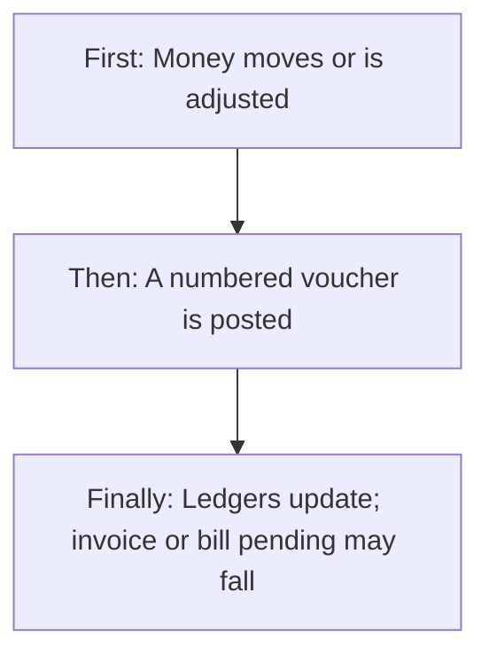

---

### 1.0 Quick visual atlas (read this first)

Use this to see **where Payments sits in the whole money system**, then **how a new voucher is born**, **Yes / No**, **status**, and **type / mode / settlement dropdowns**. Detail follows in 1.1 onward.

#### Whole accounting system (you are here)

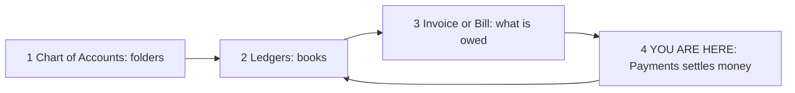

| Step | Module | What it does |
|------|--------|----------------|
| 1–2 | [COA](./chart-of-accounts.md) + [Ledgers](./ledger-management.md) | Bank/cash + customer/vendor books must exist |
| 3 | [Invoicing](./invoicing.md) / Bills | Sent invoice or pending bill = debt |
| 4 | **Payments** | Receipt / Payment / Contra / Journal. Save = Posted |

**If Payments is wrong, outstanding, cash, bank, and “Paid” flags are all wrong.**

#### How a **new** voucher works (four doors)

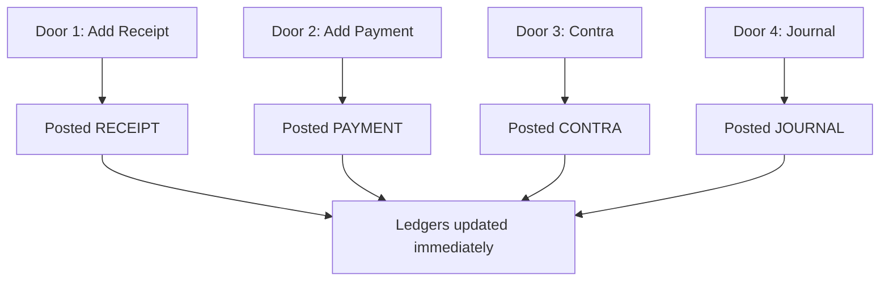

| Door | When to use | Party | Number style |
|------|-------------|-------|--------------|
| **Receipt** | Customer paid us | Customer | `RCP-YYYY-####` |
| **Payment** | We paid vendor | Vendor | `PAY-YYYY-####` |
| **Contra** | Cash ↔ bank or bank ↔ bank | None | `CNT-YYYY-####` |
| **Journal** | Books only, no cash tray | None | `JRN-YYYY-####` |

There is **no Draft voucher**. Cancel on the form = nothing saved.

#### Yes / No choices (this module)

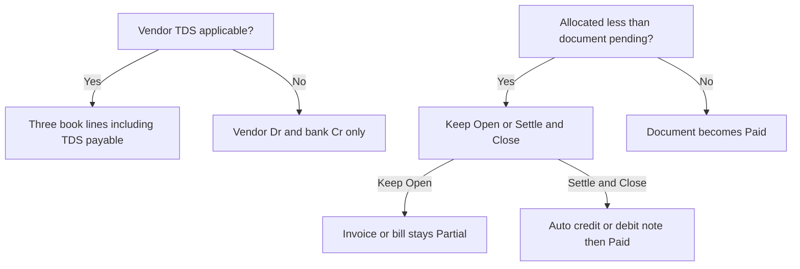

| Question | Yes | No |
|----------|-----|-----|
| Need a customer? | Receipt | Contra / Journal |
| Need a vendor? | Payment | Contra / Journal |
| Need bank/cash book? | Receipt / Payment / Contra | Journal (any ledgers) |
| UTR required? | Bank Transfer / UPI on the screen | Cash / Cheque / Card |
| Cheque date required? | Receipt + Cheque (≤ 3 months) | Payment cheque **not** required |
| Allocate to documents? | Optional on receipt/payment | Contra / Journal never allocate |
| Shortfall + Keep Open? | Document **Partial** | — |
| Shortfall + Settle & Close? | Auto CN (invoice) or DN (bill) → **Paid** | Reason required on screen |
| TDS on vendor payment? | Extra TDS payable credit | Two lines only |
| TDS on customer receipt? | Stored on voucher | **Not** posted to tax book |
| Adjust Advance on screen? | Only if advance balance > 0 | Balance stays 0 today → section hidden |
| Carry to Advance toggle change save? | **No** | Leftover is always unallocated |
| Edit a posted voucher? | **No** | Void stamp only |
| Void reverse books? | **No** | Invoice/bill/ledgers stay |
| Request / approve? | **No** | Save = Posted |
| Future date? | Blocked on **all four screens** | Receipt/Payment **API may still allow** |

#### Status map (this module + documents it touches)

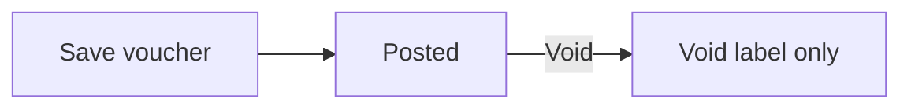

**Voucher**

| Status | In register? | In summary cards? | Books / invoice / bill |
|--------|--------------|-------------------|------------------------|
| **Posted** | Yes | Yes (receipts & payments) | Live |
| **Void** | Yes | **No** | **Unchanged** (not reversed) |

**Invoice after a receipt** (see [Invoicing](./invoicing.md))

| Settlement | Invoice becomes |
|------------|-----------------|
| Allocate = pending | **Paid** |
| Allocate < pending + Keep Open | **Partial** |
| Allocate < pending + Settle & Close | **Paid** (auto credit note) |
| Allocate nothing | Unchanged; leftover = unallocated |

**Bill after a payment**

| Settlement | Bill becomes |
|------------|----------------|
| Allocate = pending | **Paid** |
| Allocate < pending + Keep Open | **Partial** |
| Allocate < pending + Settle & Close | **Paid** (auto debit note) |

#### Dropdown / enum map (pick one)

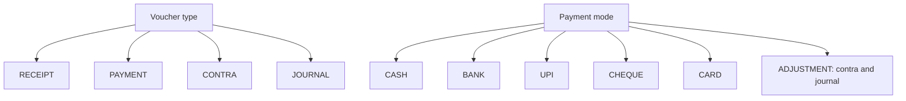

| Field | Options (exactly these) | Quick rule |
|-------|-------------------------|------------|
| Voucher type | **RECEIPT, PAYMENT, CONTRA, JOURNAL** | Tabs + create buttons |
| Status | **POSTED, VOID** | No draft |
| Party type | **CUSTOMER, VENDOR, NONE** | Receipt / Payment / Contra+Journal |
| Payment mode | **CASH, BANK, UPI, CHEQUE, CARD, ADJUSTMENT** | Screen labels map: Bank Transfer → BANK |
| Settlement | **KEEP_OPEN** or **SETTLE_CLOSE** | Only when allocated < pending |
| Receipt settle reason (screen) | Payment Settlement, Pricing Error, Service Issue, Other | Stored on auto credit note remarks |
| Payment settle reason (screen) | Payment Settlement, Purchase Return, Discount, Error, Other | Must match debit-note **codes** on server |
| Allocation document | **INVOICE** (receipt) or **BILL** (payment) | |

**Which door? (quick)**

| What happened in real life | Pick |
|----------------------------|------|
| Customer paid into bank / cash / UPI / cheque / card | **Receipt** |
| We paid a supplier | **Payment** |
| Cash deposited to bank, or ATM cash, or bank-to-bank | **Contra** |
| Wrong expense head, TDS receivable, opening correction | **Journal** |
| Want to undo a posted voucher | **Void** (label only) or a **new** opposite journal/receipt — Void does not reverse |

---

### 1.1 Why this is the core money module (easy picture)

Think of the company as four layers:

| Layer | Easy name | What it stores |
|-------|-----------|----------------|
| Chart of Accounts | Folder | “Bank accounts”, “Sundry debtors” |
| Ledger | Book / file | “HDFC Current”, “Customer Acme” |
| Invoice / Bill | What is owed | “Acme must pay ₹11,800” |
| **Voucher (this module)** | **Proof that money moved** | “RCP-2026-0007 received ₹11,800 in HDFC” |

```text
  CUSTOMER PAYS US          WE PAY VENDOR           WE MOVE OUR OWN MONEY
  ─────────────────         ──────────────          ─────────────────────
  Invoice (owed)            Bill (we owe)           Cash / Bank books
        │                         │                         │
        ▼                         ▼                         ▼
   RECEIPT voucher           PAYMENT voucher           CONTRA voucher
        │                         │                         │
        ▼                         ▼                         ▼
  Bank/Cash Dr               Vendor Dr                 Destination Dr
  Customer Cr                Bank/Cash Cr              Source Cr

  NO CASH, ONLY BOOKS
  ───────────────────
  JOURNAL voucher (Dr one book, Cr another, totals equal)
```

If Payments is wrong, **every other finance screen is wrong**: customer outstanding, vendor payable, cash in hand, bank balance, contract “paid” flags, and sales-order close-when-paid.

---

### 1.2 Four voucher types (what each one is for)

| Type | Everyday meaning | Party | Money books | Typical number |
|------|------------------|-------|-------------|----------------|
| **Receipt** | Customer paid us (cash, bank, UPI, cheque, card) | Customer | Bank or cash is **debited** (money in) | `RCP-YYYY-####` |
| **Payment** | We paid a vendor | Vendor | Bank or cash is **credited** (money out) | `PAY-YYYY-####` |
| **Contra** | We moved money between our own cash/bank books | None | Destination **debit**, source **credit** | `CNT-YYYY-####` |
| **Journal** | We adjusted books without cash moving | None | Any ledgers, debit total = credit total | `JRN-YYYY-####` |

Allowed payment modes on a voucher: **Cash, Bank, UPI, Cheque, Card, Adjustment**.  
Contra and Journal are saved as mode **Adjustment**.  
Allowed statuses: **Posted** or **Void**. There is no Draft and no Approved-pending.

---

### 1.3 Clean working mechanism (the money cycle)

This is the live cycle. Read it once; every scenario below is only a variation of this.

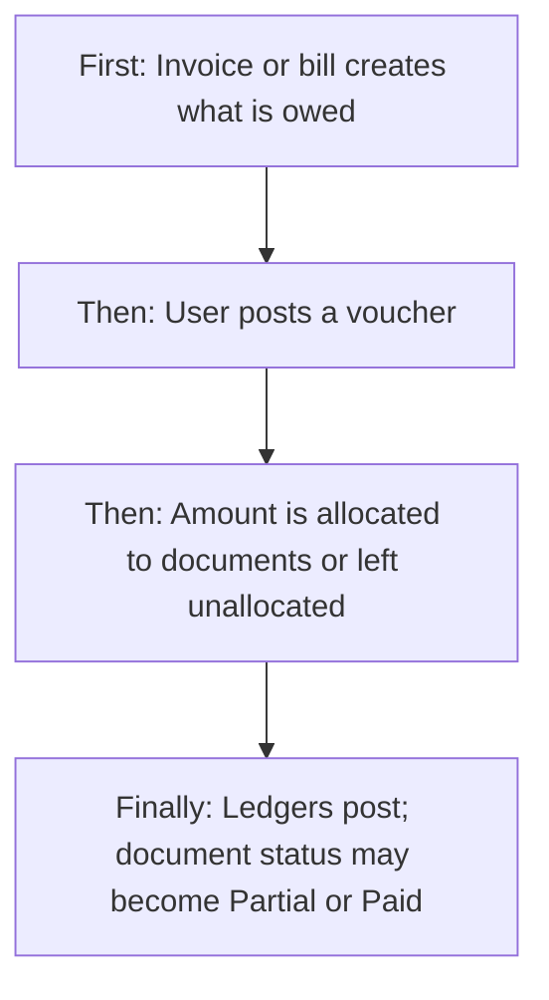

**Step A — Something is owed**

- Approve & send an invoice → customer ledger debit, pending amount = grand total.
- Confirm a purchase bill → vendor ledger credit, pending amount = net payable.

**Step B — User opens Payments**

- From the Payments menu, or from **Record Payment** on an invoice, or **Make Payment** on a bill.
- Chooses Receipt (money in) or Payment (money out), or Contra / Journal.

**Step C — User fills the voucher and Save**

- System creates a unique voucher id and a human number (`RCP-2026-0001` style).
- Status is immediately **Posted**. There is no second click.

**Step D — Allocation (receipts and payments only)**

- Receipt lines attach to **invoices** (Sent / Partial / Overdue).
- Payment lines attach to **bills** (Pending / Partial / Overdue with pending > 0).
- Allocate cannot exceed that document’s pending.
- If allocated < pending:
  - **Keep Open** → document becomes **Partial**.
  - **Settle & Close** → system auto-writes off the leftover (credit note on invoice, debit note on bill) so the document can go **Paid**.
- If allocated = pending → document becomes **Paid**.
- If received/paid > allocated → leftover sits as **unallocated** on the voucher (customer advance on receipts).

**Step E — Books**

- Receipt: Bank/Cash **Debit**, Customer **Credit** (money in reduces what the customer owes).
- Payment: Vendor **Debit**, Bank/Cash **Credit** (money out reduces what we owe). If TDS > 0, a third credit hits the TDS payable book.
- Contra: To-account **Debit**, From-account **Credit**.
- Journal: one debit line and one credit line (screen); totals must match.

**Step F — Side effects**

- Receipt against a paid invoice can mark the related **contract payment line** paid and can **close the sales order** if every linked invoice is fully paid.
- A **Payment Received** or **Payment Dispatched** notice is sent (receipt / vendor payment).
- Dashboard summary cards recount posted receipts and payments.

That is the whole machine. Everything else is a real-world case of A–F.

---

## 2. Users & Roles (who uses this and why)

The product does not hard-code job titles such as “Cashier.” Access is by **Payments rights** on the login role, plus **CEO** who can do everything.

| Who | Why they use Payments |
|-----|------------------------|
| **CEO** | Full access. Can create any voucher, view, download PDF, and void. |
| **Finance / accountant with Add** | Daily money desk: receipts from customers, payments to vendors, contra, journal. |
| **Finance with View only** | Watch the register, open vouchers, see allocations. Cannot Save a new voucher. |
| **Finance with Export** | Download voucher PDF from the list or the view screen. |
| **Finance with Delete (screen)** | Sees the Void (trash) button. |
| **Finance with Edit (server)** | Void is accepted by the server. |
| **Sales / invoicing user** | Does not need Payments Add to **see** Record Payment on an invoice, but Save on Receipt Entry still needs Payments Add. |
| **Purchase / bills user** | Make Payment on a bill is shown if they have Payments **View**; Save still needs Payments Add. |
| **Anyone without Payments rights** | Payments menu is hidden. Direct URL is blocked by the same module guard. |

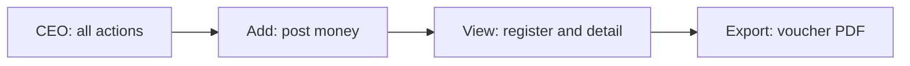

---

## 3. Access Control (RBAC)

Login role decides the **Payments** menu and each button. CEO is treated as full access.

| Role / right | View list | View detail | Add | Edit voucher | Inactive / Delete | Submit request | Receive / act | Approve | Reject |
|--------------|-----------|-------------|-----|--------------|-------------------|----------------|---------------|---------|--------|
| CEO | Yes | Yes | Yes | No (no edit form) | Void via server | No | No | No | No |
| Payments View | Yes | Yes | No | No | No | No | No | No | No |
| Payments Add | Yes if also View | Yes if also View | Yes (all four types) | No | No | No | No | No | No |
| Payments Edit | — | — | — | No field edit | **Void is allowed on server** | No | No | No | No |
| Payments Delete | — | — | — | No | **Void button is shown** | No | No | No | No |
| Payments Export | — | — | — | No | No | No | No | No | No |
| No Payments rights | No | No | No | No | No | No | No | No | No |

**Record-level rules:** there is **no** “own vouchers only” filter. Anyone with View sees the **full company register** (all branches, all types). Branch is stored on the voucher at create time but is **not** used to hide rows.

**Important mismatch:** the list **Void** button is tied to **Delete**. The server accepts void only with **Edit** (or CEO). A role that has Delete but not Edit sees a button that the server will refuse. A role that has Edit but not Delete can void via the server but sees no button.

This module does **not** use request / approve. Posted means posted.

---

## 4. Capabilities & Features

### 4.1 Payments register (the money desk home)

Menu: **Finance & Accounts → Payments**.

Four summary cards load on open:

| Card | Meaning |
|------|---------|
| Total Receipts | Sum of **Posted** receipt voucher amounts |
| Total Payments | Sum of **Posted** payment voucher amounts |
| Net Cash Flow | Receipts minus payments (can be negative) |
| Unallocated Adv. | Sum of leftover (unallocated) amounts on **Posted receipts** |

Tabs: **All / Receipts / Payments / Contras / Journals**.  
Search (half-second wait): voucher number, reference / UTR, or party id.  
Filters: voucher type chips, payment mode, party, date range (see gaps — date is local to the current page; mode labels may not match stored values).  
Pagination: server-side page number and page size.  
Row actions: View, PDF (if Export), Void (if Delete).

Header buttons (if Add): **+ Journal**, **+ Contra**, **+ Payment**, **+ Add Receipt**.

### 4.2 Receipt — money in from a customer

Use when a customer pays cash, transfers to bank, pays UPI, gives a cheque, or pays by card.

**User picks:** date (not future on the screen), branch, customer, mode, bank/cash book (hidden for Cash — system picks the cash-in-hand book), UTR (required for Bank Transfer and UPI), cheque date (required for Cheque, not older than 3 months on the screen), amount received.

**Then allocates** open invoices of that customer (Sent, Partial, Overdue). Tick rows and type how much of this receipt goes to each invoice.

**Then if there is a shortfall** (allocated less than those invoices still pending): Keep Open (invoice stays Partial) or Settle & Close (system writes an automatic credit note for the leftover so the invoice can close).

**Then optionally** types TDS deducted by the customer (stored on the voucher; see gaps — it is **not** posted as a tax book line). Notes are optional.

**Unallocated leftover** (received more than allocated) is stored as unallocated on the voucher. That is the company’s idea of **customer advance** for the next bill. The “Carry to Advance?” switch only follows that leftover; it does not call a separate save.

### 4.3 Payment — money out to a vendor

Use when the company pays a supplier.

**User picks:** date (not future on the screen), branch, vendor, mode (Cash, Bank Transfer NEFT/RTGS, UPI, Cheque), bank/cash book, UTR for bank/UPI, amount paid.

**Then allocates** that vendor’s unpaid bills (Pending, Partial, Overdue with pending > 0).

**Then optionally TDS:** Yes + rate % → screen shows TDS amount and Net Payable. That TDS amount is sent with the voucher. When TDS > 0, books post three lines (vendor debit of paid + TDS, bank credit of paid, TDS payable credit).

**Then Keep Open or Settle & Close** on shortfall. Settle & Close asks the server to issue an automatic **debit note** for the leftover so the bill can close.

### 4.4 Contra — move our own money

Use when cash is deposited to bank, bank is withdrawn to cash, or one bank is transferred to another. **No customer, no vendor.**

**User picks:** date (not future), branch, Transfer From, Transfer To (must be different active bank or cash books), amount > 0, optional reference and notes.

Server refuses if source and destination are the same, if either book is not an active bank/cash ledger, or if the source **has a positive balance smaller than the amount**. If the source book is zero or already overdrawn (not positive), that balance check does **not** block the transfer.

### 4.5 Journal — books only, no cash tray

Use for corrections: wrong expense head, TDS receivable vs vendor, opening adjustments, write-offs that are not invoice/bill settlement.

**Screen today:** one debit ledger, one credit ledger (must differ), one amount, narration (required), optional line notes. Server will also accept more than two lines if sent another way; the live screen always sends exactly two.

### 4.6 View voucher and PDF

View shows: number, type, date, party, amount, mode, UTR, allocation table (invoice or bill, pending before, allocated, status after), notes, a ledger-posting table, and TDS block. PDF download uses the same voucher.

### 4.7 Void

User confirms “this cannot be undone.” Server sets status **Void** if it was Posted. **It does not reverse ledgers, does not restore invoice/bill pending, does not delete allocations.** The voucher stays on the list as Void. Summary cards ignore Void amounts.

### 4.8 Shortcuts from other modules

- Invoice detail / list **Record Payment** (Sent, Partial, Overdue) → Receipt Entry with that customer and invoice ticked.
- Bill view **Make Payment** (when the bill can still be paid) → Payment Entry with that vendor and bill ticked.

---

## 5. CRUD Operations

### 5.1 Create (Add)

**Who:** CEO or a role with Payments Add.

**First:** open Payments → choose + Add Receipt / + Payment / + Contra / + Journal (or land from invoice/bill).

**Then:** fill required fields (see section 7). Screen validates; then the server creates the voucher as **Posted** and writes ledger lines in the same save.

**Finally:** success message, return to previous screen. Receipt/payment also fire a notice. Invoice/bill statuses update if allocated.

There is **no draft save**. Cancel discards the form.

Required inputs by type:

| Type | Must have |
|------|-----------|
| Receipt | Date, branch, customer, mode, bank/cash book, amount received > 0. UTR if Bank/UPI. Cheque date if Cheque. |
| Payment | Date, branch, vendor, mode, bank/cash book, amount paid > 0. UTR if Bank/UPI. |
| Contra | Date, branch, from ledger, to ledger (different), amount > 0 |
| Journal | Date, branch, narration, debit ledger, credit ledger (different), amount > 0 |

### 5.2 Read — List

**Who:** CEO or Payments View.

**How it loads:** on open and whenever tab, search, filters, page, or page size change. Summary is fetched separately (all posted vouchers, not filtered by the current tab).

**Columns:** Voucher number, Type, Date, Party, Ref, Amount, Mode, Allocated To, Settlement, Action.

**Empty:** table empty if none match. Loading spinner while fetching.

**Search:** voucher number, reference, party id (not party name).

**Sort:** newest voucher date first, then newest created time. User cannot click a column to re-sort.

### 5.3 Read — Detail / Get details

**Who:** CEO or Payments View.

**First:** click View on a row (needs voucher id in navigation state).

**Then:** screen loads voucher by id and its allocations. For receipts/payments it also looks up the bank/cash ledger name. For journals it shows saved journal lines. For contra it shows from/to ledger names.

**Finally:** summary, allocation table, ledger posting table, TDS block. Download PDF or Back to Register.

If the user opens View without an id (refresh or typed URL), the screen says voucher not found.

### 5.4 Update (Edit)

**There is no Edit voucher form.** Posted fields cannot be changed. The only “update” is **Void**, which only changes status.

### 5.5 Inactive / Delete

There is **no inactive flag** and **no hard delete**.

**Void** is the cancel path:

- **Who (button):** Payments Delete.
- **Who (server):** Payments Edit or CEO.
- **Confirmation:** “Are you sure you want to void voucher {number}? This action cannot be undone.”
- **Reactivation:** not possible. Void stays Void.
- **What does not happen:** ledger reversal, invoice/bill pending restore, allocation removal.

---

## 6. Request & Approval Flows

This module does **not** use request / approve / reject / return. There is no inbox. Save = Posted.

### 6.1 Submit request

Not used.

### 6.2 Receive / inbox / pending actions

Not used. (Notifications exist as “payment received / dispatched” messages, not as an approval queue.)

### 6.3 Approve / Reject / Return

Not used.

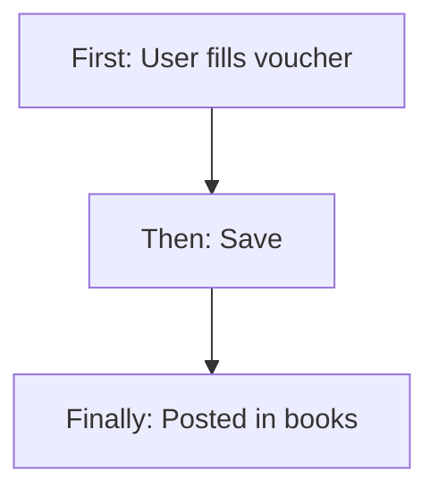

---

## 7. Forms — Add vs Edit Field Access

There is only **Add**. View is read-only. Void is a list action, not a form.

### 7.1 Receipt Entry

| Field (business name) | On Add | On Edit | Notes |
|----------------------|--------|---------|-------|
| Receipt date | Editable / Required | No edit screen | Screen blocks future date |
| Branch | Editable / Required | — | Locked display if the user has only one branch |
| Customer | Editable / Required | — | Loads that customer’s open invoices |
| Current balance | Locked | — | Shown; not filled from books today (stays 0) |
| Advance balance | Locked | — | Shown; not filled from unallocated receipts (stays 0) |
| Adjust Advance? | Hidden unless advance > 0 | — | Section never appears while advance stays 0 |
| Advance applied | Locked when visible | — | FIFO fill of oldest invoices |
| Payment mode | Editable / Required | — | Cash, Bank Transfer, UPI, Cheque, Card |
| Bank / cash book | Required except Cash | — | Cash auto-picks cash-in-hand |
| Ref / UTR | Required for Bank Transfer and UPI | — | |
| Cheque date | Required if Cheque | — | Screen rejects older than 3 months; **not sent to server** |
| Amount received | Editable / Required | — | Must be > 0 (or > 0 including advance on screen) |
| Invoice tick + allocate | Editable | — | Cannot exceed that invoice’s pending |
| Carry to Advance? | Toggle | — | Follows leftover; leftover is saved even if toggle is off |
| Keep Open / Settle & Close | Shown if shortfall | — | Reason required for Settle & Close |
| TDS deducted by customer | Editable | — | Stored on voucher; not posted to tax book |
| Notes | Editable | — | |
| Save | Visible | — | Needs Payments Add |
| Save & Print Receipt | Visible | — | **No action wired** |
| Cancel | Visible | — | Goes back |

### 7.2 Payment Entry

| Field (business name) | On Add | On Edit | Notes |
|----------------------|--------|---------|-------|
| Payment date | Editable / Required | No edit screen | Screen blocks future date |
| Branch | Editable / Required | — | Single-branch display lock |
| Vendor | Editable / Required | — | Loads unpaid bills |
| Current / Advance balance | Locked | — | Stay 0; vendor advance is not a live apply path |
| Payment mode | Editable / Required | — | Cash, Bank Transfer (NEFT/RTGS), UPI, Cheque |
| Bank account | Required if not Cash | — | |
| Ref / UTR | Required for Bank / UPI | — | |
| Cheque date | Shown if Cheque | — | **Screen does not require it** (unlike receipt); not sent to server |
| Amount paid | Editable / Required | — | Must be > 0 |
| Bill tick + allocate | Editable | — | Cannot exceed bill pending |
| TDS applicable | Yes / No | — | Rate, TDS amount, net payable when Yes |
| Shortfall | Locked | — | Calculated |
| Keep Open / Settle & Close | Editable | — | Reason required for Settle & Close |
| Save / Cancel | Visible | — | |
| Save & Print Voucher | Visible | — | **No action wired** |

### 7.3 Contra Entry

| Field | On Add | On Edit | Notes |
|-------|--------|---------|-------|
| Date | Editable / Required | No edit | Screen + server block future |
| Branch | Editable / Required | — | |
| Transfer From | Editable / Required | — | Active bank or cash only |
| Transfer To | Editable / Required | — | Must differ from From |
| Amount | Editable / Required | — | > 0 |
| Reference / Notes | Optional | — | |
| Save / Cancel | Visible | — | |

### 7.4 Journal Entry

| Field | On Add | On Edit | Notes |
|-------|--------|---------|-------|
| Voucher date | Editable / Required | No edit | Screen + server block future |
| Branch | Editable / Required | — | |
| Narration | Editable / Required | — | Header text stored as notes |
| Debit ledger | Editable / Required | — | Any active ledger |
| Credit ledger | Editable / Required | — | Must differ |
| Amount | Editable / Required | — | > 0; same on both sides |
| Debit / credit line note | Optional | — | |
| Save / Cancel | Visible | — | |

Roles without Add never see these forms as working Save (menu buttons are hidden). They may still open a URL if they have the module at all.

---

## 8. Lists, Dropdowns, Details & Data Rendering

### 8.1 List rendering

| Column | What you see |
|--------|----------------|
| Voucher | Human number (`RCP-2026-0001`) |
| Type | Badge: Receipt / Payment / Contra / Journal |
| Date | Voucher date |
| Party | Intended as customer/vendor name — **list response has no name**, so this often shows a dash |
| Ref | UTR / reference, or dash |
| Amount | ₹ amount (absolute) |
| Mode | Stored mode (CASH, BANK, UPI, …) |
| Allocated To | Intended invoice/bill ids — **list does not include allocations**, so usually a dash |
| Settlement | Intended note — **not on list**, usually a dash |
| Action | View / PDF / Void |

Refresh: changing tab, search, filter, or page reloads. There is no separate Refresh button.  
Voided rows remain on the list. Summary cards skip them.

### 8.2 Dropdowns & lookups

| Dropdown | Where options come from | Search / depend |
|----------|-------------------------|-----------------|
| Customer (receipt) | Customer master list | Changing customer reloads invoices |
| Vendor (payment) | Vendor master list | Changing vendor reloads bills |
| Branch | Current user’s branches | If exactly one, shown locked |
| Bank / cash book | Ledgers whose type is Bank or Cash | Cash mode auto-picks Cash type |
| Invoice rows | Invoices for that customer in Sent, Partial, Overdue (up to 50) | Tick + allocate |
| Bill rows | Bills for that vendor in Pending, Partial, Overdue with pending > 0 (up to 100) | Tick + allocate |
| Transfer From / To (contra) | Same bank/cash ledgers | Must differ |
| Debit / Credit ledger (journal) | All ledgers (name/code) | Must differ |
| Payment mode (receipt) | Cash, Bank Transfer, UPI, Cheque, Card | Shows bank / UTR / cheque date |
| Payment mode (payment) | Cash, Bank Transfer (NEFT/RTGS), UPI, Cheque | Same idea |
| Settle reason (receipt) | Payment Settlement, Pricing Error, Service Issue, Other | Required if Settle & Close |
| Settle reason (payment) | Payment Settlement, Purchase Return, Discount, Error, Other | Required if Settle & Close |
| Filter: voucher type | Receipt, Payment, Contra, Journal | Combined with tabs |
| Filter: payment mode | UPI, Cheque, Cash, Bank Transfer, Adjustment | Sent as those labels (see gaps) |
| Filter: party | Built from names on **current page** rows | Often empty because names are missing |

### 8.3 Detail / get-details rendering

Opening a row:

1. Loads voucher by id (journal lines included for Journal; from/to names for Contra).
2. Loads allocation list for that voucher.
3. For receipt/payment, looks up bank/cash ledger name for the posting table.
4. Builds a posting table:
   - Journal: real lines from the voucher.
   - Receipt: Bank/Cash debit, party credit (simple two-line picture; advance/TDS extra lines are **not** shown).
   - Payment: party debit, Bank/Cash credit (TDS third line **not** shown).
   - Contra: screen currently shows From as debit and To as credit — **the opposite of the live books** (books debit destination / credit source).

Empty allocations: “No allocations” (normal for contra, journal, or unallocated receipt).

---

## 9. How It Works (end-to-end user flows)

### 9.1 Accountant — Record a customer receipt against invoices

**First:** Customer has a Sent invoice. User opens Payments → + Add Receipt (or Record Payment from the invoice).

**Then:** Picks branch, customer (invoices appear), mode, bank book, amount, ticks invoices, allocates, Save.

**Finally:** Receipt is Posted. Selected invoices move to Partial or Paid. Customer ledger credit + bank/cash debit. Register shows the new RCP number.

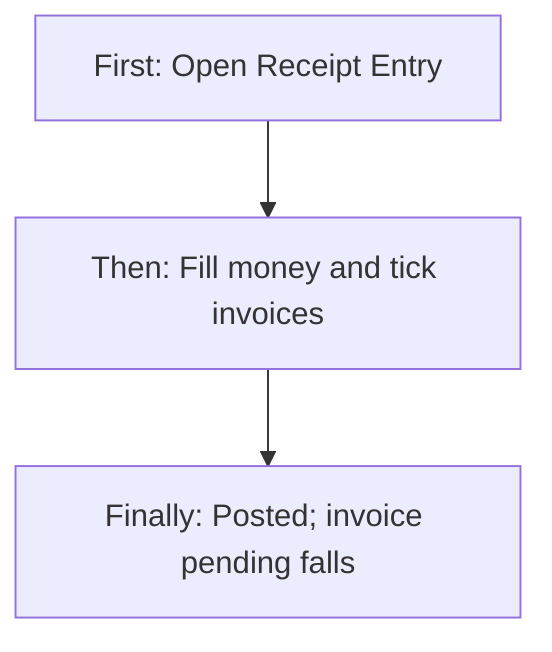

1. Date cannot be in the future on the screen.
2. Allocate cannot exceed that invoice’s pending or the receipt total.
3. Leftover received amount becomes unallocated (advance bucket on this voucher).
4. If all invoices on a sales order become Paid, that sales order may close.

### 9.2 Accountant — Pay a vendor bill (with or without TDS)

**First:** Vendor bill is Pending. User opens + Payment or Make Payment from the bill.

**Then:** Picks vendor (bills appear), mode, bank, amount, ticks bills, optionally TDS Yes + rate, Keep Open or Settle & Close, Save.

**Finally:** PAY voucher Posted. Bills Partial or Paid. Vendor debit, bank credit; if TDS > 0, TDS payable is credited too.

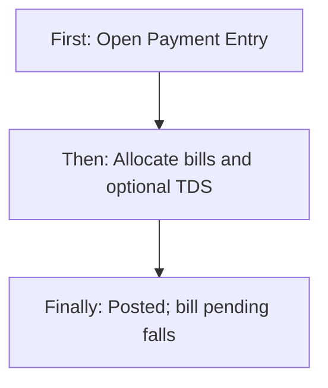

### 9.3 Accountant — Deposit cash into bank (Contra)

**First:** Cash in hand should move to a bank account.

**Then:** + Contra → From = Cash-in-hand, To = Bank, amount, Save.

**Finally:** CNT voucher Posted. Bank book debit, cash book credit. No invoice/bill change.

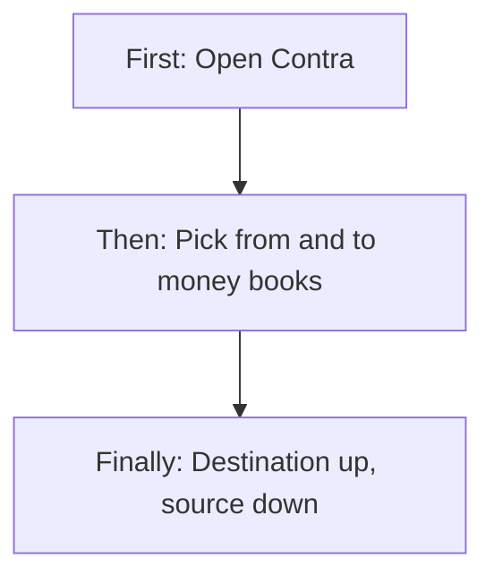

### 9.4 Accountant — Journal correction (no cash)

**First:** A book needs a correction (example: expense was posted to the wrong head).

**Then:** + Journal → narration, debit ledger, credit ledger, amount, Save.

**Finally:** JRN voucher Posted. Two ledger lines, totals equal. No cash tray movement.

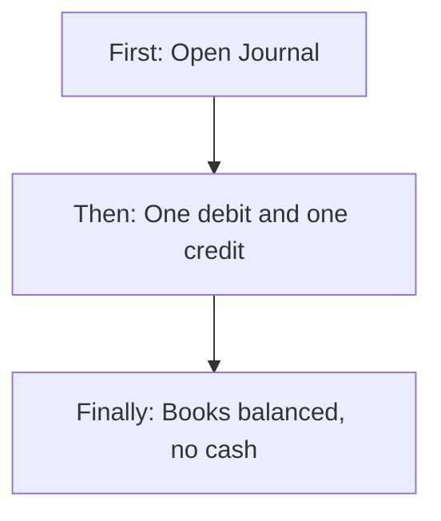

### 9.5 Viewer — Inspect and download

**First:** Open Payments register (View right).

**Then:** Filter/search → View → read allocations and posting picture → Download PDF.

**Finally:** PDF file saved. Nothing in the books changes.

### 9.6 User with Delete — Void a voucher

**First:** Find the Posted row → trash → confirm.

**Then:** If the role also has Edit (or is CEO), status becomes Void.

**Finally:** Row still listed as Void. **Invoice pending, bill pending, and ledger balances do not roll back.** Treat Void as a label, not an undo.

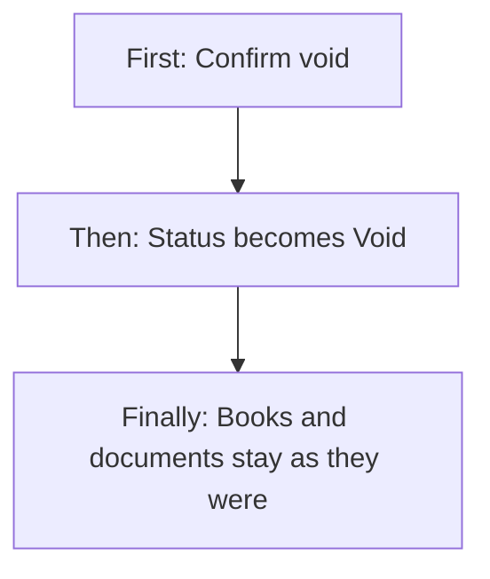

---

## 10. Cross-Module Interactions

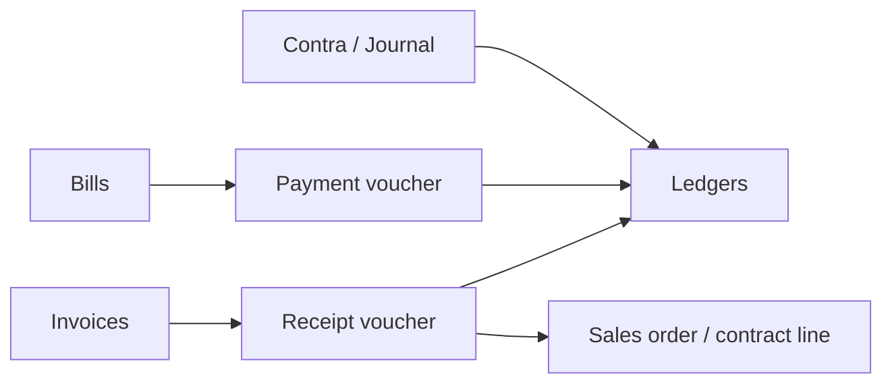

| Other area | How it connects |
|------------|-----------------|
| **Customers** | Receipt party. Customer must have an **active customer ledger**. |
| **Vendors** | Payment party. Vendor must have an **active vendor ledger**. |
| **Branches** | Stored on every voucher. Used on create; not used to filter the register. |
| **Invoices** | Receipt allocates to Sent / Partial / Overdue. Pending and status update. Settle & Close issues an automatic credit note (reason Payment Settlement). |
| **Bills** | Payment allocates to unpaid bills. Settle & Close issues an automatic debit note. |
| **Ledgers / COA** | Every save posts debit and credit. Bank/Cash pickers are Bank and Cash type ledgers. Journal can post to any active ledger. |
| **Credit / debit notes** | Created automatically on Settle & Close; they themselves post more ledger lines. |
| **Sales orders** | After receipt, if linked invoices are fully paid, the SO may be closed. |
| **Contracts** | When an invoice becomes Paid, the related contract payment line can be marked paid. |
| **Notifications** | Receipt → Payment Received. Vendor payment → Payment Dispatched. |
| **Reports / P&L / Balance sheet / Trial** | Those screens are guarded with the same Payments module key in the menu map; they are **not** voucher create screens. |
| **Old Payments Received / Payments Made / Journal Voucher / Add Voucher** | Still have URLs. They are **not** the live money desk (demo or leftover data). Testers should use **Payments** under Finance. |

---

## 11. Data the Business Cares About

| Business name | Meaning |
|---------------|---------|
| Voucher id / number | Internal id vs printed number (`RCP-2026-0001`) |
| Type | Receipt, Payment, Contra, Journal |
| Date | Business date of the money event |
| Branch | Branch stamped at create |
| Party type / party | Customer, Vendor, or None |
| Mode | Cash, Bank, UPI, Cheque, Card, Adjustment |
| Bank/cash book | Which till or bank received or paid |
| From / To books | Contra only |
| Reference / UTR | Bank or UPI proof (unique if filled) |
| Gross / amount | Receipt settlement total or amount paid / transfer / journal total |
| TDS amount | Stored on voucher; posted on **payment** when > 0 |
| Advance applied | How much old customer advance was used on this receipt (server field) |
| Allocated / unallocated | How much hit documents vs leftover |
| Status | Posted or Void |
| Allocation | Document type Invoice or Bill, amounts, keep-open vs settle-close, status after |
| Journal lines | Ledger, debit or credit, line note |
| Notes / narration | Internal remark |

---

## 12. Rules, Validations & Constraints

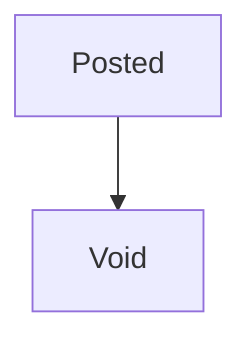

Only those two statuses exist. Posted → Void is one-way.

| Rule | What happens |
|------|----------------|
| Voucher number unique | System generates `RCP/PAY/CNT/JRN-year-####` |
| Reference unique when filled | Duplicate UTR/reference is rejected |
| Gross amount > 0 | Zero or negative rejected |
| Receipt allocate ≤ invoice pending | Rejected if more |
| Receipt total allocate ≤ settlement amount | Rejected if more |
| Payment allocate ≤ bill pending | Rejected if more |
| Invoice must exist for receipt allocation | Not found → fail |
| Bill must exist for payment allocation | Not found → fail |
| Customer active ledger required | Receipt fails without it |
| Vendor active ledger required | Payment fails without it |
| Bank/cash ledger must exist | Receipt/payment fail if missing |
| Contra from ≠ to | Rejected |
| Contra books must be active Bank or Cash | Rejected otherwise |
| Contra amount ≤ source **positive** balance | Rejected only when source balance is already > 0 and too small |
| Journal ≥ 2 lines, each Dr **or** Cr not both | Rejected |
| Journal debit total = credit total | Rejected if not balanced |
| Journal / Contra date not in the future | Server rejects |
| Receipt / Payment future date | **Screen** rejects; **server does not** (API can still post a future date) |
| Advance applied ≤ customer unallocated receipts | Server rejects if the advance field is sent and too high |
| Cheque stale (receipt screen) | Older than 3 months blocked on screen only |
| Only Posted can be voided | Second void fails |
| Invalid type / mode / party / status | Rejected with a clear allowed-values message |

**Settle & Close (receipt):** leftover on each allocated invoice becomes an automatic credit note (Payment Settlement). Invoice should then be Paid.

**Settle & Close (payment):** leftover on each allocated bill becomes an automatic debit note. Bill should then be Paid.

**Keep Open:** leftover stays pending; status Partial.

---

## 13. Loopholes, Gaps & Current Limitations

These are **live** mismatches. Testers should expect them; they are not “future work” in this document.

1. **Void does not undo money.** Ledgers, invoice pending, bill pending, allocations, credit/debit notes stay. Void is a stamp only.
2. **Void button vs Void server rights differ** (Delete vs Edit).
3. **No voucher edit.** Wrong amount means a new journal/contra/receipt — or a misleading Void.
4. **Customer advance on screen does not load.** Current and advance balances stay ₹0, so “Adjust Advance?” almost never appears. The server *can* apply advance if `advanceApplied` is sent; the live Save body **does not send that field** — it folds cash + advance into amount received. Default server setting does **not** infer advance from leftover receipts. Result: applying old advance from the screen is not a working end-to-end path today.
5. **“Carry to Advance?”** does not change the save. Leftover is always stored as unallocated.
6. **Receipt TDS** is saved on the voucher but **not posted** to a TDS book (unlike vendor payment TDS).
7. **Cheque date** is validated on receipt screen and not stored. Payment cheque date is not even required.
8. **Save & Print** buttons on receipt and payment do nothing.
9. **Party name, allocations, settlement note missing on the register** — those columns are usually dashes.
10. **Unallocated Adv. card** reads a field name the summary does not send (`unallocatedAdv` vs `unallocatedAdvance`), so the card often shows ₹0 even when leftovers exist.
11. **Payment mode filter** sends labels like “Bank Transfer” while the register stores `BANK` — filter often returns nothing.
12. **Date range filter** is not sent to the server; with page-by-page loading it only affects the current page.
13. **Register is not branch-scoped.** All company vouchers appear.
14. **View Contra debit/credit are swapped** vs the books (destination should be debit).
15. **View posting is simplified** — no advance lines, no TDS third line.
16. **Journal screen is two ledgers only.** Server allows more lines; UI cannot enter them.
17. **Receipt/Payment future date** can be posted if the API is called directly.
18. **Payment allocate vs amount paid** is not checked on the server the way receipt is (screen tries to cap it).
19. **Vendor payment TDS picture:** screen treats Amount Paid as gross and shows Net = Paid − TDS. Books credit the **full Amount Paid** to bank and **add** TDS on the vendor debit. Testers must not assume Net Payable is what left the bank.
20. **Settle & Close on payment** sends the reason label (e.g. “Purchase Return”) as the debit-note reason. The note engine expects codes like `PURCHASE_RETURN`. Auto close may fail or mis-file the reason.
21. **Make Payment / Record Payment** can appear with only Payments View; Save still needs Add.
22. **Contra overdraft:** if source balance is not positive, large transfers are allowed.
23. **List loads the full voucher table** then pages in memory — slow on large tenants; not a user-facing filter bug but it affects testers on big data.
24. **Leftover screens** (Payments Received, Payments Made, old voucher pages) can confuse testers if they bookmark old URLs.
25. **No bank feed / cheque clearing / bounce workflow.** Cheque is only a mode label.
26. **No multi-currency.** Amounts are company rupees.
27. **PDF Export right** is separate from View; View screen still shows Download PDF for anyone who can open it.

---

## 14. Existing Functionality Summary

Fully available today:

- Unified Payments register with type tabs, search, paging, and four create buttons
- Posted **Receipt** with invoice allocation, Keep Open / Settle & Close (auto credit note), unallocated leftover, customer + bank/cash posting
- Posted **Payment** with bill allocation, optional TDS posting, Keep Open / Settle & Close (auto debit note), vendor + bank/cash posting
- Posted **Contra** between active bank/cash books
- Posted **Journal** (two-line on screen, balanced)
- View voucher + PDF
- Void status (no financial reverse)
- Shortcuts from invoice Record Payment and bill Make Payment
- Notifications on receipt and vendor payment
- After receipt: contract payment-line paid flag and sales-order close-when-fully-paid
- CEO bypass; Payments View / Add / Edit / Delete / Export split as above

Not available today: voucher edit, approval queue, true void-and-reverse, working on-screen advance apply, receipt TDS books, cheque clearing, branch-filtered register, multi-line journal UI.

---

## 15. Reference — APIs, Screens & UI Actions

### 15.1 APIs

| Method | Path | Purpose (plain language) | Used by (screen/flow) |
|--------|------|--------------------------|------------------------|
| POST | `/api/v1/vouchers/receipts` | Create posted customer receipt + invoice allocations | Receipt Entry Save |
| POST | `/api/v1/vouchers/payments` | Create posted vendor payment + bill allocations | Payment Entry Save |
| POST | `/api/v1/vouchers/contra` | Create posted cash/bank transfer | Contra Save |
| POST | `/api/v1/vouchers/journal` | Create posted balanced journal | Journal Save |
| GET | `/api/v1/vouchers` | List vouchers (type, party, mode, search, page) | Payments register |
| GET | `/api/v1/vouchers/summary` | Posted receipt/payment totals and unallocated receipts | Register cards |
| GET | `/api/v1/vouchers/by-id` | One voucher (journal lines if journal) | View Voucher |
| GET | `/api/v1/vouchers/allocations` | Allocation rows for one voucher | View Voucher |
| POST | `/api/v1/vouchers/void` | Mark posted voucher Void | Register Void |
| GET | `/api/v1/vouchers/pdf` | Download voucher PDF | Register PDF, View Download PDF |
| GET | `/api/v1/invoices` | Open invoices for a customer | Receipt allocation table |
| GET | `/api/v1/bills` | Bills for a vendor | Payment allocation table |
| GET | `/api/v1/ledgers` | Bank/cash (and all, for journal) | All money forms |
| GET | `/api/v1/ledgers/by-id` | Bank/cash name on view | View Voucher posting |
| GET | Customer / vendor dropdowns | Party pickers | Receipt / Payment |
| GET | Current user branches | Branch picker | All create forms |

Rights: Add on the four create posts; View on list/summary/by-id/allocations/pdf; **Edit** on void. CEO allowed on all.

### 15.2 Frontend Screen Routes

| Route | Screen purpose | Primary users |
|-------|----------------|---------------|
| `/payment-dashboard` | Money register + summary + create buttons | Finance |
| `/receipt-entry` | Create customer receipt | Finance / from invoice |
| `/payment-entry` | Create vendor payment | Finance / from bill |
| `/contra` | Create contra | Finance |
| `/journal` | Create two-line journal | Finance |
| `/view-voucher` | Read-only voucher (needs id in navigation) | Finance |
| `/Payments-Received`, `/payment-received-detail`, `/payments-made`, `/add-payments-recieved`, `/add-payments-made`, `/voucher`, `/add-voucher`, `/journal-voucher` | Leftover / demo paths — **not** the live desk | Avoid for official testing |

### 15.3 Click Events, Filters, Search & Controls

| Screen / Route | Control | Type | What happens |
|----------------|---------|------|--------------|
| Payments register | + Add Receipt | Button | Opens Receipt Entry |
| Payments register | + Payment | Button | Opens Payment Entry |
| Payments register | + Contra | Button | Opens Contra |
| Payments register | + Journal | Button | Opens Journal |
| Payments register | All / Receipts / Payments / Contras / Journals | Tabs | Reloads list with that type; remembers tab |
| Payments register | Search | Text | After 0.5s, searches number / reference / party id |
| Payments register | Voucher type chips | Filter | Extra type filter if tab is All |
| Payments register | Payment mode | Multi-select | Sent only if exactly one mode chosen |
| Payments register | Party | Multi-select | Sends party id if a UUID token is selected |
| Payments register | Voucher date | Date range | Local filter on current page only |
| Payments register | Page / page size | Pager | Server page |
| Payments register | View (eye) | Icon | Opens View Voucher with id |
| Payments register | PDF | Icon | Downloads PDF if Export |
| Payments register | Void (trash) | Icon | Confirm then void if Delete |
| Receipt Entry | Receipt date | Date | Required; no future |
| Receipt Entry | Branch | Select / locked | Required |
| Receipt Entry | Customer | Select | Loads invoices |
| Receipt Entry | Current / Advance balance | Read-only | Display only (0 today) |
| Receipt Entry | Adjust Advance? | Toggle | FIFO-fills invoices if advance > 0 |
| Receipt Entry | Payment mode | Select | Shows bank / UTR / cheque date |
| Receipt Entry | Bank account | Select | Required unless Cash |
| Receipt Entry | Ref / UTR | Text | Required for Bank Transfer and UPI |
| Receipt Entry | Cheque date | Date | Required if Cheque; max 3 months old |
| Receipt Entry | Amount received | Money | Required > 0 |
| Receipt Entry | Invoice tick | Checkbox | Include in allocation |
| Receipt Entry | Allocate amount | Text | Per invoice; cannot exceed pending |
| Receipt Entry | Carry to Advance? | Toggle | Display only |
| Receipt Entry | Keep Open / Settle & Close | Radio | Shown if shortfall |
| Receipt Entry | Settlement reason | Select | Required if Settle & Close |
| Receipt Entry | TDS deducted by customer | Money | Stored, not posted |
| Receipt Entry | Notes | Text | Optional |
| Receipt Entry | Save | Button | Posts receipt |
| Receipt Entry | Save & Print Receipt | Button | No action |
| Receipt Entry | Cancel | Button | Back |
| Payment Entry | Payment date | Date | Required; no future |
| Payment Entry | Branch | Select / locked | Required |
| Payment Entry | Vendor | Select | Loads unpaid bills |
| Payment Entry | Current / Advance balance | Read-only | Display only |
| Payment Entry | Payment mode | Select | Shows bank / UTR / cheque date |
| Payment Entry | Bank account | Select | Required if not Cash |
| Payment Entry | Ref / UTR | Text | Required for Bank / UPI |
| Payment Entry | Cheque date | Date | Shown; not required |
| Payment Entry | Amount paid | Money | Required > 0 |
| Payment Entry | Bill tick / allocate | Checkbox + text | Same idea as invoices |
| Payment Entry | TDS Yes / No | Radio | Shows rate, TDS amount, net payable |
| Payment Entry | TDS rate % | Number | Computes TDS from amount paid |
| Payment Entry | Keep Open / Settle & Close | Radio | Always visible |
| Payment Entry | Settlement reason | Select | Required if Settle & Close |
| Payment Entry | Save / Cancel | Buttons | Post / back |
| Payment Entry | Save & Print Voucher | Button | No action |
| Contra | Date, branch, from, to, amount | Fields | Required; from ≠ to |
| Contra | Reference / Notes | Text | Optional |
| Contra | Save / Cancel | Buttons | Post / back |
| Journal | Date, branch, narration | Fields | Required |
| Journal | Debit ledger / Credit ledger / Amount | Fields | Required; ledgers differ |
| Journal | Line notes | Text | Optional |
| Journal | Save / Cancel | Buttons | Post / back |
| View Voucher | Back to Register | Button | Previous screen |
| View Voucher | Download PDF | Button | Downloads PDF |
| Invoice detail / list | Record Payment | Button | Receipt Entry prefilled |
| Bill view | Make Payment | Button | Payment Entry prefilled |

---

## 16. Real-world scenarios (how money actually works)

Use these as the “story” of the module. Numbers are examples.

### Scenario A — Customer pays the full invoice (happy path)

Invoice INV-100 is Sent, pending ₹11,800. Customer NEFT ₹11,800.

1. Record Payment from the invoice (or Receipt Entry → same customer → tick INV-100 → allocate 11,800).
2. Mode Bank Transfer, pick HDFC book, paste UTR, amount 11,800, Keep Open (no shortfall).
3. Save → `RCP-2026-xxxx` Posted.
4. Invoice becomes **Paid**, pending 0. Bank book **+11,800**. Customer book **−11,800** (credit). If this was the last unpaid invoice on the sales order, the SO may close. Contract payment line may mark paid.

### Scenario B — Partial collection, keep the rest open

Pending ₹11,800. Customer pays ₹5,000 UPI.

1. Allocate 5,000 to that invoice, Keep Open.
2. Invoice **Partial**, pending ₹6,800. Next week another receipt can take the rest.

### Scenario C — Short pay and write off (Settle & Close)

Pending ₹11,800. Customer pays ₹11,000 and you agree to waive ₹800.

1. Allocate 11,000, choose **Settle & Close**, reason Payment Settlement (or other listed reason).
2. Receipt posts ₹11,000 to bank and customer.
3. System issues an automatic **credit note** for ₹800 so the invoice can become **Paid**.
4. Books also get the credit-note lines (customer credit, income/tax reverse) — that is invoicing, triggered by Payments.

### Scenario D — Customer pays extra (advance / unallocated)

Pending ₹11,800. Customer pays ₹15,000.

1. Allocate 11,800; leftover ₹3,200 is **unallocated** on the receipt (advance sitting on this voucher).
2. Invoice Paid. Next invoice *should* be able to consume that ₹3,200 — **on the server, if advance is sent**. On the live screen, advance balance does not load, so the next receipt will not show Adjust Advance. Testers: treat leftover as stored, but **on-screen reuse is broken** (see N-series).

### Scenario E — Pay several invoices with one receipt

Customer has INV-1 ₹2,000, INV-2 ₹3,000, INV-3 ₹4,000. Pays ₹9,000.

1. Tick all three, allocate full pending each.
2. All three Paid. One bank debit ₹9,000, one customer credit ₹9,000.

### Scenario F — Cash sale collected at the counter

Mode **Cash**. Bank picker hides. System uses the Cash-in-hand ledger. Cash book debit, customer credit. No UTR.

### Scenario G — Cheque received

Mode Cheque, cheque date within 3 months. Screen requires the date; server never stores it. Books treat it like any other receipt on the chosen bank/cash book. There is **no** “cheque deposited / bounced” later step.

### Scenario H — Customer deducted TDS (receipt TDS field)

Customer pays ₹9,000 and deducted ₹1,000 TDS on a ₹10,000 bill.

1. Amount received 9,000, TDS field 1,000, allocate 10,000 — **screen will block** because allocation cannot exceed amount received (unless you also use advance).
2. Practical live path: allocate 9,000 Keep Open (invoice Partial 1,000) **or** allocate 9,000 Settle & Close (writes off 1,000 as credit note — **wrong** if TDS is real tax, not a waiver).
3. The ₹1,000 in the TDS box is **only stored**, not posted to TDS receivable. Testers should not expect a tax ledger line on receipts.

### Scenario I — Vendor paid in full

Bill BILL-50 pending ₹25,000. Pay from HDFC ₹25,000, allocate 25,000.

1. `PAY-2026-xxxx` Posted. Bill **Paid**. Vendor debit 25,000, bank credit 25,000.

### Scenario J — Vendor partial + keep open

Pay ₹10,000 on ₹25,000. Bill **Partial**, pending ₹15,000.

### Scenario K — Vendor short pay and close (debit note)

Pay ₹24,000 on ₹25,000, Settle & Close, reason Discount.

1. Intended: automatic debit note ₹1,000, bill Paid.
2. Testers must confirm the debit note actually creates (reason label vs code — see N-series).

### Scenario L — Vendor payment with TDS

Amount paid ₹10,000, TDS Yes, 10%. Screen shows TDS ₹1,000, Net Payable ₹9,000.

1. What **books** do: vendor debit **₹11,000**, bank credit **₹10,000**, TDS payable credit **₹1,000**.
2. What people often **expect**: vendor debit ₹10,000, bank credit ₹9,000, TDS ₹1,000.
3. Test both the screen numbers and the three ledger lines. Do not assume Net Payable left the bank.

### Scenario M — Pay two bills from one payment

Same as several invoices: one PAY voucher, multiple bill allocations, one bank credit for the paid amount.

### Scenario N — Cash withdrawn from bank (Contra)

From HDFC ₹5,000 to Cash-in-hand. Cash book up, bank down. No party.

### Scenario O — Bank-to-bank

From HDFC to ICICI ₹50,000. Same rules. Mode stored as Adjustment.

### Scenario P — Contra blocked: same account or inactive book

From and To the same ledger → screen and server refuse. Inactive or non-bank/cash ledger → server refuses.

### Scenario Q — Contra blocked: not enough money (only if source is already positive)

HDFC closing +₹8,000, transfer ₹10,000 → refused. If HDFC is ₹0 or already negative, a large transfer may **still post** (overdraft hole).

### Scenario R — Journal: move expense to another head

Debit “Travel”, credit “Office expense” ₹2,000, narration “Reclass April”. No cash. Both ledgers must be active.

### Scenario S — Journal rejected: same ledger or unbalanced

Debit = credit ledger → screen refuses. Empty narration → refuses. Amount 0 → refuses.

### Scenario T — Record Payment from invoice that is Draft / Paid / Cancelled

Record Payment is **not** offered. Only Sent, Partial, Overdue. Typing Receipt Entry by hand also only lists those three statuses (max 50).

### Scenario U — Make Payment from a paid bill

Make Payment is hidden when the bill cannot take more money. Payment Entry vendor list only shows Pending/Partial/Overdue with pending > 0.

### Scenario V — Duplicate UTR

Second voucher with the same non-empty reference is rejected.

### Scenario W — Missing customer or vendor ledger

Receipt/payment Save fails: party ledger not found or not active. Fix in Ledger / party master, then retry.

### Scenario X — Void after a successful receipt

User voids RCP. Status Void. Invoice **stays Paid**, bank **stays increased**. Register still lists the row. Summary cards exclude it. This is the most dangerous real-world trap.

### Scenario Y — Two people pay the same invoice

First receipt takes pending to 0 (Paid). Second receipt cannot allocate more than pending 0 — allocate 0 rows or fail if they force an amount. Extra money can still be saved as unallocated on a new receipt (advance leftover) if they allocate nothing.

### Scenario Z — Contract / sales order after last rupee

When the receipt makes the invoice Paid, the contract payment line can mark paid, and the sales order close-if-fully-paid check runs. Testers should open SO and contract after the last receipt, not only the voucher.

---

## 17. Tester guide — Positive cases (P)

Work in a tenant with: active customer + customer ledger, active vendor + vendor ledger, at least one Bank and one Cash ledger, one Sent invoice, one Pending bill, Payments Add + View (+ Export/Delete/Edit as needed).

| ID | What to do | Expected |
|----|------------|----------|
| P1 | Open Payments with View | Register + four cards load |
| P2 | Tab Receipts / Payments / Contras / Journals | List type matches tab |
| P3 | Search a known RCP number | That row appears |
| P4 | + Add Receipt with Add right | Form opens; single branch locked if only one |
| P5 | Pick customer with a Sent invoice | Invoice table fills (number, date, total, pending) |
| P6 | Record Payment from invoice detail | Receipt form opens with that customer and invoice ticked, allocate = pending |
| P7 | Full receipt, Bank Transfer, UTR, allocate 100% | Success; invoice Paid; bank Dr; customer Cr; RCP number on register |
| P8 | Cash receipt | No bank picker; cash ledger used; posts |
| P9 | UPI receipt with UTR | Posts; mode UPI |
| P10 | Card receipt | Posts; mode CARD |
| P11 | Cheque receipt, cheque date today | Posts (date itself not on voucher) |
| P12 | Partial receipt, Keep Open | Invoice Partial; pending reduced by allocated |
| P13 | Short receipt, Settle & Close + reason | Auto credit note; invoice Paid |
| P14 | Receipt larger than invoices, allocate only pending | Invoice Paid; unallocated = extra |
| P15 | One receipt, two invoices, both full | Both Paid; one voucher |
| P16 | Receipt with notes | Notes on view screen |
| P17 | Make Payment from bill | Payment form, vendor + bill ticked |
| P18 | Full vendor payment, no TDS | Bill Paid; vendor Dr; bank Cr |
| P19 | Partial vendor payment, Keep Open | Bill Partial |
| P20 | Payment with TDS Yes and a rate | Voucher stores TDS; three ledger lines exist (vendor / bank / TDS) |
| P21 | Cash vendor payment | Cash ledger credited |
| P22 | Contra cash → bank, amount within positive source balance | CNT posted; dest Dr; source Cr |
| P23 | Contra bank → bank, different books | Posts |
| P24 | Journal two different ledgers, narration, amount | JRN posted; two lines; Dr total = Cr total |
| P25 | Open View on each type | Header, amount, mode; allocations empty on contra/journal |
| P26 | Download PDF from list (Export) and from View | File downloads |
| P27 | Void with Edit (or CEO) + Delete button | Status Void; second void fails |
| P28 | Role with only View | No + buttons; cannot Save if URL opened |
| P29 | CEO without extra rights | Can create, view, PDF, void |
| P30 | After last invoice Paid on an SO | SO close-if-fully-paid runs (SO no longer open if rule matches) |
| P31 | Duplicate check: new receipt, different UTR | Allowed |
| P32 | Pagination: page size 10 with >10 vouchers | Next page shows older rows |
| P33 | Notification after receipt / payment | Payment Received / Dispatched notice exists |
| P34 | View allocations after receipt | Invoice id, pending before, allocated, status after |
| P35 | Journal line notes | Shown on view journal lines |

---

## 18. Tester guide — Negative cases (N)

Easy language: “this should fail or behave badly — confirm the actual result.”

### Access and buttons

| ID | What to try | Expected / watch |
|----|-------------|------------------|
| N1 | User with no Payments module | Menu hidden; URL blocked |
| N2 | View-only user clicks Save on a pasted Receipt URL | Server refuses Add |
| N3 | Delete without Edit → Void | Button shows; server refuses |
| N4 | Edit without Delete | No Void button; API void would work |
| N5 | Export off, click PDF on list | PDF icon hidden |
| N6 | View-only user still sees Record Payment / Make Payment | Can open form; Save fails |

### Receipt validation

| ID | What to try | Expected / watch |
|----|-------------|------------------|
| N7 | Future receipt date on screen | Blocked |
| N8 | Future receipt date via API | **May post** (server does not block) |
| N9 | No customer / no branch / no mode / amount 0 | Screen errors |
| N10 | Bank Transfer without UTR | Screen error |
| N11 | Bank Transfer without bank book | Screen error |
| N12 | Cash mode but no cash ledger in masters | Error: no cash-in-hand |
| N13 | Cheque date empty | Screen error |
| N14 | Cheque date 4 months ago | Stale cheque error |
| N15 | Allocate more than invoice pending | Snackbar; no save |
| N16 | Total allocate > amount received | Snackbar; no save |
| N17 | Settle & Close without reason | Reason required |
| N18 | Allocate a Paid or Draft invoice (if forced) | Not in the list; server would reject pending 0 / not found |
| N19 | Customer with no active ledger | Save fails: customer ledger not found/active |
| N20 | Missing / wrong bank ledger id | Bank/cash ledger not found |
| N21 | Same UTR as an existing voucher | Duplicate reference |
| N22 | Save & Print Receipt | Nothing happens |
| N23 | Adjust Advance with advance showing 0 | Section hidden; cannot test FIFO on UI |
| N24 | After Scenario D leftover, open new receipt for same customer | Advance still 0; Adjust Advance missing — **advance reuse broken on UI** |
| N25 | Receipt TDS + allocate pending including TDS | Screen blocks allocate > received; tax book **not** updated |

### Payment validation

| ID | What to try | Expected / watch |
|----|-------------|------------------|
| N26 | Future payment date on screen | Blocked |
| N27 | Future payment date via API | **May post** |
| N28 | No vendor / amount 0 / no mode | Screen errors |
| N29 | Bank/UPI without UTR | Screen error |
| N30 | Allocate more than bill pending | Snackbar |
| N31 | Settle & Close without reason | Reason required |
| N32 | Vendor with no active ledger | Save fails |
| N33 | Cheque payment with empty cheque date | **May save** (not required) |
| N34 | Save & Print Voucher | Nothing happens |
| N35 | TDS Yes, rate 10%, then check bank vs Net Payable | Bank credit = Amount Paid, **not** Net Payable |
| N36 | Settle & Close with reason “Purchase Return” | Debit note may fail or reject reason code |
| N37 | Allocate more than amount paid on server | Screen tries to stop; server may not |

### Contra / Journal

| ID | What to try | Expected / watch |
|----|-------------|------------------|
| N38 | Contra From = To | Screen + server refuse |
| N39 | Contra future date | Screen + server refuse |
| N40 | Contra amount 0 or negative | Refuse |
| N41 | Contra from a customer ledger | Must be bank or cash |
| N42 | Contra from inactive bank | Refuse |
| N43 | Contra amount > positive source balance | Refuse |
| N44 | Contra when source balance is 0 or negative, huge amount | **May post** (overdraft) |
| N45 | Journal same debit and credit ledger | Screen refuse |
| N46 | Journal empty narration | Refuse |
| N47 | Journal amount 0 | Refuse |
| N48 | Journal future date | Screen + server refuse |
| N49 | Journal inactive ledger | Server refuse |
| N50 | Try three journal lines on the screen | Cannot; only two fields |

### List, view, void, filters

| ID | What to try | Expected / watch |
|----|-------------|------------------|
| N51 | Filter mode “Bank Transfer” | Often **no rows** (stored as BANK) |
| N52 | Date range across months | Only current page filtered |
| N53 | Party column / Allocated To / Settlement | Often dashes |
| N54 | Unallocated Adv. card after Scenario D | Often **₹0** (wrong field name) |
| N55 | Open `/view-voucher` with no id | “No voucher found” |
| N56 | View a Contra | From shown as Debit — **opposite of books** |
| N57 | View a TDS payment | Only two posting lines; TDS block shows amount |
| N58 | Void a Void voucher | Refuse: only posted can be voided |
| N59 | Void a receipt then check invoice and bank | Invoice still Paid; bank still up — **not undone** |
| N60 | Void then expect summary to drop | Cards skip Void; list still shows the row |
| N61 | Search by customer **name** | No match (search is number / UTR / party id) |
| N62 | Expect register limited to my branch | All branches visible |
| N63 | Old URL `/payments-made` | Demo/static or leftover — not live PAY vouchers |
| N64 | Two receipts racing the same last rupee | Second allocate should fail or pending 0 |
| N65 | Refresh View Voucher | Id was only in navigation — may show not found |

### Data and books sanity (always check after a “successful” save)

| ID | What to try | Expected / watch |
|----|-------------|------------------|
| N66 | Receipt posted, open customer + bank statements | One Cr customer, one Dr bank/cash, same amount, same date, voucher number |
| N67 | Payment with TDS, open three ledgers | Vendor Dr = paid + TDS; bank Cr = paid; TDS Cr = TDS |
| N68 | Contra, open both money books | Dest Dr = amount; source Cr = amount |
| N69 | Journal, trial of those two ledgers | Equal opposite amounts |
| N70 | Settle & Close receipt | Credit note exists; invoice Paid; extra ledger lines from the note |
| N71 | Allocate nothing, receipt amount > 0 | Allowed; full amount unallocated; invoices unchanged |
| N72 | Payment allocate nothing | Allowed; bills unchanged; vendor + bank still post the paid amount |

---

### How testers should read a failure

1. **Screen said no** → validation working (good).
2. **Screen said yes, books wrong** → log as product gap (void, TDS, advance, contra view, Net Payable).
3. **Screen said yes, next screen cannot see it** (advance, party name, unallocated card, mode filter) → log as display/integration gap, not “receipt failed.”

Payments is the money hub: **if the voucher number exists and ledgers balance, the money moved.** Invoice/bill status is a second check. Void is a **third**, weaker check — do not use Void as the way to correct a live mistake until reversal exists.
)
