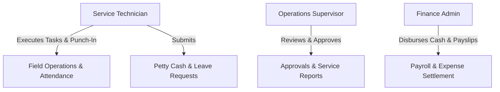
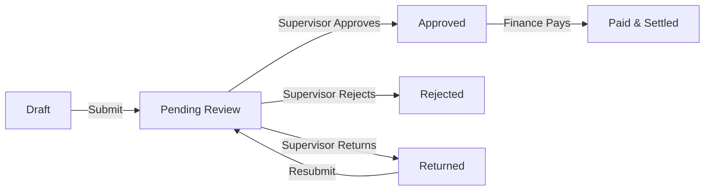
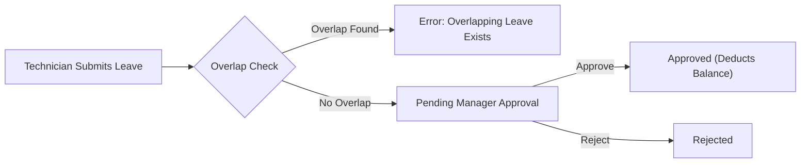
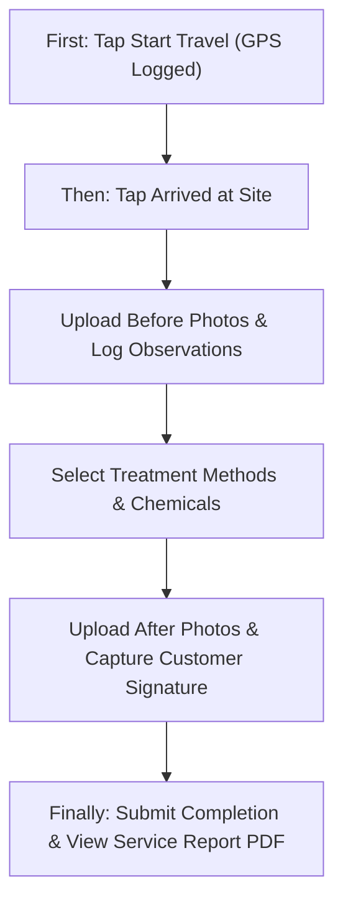
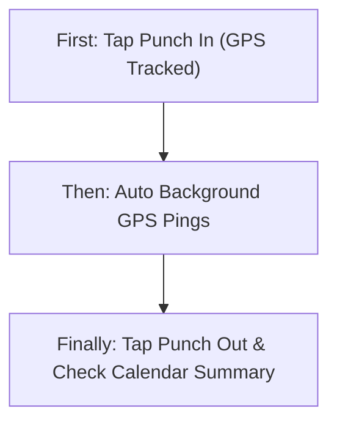
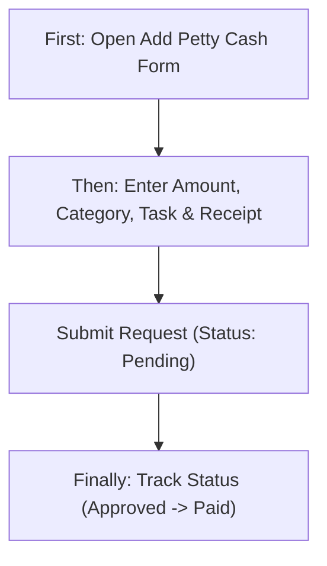
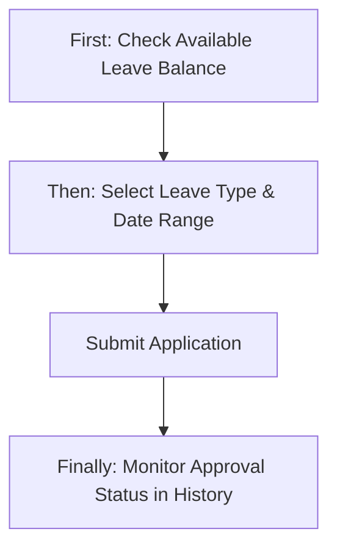
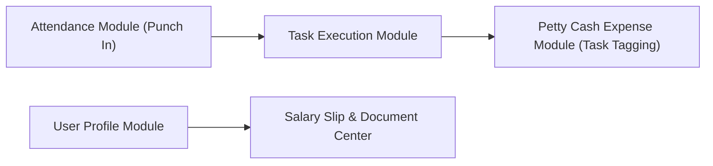

# Auriconnect ERP Mobile — Product & Business Documentation

## 1. Purpose & Business Need
The Auriconnect ERP Mobile application is an enterprise field service management (FSM) and human resource management (HRM) mobile solution built for service technicians, field operations teams, and regional staff. It bridges the gap between field execution and central ERP operations by enabling real-time task tracking, location-verified attendance, structured service execution (observations, photos, chemical usage, customer signatures), petty cash expense management, and leave requests. 

The primary business objectives achieved by this application include:
- Operational Transparency: Live GPS tracking for technician travel, arrival, on-site execution, and departure.
- Compliance & Quality Control: Enforced pre-service and post-service photo collection, chemical consumption logging, and customer signature validation before task completion.
- Automated Record Keeping: Auto-generation and instant download/sharing of formal Service Report PDFs for clients and office audits.
- Workforce Self-Service: Seamless mobile punch-in/out attendance, leave applications with balance tracking, petty cash expense reimbursement requests, document access, and salary slip downloads.

## 2. Users & Roles (who uses this and why)
- Service Technician / Field Engineer: Primary user of the application. Responsible for completing daily assigned tasks, tracking travel and site visits, logging service execution details, capturing photos and customer signatures, checking in attendance, applying for leaves, and submitting petty cash requests.
- Operations Supervisor / Line Manager: Reviews submitted service execution reports, monitors technician location pings, and approves or rejects petty cash requests and leave applications.
- Finance & Payroll Administrator: Processes approved petty cash reimbursements, records payment status, and publishes monthly salary slips for technicians.
- System Administrator: Manages user onboarding, tenant schema allocation, branch assignments, and role-based permissions across the organization.

## 3. Access Control (RBAC)
Access control is enforced based on user authentication state, tenant assignment (`X-Tenant-ID`), and assigned organizational roles. User capabilities are restricted at both the screen/UI level and the backend API gateway.

| Role | View list | View detail | Add | Edit | Inactive / Delete | Submit request | Receive / act | Approve | Reject |
|------|-----------|-------------|-----|------|-------------------|----------------|---------------|---------|--------|
| Service Technician | Yes (Own) | Yes (Own) | Yes (Photos, Signature, Observations, Petty Cash, Leave) | Yes (Profile) | No | Yes (Petty Cash, Leave) | No | No | No |
| Operations Supervisor | Yes (Team/Branch) | Yes (Team/Branch) | Yes | Yes | No | Yes | Yes (Inbox) | Yes (Leave, Petty Cash) | Yes |
| Finance Admin | Yes (Company) | Yes (Company) | Yes | Yes | No | Yes | Yes (Payment Inbox) | Yes (Petty Cash Pay) | Yes |
| Administrator | Yes (All) | Yes (All) | Yes | Yes | Yes (System Users) | Yes | Yes | Yes | Yes |

*Record-Level Rules*: Technicians are scoped exclusively to tasks, attendance logs, leave balances, and petty cash requests assigned to their explicit User ID and Branch ID. Supervisors gain visibility across all technicians sharing their assigned Branch IDs.

## 4. Capabilities & Features
### 4.1 Field Service Task Lifecycle Management
- Interactive task dashboard displaying Today's Schedule, Upcoming Services, and Completed Tasks.
- Multi-step status progression: Assigned -> Travel Started -> Arrived at Site -> On-Site Service Execution -> Task Completed.
- GPS Geofence verification for travel departure and site arrival.

### 4.2 Proof of Execution & Customer Validation
- Mandatory Before-Service photos and After-Service photos upload with image compression.
- Technician selfie capture for identity verification at customer location.
- Structured observation logging (Structural risks, Pest entry points, Hygiene ratings, Pest sightings).
- Chemical usage tracking (Chemical name selection and precise quantity measurement).
- On-screen touch signature pad with instant PNG encoding and server validation.
- Customer rating (1-5 stars) and feedback text entry per technician.

### 4.3 PDF Service Report Generation & Distribution
- Instant generation of official PDF Service Log reports.
- Local PDF preview using native viewer.
- Secure local PDF downloading directly to device download directory.
- Built-in PDF sharing via WhatsApp, Email, or system share sheet.

### 4.4 HRM & Location-Based Attendance
- Geolocation-stamped daily Punch-In and Punch-Out.
- Automated background location pinging during working shifts.
- Interactive monthly calendar showing attendance statuses (Present, Absent, Half-Day, Leave, Holiday).
- Detailed breakdown of daily arrival time, departure time, total working duration, and GPS coordinates.

### 4.5 Petty Cash Expense Management
- Tabbed view for tracking expenses: All, Pending, Approved, Paid, Returned, Rejected.
- Multi-criteria filtering by Date Range, Category, Search Query, and Min/Max Amount.
- Request creation with receipt attachment upload, task tagging, recipient selection, and Draft mode.
- Document downloading for uploaded receipt proofs.

### 4.6 Leave Request Management
- Real-time leave balance overview by leave type (Casual Leave, Sick Leave, Paid Leave, Annual Leave).
- Overlap detection preventing double-booking of leave dates.
- Tabbed request history (All, Pending, Approved, Rejected) with date and keyword filters.

### 4.7 Profile, Documents & Payroll
- Technician personal profile with contact information, emergency contact, and branch memberships.
- Profile editing capability for selectable fields.
- Document Center for viewing and downloading employment and compliance documents.
- PDF Salary Slip downloader for selected month and year.

## 5. CRUD Operations

### 5.1 Create (Add)
- **Task Execution Record**: Created by Service Technician on site. Requires Before Photos, Observations, Chemical Usage, Service Execution details, After Photos, Customer Signature, and Ratings. Upon final submission (`/api/v1/tasks/complete`), the task transitions to Completed status.
- **Petty Cash Request**: Submitted by Technician/Staff via `Add Petty Cash` form. Accepts Category, Amount, Description, Expense Dates, Task linkage, Recipient, and Receipt File. Can be saved as `DRAFT` or submitted directly as `PENDING`.
- **Leave Application**: Created by Technician via `Leave Apply` screen. Requires Leave Type selection, From Date, To Date, Half-Day toggle, and Reason text. Submits to `/api/v1/mobile/hrm/leaves/me`.

### 5.2 Read — List
- **Task List**: Loaded via `/api/v1/mobile/tasks/my` (Assigned) and `/api/v1/mobile/tasks/my/completed`. Supports date picker filtering, category filters, and pull-to-refresh. Displays task number, customer name, site address, time slot, and workflow status tags.
- **Petty Cash List**: Loaded via `/api/v1/petty-cash/requests/my/list` with pagination (`pageNo`, `pageSize`). Supports status tabs, date range filters, search queries (`q`), and category filters. Displays request ID, expense category, date range, amount, and status pill.
- **Leave List**: Loaded via `/api/v1/mobile/hrm/leaves/me/requests`. Supports status tabs (Pending, Approved, Rejected), date filters, and reason search. Displays leave type name, requested date range, number of days, and approval status.

### 5.3 Read — Detail / Get details
- **Service Task Detail**: Fetched via `/api/v1/mobile/tasks/my/detail-screen?taskId={id}`. Populates customer details, site instructions, technician assignments, scheduled dates, treatment method lists, observation option dropdowns, and prior photos.
- **Service Report**: Fetched via `/api/v1/mobile/tasks/my/service-report?taskId={id}`. Displays structured summary, chemical usage list, treatment methods, observations, photo grid, feedback rating stars, formatted signature image, and signed date/time.
- **Petty Cash Detail**: Fetched via `/api/v1/petty-cash/requests/by-id?id={id}`. Renders full request metadata, reviewer notes, payment timestamps, linked task info, and downloadable receipt attachments.

### 5.4 Update (Edit)
- **User Profile**: Updated via `PUT /api/v1/mobile/profile?userId={id}`. Allows editable personal details while keeping tenant schema, branch IDs, and system role immutable.
- **Task Workflow State**: Incremental status updates as technician proceeds through workflow (Travel Started -> Arrived -> On-Site -> Departed -> Completed).

### 5.5 Inactive / Delete
- **Local Cache & Storage**: Sessions cleared via `Logout` button, which wipes local shared preferences and GetX controller instances.
- **Soft Deletion / Status Invalidation**: Petty cash requests or leave applications rejected by approvers remain stored in system history with `REJECTED` or `RETURNED` status for audit trails; hard deletion is prohibited at the mobile client level.

## 6. Request & Approval Flows

### 6.1 Petty Cash Approval Flow
- **Submission**: User submits a petty cash request. Initial status set to `PENDING` (or `DRAFT` if saved for later).
- **Review**: Supervisor receives request in management queue. Can approve, reject, or return the request for modifications.
- **Payment Settlement**: Finance Admin reviews `APPROVED` requests and marks them as `PAID` upon disbursement.

### 6.2 Leave Request Approval Flow
- **Submission**: Technician submits leave dates. System checks for date overlap against active/approved leaves.
- **Review**: Line Manager reviews leave balance and reason.
- **Decision**: Manager marks application as `APPROVED` or `REJECTED`. Balance is updated accordingly.

## 7. Forms — Add vs Edit Field Access

| Field (Business Label) | On Add (Create) | On Edit (Update) | Notes |
|-----------------------|-----------------|------------------|-------|
| Tenant Schema / ID | Pre-filled / Auto | Locked | Set during login or login request |
| Task ID | Locked / Pre-filled | Locked | Injected from assigned service card |
| Customer & Site Address | Locked / Display | Locked | Read-only from task assignment |
| Before / After Photos | Required Upload | Locked after submit | Captured via camera/gallery on site |
| Customer Signature | Required Draw | Locked after submit | Signed on screen pad |
| Signed Date & Time | Auto-generated | Locked | Captured at exact moment of upload |
| Petty Cash Category | Required Dropdown | Locked after submit | Selected from pre-defined list |
| Petty Cash Amount | Required Input | Locked after submit | Numeric input |
| Task Tagging (Petty Cash)| Optional Dropdown| Locked after submit | Selected from active tasks dropdown |
| Recipient User | Required Dropdown | Locked after submit | Selected from eligible recipients |
| Receipt Attachment | Optional Upload | Locked after submit | PDF or Image proof upload |
| Leave Type | Required Dropdown | Locked after submit | Casual, Sick, Paid, or Annual Leave |
| Leave Date Range | Required Pickers | Locked after submit | Cannot overlap existing leave dates |
| Leave Reason | Required Text | Locked after submit | Text area input |
| User Mobile / Email | Pre-filled | Editable | Editable in Profile Settings |

## 8. Lists, Dropdowns, Details & Data Rendering

### 8.1 List Rendering
- **Service Cards**: Rendered with status badges (Assigned, In Progress, Completed), customer site labels, date/time chips, and action buttons ("Start Travel", "Execute Service", "View Report").
- **Petty Cash List**: Paginated list view rendering category icon, request ID, date range, amount, and colored status pill (Yellow = Pending, Green = Approved/Paid, Red = Rejected, Blue = Returned).
- **Leave List**: Rendered with leave type badge, start/end dates formatted as `dd-MMM-yyyy`, total days, and status indicator.

### 8.2 Dropdowns & Lookups
- **Task Dropdown**: Endpoint `/api/v1/petty-cash/tasks-dropdown`. Searches and lists active assigned tasks for linking expenses to specific job orders.
- **Eligible Recipients Dropdown**: Endpoint `/api/v1/petty-cash/requests/eligible-recipients`. Fetches authorized staff members eligible to receive cash disbursements.
- **User Dropdown**: Endpoint `/api/v1/users/dropdown`. Filters users by branch ID and app user status.
- **Observation Options Dropdown**: Endpoint `/api/v1/observation-options`. Populates structural, hygiene, entry points, and sighting options.
- **Treatment Methods Dropdown**: Endpoint `/api/v1/service-treatments`. Populates methods specific to the selected service category.

### 8.3 Detail & Get-Details Rendering
- **Service Report Screen**: Fetches full report object and formats dates into clean display strings (`dd MMM yyyy`), 24h times into 12h AM/PM strings (`02:30 PM`), and signature images into a centered landscape canvas container with loading indicators.

## 9. How It Works (End-to-End User Flows)

### 9.1 Service Technician — Complete Field Task Journey
**First:** Technician views assigned tasks on Home Dashboard, selects a task, and taps "Start Travel" (GPS location captured).
**Then:** Upon arrival, technician taps "Arrived at Site", captures required "Before Photos", logs structural/hygiene observations, selects treatment methods and chemical quantities, captures "After Photos", and asks customer to sign on screen.
**Finally:** Technician enters customer rating/feedback, taps "Complete Task", and views/shares the generated Service Report PDF.

### 9.2 Service Technician — Daily Attendance & Shift Journey
**First:** Technician opens app at start of shift and taps "Punch In" (GPS location and timestamp recorded).
**Then:** App runs background location tracking pings while technician moves between customer sites.
**Finally:** At the end of the shift, technician taps "Punch Out" and views updated daily attendance status in Calendar view.

### 9.3 Service Technician — Petty Cash Expense Journey
**First:** Technician incurs an out-of-pocket expense during a task visit and opens "Add Petty Cash".
**Then:** Selects category, enters amount, tags the relevant task, attaches receipt image/PDF, and taps "Submit Request".
**Finally:** Tracks request progress under "Pending Requests" tab until supervisor approves and finance disburses payment.

### 9.4 Service Technician — Leave Application Journey
**First:** Technician checks Leave Balance on Leave Apply screen.
**Then:** Selects leave type, chooses start and end dates, enters reason, and submits.
**Finally:** Receives instant validation (overlap check) and monitors request status in Leave History.

## 10. Cross-Module Interactions
- **Task Execution <-> Petty Cash**: Petty Cash form queries active tasks from Task Module to link field expenses to specific customer service orders.
- **Attendance <-> Task Execution**: Technician must be Punched-In before starting travel or completing field tasks.
- **Profile <-> Document Center & Payroll**: User profile module provides branch and user IDs to fetch document downloads and salary slips.

## 11. Data the Business Cares About
- **Task Identification**: Task Number, ApiTaskId, Customer Name, Site Label, Scheduled Date, Time Slot, Service Category.
- **Execution Audit**: Travel Start Time/Location, Site Arrival Time/Location, Departure Time, Before/After Photo URLs, Technician Selfie URL.
- **Quality & Safety Logs**: Structural Observations, Hygiene Rating, Entry Points, Sightings, Chemical Name, Chemical Quantity Used, Treatment Method List.
- **Customer Sign-Off**: Signature Status, Signature Image URL, Signed Date & Time, Average Rating Stars, Customer Feedback Text.
- **HR & Location Logs**: Punch In Timestamp, Punch Out Timestamp, Punch Latitude/Longitude, Location Ping Logs, Working Hours Duration.
- **Financial Logs**: Petty Cash Request ID, Category, Amount, Description, Linked Task ID, Recipient Name, Status (Pending/Approved/Paid/Rejected/Returned), Receipt Attachment Document ID.
- **Leave Records**: Leave Type Code (CL, SL, PL, AL), Start Date, End Date, Total Days Count, Overlap Warning, Reason Text, Approval Status.

## 12. Rules, Validations & Constraints
- **Signature & Photo Validation**: Task completion requires at least one Before photo, one After photo, and a non-empty customer signature PNG. Max signature file size limit is 10 MB.
- **Geofencing & Location**: Punch In, Punch Out, and Travel Start require active GPS permissions and non-null latitude/longitude coordinates.
- **Leave Overlap Prevention**: Submitting a leave application for dates overlapping an existing pending/approved leave triggers a 400 Bad Request error with clear date range warning.
- **Petty Cash Drafts**: Expenses saved in `DRAFT` state are stored on the server and do not enter the approver inbox until explicitly submitted.
- **Network Timeouts**: API connection, send, and receive timeouts are set to 80 seconds via `DioClient` with automatic Bearer token interceptor injection.

## 13. Loopholes, Gaps & Current Limitations
- **Offline Mode Support**: Currently, task execution, photo upload, and customer signature submission require active internet connectivity. No offline queueing mechanism exists for remote areas without cell coverage.
- **Supervisor Actions in Mobile UI**: While approval APIs exist on the backend, certain high-level administrative functions (e.g. bulk petty cash payment settlement) require logging into the Central Web ERP portal.
- **Multi-Tenant Header Dependency**: App relies on `X-Tenant-ID` header saved in local preferences (`PreferencesKey.tenantId`). If local storage is wiped, user must re-authenticate to re-establish tenant scope.

## 14. Existing Functionality Summary
All documented capabilities—including Authentication, Multi-step Task Execution, Photo & Signature Capture, Formatted PDF Service Report Viewing/Downloading/Sharing, Location-based Attendance, Petty Cash Management with Lookups, Leave Applications with Overlap Rules, Document Center, and Salary Slip Downloads—are 100% operational in the current codebase.

## 15. Reference — APIs, Screens & UI Actions

### 15.1 APIs
| Method | Path | Purpose (plain language) | Used by (screen/flow) |
|--------|------|--------------------------|------------------------|
| POST | `/api/v1/auth/login` | Authenticate user credentials and return Bearer token & tenant schema | Login Screen |
| POST | `/api/v1/auth/forgot-password/send-otp` | Send password reset OTP via Email or SMS | Forgot Password Screen |
| POST | `/api/v1/auth/forgot-password/verify-otp` | Verify OTP code and issue reset token | Verify OTP Screen |
| POST | `/api/v1/auth/forgot-password/reset` | Set new password using reset token | Reset Password Screen |
| POST | `/api/v1/auth/logout` | Invalidate user session on backend | Profile / Settings |
| GET | `/api/v1/mobile/tasks/my` | Fetch assigned service tasks for technician | Home / Services Dashboard |
| GET | `/api/v1/mobile/tasks/my/completed` | Fetch completed service tasks history | Services Dashboard |
| GET | `/api/v1/mobile/tasks/my/detail-screen` | Fetch detailed info for a specific task | Service Execution Screen |
| POST | `/api/v1/mobile/technician-tracking/task/start-travel` | Record travel start timestamp and GPS coordinates | Service Execution Flow |
| POST | `/api/v1/mobile/technician-tracking/task/arrived` | Record site arrival timestamp and GPS coordinates | Service Execution Flow |
| POST | `/api/v1/mobile/technician-tracking/task/on-site` | Record on-site status timestamp and GPS | Service Execution Flow |
| POST | `/api/v1/mobile/technician-tracking/task/departed` | Record site departure timestamp and GPS | Service Execution Flow |
| POST | `/api/v1/mobile/tasks/my/photos/before` | Upload pre-service inspection photos | Before Photos Screen |
| POST | `/api/v1/mobile/tasks/my/photos/after` | Upload post-service completion photos | After Photos Screen |
| POST | `/api/v1/mobile/tasks/my/photos/selfie` | Upload technician verification selfie photo | Service Execution Flow |
| POST | `/api/v1/mobile/tasks/my/service-executions` | Submit treatment observations, chemicals, and methods | Technician Observation Screen |
| POST | `/api/v1/mobile/tasks/my/customer-signature` | Upload base64 customer signature PNG | Customer Signature Screen |
| POST | `/api/v1/tasks/complete` | Complete task and trigger report generation | Service Completion Screen |
| GET | `/api/v1/mobile/tasks/my/service-report` | Fetch structured service report data | Service Report Screen |
| GET | `/api/v1/mobile/tasks/my/service-report/pdf` | Download service report PDF binary file | Service Report Screen |
| POST | `/api/v1/mobile/hrm/attendance/punch-in` | Record morning shift punch-in with location | Home Dashboard Header |
| POST | `/api/v1/mobile/hrm/attendance/punch-out` | Record end of shift punch-out with location | Home Dashboard Header |
| POST | `/api/v1/mobile/technician-tracking/ping` | Send background location tracking ping | Background Service |
| GET | `/api/v1/mobile/hrm/attendance/day` | Fetch attendance summary and calendar history | Calendar Screen |
| GET | `/api/v1/petty-cash/requests/my/list` | Fetch paginated list of petty cash requests | Petty Cash Main Screen |
| GET | `/api/v1/petty-cash/requests/by-id` | Fetch specific petty cash request detail | Petty Cash Details Screen |
| POST | `/api/v1/petty-cash/requests` | Submit or save draft petty cash expense | Add Petty Cash Screen |
| GET | `/api/v1/petty-cash/tasks-dropdown` | Fetch assigned tasks for expense tagging | Add Petty Cash Screen |
| GET | `/api/v1/petty-cash/requests/eligible-recipients` | Fetch list of cash recipients | Add Petty Cash Screen |
| GET | `/api/v1/users/dropdown` | Fetch user dropdown list by branch | Add Petty Cash Screen |
| GET | `/api/v1/petty-cash/documents/download` | Download receipt document attachment | Petty Cash Details Screen |
| GET | `/api/v1/mobile/hrm/leaves/me/balance` | Fetch current leave balances by leave type | Leave Apply Screen |
| GET | `/api/v1/mobile/hrm/leaves/me/requests` | Fetch history of leave applications | Leave Apply Screen |
| POST | `/api/v1/mobile/hrm/leaves/me` | Apply for new leave | Leave Apply Screen |
| GET | `/api/v1/mobile/profile` | Fetch technician profile details and documents | Profile Screen |
| PUT | `/api/v1/mobile/profile` | Update technician profile details | Edit Profile Screen |
| GET | `/api/v1/users/documents/download` | Download employment document PDF | Profile Screen |
| GET | `/api/v1/hrm/salary/slip/download` | Download monthly salary slip PDF | Profile Screen |
| GET | `/api/v1/notifications` | Fetch paginated push notifications list | Notifications Screen |
| GET | `/api/v1/notifications/unread-count` | Fetch count of unread notifications | Home Dashboard Icon |
| POST | `/api/v1/notifications/{id}/read` | Mark single notification as read | Notifications Screen |
| POST | `/api/v1/notifications/read-all` | Mark all notifications as read | Notifications Screen |

### 15.2 Frontend Screen Routes
| Route | Screen Purpose | Primary Users |
|-------|----------------|---------------|
| `/` | Splash screen with auth token check | All Users |
| `/login` | User login & tenant authentication | All Users |
| `/dashboard` | Bottom navigation host (Home, Services, Calendar, Wallet, Profile) | All Users |
| `/profile` | Technician profile details and document downloader | Service Technician |
| `/select-language` | App display language selection | All Users |

### 15.3 Click Events, Filters, Search & Controls
| Screen / Route | Control | Type | What Happens |
|----------------|---------|------|--------------|
| Login Screen | Tenant ID Field | Text Input | Pre-configures `X-Tenant-ID` header |
| Login Screen | Login Button | Primary Button | Submits credentials; stores tokens and navigates to Dashboard |
| Login Screen | Forgot Password Link | Text Button | Opens OTP password reset drawer |
| Home Dashboard | Punch In / Out Button | Toggle Button | Captures GPS location and submits shift start/end |
| Home Dashboard | Notification Bell | Icon Button | Opens Notifications screen with unread badge count |
| Services Screen | Date Range Filter | Date Picker | Filters assigned and completed tasks by date range |
| Services Screen | Category Selector | Dropdown Chip | Filters service cards by service category |
| Service Execution | Start Travel Button | Action Button | Logs travel start timestamp and GPS location |
| Service Execution | Arrived Button | Action Button | Logs site arrival timestamp and GPS location |
| Service Execution | Before Photos Card | Button / Tile | Opens camera/gallery picker for pre-service photos |
| Service Execution | Observations Tile | Button / Tile | Opens structural/hygiene observation form |
| Service Execution | After Photos Card | Button / Tile | Opens camera/gallery picker for post-service photos |
| Service Execution | Customer Signature Card | Button / Tile | Opens full-screen touch signature drawing pad |
| Service Execution | Complete Task Button | Primary Button | Submits execution payload and triggers PDF report generation |
| Service Report | View PDF Button | Button | Opens local PDF previewer |
| Service Report | Download PDF Button | Primary Button | Saves PDF to local device Downloads directory |
| Service Report | Share Button | Outlined Button | Opens OS native file share dialog for PDF |
| Petty Cash Screen | Status Tabs | Tab Bar | Filters requests by All, Pending, Approved, Paid, Returned, Rejected |
| Petty Cash Screen | Filter Drawer Trigger | Icon Button | Opens date range, amount range, and category filter sheet |
| Petty Cash Screen | Add Request FAB | Floating Action Button | Opens Add Petty Cash form screen |
| Add Petty Cash | Save Draft Button | Outlined Button | Posts expense payload with `status: "DRAFT"` |
| Add Petty Cash | Submit Request Button | Primary Button | Posts expense payload with `status: "PENDING"` |
| Petty Cash Details | Download Receipt Button | Icon Button | Downloads receipt attachment to local storage |
| Leave Apply Screen | Status Tabs | Segmented Control | Filters leave requests by All, Pending, Approved, Rejected |
| Leave Apply Screen | Leave Type Picker | Dropdown | Selects Casual, Sick, Paid, or Annual Leave |
| Leave Apply Screen | Apply Leave Button | Primary Button | Submits leave request after validating date overlap |
| Profile Screen | Download Salary Slip | Tile Button | Opens month/year picker and downloads payslip PDF |
| Profile Screen | Logout Button | Red Action Button | Clears tokens, deletes controllers, and redirects to Login |
