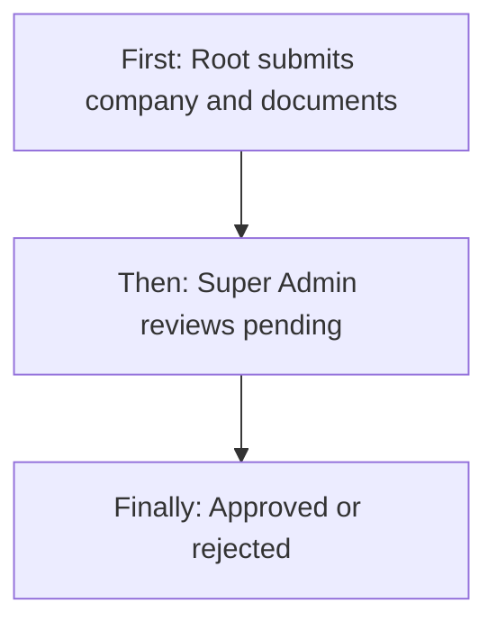
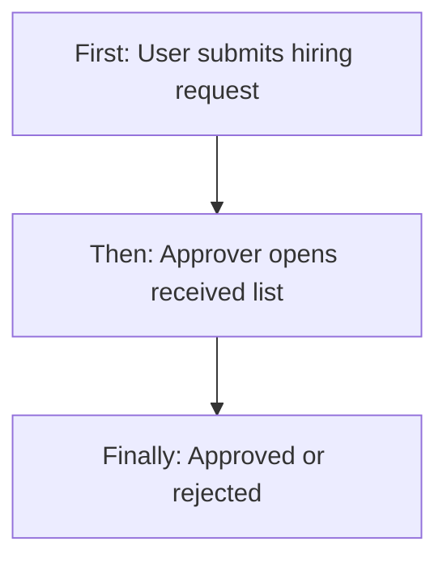
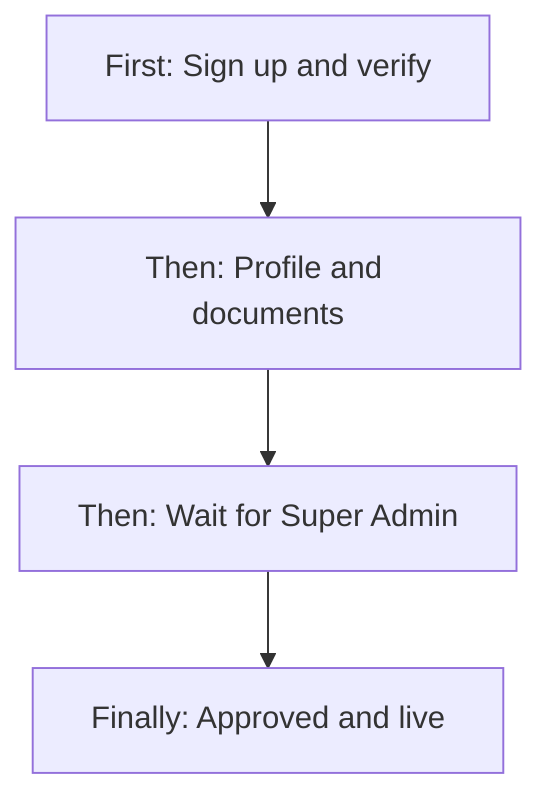
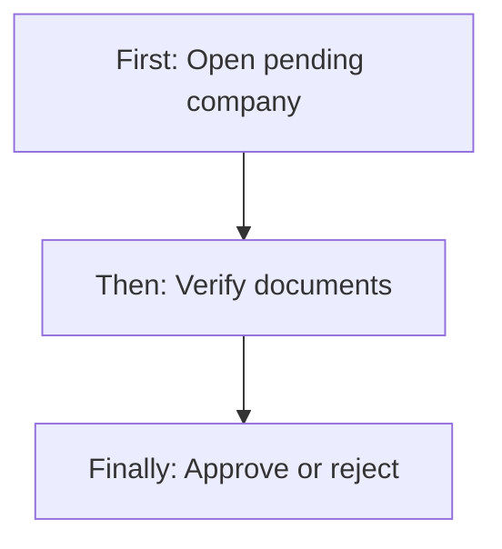
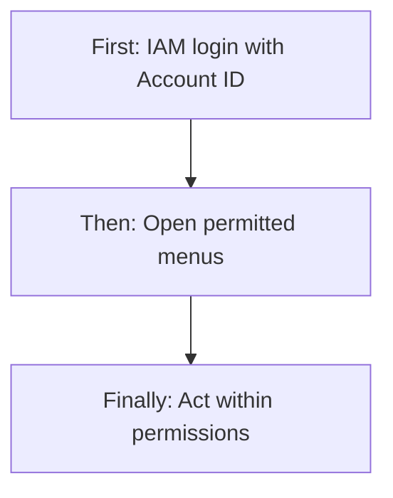
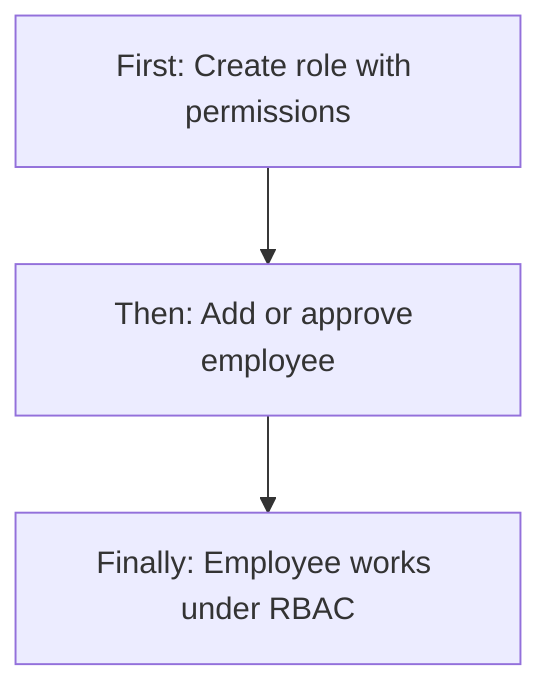
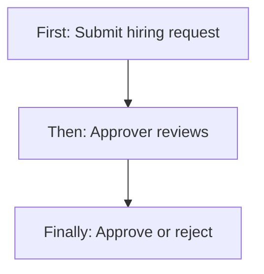
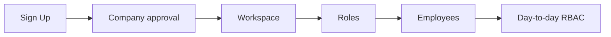
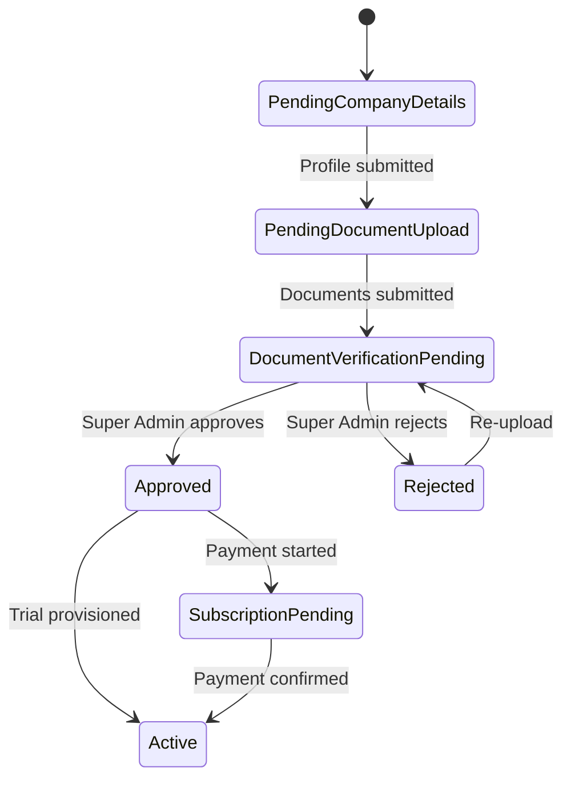

# Sign Up, Login, Super Admin Access, User Onboarding & Access Control (RBAC) — Product & Business Documentation

## 1. Purpose & Business Need

Seravion Connect is a multi-company platform. Before anyone works in a company workspace, the product must answer three questions in order: **Who is the company owner?** (Sign Up and email verification), **May this company enter the product?** (Super Admin review and approval of company details and documents), and **Who inside that company may do what?** (login as Root or IAM staff, plus roles and permissions).

This documentation explains that full journey **and** the access layer that runs after a company is live:

- How visitors register and verify email.
- How Root (company owner) users complete onboarding and wait for platform approval.
- How Seravion Super Admin receives pending companies, verifies documents, and approves or rejects them.
- How Root, IAM, and Super Admin log in differently.
- How **Role-Based Access Control (RBAC)** limits menus and actions using roles, modules, and permissions.
- How **Role Management** and **User (Employee) Management** provide full create / read / update / inactive-or-delete behavior.
- How **hiring request and approval** works for employees (separate from company onboarding approval).

**Outcomes today:** a gated path from registration to an active company; clear separation of Super Admin, Root owner, and IAM employee; company-level approve/reject with document re-upload; tenant roles and employees with permission matrices; and hiring requests that Approvers can approve or reject.

---

## 2. Users & Roles (who uses this and why)

### 2.1 Seravion Super Admin

Platform operators. They log in through the Seravion entry, manage all registered companies (list, review, approve/reject, trial), maintain platform Role Management, subscription plans, and per-company modules. On Super Admin screens, ordinary module permission checks are bypassed for them as platform operators.

### 2.2 Root user (company CEO / owner)

The person who signs up the company. After email verification they log in as Root, complete company profile and documents, wait for Super Admin decision, then purchase or use trial access. Inside the live company they typically hold CEO-level authority: they can manage employees and roles, and they bypass many action checks on the server by virtue of being the company owner (the application still shows menus based on their granted module permissions).

### 2.3 IAM user (tenant employee)

Staff created in User Management (directly or after a hiring request is approved). They log in with **Account ID** plus credentials. What they see and can click follows their role’s module permissions (View, Add, Edit, Delete, Request, Approve, and related actions).

```mermaid
flowchart LR
  sa["Super Admin"] --> saGoal["Approve companies and run platform"]
  root["Root owner"] --> rootGoal["Onboard company and administer tenant"]
  iam["IAM employee"] --> iamGoal["Work within assigned permissions"]
```

---

## 3. Access Control (RBAC)

### 3.1 How the access layer works

Access is built from three business building blocks:

1. **Module** — a product area (for example Employee / User Management, Role Management, Inventory).
2. **Action** — what someone may do in that area: typically View (read), Add, Edit, Delete, Request, Approve, Export, Download.
3. **Role** — a named profile that turns specific module/action combinations **on** or **off**. Employees receive a role; at login the system loads their effective permissions and the menus and buttons follow those permissions.

Permission access levels are therefore **role-based**: an employee with only View on Employee Management can open the list but not Add; an employee with Request can submit hiring requests; an employee with Approve can act on received hiring requests.

**Login type determines the outer gate:**

| Login path | Outer access | Then RBAC |
|------------|--------------|-----------|
| Seravion Super Admin | Platform shell only | Module checks bypassed for Super Admin UI |
| Root user | Onboarding then company shell | Menus follow permissions; owner authority still allows most server actions |
| IAM user | Company shell with Account ID | Full module/action checks on UI and APIs |

**Record-level notes:** company approval is platform-wide for Super Admin (all companies). Hiring “My requests” vs “Received” separates own submissions from items waiting for an Approver. Employee lists can be filtered by branch, department, designation, role, and status.

### 3.2 Role × action matrix (this module set)

| Role | View list | View detail | Add | Edit | Inactive / Delete | Submit request | Receive / act | Approve | Reject |
|------|-----------|-------------|-----|------|-------------------|----------------|---------------|---------|--------|
| Super Admin | Yes (companies, platform roles, plans) | Yes | Yes (plans, roles; not tenant employees) | Yes | Soft-inactivate plans; role delete restricted on platform path | No (company flow is review, not “request”) | Yes (pending companies) | Yes (company onboarding) | Yes (company onboarding) |
| Root / CEO | Yes (own company areas they can open) | Yes | Yes (employees, roles when permitted) | Yes | Soft-inactive employees; delete+reassign roles | Yes (hiring, if Request granted or owner) | Yes (hiring inbox if Approve granted or owner) | Yes (hiring; company docs they submit) | Yes (hiring reject) |
| IAM — Role Management granted | Yes / per action | Yes | If Add | If Edit | If Delete (reassign) | No for roles | No for roles | No for roles | No for roles |
| IAM — Employee Management View only | Yes | Yes | No | No | No | No | No | No | No |
| IAM — Employee + Request | Yes | Yes | Direct Add only if Add | If Edit | If Delete | Yes (hiring) | No | No | No |
| IAM — Employee + Approve | Yes | Yes | If Add | If Edit | If Delete | If Request | Yes (received hiring) | Yes | Yes |

**This module does not use request/approve for Role CRUD** — roles are created and edited directly. **Company onboarding** and **employee hiring** are the request/approve-style workflows.

---

## 4. Capabilities & Features

### 4.1 Sign Up and email verification

Visitors register company name, authorized person, phone, email, username, and password. The account stays inactive until the email link is confirmed. Sign Up does not open the full ERP or create the company workspace yet.

### 4.2 Login (three paths)

- **Root user** — owner login; routed into onboarding or dashboard by company status.
- **IAM user** — Account ID + credentials; lands on the operational dashboard with RBAC menus.
- **Seravion Super Admin** — special login entry for platform operators; lands on Company Management.

### 4.3 Root onboarding

Company information, then document upload, then wait (or re-upload after rejection), then subscription when approved.

### 4.4 Super Admin company access grant

Pending company inbox, document verification, approve / reject, optional trial, then approved-company administration (overview, documents, subscription, email, modules).

### 4.5 Role Management (platform and tenant)

Create roles with permission matrices and optional receivers for request routing in other modules; list, view, edit, delete with reassignment; analytics. Application-user roles can be limited to app-style access.

### 4.6 User (Employee) Management

Full employee CRUD, filters, document download where allowed, and hiring request / received / approve-reject tabs when permissions allow.

### 4.7 Password recovery

Owner-oriented forgot-password with OTP and set-new-password.

### 4.8 Session behavior

Single active session per account family; Super Admin stays out of company Account ID context; IAM sessions carry Account ID.

---

## 5. CRUD Operations

### 5.1 Create (Add)

**Company owner (Sign Up)**  
**First:** Open Login → Sign up → fill registration fields → Get started.  
**Then:** Verify email from the message.  
**Finally:** Account can log in as Root.

**Company profile & documents**  
Root submits company details (create/update profile bundle), then uploads required documents (create document package).

**Role**  
Admin/Root/Super Admin (as allowed) opens Role Configuration or Super Admin Role Management → Create → name, description, application-user flag, module/action matrix, receivers → Save. New role becomes available for employees.

**Employee**  
Permitted users open User Management → Add Employee → multi-step form (identity, role, branches, contacts, optional salary/leave/docs) → Save. Credentials and employee code are set on create.

**Hiring request (create request, not yet employee)**  
Users with Request (or Root) submit a hiring request instead of (or before) direct Add.

### 5.2 Read — List

| List | How it loads / what it shows |
|------|------------------------------|
| Super Admin companies | Status chips (Pending / Approved / Rejected), search, pagination; columns include commercial dates and capacity hints |
| Platform / tenant roles | Cards or table with analytics; search/filter; View / Edit / Delete actions when allowed |
| Employees | Search, filters (branch, department, designation, role, status, dates), pagination; Add gated by permission |
| Hiring my / received | Separate tabs for submitted vs inbox |
| Purchased subscriptions (adjacent) | After go-live commercial history (see subscription docs) |

Empty states show when no rows match filters.

### 5.3 Read — Detail / Get details

| Record | What opening it does |
|--------|----------------------|
| Pending company | Loads profile + documents for Super Admin decision |
| Approved company | Tabbed detail (overview, docs, subscription, email, modules) |
| Role | Loads name, description, flags, full permission matrix, receivers |
| Employee | Loads profile wizard in view mode (or dedicated view route) |
| Hiring request | Loads request detail for approve/reject |

### 5.4 Update (Edit)

| Record | Who / what changes |
|--------|---------------------|
| Company overview (approved) | Super Admin edits commercial/profile overview fields and saves |
| Documents | Root re-uploads when rejected; Super Admin can replace files on approved companies |
| Role | Description, application-user, permissions, receivers; **role name is not truly changeable** after create (see field table) |
| Employee | Profile, role, branches, status, optional password; **employee ID stays fixed** |
| Subscription override / modules | Super Admin (commercial docs) |

### 5.5 Inactive / Delete

| Record | Behavior |
|--------|----------|
| Employee | Soft inactive (marked inactive / not fully hard-deleted); can be set Active again on edit when allowed |
| Role | Hard delete only after choosing a **reassign** role for existing users; CEO/system owner role cannot be removed; UI may show Active/Inactive radios that are **not fully persisted** as a soft-inactive API |
| Subscription plan | Soft inactivate (retire from new sales) — see subscription documentation |
| Company | Rejected / pending states — not a generic “delete company” in this journey |
| Global Sign Up account | No general owner self-delete API in this journey |

---

## 6. Request & Approval Flows

### 6.1 Company onboarding approval (primary platform workflow)

**Submit request (business sense):** Root completes company information and uploads documents. Status becomes document verification pending — the company is effectively **waiting for Super Admin**.

**Receive / inbox:** Super Admin Company Management filtered to Pending; opening a row is the inbox item.

**Approve / Reject / Return:**

- **Approve** — documents marked verified; optional trial; company may proceed to subscription / workspace.
- **Reject** — reason required; Root returns to documents to re-upload (this is the **return** path; there is no separate “Returned” status label).
- **Pending** as a save choice in the UI is unreliable relative to real statuses (see Gaps).

### 6.2 Employee hiring request & approval

**Submit request:** Permitted user (or Root) creates a hiring request from User Management.

**Receive / inbox:** Approvers open the Received hiring tab.

**Approve / Reject:** Approver verifies and approves or rejects (with reason when rejecting). Approval advances hiring so staffing can continue; rejection stops that request.

### 6.3 Role Management

**This module does not use request/approve for creating or changing roles.** Roles are direct CRUD. Receiver settings on a role configure who should receive requests **in other modules**, not approval of the role itself.

---

## 7. Forms — Add vs Edit Field Access

### 7.1 Role form (platform and tenant)

| Field (business name) | On Add | On Edit | Notes |
|----------------------|--------|---------|-------|
| Role name | Editable / Required (standard names pickable on create) | Appears editable | **Effectively locked** — system keeps original name |
| Description | Editable | Editable | |
| Status Active / Inactive | Shown | Shown | **Not reliably saved** through create/update APIs today |
| Is application user | Editable | Editable | When on, module permission matrix cleared |
| Module / action permissions | Editable matrix | Editable (replace all) | Defines RBAC access levels |
| Request / approval receivers | Editable where request/approval actions apply | Editable | Used for routing requests in other modules |
| Reserved Super Admin named role | — | Edit/delete blocked in UI | Protects platform role |

### 7.2 Employee (User) form

| Field (business name) | On Add | On Edit | Notes |
|----------------------|--------|---------|-------|
| Employee ID / code | Required, editable | Shown but **immutable** on save | Set once |
| Password / confirm | Required | Optional | Change only if filled |
| Name, email, phone, role, branches | Required as designed | Editable | |
| Status Active / Inactive | Optional | Editable | Soft inactive / reactivate |
| Department, designation, manager | Dropdowns | Dropdowns | Lookups |
| Addresses, salary, leave, documents | As wizard steps allow | Editable with document ops | |
| Permissions | From role; adjustable where UI allows | Adjustable | Tied to RBAC |

### 7.3 Company approval (Super Admin)

| Field (business name) | On approval screen | Notes |
|----------------------|--------------------|-------|
| Company profile fields | Visible / may look editable | **Approval Save does not persist overview** — use Overview edit after approve |
| Document verify ticks | Required for approve | |
| Approve / Reject | Required decision | |
| Rejection reason | Required on reject | Min length enforced in UI |
| Enable trial + dates | Optional on approve | Provisions access when approved with trial |
| Admin comment | Optional | |
| Branch / technician steppers | Shown | **Not part of approval save contract** — treat as operator context |

### 7.4 Sign Up form

All registration fields are create-only; there is no “edit Sign Up” screen for the same global owner record in this journey.

---

## 8. Lists, Dropdowns, Details & Data Rendering

### 8.1 List rendering

- **Companies:** Status filters, search threshold, pagination, row actions View/Edit depending on status.
- **Roles:** Analytics summary cards; list with view/edit/delete; Super Admin vs tenant analytics sources differ.
- **Employees:** Debounced search; multi-filter; permission-aware Add and row actions (view/edit/inactive).
- **Hiring tabs:** Own list vs received list; filters per tab.

### 8.2 Dropdowns & lookups

| Dropdown | What appears | Notes |
|----------|--------------|-------|
| Login persona | Root / IAM (Seravion via special entry) | Chooses auth path |
| Role name (create) | Standard/public roles plus custom | Speeds consistent naming |
| Modules / actions | Full platform catalogs | Builds permission matrix |
| Receiver roles | Other roles | For request routing config |
| Employee role | Active roles in company | Assigns RBAC profile |
| Branches / managers / departments / designations | Company lookups | Dependent filters on list and form |
| Country / state / city (company info) | Cascading location | Onboarding profile |
| Subscription plan (later) | Active plans | After approval |

### 8.3 Detail / get-details rendering

Opening a company, role, or employee loads the full bundle for that screen (profile + documents; matrix; wizard steps). Action buttons then follow status and RBAC (Approve only for Super Admin on companies; hiring Approve only with Approve permission or Root). Cascading fills: selecting a role can load default permissions; selecting location cascades address fields.

---

## 9. How It Works (end-to-end user flows)

### 9.1 Root — Sign Up through approved company

**First:** Sign up and verify email, then log in as Root.  
**Then:** Complete company information and documents; wait while Super Admin reviews (or re-upload if rejected).  
**Finally:** After approval, continue to subscription/trial and the live dashboard; create roles and employees as needed.

1. Login → Sign up → Get started → verify email → Root login.  
2. Company information → Save → Documents → Submit.  
3. Remain pending until Super Admin acts; if rejected, re-upload.  
4. Approved → subscription or trial path → dashboard.  
5. Optionally open Role Configuration and User Management (RBAC).

### 9.2 Super Admin — Receive company and approve or reject

**First:** Seravion login → Company Management → Pending.  
**Then:** Open company, verify documents, set approve or reject.  
**Finally:** Save decision; approved companies proceed; rejected owners re-upload.

1. Filter Pending; open details.  
2. Download/view files; tick verified.  
3. Approve (optional trial) or Reject with reason → Save.  
4. For ongoing admin, open approved view tabs.

### 9.3 IAM — Login and work under RBAC

**First:** Choose IAM login; enter Account ID and credentials.  
**Then:** Land on dashboard; menus only show modules with View.  
**Finally:** Perform allowed Add/Edit/Delete/Request/Approve actions on those modules.

### 9.4 Tenant admin — Create role and employee (CRUD)

**First:** Open Role Configuration; create a role with permissions.  
**Then:** Open User Management; add employee and assign that role (or submit hiring request).  
**Finally:** Employee logs in as IAM and only sees granted access levels.

### 9.5 Approver — Hiring request workflow

**First:** Requester submits hiring request.  
**Then:** Approver opens Received list and reviews detail.  
**Finally:** Approve or reject with reason.

---

## 10. Cross-Module Interactions

| From | To | Handoff |
|------|----|---------|
| Sign Up / verify | Root login | Activates owner |
| Documents pending | Super Admin company list | Approval inbox |
| Approve + trial / paid activation | Company workspace | Enables IAM users and RBAC data |
| Role Management | User Management | Role assigned to employees |
| User permissions at login | All tenant modules | Menus and buttons |
| Super Admin modules tab | Tenant product surface | Which modules exist for the company |
| Hiring approve | Staffing | Continues employee onboarding path |
| Subscription (separate doc) | Active commercial access | Limits capacity after go-live |

---

## 11. Data the Business Cares About

| Business attribute | Meaning |
|--------------------|---------|
| Company owner email / username | Sign Up identity |
| Onboarding status | Pending details, pending documents, verification pending, approved, rejected, subscription pending, active |
| Document types & verification flags | What Super Admin must confirm |
| Trial flags and dates | Temporary access at approval |
| Account ID | IAM login company key |
| Role name, description, application-user | Access profile |
| Module + action allow flags | Access levels inside a role |
| Receiver roles | Who gets requests for configured actions |
| Employee ID, status Active/Inactive | Staff identity and soft inactive |
| Hiring request status | Pending / approved / rejected for staffing |
| Session type Super Admin vs tenant | Which shell and header rules apply |

---

## 12. Rules, Validations & Constraints

### Onboarding lifecycle

### Access rules

- Email verification required before Root is active.
- Sign Up alone does not create the company workspace.
- Super Admin approval (especially with trial) or paid activation creates/enables the workspace.
- IAM login requires Account ID and active commercial/trial access rules.
- Menus require View on a module unless Super Admin bypass applies.
- Buttons for Add / Edit / Delete / Request / Approve follow the matching action (Request may be treated like Add in some screens — see Gaps).
- CEO/Root is allowed on most company APIs as owner even when fine-grained checks apply to staff.
- Role delete requires reassignment; owner/CEO role cannot be deleted.
- Employee ID immutable after create; passwords required on create only.
- Approve company requires documents verified in the UI; reject requires reason.
- Single active session per account family.

---

## 13. Loopholes, Gaps & Current Limitations

1. **Super Admin role delete** — UI may offer delete; platform Super Admin is not included on the delete permission rule the same way as company CEO — deletes can fail for Seravion operators.
2. **Role Active/Inactive radios** — shown on forms but not reliably stored by create/update APIs (creates stay Active).
3. **Role rename on Edit** — UI allows typing a new name; system keeps the original name.
4. **Company approval “Pending” save** — UI option does not match real onboarding status names; use Approve or Reject.
5. **Approval screen profile fields** — editing them does not save via Approve; use Overview after approval.
6. **Trial capacity steppers on approval** — shown but not part of the approval save contract.
7. **Employee ID on Edit** — still looks editable; save ignores changes.
8. **Hiring Request vs Add** — some screens treat Add as enough to show Request UI, while the server still expects Request permission (Root/CEO excepted).
9. **No invite-link IAM signup** — employees are created inside the company, not via public invite.
10. **Seravion login hidden** — special URL entry; easy to miss for new operators.
11. **Company Information back control** — still points at a missing `/signup` route; Sign Up is a tab on Login.
12. **Reports / Support / Settings** in Super Admin — placeholder or unwired.
13. **Receiver wiring for Approve** — request receivers are the well-supported path; approve-receiver configuration can be incomplete depending on action naming.
14. **Soft-delete wording** — employees are inactivated; messaging may say deleted.

---

## 14. Existing Functionality Summary

Fully available today:

- Sign Up, email verification, Root / IAM / Seravion login, logout, refresh, forgot-password OTP for owners.
- Root onboarding (company info, documents, rejection re-upload) and status-based routing.
- Super Admin company list, detail review, approve/reject, trial grant, approved-company tabs.
- RBAC model: modules × actions → roles → employee permissions → menus and buttons.
- Role Management CRUD (create, list, detail, update, delete+reassign) on platform and tenant screens.
- User Management CRUD (create, list, detail, update, soft inactive) with filters and documents.
- Hiring request submit, my list, received list, approve/reject.
- Permission-aware sidebar and page actions; Super Admin UI bypass for platform shell.
- Session separation for Super Admin vs tenant Account ID.

---

## 15. Reference — APIs, Screens & UI Actions

### 15.1 APIs

| Method | Path | Purpose (plain language) | Used by (screen/flow) |
|--------|------|--------------------------|------------------------|
| POST | `/api/v1/auth/signup` | Create company owner (pending verify) | Sign up |
| GET | `/api/v1/auth/verify-email` | Activate owner | Verify email |
| POST | `/api/v1/auth/ceo/login` | Root login | Root login |
| POST | `/api/v1/auth/root/login` | Super Admin login | Seravion login |
| POST | `/api/v1/auth/login` | IAM login | IAM login |
| POST | `/api/v1/auth/refresh` | Renew session | Background |
| POST | `/api/v1/auth/logout` | End session | Logout |
| GET | `/api/v1/auth/me` | Current identity | Session |
| POST | `/api/v1/auth/forgot-password/send-otp` | Send reset OTP | Forgot password |
| POST | `/api/v1/auth/forgot-password/verify-otp` | Confirm OTP | OTP screen |
| POST | `/api/v1/auth/forgot-password/reset` | Set new password | Set password |
| POST | `/api/v1/company-details/submit` | Save company profile | Company information |
| GET | `/api/v1/company-details` | Load onboarding bundle | Onboarding guard / Root |
| GET | `/api/v1/company-details/by-id` | Company by id | Shared detail |
| POST | `/api/v1/company/documents/upload` | Upload docs | Company documents |
| PUT | `/api/v1/company/documents/re-upload` | Re-upload after reject | Documents rejected |
| GET | `/api/v1/super-admin/company-management/list` | Pending/approved list | Company Management |
| GET | `/api/v1/super-admin/company-management/detail` | Pending review | Approval details |
| PUT | `/api/v1/super-admin/company-management/approval` | Approve/reject/trial | Approval Save |
| GET/PUT | `/api/v1/super-admin/company-management/overview` | Overview CRUD-style edit | Approved view |
| GET/PUT | `/api/v1/super-admin/company-management/documents` (+ file replace) | Docs admin | Documentation tab |
| GET/PUT | `/api/v1/super-admin/company-management/modules` | Module allocation | Modules tab |
| GET/PUT | `/api/v1/super-admin/company-management/brevo-config` | Email config | Email tab |
| GET/PUT | `/api/v1/super-admin/company-management/subscriptions` (+ override) | Commercial admin | Subscription tab |
| GET | `/api/v1/role/get-all` | List roles | Role Management |
| GET | `/api/v1/role` | Role detail | View/Edit role |
| POST | `/api/v1/role/create` | Create role | Add role |
| PUT | `/api/v1/role/update` | Update role | Edit role |
| DELETE | `/api/v1/role/delete` | Delete + reassign | Delete role |
| GET | `/api/v1/role/seravion/analytics` | Platform role stats | SA Role Management |
| GET | `/api/v1/role/analytics` | Tenant role stats | Role Configuration |
| GET | `/api/v1/role/dropdown` (+ public variants) | Role lookups | Forms |
| GET | `/api/v1/modules` | Module catalog | Permission matrix |
| GET | `/api/v1/actions` | Action catalog | Permission matrix |
| GET | `/api/v1/users` | Employee list | User Management |
| GET | `/api/v1/users/by-id` | Employee detail | View/Edit user |
| POST | `/api/v1/users` | Create employee | Add user |
| PUT | `/api/v1/users` | Update employee | Edit user |
| DELETE | `/api/v1/users` | Soft inactive employee | Delete/inactive |
| GET | `/api/v1/users/permissions` | Effective permissions | Permission views |
| GET | `/api/v1/users/dropdown` (+ managers, departments, designations, branches) | Lookups | User forms/filters |
| GET | `/api/v1/users/documents/download` | Download staff doc | User documents |
| POST | `/api/v1/hiring-requests` | Submit hiring request | My hiring |
| GET | `/api/v1/hiring-requests/my` | My requests list | Hiring tab |
| GET | `/api/v1/hiring-requests/received` | Approver inbox | Received tab |
| GET | `/api/v1/hiring-requests` | Hiring detail | Review request |
| PATCH | `/api/v1/hiring-requests/verify` | Approve/reject hiring | Approver action |

### 15.2 Frontend Screen Routes

| Route | Screen purpose | Primary users |
|-------|----------------|---------------|
| `/login` | Sign up + Root/IAM login | Visitors, Root, IAM |
| `/login?type=seravion` | Super Admin login | Super Admin |
| `/verify-email` | Activate account | New Root |
| `/signup-success` / `/signup-verification` | Post-verify helpers | New Root |
| `/forgot-password` → OTP → set password | Recovery | Root |
| `/company-information` | Company profile CRUD submit | Root |
| `/company-documents` | Upload / pending / reject / re-upload | Root |
| `/subscription` (+ purchased / payment / email-config) | Post-approval commercial | Root |
| `/seravionadmin/company-management` | Company list | Super Admin |
| `/seravionadmin/company-management/details` | Approve/reject | Super Admin |
| `/seravionadmin/company-management/view` | Approved company admin | Super Admin |
| `/seravionadmin/role-management` | Platform roles CRUD | Super Admin |
| `/seravionadmin/subscription-plans` (+ create/edit) | Plan catalog | Super Admin |
| `/seravionadmin/reports` | Placeholder | Super Admin |
| `/role-configuration` (+ add/edit/view variants) | Tenant roles CRUD | Root / IAM with access |
| `/user-management` | Employee list + hiring tabs | Root / IAM with access |
| `/add-user`, `/view-user/:id`, `/edit-user/:id` | Employee create/read/update | Root / IAM with access |
| `/dashboard-v2` | Operational home | Root (active), IAM |
| `/unauthorized` | Access denied | Blocked users |

### 15.3 Click Events, Filters, Search & Controls

| Screen / Route | Control | Type | What happens |
|----------------|---------|------|--------------|
| `/login` | Sign up / Log in tabs | Toggle | Switches register vs authenticate |
| `/login` | Root / IAM cards + Next | Selection | Chooses login persona |
| `/login` Sign up fields + Get started | Form+Click | Creates owner; prompts email verify |
| `/login` Root/Seravion credentials + Log in | Form+Click | Authenticates; routes to onboarding or SA |
| `/login` IAM Account ID + credentials + Remember Me + Log in | Form+Click | Tenant login to dashboard |
| `/login` Forgot password | Link | Starts recovery |
| `/verify-email` | Go to login | Click | After activation |
| `/company-information` | Profile fields, logo, location dropdowns, Save | Form | Submits company profile |
| `/company-documents` | Upload cards, Submit, re-upload, pending modal | File+Click | Document package / wait / fix |
| `/seravionadmin/company-management` | Search, status chips, pagination, View/Edit | Search+Filter+Click | Inbox and navigation |
| `/seravionadmin/company-management/details` | Verify ticks, Approve/Reject, trial, comment, Save | Form+Click | **Company approval workflow** |
| `/seravionadmin/company-management/view` | Tabs + Edit/Save per area | Tabs+Form | Overview/docs/sub/email/modules CRUD-style admin |
| `/seravionadmin/role-management` | Create, View, Edit, Delete, analytics, search | CRUD | Platform roles |
| Role modal | Name, description, status radios, app user, permission matrix, receivers, Save | Form | Create/update role permissions |
| Delete role modal | Reassign role + confirm | Form+Click | Delete with reassignment |
| `/role-configuration` | Same pattern as SA roles (tenant) | CRUD | Tenant RBAC profiles |
| `/user-management` | Search, filters, Add, row View/Edit/Delete | Search+Filter+CRUD | Employee list |
| `/user-management` | My Hiring Requests / Received tabs | Tabs | Request submit list / approver inbox |
| Hiring actions | Create request, Approve, Reject + reason | Click+Form | **Employee request/approve workflow** |
| `/add-user` / edit / view | Wizard steps, dropdowns, Save | Form | Employee create/update/read |
| Sidebar | Module links | Nav | Shown only if View allowed (or SA bypass) |
| Page headers / tables | Add / Edit / Delete gated controls | Click | Hidden or blocked without action permission |
| Super Admin sidebar | Logout; Support/Settings | Click | Logout works; Support/Settings unwired |
| `/seravionadmin/reports` | Placeholder | — | No live actions |

---

*Rewritten to the module-system-docs template with explicit RBAC, CRUD, and request/approval coverage from live `aurifex-connect-frontend-web` and `seravion-connect-backend`. Related commercial detail remains in `docs/modules/subscription-super-admin.md`.*
