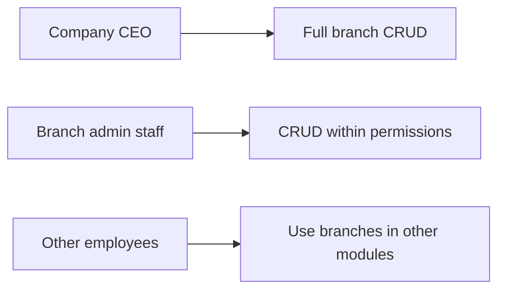
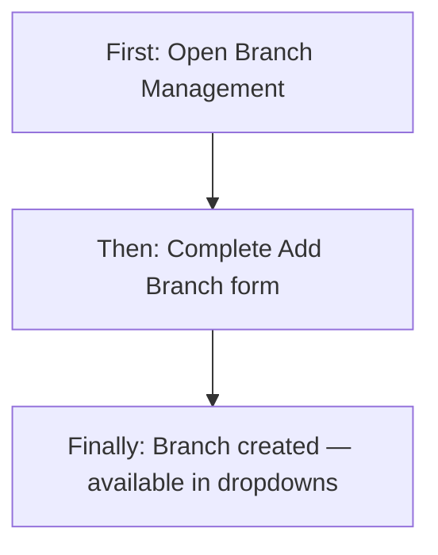
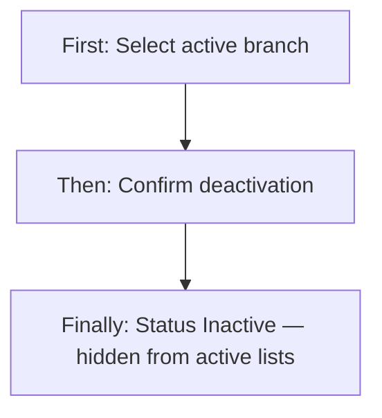
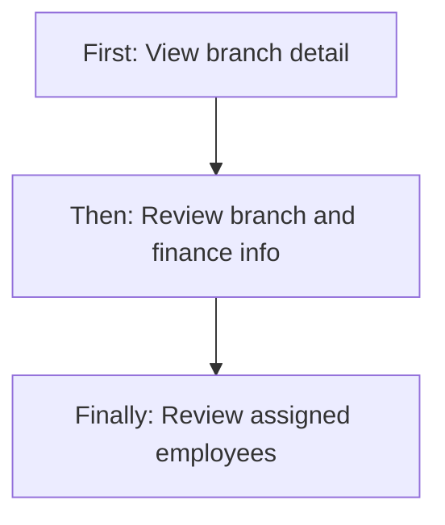
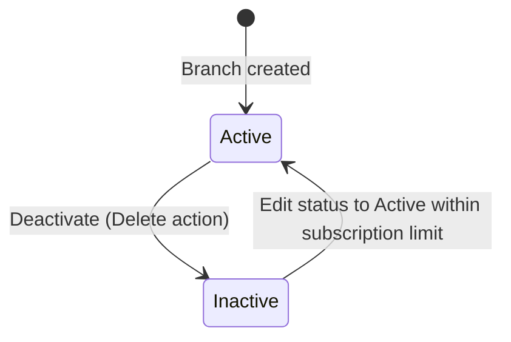

# Branch Management — Product & Business Documentation

## 1. Purpose & Business Need

Companies operating across multiple locations need a single place to register **branches** (offices, warehouses, state offices, head office) with contact details, addresses, tax/billing information, and operational status. Branch Management is where administrators **create and maintain branch records**, **deactivate** branches that are no longer in use, and **review which employees** are tied to each branch.

Branches are foundational master data: employees are assigned to one or more branches; customers, stock, contracts, finance, and other modules reference branch identity throughout the ERP.

**Outcomes today:** structured branch registry with unique three-letter codes; soft deactivation instead of hard deletion; subscription-enforced limits on how many active branches a company may have; branch dropdowns feeding employee and operational screens.

---

## 2. Users & Roles (who uses this and why)

### 2.1 Company CEO / Owner

Has full Branch Management access without needing explicit module permissions. Responsible for standing up the branch network within subscription limits.

### 2.2 Authorized company staff (Branch Management permissions)

Employees granted **Branch Management** permissions can view, add, edit, or deactivate branches according to their matrix (Read, Add, Edit, Delete).

### 2.3 Other employees

Staff without Branch Management access do not see the Branch Management menu. They may still **see branches in dropdowns** elsewhere (e.g., when assigned to a branch on their profile) if those screens load branch lists through shared dropdown APIs.

---

## 3. Access Control (RBAC)

### 3.1 How access works

Access is controlled by the **Branch Management** module permissions on the user’s login profile, unless the user is **CEO** (full access):

| Permission | Allows |
|------------|--------|
| **Read** | Open Branch Management, view list, view detail, view row actions (eye) |
| **Add** | **Add Branch** button on list |
| **Edit** | Edit action on list rows; access add/edit form in edit mode |
| **Delete** | Delete (deactivate) action on list rows |

The sidebar item **Branch Management** appears when the user has Branch Management **Read** (or CEO / Super Admin bypass).

**Super Admin / Seravion bypass:** Platform bypass roles receive full access to all module actions in the UI.

### 3.2 Role × action matrix (Branch Management module)

| Role | View list | View detail | Add | Edit | Inactive / Delete | Submit request | Receive / act | Approve | Reject |
|------|-----------|-------------|-----|------|-------------------|----------------|---------------|---------|--------|
| Company CEO | Yes | Yes | Yes | Yes | Yes (soft inactive) | No | No | No | No |
| Staff with Branch Management Read | Yes | Yes | No | No | No | No | No | No | No |
| Staff with Branch Management Add | Yes | Yes | Yes | No | No | No | No | No | No |
| Staff with Branch Management Edit | Yes | Yes | No | Yes | No | No | No | No | No |
| Staff with Branch Management Delete | Yes | Yes | No | No | Yes (soft inactive) | No | No | No | No |
| Staff without Branch Management | No | No | No | No | No | No | No | No | No |

**Record-level rules:**
- **Inactive** branches remain in the database; delete action is blocked in the UI if the branch is already inactive.
- **Branch dropdown** (used across the app) returns **active branches only**.
- **Subscription limit:** creating a branch or reactivating an inactive branch may be denied when the company has reached its allowed active branch count.

**This module does not use request/approve workflows.**

---

## 4. Capabilities & Features

### 4.1 Branch list

Paginated table of branches with server-side search (minimum two characters sent to the API). Columns include Branch ID, three-letter code, name, contact info, location, city, state, and status. Row actions: View, Edit, Delete (each gated by permissions).

### 4.2 Add branch

Form to capture branch identity, contact, address, type, status, GST/billing, and finance contact fields. System assigns a sequential Branch ID (e.g., `BR_0001`). Three-letter branch code must be unique.

### 4.3 Edit branch

Same form as add, prefilled from the selected row. Three-letter code may be locked if the UI detects employees assigned to the branch (intended behavior; see gaps).

### 4.4 View branch detail

Read-only **Branch Information** and **Finance & Billing** tabs, plus a **Branch Users** tab listing employees filtered to that branch.

### 4.5 Deactivate branch

Delete action marks the branch **Inactive** (soft delete) with confirmation. Existing historical records referencing the branch are unchanged.

### 4.6 Branch dropdown

Active branches available for selection in other modules (employee assignment, filters, etc.). Optional filter by state. Authenticated users can call the dropdown API without separate Branch Management Read permission.

### 4.7 Dashboard widget

Users with Branch Management Read may see a branch summary widget on the main dashboard (separate from the list screen).

---

## 5. CRUD Operations

### 5.1 Create (Add)

**Who:** CEO, or staff with Branch Management **Add**.

**First:** User opens Branch Management and clicks **Add Branch**.

**Then:** User completes required fields: branch name, three-letter code, email, phone, address, country, state, city, pincode, branch type, and status. Optional GST, billing address, and finance contact fields may be added.

**Finally:** On save, a new active branch is created if within subscription limits. User returns to the list with a success message.

### 5.2 Read — List

**Who:** CEO, or staff with Branch Management **Read**.

**First:** User opens Branch Management from the sidebar.

**Then:** The table loads the first page (default 10 rows) sorted by most recently updated. User may search (server-side), change page size, or apply client-side status/city/state filters on the **current page’s loaded rows**.

**Finally:** User can open detail, edit, or deactivate from row actions.

### 5.3 Read — Detail / Get details

**Who:** Same as list.

**First:** User clicks **View** on a row (or navigates with branch data from the list).

**Then:** Detail screen shows branch metadata and finance/billing cards. **Branch Users** tab loads employees assigned to this branch.

**Finally:** User reviews information; there is no edit on the detail page itself (edit is from the list).

### 5.4 Update (Edit)

**Who:** CEO, or staff with Branch Management **Edit**.

**First:** User clicks **Edit** on a list row.

**Then:** The add/edit form opens prefilled. User changes allowed fields and saves. Partial updates are supported — only provided fields are changed.

**Finally:** Branch record updates; reactivating from Inactive to Active checks subscription branch limit again.

### 5.5 Inactive / Delete

**Who:** CEO, or staff with Branch Management **Delete**.

**First:** User clicks **Delete** on an **Active** branch row.

**Then:** Confirmation modal explains the branch will be marked inactive and existing records will remain unchanged.

**Finally:** Branch status becomes **Inactive**, `deletedAt` and `deletedBy` are recorded. List refreshes. **No hard delete** — row remains in the database.

**Already inactive:** UI shows a message and does not open the delete modal.

**Reactivation:** Can be done by editing the branch and setting status back to Active (subject to subscription limit). There is no dedicated “reactivate” button.

---

## 6. Request & Approval Flows

**This module does not use request/approve.** Branches are created and updated directly. There is no pending branch approval queue.

---

## 7. Forms — Add vs Edit Field Access

| Field (business name) | On Add | On Edit | Notes |
|----------------------|--------|---------|-------|
| Branch Name | Editable / Required | Editable | Min 3 characters |
| 3 Letter Code | Editable / Required | Editable or **Locked** | Locked when employees assigned (UI intent) |
| Email | Editable / Required | Editable | Valid email format |
| Phone Number | Editable / Required | Editable | 10 digits |
| Created By | Locked (read-only) | Locked | Auto-filled from current user on create |
| Branch Type | Editable / Required | Editable | Head Office, State Branch, City Branch, Warehouse |
| Status | Editable / Required | Editable | Active / Inactive |
| Address Line 1 | Editable / Required | Editable | Min 5 characters |
| Country | Editable / Required | Editable | Defaults to India on add |
| State | Editable / Required | Editable | Dependent on country |
| City | Editable / Required | Editable | Dependent on state |
| Pincode | Editable / Required | Editable | 6 digits when India |
| GST Number | Editable / Optional | Editable | |
| Billing Address Line 1 | Editable / Optional | Editable | |
| Billing Address Line 2 | Editable / Optional | Editable | |
| Finance Contact Person | Editable / Optional | Editable | |
| Finance Contact Phone | Editable / Optional | Editable | 10 digits if provided |
| Finance Contact Email | Editable / Optional | Editable | Valid email if provided |
| Branch ID | Hidden | Hidden | System-generated; used internally on update |

---

## 8. Lists, Dropdowns, Details & Data Rendering

### 8.1 List rendering

| Element | Behavior |
|---------|----------|
| Columns | Branch ID, 3 Letter Code, Branch Name, Contact Info (phone + email), Location, City, State, Status |
| Search | Server-side; debounced; sent as `search` query param |
| Status / City / State filters | Client-side on loaded page data only — **not sent to list API** |
| Pagination | Server-side; page number and page size |
| Sort | Backend sorts by updated date, then created date (descending) |
| Empty state | Standard table empty handling when no rows |
| Row actions | View (Read), Edit (Edit), Delete (Delete) — permission-gated |

### 8.2 Dropdowns & lookups

| Dropdown | Where used | Options source |
|----------|------------|----------------|
| Branch Type | Add/Edit form | Fixed: Head Office, State Branch, City Branch, Warehouse (+ legacy values if already saved) |
| Status | Add/Edit form | Active, Inactive |
| Country / State / City | Add/Edit form | Country-state-city dataset; cascading |
| Branch filter (detail users tab) | Branch Users tab | Active branches dropdown API |
| Role / Department / Designation filters | Branch Users tab | Employee management filter sources |

**Branch dropdown API** (`/dropdown`): returns active branches as id + branch name for use across the product. Optional `state` query param filters by state.

### 8.3 Detail / get-details rendering

**Branch Information tab (read-only cards):**
- Branch ID, Branch Name, 3 Letter Code, Address, City, State, Contact number, Branch Type, Status, Created By, Edited By

**Finance & Billing tab:**
- GST Number, Billing Address lines, Finance Contact Person/Phone/Email

**Not shown in detail cards:** Country, Pincode, Email (email appears in page header meta only)

**Branch Users tab:**
- Paginated employee table for users assigned to this branch
- Filters: branch, role, department, designation, status, created date
- View user detail navigation is **not wired** (placeholder only)

---

## 9. How It Works (end-to-end user flows)

### 9.1 Branch administrator — Add first branch

**First:** CEO or user with Add permission opens Branch Management and clicks **Add Branch**.

**Then:** They enter Head Office details, three-letter code, contact, and address; set status Active; save.

**Finally:** Branch appears in the list and in branch dropdowns for employee assignment.

### 9.2 Branch administrator — Deactivate closed location

**First:** User with Delete permission finds an active branch in the list.

**Then:** They click Delete and confirm deactivation in the modal.

**Finally:** Branch becomes Inactive; it drops from active dropdowns but historical data remains linked.

### 9.3 Manager — Review branch and assigned staff

**First:** User with Read permission opens a branch via **View**.

**Then:** They review Branch Information and Finance tabs, then open **Branch Users**.

**Finally:** They see which employees are assigned to that branch (read-only list).

---

## 10. Cross-Module Interactions

| Related area | Connection |
|--------------|------------|
| **Employee User Management** | Each employee must be assigned to one or more branches (`user_branches`). Branch dropdown on employee forms uses active branches. |
| **Subscription** | Active branch count cannot exceed the company’s purchased branch limit on create or reactivation. |
| **Customers, Contracts, Stock, Finance, etc.** | Many modules store `branch_id` on transactions and master data. Deactivating a branch does not remove those links. |
| **Dashboard** | Branch widget visible with Branch Management Read. |
| **Customer Data Import** | Links users to Branch Management route for context. |
| **Auth permission check** | Dedicated endpoint checks whether the current user has branch read access (for conditional UI elsewhere). |

---

## 11. Data the Business Cares About

| Attribute | Business meaning |
|-----------|------------------|
| Branch ID | System identifier (e.g., BR_0001) |
| Branch Name | Display name of the location |
| 3 Letter Code | Short unique code (3 characters) |
| Branch Type | Head Office, State Branch, City Branch, or Warehouse |
| Status | Active (operational) or Inactive (deactivated) |
| Contact | Email and 10-digit phone |
| Address | Line 1, city, state, country, pincode |
| GST Number | Tax registration (optional) |
| Billing address | Separate billing location (optional) |
| Finance contacts | Person, phone, email for finance coordination |
| Audit | Created by/at, updated by/at, deleted by/at on deactivation |

---

## 12. Rules, Validations & Constraints

- **Branch name:** required, minimum 3 characters.
- **3 letter code:** required, exactly 3 characters, unique (case-insensitive).
- **Email:** required on create, valid email format.
- **Phone:** required, exactly 10 digits.
- **Address line 1:** required, minimum 5 characters.
- **Country, state, city, pincode:** required on create; pincode 6 characters.
- **Branch type:** required.
- **Status:** required on create; optional on update.
- **Subscription:** cannot exceed active branch limit when creating or reactivating.
- **Deactivate:** sets status Inactive; does not physically remove the record.
- **No employee/stock guard on deactivate** in the current implementation (planned in internal docs only).

---

## 13. Loopholes, Gaps & Current Limitations

1. **Route case mismatch:** The registered list route is `/Branch-Management` (capital B and M) while the sidebar and breadcrumbs use `/branch-management` (lowercase). This can prevent the list screen from opening when following sidebar links, depending on router behavior.
2. **List filters not sent to API:** Status, city, and state filters apply only to rows already loaded on the current page — not to the full dataset server-side.
3. **Save button lacks Add/Edit permission check:** The add/edit form is reachable with Read-only route access; the Save button itself is not separately gated (only the list row Edit button is).
4. **Branch code lock may not trigger:** The edit form locks the three-letter code when employees are assigned, but the branch detail API response does not include employee count fields — the lock may not activate after refetch.
5. **Detail view missing fields:** Country, pincode, and email are not shown in the information cards (email only in header).
6. **User detail navigation disabled:** Branch Users tab does not navigate to employee detail (handler commented out).
7. **No request/approve or approval guard on deactivate:** Branches can be deactivated even if employees or stock are still associated (no blocking validation today).
8. **Delete always required reassignment N/A** — but delete modal does not distinguish zero-employee branches.
9. **Inactive branches in list:** Can still appear in list; delete is disabled with a message if already inactive.
10. **Dropdown API has no Branch Management Read check:** Any authenticated user can load active branch dropdown options.

---

## 14. Existing Functionality Summary

**Available today:**
- Paginated branch list with server-side search
- Add and edit branch (shared form)
- Branch detail with information, finance, and assigned users tabs
- Soft deactivate (inactive) with confirmation
- Branch type and status management
- GST and finance contact fields
- Subscription-enforced active branch limits
- Branch dropdown for other modules
- RBAC-gated list actions and Add button
- Dashboard branch widget (with Read permission)

**Not available:**
- Request/approve for branch changes
- Hard delete of branches
- Server-side filtering by status/city/state on list API from the UI
- Blocking deactivate when employees or stock exist
- Dedicated reactivate workflow (must use edit form)
- Employee detail drill-through from branch users tab

---

## 15. Reference — APIs, Screens & UI Actions

### 15.1 APIs

| Method | Path | Purpose (plain language) | Used by (screen/flow) |
|--------|------|--------------------------|------------------------|
| GET | `/api/v1/company/branches` | Paginated branch list with optional search | Branch list |
| GET | `/api/v1/company/branches/by-id?id=` | Single branch detail | Edit form, Detail view |
| POST | `/api/v1/company/branches` | Create branch | Add form |
| PUT | `/api/v1/company/branches/update?id=` | Update branch (partial) | Edit form |
| DELETE | `/api/v1/company/branches?id=` | Deactivate branch (soft) | List delete action |
| GET | `/api/v1/company/branches/dropdown` | Active branches for dropdowns | Other modules, detail users filters |
| GET | `/api/v1/auth/check/permission/branch` | Check if user has branch read access | Conditional UI elsewhere |
| GET | `/api/v1/users` | List employees (filtered by branch) | Branch detail users tab |

### 15.2 Frontend Screen Routes

| Route | Screen purpose | Primary users |
|-------|----------------|---------------|
| `/Branch-Management` | Branch list (registered route) | CEO, Branch Management Read+ |
| `/branch-management` | Linked from sidebar (may not match registered route) | Same |
| `/add-branch` | Add or edit branch form | CEO, Add/Edit permissions |
| `/branch-details` | Branch detail and users tab | CEO, Branch Management Read |

### 15.3 Click Events, Filters, Search & Controls

| Screen / Route | Control | Type | What happens |
|----------------|---------|------|--------------|
| Branch list | Add Branch | Button | Navigate to `/add-branch` (Add permission) |
| Branch list | Search | Text input | Server-side search after debounce |
| Branch list | Status filter | Chip filter | Client-side filter on current page |
| Branch list | City / State filter | Multi-select | Client-side; options from loaded rows |
| Branch list | Page size / page change | Pagination | Server-side refetch |
| Branch list | View (eye) | Row action | Navigate to `/branch-details` with row data |
| Branch list | Edit | Row action | Navigate to `/add-branch` with row data |
| Branch list | Delete | Row action | Opens inactive confirmation modal |
| Delete modal | Cancel | Button | Closes modal |
| Delete modal | Delete | Button | Calls deactivate API, refreshes list |
| Add/Edit form | Country / State / City | Cascading selects | Updates dependent location fields |
| Add/Edit form | Branch Type | Select | Sets office type |
| Add/Edit form | Status | Radio | Active or Inactive |
| Add/Edit form | Cancel | Button | Navigates back |
| Add/Edit form | Save | Button | Create or update branch |
| Branch detail | Back | Button | Returns to previous screen |
| Branch detail | Branch Information tab | Tab | Read-only branch fields |
| Branch detail | Finance & Billing tab | Tab | Read-only finance fields |
| Branch detail | Branch Users tab | Tab | Loads filtered employee table |
| Branch Users tab | Filters (role, dept, etc.) | Filters | Refetches employee list |
