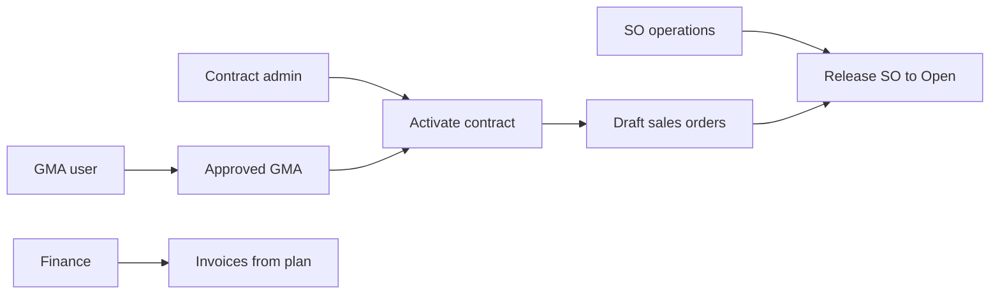
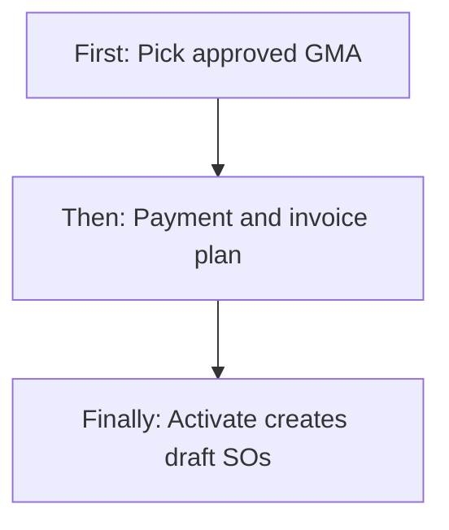
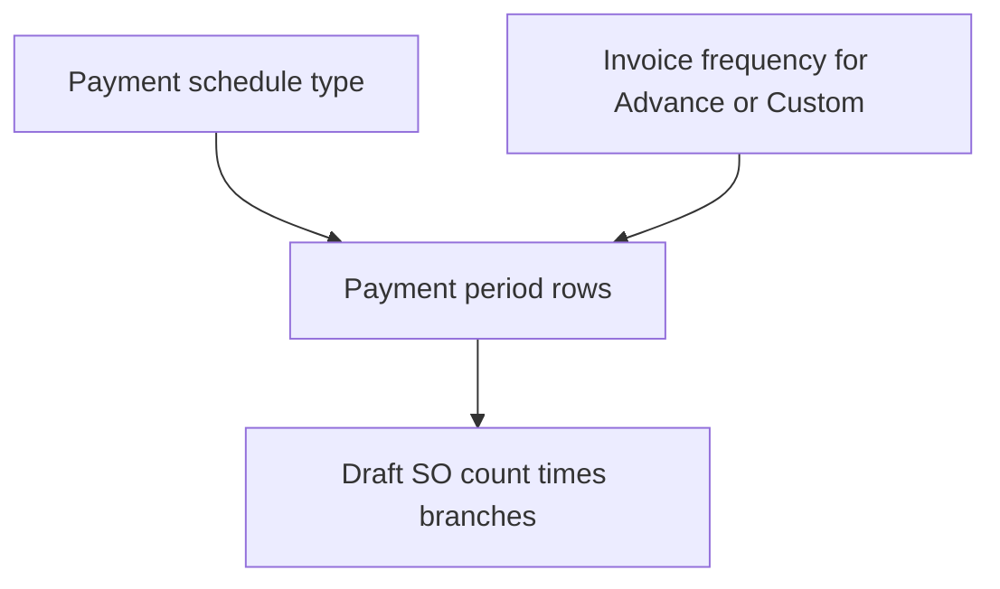
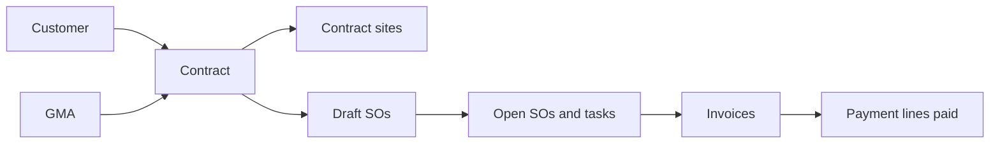
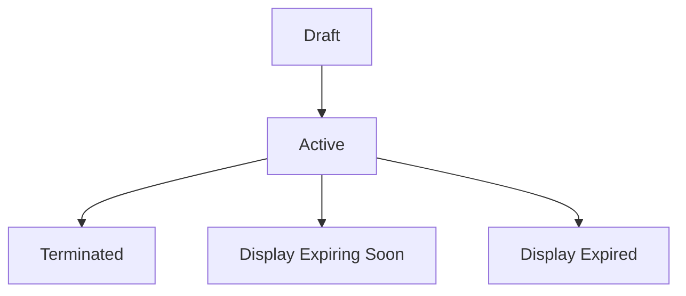

# Contract Management — Product & Business Documentation

## 1. Purpose & Business Need

Service companies sell **annual maintenance / facility contracts** that mix three things:

1. **Commercial agreement** — customer, sites, services, sale value, legal notes  
2. **Money schedule** — how and when the customer pays (monthly, quarterly, advance, milestones, …)  
3. **Work schedule** — how often each site-service is visited (weekly, daily, custom annual counts, …)

**Contract Management** (menu: **Operations → Contract Management**) is the place where those three are bound together. When a contract is **Activated**, the system automatically builds:

- Normalized **payment / sales-order periods** from the payment configuration  
- A **visit plan** (visits per period per site-service)  
- One **Draft Sales Order** per period × branch, ready for Operations to release and run visits  

Invoices can later draft on a **calendar schedule**, on **milestones**, or when **visits/tasks** complete — driven by a separate invoice-plan configuration that must not be confused with “how many SOs exist.”

**Outcomes today:**

- Create contracts **From GMA** (approved Gross Margin Approval) or **Manually**  
- Save as **Draft**, then **Activate** (or activate on create)  
- Configure payment schedule + invoice plan + visit-count basis  
- Preview visit allocation / draft SO count before activate  
- View sites, payment lines, and Sales Order schedule; release draft SOs to Open  
- **Amend** active contracts (add sites, change schedule/value with reason)  
- **Terminate** with effective date and reason (optional cancel of open/draft SOs)  
- Export PDF / CSV / billing schedule where Export permission exists  

**What this module is not:** Customer master entry, GMA costing sheet editing, task scheduling itself, or a renewal automation job. Sites for service delivery are owned here (on the contract), while the customer master only *views* them.

**Deep companion note:** Payment-period → SO count and frequency → visit split math is also spelled out in [Contract Sales Order Creation — Payment Terms & Frequencies](./contract-sales-order-creation-payment-and-frequency.md). This document covers the full Contract product surface and links every related module.

---

## 2. Users & Roles (who uses this and why)

Access is permission-based. In practice:

### 2.1 Company CEO / Owner

Full contract create / edit / amend / terminate / export. Sees contracts across active branches by default.

### 2.2 Contract / commercial administrators

Staff with Contract **Read / Add / Edit / Export** build agreements from GMA or manually, set payment and invoice plans, activate (which auto-creates draft SOs), amend, and terminate.

### 2.3 Branch operations users

Assigned to one or more branches. List and sites default to their branches. They verify site coverage and SO schedule for “their” branch portion of multi-branch contracts.

### 2.4 Read-only commercial / audit

**Read** only: list, view terms/sites/SO schedule, eligibility and visit-plan preview. Cannot activate, amend, or terminate.

### 2.5 Sales Order / field operations

Consume the **Draft** contract SOs: release to Open, schedule visits/tasks. Not a Contract write role, but the SO schedule tab links into Sales Orders.

### 2.6 Finance / invoicing users

Depend on payment lines, advance gates, and invoice-plan mode for when draft invoices appear. Payment receipt against invoices can mark contract payment lines paid.

### 2.7 GMA / estimation users

Produce **Approved** GMA sheets that Contract “From GMA” consumes on activation (sheet marked used by the contract).

---

## 3. Access Control (RBAC)

### 3.1 How access works

| Permission | Allows |
|------------|--------|
| **Read** | List, view, sites, create-eligibility, GMA consolidate preview, visit-plan preview, amend/terminate scaffolds, SO schedule |
| **Add** | Create contract (draft or activate) |
| **Edit** | Update draft, activate from draft, amend active, terminate, heal sales orders |
| **Export** | PDF, CSV, billing schedule exports |
| **Delete** | Not used as hard delete; termination is an **Edit** action in the UI |

CEO can perform Contract API actions without granular permissions.

**Important product note:** The Contract **API** is gated on the **Contract Management** permission family. The web menu and many Contract screens are wired to the same Operations module family used for **Customer** (`CUSTOMER_CONTRACT_MANAGEMENT` on the frontend sidebar/route map). Treat “who sees the menu” vs “who the API accepts” as aligned for typical seeded roles, but see **Loopholes** if menu and API keys ever diverge for a custom role.

**Approve / Request:** Not used for contract create, activate, amend, or terminate. A **varianceRequiresApproval** flag can appear when contract value differs from GMA, but there is **no Approve button or approval queue**.

### 3.2 Role × action matrix

| Role | View list | View detail | Add | Edit | Inactive / Delete | Submit request | Receive / act | Approve | Reject |
|------|-----------|-------------|-----|------|-------------------|----------------|---------------|---------|--------|
| Company CEO | Yes | Yes | Yes | Yes (incl. amend/terminate) | Terminate (not hard delete) | No | No | No | No |
| Staff with Contract Read | Yes | Yes | No | No | No | No | No | No | No |
| Staff with Contract Add | Yes* | Yes* | Yes | No | No | No | No | No | No |
| Staff with Contract Edit | Yes* | Yes* | No | Yes (draft update, amend, terminate, SO heal) | Terminate via Edit | No | No | No | No |
| Staff with Contract Export | Yes* | Yes* | No | No | No | No | No | No | No |
| Staff without Contract access | No | No | No | No | No | No | No | No | No |

\*Screen access still needs Read on the protected routes.

**Record-level / branch rules:**

- List defaults to the user’s assigned active branches (CEO: all). Optional branch filter. A contract matches if header branch **or** any site branch is in scope.  
- Sites and SO schedule respect effective branch scope.  
- Multi-branch contracts create **one SO per payment period per branch that has sites with services**.

---

## 4. Capabilities & Features

### 4.1 Contract list

Search by ID or customer; filters for display status (Draft, Active, Expiring Soon, Terminated, Expired), branch, start/end date ranges. Actions: View, Edit (draft update or amend), Download PDF, Terminate (via delete-style control opening terminate modal), Create Contract.

### 4.2 Create — From GMA or Manual

- **From GMA:** Pick an approved GMA → preview consolidates customer, totals, inherited sites/services → adjust contacts, frequencies, preferred days/time, sale values, payment & invoice plan → Save Draft or Activate.  
- **Manual:** Pick Active customer → add branches/sites/services → payment & invoice plan → Draft or Activate. Total sale value rolls up from sites (header total locked on manual add).

### 4.3 Draft update and Activate

While **Draft**, full commercial and payment editing is allowed. **Activate** (on create or draft update) runs the end-to-end money + visit + draft SO pipeline (see §9 and §4.6–4.8).

### 4.4 Amend (active contracts)

Same Edit route as draft, but title/API switch to **Amend** when status is not Draft. Requires amendment reason (and remarks when needed). Used to add sites (import from GMA or manual), adjust commercial/payment configuration. After save, system **heals** sales orders (patch/create while retaining existing where safe). Paid/locked payment lines must be preserved.

### 4.5 Terminate

From list: effective closure date, reason, remarks, options to cancel/acknowledge open SOs. Sets contract **Terminated**. No hard delete / soft-delete flag — status lifecycle only.

### 4.6 Configuration model — two clocks (must understand)

Contracts configure **two independent clocks**:

| Clock | Configured by | Controls |
|-------|---------------|----------|
| **Money clock** | Payment schedule type + (for Advance/Custom) invoice frequency + duration | How many **payment periods** → how many **Draft SOs** (× branches) |
| **Work clock** | Each site-service **frequency** (+ custom annual visits) + visit-count basis + duration | How many **visits/year** (or term), then split across those periods |
| **Invoice clock** | Invoice plan (mode + frequency + auto-draft / visits-per-invoice) | **When** draft invoices appear — **not** how many SOs are created |

> Billing Monthly does **not** mean one visit per month. A Daily service on a Monthly bill still plans ~365 visits/year across 12 SOs.

### 4.7 Payment schedule types (enum → behavior)

| Payment schedule | Business meaning | How periods / SOs are counted (1-year, 1 branch) | Extra fields |
|------------------|------------------|--------------------------------------------------|--------------|
| **100% Advance** | Customer pays fully in advance | Period **rows for SOs** follow **invoice / SO schedule frequency** (e.g. Monthly → 12 SO rows; Annually → 1). Commercial payment remains advance; advance due date required (on/before start) | Advance due date; amount locked as full total |
| **Monthly Post-paid** | Bill every month after service period | `ceil(termMonths / 1)` → **12** periods/SOs for 1 year | Grid auto-split; no add/remove rows |
| **Quarterly Post-paid** | Bill every 3 months | `ceil(termMonths / 3)` → **4** | Same |
| **Half-Yearly Post-paid** | Bill every 6 months | `ceil(termMonths / 6)` → **2** | Same |
| **Milestone-based** | User-defined milestones | **As many rows as entered** | Add/Remove milestone rows; default invoice plan “On Milestone” |
| **Custom** | Free-form terms | Period count from invoicing frequency when Monthly/Quarterly/Half-Yearly/Annually; otherwise keep manual rows | **Custom payment description** required |

**Duration options** (term months): Six Months (6), One Year (12), Two Years (24), Three Years (36), Custom (from start–end). Non-12-month terms scale visit totals: `round(annual × termMonths / 12)`.

**Payment line rules:** Sum of line amounts must equal **Total Sale Value**. Sum of site-service sale values must equal Total Sale Value. On activate, if header says Monthly/Quarterly/etc. but only one imported annual line exists, the system **expands** lines to match — **unless** any line is paid or locked.

### 4.8 Invoice plan (enum → behavior)

The UI exposes **one Invoice Plan** dropdown that sets invoicing mode + frequency (+ auto-draft / N visits):

| Invoice plan (business label) | What is stored | Effect on invoices | Effect on SO count |
|------------------------------|----------------|--------------------|--------------------|
| On schedule — Monthly / Quarterly / Half-Yearly / Annually | Mode **Periodic** + that frequency; auto-draft off | Calendar/scheduler drafts invoices for due periods | For Advance/Custom, frequency also sizes SO period rows |
| On Milestone | Periodic + On Milestone | Invoice when milestone/SO fulfillment rules allow | Does not auto-split months |
| On Service Completion | Periodic + On Service Completion | Same family as milestone (completion gate) | Same |
| After each visit (task completed) | Mode **Per Visit**; auto-draft on | Draft invoice when a visit task completes | None (SOs already from payment schedule) |
| Every N completed visits | Mode **Every N Visits**; N required; auto-draft on | Invoice when executed visits on SO hit multiples of N | None |
| Manual only | Mode **Manual Only**; auto-draft off | No automatic visit invoices; no periodic auto path for visit modes | None |

Allowed invoice options **depend on payment type** (e.g. Advance excludes On Milestone; Milestone includes it). Visit-based plans require **Auto-draft invoice** enabled (or validation fails).

### 4.9 Service frequency enums (work clock)

On each site-service:

| Frequency | Default annual visits (12-month) |
|-----------|----------------------------------|
| Weekly | 52 |
| Fortnightly | 26 |
| Monthly | 12 |
| Quarterly | 4 |
| Custom | Must supply total visits (annualFrequency) |

Common custom patterns (import/GMA language → Custom + count): twice a week → 104; thrice a week → 156; daily → 365; business daily → 260; alternate days → ~180; 3× monthly → 36; once a year → 1.

**Visit count basis:** Calendar Daily vs Business Daily — only remaps true daily-style 365/260 totals; other custom counts (104, 302, …) stay as entered.

**Preferred time slot:** Morning / Afternoon / Evening — required on services; copied onto SO service lines.

**Service mode:** Contract vs One Time (from GMA) — Contract requires frequency; One Time is more flexible for pricing, but visit planning still uses annual frequency when present.

### 4.10 Sales Order auto-configuration (what “SO auto” means)

There is **no separate “SO auto create” toggle** on the form. Auto-creation is built-in:

| Trigger | What happens |
|---------|----------------|
| **Activate** contract | Expand payment lines if needed → build visit plan → create **all** draft SOs for every period × branch |
| **Daily billing job** | Creates any still-missing SOs for due payment lines |
| **Amend** | After save, **heal** SOs (soft-patch / create missing; retain existing) |
| **Manual heal** | Edit permission can re-run heal (including dry-run / batch) |

Each draft SO is type **Service Contract**, linked to the contract and payment line, scoped to a **branch**, carrying that period’s sites/services with **period visit budgets** and amounts derived from visits × unit price (with branch amount split when multi-branch).

Operations **releases** Draft → Open on the Sales Order module (also reachable from Contract View → Sales Order Schedule).

### 4.11 Sites

- From GMA: inherited then adjustable (contacts, schedule fields, sale values; core GMA identity often locked).  
- Manual / amend new sites: full site + services + branch.  
- Category / sub-category (Residential/Commercial/Industrial; Internal/External).  
- Customer View Sites tab reads these same contract sites.

### 4.12 View tabs

1. **Contract Terms, Scope & Sites** — commercial, payment summary, scope, variance banner if any  
2. **Contract Sites** — paged site table  
3. **Sales Order Schedule** — KPIs + SO grid; View SO; Release draft  

### 4.13 Renewal type (stored only)

Auto Renew / Manual / Non-Renewable can be stored and shown, but **no renew API or auto-renew job** runs today.

---

## 5. CRUD Operations

### 5.1 Create (Add)

**Who:** Contract **Add** (or CEO).

**First:** Open Create Contract; choose From GMA or Manual.  
**Then:** Load customer/sites (GMA preview or manual site builder); set duration, sale value, payment schedule, invoice plan, visit basis; optionally preview visit plan.  
**Finally:** **Save Draft** (status Draft, no SO pipeline) or **Activate** (status Active + payment expand + visit plan + draft SOs; GMA marked consumed if From GMA).

### 5.2 Read — List

**Who:** Contract **Read**.

Columns: Contract ID (variance icon if needed), Customer Name, Total Sites, Branch, GMA ID, Contract Value, Start/End, Status (display status including Expiring Soon / Expired overlays). Empty when nothing in branch scope or filters.

### 5.3 Read — Detail / Get details

**Who:** Contract **Read**.

Loads header, sites/services, payment lines, GMA sources, legal notes; Sites tab and SO Schedule tab load their own paged data.

### 5.4 Update (Edit draft) / Amend (Edit active)

**Who:** Contract **Edit**.

- **Draft:** Same as create editing; can Activate.  
- **Active (Amend):** Amendment reason required; customer/GMA source locked; existing GMA sites not freely re-edited in amend section (new sites via import/manual); payment merge protects paid/locked lines; post-save SO heal. Dates tip: changing dates does not silently rebuild all historical SOs without heal rules.

### 5.5 Inactive / Delete

**Hard delete:** Not offered.  
**Terminate:** Soft end-of-life — status Terminated, effective date, reason, remarks; optional cancel of open/draft SOs.  
**Expired:** Display/filter when Active and end date passed (or within product display rules); automatic DB flip to Expired status is **not** implemented as a batch job today.  
**Reactivation after terminate:** Not a supported happy-path in the product UI.

---

## 6. Request & Approval Flows

This module does **not** use request/approve for create, activate, amend, or terminate.

**VarianceRequiresApproval** may flag large GMA-vs-contract value differences for awareness only — there is no approval inbox or Approve/Reject action on Contract screens.

---

## 7. Forms — Add vs Edit Field Access

| Field (business name) | On Add (From GMA) | On Add (Manual) | On Edit Draft | On Amend (Active) | Notes |
|----------------------|-------------------|-----------------|---------------|-------------------|-------|
| Creation mode | Editable | Editable | Locked | Locked | From GMA vs Manual |
| GMA selection | Editable | Hidden | Locked display | Locked; import new sites only | Multi-GMA hinted but UI largely single-select |
| Customer | Locked from GMA | Editable select | Locked | Locked | Must be Active customer |
| Inherited sites table | Read-only preview | — | Read-only | Read-only | |
| Site editor | GMA cards (partial) | Full create sites | Draft GMA limited / Manual full | **New** sites only (import/manual) | |
| Site contact / preferred days-time | Editable | Editable | Editable (within rules) | New sites editable; GMA-imported identity locked | |
| Service frequency / sale | Editable within rules | Editable | Editable within rules | New sites; GMA-inherited core locked | |
| Duration / Start / End | Editable; End locked unless Custom | Same | Same | Same | |
| Total Sale Value | Editable (variance vs GMA) | **Locked** (sum of sites) | Editable | Editable | Must match payment + service sums |
| Contract Reference / Renewal / Legal | Editable | Editable | Editable | Editable | Renewal not automated |
| Amendment Reason / Remarks | Hidden | Hidden | Hidden | **Required** reason | |
| Payment schedule type | Editable | Editable | Editable | Editable | Regenerates grid |
| Advance due date | If Advance | If Advance | If Advance | If Advance | Required for Advance |
| Custom payment description | If Custom | If Custom | If Custom | If Custom | Required for Custom |
| Payment / SO schedule grid | Per type rules | Per type | Per type | Per type; paid/locked should stay | UI may not fully disable `locked` rows |
| Invoice plan | Editable | Editable | Editable | Editable | Options depend on payment type |
| Visits per invoice (N) | If Every N | If Every N | If Every N | If Every N | |
| Auto-draft invoice | Shown for visit modes | Same | Same | Same | Required true for visit modes |
| Visit count basis | Editable | Editable | Editable | Editable | Daily-style only |
| Activate | Yes | Yes | Yes | No (already Active) | |
| Save Draft / Save Amendment | Save Draft | Save Draft | Save Draft | Save Amendment | |

---

## 8. Lists, Dropdowns, Details & Data Rendering

### 8.1 List rendering

Server pagination; search; status/branch/date filters; Create, View, Edit, PDF download, Terminate. Display status derives Expiring Soon (Active within ~30 days of end) and Expired (past end) overlays.

### 8.2 Dropdowns & lookups

| Control | Options / source | Dependents |
|---------|------------------|------------|
| Creation mode | From GMA / Manual | Switches entire form path |
| GMA | Approved, available GMAs | Loads consolidate preview → customer, sites, totals |
| Customer (Manual) | Active customers | |
| Branches (Manual/Amend) | Branch list | Site ownership / SO branch |
| Payment schedule | Advance, Monthly, Quarterly, Half-Yearly, Milestone, Custom | Resets default invoice plan; regenerates period grid |
| Invoice plan | Filtered by payment type | Sets mode/frequency/auto-draft/N |
| Duration | 6m / 1y / 2y / 3y / Custom | Computes end date; term months |
| Service frequency | Weekly / Fortnightly / Monthly / Quarterly / Custom | Syncs annual visits |
| Visit count basis | Calendar Daily / Business Daily | Daily totals only |
| Preferred time | Morning / Afternoon / Evening | Copied to SO |
| Amendment reason | Site Addition, Service Upgrade, Value Adjustment, Schedule Change, SLA Modification, Other | |
| Terminate reason (UI) | Mutual Agreement, Service Issue, Non Payment, Other | Backend catalog also includes relocates / business closure style codes — align when integrating |

### 8.3 Detail rendering

Terms tab fills commercial + payment lines + scope. Sites tab loads contract sites. SO Schedule loads linked draft/open/… orders with release action for drafts when Sales Order permissions allow.

Visit plan preview (before or after save) shows planned visits per period so users can validate SO auto-config before Activate.

---

## 9. How It Works (end-to-end user flows)

### 9.1 Contract admin — From GMA to Active (happy path)

**First:** Select approved GMA; review inherited customer, sites, totals.  
**Then:** Set duration, payment schedule, invoice plan, adjust site contacts/frequencies if needed; optional visit-plan preview.  
**Finally:** Activate → payment lines expand → visit budgets persist → Draft SOs appear on SO Schedule; GMA consumed.

### 9.2 Contract admin — Manual multi-branch

**First:** Choose Manual; select customer; add Branch A and Branch B sites with services.  
**Then:** Choose Monthly Post-paid for a 1-year term (12 periods).  
**Finally:** Activate → **12 × 2 = 24** draft SOs if both branches have service sites (amount split by branch service share).

### 9.3 Money clock scenarios — payment type × SO count (1 year, 1 branch)

| Scenario | Payment schedule | Invoice / SO schedule choice | Draft SOs |
|----------|------------------|------------------------------|-----------|
| A | Monthly Post-paid | On schedule Monthly | **12** |
| B | Quarterly Post-paid | Quarterly | **4** |
| C | Half-Yearly Post-paid | Half-Yearly | **2** |
| D | 100% Advance | Sales orders — Monthly | **12** (cash still advance) |
| E | 100% Advance | Annually | **1** |
| F | Milestone | On Milestone | **N** milestones entered |
| G | Custom + Monthly | Monthly | **12** |
| H | Custom + On Milestone | Keep manual rows | As entered |

### 9.4 Work clock scenarios — frequency × visits on those SOs

| Service frequency | Annual visits | On 12 monthly SOs (even split) |
|-------------------|---------------|--------------------------------|
| Monthly | 12 | ~1 per month |
| Quarterly | 4 | Visits land every 3rd period (not dumped at year-end) |
| Weekly | 52 | ~4–5 per month |
| Twice a week (Custom 104) | 104 | ~8–9 per month |
| Daily Calendar | 365 | ~30–31 per month |
| Daily Business | 260 | ~21–22 per month |

Same site, multiple services = **independent** visit buckets (e.g. Weekly Rodent + Monthly Mosquito do not share a pool).

### 9.5 Invoice clock scenarios (orthogonal to SO count)

| Plan | When invoices draft | SO count still from |
|------|---------------------|---------------------|
| On schedule Monthly | Billing calendar / due windows | Payment schedule |
| On Milestone | When milestone/fulfillment gates pass | Milestone rows |
| Per Visit | Each completed visit task | Payment schedule |
| Every N Visits | When visit count hits N, 2N, … | Payment schedule |
| Manual only | User creates invoices manually | Payment schedule |

Advance payment may require unallocated advance receipts before auto-invoice proceeds (finance gate).

### 9.6 Operations — Release SO and run work

**First:** Open Contract → Sales Order Schedule; see Draft SOs.  
**Then:** Release a Draft SO to Open (Sales Order permission).  
**Finally:** Tasks/visits consume the period visit budget; invoice plan may draft invoices as visits complete or on schedule.

### 9.7 Amend — add site mid-contract

**First:** Edit Active contract → Amend; choose reason Site Addition.  
**Then:** Import GMA sites or add manual site/services; adjust payment if value changes (preserve paid lines).  
**Finally:** Save Amendment → SO heal creates/patches period SOs for new work without wiping history blindly.

### 9.8 Terminate

**First:** Terminate from list; set effective date and reason.  
**Then:** Optionally cancel open/draft SOs.  
**Finally:** Contract Terminated; commercial life ends; customer 360 still shows historical contract/sites as applicable.

### 9.9 Branch user — verify assigned coverage

**First:** Login with Branch Mysore only.  
**Then:** Open contracts list (scoped) and Sites / SO schedule.  
**Finally:** Sees Mysore sites and Mysore-branch SOs for shared multi-branch customers/contracts.

---

## 10. Cross-Module Interactions

| Linked module | How Contract uses it / how it uses Contract |
|---------------|---------------------------------------------|
| **Customer Management** | Contract requires Active customer; customer 360 shows contract logs + **sites** from contracts; finance/GST on customer used for billing identity |
| **GMA (Gross Margin Approval)** | From-GMA create; consolidate preview; consume on activate; amend can import more GMA sites; variance vs GMA total |
| **Customer Data Import / ETL** | Bulk path that creates customers + GMA + contracts/sites; payment lines may start as one annual row then expand on activate |
| **Sales Order Management** | Auto draft SERVICE_CONTRACT SOs; release Draft→Open; cancel on terminate; soft-patch/heal on amend; visit redistribution on cancel (see related SO cancel doc) |
| **Task / Job execution** | Completing visits can trigger Per-Visit / Every-N invoice drafts |
| **Invoice Management** | Periodic and visit-based draft invoices; paid invoices can mark contract payment lines paid |
| **Advance / Payment / Receipts** | Advance_100 and advance-labelled lines gated on customer advance balance |
| **Service Master** | Service types, HSN, chemicals mapped onto SO lines from contract services |
| **Branch Management** | Header + per-site branch; list scope; multi-branch SO split |
| **Lead Management** | If GMA/lead has no customer yet, lead may need conversion to customer before contract |
| **Notifications / Email** | Termination communications; contract created/activated style events where configured |
| **PDF / Export** | Contract PDF, CSV, billing schedule exports |

---

## 11. Data the Business Cares About

| Attribute | Meaning |
|-----------|---------|
| Contract ID | System id (e.g. CON-year-####) |
| Creation source | From GMA / Manual |
| GMA Sheet ID(s) | Source estimation sheet(s) |
| Customer | Who is under contract |
| Branch (header + sites) | Commercial / delivery ownership |
| Status | Draft, Active, Terminated (+ display Expiring Soon / Expired) |
| Duration / Start / End | Term |
| Total Sale Value | Commercial total (must match services & payments) |
| Payment schedule type | Money clock |
| Invoicing frequency / mode | Invoice clock (+ SO row sizing for Advance/Custom) |
| Auto-draft invoice / Visits per invoice | Visit invoice triggers |
| Visit count basis | Calendar vs business daily |
| Payment lines | Period label, amount, due date, paid/locked, planned visits |
| Sites | Name, address, branch, category, contacts, area |
| Site services | Type, mode, frequency, annual visits, preferred days/time, sale value |
| Sales order links | Which SOs exist per period/branch |
| Renewal type | Stored preference only |
| Variance flag | Contract vs GMA value attention |
| Termination | Effective date, reason, remarks |
| Amendment log | Why Active contract changed |

---

## 12. Rules, Validations & Constraints

- Active **customer** required to create.  
- From GMA: GMA must be **Approved** and not already consumed (until activate consumes it).  
- Manual: sites need branch, name, geo, category; no GMA ids.  
- Payment lines sum = Total Sale Value; service sale sums = Total Sale Value.  
- Advance: due date required and on/before start; Custom: description required.  
- Visit-based invoice plans require auto-draft enabled.  
- Every N Visits requires N ≥ 1.  
- Activate expands mismatched payment grids unless paid/locked.  
- Amend only when Active; terminate only when Active; draft update only when Draft.  
- Cannot hard-delete; terminate is the end state.  
- Multi-branch SO count = periods × branches with service sites.  
- Visits split evenly across periods so year total is exact (remainder spaced, not only dumped at end).

---

## 13. Loopholes, Gaps & Current Limitations

1. **No request/approve workflow** despite variance / approval-related flags.  
2. **No renew automation** despite Auto Renew / Manual / Non-Renewable values.  
3. **Expired** is mainly a **display/filter** state; no reliable batch job flipping persisted status found.  
4. **No hard/soft delete** — terminate only.  
5. Frontend menu often uses **Customer Contract Management** module key while Contract APIs use **Contract Management** authorities — custom roles must be seeded carefully.  
6. Create-eligibility can disable Create in theory, but UI disable is **commented out**.  
7. Multi-GMA consolidate is API-ready; Add UI is largely **single GMA select**.  
8. Payment line **locked** from API not always enforced as disabled cells in the payment grid UI.  
9. Amend path does not freely re-edit all existing sites in the amend editor (new sites / import focus).  
10. View can offer Amend for non-Draft statuses including Terminated/Expired without a hard frontend guard.  
11. Terminate reason labels in UI may not match the full backend reason catalog 1:1.  
12. Contract dropdown API is less strictly permissioned than other reads.  
13. There is **no form toggle named “SO auto create”** — behavior is activate/heal/scheduler based; document that clearly for trainers.

---

## 14. Existing Functionality Summary

Available today:

- List / Add (GMA + Manual) / Edit Draft / Amend Active / View / Terminate  
- Payment schedule + invoice plan + visit basis configuration  
- Visit plan preview  
- Activate → auto draft SOs per period × branch with visit budgets  
- SO schedule tab with release to Open  
- Amend with SO heal; terminate with optional SO cancel  
- Exports (PDF/CSV/billing) with Export permission  
- Deep linkage to Customer, GMA, Sales Orders, Invoices, Advances, Services, Branches  

Not available today:

- Approval queue for variance  
- Automatic contract renewal job  
- Hard delete  
- Separate “SO auto” switch independent of Activate  
- Fully multi-select GMA on Add UI  

---

## 15. Reference — APIs, Screens & UI Actions

### 15.1 APIs

| Method | Path | Purpose (plain language) | Used by (screen/flow) |
|--------|------|--------------------------|------------------------|
| GET | `/api/v1/contracts` | Paginated contract list | Contract List |
| GET | `/api/v1/contracts/by-id` | Contract detail | View / Edit load |
| GET | `/api/v1/contracts/{id}` | Contract detail (alt) | View |
| GET | `/api/v1/contracts/{id}/tab1` | Terms/scope tab payload | View |
| GET | `/api/v1/contracts/sites` | Paginated sites for a contract | View → Sites; Customer sites sibling |
| GET | `/api/v1/contracts/create-eligibility` | Whether create is allowed | List eligibility |
| GET | `/api/v1/contracts/consolidate-preview` | Preview sites/totals from GMA ids | Add / Amend import |
| GET | `/api/v1/contracts/dropdown` | Contract picker | Other modules |
| POST | `/api/v1/contracts/visit-plan-preview` | Preview visits/SO plan before save | Add/Edit preview |
| GET | `/api/v1/contracts/{id}/visit-plan-preview` | Saved contract visit plan preview | Edit/View |
| POST | `/api/v1/contracts` | Create draft or activate | Add Contract |
| PUT | `/api/v1/contracts/update` | Update draft; optional activate | Edit Draft |
| GET | `/api/v1/contracts/{id}/amend-scaffold` | Prefill amend | Amend |
| PUT | `/api/v1/contracts/amend` | Amend active contract | Amend save |
| POST | `/api/v1/contracts/{id}/heal-sales-orders` | Heal/recreate missing SOs | Ops heal |
| POST | `/api/v1/contracts/heal-sales-orders/batch` | Batch heal | Ops |
| GET | `/api/v1/contracts/{id}/terminate-scaffold` | Terminate form prep | Terminate |
| POST | `/api/v1/contracts/terminate` | Terminate contract | List terminate |
| GET | `/api/v1/contracts/sales-order-schedule` | SO schedule rows | View → SO Schedule |
| GET | `/api/v1/contracts/{id}/tab2` | SO schedule tab | View |
| GET | `/api/v1/contracts/export/pdf` | PDF export | List download |
| GET | `/api/v1/contracts/export/csv` | CSV export | View export |
| GET | `/api/v1/contracts/export/billing-schedule` | Billing schedule export | Export flows |
| GET | `/api/v1/contracts/{id}/tab2/export` | SO schedule export | View |
| POST | `/api/v1/sales-orders/{id}/release` | Release draft SO to Open | View → SO Schedule |

### 15.2 Frontend Screen Routes

| Route | Screen purpose | Primary users |
|-------|----------------|---------------|
| `/contract-management` | Contract list | Contract Read+ |
| `/add-contract` | Create From GMA / Manual | Contract Add |
| `/edit-contract/:id` | Edit Draft **or** Amend Active | Contract Edit |
| `/view-contract/:id` | Terms, Sites, SO Schedule | Contract Read |
| `/sales-order-detail` | Linked SO detail / release context | SO users |
| `/unauthorized` | Access denied | — |

### 15.3 Click Events, Filters, Search & Controls

| Screen / Route | Control | Type | What happens |
|----------------|---------|------|--------------|
| List | + Create Contract | Button | Opens Add |
| List | Search | Text | Filter by ID/customer |
| List | Status / Branch / Date filters | Filters | Narrow list |
| List | View / Edit / Download | Icons | Navigate or PDF |
| List | Delete-style icon | Icon | Opens **Terminate** modal |
| List | Terminate fields + Confirm | Modal | Terminates contract |
| Add | From GMA / Manual | Radio | Switches create path |
| Add | GMA / Customer select | Dropdown | Loads preview or customer |
| Add | Expand/Collapse sites | Buttons | Site cards |
| Add | Site/service fields | Inputs/selects | Scope & work clock |
| Add | Payment schedule type | Select | Regenerates money grid; resets invoice defaults |
| Add | Advance due / Custom description | Inputs | Required when those types |
| Add | Payment grid add/remove/edit | Grid | Milestone/Custom editable; Post-paid locked row count |
| Add | Invoice plan | Select | Sets invoice mode/frequency/auto-draft |
| Add | Visits per invoice N | Input | Every N mode |
| Add | Auto-draft invoice | Checkbox | Required for visit modes |
| Add | Visit count basis | Select | Daily remap |
| Add | Visit plan preview | Action/section | Shows planned visits / SO draft count |
| Add | Cancel / Save Draft / Activate | Buttons | Exit, draft save, or activate pipeline |
| Edit Draft | Same payment/sites controls | Form | Update draft |
| Edit Draft | Activate | Button | Runs SO auto-create |
| Amend | Amendment reason/remarks | Select/text | Required to save |
| Amend | Import GMA sites / Add site | Actions | Adds new sites only |
| Amend | Save Amendment | Button | Saves + SO heal |
| View | Tabs | Tabs | Terms / Sites / SO Schedule |
| View | Export CSV | Button | Download |
| View | Edit Draft / Amend Contract | Button | Opens Edit route |
| View | Expand/Collapse scope | Buttons | Site sections |
| View | Sites search/filters/pager | Controls | Site list |
| View | SO Schedule search/filters/pager | Controls | SO list |
| View | View SO | Action | Opens Sales Order |
| View | Release Draft SO | Action | Draft → Open |

---

## Appendix A — Trainer cheat sheet (enums)

| If user selects… | Tell them… |
|------------------|------------|
| Monthly Post-paid | Expect ~12 draft SOs per year per branch; visits still follow service frequency |
| Quarterly Post-paid | Expect ~4 draft SOs; weekly services still get ~52 visits split across 4 SOs |
| 100% Advance + Monthly SO schedule | Cash is advance, but **12** operational SOs still appear |
| Milestone (3 rows) | Exactly **3** draft SOs |
| Invoice “After each visit” | Does **not** change SO count; drafts invoice when tasks complete |
| Service Weekly vs Billing Monthly | Two clocks: 12 SOs × ~4–5 visits each ≈ 52 |
| Activate | This is the “SO auto create” moment |
| Amend | Heals SOs; does not mean full renew |
| Auto Renew dropdown | Stored only — no automatic renewal job yet |

## Appendix B — Related documentation

- [Contract Sales Order Creation — Payment Terms, Frequencies & Visit Allocation](./contract-sales-order-creation-payment-and-frequency.md)  
- [Customer Management](./customer-management.md)  
- [Sales Order Cancel & Visit Redistribution](./sales-order-cancel-visit-redistribution.md)  
- [GMA Management](./gma-management.md) (if present in docs set)
