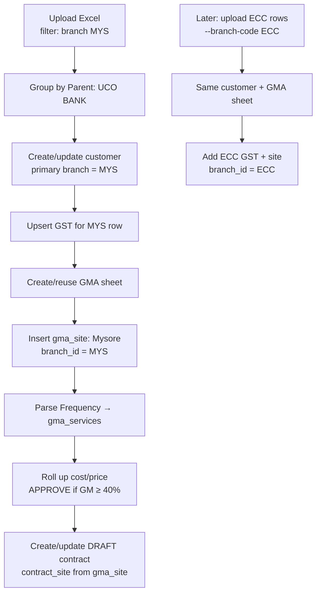

# Customer ETL → GMA → Contract — How It Works

Easy guide for understanding **how Excel rows become customers**, how **branches and shipping addresses connect**, and **who can see what** in the ERP.

**Verified with real DB (Lokesh / Binay / UCO BANK):** see [customer-gma-contract-so-visibility-verified.md](./customer-gma-contract-so-visibility-verified.md).

---

## 1. Big picture (one sentence)

**One Excel row = one service site (shipping address).** Rows with the same **Parent Company Name** become **one customer**. Each site becomes a **GMA site**, which rolls into **one GMA sheet** and then **one contract**.

```
Excel row (site)
    │
    ▼
customers (1 per parent company)
    │
    ├── customer_gst_registrations (+ branch links)
    │
    └── gma_sheets (1 per customer, reused on re-import)
            │
            ├── gma_sites (shipping addresses — 1 per row)
            │       └── gma_services (from Frequency column)
            │
            └── contracts (1 per GMA sheet)
                    ├── contract_sites (copy of sites + contacts)
                    └── contract_site_services
```

**GMA** = **Gross Margin Approval** — commercial costing sheet before a contract is created.

---

## 2. Excel format (Customer ETL)

Template: `ERP_ETL/samples/customer-import-template.xlsx`  
(also downloadable from the app: `/samples/customer-import-template.xlsx`)

### 2.1 Grouping rule

| Excel field | What it becomes |
|-------------|-----------------|
| **Parent Company Name** | **Group key** → one `customers` record (`full_name`) |
| **Client Name** | **Site name** → `gma_sites.site_name` (not customer name) |
| **Shipping Address / Service Address** | **Site address** → `gma_sites.address` |

All rows with the same parent company are processed together as one customer, even if they have different GST numbers or branches.

### 2.2 Key columns

| Column | Level | Purpose |
|--------|-------|---------|
| Customer Type | Anchor (first row in group) | Facility Management, Contract, One Time, Product |
| Parent Company Name | Group | Customer legal/display name |
| Client Name | Per row | Site/location name |
| GST Number | Per row | Multi-GST support — each distinct GST → `customer_gst_registrations` |
| **Branch Code** | Per row | Links GST + site to a branch (e.g. `MYS`, `ECC`, `WHF`) |
| Billing Address (Line 1, City, State, Pincode) | Anchor | Customer billing address |
| **Shipping Address** (full line + city/state/pincode) | Per row | Service location → `gma_sites` |
| Contact Person + Phone Number | Per row | Site contact → `contract_sites` |
| Finance contact person/phone/email | Anchor | Customer finance contact |
| Frequency | Per row | Services for that site → `gma_services` |
| Billing Cycle, Invoice Generation, Bill Frequency | Anchor / dominant | Contract billing settings |

**Anchor row** = the first Excel row in the parent-company group (lowest row number). It drives customer master, finance, and billing defaults.

### 2.3 Import entry points

| Method | How |
|--------|-----|
| **UI** | Customer Data Import page → uploads Excel to ETL API |
| **CLI** | `py -m src.main --tenant-id <id> --branch-code MYS --excel file.xlsx` |
| **Dry run** | Add `--dry-run` to validate without writing |

Config: `ERP_ETL/config/import.yaml` (update existing, multi-GST sync, GM target 40%, etc.)

---

## 3. How branches connect

### 3.1 Branch code resolution (per row)

```
branch_code column  →  legacy branch column  →  CLI --branch-code / API upload filter
```

The code is looked up in `branches.branch_code` (e.g. `MYS` → `BR_0006` Mysore).

### 3.2 Where branch_id is stored

| Table | Branch comes from |
|-------|-------------------|
| `customers.branch_id` | Anchor row branch (**set on first insert only**) |
| `customer_gst_registrations.branch_id` | Row that introduced that GST |
| `customer_gst_registration_branches` | **Additive** links when same GST is imported from another branch run |
| `gma_sheets.branch_id` | Anchor row branch |
| `gma_sheet_branches` | Extra branch sections (multi-branch GMA) |
| **`gma_sites.branch_id`** | **Each Excel row's branch** |
| `contracts.branch_id` | Anchor row branch |
| `contract_sites.branch_id` | Copied from `gma_sites.branch_id` |

### 3.3 Multi-branch import pattern

Large customers often span multiple branches. Import is done **branch by branch**:

```bash
# Run 1 — Mysore sites only
py -m src.main ... --branch-code MYS --excel customers.xlsx

# Run 2 — Electronic City sites (same parent company name in Excel)
py -m src.main ... --branch-code ECC --excel customers.xlsx
```

- Excel is **filtered** at read time: only rows matching the upload `--branch-code` are processed.
- Same parent company → **same customer**, **same GMA sheet** (not duplicated).
- New GST rows **append** to `customer_gst_registrations`.
- New branch links **append** to `customer_gst_registration_branches` (old links are not removed).

---

## 4. How shipping addresses assign to branches

There is **no separate `shipping_addresses` table** in ETL.

| Excel | Database |
|-------|----------|
| Shipping Address / Service Address | `gma_sites.address` |
| Shipping City / State / Country / Pincode | `gma_sites.city`, `state`, `country` |
| Client Name | `gma_sites.site_name` |
| Branch Code (that row) | **`gma_sites.branch_id`** |
| Google Map URL | `gma_sites.google_map_url` |

**Rule:** Each shipping address row carries its own `Branch Code`. That branch is stored on the GMA site and later copied to `contract_sites.branch_id`.

**Dedupe:** Same normalized address under the same GMA sheet → update existing site, do not create duplicate.

**Contact:** Row-level Contact Person + Phone go to `contract_sites` (not on the customer master).

---

## 5. Worked scenario — UCO BANK (multi-branch bank)

This mirrors a real pattern: one parent company, multiple GST registrations, sites in different cities/branches.

### 5.1 Excel input (simplified)

| Parent Company | Client Name | GST | Branch Code | Shipping Address | Frequency |
|----------------|-------------|-----|-------------|------------------|-----------|
| UCO BANK | UCO Mysore Main | 29AAAAA0000A1Z5 | **MYS** | Mysore City Branch, MG Road | General Pest Control |
| UCO BANK | UCO ECC ATM | 29BBBBB0000B1Z5 | **ECC** | Electronic City Phase 1 | General Pest Control |
| UCO BANK | UCO Nagarbhavi | 29CCCCC0000C1Z5 | **NGB** | Nagarbhavi 2nd Stage | General Pest Control |
| UCO BANK | UCO Whitefield | 29DDDDD0000D1Z5 | **WHF** | Whitefield ITPL Road | General Pest Control |

Finance, billing address, and customer type come from the **first row** (anchor).

### 5.2 What ETL creates (after all branch runs)

```
CUSTOMER: UCO BANK (CUST-xxxx)
├── branch_id (primary)     → Mysore (anchor row)
├── gst_configuration       → MULTIPLE
│
├── GST registrations
│   ├── GST ...A1Z5 → branch MYS
│   ├── GST ...B1Z5 → branch ECC  (+ ECC in gst_registration_branches)
│   ├── GST ...C1Z5 → branch NGB
│   └── GST ...D1Z5 → branch WHF
│
└── GMA SHEET (FROM_CUSTOMER, linked to UCO BANK)
    ├── Site: UCO Mysore Main      → branch MYS, address MG Road
    ├── Site: UCO ECC ATM          → branch ECC
    ├── Site: UCO Nagarbhavi       → branch NGB
    └── Site: UCO Whitefield       → branch WHF
        └── each site has gma_services from Frequency

CONTRACT (DRAFT, 1 per GMA sheet)
├── contract_sites (4) — each with site address, contact, branch_id
└── contract_site_services — priced from GMA rollups (40% GM target)
```

### 5.3 Step-by-step flow



1. **MYS run** creates customer, first GST, GMA sheet, Mysore site, draft contract.
2. **ECC run** (same Excel, different filter) finds existing customer by parent name → adds ECC GST, ECC site to same GMA.
3. **NGB** and **WHF** runs repeat the additive pattern.
4. Customer list shows **all linked branches**: `Electronic City, Mysore, Nagarbhavi, Whitefield`.

---

## 6. GMA → Customer → Contract chain

### 6.1 Customer

- Master record: billing, finance, primary GST, primary branch.
- Can have **multiple GST registrations** and (via UI) **operating locations**.
- ETL does **not** write `customer_operating_locations` — only GST + GMA sites.

### 6.2 GMA (Gross Margin Approval)

| Field | Meaning |
|-------|---------|
| `source_type = FROM_CUSTOMER` | Created from customer (ETL or UI) |
| `customer_id` | Parent customer |
| `branch_id` | Primary branch (anchor) |
| `gma_sites` | All service locations (shipping addresses) |
| `gma_services` | Service lines + costing per site |
| `status` | `APPROVED` if gross margin ≥ 40%, else `PENDING` |

GMA is the **costing and pricing workbook**. It does not bill or schedule visits by itself.

### 6.3 Contract

| Step | What happens |
|------|--------------|
| Source | Approved GMA sheet (`FROM_GMA`) |
| Header | Totals, billing cycle, dates from GMA rollups |
| Sites | `contract_sites` copied from `gma_sites` (address + **branch per site**) |
| Services | `contract_site_services` from `gma_services` |
| Status | ETL creates **DRAFT**; activation is manual in UI |
| Multi-GMA | UI can merge several approved GMAs into one contract (V112) |

After contract activation, source GMAs are marked **contract consumed**.

---

## 7. Who can see what

Visibility has **two layers**:

1. **RBAC (role permission)** — Can you open the module at all?
2. **Branch scope** — Which rows appear in lists?

### 7.1 Role permissions (can you access the module?)

| Module | Typical permission | CEO |
|--------|-------------------|-----|
| Customer Management | `CUSTOMER_CONTRACT_MANAGEMENT_READ` | Full access |
| GMA Management | `GMA_SHEET_MANAGEMENT_READ` | Full access |
| Contract Management | `CONTRACT_MANAGEMENT_READ` | Full access |

Without READ permission, the menu and APIs are blocked regardless of branch.

### 7.2 Branch scope (which rows you see in lists)

Your branches come from **your user profile** (`user.branchIds`), except **CEO** who sees all active branches.

When you open a list **without** picking a branch filter, the system injects **your assigned branches** automatically.

#### Customer — visible if **ANY** linked branch matches yours

A customer appears in your list if **at least one** of these is in your branch set:

| Link type | Table |
|-----------|-------|
| Primary branch | `customers.branch_id` |
| GST primary branch | `customer_gst_registrations.branch_id` |
| GST extra branches | `customer_gst_registration_branches` |
| Operating location branches | `customer_location_branches` (UI-created locations) |

**Example — user Lokesh** has branches: **ECC, MYS, NGB** only.

- He **can see** UCO BANK because ECC, MYS, or NGB matches.
- List **Branch** column may still show **Whitefield** because display uses **all** linked branches, not only his.

#### GMA — visible if **ANY** of these match

| Link type | Table |
|-----------|-------|
| Sheet primary branch | `gma_sheets.branch_id` |
| GMA branch section | `gma_sheet_branches` |
| Site branch | `gma_sites.branch_id` |

List shows **primary sheet branch** name only, even if you matched via a site in another branch.

#### Contract — visible if **ANY** of these match

| Link type | Table |
|-----------|-------|
| Contract header branch | `contracts.branch_id` |
| Site branch | `contract_sites.branch_id` |

List shows **header branch** only; detail view shows each site's branch.

### 7.3 Visibility summary table

| Entity | You see it in list when… | Branch column in list shows… | Detail by ID |
|--------|---------------------------|-------------------------------|--------------|
| **Customer** | Any GST / location / primary branch matches yours | **All** linked branches (comma-separated) | Full record if you have READ (no branch re-check) |
| **GMA** | Sheet, section, or site branch matches | Primary sheet branch only | Full GMA if you have READ |
| **Contract** | Header or any site branch matches | Header branch only | Full contract if you have READ |

### 7.4 Practical examples (UCO BANK scenario)

| User | Branches | Sees UCO BANK? | Sees which sites in GMA/Contract? |
|------|----------|----------------|-----------------------------------|
| **CEO** | All | Yes | All 4 sites (MYS, ECC, NGB, WHF) |
| **Lokesh** | ECC, MYS, NGB | Yes (GST/branch match) | All sites on GMA/contract detail* |
| **Whitefield manager** | WHF only | Yes (WHF GST/site) | All sites on detail* |
| **Bangalore-only user** | BOM only | No | — |

\*Detail views currently load the full GMA/contract tree by ID; branch filtering applies mainly to **list/search**, not always to every field inside detail screens.

### 7.5 Known display behavior (important)

| Behavior | Explanation |
|----------|-------------|
| Customer visible but branch name shows extra cities | **Filter** uses OR (any match). **Display** joins all linked branches. A Mysore user can see UCO BANK and also see "Whitefield" in the branch column because WHF is linked via GST. |
| GMA list shows one branch | Filter can match a site in ECC, but list column shows anchor branch (e.g. Mysore). |
| `getById` bypasses branch filter | If someone has the ID and READ permission, direct view-by-ID may show full record. |

---

## 8. Quick reference — DB tables touched by Customer ETL

| Table | Created/updated by ETL? |
|-------|-------------------------|
| `customers` | Yes |
| `customer_gst_registrations` | Yes |
| `customer_gst_registration_branches` | Yes (additive) |
| `customer_operating_locations` | **No** (UI only) |
| `gma_sheets` | Yes |
| `gma_sheet_branches` | Yes (when multi-branch) |
| `gma_sites` | Yes (**shipping addresses**) |
| `gma_services` | Yes |
| `contracts` | Yes (DRAFT) |
| `contract_sites` | Yes |
| `contract_site_services` | Yes |
| `contract_payment_lines` | Yes |

---

## 9. Related documentation

| Document | Topic |
|----------|-------|
| `ERP_ETL/docs/03-customer-mapping.md` | Customer + GST field mapping |
| `ERP_ETL/docs/04-site-mapping.md` | Shipping → `gma_sites` |
| `ERP_ETL/docs/05-gma-mapping.md` | GMA sheet rollups |
| `ERP_ETL/docs/06-contract-mapping.md` | Contract from GMA |
| `ERP_ETL/docs/08-end-to-end-flow.md` | Multi-branch import runs |
| `docs/gma-contract-branch-enhancement.md` | Multi-branch GMA + multi-GMA contracts |
| `seravion-connect-backend/docs/MODULE_17_GMA_COMPLETE_TECHNICAL_DOCUMENTATION.md` | GMA module deep dive |
| `seravion-connect-backend/docs/MODULE_19_CONTRACT_COMPLETE_TECHNICAL_DOCUMENTATION.md` | Contract module deep dive |

---

## 10. One-page cheat sheet

```
EXCEL
  Parent Company Name  →  1 Customer
  Client Name          →  1 GMA Site (site name)
  Shipping Address     →  gma_sites.address
  Branch Code (row)    →  gma_sites.branch_id + GST branch links
  Frequency            →  gma_services

CHAIN
  Customer → GMA Sheet → GMA Sites → Contract Sites

VISIBILITY (lists)
  Customer:  show if ANY linked branch matches user
  GMA:       show if sheet/section/site branch matches
  Contract:  show if header OR site branch matches

DISPLAY QUIRK
  Customer branch column = ALL linked branches (not filtered to your access)
```
