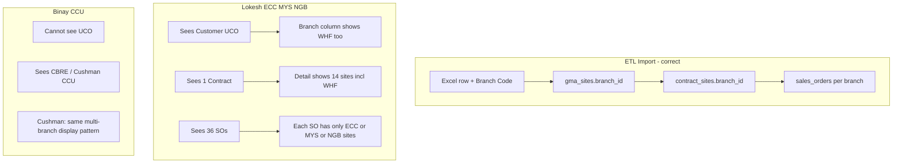

# Verified Visibility Scenarios — Lokesh, Binay & UCO BANK

**Source:** Local DB `rbac_bugfix_v0` schema `pip_ser_86b541` (production replica)  
**Verified:** 5 Aug 2026  
**Related guide:** [customer-etl-gma-contract-visibility.md](./customer-etl-gma-contract-visibility.md)

---

## Verdict (short answers)

| Question | Answer from real data |
|----------|----------------------|
| Is ETL branch/shipping mapping correct? | **Yes.** Each shipping row became a `gma_site` / `contract_site` with its own `branch_id`. |
| Why does Lokesh see **Whitefield** on Customer list? | UCO BANK GST is linked to **ECC, MYS, NGB, WHF**. List **Branch** column shows **all** linked branches — not only his. |
| Do Contract / SO lists show only MYS+NGB+ECC for Lokesh? | **Contract list:** he sees the **one multi-branch contract** (because his sites are on it). **SO list:** only SOs whose header `branch_id` is ECC/MYS/NGB — **not WHF SOs**. |
| Do branch persons get only their sites? | **On Sales Orders: yes** (each SO is per-branch and carries only that branch’s sites). **On Contract / GMA detail: no** — opening the contract shows **all** sites including Whitefield. |

---

## 1. Users picked from DB

### Lokesh K (`user_id=83`, `emp_id=P00087`, `lokesh.k@pestmed.in`)

| Branch ID | Code | Name |
|-----------|------|------|
| BR_0005 | **ECC** | Electronic City |
| BR_0006 | **MYS** | Mysore |
| BR_0007 | **NGB** | Nagarbhavi |

**No WHF access.**

### Binay Samnata (`user_id=168`, `emp_id=P00174`, `samantabinay@gmail.com`)

| Branch ID | Code | Name |
|-----------|------|------|
| BR_0022 | **CCU** | Kolkatta |

**No Bangalore / UCO multi-branch access.**

---

## 2. UCO BANK master record (the one Lokesh sees)

| Field | Value |
|-------|-------|
| Customer ID | **CUST-5D6C0** |
| Name | **UCO BANK** |
| Primary branch | **MYS** (`BR_0006`) |
| GST | `29AAACU3561B2ZJ` |
| GST config | SINGLE (one GST number, **multi-branch links**) |
| GMA | `GMA-2026-0035` (APPROVED, consumed) |
| Contract | `CTR-FC71430799` (ACTIVE, header branch **MYS**, total ≈ ₹7,09,500) |

### Why Whitefield appears on Customer Management

GST registration `GST-75531F94` for this customer has **extra branch links**:

| GST | gst_branch | Linked via `customer_gst_registration_branches` |
|-----|------------|--------------------------------------------------|
| 29AAACU3561B2ZJ | MYS | **ECC, MYS, NGB, WHF** |

So:

1. Lokesh **is allowed to see** the customer (ECC/MYS/NGB match).
2. UI Branch column joins **all** linked names → he also sees **Whitefield**.

That is expected with current code — not an ETL mistake.

---

## 3. Sites after ETL (CUST-5D6C0)

Shipping addresses became GMA sites (and the same split on the contract).

### GMA / Contract site counts by branch

| Branch | Sites | Example site names |
|--------|------:|--------------------|
| **ECC** | 3 | Sol id 1053, 1958, 3479 |
| **MYS** | 2 | Sol id 2904, 3100 |
| **NGB** | 6 | Sol id 0297, 0623, 1136, 2009, 2533, 2540 |
| **WHF** | 3 | UCO BANK (3 Whitefield addresses) |
| **Total** | **14** | — |

ETL did its job: each Excel shipping row kept its **Branch Code** on `gma_sites.branch_id` → copied to `contract_sites.branch_id`.

```
Excel row (Client Name + Shipping Address + Branch Code)
        │
        ▼
gma_sites.branch_id = that row's branch
        │
        ▼
contract_sites.branch_id = same
        │
        ▼
sales_orders.branch_id = per branch (separate SO series)
sales_order_sites = only that branch's contract sites
```

---

## 4. Scenario A — Lokesh + UCO BANK

### 4.1 Customer Management

| Check | Result |
|-------|--------|
| Sees CUST-5D6C0? | **Yes** (GST/site branches overlap ECC/MYS/NGB) |
| Branch column text | Shows **Electronic City, Mysore, Nagarbhavi, Whitefield** (all links) |
| User surprise | “I don’t have Whitefield” — display is union of links, not his access set |

### 4.2 GMA Management

| Check | Result |
|-------|--------|
| Sees `GMA-2026-0035` in list? | **Yes** (sheet primary MYS **or** sites in ECC/MYS/NGB) |
| List branch column | Primary sheet branch = **Mysore** |
| Open GMA detail | **All 14 sites** (including 3 WHF) — no branch filter on detail |

### 4.3 Contract Management

| Check | Result |
|-------|--------|
| Sees `CTR-FC71430799` in list? | **Yes** — list rule is header **OR any site** in his branches |
| How many contracts for UCO? | **One** shared contract for all four site branches |
| List branch column | Header = **Mysore** |
| Open contract detail | **All 14 sites** (ECC 3 + MYS 2 + NGB 6 + **WHF 3**) |

**Important:** Contract is **not** split per branch. Lokesh sees **one** contract that contains Whitefield sites inside the detail, even though he has no WHF access.

Contract Tab “Sales Order schedule” **does** respect branch filter when the API passes his branches — so the schedule UI can show only ECC/MYS/NGB SOs.

### 4.4 Sales Orders

| Branch | SO count (CUST-5D6C0) | Lokesh sees in SO list? |
|--------|----------------------:|-------------------------|
| ECC | 12 | **Yes** |
| MYS | 12 | **Yes** |
| NGB | 12 | **Yes** |
| WHF | 12 | **No** |
| **Total in DB** | **48** | Lokesh list ≈ **36** |

SO list filters by `sales_orders.branch_id` ∈ user branches only.

### 4.5 Do individual branch SOs contain only that branch’s sites?

Verified on **OPEN** SOs for UCO BANK:

| SO number | SO branch | Sites on SO | Site branches |
|-----------|-----------|------------:|---------------|
| SO-2026-0028 | ECC | 3 | **ECC only** |
| SO-2026-0027 | MYS | 2 | **MYS only** |
| SO-2026-0029 | NGB | 6 | **NGB only** |
| DRAFT-80193971 | WHF | 0* | WHF SO (Lokesh never sees this in list) |

\*WHF OPEN draft in this snapshot had 0 linked `sales_order_sites` rows; other WHF drafts exist. Pattern for populated SOs: **one SO per branch per period, sites = that branch only**.

So for **operations / visits / tasks** tied to an SO, a Mysore person working an MYS SO only gets **Mysore sites**.

---

## 5. Scenario B — Binay (CCU only)

### 5.1 Does Binay see UCO BANK?

| Link type | CCU present? |
|-----------|--------------|
| Customer primary | No (primary = MYS) |
| GST branch / GST links | No |
| GMA site | No |
| Contract site | No |

**Result: Binay does not see CUST-5D6C0 / UCO BANK at all.** Correct.

### 5.2 What Binay *does* see (CCU scope)

| Entity | Count in DB for CCU scope |
|--------|--------------------------:|
| Customers | 6 |
| Contracts | 6 |
| Sales Orders (`branch_id=CCU`) | 25 |
| GMA sheets | 7 |

Sample customers:

| Customer | Primary | Notes |
|----------|---------|-------|
| CBRE South Asia Pvt. Ltd | CCU | CCU-only GST; 6 sites all CCU |
| CureFoods India Limited | CCU | Also linked DEL |
| Cushman and Wakefield (PMSI) | CCU | Linked **CCU, ECC, MYS, NGB, WHF** |
| Innovel Energy Services | CCU | — |
| Plus 360 Fahrenheit | CCU | — |
| UNITED SPIRITS LIMITED | DEL | Visible because GST/link includes **CCU** |

### 5.3 Binay + Cushman (multi-branch twin of UCO problem)

| Metric | Value |
|--------|------:|
| Total GMA sites | 7 |
| CCU sites | 3 |
| Total contract sites | 7 |
| CCU contract sites | 3 |
| CCU SOs (with sites) | 12 periods × 3 CCU sites each |

Same pattern as Lokesh/UCO:

- Customer list may show **ECC, MYS, NGB, WHF** in branch names even though Binay only has CCU.
- Contract detail shows **all 7 sites**.
- SO list shows **only CCU SOs**, each with **3 CCU sites**.

### 5.4 Binay + CBRE (clean single-branch)

| Metric | Value |
|--------|------:|
| GST branches | CCU only |
| Sites | 6 / 6 CCU |
| Contract sites | 6 / 6 CCU |

No “foreign branch name” surprise — clean case.

---

## 6. Who can see what — matrix (real rules)

| Screen | Lokesh (ECC/MYS/NGB) on UCO | Binay (CCU) on UCO | Branch person “own sites only”? |
|--------|----------------------------|--------------------|----------------------------------|
| **Customer list** | Yes + sees WHF in branch text | No | N/A — customer is company-level |
| **Customer detail** | Full customer + all GST links | — | Shows all linked branches |
| **GMA list** | Yes (matched via MYS/sites) | No | List shows primary branch |
| **GMA detail** | **All 14 sites** | — | **No** — full tree |
| **Contract list** | Yes (1 shared contract) | No | One row for whole company contract |
| **Contract detail** | **All 14 sites** incl. WHF | — | **No** — full site list |
| **SO list** | 36 SOs (ECC+MYS+NGB) | No | **Yes** — filtered by SO.branch_id |
| **SO detail** | Sites of that SO only | — | **Yes** — SO already branch-scoped |

---

## 7. Mental model (easy)

Think in three layers:

```
LAYER 1 — CUSTOMER (company)
  One company record can touch many branches via GST links.
  List visibility = ANY branch match.
  Branch label = ALL linked branches.  ← why Lokesh sees Whitefield text

LAYER 2 — CONTRACT / GMA (shared commercial document)
  One contract can hold sites from many branches.
  List visibility = header OR any site match.
  Detail = FULL site list (no per-user site filter today).  ← WHF sites visible inside

LAYER 3 — SALES ORDER (branch operations)
  Separate SO series per branch.
  List = only my branch_ids.
  Sites on SO = only that branch’s sites.  ← true “my sites only”
```



---

## 8. Other UCO-named customers (not CUST-5D6C0)

ETL also created separate customers for other Sol-ids under different branches (CHB / KYN), e.g.:

- `CUST-BC87E` UCO Bank - Sol id - 1052 → Chickbaklapur  
- `CUST-8B4D0` UCO Bank - Sol Id-0024 → Kalyannagar  

Those are **different customer IDs**. Lokesh does **not** get them via CUST-5D6C0; he only sees them if their own branch links match ECC/MYS/NGB.

The confusing list row for Lokesh is specifically **CUST-5D6C0** with multi-branch GST links including WHF.

---

## 9. What is “working as designed” vs “confusing UX”

| Behavior | Design? | User feeling |
|----------|---------|--------------|
| ETL assigns shipping address → site branch | Correct | Good |
| Separate SOs per branch with only that branch’s sites | Correct | Good — ops scoped |
| Customer visible if any GST branch matches | Correct (inclusive) | OK |
| Customer Branch column shows all links including WHF | Current code | Confusing for Lokesh |
| One ACTIVE contract holds ECC+MYS+NGB+WHF sites | Correct commercially | OK |
| Contract/GMA **detail** shows WHF sites to non-WHF user | Current code (no site filter) | Confusing |
| SO list hides WHF SOs from Lokesh | Correct | Good |

---

## 10. Optional product fixes (if you want later)

1. **Customer list `branchName`:** show only intersection with user’s branches (e.g. Lokesh → `Electronic City, Mysore, Nagarbhavi`).
2. **Contract / GMA detail:** optionally filter `sites[]` to user’s branches (or add a “My branches only” toggle) so WHF sites are hidden unless user has WHF.
3. Keep SO behavior as-is — it already matches “branch person gets their sites only.”

---

## 11. Quick cheat sheet

| User | Sees UCO customer? | Sees UCO contract? | Sees UCO SOs? | Sees WHF sites where? |
|------|--------------------|--------------------|---------------|------------------------|
| **Lokesh** (ECC/MYS/NGB) | Yes (+ WHF in label) | Yes (1 shared) | Yes — ECC/MYS/NGB only (36) | Customer label + Contract/GMA detail; **not** SO list |
| **Binay** (CCU) | No | No | No | Nowhere for UCO |
| **WHF user** (e.g. Ambika) | Yes | Yes | WHF SOs (12) | Everywhere for WHF slice |
| **CEO** | Yes | Yes | All 48 | All |

---

## 12. SQL used to verify (rerunnable)

Schema: `pip_ser_86b541`

```sql
-- Users
SELECT u.id, u.emp_id, u.first_name, u.last_name, b.branch_code
FROM users u
JOIN user_branches ub ON ub.user_id = u.id
JOIN branches b ON b.id = ub.branch_id
WHERE u.id IN (83, 168);

-- UCO GST links
SELECT g.gst_number, b.branch_code AS gst_branch,
       string_agg(DISTINCT bb.branch_code, ', ') AS extra_branches
FROM customer_gst_registrations g
LEFT JOIN branches b ON b.id = g.branch_id
LEFT JOIN customer_gst_registration_branches gb ON gb.gst_registration_id = g.id
LEFT JOIN branches bb ON bb.id = gb.branch_id
WHERE g.customer_id = 'CUST-5D6C0'
GROUP BY 1, 2;

-- Sites by branch
SELECT b.branch_code, COUNT(*)
FROM contract_sites cs
JOIN branches b ON b.id = cs.branch_id
WHERE cs.contract_id = 'CTR-FC71430799'
GROUP BY 1;

-- SO site purity
SELECT so.so_number, b.branch_code, COUNT(sos.id)
FROM sales_orders so
JOIN branches b ON b.id = so.branch_id
LEFT JOIN sales_order_sites sos ON sos.sales_order_id = so.id
WHERE so.customer_id = 'CUST-5D6C0' AND so.status = 'OPEN'
GROUP BY 1, 2;
```
