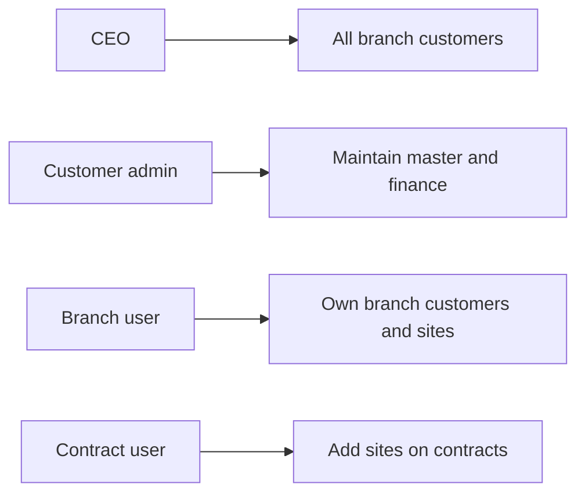
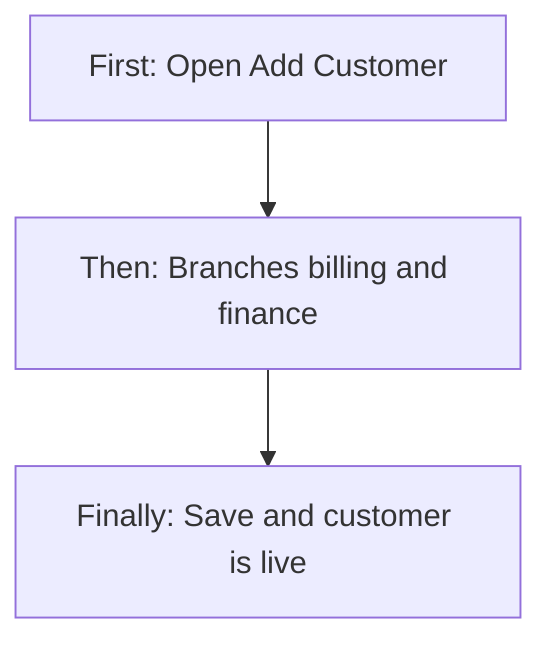
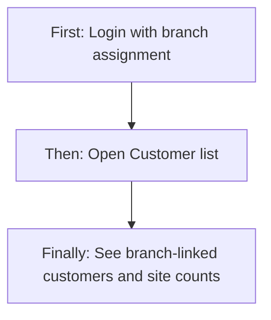
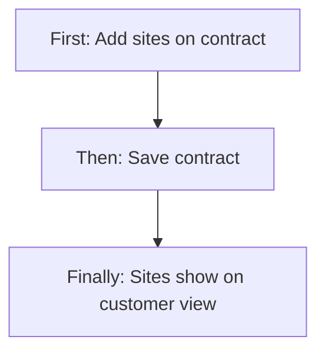
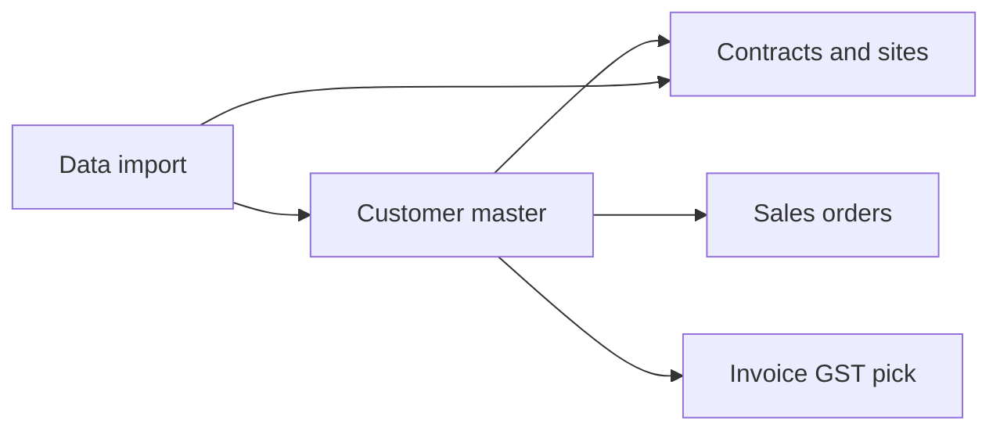
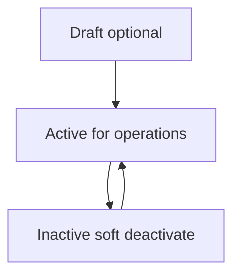

# Customer Management — Product & Business Documentation

## 1. Purpose & Business Need

Pest-control / facility operations need one **customer master** so every branch can share the same legal customer, GST, finance contacts, and operating geography — while still seeing only the customers and **service sites** that belong to their branch.

**Customer Management** (menu: **Operations → Customer Management**) is that master. It stores:

- Who the customer is (name, type, industry, PAN/TAN, primary contact)
- How they are billed (single or multiple GST, billing address, finance contact)
- Which **branches** serve them (linked on GST and/or operating locations)
- A 360° view of contracts, **contract sites**, and sales-order / service history

**Outcomes today:**

- Add customers manually or by importing a converted lead
- Save incomplete records as **Draft**, then complete later
- Maintain single-GST or multi-GST billing and finance contacts
- Link customers to one or many branches so branch users see “their” customers
- Soft-deactivate when eligible; re-activate from the list
- View branch-scoped site counts and site lists (sites themselves are created with contracts / bulk import)
- Drive downstream Contracts, Sales Orders, Invoicing GST resolution, and customer ledger when Active

**What this module is not:** A place to create or edit operational **service sites** on the customer form; site master data is owned by **Contract Management** (and optionally **Customer Data Import** / GMA). There is also **no request/approve** workflow for creating or changing a customer.

---

## 2. Users & Roles (who uses this and why)

Access is permission-based on the **Customer** module (platform name: Customer Contract Management), not fixed job titles. In practice:

### 2.1 Company CEO / Owner

Sees all active branches’ customers by default. Can add, edit, deactivate, and export sales history without needing individual Customer permissions.

### 2.2 Customer / Operations administrators

Staff given **Customer Read / Add / Edit / Delete / Export** maintain the customer master, finance/GST details, and operating locations. Typical owners of day-to-day onboarding.

### 2.3 Branch managers / branch operations users

Assigned to one or more branches. When they open the customer list with no extra branch filter, they see customers linked to **their assigned branches**. They use the same Customer permissions if granted; branch assignment controls **which records appear**, not a separate “branch customer” screen.

### 2.4 Read-only operations / support

Users with **Customer Read** only can open the list and 360° view (basic details, sites tab, contract logs, sales history) but cannot add, edit, or deactivate.

### 2.5 Contract / Sales Order / Invoice users

May pick Active customers from dropdowns in other modules. Creating **sites** happens when they create or amend a **contract** (or via bulk Customer Data Import), not on the customer Add/Edit form. Invoice users can resolve which GST to use for a customer by branch/site location when they have Invoice or Customer Read.

### 2.6 Super Admin / platform bypass roles

Session roles that bypass RBAC (e.g. Super Admin / SERAVION-style bypass) see full Customer menu and actions like other privileged users.

---

## 3. Access Control (RBAC)

### 3.1 How access works

Login role/permissions decide whether **Customer Management** appears under Operations and which actions work.

| Permission | Allows |
|------------|--------|
| **Read** | Menu, customer list, view 360°, sites / contract logs / sales history tabs |
| **Add** | **+ Add Customer**, Save as Draft, Save & Create |
| **Edit** | Edit from list, Update Customer, status toggle (deactivate / re-activate) |
| **Delete** | Soft-deactivate API (list row delete button is **hidden**; deactivation uses Edit + toggle) |
| **Export** | Sales-order / service history Excel export API (button not currently exposed on the View sales tab) |

CEO can perform Customer actions without the granular permissions above. **Approve / Request** exist in the platform catalog but are **not used** for Customer create/edit/deactivate.

There is **no separate “Finance” permission**. Anyone who can Add or Edit a customer can enter and change **financial / GST / billing / finance-contact** fields.

### 3.2 Role × action matrix

| Role | View list | View detail | Add | Edit | Inactive / Delete | Submit request | Receive / act | Approve | Reject |
|------|-----------|-------------|-----|------|-------------------|----------------|---------------|---------|--------|
| Company CEO | Yes | Yes | Yes | Yes | Yes (soft Inactive) | No | No | No | No |
| Staff with Customer Read | Yes | Yes | No | No | No | No | No | No | No |
| Staff with Customer Add | Yes* | Yes* | Yes | No | No | No | No | No | No |
| Staff with Customer Edit | Yes* | Yes* | No | Yes | Via status toggle (needs Edit) | No | No | No | No |
| Staff with Customer Delete | Yes* | Yes* | No | No | API yes; UI row delete hidden | No | No | No | No |
| Staff with Customer Export | Yes* | Yes* | No | No | No | No | No | No | No |
| Staff without Customer module | No menu / list | No | No | No | No | No | No | No | No |

\*Add/Edit/Delete/Export still require **Read** to open the screens via the protected route.

**Record-level / branch rules:**

- Default list and customer sites: scoped to the user’s **assigned active branches** (CEO: all active branches).
- Customer appears for a branch if primary branch, GST registration branch / multi-branch GST links, or operating-location branch links match.
- Optional list filter `branchIds` narrows further (UI hides branch filter if the user has only one branch).
- Dropdown of customers for other modules: Active only; requesting a branch the user cannot access is rejected for non-empty branch sets.
- Sales history / Excel: requested branches are **intersected** with the user’s session branches (stricter than the main customer list).

---

## 4. Capabilities & Features

### 4.1 Customer list

Paginated list with search, status / type / branch / date filters, View and Edit, and Active/Inactive status toggle with eligibility checks before deactivation. Shows total sites (branch-scoped), contract value, and created audit fields.

### 4.2 Add / Edit customer

Shared form covering entry mode (manual or from lead), customer type, identity, contacts, operating locations, single or multiple GST, billing, finance contacts, and linked branches. Draft save skips full validation; Save & Create / Update enforces complete rules when status is not Draft.

### 4.3 View customer (360°)

Read-only profile with tabs: **Basic Details**, **Customer Sites**, **Contract Logs**, **Sales Orders & Service History**. Sites and history are branch-aware. Navigation to related Contract and Sales Order screens from row actions.

### 4.4 Financial / GST / finance contacts

Entered on Add/Edit (not a separate finance screen). Single-GST: one billing + finance block with linked branches. Multiple-GST: one finance/billing block per GST registration, with a primary registration.

### 4.5 Operating locations (not service sites)

State + city + optional branch mapping for multi-location / multi-GST geography. Used for customer–branch visibility and commercial geography — **not** the operational site list used for service delivery.

### 4.6 Sites (view in Customer; create elsewhere)

Customer Sites tab lists **contract sites** for that customer, filtered by branch and contract status. Creating or changing sites is done in **Contract Management** (or bulk **Customer Data Import** → GMA → Contract).

### 4.7 Deactivate / re-activate

Toggle Active → Inactive after eligibility (no blocking open sales orders / active contracts per UI check) and a mandatory reason. Toggle Inactive → Active with re-activation reason. Soft-delete flags the record Inactive and keeps history.

### 4.8 Bulk path (related)

**Customer Data Import** (same Customer module Read on route) can load customers, GST, finance, and site rows from Excel, which then flow into GMA and contracts. This is the main mass path for **site entries** alongside contract screens.

### 4.9 Downstream effects when Active

- Customer becomes selectable in Active customer dropdowns
- Customer ledger can be auto-provisioned
- Contracts, sales orders, and invoice GST resolution can use the master and GST/branch links

---

## 5. CRUD Operations

### 5.1 Create (Add)

**Who:** Users with Customer **Add** (or CEO).

**First:** Open **+ Add Customer** from the list.  
**Then:** Choose Manual or Import from Lead; fill type, name, contacts, branches, GST mode, billing, and finance contacts (or Save as Draft with partial data).  
**Finally:** Save & Create assigns a system Customer ID (format like `CUS-{year}-{#####}`), persists GST/location children, and if Active, enables ledger/downstream use. User returns to the list.

Required for a non-draft single-GST save includes: customer type, full name, contact person, phone, email, linked branch(es), billing address, map URL, finance contact name and phone. Multiple-GST requires valid GST registration cards (at least one, exactly one primary).

### 5.2 Read — List

**Who:** Customer **Read**.

List loads Active customers by default (filter can switch to Inactive), scoped to effective branches. Columns: Customer ID, Name, Total Sites, Customer Type, Primary Contact, Primary Email, Branch Name, Status, Total Contract Value, Created Date, Created By. Search by ID/name (and related search terms). Empty result when no matches or when effective branch set is empty.

### 5.3 Read — Detail / Get details

**Who:** Customer **Read**.

Opening View loads the customer profile (identity, GST configuration, primary billing/finance, operating locations, GST cards), then each tab loads its own paged data (sites, contracts, sales history). Edit is not on the View header; users go back to the list Edit action.

### 5.4 Update (Edit)

**Who:** Customer **Edit** (or CEO).

**First:** Edit from list.  
**Then:** Change allowed fields (contacts, GST, finance, locations, branches, TAN, etc.). Customer Type and PAN stay locked.  
**Finally:** Update Customer saves; changes are audited. Active customers remain available downstream.

### 5.5 Inactive / Delete

**Who:** Soft deactivate is triggered from the list status toggle with **Edit** permission (Delete permission exists on the API; the list Delete button is not shown).

**Inactive vs delete:** Soft path sets deleted flag, status **Inactive**, reason, and audit of who/when. Not a hard purge.

**Confirmation:** Modal with eligibility checklist; if blocked (e.g. open/draft sales orders or active contracts per UI rules), user cannot confirm. If eligible, reason required (Customer Relocated, Business Closure, Non-Renewal, Payment Default, Other + remarks).

**Reactivation:** Toggle Inactive → Active using re-activation reason path on the same delete/deactivate API.

Backend also blocks deactivate when open sales orders are Draft or Open.

---

## 6. Request & Approval Flows

This module does **not** use request/approve. Create, update, and deactivate apply immediately for users with Add / Edit / Delete (or CEO). Draft is a customer status for incomplete masters, not an approval queue.

---

## 7. Forms — Add vs Edit Field Access

| Field (business name) | On Add | On Edit | Notes |
|----------------------|--------|---------|-------|
| Entry mode (Manual / From Lead) | Editable | Editable | Lead path prefills and locks lead-sourced display fields after fetch |
| Lead selection | Editable if From Lead | Editable if From Lead | Converts lead on non-draft create |
| Customer Type | Editable, required (non-draft) | **Locked** | Contract / One Time / Product |
| Entity / Full Name | Editable, required | Editable, required | |
| Industry Type | Editable | Editable | Fixed industry list |
| PAN | Editable | **Locked** | Immutable after create |
| TAN | Editable | Editable on backend; UI currently **disabled** on Edit | Prefer treating as locked in UI today |
| Contact Person / Designation / Phone / Alternate / Email | Editable | Editable | Phone digit rules |
| Operating Locations | Editable | Editable | State, city, mapped branches; add/remove rows |
| GST Mode (Single / Multiple) | Editable | Editable | |
| Linked Branches (Single GST) | Editable, required | Editable, required | Auto-select if user has only one branch |
| GST Number (Single) | Editable, optional if valid format | Editable | |
| Billing address, city, state, pincode, country, map URL | Editable, required (non-draft Single) | Editable | |
| Finance Contact Name / Phone / Email | Editable; Name+Phone required (Single non-draft) | Editable | No finance-only role |
| GST registration cards (Multiple) | Editable | Editable | Primary, branches, billing, finance per card |
| Status radio on form | Not shown | Not shown | Draft only via Save as Draft; Active default on create |
| Customer ID | Hidden (system) | Locked display | Assigned on create |
| Remarks | Editable | Editable | |

**Roles:** Users without Add cannot save on Add; without Edit cannot Update. Read-only users never reach editable finance fields.

---

## 8. Lists, Dropdowns, Details & Data Rendering

### 8.1 List rendering

- Default status filter: Active
- Server pagination and page size
- Search debounce (~400 ms)
- Filters: Status, Branch (if user has more than one branch), Customer Type, Created/joined date range
- Total Sites in footer aggregate respects branch scope
- Actions: View (Read), Edit (Edit), status toggle (Edit)

### 8.2 Dropdowns & lookups

| Control | What appears | Notes |
|---------|--------------|-------|
| Lead dropdown | Leads available for import | Selecting loads lead into form |
| Industry | Fixed list (Hospitality, IT, Healthcare, Manufacturing, Retail, Other) | |
| Branches on form | Branch dropdown list | Chips add/remove; sole branch auto-selected |
| Country / State / City | Geography lists | Single billing vs India utils for locations / multi-GST |
| Deactivate reason | Fixed reasons + Other | Remarks when Other |
| Customer dropdown (other modules) | Active customers, optional branch | Used outside this module’s list |
| Branch filter on list / sites | Current user’s branches | Hidden if ≤1 branch |

Dependent behavior: State → City on operating locations and multi-GST cards; GST mode switches which billing/finance UI is shown.

### 8.3 Detail / get-details rendering

- Basic Details: entity card, primary billing + finance, operating locations table, GST registration cards (expand/collapse)
- Sites: Site ID, name, address, branch, contract link, site contact, area, status; search + status/branch filters
- Contract Logs: paged contracts with view action
- Sales history: paged SO / service rows with view to sales order detail (export API exists; UI control not bound)

---

## 9. How It Works (end-to-end user flows)

### 9.1 Customer admin — Add customer with finance (Single GST)

**First:** Opens Add Customer, chooses Manual, enters type and primary contact.  
**Then:** Selects Linked Branches, completes billing address and **Finance Contact** name/phone (email optional), sets GST if known.  
**Finally:** Save & Create; customer appears on the list for those branches; Active customers get ledger readiness and can be used on contracts.

### 9.2 Customer admin — Multi-GST finance

**First:** Sets GST Mode to Multiple.  
**Then:** Adds one card per GST with state/city, linked branches, billing, and finance contact; marks exactly one Primary.  
**Finally:** Saves; invoice resolution can later pick the right GST by branch or site city/state.

### 9.3 Branch user — See only assigned-branch customers

**First:** Logs in with branches e.g. Mysore only.  
**Then:** Opens Customer list with no branch filter (or only Mysore).  
**Finally:** Sees customers whose primary / GST / operating-location links include Mysore; Total Sites counts Mysore sites. Opening Sites tab shows that customer’s sites in accessible branches.

### 9.4 Contract user — Site entries reflect on customer

**First:** Creates or edits a Contract for the customer and adds site rows (name, address, branch, contacts, commercial fields) or inherits from GMA.  
**Then:** Saves the contract; sites are stored as contract sites under that customer.  
**Finally:** On Customer View → Sites (and list Total Sites), the same sites appear for matching branches so operations can verify coverage.

### 9.5 Bulk import — Customers + sites

**First:** Opens Customer Data Import, downloads template, fills parent company, finance, GST, branch codes, and one row per shipping/site address.  
**Then:** Runs import (dry run then real); system groups rows into one customer and creates GMA sites / contract sites.  
**Finally:** Branch users see the customer if their branch code was linked; Sites tab shows imported service locations.

### 9.6 Edit finance later

**First:** Edit customer from list (Edit permission).  
**Then:** Updates finance contact or GST billing on Single or Multiple cards.  
**Finally:** Update saves; View and invoice GST resolution use the new finance/billing data. Type and PAN remain locked.

### 9.7 Deactivate / re-activate

**First:** User with Edit toggles Active → off.  
**Then:** System checks eligibility; user picks reason and confirms, or is blocked.  
**Finally:** Customer is Inactive and drops from default Active list/dropdowns; toggle back re-activates with re-activation reason.

### 9.8 CEO — Cross-branch check

**First:** CEO opens Customer list (all active branches by default).  
**Then:** Optionally filters to one or more branches.  
**Finally:** Compares Total Sites and opens Sites tab to verify each branch’s site coverage for the same legal customer.

---

## 10. Cross-Module Interactions

| Module | How it connects |
|--------|-----------------|
| **Leads** | Import from Lead on create; non-draft create can mark lead Converted |
| **Branch Management** | Users and customers link to branches; list/sites scope from user branches |
| **Contract Management** | Owns create/update of **sites**; customer View shows contract logs and sites |
| **GMA / Customer Data Import** | Bulk path from Excel → customers, GST, finance, sites, then contracts |
| **Sales Orders** | History tab; deactivate blocked if open Draft/Open SOs; navigation to SO detail |
| **Invoicing** | GST-for-invoice resolution by customer + branch + site state/city |
| **Ledger / Accounts** | Active customer can get auto customer ledger |
| **Notifications** | Customer created / deactivated events |

---

## 11. Data the Business Cares About

| Business attribute | Meaning |
|--------------------|---------|
| Customer ID | System id (`CUS-year-#####`) |
| Customer Type | Contract, One Time, Product |
| Entry Mode | Manual or From Lead |
| Full Name | Legal / display name |
| Industry | Segment |
| PAN / TAN / GST | Tax identity (GST also per registration) |
| Primary contact | Person, designation, phone, email |
| Linked branches | Which branches serve / bill this customer |
| GST configuration | Single vs Multiple |
| Billing address | Per customer (Single) or per GST card |
| Finance contact | Name, phone, email for collections / AP liaison |
| Operating locations | State/city (+ branches) geography |
| Status | Draft, Active, Inactive |
| Reason for deactivation | Why marked Inactive |
| Total Sites | Count of contract sites (branch-scoped on list) |
| Total Contract Value | Aggregate from relevant contracts |
| Contract sites | Service locations: name, address, branch, contacts, area, status |
| Sales / service history | Orders and related service activity |

**Relationships:** One customer → many GST registrations → many branch links; many operating locations → branch links; many contracts → many sites (each site has a branch).

---

## 12. Rules, Validations & Constraints

- Non-draft Single GST: branch, billing (address length rules), map URL, finance name/phone required; GST format if provided
- Non-draft Multiple GST: at least one registration, exactly one primary, unique valid GST numbers, per-card required billing/finance/branches
- Draft: partial save allowed
- Customer Type and PAN immutable after create
- Cannot update a deleted customer
- Soft deactivate blocked when open Draft/Open sales orders exist (backend); UI also warns on active contracts / open SOs
- Default list shows Active, non-deleted
- Phone uniqueness is **not** enforced on create/update in current service behavior (documented gap)
- Site create/update is not available on Customer Add/Edit

---

## 13. Loopholes, Gaps & Current Limitations

1. **No finance-only role** — any Add/Edit user can change finance/GST fields.
2. **Sites not editable in Customer Management** — must use Contract or Import; Operating Locations are often confused with Sites.
3. **List Delete button hidden** — deactivate only via status toggle (Edit), while Delete permission exists on API.
4. **View has no Edit button** — must return to list.
5. **Sales history Excel export** and some sales/contract search filters exist in code but are not fully wired in the View UI.
6. **Edit route vs sidebar highlight** — app uses `/customer-edit/:id` while sidebar association mentions `/customer-edit-v2`.
7. **Branch filter override** on customer list/sites can accept requested branch IDs without intersecting session (sales history is stricter) — security/product inconsistency.
8. **Get-by-id** does not re-check branch scope or deleted flag as tightly as the list — deleted customers may still be fetchable with Read.
9. **TAN** editable in service but disabled on Edit UI.
10. **360 stubs** — some detail fields (e.g. active sites list on the main detail payload, LTV) remain empty/zero while dedicated Sites / Sales tabs hold the real data.
11. **AccountsModule Customers** legacy screen navigates to an unregistered add route — not the v2 Operations path.
12. **Older docs/Postman** may say `CUSTOMER_MANAGEMENT_*` or `CUST-` ids; live product uses `CUSTOMER_CONTRACT_MANAGEMENT_*` and `CUS-` ids.

---

## 14. Existing Functionality Summary

Fully available today:

- Operations Customer list, Add, Edit, View (v2)
- RBAC Read / Add / Edit / Delete / Export (+ CEO)
- Manual and From-Lead create; Draft and Active
- Single and Multiple GST with billing and finance contacts
- Operating locations and multi-branch links
- Branch-scoped list, site counts, and Sites tab
- Soft deactivate with reasons and re-activation
- Contract logs and sales/service history on View
- Related bulk Customer Data Import and Contract-based site entry
- GST-for-invoice resolution for billing users
- Active customer dropdown for other modules

Not available today:

- Request/approve for customer changes
- Creating/editing contract sites inside the customer form
- Separate finance-user permission for financial fields only
- Hard delete of customers from the UI

---

## 15. Real-World Scenarios (branch, finance, sites)

These are the main business situations the built product supports.

### Scenario A — New single-branch contract customer

Sales/ops Add Customer as Contract type, link Branch A, enter billing + finance contact, Save & Create Active. Branch A users see the customer on the list. Later, Contract user adds three sites under Branch A; Customer list Total Sites shows 3; Sites tab lists them.

### Scenario B — Multi-branch corporate customer (one legal entity)

Customer admin sets Multiple GST (or Single with multiple linked branches). GST/branches for Kolkata and Mysore are linked. Kolkata user (only Kolkata assigned) sees the customer; Mysore user sees the same customer. Each user’s Sites tab / site count emphasizes sites in their effective branches. CEO sees both without switching accounts.

### Scenario C — Finance contact change after collections issue

Collections asks ops to update Finance Contact Phone on the primary GST. User with Edit opens Edit Customer, updates finance fields, saves. Invoice and View Basic Details show the new contact. No approval step.

### Scenario D — Multi-GST invoicing by site location

Customer has two GST registrations (different states). Contract sites exist in both states. When raising an invoice, the system can resolve default GST using customer + branch + site state/city so the correct registration is suggested.

### Scenario E — Branch user checks “are these our customers?”

Branch manager opens Customer Management, leaves branch filter at default (own branches). Reviews names, Total Sites, and opens Sites to confirm site names/addresses match fieldwork. Customers only linked to other branches do not appear in the default session scope.

### Scenario F — Site entry only via contract (not on customer form)

Ops mistakenly looks for “Add Site” on Add Customer — it does not exist. Correct path: finish customer → Contract Management → add contract → add site rows (or Import Excel with shipping addresses). After save, return to Customer View → Sites to verify.

### Scenario G — Bulk onboarding from Excel

HO uploads Customer Data Import file: parent company, finance columns, branch codes, one row per site. Import creates one customer, GST/branch links, and site pipeline (GMA → contract sites). Each branch code owner then sees the customer and their site rows.

### Scenario H — Lead conversion

User chooses Import from Lead, selects a won lead, reviews prefilled contact data, completes finance/GST/branches, Save & Create. Lead moves to Converted; customer master is ready for contract.

### Scenario I — Draft then complete

User captures name and phone only as Draft (Add permission). Later Edit (or continue) fills finance and GST, saves Active. Until Active/complete, downstream use is limited compared to a finished Active master.

### Scenario J — Deactivate blocked by open work

User tries to deactivate while Draft/Open sales orders exist. System blocks; user must close/resolve SOs (and UI may also flag active contracts) before Inactive succeeds.

### Scenario K — Re-activate returning customer

Inactive customer toggled back with re-activation. Appears again on Active list/dropdowns for linked branches; contracts/sites history remain available on View.

### Scenario L — Product-type customer without sites

Customer Type Product is created with finance/GST for billing. Sites may stay at zero until/unless a contract with sites is created — list still shows the customer for linked branches.

### Scenario M — One-time job customer

One Time type customer onboarded for a short engagement; finance contact captured for billing; sites may be few; after work completes, may be deactivated with Non-Renewal or similar reason.

### Scenario N — Read-only auditor

User with Read only opens list and View tabs (including finance display and sites) but cannot change finance or deactivate. Used for checking branch assignment and site coverage without edit rights.

### Scenario O — CEO cross-branch audit

CEO filters customers by two branches, compares Total Sites and opens Sites with status filters (Active, Expiring Soon, etc.) to find under-covered or expired site portfolios for the same parent company.

---

## 16. Reference — APIs, Screens & UI Actions

### 16.1 APIs

| Method | Path | Purpose (plain language) | Used by (screen/flow) |
|--------|------|--------------------------|------------------------|
| GET | `/api/v1/customer` | Paginated filtered customer list | Customer List |
| GET | `/api/v1/customer/dropdown` | Active customer picker | Other modules’ dropdowns |
| POST | `/api/v1/customer` | Create customer | Add Customer |
| PUT | `/api/v1/customer/update` | Update customer | Edit Customer |
| GET | `/api/v1/customer/by-id` | Full customer detail | View, Edit load, deactivate checks |
| DELETE | `/api/v1/customer/delete` | Soft deactivate / re-activation path | List status toggle |
| GET | `/api/v1/customer/sites` | Paginated contract sites for customer | View → Sites |
| GET | `/api/v1/customer/contract-logs` | Paginated contracts for customer | View → Contract Logs |
| GET | `/api/v1/customer/sales-orders-service-history` | Sales/service history | View → Sales tab |
| GET | `/api/v1/customer/sales-orders-service-history/export-excel` | Excel export of history | API ready; UI not fully exposed |
| GET | `/api/v1/customer/gst-registrations/for-invoice` | GST list + default for invoice | Invoice flows |
| (Contract module) | Contract create/update with site payloads | Create/update sites | Contract Add/Edit |
| (ETL / Import) | Customer import upload | Bulk customers + sites | Customer Data Import |

### 16.2 Frontend Screen Routes

| Route | Screen purpose | Primary users |
|-------|----------------|---------------|
| `/customer-list-v2` | Customer list | Customer Read+ |
| `/add-customer-v2` | Add customer | Customer Add |
| `/customer-edit/:id` | Edit customer | Customer Edit |
| `/customer-view-v2/:id` | View 360° | Customer Read |
| `/customer-data-import` | Bulk Excel import | Same module Read (ops/import users) |
| `/contract-management`, `/add-contract`, `/view-contract/:id`, `/edit-contract/:id` | Contracts & site entry | Contract permissions |
| `/unauthorized` | Denied access | Anyone without Read |

### 16.3 Click Events, Filters, Search & Controls

| Screen / Route | Control | Type | What happens |
|----------------|---------|------|--------------|
| List | + Add Customer | Button | Goes to Add (needs Add) |
| List | Search | Text | Debounced reload by ID/name |
| List | Status filter | Tags | Active / Inactive |
| List | Branch filter | Multi-select | Narrows to selected branches (hidden if ≤1) |
| List | Customer Type filter | Multi-select | Contract / One Time / Product |
| List | Date range | Filter | Created/joined from–to |
| List | Pagination / page size | Pager | Server page change |
| List | View | Icon | Opens View |
| List | Edit | Icon | Opens Edit |
| List | Status toggle | Switch | Deactivate modal or re-activate |
| List | Deactivate reason | Select + remarks | Required to confirm Inactive |
| List | Confirm Deactivate / Cancel | Buttons | Soft deactivate or abort |
| Add | Cancel | Button | Leave form |
| Add | Save as Draft | Button | Partial save as Draft |
| Add | Save & Create | Button | Full validate + create |
| Add/Edit | Entry mode | Radio | Manual vs From Lead |
| Add/Edit | Lead picker | Dropdown | Prefills from lead |
| Add/Edit | Customer Type | Select | Locked on Edit |
| Add/Edit | Identity & contact fields | Inputs | Capture master data |
| Add/Edit | Add Location / remove | Buttons | Operating locations |
| Add/Edit | GST Mode | Radio | Single vs Multiple UI |
| Add/Edit | Add Branch chips | Multi | Link branches |
| Add/Edit | Billing & Finance fields | Inputs | Financial details |
| Add/Edit | Add / Delete GST card | Buttons | Multiple GST |
| Add/Edit | Primary GST radio | Radio | Marks primary registration |
| Edit | Update Customer | Button | Saves changes |
| View | Cancel | Button | Navigate back |
| View | Tabs | Tabs | Basic / Sites / Contracts / Sales |
| View | Expand/Collapse GST | Buttons | GST cards |
| View | Sites search / filters / pager | Controls | Branch-scoped sites |
| View | View Contract / Contract ID | Links | Opens contract |
| View | Sales Order View | Action | Opens sales order detail |
| Data Import | Sample download, Import, dry run, amend | Controls | Bulk load customers/sites |
