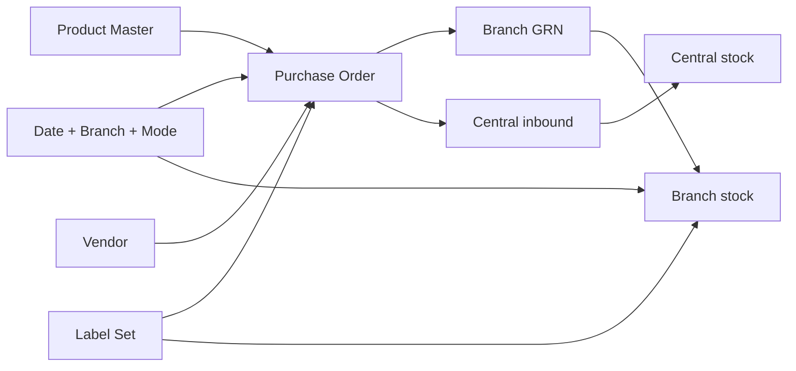
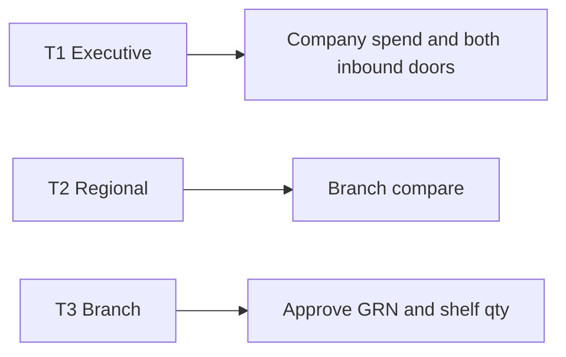
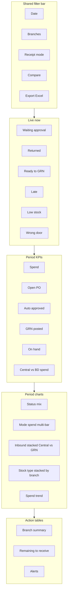
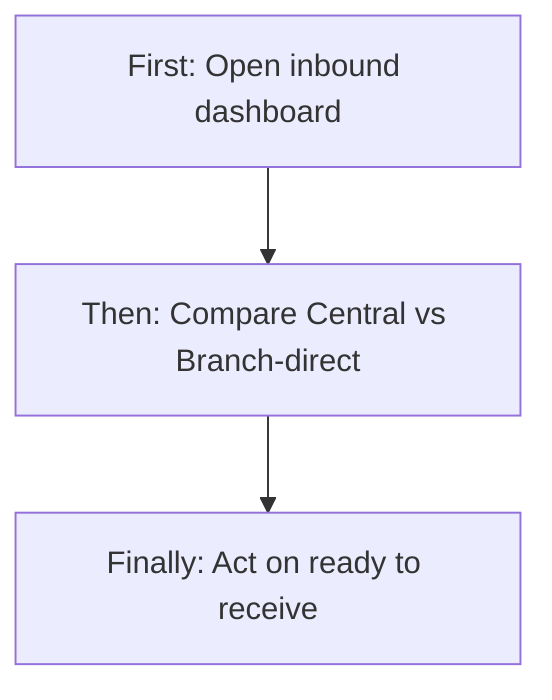
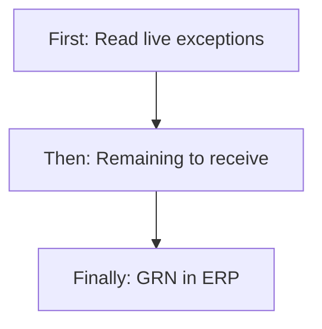
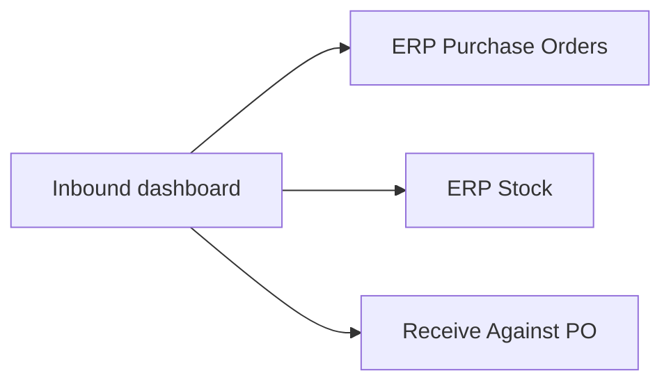

# Procurement + Stock Inbound — Dashboard Update (PRD / BRD)

> **Document type:** PRD + BRD analytics spec (Easy English) — **updated version after Branch-Direct PO + Branch GRN + extra categories**  
> **Hub modules:** Purchase Order Management + Stock Management  
> **Nearby modules combined:** Vendor · Product Master · Central Stock · Branch GRN · Petty Cash (vendor payment) · Purchase Bills  
> **Audience:** T1–T5  
> **Last analyzed:** 2026-08-15  
> **Replaces (for inbound / receive questions):** older 2026-07-28 specs in `procurement-vendor-po-dashboard.md` and `inventory-product-services-dashboard.md` (those files still describe **as-built 28 Jul** dashboards; this file is the **fix spec**)  
> **Code today:** `seravion_connect_dashboard` — `ProcurementRepository`, `ProcurementService`, `InventoryMasterRepository`, `InventoryMasterService`, `company_overview_repo.py`, Excel builders; ERP tables from tenant Flyway V134–V138

---

## Business requirements (Easy English)

**Problem:** The company dashboard still answers “How much did we buy?” and “What is on the branch shelf?” as if **all goods land in Central first**. After the new flow, that is **wrong for Branch-Direct tenants**. A branch can raise a PO, auto-approve or send it to **named people**, then **Receive Against PO** so stock hits **that branch** — never Central. Extra product categories are labels only. The live dashboard does **not** know receipt mode, GRN, Returned/Rejected, or auto-approve.

**Goal:** One **updated** Procurement + Stock inbound page (or tightly linked Overview sections) that answers, per branch:

1. Is this company on **Central buy** or **Branch-direct buy**?  
2. Which POs wait for **approval**, **return fix**, or **receive**?  
3. Did goods arrive via **Central inbound** or **Branch GRN**?  
4. How is live stock split **Assets / Consumable / Resell** (typed or primary-category default — **not** extra categories)?  
5. What should a manager **do today** (approve, receive remaining qty, chase late delivery, do not post the wrong inbound door)?

**Success looks like:**
1. Branch manager sees “3 POs waiting for GRN at my branch” in **under 2 minutes**
2. HO sees **Central vs Branch-direct** spend and receive side by side
3. Store does not add a Branch-Direct PO into Central Stock because the dashboard still says “open PO”
4. Auditor exports Excel with Graphs + GRN lines + PO status including Returned / Rejected

---

## Visualization strategy

### Design rule: Two inbound doors · One Label Set

| Layer | What the user sees | Purpose |
|-------|--------------------|---------|
| **1. Live now** | Pending decide · Returned · Ready to GRN · Late · Wrong-door risk · Low stock | Stop today’s supply mistakes |
| **2. Period KPIs** | Spend ₹ · Open PO · Auto-approved · GRN qty · Central vs branch receive | Health this period |
| **3. Charts** | Status mix (new statuses) · Mode split · Branch spend vs received · Stock type stacked | Compare |
| **4. Action tables** | Approve queue · Remaining GRN · Low/out stock · Petty PO claims | Do next |
| **5. Excel** | Cover · KPIs · Branch compare · Trend · **Graphs** · Charts_Data · PO · GRN · Stock · Alerts · Dictionary | Audit |

**Anti-pattern (today):** Count “open PO” as Pending + Approved + Ordered + Partial, ignore **Returned**, treat **Approved** Central POs the same as **Approved Branch-Direct** (one still needs Mark Ordered + Central receive; the other can GRN now).

---

## 1. Purpose & Business Need

New operational chain (as built in ERP, 2026-08):

```
Product Master (primary category + extra labels)
  → Purchase Order (receipt_mode_at_create = CENTRAL or BRANCH_DIRECT)
       CENTRAL path: Approve → Ordered → Add to Central Stock (PO ref) → allocate / request
       BRANCH_DIRECT path: Draft → Submit (threshold / named people) → Approved
                         → Receive Against PO (branch_po_grn) → branch stock_ledger
  → Petty vendor payment may require Approved+ PO (branch-direct)
  → Bills still match vendor on PO
```

**Outcomes today (dashboard app):** Vendor + PO spend, late PO, pending approval, branch stock buckets, low/out, expiry on **central_stock_entries only**.  
**Outcomes recommended:** Same page also shows **mode**, **GRN remaining**, **Returned/Rejected**, **auto-approve**, **inbound source**, **union of Central + branch stock** for company on-hand.

---

## 2. Combined dashboard (nearby modules)

| Module | Why connected (Easy English) | RBAC Read required | Section on page |
|--------|------------------------------|--------------------|-----------------|
| Purchase Order | Hub for buy + approve + remaining receive | Purchase Order Read | Main + PO tab |
| Stock Management | Live qty + requests/transfers | Stock Read | Stock tab |
| Product Master | SKU, primary category for GRN default | Product Management Read | Product strip (optional) |
| Vendor | Who we buy from | Vendor Read | Vendor tab (keep existing) |
| Branch GRN | Proof goods landed at branch | PO Read (GRN list) | GRN tab / inbound chart |
| Central Stock | Proof goods landed at HO | Stock Read | Central inbound chart |
| Petty Cash | Vendor payment tied to Approved+ PO | Petty Read | Optional tile |
| Purchase Bills | Vendor must match PO | Bills Read | Optional tile |

Hide a section if the user has no Read. Shared filters: date, branches, compare, **receipt mode** (All / Central / Branch-direct).



---

## 3. Comparison Label Set

Use the **same words** on KPI cards, chart axes, legends, and Excel Graphs.

| Label ID | Display label (Easy English) | Meaning | Unit | Used on |
|----------|------------------------------|---------|------|---------|
| L1 | Purchase spend | Sum of PO grand total in period (not deleted) | ₹ | KPI, trend, Excel |
| L2 | Open purchase orders | POs still in flight (see formula — **updated**) | count | KPI, live |
| L3 | Waiting for approval | Status = Pending Approval | count | Live, KPI |
| L4 | Returned for correction | Status = Returned (buyer must fix) | count | Live **new** |
| L5 | Rejected POs | Status = Rejected in period | count | Period **new** |
| L6 | Auto-approved POs | `auto_approved = true` in period | count | Period **new** |
| L7 | Late delivery POs | Delivery date before today and not finished/stopped | count | Live **fix** |
| L8 | Ready to receive (branch GRN) | Branch-direct + Approved/Ordered/Partial + remaining qty > 0 | count | Live **new** |
| L9 | Branch GRN posted | Count of `branch_po_grn` in period | count | Period **new** |
| L10 | Qty received at branch | Sum GRN line qty in period | qty | Chart **new** |
| L11 | Qty received at Central | Sum central entry total qty with PO ref in period | qty | Chart **new** |
| L12 | Central vs Branch-direct spend | Grand total split by `receipt_mode_at_create` | ₹ | Multi-bar **new** |
| L13 | Live stock on hand | Assets+Consumable+Resell (**include Central ledger**) | qty | KPI **fix** |
| L14 | Assets qty | `assets_qty` | qty | Stacked |
| L15 | Consumable qty | `consumable_qty` | qty | Stacked |
| L16 | Resell qty | `resell_qty` | qty | Stacked |
| L17 | Low stock SKUs | Ledger status LOW | count | Live |
| L18 | Out of stock SKUs | Ledger status OUT | count | Live |
| L19 | In transit qty | `in_transit_qty` | qty | Live |
| L20 | Near expiry lots | Expiry in 30 days — **Central entries + GRN batches** | count | Live **fix** |
| L21 | High-value open POs | Open PO grand total > ₹50,000 | count | Keep (petty bill rule) |
| L22 | Active vendors | Existing L1 vendors | count | Keep |
| L23 | Pending stock requests | Stock request inbox (existing stock module) | count | Nearby |

**Compare modes:** Branch vs Branch · Current vs Prior period · Central mode vs Branch-direct mode (same unit only).

**Do not mix** ₹ and qty on one unlabelled axis.

---

## 4. Users & Roles (who sees what)

| Tier | Roles | Scope | Primary questions |
|------|-------|--------|-------------------|
| T1 Executive | CEO, Owner | All branches | Spend by mode? Stuck approve? Stock health? |
| T2 Regional | Ops / multi-branch | Selected branches | Which branch is late / unreceived? |
| T3 Branch | Branch manager, store | Own branches | What do I approve or GRN today? |
| T4 Functional | Buyer, warehouse | Own queues | My pending / my remaining qty |
| T5 Audit | Finance / auditor | Read + Export | GRN vs PO vs bill vs petty |



---

## 5. Access Control (RBAC)

| Widget / section | Module permission | CEO bypass | Branch scope |
|------------------|-------------------|------------|--------------|
| PO KPIs / status / GRN remaining | Purchase Order **Read** | Yes | `user_branches ∩ filter` |
| Excel procurement | Purchase Order **Export** (or CEO) | Yes | Same |
| Stock KPIs / ledger | Stock **Read** | Yes | Same; Central rows if user may see Central |
| Excel inventory | Stock **Export** | Yes | Same |
| Vendor tiles | Vendor **Read** | Yes | Existing vendor filter |
| Petty PO tile | Petty **Read** | Yes | Same branch |
| Named-approver inbox counts | PO **Approve** for “my Received” optional extra | Yes | Optional: only POs where user is recipient |

| Widget | T1 | T2 | T3 | T4 | T5 |
|--------|----|----|----|----|-----|
| Company spend + mode split | ✓ | ✓ | own branches | limited | ✓ |
| Live approve / returned / GRN | ✓ | ✓ | ✓ | own | ✓ |
| Stock buckets | ✓ | ✓ | ✓ | warehouse | ✓ |
| Excel Graphs | ✓ | ✓ | if Export | if Export | ✓ |

---

## 6. Global Filters & Live Update

| Filter | Type | Default | API param | Behavior |
|--------|------|---------|-----------|----------|
| Date range | 7d / 15d / 30d / MTD / QTD / YTD / custom | Last 30d | fromDate, toDate | Period spend, GRN, movements |
| Branch | Multi-select | User branches | branchIds | PO.branch_id; stock_ledger.branch_id; GRN.branch_id |
| Receipt mode | All / CENTRAL / BRANCH_DIRECT | All | receiptMode | `purchase_order.receipt_mode_at_create` |
| Compare to | prior_period / prior_year | prior_period | compareMode | Deltas on period KPIs |
| PO status | Multi | Open set | statuses | Detail tables |
| Refresh | 60s | — | Live strip 30–60s; charts on filter + 60–120s |

Live widgets (today counts) **ignore date** except where noted (Rejected in period). Period widgets use PO date / GRN date / movement date.

---

## 7. Existing vs Recommended — Summary

Evidence: `procurement_repo.py`, `inventory_master_repo.py`, `company_overview_repo.py`. **No** SQL today on `receipt_mode_at_create`, `auto_approved`, `branch_po_grn`, `extra_categories`, `RETURNED`, `REJECTED` (except status mix `GROUP BY status` which will show new names if rows exist).

| Area | Existing today | Recommended | Priority |
|------|----------------|-------------|----------|
| Combined nearby | Two dashboards: Procurement Master + Inventory Master; Overview also has weak PO/stock tiles | One inbound story: PO mode + GRN + Central + shelf | P0 |
| Open PO (L6) | `PENDING_APPROVAL, APPROVED, ORDERED, PARTIALLY_RECEIVED` | Add **DRAFT** only if you want “work in progress”; add **RETURNED** as open (buyer work); keep Rejected/Cancelled/Received **out** | P0 |
| Late PO (L7) | `delivery_date < today` AND status **not** Received/Cancelled — **includes Draft, Rejected, Returned, Pending** | Late = still expected to arrive: **Approved, Ordered, Partially Received** (and optionally Pending). **Exclude** Draft, Returned, Rejected, Cancelled | P0 |
| Pending approve (L8) | `PENDING_APPROVAL` only | Keep; add **Returned** as separate Live chip (not the same as pending) | P0 |
| Company Overview pending PO | `PENDING_APPROVAL` **or** `ORDERED` | Include **Approved** waiting GRN (BD) and **Partial**; do not treat Ordered-only as “pending approve” | P0 |
| Receipt mode | Not used | Filter + L12 split + dual inbound chart | P0 |
| Auto-approved | Not used | L6 card | P1 |
| Branch GRN | Not used | L8–L11, remaining qty table, movement `PO_BRANCH_GRN` | P0 |
| Central inbound block | Not on dashboard | Alert: BD PO still referenced on `central_stock_entries.purchase_order_ref` (should be rare) | P1 |
| Live stock L1 | **`stock_ledger` only** (branch). Central warehouse **excluded** | Union `stock_ledger` + `central_stock_ledger` (or `vw_stock_ledger_all` if present) | P0 |
| Expiry L11/L12 | `central_stock_entries` only | Also GRN / branch batch expiry when stored; until then label card “Central lots only” | P1 |
| Extra categories | Not in dashboard | Show **primary** category on charts; optional “has extra labels” count — **do not** split qty by extras | P2 |
| PO status donut | GROUP BY status (will show new statuses raw) | Friendly labels: Returned, Rejected, Auto-approved overlay | P0 |
| Named recipients | Not counted | Optional “waiting on me” for Approve users | P1 |
| Petty + PO | Ops spend dashboard separate | Tile: vendor-payment petty missing PO / over ₹50k | P2 |
| Excel Graphs | Procurement + Inventory builders exist (charts on sheets) | Add mode split, GRN vs Central, new statuses; Dictionary rows for new labels | P1 |
| Label Set / Live strip | Procurement: pending, late, contracts, low rating. Inventory: low/out/expiry on central lots | Add Returned, Ready to GRN, Mode | P0 |

---

## 8. Visual Representation (dashboard layout)

### Wireframe



### Widget placement map

| Zone | Widgets | Desktop | Mobile | Live/Period |
|------|---------|---------|--------|-------------|
| Top | Filters + Export | full | stacked | — |
| Live strip | L3 L4 L7 L8 L17 + wrong-door | full scroll | scroll | Live |
| KPI | L1 L2 L6 L9 L13 L12 | 6 cards | 2-col | Period |
| Charts | G1–G5 | 60/40 | stacked | Period |
| Tables | Branch + remaining GRN + alerts | full | full | Period |

### Detail tabs (secondary)

| Tab | Content |
|-----|---------|
| Overview | Live + KPIs + 4 charts + 2 tables |
| Purchase Orders | Status list, mode, auto-approved, recipients count |
| Goods inbound | GRN rows vs Central entries |
| Stock | Buckets, low/out, movements including `PO_BRANCH_GRN` |
| Vendors | Keep existing vendor charts |
| Products | Active SKUs; primary category mix (not extras as stock type) |

---

## 9. KPI Stat Cards (Label Set)

| # | Label ID | Title | Formula | Format | Delta | Layer | Tier |
|---|----------|-------|---------|--------|-------|-------|------|
| 1 | L1 | Purchase spend | `SUM(purchase_order.grand_total)` where not deleted + period + branch + mode | ₹ | vs prior | Period | T1–T3 |
| 2 | L2 | Open purchase orders | Count status in **Pending Approval, Returned, Approved, Ordered, Partially Received** | count | vs prior | Period | T1–T3 |
| 3 | L3 | Waiting for approval | `status = PENDING_APPROVAL` | count | — | Live | T1–T4 |
| 4 | L4 | Returned for correction | `status = RETURNED` | count | — | Live | T1–T4 |
| 5 | L6 | Auto-approved POs | `auto_approved = TRUE` + period | count | vs prior | Period | T1–T2 |
| 6 | L7 | Late delivery POs | `delivery_date < CURRENT_DATE` AND status in **Approved, Ordered, Partially Received** | count | — | Live | T1–T3 |
| 7 | L8 | Ready to receive | `receipt_mode_at_create = BRANCH_DIRECT` AND status in Approved/Ordered/Partial AND remaining qty > 0 | count | — | Live | T1–T4 |
| 8 | L9 | Branch GRN posted | Count `branch_po_grn` in period | count | vs prior | Period | T1–T3 |
| 9 | L13 | Live stock on hand | Sum A+C+R on **branch ledger + central ledger** | qty | — | Live | T1–T3 |
| 10 | L21 | High-value open POs | L2 set AND `grand_total > 50000` | count | vs prior | Period | T1–T2 |

**Logic notes (Easy English):**

**Open PO:** A Returned PO is still work. A Rejected PO is finished (failed). A Draft is optional — default **exclude Draft** so “open” means “in the company pipeline”.

**Ready to receive:** Remaining qty = ordered qty minus sum of `branch_po_grn_line.qty_received_now` (and for Central-mode POs use central entries by PO ref instead — show on a **different** chip “Ready for Central inbound”).

**Wrong door (alert, not KPI):** Central stock entry whose `purchase_order_ref` matches a PO with `receipt_mode_at_create = BRANCH_DIRECT`. Should be **zero** when block setting is on.

**Stock type vs category:** L14–L16 are **qty buckets**. Product **primary category** is a different chart. Extra categories **must not** be summed into Assets.

```
Card: Ready to receive (branch GRN)
  Formula: count distinct PO where mode = BRANCH_DIRECT
           and status in (APPROVED, ORDERED, PARTIALLY_RECEIVED)
           and (sum PO lines qty - sum GRN lines qty) > 0
  Tables: purchase_order, purchase_order_item, branch_po_grn, branch_po_grn_line
  Filters: branchIds, receiptMode
  Tips: Click opens remaining-qty action table
```

---

## 10. Charts & Visualizations

### Graph 1 — PO status mix (donut)

- **Notice:** How many are Returned vs Pending vs already Approved waiting goods.  
- **Type:** Donut (≤9 slices; group tiny as Other).  
- **Legend:** Draft, Pending approval, Returned, Rejected, Approved, Ordered, Partially received, Received, Cancelled.  
- **Existing:** `GROUP BY po.status` — keep, but **map labels** and do not hide Returned/Rejected.  
- **Empty:** “No purchase orders in this filter.”

### Graph 2 — Spend by receipt mode by branch (clustered multi-bar)

- **Notice:** Which branches buy Central vs Branch-direct.  
- **X:** Branch name · **Y:** Purchase spend ₹ · **Series:** Central · Branch-direct (`receipt_mode_at_create`).  
- **Existing:** Branch spend **without** mode — **replace/extend**.  
- **Empty:** “No spend in this period.”

### Graph 3 — Inbound qty Central vs Branch GRN (stacked bar)

- **Notice:** Where goods actually landed.  
- **X:** Branch (GRN) + one bar **Central** · **Y:** Qty received · **Series:** Central inbound · Branch GRN.  
- **Formulas:** Central = `central_stock_entries.total_qty` in period; Branch = `branch_po_grn_line.qty_received_now` (or assets+consumable+resell).  
- **Existing:** **Missing.**  
- **Empty:** “No inbound in this period.”

### Graph 4 — Stock type by branch (stacked bar)

- **Notice:** Assets vs Consumable vs Resell on the shelf.  
- **X:** Branch (+ Central warehouse row) · **Y:** Qty · **Series:** L14 L15 L16.  
- **Existing:** Inventory master already has type split — **add Central row**.  
- **Empty:** “No stock rows.”

### Graph 5 — Purchase spend trend (line)

- **Notice:** This period vs prior.  
- **X:** Week or month · **Y:** L1 ₹ · **Series:** Current · Prior (compare).  
- **Existing:** `monthly_purchase_value` — keep; optional second line for GRN count.

### Graph 6 (optional) — Primary category on hand (horizontal bar)

- **Notice:** Chemicals vs machines on shelf.  
- **Series:** Primary `inventory_products.category` only.  
- **Note in chart footer:** Extra categories are not in this chart.

ASCII (Graph 2):

```
Spend ₹
 |  #### Central
 |  :::: Branch-direct
 |  ####  ::::
 |  ####  ::::
 +----------------
   Andheri  Pune
```

---

## 11. Action tables

### Table 1 — Branch summary

| Column | Source |
|--------|--------|
| Branch | branches |
| Spend ₹ | PO grand total |
| Open PO | L2 formula |
| Waiting approval | L3 |
| Returned | L4 |
| Ready to GRN | L8 |
| Late | L7 |
| On-hand qty | L13 scoped |
| Low SKUs | L17 |

Click branch → apply branch filter.

### Table 2 — Remaining to receive (alerts)

| Column | Source |
|--------|--------|
| PO number | purchase_order |
| Mode | receipt_mode_at_create |
| Status | status |
| Vendor / Branch | joins |
| Ordered qty | sum lines |
| Received qty | GRN or central entries |
| Remaining | ordered − received |
| Next action | “Decide” / “Receive Against PO” / “Add to Central” |

Deep-link: ERP `/purchase-order-detail` or `/purchase-orders/receive/:poId` or `/add-to-central-stock`.

### Table 3 — Alerts queue

| Alert | When |
|-------|------|
| Waiting named approve | Pending + has recipient users |
| Returned to buyer | Returned |
| Late inbound | L7 |
| Remaining GRN | L8 |
| Wrong-door Central entry | BD PO on central entry |
| Low / out stock | ledger status |
| Near expiry | lots (label if Central-only) |
| Petty vendor payment without PO | if petty Read (optional) |

---

## 12. How it works (user journeys)

### 12.1 CEO — “Are we Central or branch buying?”

**First:** Open dashboard, leave mode = All.  
**Then:** Read L12 chart (spend by mode) and Graph 3 (where goods landed).  
**Finally:** If Branch-direct spend is high but GRN qty is low, chase Ready to GRN.



### 12.2 Branch manager — morning strip

**First:** Live strip: Waiting approval, Returned, Ready to GRN, Late, Low stock.  
**Then:** Open Remaining to receive; Receive Against PO in ERP.  
**Finally:** On-hand L13 at branch should rise after GRN (not Central).



### 12.3 Store — do not use the wrong door

**First:** Filter mode = Branch-direct.  
**Then:** If a row says Ready to GRN, **do not** Add to Central.  
**Finally:** Wrong-door alert stays at zero.

---

## 13. Excel export (Multiple Graphical Interface)

**Existing:** `build_procurement_excel`, `build_inventory_master_excel`, routes `/procurement/.../export`, `/inventory-master/export/excel`.

**Recommended:** Prefer **one workbook** `Seravion_ProcurementStockInbound_<date>_...xlsx` **or** keep two files but add the new sheets to each.

| Sheet | Content |
|-------|---------|
| Cover | Period, branches, receipt mode filter, IST, permissions |
| Summary_KPIs | L1–L23 with prev and % |
| Branch_Comparison | Table 1 matrix + company total |
| Trend | Weekly L1 spend + L9 GRN count |
| **Graphs** | 4–6 charts: clustered mode spend, stacked inbound, line spend, donut status, stacked stock type |
| Charts_Data | Excel Tables feeding Graphs |
| PO_Detail | One row per PO: mode, auto_approved, status, vendor, totals, remaining |
| GRN_Detail | One row per GRN line: split assets/consumable/resell, serial flag |
| Central_Inbound | CSTK entries + PO ref + mode of that PO |
| Stock_OnHand | Branch + Central buckets |
| Alerts | Table 3 |
| Dictionary | This Label Set + formulas + “extra categories not used in qty” |

**Graphs sheet rules:** axis titles from Label Set, legend on, **major gridlines ON**, mini-table or link under each chart.

**Existing vs recommended Excel:** Today Graphs exist but series do not include mode/GRN. Add series; do not invent tables that are not in ERP.

---

## 14. Data, calculations, APIs

### Tables (do not invent)

| Table | Use |
|-------|-----|
| `purchase_order` | status, grand_total, delivery_date, branch_id, vendor_id, `receipt_mode_at_create`, `auto_approved`, po_date |
| `purchase_order_item` | ordered qty |
| `purchase_order_recipient_users` | optional “waiting on me” |
| `branch_po_grn` / `branch_po_grn_line` | GRN header/lines, qty split |
| `central_stock_entries` | Central inbound, expiry, `purchase_order_ref` |
| `stock_ledger` | Branch on-hand buckets |
| `central_stock_ledger` | Central on-hand (dashboard **omits** today) |
| `stock_movement_logs` | Period movement; `reference_type` e.g. `PO_BRANCH_GRN` |
| `inventory_products` | primary `category`; `extra_categories` metadata only |
| `vendors` | existing vendor KPIs |
| `tenant_procurement_settings` | default mode / threshold (show as Cover note, not a KPI) |

**Timezone:** Display IST; store timestamps as in ERP.

**NULL:** Treat missing `receipt_mode_at_create` as **CENTRAL** (column default).

### Proposed dashboard APIs (gaps — not live yet)

Existing:

| Method | Path | Purpose |
|--------|------|---------|
| GET | `/procurement/overview` (and aliases) | Current PO+vendor overview |
| GET | `/inventory-master/overview` | Current stock overview |
| GET | `.../export/excel` | Current workbooks |

Recommended (same service, extended payload **or** new):

| Method | Path | Purpose |
|--------|------|---------|
| GET | `/procurement/overview` | Add live L4/L8, kpis L6/L9, charts mode + inbound |
| GET | `/inventory-master/overview` | Include central ledger in L13; movement type GRN |
| GET | `/procurement-stock-inbound/overview` | Optional single payload for this combined page |
| GET | `export.xlsx?includeCharts=true` | Extended Graphs |

Mark as **gap** until implemented. Do not document fake URLs as live.

### Proposed remaining-qty logic

```sql
-- GAP: not in dashboard repo today
SELECT po.id,
       po.receipt_mode_at_create,
       po.status,
       SUM(poi.quantity) AS ordered_qty,
       COALESCE((
         SELECT SUM(l.qty_received_now)
         FROM branch_po_grn g
         JOIN branch_po_grn_line l ON l.grn_id = g.id
         WHERE g.purchase_order_id = po.id
       ), 0) AS grn_qty
FROM purchase_order po
JOIN purchase_order_item poi ON poi.purchase_order_id = po.id
WHERE po.is_deleted = FALSE
GROUP BY po.id;
```

Central-mode received qty stays the existing CSTK sum by `purchase_order_ref` (string) — keep that path **only** when mode = CENTRAL.

---

## 15. Cross-module & company overview

| Place | Fix |
|-------|-----|
| Company Overview `L15_pending_purchase_orders` | Today: Pending **or Ordered**. Update: Pending + Returned (approve/fix) **and** a separate “unreceived Approved/Partial” count |
| Company Overview low stock | Still `stock_ledger` LOW — add Central low if needed |
| Ops / Petty dashboard | Link vendor-payment claims to PO Approved+ rule |
| Product analytics | Category charts = **primary** only |



---

## 16. Rules, gaps, limitations

1. Extra categories **never** change dashboard qty split.  
2. Auto-approved POs are still **Approved** — count them in L6 and in status Approved.  
3. CEO may skip recipients — “waiting on me” can be empty while Pending exists.  
4. GRN tables missing on old QA DBs until V135/V138 — queries must tolerate missing table (same pattern as current expiry try/except).  
5. `purchase_order_ref` is free text on Central entries — match carefully.  
6. Existing Excel/OpenPO tests assert old L6 membership — tests must change with formulas.

---

## 17. Existing functionality summary (dashboard app **as of this review**)

**Works today:**
- Procurement Overview: vendors, spend, open PO (old set), late (old rule), pending approval, status donut, branch spend, top vendor, monthly value, Excel
- Inventory Master: branch live buckets, low/out, in-transit/reserved, active products, **central-entry** expiry, movements, services, Excel
- Company Overview: low stock, pending PO (Pending+Ordered)

**Does not work / misleading after new ERP flow:**
- No Central vs Branch-direct
- No GRN remaining / GRN posted
- Open/late formulas ignore Returned/Rejected correctly or incorrectly (see §7)
- On-hand ignores Central warehouse ledger
- Expiry ignores branch GRN lots
- Extra categories unused (correct for qty; document it)

---

## 18. Acceptance criteria (Easy English)

- [ ] Live strip shows Waiting approval, Returned, Ready to GRN, Late (new late rule), Low stock
- [ ] Open PO count includes Returned; excludes Rejected, Cancelled, Received
- [ ] Late PO does not count Rejected or Draft
- [ ] Filter Receipt mode changes spend and inbound charts
- [ ] Graph: Central vs Branch-direct spend by branch with labelled axes and legend
- [ ] Graph: inbound qty Central vs GRN
- [ ] Remaining-to-receive table matches ERP remaining qty
- [ ] Live stock includes Central warehouse when user can see Central
- [ ] Charts and Excel use the same Label Set words
- [ ] Excel Graphs sheet has ≥4 charts, gridlines on, Dictionary explains extra categories
- [ ] Section hides without module Read
- [ ] Branch filter never shows other branches’ POs/GRN
- [ ] Wrong-door alert is zero when block Central inbound is on (or lists violations)
- [ ] No invented tables; GRN SQL skipped gracefully if table missing

---

## 19. Reference — current dashboard APIs & UI

### 19.1 APIs (live)

| Method | Path | Purpose | Used by |
|--------|------|---------|---------|
| GET | `/procurement/overview` (+ aliases) | Vendor+PO overview | Procurement dashboard |
| GET | `/procurement/branch-spend` | Branch spend chart | Same |
| GET | `/procurement/vendor-performance` | Vendor table | Same |
| GET | `/inventory-master/overview` | Stock+product overview | Inventory dashboard |
| GET | `/inventory-master/near-expiry` | Central lots | Same |
| GET | `/inventory-master/branch-matrix` | Branch stock matrix | Same |
| GET | `/inventory-master/services` | Service catalog | Same |
| GET | export excel routes in `router.py` | Workbooks | Export button |

### 19.2 Code files to change (implementation later)

| File | Why |
|------|-----|
| `app/repositories/procurement_repo.py` | Open/late/status; new GRN and mode SQL |
| `app/services/procurement_service.py` | Overview payload keys |
| `app/repositories/inventory_master_repo.py` | Union central ledger; GRN movements |
| `app/repositories/company_overview_repo.py` | Pending PO definition |
| `app/utils/procurement_excel_builder.py` | New Graph series + PO_Detail columns |
| `app/utils/inventory_master_excel_builder.py` | Central row + GRN |
| `tests/test_procurement_dashboard.py` | L6/L7 assertions |

### 19.3 Related product docs

- `docs/modules/purchase-order-management.md`  
- `docs/modules/stock-management.md`  
- `docs/modules/product-management.md`  
- Older analytics (as-built Jul 2026): `docs/modules/analytics/procurement-vendor-po-dashboard.md`, `docs/modules/analytics/inventory-product-services-dashboard.md`
