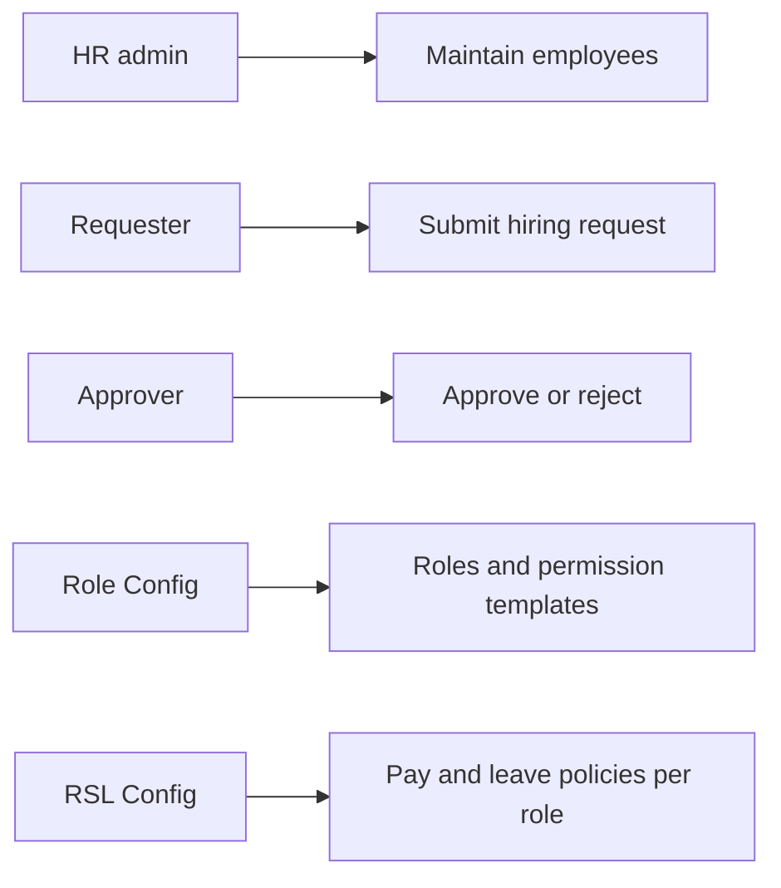
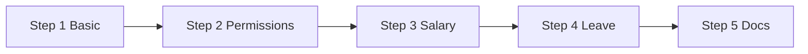
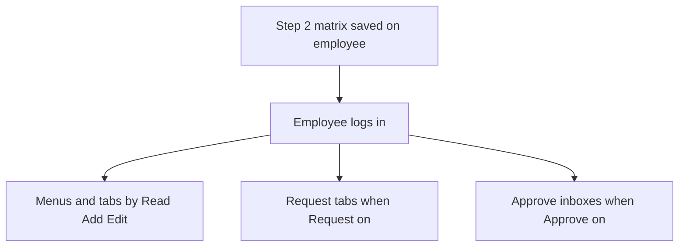
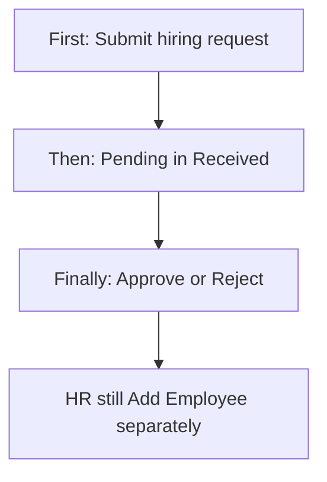
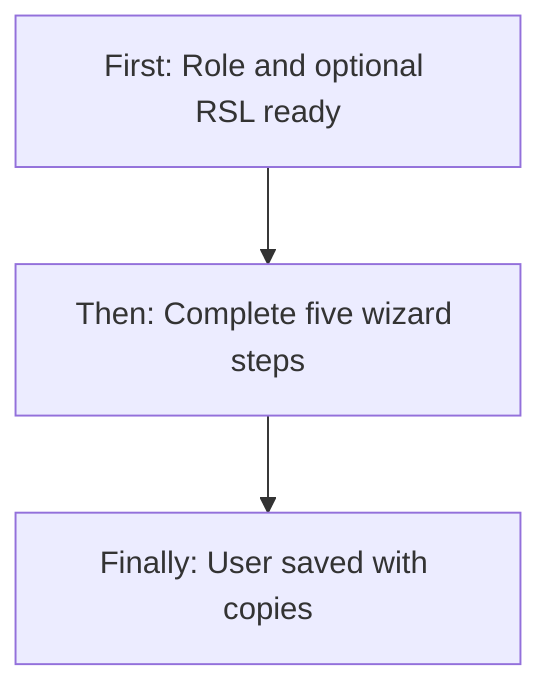
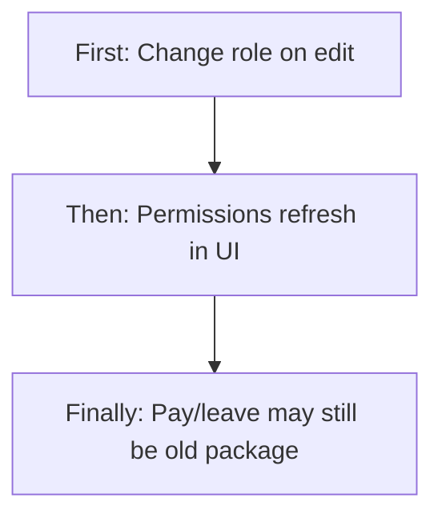
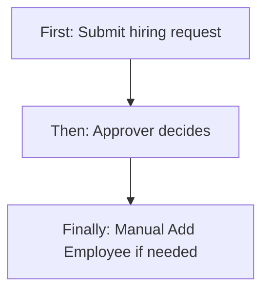
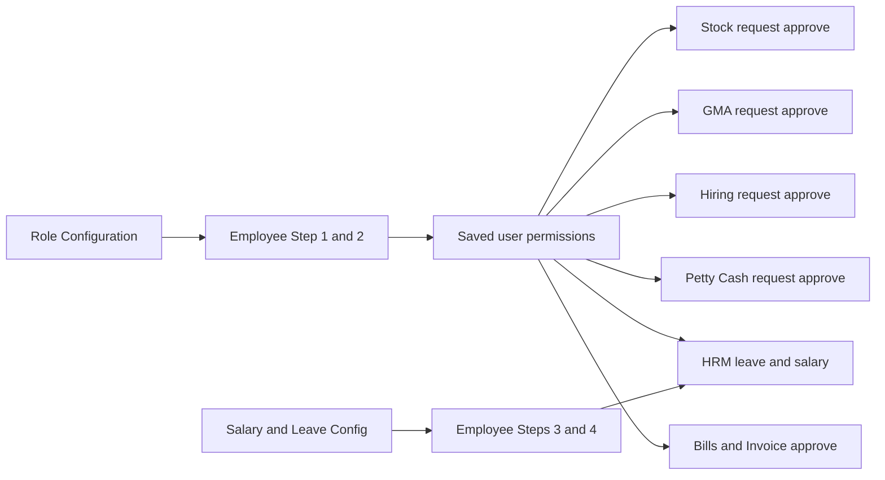
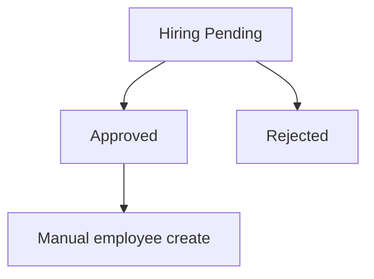

# Employee Management — Product & Business Documentation

## 1. Purpose & Business Need

Companies need a single place to **hire, create, and maintain staff who log into Seravion Connect** — identity, branch assignment, job role, access rights, pay structure, leave entitlements, and documents — and a light **hiring request** path so managers can ask for headcount before someone is onboarded as a user.

**Employee Management** (sidebar: **User Management → Employee Management**) is that master. Internally each employee is a **company user** record: login credentials, personal and employment data, a **role** from Role Configuration, optional **permission matrix**, copied **salary** and **leave** packages, documents, and Active/Inactive status.

**Outcomes today:**
- Create / view / edit / soft-deactivate employees (users) with a multi-step wizard
- Assign Role Configuration roles and (on create) prefill permissions and salary/leave from templates
- Submit **hiring requests**, review them in **Received Requests**, approve or reject
- Filter and search the employee list; download documents when Export is granted
- Feed HRM leave balances and payroll from the stored salary/leave copies on the user

**What this module is not:** Automatic convert of an approved hiring request into an employee; server-side sync of Role Configuration permissions or Salary & Leave (RSL) policy when an employee’s role changes on edit; employee transfer request/approve; salary-change request/approve (monthly payroll lives under HRM).

**Related docs:** [`rbac-role-configuration.md`](./rbac-role-configuration.md), [`salary-leave-configuration.md`](./salary-leave-configuration.md).

---

## 2. Users & Roles (who uses this and why)

### 2.1 Company CEO / Owner

Full access to employee CRUD, hiring submit/approve, and document export without granular grants.

### 2.2 HR / user administrators

Staff with **Employee User Management** permissions maintain the employee master, permission matrix, salary/leave copies, and documents.

### 2.3 Hiring requesters

Staff with **Request** (or, in the UI, also **Add**) submit hiring requests and track **My Hiring Request**.

### 2.4 Hiring approvers

Staff with **Approve** open **Received Requests** and approve or reject pending hiring.

### 2.5 Setup owners (adjacent modules)

- **Role Configuration** owners define the roles and permission templates employees pick
- **Salary & Leave Configuration (RSL)** owners define role compensation policies used as **defaults on Add**

---

## 3. Access Control (RBAC)

### 3.1 How access works

Platform module key: **Employee User Management** (not a separate “Employee Management” key). Login permissions on this module drive menus and actions unless the user is CEO.

| Permission | Allows |
|------------|--------|
| **Read** | Employee list, view wizard, department/designation lookups (also shareable with Branch Management Read on some lookups) |
| **Add** | **+ Add Employee**; UI also treats Add as enough for **Request** tab visibility via request fallback |
| **Edit** | Edit employee from list |
| **Delete** | Soft-deactivate (mark inactive via delete action) |
| **Export** | Download employee documents |
| **Request** | **My Hiring Request** tab, **+ New Hiring Request** |
| **Approve** | **Received Requests** tab, approve / reject |

Sidebar: **User Management → Employee Management** (`/user-management`) with Employee User Management **Read**. **HRM** is listed under the same group and also gated by this module on the route map (leave decisions additionally use HRM Management inside HRM screens).

Role Configuration and Salary & Leave Configuration are **separate** modules (`ROLE_MANAGEMENT`, `RSL_MANAGEMENT`) under Setup.

### 3.2 Role × action matrix

| Role | View list | View detail | Add | Edit | Inactive / Delete | Submit request | Receive / act | Approve | Reject |
|------|-----------|-------------|-----|------|-------------------|----------------|---------------|---------|--------|
| Company CEO | Yes | Yes | Yes | Yes | Yes (soft) | Yes | Yes | Yes | Yes |
| Staff with Employee Read | Yes | Yes | No | No | No | No* | No | No | No |
| Staff with Employee Add | Yes | Yes | Yes | No | No | Yes (UI Request fallback) | No | No | No |
| Staff with Employee Edit | Yes | Yes | No | Yes | Via status on edit | No* | No | No | No |
| Staff with Employee Delete | Yes | Yes | No | No | Yes (delete → inactive flag) | No | No | No | No |
| Staff with Employee Request | Yes | Yes | No | No | No | Yes | Own “My” list | No | No |
| Staff with Employee Approve | Yes | Yes | No | No | No | No | Yes Received | Yes | Yes |
| Staff without Employee User Management | No menu / blocked | No | No | No | No | No | No | No | No |

\*Unless they also hold Request/Add/Approve as granted.

**Record-level (hiring):** Detail of a hiring request is limited to the requester or a listed recipient. Approve API checks the **Approve** permission (or CEO) but **does not** re-check that the verifier is on the recipient list.

---

## 4. Capabilities & Features

### 4A. Employee (user) master — five-step wizard (full field catalog)

Same shell for **Add**, **Edit**, and **View**. Steps must validate before **Next**; **Save** re-validates all five. View mode blocks all changes (inputs non-interactive; Save hidden). Add mode can keep a local draft while filling the form.

#### 4A.1 Step 1 — Basic information

| Field | Required | Type / options | Dynamic / dependent behavior |
|-------|----------|----------------|------------------------------|
| Employee ID | Yes | Text | On edit: still editable in UI; **server ignores change** (immutable after create) |
| First Name | Yes (min 2) | Text | — |
| Last Name | Yes (min 2) | Text | — |
| Email | Yes (valid email) | Text | Becomes login username on create; unique |
| Contact Number | Yes (10 digits) | Phone | Digits normalized as user types |
| Alternate Number | No | Phone | If filled, must be 10 digits |
| Password | Yes on Add; optional on Edit | Password | Rules: 8+, 1 upper, 1 number, 1 special. On Edit, auto-fills Confirm when Password is typed |
| Confirm Password | Same as Password | Password | Must match Password when password change is in play |
| Department | Yes | Text | — |
| Designation | Yes | Text | — |
| Role | Yes | Dropdown from Role Configuration (active roles) | **Add:** loads Step 2 matrix + Steps 3–4 RSL defaults. **Edit:** reloads Step 2 matrix only |
| Branch | Yes (one or more) | Multi-select | From current user’s / company branches |
| Reporting Manager | Yes | User dropdown | — |
| Employment Type | Yes | Permanent / Contract / Intern | Values normalized to standard enums on save |
| Date of Joining | Yes | Date | Must parse as a valid date |
| Status | Yes | Active / Inactive | Drives active flag on save |
| Current Address Line 1 | Yes (min 5) | Text | Changing current address while “same as current” is on **mirrors** into permanent |
| Current Address Line 2 | No | Text | Same mirror rule |
| Current Country | Yes | Country list | Clearing country **resets** current state and city |
| Current State | Yes | States for country | Clearing state **resets** city |
| Current City | Yes | Cities for state | Dependent on state |
| Current Pincode | Yes (6 digits) | Text | Mirrored when same-as-current |
| Same as Current (permanent) | Toggle | Checkbox | **On:** copies all current address fields into permanent and **locks** permanent fields. **Off:** clears permanent (country defaults to India) and unlocks |
| Permanent Address Line 1–2, Country, State, City, Pincode | Required if toggle Off | Same pattern as current | Disabled when Same as Current is On; country→state→city cascade same as current |

#### 4A.2 Step 2 — Module permissions (deep)

| Control | Behavior |
|---------|----------|
| **Is Application User** | Toggle. **On:** entire module permission matrix is **hidden**; permissions are not required to continue. Saved as application-user flag (mobile/restricted profile). **Off:** matrix shown and editable |
| Module search | Filters matrix rows by module label (keyboard shortcut focuses search) |
| Matrix columns | One column per platform action from the action catalog (typically Read, Add, Edit, Delete, Export, Request, Approve, and any others returned) |
| Matrix rows | One row per module already present on the employee’s permission list (prefilled from Role Configuration when role is chosen) |
| Empty matrix message | “Select a Role in Step 1…” until a role loads permissions |

**Toggle / dependency rules (editable matrix):**

| User action | What the form does |
|-------------|-------------------|
| Turn **On** a dependent action (Add, Edit, Delete, Export, Request, Approve, …) | Auto-turns **On** base Read/View for that module |
| Turn **Off** Read/View | Auto-turns **Off** all dependent actions on that module |
| Turn **Off** the last dependent action | Also turns **Off** Read/View |
| Configure / Configure Access / Download | Treated as special — not forced off/on by the dependent-action cascade the same way |
| Request or Approve on a module **not** in the allow-list | Switch is **disabled** (cannot turn on). Allow-list labels: Employee Management, Employee User Management, Stock Management, GMA Management, GMA Sheet, HRM, Human Resource Management, Petty Cash |
| Turn **On Request** | Opens **Request Receivers** row: multi-select of roles that should receive that module’s requests (**required** before Next if Request is on) |
| Turn **On Approve** (without Request) | Shows info text that users with Approve can approve/reject incoming requests (no separate receiver picker for Approve alone) |
| Manual edit of any toggle after role prefill | Marks permissions as “touched” so later role-driven auto-reload on Add won’t overwrite the user’s edits |

**Add vs Edit vs View for the matrix:**

| Mode | Editable? | Prefill source |
|------|-----------|----------------|
| Add | Yes (unless Application User) | Role Configuration matrix for selected role (skipped if user already touched permissions) |
| Edit | Yes | Load from **saved user permissions**; changing Role reloads Role Configuration matrix into the form |
| View | No | Saved user permissions only |

**What is saved and what login uses:** The wizard sends the matrix as **user permissions**. After login, menus and APIs use those **user** rows — **not** a live read of Role Configuration. Changing a role template later does **not** update existing employees until someone edits and saves them (except Role Configuration delete-with-reassignment, which can push permissions).

#### 4A.3 Step 3 — Salary details

| Section | Field | Required | Dynamic turn on/off |
|---------|-------|----------|---------------------|
| Salary Details | Salary Type | Yes | CTC / Fixed / Hourly |
| | Basic Salary (+ currency) | Yes | Currency select (INR/USD/EUR) beside amount |
| | HRA, Other Allowance, Incentive, Deductions (+ currency each) | No | — |
| | PF Applicable | Toggle | Stored as yes/no |
| | ESI Applicable | Toggle | — |
| | TDS Applicable | Toggle | — |
| Bank Details | Bank Name, Account Number, IFSC | Yes | **Not** prefilled from RSL even when role compensation loads |
| | Salary Effective From / To | Yes | Pair of dates |
| Incentive Configuration | Holiday Work Incentive Applicable | Toggle | **Off:** amount and type hidden. **On:** shows Holiday Work Incentive Amount (+ currency) and Type (Fixed / Per Day / Per Hour) |
| Overtime Settings | Overtime Applicable | Toggle | **Off:** all OT fields hidden. **On:** shows OT Type, OT Shift Type, incentives, max hours |
| | Overtime Type | Yes if OT on | Per Hour / Per Day |
| | Overtime Shift Type | Yes if OT on | Night / Normal / Custom |
| | Custom Shift From / To | Yes if Shift Type = Custom | **Only visible** when Custom; time fields |
| | Overtime Shift Incentive Amount, Per Hour Incentive Pay (+ currency) | No | Visible when OT on |
| | Maximum Overtime Hours Per Month | No | Visible when OT on |

**RSL prefill (Add + role change only):** Maps active role compensation salary + incentive blocks into the fields above (including OT/holiday toggles so dependent fields appear already on). Bank fields stay for HR to enter.

#### 4A.4 Step 4 — Leave details

| Field | Required | Dynamic turn on/off |
|-------|----------|---------------------|
| Casual Leave (CL), Sick Leave (SL), Paid Leave (PL) | No | Number of days |
| Annual Leave Allocation | Yes | Days |
| Carry Forward Allowed | Toggle | **On:** shows **Max Carry Forward Day** (required). **Off:** max field hidden |
| Leave Approval Authority | Yes | Role dropdown (same Role Configuration roles) — stored as leave-approval role on the employee |
| Leave Reset Cycle | Yes | Yearly / Monthly / Custom |
| From Date / To Date | Yes if Custom | **Only visible** when Leave Reset Cycle = Custom |

**RSL prefill (Add):** Quotas, carry-forward, leave approval role id, reset cycle and custom dates from active role compensation leave block.

#### 4A.5 Step 5 — Documents & additional professional data

| Section | Field | Required | Notes |
|---------|-------|----------|-------|
| Identity & Compliance | Aadhar Number | No | If filled: 12 digits |
| | PAN Number | No | If filled: standard PAN format |
| | UAN Number | No | If filled: 12 digits |
| | Employee ID Card Number | No | — |
| Upload Documents | Aadhar, PAN, Address Proof | No | PDF/PNG/JPG; size limits (identity ~5 MB) |
| | Educational Certificates, Experience Letter, Offer Letter, Appointment Letter, Other | No | Larger size allowance (~10 MB) |
| | Employee Photo | No | Image only (~2 MB) |
| Additional Professional Data | Grade / Level | No | — |
| | Weekly Off | No | Number |
| | Target Amount | No | Number |
| | Commissions Percentage | No | Number |
| | Shift Type | No | Monthly / Quarterly / Yearly — **UI present; save payload currently does not send shift type** |

On edit, document handling supports keep / add / replace / delete patterns when updating existing files.

### 4B. Role Configuration cross-compatibility

| Moment | What happens |
|--------|----------------|
| Pick role on **Add** | Loads that role’s permission matrix into Step 2 (unless permissions already touched); loads **active** Salary & Leave config for that role into Steps 3–4 when available |
| Pick / change role on **Edit** | Reloads **permissions** from Role Configuration; **does not** refresh salary/leave from RSL |
| Save employee | Stores role id plus whatever **user permission rows** and salary/leave payloads the client sends |
| Login / runtime access | Uses the employee’s **user permissions**, not the live Role Configuration matrix |
| Role deleted with reassignment | Role Configuration delete path can copy role permissions onto affected users — special case, not normal edit |

**Compatibility rule:** Role on the employee is a **label + create-time template**. After save, access and pay/leave copies can **drift** from Role Configuration and RSL until someone edits the employee again and sends new data.

### 4C. Salary & Leave (RSL) cross-compatibility

| Moment | What happens |
|--------|----------------|
| Active RSL config exists for role | On **Add**, choosing the role prefills salary type, pay components, OT/holiday flags (and reveals dependent fields), leave quotas, reset cycle, leave approval role. Bank fields are **not** applied from RSL |
| No active RSL / cannot load | Prefill silently skipped; HR fills Steps 3–4 manually |
| Save | Writes **copies** onto the employee’s salary and leave detail records — does **not** update the RSL master |
| Edit role change | Salary/leave stay as previously stored unless manually changed |
| HRM leave / salary month | Operational leave and payroll read **employee** leave/salary data, not live RSL |

### 4D. Hiring request & approve

Managers submit a hiring ask (department, designation, proposed role, branch, type, positions, optional salary, joining date, reason, reviewers). Approvers see Received Requests and Approve/Reject. **Approved does not create an employee** — HR still uses **Add Employee** separately. Status **Converted** exists in the catalog but is unused.

### 4E. Soft deactivate / status

Delete from the list marks the user inactive (`isActive` false). Status Active/Inactive can also be set on edit; reactivating Active is subject to subscription user limits.

### 4F. Lookups used elsewhere

Employee dropdowns (by branch/role/app-user), departments, designations, and “managers” dropdown (actually **roles** that receive Request for this module — naming mismatch) support hiring and other screens.

### 4G. How the permission matrix drives other modules (permission-based cross-compatibility)

What HR toggles in **Step 2** becomes that employee’s login authorities. Each module below checks those authorities (or CEO bypass) for menus, tabs, and request/approve actions.

| Module (business name) | Typical matrix actions that matter | How it shows up after the employee logs in |
|------------------------|------------------------------------|---------------------------------------------|
| **Employee User Management** (this module) | Read / Add / Edit / Delete / Export / **Request** / **Approve** | List & wizard; My Hiring vs Received Hiring; document download |
| **Stock Management** | Read / Add / Edit / **Request** / **Approve** (+ others) | Stock request submit vs Received / approve / transfer decision paths |
| **GMA Sheet** | Read / Add / Edit / **Request** / **Approve** | Raise approval request vs received/approve GMA |
| **HRM** | Read / Edit / **Approve** (and related) | Leave decision and some salary month actions; UI may also accept Employee Approve in places |
| **Petty Cash** | Read / Add / **Request** / **Approve** / Export | My petty-cash requests vs All/approve queue; pay after approve |
| **Bills** | **Approve** (among others) | Bill approval actions |
| **Invoice** | **Approve** (among others) | Invoice approval actions |
| **Role Configuration** | Read / Add / Edit / Delete | Setup → roles (separate from employee Step 2 editing) |
| **RSL (Salary & Leave Configuration)** | Read / Add / Edit | Setup → role pay/leave policies (used to prefill this wizard on Add) |
| **Branch, Product, Vendor, PO, Leads, …** | Mostly Read / Add / Edit / Delete / Export | Standard CRUD menus; Request/Approve switches for these modules are **disabled** in Step 2 even if shown |

**Request receivers (Step 2):** When Request is on for an allow-listed module, HR must pick **receiver roles**. Those roles are intended to route “who gets the request inbox.” Runtime modules (Stock, GMA, Hiring, Petty Cash, HRM) then combine **who has Request**, **who has Approve**, and saved receiver metadata. Gaps: Approve-receiver persistence can fail on save (action name mismatch), and some modules do not strictly enforce recipient membership on approve.

---

## 5. CRUD Operations

### 5.1 Create (Add)

**Who:** Employee User Management **Add** (or CEO).

**First:** **+ Add Employee** → wizard Step 1 (identity, role, branches, employment).  
**Then:** Step 2 permissions (prefilled from role on role pick); Steps 3–4 salary/leave (prefilled from active RSL on Add); Step 5 documents and extras.  
**Finally:** Save creates the user, stores nested salary/leave/permissions/docs, enforces unique employee id / email / username, subscription limits, and password rules.

### 5.2 Read — List

**Who:** **Read**.

Columns: EMP ID, Employee Name, Email, Contact, Designation, Department, Role, Branch, Reporting, Status, Created Date. Server search; filters for status, branch, department, designation, role, created date range; pagination. Empty state when no matches.

Row actions: View, Edit (Edit permission), Delete/inactive (Delete permission).

### 5.3 Read — Detail / Get details

**Who:** **Read**.

Opening a record loads full user by id into the wizard (view or edit mode): basic, permissions, salary details, leave details, documents, additional data. Live list navigation commonly opens the add URL with state (`mode` / `rowData`) rather than only the dedicated view/edit URL patterns.

### 5.4 Update (Edit)

**Who:** **Edit**.

Employee id is **immutable on the server** (not accepted on update). Password changes only if both password fields are sent. Role, branches, status, permissions, salary, leave, documents (keep/add/replace/delete), and personal fields can be updated. Changing role updates the stored role and replaces user permissions with what the client sends — **without** auto-copy from Role Configuration or RSL on the server.

### 5.5 Inactive / Delete

**Who:** **Delete** for list delete; **Edit** can set status Inactive/Active.

| Action | Behavior |
|--------|----------|
| List delete | Soft: `isActive = false` only — does **not** set status to Deleted |
| Status Inactive on edit | Sets status and aligns active flag |
| Reactivate | Status Active on edit (subscription checks) |

There is no hard remove of the employee record from this flow. A Deleted status value exists in the status catalog but is **not** written by the delete path.

---

## 6. Request & Approval Flows

Employee Management’s **only built-in request/approve** is **Hiring Request**. Leave approve/reject lives under **HRM**. There is **no** employee transfer request and **no** salary-structure change request in this module.

### 6.1 Submit request (Hiring)

**Who:** CEO or Employee User Management **Request** (UI also shows hiring entry with **Add** via request fallback).

**First:** Open **My Hiring Request** → **+ New Hiring Request**.  
**Then:** Fill department, designation, proposed role (from Role Configuration dropdown), branch, employment type, positions, expected joining (future), hiring reason (≥ 20 characters), optional salary/docs; choose reviewers (specific users, roles-as-receivers list, or send to all).  
**Finally:** Status becomes **Pending**; notifications go to selected recipients when provided. Appears on submitter’s My list and on approvers’ Received list (rules include recipient match or empty recipient list).

### 6.2 Receive / inbox / pending actions

**Who:** CEO or **Approve**.

**Received Requests** lists pending (and filterable) hiring asks. Approver opens detail modal. **My Hiring Request** is view-oriented for the submitter (no approve on that tab).

### 6.3 Approve / Reject / Return

**Who:** CEO or **Approve**.

**First:** Open pending request from Received.  
**Then:** Approve, or Reject with reason (≥ 20 characters in UI).  
**Finally:** Status → **Approved** or **Rejected**; submitter can be notified. **No automatic Add Employee** and no move to **Converted**.

There is **no Return / send-back** status — only Approve or Reject from Pending.

### 6.4 Leave approve (cross-module, not Employee CRUD)

Employees’ leave entitlements and **leave approval role** are stored on the user. Actual leave apply/decide is under **HRM** (HRM Management permissions). Routing by the employee’s leave-approval role is **not** reliably wired — notification receivers for HR leave can resolve empty — so leave approve is a separate operational path from hiring approve.

---

## 7. Forms — Add vs Edit Field Access

### 7.0 Mode rules (all steps)

| Mode | How entered | Field access |
|------|-------------|--------------|
| **Add** | + Add Employee | All fields editable per rules below; role drives permissions + RSL prefill |
| **Edit** | Edit from list | All fields editable in UI except permanent address when “same as current”; Employee ID change ignored by server; password optional; role change → permissions only |
| **View** | View from list | Entire wizard read-only; no Save |

### 7.1 Step 1 — Basic (Add vs Edit)

| Field (business name) | On Add | On Edit | Notes |
|----------------------|--------|---------|-------|
| Employee ID | Editable / Required | Editable in UI / Locked on server | Unique on create |
| First / Last Name | Editable / Required | Editable | |
| Email | Editable / Required | Editable | Unique |
| Contact / Alternate | Editable (alt optional) | Editable | 10-digit rules |
| Password / Confirm | Editable / Required | Editable / Optional unless changing | Edit auto-copies confirm from password |
| Department / Designation | Editable / Required | Editable | |
| Role | Editable / Required | Editable | Add: matrix + RSL; Edit: matrix only |
| Branch (multi) | Editable / Required | Editable | |
| Reporting Manager | Editable / Required | Editable | |
| Employment Type / DOJ / Status | Editable / Required | Editable | |
| Current address block | Editable / Required | Editable | Country→State→City cascade; clears children on parent change |
| Same as Current | Editable | Editable | On → locks + copies permanent; Off → unlocks + clears |
| Permanent address block | Editable if toggle Off / Locked if On | Same | Required only when toggle Off |

### 7.2 Step 2 — Permissions (Add vs Edit)

| Field (business name) | On Add | On Edit | Notes |
|----------------------|--------|---------|-------|
| Is Application User | Editable | Editable | On → matrix Hidden |
| Module permission toggles | Editable (after role load) | Editable | Dependent Read/View cascade; Request/Approve disabled outside allow-list |
| Request Receivers (per module) | Editable / Required when Request On | Editable / Required when Request On | Role multi-select |
| Approve info text | Shown when Approve On | Same | Not a data field |

**Never accessible:** Turning on Request/Approve for modules outside the allow-list (switches disabled). Application users never see the matrix while the toggle is on.

### 7.3 Step 3 — Salary (Add vs Edit + dynamic)

| Field (business name) | On Add | On Edit | Dynamic |
|----------------------|--------|---------|---------|
| Salary Type, Basic, HRA, allowances, incentive, deductions | Editable; RSL may prefill | Editable; no RSL auto-refresh | — |
| PF / ESI / TDS | Editable toggles | Editable | — |
| Bank Name / Account / IFSC | Editable / Required; **not** from RSL | Editable / Required | — |
| Effective From / To | Editable / Required | Editable | — |
| Holiday Work Incentive Applicable | Editable; may prefill On | Editable | On → Amount + Type visible/required as applicable |
| Holiday Amount / Type | Visible if toggle On | Same | Hidden if Off |
| Overtime Applicable | Editable; may prefill On | Editable | On → OT block visible |
| OT Type / Shift Type / incentives / max hours | Visible if OT On | Same | Hidden if Off |
| Custom Shift From / To | Visible if OT On **and** Shift = Custom | Same | Required when visible |

### 7.4 Step 4 — Leave (Add vs Edit + dynamic)

| Field (business name) | On Add | On Edit | Dynamic |
|----------------------|--------|---------|---------|
| CL / SL / PL | Editable; RSL may prefill | Editable | — |
| Annual Leave | Editable / Required | Editable | — |
| Carry Forward Allowed | Editable | Editable | On → Max Carry Forward visible/required |
| Max Carry Forward Day | If carry On | Same | Hidden if Off |
| Leave Approval Authority | Editable / Required; RSL may prefill role | Editable | Role list |
| Leave Reset Cycle | Editable / Required | Editable | Custom → date range |
| From / To Date | If Custom | Same | Hidden otherwise |

### 7.5 Step 5 — Docs & extras (Add vs Edit)

| Field (business name) | On Add | On Edit | Notes |
|----------------------|--------|---------|-------|
| Aadhar / PAN / UAN / ID Card | Editable | Editable | Format checks if filled |
| Document uploads | Editable | Editable (keep/add/replace/delete) | Type mapped on save |
| Grade, Weekly Off, Target, Commission % | Editable | Editable | |
| Shift Type | Editable in UI | Editable in UI | Currently **not** included in save payload |

### 7.6 Hiring request form

| Field | On Add request | On Approve modal | Notes |
|-------|----------------|------------------|-------|
| Requested by | Locked (current user) | Display | |
| Department, designation, proposed role, branch, type, positions, DOJ, reason | Editable / Required | Read-only | Proposed role from Role dropdown; salary optional manual |
| Reviewers | Editable | — | |
| Decision / rejection reason | — | Approve or Reject | Reject reason required in UI |

---

## 8. Lists, Dropdowns, Details & Data Rendering

### 8.1 List rendering

**Employees:** Server pagination, search, filters (§5.2). Status reflects Active/Inactive (inactive also inferred from inactive flag in filters).

**My Hiring / Received:** Server filters (status, department, proposed role, branch, dates; employment type on received), search, pagination. Received shows requester, proposed salary, reviewed by, received date.

### 8.2 Dropdowns & lookups

| Control | Source | Dependents / dynamic |
|---------|--------|----------------------|
| Role (employee / hiring) | Active roles from Role Configuration | Add: permissions + RSL prefill; Edit: permissions reload |
| Role (list filter) | Public roles dropdown | Filter only |
| Branch | Current user branches / company branch dropdown | Multi on employee |
| Reporting manager / reviewers | Users dropdown (and managers dropdown = Request receiver **roles**) | |
| Department / designation | Distinct values from existing employees | |
| Employment type | Permanent, Contract, Intern | |
| Country → State → City (current & permanent) | Geography lists | Parent change clears children |
| Salary type / leave reset / OT types / holiday types | Shared catalogs with RSL enums | OT Custom → times; Leave Custom → dates; Holiday/OT toggles reveal blocks |
| Leave approval authority | Roles | Prefill from RSL on Add |
| Currency beside money fields | INR / USD / EUR | Display/select; amounts saved as numbers |
| Permission Request Receivers | Role options (approver/receiver list) | Only when Request On for that module |
| RSL active-by-role | Salary & Leave active config for role id | Prefill only on Add |
| Module / Action catalogs (Step 2) | Platform modules and actions lists | Define matrix columns and labels |

### 8.3 Detail / get-details rendering

User by id fills all wizard steps. Hiring by id fills request detail modal (UI may show placeholder text when optional API fields are missing). Permissions step shows module/action matrix from saved user permissions on load; role change refetch uses Role Configuration. Salary/leave toggles from saved data determine which dependent fields appear already expanded.

---

## 9. How It Works (end-to-end user flows)

### 9.1 HR admin — Add employee through all five steps

**First:** Ensure Role Configuration role and (optionally) active Salary & Leave config for that role exist. Open Add Employee.  
**Then:** Step 1 fill identity/role/branches/address (use Same as Current if needed) → Step 2 confirm or edit matrix and receivers (or mark Application User) → Step 3/4 confirm RSL-prefilled pay/leave and toggle holiday/OT/carry-forward/custom dates as needed → Step 5 IDs and uploads.  
**Finally:** Save. Employee appears Active; login uses saved user permissions; HRM can use stored leave/salary copies.

### 9.2 HR admin — Change employee role later

**First:** Edit employee → change Role.  
**Then:** Permissions reload from Role Configuration in the UI; salary/leave remain old unless edited by hand.  
**Finally:** Save replaces user permissions with the matrix sent; access follows **user** permissions going forward — Role Configuration alone does not keep them in sync.

### 9.3 Requester & approver — Hiring request

**First:** Requester submits hiring request with proposed role and reviewers.  
**Then:** Approver opens Received Requests → Approve or Reject.  
**Finally:** Status updates and notifications fire; HR manually Add Employee if approved (no auto-convert).

### 9.4 Soft deactivate

**First:** Delete (or set Inactive) on an employee.  
**Then:** User is inactive for access/limits purposes.  
**Finally:** Can be set Active again on edit when subscription allows.

---

## 10. Cross-Module Interactions

| Module | Interaction with Employee Management |
|--------|--------------------------------------|
| **Role Configuration** | Role dropdown; permission **template** into Step 2 on Add (and on Edit role change); delete-role reassignment can push permissions to users |
| **Salary & Leave Configuration** | Active-by-role **prefill** into Steps 3–4 on Add only; shared field shapes/enums; no write-back to RSL |
| **Hiring (same module)** | Step 2 **Request/Approve** on Employee User Management gates My / Received hiring |
| **Stock Management** | Step 2 Stock **Request/Approve** (allow-listed) gates stock request vs approve/transfer flows |
| **GMA Sheet** | Step 2 GMA **Request/Approve** gates raise-request vs received/approve |
| **Petty Cash** | Step 2 Petty Cash **Request/Approve** gates my requests vs all/approve; Export for downloads |
| **HRM** | Leave balances & salary structure from employee copies; leave **Approve** uses HRM (and sometimes Employee) Approve; leave-approval **role** field on Step 4 is stored but routing is incomplete |
| **Bills / Invoice** | **Approve** authorities from the employee matrix gate approval actions (Request/Approve toggles for these modules are disabled in Step 2 UI — Approve may still be set via role template / other paths if present on the saved matrix) |
| **Branch Management** | Branch multi-select; some lookups also allow Branch Read |
| **Subscription / billing limits** | Caps create and reactivate of Active users / technicians |
| **Notifications** | Hiring submitted / approved / rejected; other modules notify based on their own events |

### 10.1 Permission-based compatibility (who can do what after wizard save)

| Capability granted in Step 2 | Module that consumes it | Business outcome |
|------------------------------|-------------------------|------------------|
| Employee User Management → Request | Employee Management | Submit hiring; see My Hiring |
| Employee User Management → Approve | Employee Management | Received Hiring; approve/reject |
| Stock Management → Request | Stock | Create/submit stock requests; My requests |
| Stock Management → Approve | Stock | Received requests; approve/hold/reject paths |
| GMA Sheet → Request | GMA | Raise approval request from draft |
| GMA Sheet → Approve | GMA | Received / approve GMA |
| Petty Cash → Request | Petty Cash | My petty cash requests |
| Petty Cash → Approve | Petty Cash | All requests / decide approve-reject-return |
| HRM → Approve | HRM | Leave (and related) decisions |
| Bills / Invoice → Approve | Bills / Invoice | Document approval |
| Any module → Read/Add/Edit/Delete/Export | That module’s screens | Standard CRUD / export menus |
| Is Application User = On | Login profile | Web module matrix skipped; restricted/app access |

### 10.2 Field compatibility matrix (Role × RSL × Employee)

| Concept | Role Configuration | RSL | Employee record |
|---------|-------------------|-----|-----------------|
| Role identity | Role id / name | Configured per role | Role on Step 1 |
| Module permissions | Role permission template | — | **User permissions** from Step 2 (runtime source of truth) |
| Request receivers | On role template | — | Per-module receivers on Step 2 when Request On |
| App user flag | On role | — | Step 2 toggle; skips web matrix when on |
| Salary structure + OT/holiday | — | Policy master | **Copied** Step 3 (toggles drive visible fields) |
| Leave quotas / reset / approval role | — | Policy master | **Copied** Step 4 |
| Hiring proposed role / salary | Role pick | Not auto | Manual on request; no convert |

---

## 11. Data the Business Cares About

### Employee (user)
- Identity: employee id, name, email, username, contact, alternate, password  
- Org: department, designation, role, branches, reporting manager, employment type, joining date  
- Status: Active / Inactive (and unused Deleted label); active flag  
- Access: app-user flag, per-module permissions, request receivers  
- Pay: salary type, components, deductions, statutory flags, bank, effective dates, holiday/OT rules  
- Leave: CL/SL/PL/annual, carry-forward, leave approval role, reset cycle/dates  
- Docs & extras: identity numbers, uploads, grade, weekly off, target, commission, shift, addresses, UPI, profile image  

### Hiring request
- Proposed role, department, designation, branch, employment type, positions, proposed salary, expected joining, reason, description, remarks, attachment  
- Status: Pending → Approved | Rejected (Converted unused)  
- Recipients, requester, reviewer, rejection reason, optional converted-user link (unused)

---

## 12. Rules, Validations & Constraints

- Unique employee id, email, username (username set from email on create)  
- Contact/mobile uniqueness **not** enforced in create/update despite repository support  
- Password: 8+, uppercase, number, special; match confirm; optional on update unless changing  
- Role must exist; reporting manager required in UI; must exist if set on server  
- Address: current required; permanent required unless Same as Current; pincodes 6 digits; country/state/city cascade  
- Step 2: Application User skips matrix; if Request On, receivers required before Next  
- Step 3: salary type, basic, bank trio, effective dates required; Custom OT shift → from/to times required  
- Step 4: annual leave, leave approval role, reset cycle required; carry-forward On → max days; Custom reset → from/to dates  
- Step 5: Aadhar/PAN/UAN format only when filled  
- Subscription limits on Active users / technicians  
- Hiring: future joining date, reason length, positions 1–100, employment type enum  
- Hiring verify only allows Approved or Rejected from Pending  
- Soft delete does not set Deleted status  

---

## 13. Loopholes, Gaps & Current Limitations

1. **Approved hiring ≠ employee** — No convert flow; `Converted` / converted-user fields unused.  
2. **Role ↔ permissions desync** — Runtime access ignores Role Configuration matrix; normal employee edit does not server-copy role permissions (only client-sent matrix; role delete reassignment is the special sync).  
3. **RSL ↔ employee desync** — No server seed on create/update; Edit role change does not refresh salary/leave; bank not filled from RSL prefill.  
4. **Hiring proposed salary/role not tied to RSL** — Manual number only.  
5. **Approve without recipient check** — Any user with Approve (or CEO) can verify, even if not listed as recipient.  
6. **Request receiver save bug** — Receivers stored only when action name is `request` or `approval`; platform action is **Approve**, so Approve receivers often never persist.  
7. **Managers dropdown misnamed** — Returns Request receiver **roles**, not manager users.  
8. **Delete vs status** — Delete clears active flag only; docs/UI “Deleted” status not applied.  
9. **Leave approval role unused for routing** — Stored on employee; HR leave notify/routing does not reliably use it.  
10. **No transfer / salary-change request** in this module.  
11. **UI route inconsistency** — List opens `/add-user` with state; `/view-user/:id` and `/edit-user/:id` exist but are underused; dead duplicate User Management page unused.  
12. **Received list table** — Approve/Reject not re-gated per row with module prop; tab-level Approve is the gate.  
13. **Request detail placeholders** — Hard-coded fallback labels when fields missing can mislead.  
14. **HRM sidebar vs HRM permissions** — Employee User Management gates the HRM route while leave decisions also need HRM Management.  
15. **Unsecured helper APIs** — Some user helpers (permissions by user id, dropdowns, managers) lack the same Read gate as the main list.  
16. **Contact uniqueness** unused; **shift type** may not persist; job-posting tab stub unreachable.

---

## 14. Existing Functionality Summary

Fully available today (for correctly permissioned users):

- Five-step employee wizard (Basic → Permissions → Salary → Leave → Docs) with Add / Edit / View  
- Dynamic fields: Same-as-current address lock; Application User hides matrix; Request receivers; Holiday/OT/Custom shift; Carry-forward max; Custom leave dates; Country→State→City  
- Permission matrix with Read/dependent-action cascade and Request/Approve allow-list for Stock, GMA, HRM, Petty Cash, Employee  
- Soft deactivate and status Active/Inactive (with subscription checks on activate)  
- Role pick from Role Configuration; permission + RSL prefill on **Add**  
- Persist user-level permissions, salary copy, leave copy, documents  
- Hiring submit → Pending → Approve/Reject with My / Received tabs  
- Document download with Export  
- Cross-use of employee permissions in Stock / GMA / Petty Cash / HRM / Bills / Invoice (and other CRUD modules via Read/Add/Edit/Delete)  

Not available or incomplete: auto-onboard from hiring; continuous sync with Role Configuration or RSL after create; transfer/salary request-approve; reliable Approve-receiver persistence; leave-approval-role-driven routing; hard delete / true Deleted status; Shift Type persist on save.

---

## 15. Reference — APIs, Screens & UI Actions

### 15.1 APIs

| Method | Path | Purpose (plain language) | Used by (screen/flow) |
|--------|------|--------------------------|------------------------|
| GET | `/api/v1/users` | Paginated employee list + filters | Employee list |
| GET | `/api/v1/users/by-id?id=` | Full employee detail | View / Edit wizard |
| POST | `/api/v1/users` | Create employee | Add Employee |
| PUT | `/api/v1/users?id=` | Update employee | Edit Employee |
| DELETE | `/api/v1/users?id=` | Soft deactivate | List delete |
| GET | `/api/v1/users/documents/download?documentId=` | Download document | Docs step / export |
| GET | `/api/v1/users/departments` | Department lookup | Filters / forms |
| GET | `/api/v1/users/designations` | Designation lookup | Filters / forms |
| GET | `/api/v1/users/dropdown` | User pick list | Reviewers, managers, etc. |
| GET | `/api/v1/users/managers/dropdown` | Request-receiver roles (misnamed) | Hiring reviewers |
| GET | `/api/v1/users/me/branches` | Current user’s branches | Branch fields |
| GET | `/api/v1/users/permissions?userId=` | User permission rows | Permissions tooling |
| POST | `/api/v1/hiring-requests` | Submit hiring request | New Hiring Request |
| GET | `/api/v1/hiring-requests/my` | Submitter’s requests | My Hiring Request |
| GET | `/api/v1/hiring-requests/received` | Approver inbox | Received Requests |
| GET | `/api/v1/hiring-requests?id=` | Hiring detail | Request modal |
| PATCH | `/api/v1/hiring-requests/verify` | Approve or reject | Received Actions |
| GET | `/api/v1/role/dropdown` | Roles for employee/hiring | Step 1 / hiring |
| GET | `/api/v1/role?roleId=` | Role + permission matrix | Prefill permissions |
| GET | `/api/v1/role-compensations/role/active?roleId=` | Active RSL for role | Prefill salary/leave on Add |

**Authorities:** `EMPLOYEE_USER_MANAGEMENT_READ|ADD|EDIT|DELETE|EXPORT|REQUEST|APPROVE` (or CEO). RSL and Role APIs use their own modules.

### 15.2 Frontend Screen Routes

| Route | Screen purpose | Primary users |
|-------|----------------|---------------|
| `/user-management` | Employee list + hiring tabs | Employee Read+ |
| `/add-user` | Add / also list-driven view-edit via state | Add / Edit / Read |
| `/view-user/:id` | View wizard (dedicated) | Read |
| `/edit-user/:id` | Edit wizard (dedicated) | Edit |
| `/hrm` | HRM (leave/payroll ops; related) | Employee route gate + HRM actions |
| `/role-configuration` | Role templates (Setup) | Role Management |
| `/salary-leave-config` (+ add/edit/view role-configuration paths) | RSL policies (Setup) | RSL Management |

### 15.3 Click Events, Filters, Search & Controls

| Screen / Route | Control | Type | What happens |
|----------------|---------|------|--------------|
| `/user-management` | Employee(User) List tab | Tab | Shows employee table |
| `/user-management` | My Hiring Request tab | Tab | If Request (or Add fallback) |
| `/user-management` | Received Requests tab | Tab | If Approve |
| `/user-management` | + Add Employee | Button | Opens add wizard if Add |
| `/user-management` | + New Hiring Request | Button | Opens hiring modal if Request |
| Employee list | Search | Text | Server search |
| Employee list | Status / Branch / Dept / Designation / Role / Created range | Filters | Refetch list |
| Employee list | Pagination | Pager | pageNo / pageSize |
| Employee list | View / Edit / Delete | Row actions | Open wizard or soft deactivate |
| Add/Edit wizard | Role select | Dropdown | Add: permissions + RSL; Edit: permissions |
| Add/Edit wizard | Same as Current | Checkbox | Lock/copy or unlock/clear permanent address |
| Add/Edit wizard | Country / State / City | Dependent selects | Clear children on parent change |
| Add/Edit wizard | Is Application User | Toggle | Hide or show entire permission matrix |
| Add/Edit wizard | Module action switches | Toggles | Cascade Read vs dependents; disable Request/Approve outside allow-list |
| Add/Edit wizard | Request Receivers | Multi-select | Required when Request On for a module |
| Add/Edit wizard | Holiday / OT / Carry-forward / Leave Custom | Toggles & selects | Reveal amount/type/times/max/dates when On or Custom |
| Add/Edit wizard | Salary / leave / identity / uploads | Form fields | Steps 3–5; validate on Next/Save |
| Add/Edit wizard | Save / Close / Next / Previous | Buttons | Persist or navigate steps (view: Close only) |
| Hiring modal | Proposed role / reviewers / send to all | Selects | Build request + recipients |
| Hiring modal | Submit | Button | Create Pending request |
| Received list | Approve / Reject (Revoke) | Actions | Verify Approved/Rejected |
| Request detail modal | Approve / Reject + reason | Buttons / text | Same verify; reject reason length enforced |
| My / Received lists | Search + filters + pagination | Controls | Server refetch |
