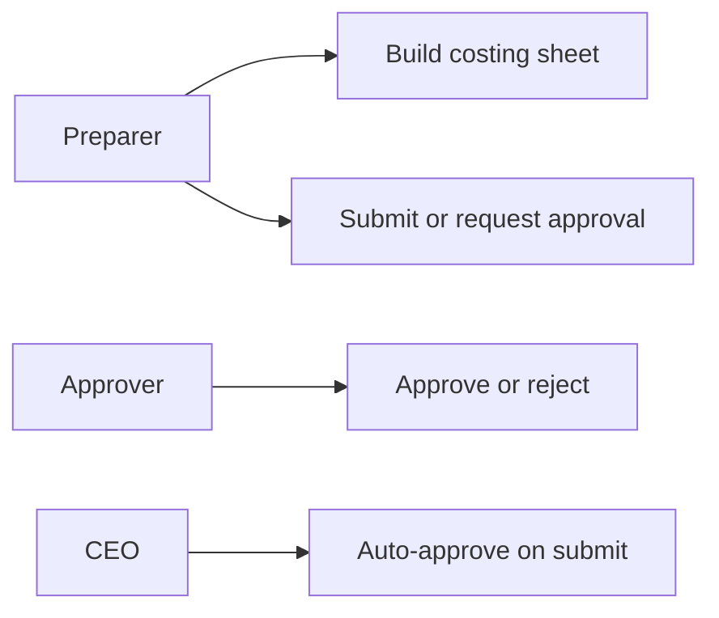
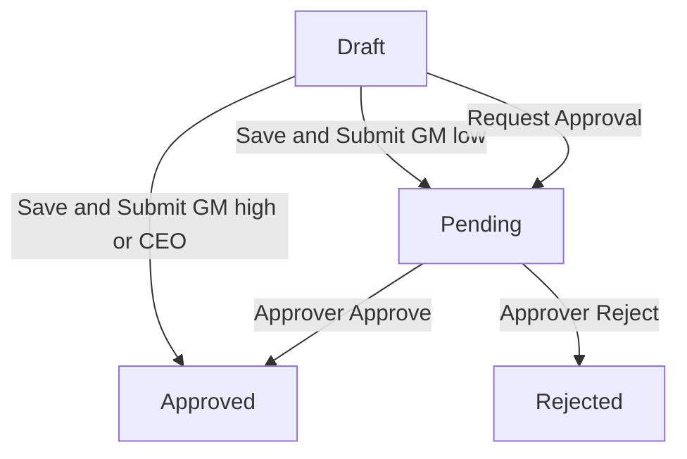
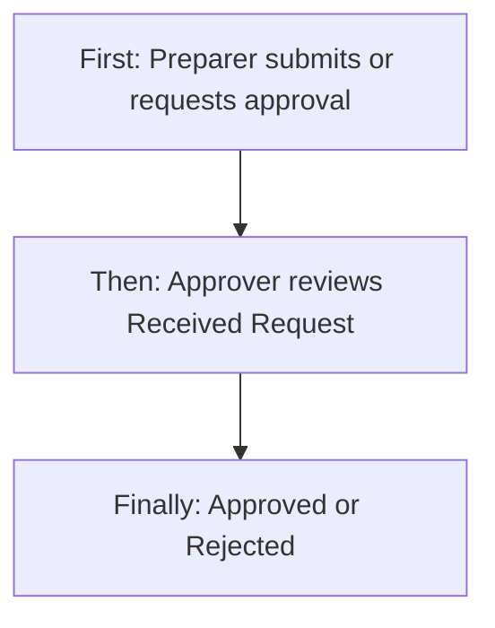
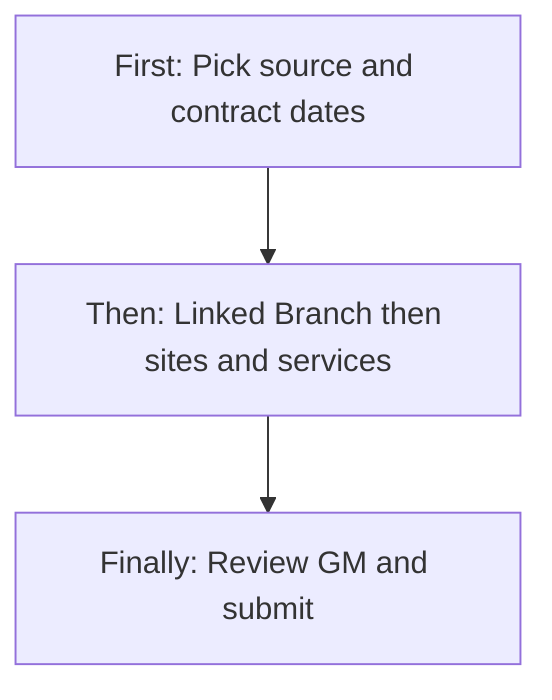
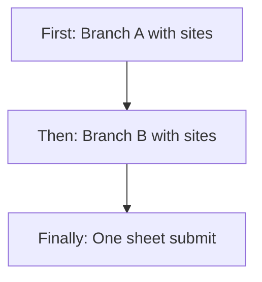
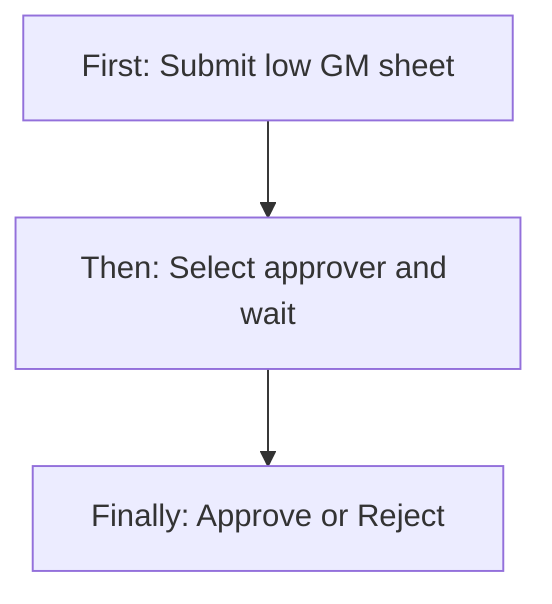
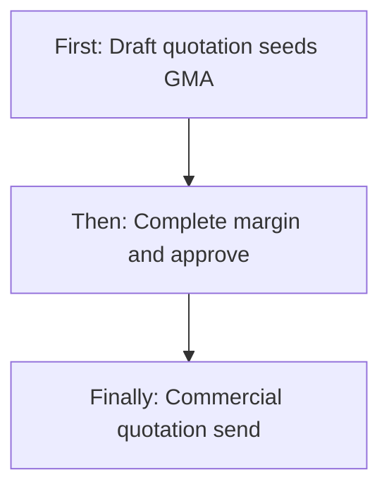
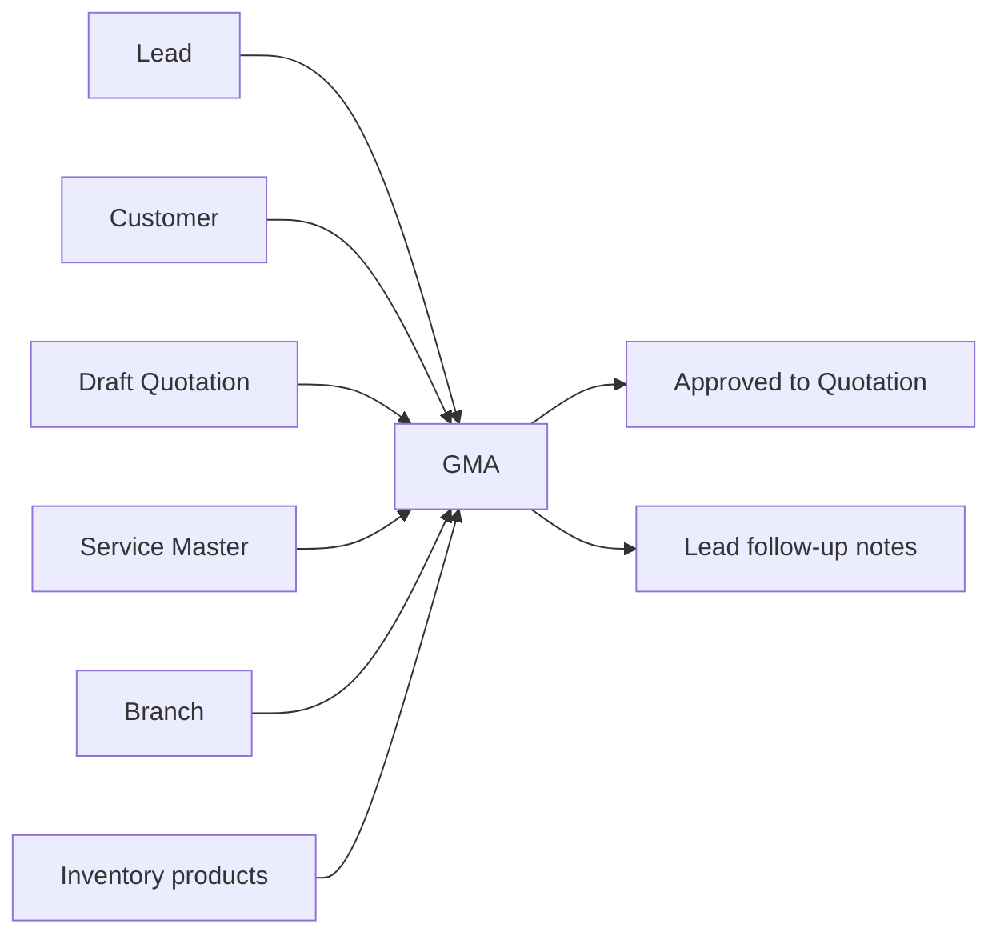
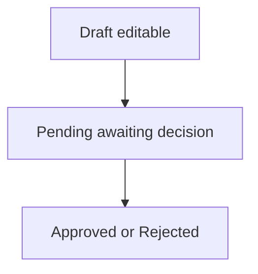

# GMA Management — Product & Business Documentation

## 1. Purpose & Business Need

Pest-control sales and operations need an **internal costing and margin worksheet** before (or alongside) a client commercial offer: what each site costs to serve (visit rates, labour hours, chemicals), what price is proposed, and whether the **gross margin %** is healthy enough to approve.

**GMA Management** (Gross Margin Analysis / Gross Margin Approval) is that worksheet. Staff build a **Branch → Site → Service** tree, attach chemicals and labour, set **Site Proposed Price**, see **GM%**, then **Save Draft**, **Submit** (auto-approve when margin is healthy or when the submitter is CEO), or **Request Approval** when margin is low and a manager must decide.

**Outcomes today**
- Create GMA sheets from Lead, Customer, Draft Quotation, or Add New prospect
- Multi-branch / multi-site costing with Service Master pricing (fixed / area / inspection)
- Manpower, chemicals, weekend/night surcharge, documentation costs
- Overall and site-level Gross Margin %
- Approval workflow when GM is below the auto-approve threshold
- Download GMA PDF; from **Approved** GMA, download / create **Quotation** (commercial twin, no margin columns)

**What this module is not**
- A **client-facing quotation** (payment terms, public Accept/Reject, and commercial PDF live on **Quotation Management**)
- A finished convert-to-contract journey (Approved GMA can feed Quotation; contract consumption is handled elsewhere)

**Related docs:** [`quotation-management.md`](./quotation-management.md), [`leads-follow-up-management.md`](./leads-follow-up-management.md), [`service-management.md`](./service-management.md).

---

## 2. Users & Roles (who uses this and why)

### 2.1 Company CEO / Owner

Full access. On Submit or Request Approval, **CEO is auto-approved** for any GM% (highest authority — no manager routing).

### 2.2 Sales / field preparers

Staff with GMA access prepare sheets (Draft), submit when GM is healthy, or request approval when GM is low. They track items on **My Request**.

### 2.3 Approvers / managers

Staff with Approve permission see **Received Request**, open a pending sheet, and Approve or Reject with remarks.

### 2.4 Downstream users

- **Quotation** users create commercial drafts from **Approved** GMA  
- **Lead** operators open Create GMA from qualified pipeline stages  

---

## 3. Access Control (RBAC)

### 3.1 How access works

Platform module: **GMA Sheet Management** (shown as **GMA Management** in the sidebar and user permission screens).

| Permission (catalog) | Intended use in UI |
|----------------------|--------------------|
| **Read** | Dashboard list, open view, approved GMA dropdown |
| **Add** | Create sheet / Add GMA Sheet |
| **Edit** | Update Draft sheets |
| **Delete** | Revoke (see gaps — behaviour is destructive) |
| **Request** | My Request tab (UI may treat Add as fallback if Request is missing) |
| **Approve** | Received Request tab + Approve / Reject decision |
| **Export / Download** | GMA PDF; Quotation PDF from Approved GMA |

CEO role bypasses the permission checks above in the product.

### 3.2 Role × action matrix

| Role | View list | View detail | Add | Edit | Inactive / Delete | Submit request | Receive / act | Approve | Reject |
|------|-----------|-------------|-----|------|-------------------|----------------|---------------|---------|--------|
| Company CEO | Yes | Yes | Yes | Yes (Draft) | Revoke Draft/Pending* | Yes (auto-approves) | Yes | Yes | Yes |
| Staff with GMA Read | Yes (Dashboard) | Yes | No | No | No | No | No | No | No |
| Staff with GMA Add | Yes | Yes | Yes | Limited | No | Yes (via Submit) | No | No | No |
| Staff with GMA Edit | Yes | Yes | No | Yes (Draft only) | No | No | No | No | No |
| Staff with GMA Request | Yes | Yes | As granted | As granted | No | Yes | No | No | No |
| Staff with GMA Approve | Yes | Yes | No | No | No | No | Yes (Received) | Yes | Yes |
| Staff with GMA Delete | Yes | Yes | No | No | Revoke* | No | No | No | No |
| Staff without GMA Management | Menu blocked if Read missing | — | No | No | No | No | No | No | No |

\*Revoke is available for Draft/Pending where the UI exposes it; product copy may say “back to Draft” while the live action **removes** the sheet (see §13).

**Record-level rules**
- Only **Draft** sheets can be updated through Edit  
- Approve / Reject only when status is **Pending**  
- List data is scoped to the user’s branches (and related prepared-by rules on dropdowns)

### 3.3 Tabs by permission

| Tab | Who sees it |
|-----|-------------|
| **GMA Dashboard** | Users who can reach GMA Management list |
| **My Request** | Users with Request (or Add fallback) |
| **Received Request** | Users with Approve |

**+ Add GMA Sheet** appears on Dashboard / My Request (not on Received).

---

## 4. Capabilities & Features

### 4A. Costing & margin lifecycle

Create Draft → Save Draft (optional) → **Save & Submit** or **Save & Request Approval** → Pending (if routed) → Approved or Rejected → from Approved, create commercial Quotation / download Quotation PDF.

**Auto-approve threshold:** overall GM **≥ 40%** on Submit → Approved without manager inbox.  
**Below 40% (non-CEO):** Submit routes to Pending via configured receiver roles (or opens Select Approver when requesting approval).  
**CEO:** any GM% → Approved on Submit / Request Approval.

### 4B. Source selection (who the sheet is for)

| Source | What preparer picks | What is stored |
|--------|---------------------|----------------|
| From Lead | Pipeline lead | Lead link; contact read-only |
| From Customer | Existing customer | Customer id; contact / address display |
| From Quotation | **Draft** quotation only | Quotation link; commercial tree seeds costing |
| Add New | Prospect name, phone, email, address, city, state, pincode, map | Prospect snapshot on the sheet |

Exactly one source type applies (Lead **or** Customer **or** Prospect **or** Quotation).

### 4C. Cost Breakdown — Branch → Site → Service

This is the heart of GMA.

1. **Add Branch** → set **Linked Branch** (required)  
2. **Add Site** under that branch (address, location, proposed price…)  
3. **Add Service** under each site (visit cost, manpower, chemicals…)  
4. Sheet rolls up site costs and prices into overall GM%

See §9 scenarios for full playbooks (allocate branch, multi-site, services + chemicals).

### 4D. Service visit pricing (from Service Master)

| Price type | What preparer sees | How visit cost builds |
|------------|--------------------|------------------------|
| **Fixed** | Select Tier, Rate per Visit | Rate × annual / total visits → Cost/Year & Cost/Month |
| **Area-based** | Area rate selection, Base Price, Area (SQFT), Rate | Area formula → rate × visits |
| **Inspection / other** | Rate per Visit (inspection fee seed when present) | Rate × visits |

### 4E. Manpower, chemicals, surcharge, documentation

| Block | Business meaning |
|-------|------------------|
| **Manpower Labour cost** | Hours per Visit × Rate per Hour (product uses a fixed hourly rate in the template) × visits |
| **Chemical / Product Cost** | Products from Service Master (and Add Product); coverage, qty/visit, cost year/month |
| **Weekend / Night Surcharge** | Optional 25% of visit + manpower (A+B) |
| **Documentation Cost** | Optional cost per document × docs per month |

**Site Cost Summary** shows A+B+C, surcharge (D), documentation (E), total cost, and **Site GM%** against Site Proposed Price.

### 4F. Contract header fields

- **Contract Duration** (Six months / One year / Two / Three / Custom months)  
- **Proposed Start Date** (required on complete submit)  
- **Primary Branch** (read-only mirror of the primary Linked Branch)  
- **Prepared By / Prepared Date** (system)  
- **Remarks / Notes**

### 4G. Outputs

- **GMA PDF** for internal costing view  
- **Download as Quotation** on Approved → commercial Quotation draft / PDF (no margin/chemicals; rates aligned to site proposed price)

---

## 5. CRUD Operations

### 5.1 Create (Add)

**Who:** GMA **Add** (and CEO).

**First:** Open **+ Add GMA Sheet** (or Lead View → Create GMA Sheet). Choose source (Lead / Customer / Quotation / Add New) and fill identity.  
**Then:** Set contract duration and proposed start; **Add Branch** → Linked Branch → **Add Site(s)** → categories/sub-categories → **Add Service(s)** with visit/manpower/chemicals; set Site Proposed Price; review GM%.  
**Finally:** **Save Draft**, **Save & Submit**, or **Save & Request Approval** (low GM / explicit routing). Success: Draft saved, or Approved / Pending depending on GM and role.

### 5.2 Read — List

**Who:** Read / Request / Approve as applicable per tab.

**GMA Dashboard columns:** GMA ID, Customer/Lead Name, Service Type (shows contract vs one-time mode from sheet context), Branch, No. of Sites, Total Cost, Sales Price, Gross Margin %, Status, Created by, Created Date.

**My Request columns:** GMA ID, Customer, Service Type, GM %, **Submitted Date**, Status, Created by.

**Received Request columns:** GMA ID, Customer, Submitted By, GM %, **Submitted On**, Deadline, Status.

**Filters / search:** Status, Service Mode (Contract / One Time), Branch, Date Range; search by GMA ID or Customer. Pagination. Empty state when no matches.

### 5.3 Read — Detail / Get details

**Who:** Read (and Approve for decision screen).

Opening a row loads full header, source, config, approval block, and site cost tables (visit / manpower / chemicals / summary). View Entries supports Edit Draft (when Draft), Download PDF, Download as Quotation (when Approved). Approve-Reject screen loads the same costing detail plus decision controls when Pending.

### 5.4 Update (Edit)

**Who:** Edit (or Add path for new), and only while status is **Draft** on the server.

Full replace of source (within rules), branches, sites, services, chemicals, and remarks. Same form as Add. After Pending/Approved/Rejected, commercial costing is not rewritten via this Edit path (Rejected may look editable in UI but update is Draft-only — see §13).

### 5.5 Inactive / Delete

**No inactive status** in the GMA status set.

**Revoke** (where exposed for Draft/Pending): product intent in UI text may say return to Draft; live behaviour **removes** the sheet and related costing data. Soft-delete fields exist on the record model but there is **no complete soft-delete product flow** on list actions today.

---

## 6. Request & Approval Flows

This module **does** use an internal request / approve path (unlike Quotation’s commercial Accept/Reject).

### 6.1 Submit request

**First:** Preparer completes the sheet and chooses **Save & Submit** or **Save & Request Approval**.  
**Then:** System calculates overall GM%.  
**Finally:**
- CEO → **Approved** immediately  
- Submit and GM ≥ 40% → **Approved**  
- Submit and GM &lt; 40% (non-CEO) → **Pending**, routed to configured receiver roles, deadline typically within 24 hours, preparer notified path for approvers  
- Request Approval → Select Approver role(s) → **Pending**

On From Lead, submit/approve can also append a system follow-up on the lead (without overwriting Converted/Lost).

### 6.2 Receive / inbox / pending actions

Approvers open **Received Request**, see Pending items (Submitted On, Deadline, GM %), and open the decision screen.

### 6.3 Approve / Reject / Return

**First:** Approver opens Pending sheet on Approve-Reject.  
**Then:** Chooses Approve or Reject; Remarks required on Reject.  
**Finally:** Status becomes Approved or Rejected; preparer is notified.

**No Return-for-correction status** exists in the product today (Rejected is terminal until a new sheet is created; UI may still show Edit affordances incorrectly for Rejected).

---

## 7. Forms — Add vs Edit Field Access

Same screen for Add and Edit. Edit is intended for **Draft** only.

| Field (business name) | On Add | On Edit (Draft) | Notes |
|----------------------|--------|-----------------|-------|
| Source type | Editable / Required | Editable | Lead / Customer / Quotation / Add New |
| Lead / Customer / Quotation picker | Editable when source matches | Editable | Prefills contact |
| Contact person, phone, email, type, status | Locked (display) for Lead/Customer | Locked | From master |
| Prospect name, phone, email, address, city, state, pincode, map | Editable / Required when Add New | Editable | Prospect source |
| Contract duration / custom months | Editable / Required on submit | Editable | |
| Proposed start date | Editable / Required on submit | Editable | |
| Primary Branch | Locked (display) | Locked | Mirror of primary Linked Branch |
| Prepared By / Prepared Date | Locked | Locked | System |
| Remarks / Notes | Editable | Editable | Max length enforced |
| Linked Branch (per branch section) | Editable / Required | Editable | Allocates sites to a branch |
| Site name, address, country, state, city | Editable / Required as applicable | Editable | Cascading location selects |
| Pincode | Editable (optional; 6-digit when present) | Editable | |
| Google Map URL | Editable (optional) | Editable | |
| Category / Sub-Category | Editable / Required | Editable | Unlocks service list |
| Site Proposed Price / Year | Editable / Required on submit | Editable | Month derived |
| Service Type / Mode / Frequency | Editable / Required | Editable | After category/sub |
| Annual Frequency / Custom total visits / Visits per Month | Editable / derived | Editable | |
| Select Tier / Area rate / Rate per Visit | Editable | Editable | From Service Master |
| Hours per Visit / Rate per Hour | Editable / template rate | Editable | Manpower block |
| Chemicals / Add Product | Editable / Required on complete submit | Editable | ≥1 chemical expected on full submit |
| Surcharge / Documentation toggles and amounts | Editable | Editable | |
| GM summary / authority matrix | Display | Display | Matrix is guidance; routing uses receiver roles |
| Approver roles | Shown when requesting / low GM path | Same | Modal Select Approver |
| Status | Hidden / system | Locked display | Changed by save actions |

**Never on GMA form as client commercial terms:** Payment terms enums (those belong on Quotation).

**Approve-Reject form:** Decision and Remarks editable only while Pending and not view-only; costing sections read-only.

---

## 8. Lists, Dropdowns, Details & Data Rendering

### 8.1 List rendering

Three tabs with shared search/filters and pagination. Status badges for Draft, Pending, Approved, Rejected. Amounts and GM% formatted for display. Submitted Date / Submitted On show when the sheet was submitted (blank for never-submitted Drafts).

### 8.2 Dropdowns & lookups

| Control | What options appear | Dependents |
|---------|---------------------|------------|
| Lead | Qualified pipeline leads for user’s branches | Fills contact display |
| Customer | Customers for user’s branches | Fills contact / address |
| Quotation | **Draft** quotations only | Seeds Branch→Site→Service costing |
| Linked Branch | Current user’s branches | Sites under that section |
| Country / State / City | Cascading location lists | Site address |
| Category / Sub-Category | Service catalogs | Filters Service Type list |
| Service Type | Active services for selected category/sub | Price type, tiers, pest, chemical seed |
| Pricing tier / Area rate / Inspection | From selected service’s master pricing | Rate per visit |
| Chemical / Product | Service master products + Add Product; inventory price/UOM | Coverage, qty, costs |
| Frequency | Weekly / Fortnightly / Monthly / Quarterly / Custom | Annual / total visits |
| Contract duration | Six months … Custom | Custom months field |
| Approver roles | Roles from preparer’s Request **receiver** configuration | Pending routing |
| Status / Service Mode / Branch filters | Fixed option lists | Refetch list |

### 8.3 Detail / get-details rendering

Get-by-id fills View and Approve screens: header cards (source, config, approval), expandable sites with cost tables (A visit, B manpower, C chemicals, D surcharge, E documentation), site and overall GM. Opening from notification deep links can land on Approve-Reject or View depending on status and role.

---

## 9. How It Works (end-to-end user flows)

### 9.1 Preparer — Allocate Linked Branch, add sites, add services (core scenario)

**First:** Create GMA → choose source → set Contract Duration and Proposed Start Date.  
**Then:** Click **Add Branch** → choose **Linked Branch** (this allocates all sites in that section to that branch). Click **Add Site** → enter Site Name, Address, Country/State/City, optional Pincode and Map URL → select Category and Sub-Category → enter **Site Proposed Price / Year**. Click **Add Service** → pick Service Type → set Mode and Frequency / Visits → complete Visit cost (tier or area), Manpower hours, and Chemicals (seeded products or Add Product) → set surcharge/documentation if needed. Repeat Add Branch / Add Site / Add Service for more locations.  
**Finally:** Review Site Cost Summary and overall GM% → Save Draft or Submit / Request Approval.

**Detailed steps — branch allocation**
1. First branch section is primary by default; Primary Branch field mirrors it.  
2. **Add Branch** adds another section; each must have its own Linked Branch (no duplicate branch on one sheet).  
3. Changing Linked Branch on a section can re-mark that section as primary (last selection wins).  
4. Every branch needs at least one site before complete submit.

**Detailed steps — site**
1. Address and city/state required on complete submit.  
2. Category + Sub-Category unlock Service Type.  
3. Site Proposed Price / Year drives Site GM% vs total site cost.  
4. Pincode optional; when entered must be 6 digits.

**Detailed steps — service & chemicals**
1. Service Mode Contract vs One-Time; Frequency drives Annual Frequency (or Custom total visits).  
2. Visits/Month stays in sync with totals for the contract period.  
3. FIXED → Select Tier; AREA_BASED → area selection + SQFT; inspection-style → rate from fee.  
4. Chemicals: at least one product/chemical row expected on full submit; Price/UOM comes from inventory; Coverage (sqft) and Qty/Visit drive chemical cost.

### 9.2 Preparer — Multi-branch, multi-site sheet

**First:** Add Branch A (e.g. Bengaluru) → two sites under it with services.  
**Then:** Add Branch B (e.g. Mysore) → one site with services; confirm only one primary.  
**Finally:** Submit; Dashboard shows No. of Sites across branches; Approved sheet can feed Quotation with the same branch tree.

### 9.3 Preparer — Healthy GM Submit (auto-approve)

**First:** Complete costing so overall GM ≥ 40%.  
**Then:** Save & Submit (non-CEO).  
**Finally:** Status **Approved**; no Received inbox step; Download as Quotation becomes available.

### 9.4 Preparer — Low GM → Request Approval → Approver decides

**First:** Complete sheet with GM &lt; 40% (non-CEO).  
**Then:** Save & Submit or Save & Request Approval → Select Approver role(s) → Send Request → Pending on My Request / Received Request.  
**Finally:** Approver Approves (Approved) or Rejects with remarks (Rejected); preparer notified.

### 9.5 CEO — Submit any GM%

**First:** CEO prepares or opens a complete Draft.  
**Then:** Save & Submit (or Request Approval).  
**Finally:** Auto-Approved immediately; no manager routing.

### 9.6 From Draft Quotation → GMA → Approve → Quotation again

**First:** On a **Draft** Quotation, create GMA From Quotation (seeds commercial rates into costing).  
**Then:** Add chemicals/manpower, adjust proposed prices, Submit/Approve to **Approved**.  
**Finally:** Download as Quotation / Quotation From GMA → commercial draft with rates scaled to Site Proposed Price → set payment terms and Send on Quotation.

### 9.7 From Lead — Create GMA then follow pipeline

**First:** Lead View (Qualified / Quotation Sent / Negotiation) → Create GMA Sheet (Lead prefilled).  
**Then:** Build Branch→Site→Service and Submit.  
**Finally:** Lead may receive system follow-up notes on submit/approve; commercial offer still goes through Quotation when ready.

### 9.8 Approver — Received Request decision

**First:** Open Received Request → open Pending GMA.  
**Then:** Expand sites, review cost vs proposed price and GM%.  
**Finally:** Approve or Reject (remarks required on Reject) → Confirm Decision.

### 9.9 View / PDF / Quotation download

**First:** Open Approved (or other) sheet on View Entries.  
**Then:** Download GMA PDF for internal record; if Approved, Download as Quotation.  
**Finally:** Quotation draft opens for payment terms and Send (Quotation module).

---

## 10. Cross-Module Interactions

| Module | Interaction |
|--------|-------------|
| **Lead** | From Lead source; Create GMA from Lead View; follow-ups on submit/approve |
| **Customer** | From Customer source |
| **Quotation** | From **Draft** Quotation → GMA; From **Approved** GMA → Quotation draft/PDF |
| **Service Management** | Categories, services, FIXED / AREA / INSPECTION, chemical product seed |
| **Branch** | Linked Branch on each branch section; list scoping |
| **Inventory / Products** | Chemical price and UOM |
| **User / Role permissions** | Approver routing via Request receiver roles |
| **Contract / Sales Order** | Approved dropdown may exclude sheets already consumed by contract flows |

### 10.1 GMA vs Quotation (quick contrast)

| Concern | GMA | Quotation |
|---------|-----|-----------|
| Purpose | Cost + margin approval | Client commercial offer |
| Chemicals / manpower / GM% | Yes | No |
| Payment terms | No | Yes |
| From other module | Draft Quotation | Approved GMA |
| Client Accept/Reject | No | Yes (commercial) |

---

## 11. Data the Business Cares About

### Header
- GMA ID, status, source type, lead/customer/quotation/prospect  
- Contract duration, proposed start, primary branch, prepared by/date, remarks  
- Total annual cost, total annual price (sales), overall GM%, GM with/without documentation  
- Submitted on, deadline (when Pending), approver roles  

### Per branch section
- Linked Branch, primary flag, sites  

### Per site
- Site name, address, city, state, country, pincode, map URL  
- Category / sub-category, area reference, proposed price year/month  
- Cost rolls: visit, manpower, chemical, surcharge, documentation, site GM%  

### Per service
- Service type, mode, frequency, annual/total visits, visits per month  
- Rate per visit / tier / area inputs, visit cost year/month  
- Hours per visit, rate per hour, manpower cost  
- Chemical lines (product, code, price/UOM, coverage, qty, costs)  

### Statuses
Draft → Pending → Approved | Rejected  

---

## 12. Rules, Validations & Constraints

- **Source XOR:** exactly one of Lead, Customer, Prospect, Quotation  
- **Draft save:** relaxed; incomplete tree allowed  
- **Complete submit:** proposed start; each branch has Linked Branch and ≥1 site; sites have services; each service has chemicals; site proposed price &gt; 0; pincode 6 digits when present; prospect phone rules when Add New  
- **Edit:** Draft only  
- **Approve/Reject:** Pending only; Reject needs remarks  
- **Auto-approve:** GM ≥ 40% on Submit, or any GM% for CEO  
- **Request Approval:** at least one approver role when that path is used (non-CEO)  
- **From Quotation:** quotation must be Draft  
- **From GMA → Quotation:** GMA must be Approved and have a real Linked Branch  
- **Authority matrix on screen** (Auto ≥40% / Sales Manager band / CEO band) is **guidance**; live routing uses configured Request receiver roles + CEO bypass + 40% auto rule  

---

## 13. Loopholes, Gaps & Current Limitations

1. **Revoke vs copy:** UI may describe returning to Draft; live revoke **deletes** Draft/Pending sheets.  
2. **Soft-delete** fields exist without a complete list soft-delete journey; dedicated delete API wiring is incomplete.  
3. **Reject decision payload mismatch risk:** decision screen may send a reject value / comments field that does not match the approval API’s expected decision/remarks names — Reject can fail until aligned.  
4. **Rejected “Edit” in UI** vs Draft-only update API — Rejected edits can fail.  
5. **Sales Authority Matrix bands** (20–39.99% vs &lt;20%) are not separately enforced; routing is receiver roles + 40% auto + CEO.  
6. **Site Area (sqft)** used in chemical/area math may lack a clear dedicated site Area input on the form grid.  
7. **Linked Branch change** can force that section to become primary unexpectedly.  
8. **List “Service Type”** column reflects service **mode** (Contract/One-Time), not service catalog name.  
9. **Filter value “Submitted”** may appear in UI filter plumbing without a matching status.  
10. Some **get-by-id / helper** endpoints are weaker on permission annotations than list/create.  
11. Standalone My Requests page **Add** link may point at an outdated path.  
12. Complete submit requires chemicals — empty Service Master product seed blocks Submit until Add Product.

---

## 14. Existing Functionality Summary

**Fully available today**
- GMA Dashboard, My Request, Received Request tabs  
- Add/Edit Draft with Lead / Customer / Draft Quotation / Add New sources  
- Multi-branch Linked Branch allocation; multi-site; multi-service costing  
- Service Master fixed / area / inspection visit pricing  
- Manpower, chemicals, surcharge, documentation, site & overall GM%  
- Save Draft; Submit with 40% auto-approve; Request Approval; CEO auto-approve  
- Approver decision screen  
- GMA PDF; Download as Quotation from Approved  
- Sync with Quotation (Draft → GMA; Approved GMA → Quotation)  
- Lead follow-up hooks on From Lead  

**Not available or incomplete**
- Return-for-correction status  
- Reliable soft-delete / inactive lifecycle  
- Strict enforcement of matrix GM bands beyond 40% / CEO / receiver roles  
- Payment terms on GMA (by design — use Quotation)

---

## 15. Reference — APIs, Screens & UI Actions

### 15.1 APIs

| Method | Path | Purpose (plain language) | Used by (screen/flow) |
|--------|------|--------------------------|------------------------|
| GET | `/api/v1/gma/sheets` | Paginated Dashboard list | GMA Dashboard |
| GET | `/api/v1/gma/sheets/my-requests` | Preparer’s submitted/draft requests | My Request |
| GET | `/api/v1/gma/sheets/received-requests` | Pending items for approvers | Received Request |
| GET | `/api/v1/gma/sheets/by-id?id=` | Full sheet detail | View / Edit / Approve |
| POST | `/api/v1/gma/sheets` | Create sheet (Draft/Submit/Request) | Add GMA |
| PUT | `/api/v1/gma/sheets/{id}` | Update Draft | Edit GMA |
| PUT | `/api/v1/gma/sheets/{id}/decision` | Approve or Reject | Approve-Reject |
| PUT | `/api/v1/gma/sheets/{id}/revoke` | Revoke Draft/Pending | List revoke action |
| GET | `/api/v1/gma/sheets/eligible-managers` | Approver role options | Select Approver modal |
| GET | `/api/v1/gma/sheets/dropdown` | Approved GMA picker | Quotation From GMA |
| GET | `/api/v1/gma/sheets/{id}/pdf` | Download GMA PDF | View / list download |
| POST | `/api/v1/gma/sheets/from-quotation/{quotationId}` | Create Draft GMA from Draft Quotation | From Quotation |
| GET | `/api/v1/gma/sheets/{id}/quotation-pdf` | Quotation PDF via Approved GMA | Download as Quotation |
| POST | `/api/v1/quotations/from-gma/{gmaSheetId}` | Create/reuse Quotation Draft from Approved GMA | Quotation / GMA download |

### 15.2 Frontend Screen Routes

| Route | Screen purpose | Primary users |
|-------|----------------|---------------|
| `/GMA-Management` | Dashboard / My Request / Received tabs | All GMA users |
| `/Add-GMA` / `/Add-GMA/:id` | Create / edit Draft | Add / Edit |
| `/View-GMA-Entries/:id` | View costing detail | Read |
| `/Approve-Reject-GMA/:id` | Approve / Reject or view-only | Approve |
| `/View-My-Requests-GMA` | Legacy/standalone my requests | Request users |

### 15.3 Click Events, Filters, Search & Controls

| Screen / Route | Control | Type | What happens |
|----------------|---------|------|--------------|
| List | GMA Dashboard / My Request / Received Request | Tabs | Switch list API and columns |
| List | Search | Text | Search GMA ID / customer |
| List | Status / Service Mode / Branch / Date Range | Filters | Refetch list |
| List | Pagination | Pager | Next/previous page |
| List | + Add GMA Sheet | Button | Opens Add (hidden on Received) |
| List | View | Row action | Opens View or Approve depending on context |
| List | Edit | Row action | Opens Add/Edit when Draft (and permitted) |
| List | Revoke | Row action | Revokes Draft/Pending where exposed |
| List | Approve | Row action | Opens decision screen for Pending |
| List | Download | Row action | GMA PDF or Quotation PDF when Approved |
| Add/Edit | Source radios | Radio | Lead / Customer / Quotation / Add New sections |
| Add/Edit | Lead / Customer / Quotation select | Dropdown | Prefill identity / seed tree |
| Add/Edit | Prospect fields | Inputs | Add New identity |
| Add/Edit | Contract Duration / Custom months / Proposed Start | Select / date | Header config |
| Add/Edit | Expand all / Collapse all | Buttons | Toggle branch/site cards |
| Add/Edit | Add Branch / Remove Branch | Buttons | Branch sections |
| Add/Edit | Linked Branch | Dropdown | Allocates section to branch; can set primary |
| Add/Edit | Add Site / Remove Site | Buttons | Sites under branch |
| Add/Edit | Country / State / City | Cascading selects | Site location |
| Add/Edit | Pincode / Google Map URL | Inputs | Optional site location |
| Add/Edit | Category / Sub-Category | Multi-select | Unlocks services |
| Add/Edit | Site Proposed Price Year / Month | Number / derived | Drives site GM% |
| Add/Edit | Add Service / Remove Service | Buttons | Services under site |
| Add/Edit | Service Type / Mode / Frequency | Selects | Service config |
| Add/Edit | Annual Frequency / Custom visits / Visits per Month | Number | Visit counts |
| Add/Edit | Select Tier / Area rate / Rate per Visit | Select / number | Visit cost block |
| Add/Edit | Hours per Visit / Rate per Hour | Number | Manpower block |
| Add/Edit | Add Product / chemical grid | Button / grid | Chemical costs |
| Add/Edit | Surcharge / Documentation radios and amounts | Radio / number | D and E costs |
| Add/Edit | GM summary / authority matrix | Display | Margin guidance |
| Add/Edit | Save Draft | Button | Persist Draft |
| Add/Edit | Save & Submit | Button | Submit path (auto or Pending) |
| Add/Edit | Save & Request Approval | Button | Opens Select Approver when needed |
| Add/Edit | Select Approver modal | Modal | Choose roles → send Pending |
| Approve-Reject | Decision Approve / Reject | Radio | Sets decision |
| Approve-Reject | Remarks | Text | Required on Reject |
| Approve-Reject | Confirm / Submit Decision | Button | Posts decision |
| Approve-Reject | Expand / Collapse sites | Buttons | Review costing |
| Approve-Reject / View | Download as Quotation | Button | Approved → Quotation PDF/draft |
| View | Download PDF | Button | GMA PDF |
| View | Edit Draft | Button | When Draft + permission |
| View | Close | Button | Back to list |
