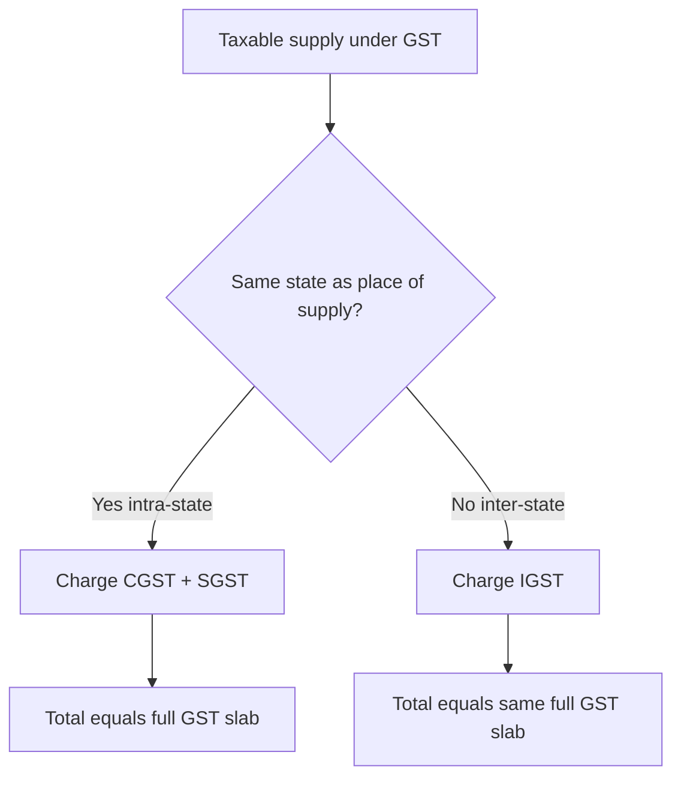
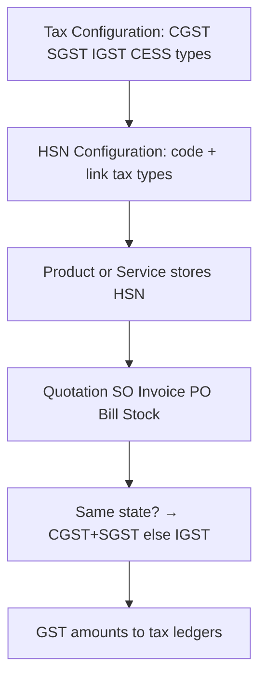
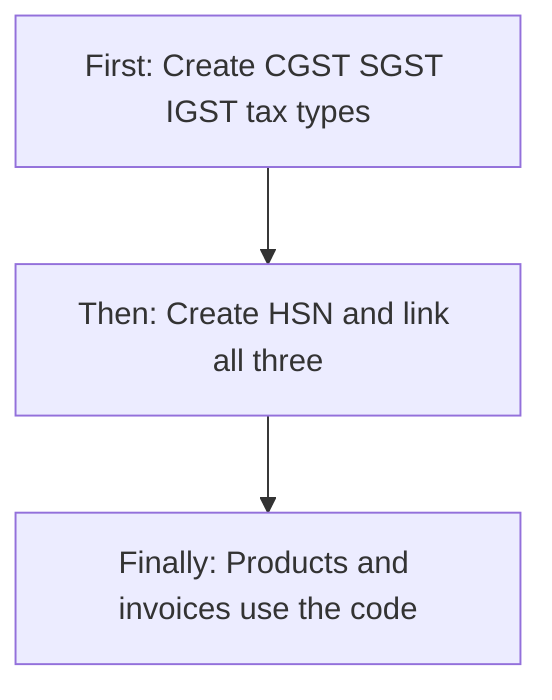

# GST Taxation with Tax & HSN — Combined Business Guide

**Related product docs:** [Tax Configuration](./tax-configuration.md) · [HSN Configuration](./hsn-configuration.md)

This guide explains **how India’s GST system works**, what **HSN / SAC** mean under government norms, **why Seravion Connect needs both Tax and HSN masters**, and the **end-to-end workflow** that maps the two modules together for invoices, purchases, and stock.

---

## 1. Why this exists (business need)

Indian businesses that sell goods or services under **GST (Goods and Services Tax)** must:

1. Charge the **correct GST** on each invoice line (Central, State, or Integrated — depending on place of supply).
2. Show the correct **HSN or SAC code** so tax authorities and customers can classify what was sold.
3. Post GST amounts to the right **tax ledgers** for returns and books.
4. Keep rates consistent across **sales, purchase, stock, and service** documents.

If staff type arbitrary percentages on every line, rates drift, CGST/SGST/IGST get mixed up, and HSN codes become inconsistent. Seravion Connect therefore separates:

| Master | Business job |
|--------|----------------|
| **Tax Configuration** | Define reusable GST **tax types** (CGST, SGST, IGST, CESS) with rates |
| **HSN Configuration** | Define **HSN/SAC codes** and **attach** the right tax types to each code |

Day-to-day documents (products, services, quotations, sales orders, invoices, bills, stock) pick an **HSN/SAC**. The system then derives tax from the **mapped tax types** — not from free typing.

---

## 2. GST in India — how CGST, SGST, and IGST work

### 2.1 One tax, three ways to split it

GST is a destination-based tax. For a given taxable supply, the **total GST rate** (for example 18%) is split differently based on whether the supply is **within one state** or **across states**.

| Component | Full name | Who collects | When it applies |
|-----------|-----------|--------------|-----------------|
| **CGST** | Central GST | Central government | **Intra-state** supply (seller and place of supply in the **same** state / UT) |
| **SGST** | State GST | State / UT government | Same **intra-state** supply (paired with CGST) |
| **IGST** | Integrated GST | Central government (settled with states) | **Inter-state** supply (seller and place of supply in **different** states / UTs), and certain other cases (e.g. some imports / SEZ patterns as per law) |

**CESS** (Compensation Cess or similar) may apply on notified goods/services **on top of** the base GST. In Seravion, CESS is a separate tax category that can be linked on an HSN in addition to CGST/SGST/IGST.

### 2.2 Simple rate picture (example: 18% GST)

For an item notified at **18% GST**:

| Supply type | What appears on invoice | Rates |
|-------------|-------------------------|-------|
| **Intra-state** (same state) | CGST + SGST | Usually **9% + 9%** (= 18%) |
| **Inter-state** (different states) | IGST | Usually **18%** (single line, not CGST+SGST) |

Important business rule: **CGST rate and SGST rate must match** for the same slab, and **CGST + SGST must equal IGST** for that slab. Seravion enforces this when an HSN is saved as **Active**.

### 2.3 How Seravion names these categories

On **Tax Configuration**, tax category maps as:

| Screen category | Indian GST meaning |
|-----------------|--------------------|
| **Central** | CGST |
| **State** | SGST / UTGST-style state share |
| **Integrated** | IGST |
| **CESS** | Additional cess (optional) |

Each tax type also has a **default rate (%)**, **applicability** (Goods / Services / Both), and **Active / Inactive** status.

---

## 3. What is HSN (and SAC) as per Indian norms?

### 3.1 HSN — Harmonized System of Nomenclature

**HSN** is India’s adopted classification for **goods**, based on the internationally used Harmonized System. Under GST:

- Businesses classify goods using **HSN codes** so the same product class maps to the same GST treatment.
- Codes are typically **4, 6, or 8 digits** (longer codes = finer classification). Higher turnover / specific rules may require more digits on invoices — Seravion accepts **4, 6, or 8 digit** numeric codes in the master.
- The HSN on an invoice tells buyers and tax authorities **what kind of goods** were supplied.

### 3.2 SAC — Services Accounting Code

**SAC** is the classification for **services** under GST (for example pest control, maintenance, consulting). On invoices, the field is often labelled **HSN/SAC** because:

- Goods lines show an **HSN**
- Service lines show a **SAC**

Seravion does **not** keep a separate SAC-only master. Service codes are stored in the **same HSN Configuration catalogue** and shown as **HSN/SAC** on commercial documents. Practically: create the service code in HSN Configuration and map tax types the same way.

### 3.3 Why HSN/SAC matters under law and operations

| Need | Why it matters |
|------|----------------|
| **Correct GST rate** | Rate slabs and exemptions are tied to classification; wrong code → wrong tax |
| **Invoice compliance** | GST invoices are expected to show HSN/SAC where applicable |
| **ITC and disputes** | Clear classification reduces mismatches with customers/vendors |
| **Reporting** | Returns and analytics group sales by classification |
| **Internal control** | One master code reused on products, services, stock, and invoices |

Without a shared HSN master, every product/service could invent a different code or rate, breaking GST consistency.

---

## 4. How Tax and HSN modules map together in Seravion

### 4.1 Combined mental model

1. **Tax Configuration** creates the building blocks (e.g. CGST 9%, SGST 9%, IGST 18%).
2. **HSN Configuration** creates a code (goods HSN or service SAC-style) and **links** those tax types.
3. **Products / services** store the HSN/SAC code.
4. **Documents** use that code; when GST is calculated/posted, the system chooses **intra-state (CGST+SGST)** or **inter-state (IGST)** based on **branch/company state vs counterparty place of supply**.

### 4.2 What “Active HSN” must contain

For an HSN marked **Active**, Seravion requires a GST-ready mapping:

| Must link | Purpose |
|-----------|---------|
| **Central (CGST)** | Intra-state half |
| **State (SGST)** | Intra-state half (rate must match CGST) |
| **Integrated (IGST)** | Inter-state full rate (must equal CGST + SGST) |
| **CESS** (optional) | Extra cess if needed; may repeat |

Also:

- Linked tax types must be **Active** with rate **greater than zero**.
- At most **one** Active tax type per core category (Central / State / Integrated) on that HSN; CESS may repeat.
- **CGST rate ≈ SGST rate**, and **CGST + SGST ≈ IGST** (small tolerance allowed).

This mirrors Indian GST practice: one slab, two posting paths.

### 4.3 Example — 18% goods HSN

**Step A — Tax Configuration (create three types):**

| Tax name (example) | Category | Rate | Applicability |
|--------------------|----------|------|---------------|
| CGST 9% | Central | 9 | Goods or Both |
| SGST 9% | State | 9 | Goods or Both |
| IGST 18% | Integrated | 18 | Goods or Both |

**Step B — HSN Configuration:**

- HSN code: e.g. `380891` (illustrative)
- Description: product class text
- Link: CGST 9% + SGST 9% + IGST 18%
- Status: **Active**

**Step C — Use:**

- Product assigned that HSN.
- Invoice to a customer in the **same state** as the selling branch → system uses **CGST + SGST**.
- Invoice to a customer in **another state** → system uses **IGST**.

Same HSN, same total tax %, correct component split.

---

## 5. End-to-end workflow (setup → daily use)

### 5.1 One-time / occasional setup (finance or CEO)

**First:** Open **Setup → Tax Configuration** and create Active tax types for each slab the company uses (pairs of CGST/SGST plus matching IGST; CESS if required).  
**Then:** Open **Setup → HSN Configuration** and create each HSN/SAC code; link CGST + SGST + IGST (and CESS if needed); set Effective From and Active.  
**Finally:** Assign those codes on **Products** and **Services**. Documents inherit classification and tax behaviour from the master.

### 5.2 Daily operations (sales / purchase / stock)

**First:** User creates a quotation, sales order, invoice, bill, or stock movement using a product/service that already has an HSN/SAC.  
**Then:** Line shows HSN/SAC; tax components are taken from the HSN’s linked tax types (not invented on the line).  
**Finally:** On invoice/bill posting, place-of-supply logic applies **CGST+SGST** (intra-state) or **IGST** (inter-state) and amounts go to the configured tax ledgers.

### 5.3 Change management

| Change | Correct path |
|--------|----------------|
| New GST slab (e.g. 5% or 28%) | Add new tax types → create/update HSN mappings → assign to products |
| Rate change for a class | Update tax type rates and/or remount HSN links; use Effective From / Change Reason on tax edit |
| Retire a code | Soft-inactive the HSN so new documents cannot use it |
| Retire a tax type | Remove it from all HSNs first; then soft-inactive the tax type |

Tax type **cannot** be inactivated while any HSN still links it. Active documents reject **Inactive** HSN codes.

---

## 6. Who does what (combined access)

Both screens sit under **Setup & Configuration** and share the **Tax Management** permission module (CEO has full access).

| Goal | Where | Typical user |
|------|-------|--------------|
| Define CGST / SGST / IGST / CESS rates | Tax Configuration | CEO / Finance |
| Define HSN/SAC and attach those rates | HSN Configuration | CEO / Finance / Setup |
| Use HSN on product or service | Product / Service masters | Inventory / Ops |
| Charge GST on invoice | Invoicing (via HSN + place of supply) | Sales / Accounts |

Detailed RBAC matrices: [Tax Configuration §3](./tax-configuration.md) · [HSN Configuration §3](./hsn-configuration.md).

---

## 7. Rules the product enforces (GST-aligned)

| Rule | Business meaning |
|------|------------------|
| Tax types are masters | Rates are reusable and controlled |
| HSN links tax types | Classification drives tax, not free typing |
| Active HSN needs CGST + SGST + IGST | Supports both same-state and other-state invoices |
| CGST rate = SGST rate | Intra-state halves stay equal |
| CGST + SGST = IGST | Same slab for inter-state |
| CGST/SGST ≤ 50%; IGST is full rate | Prevents storing “half” rates as IGST |
| Soft inactive (not hard delete) | Audit-friendly retirement |
| Place of supply drives component | Intra → CGST+SGST; Inter → IGST |

---

## 8. Why both modules are required (not one)

| If you only had… | What breaks |
|------------------|-------------|
| **Tax only** | No statutory classification on invoices; products cannot share one government code; posting has no HSN anchor |
| **HSN only (with free %)** | Rates drift; CGST/SGST/IGST mix-ups; no reusable rate master; hard to fix a slab company-wide |
| **Both (current design)** | One tax catalogue + one classification catalogue + automatic path for intra vs inter-state GST |

That is the **actual need**: compliance + consistency + less manual error on every commercial document.

---

## 9. Quick reference — screens and journeys

| Screen | Route (app) | Job in GST workflow |
|--------|-------------|---------------------|
| Tax Configuration | `/Tax`, `/add-tax` | Create/edit CGST, SGST, IGST, CESS types |
| HSN Configuration | `/hsn`, `/add-hsn` | Create/edit HSN/SAC and link tax types |
| Products / Services | Product & service masters | Store Active HSN/SAC |
| Commercial docs | Quotation, SO, Invoice, PO, Bills, Stock | Use HSN; apply GST path by place of supply |

**Setup journey (summary):**

**First:** Configure tax types for every GST slab you sell.  
**Then:** For each goods/service class, create HSN/SAC and link CGST + SGST + IGST.  
**Finally:** Tag products/services; invoices automatically choose CGST+SGST or IGST and post to tax ledgers.

---

## 10. Limitations to keep in mind

- Ledger assignment for tax types is largely **automatic by category**; the Tax screen does not currently expose ledger pickers.
- There is **no separate SAC master UI** — use HSN Configuration for service codes.
- There is **no approve workflow** for tax/HSN master changes; permitted users apply changes immediately.
- Product detail docs for field-level CRUD remain in the sibling module files linked above.

---

## 11. Existing functionality summary

Seravion Connect today implements a **GST-based taxation system** by combining:

1. **Tax Configuration** — Indian GST components as tax types (Central/State/Integrated/CESS).
2. **HSN Configuration** — Indian HSN/SAC classification with mandatory multi-path GST mapping for Active codes.
3. **Document + posting logic** — same HSN, correct CGST+SGST or IGST split by place of supply, amounts to GST ledgers.

Together they meet the real operational need: **government-aligned classification, correct GST components, and consistent tax across the ERP**.
