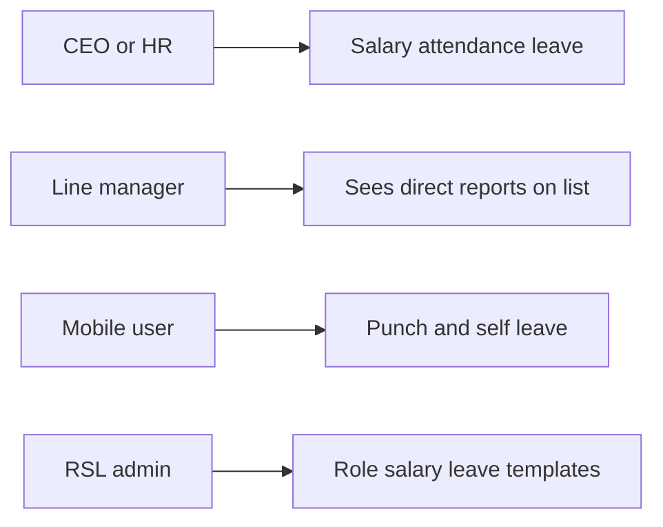
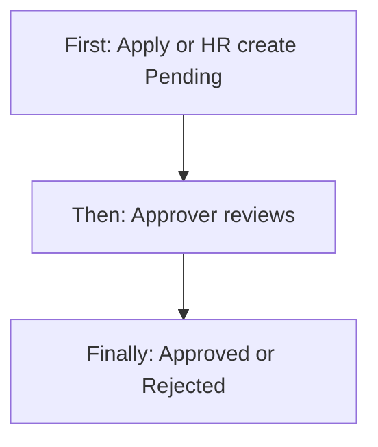
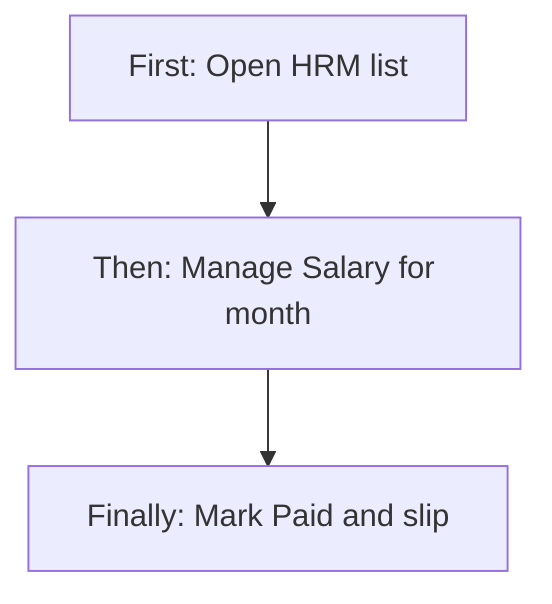
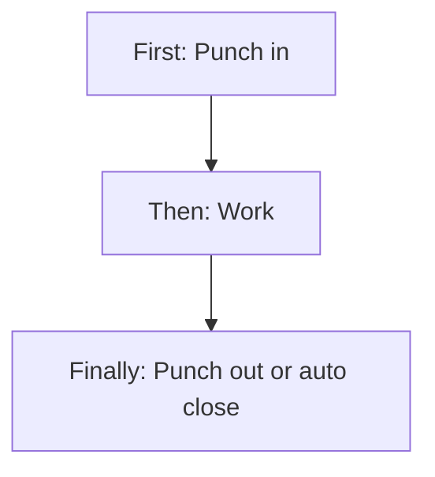
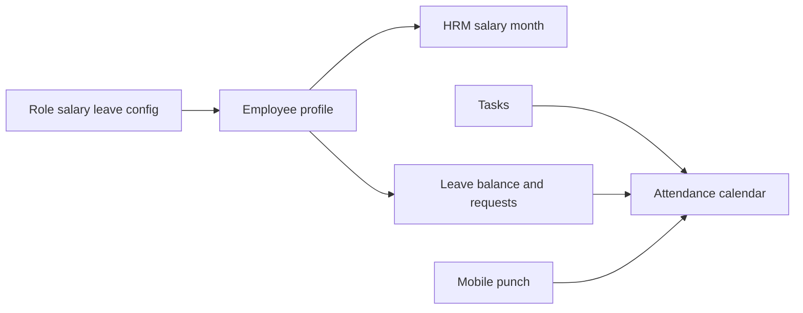
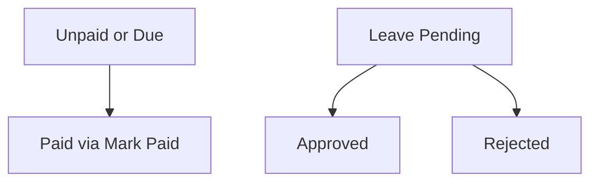

# HRM Management — Product & Business Documentation

## 1. Purpose & Business Need

People operations need one place to run day-to-day HR for employees who already exist in **Employee User Management**: see the right people, manage **monthly salary**, **attendance** (including mobile punch), **leave**, mark salary **paid** with slips, and **bulk upload** corrections.

**HRM** (menu: often under People / Employee area → **HRM**) is that operations hub. Role-level **Salary & Leave Configuration** seeds defaults when employees are added; per-employee salary and leave sit on the employee profile; HRM months, days, and leave requests are the live operational records.

**Outcomes today:**

- Employee list inside HRM (same visibility rules as Employee Management list)
- Manage Salary per employee/month: edit components, mark paid, download/email slip, bulk upload
- Manage Attendance: calendar, manual day entry, bulk upload, Excel export
- Leave applications (HR on behalf) and Leave Requests inbox (approve / reject / mark pending)
- Mobile: punch in/out, own calendar, self leave apply, latest payslip
- Notifications for attendance and leave events

**What this module is not:** Creating the employee master itself (that is Employee Management / hiring), or defining role salary templates (Salary & Leave Configuration). Those are linked modules.

---

## 2. Users & Roles (who uses this and why)

### 2.1 Company CEO / Owner

Sees employees across branches (subject to list rules). Full HRM salary, attendance, leave, export, and approve actions.

### 2.2 HR / payroll administrators

Staff with **HRM** Read / Add / Edit / Approve / Export maintain salary months, attendance, leave decisions, uploads, and slips.

### 2.3 Managers with Employee Add (branch-wide list)

Users with **Employee User Management Add** (or CEO) see **all employees in effective branches** on the HRM/employee list — not only direct reports.

### 2.4 Line managers (no Employee Add)

On the employee/HRM list, see **direct reports only** (people who report to them). Opening salary/attendance/leave for someone still depends on holding the matching **HRM** permissions (see gaps: by-user APIs are not re-checked against the list rule).

### 2.5 Application users (field / mobile)

Punch in/out, view own attendance, apply leave (pending), download **own** latest payslip via mobile. Web slip download also allows Application User authority at API level (see limitations).

### 2.6 Hiring requesters / approvers

Separate from leave: hiring uses Employee **Request** / **Approve**. Leave approve uses **HRM Approve** (UI may also show leave tab if Employee Approve is present).

---

## 3. Access Control (RBAC)

### 3.1 How access works

Three related permission families:

| Family | Business use |
|--------|----------------|
| **Employee User Management** | Employee list/CRUD, hiring request/approve; sidebar entry for HRM hub |
| **HRM Management** | Salary, attendance, leave APIs and most action buttons |
| **Salary & Leave Configuration (RSL)** | Role templates; some routes/UI also map manage-salary screens to this family |

CEO bypasses granular checks on HRM and employee APIs.

### 3.2 Role × action matrix (HRM operations)

| Role | View list | View detail | Add | Edit | Inactive / Delete | Submit request | Receive / act | Approve | Reject |
|------|-----------|-------------|-----|------|-------------------|----------------|---------------|---------|--------|
| CEO | Yes (branch-wide) | Yes | Yes (leave create) | Yes | N/A for HRM months* | No (leave) | Yes | Yes | Yes |
| HRM Read | Via employee list access | Salary/attendance/leave read | No | No | No | No | View inbox | No | No |
| HRM Add | * | * | Leave create (incl. status) | No | No | No | No | Via create if status Approved** | Via create if Rejected** |
| HRM Edit | * | * | No | Salary update, attendance save, uploads, mark-paid allowed | No | No | No | Mark-paid also allowed | No |
| HRM Approve | * | * | No | Mark-paid allowed | No | No | Leave decide | Yes | Yes |
| HRM Export | * | * | No | No | No | No | No | No | No |
| Application User | Self mobile | Own calendar/slip | Self leave pending | Punch | No | Self leave | No | No | No |
| Employee Add (no HRM) | Branch-wide list | Employee profile if Read | Employee add | No HRM | Employee deactivate if Delete | Hiring request | No | Hiring if Approve | Hiring |
| Line manager (Employee Read only) | Direct reports | If permitted | No | No | No | No | No | No | No |

\*Employee deactivate is Employee Delete, not an HRM “delete month.”  
\*\*Product gap: leave **create** can set Approved/Rejected with Add only — see §13.

### 3.3 Who sees how many employee records (list logic)

This is the core visibility rule for the **employee / HRM people list**:

1. **Branch-wide viewers:** Role name **CEO**, or authority **Employee User Management Add** → list all users in **effective branches** (except self).  
2. **Everyone else with list access:** only employees whose **reporting manager** is the current user (direct reports), still limited to effective branches.  
3. **Effective branches:** if the user does not pass branch filters → their assigned branches; if they pass branch filters → those branch IDs are applied (not always intersected with session — see gaps).  
4. **Self** never appears on the management list.  
5. Extra filters: department, designation, role, status, created date, search (emp id / name / email / phone).

**Important:** Opening Manage Salary / Attendance / Leave by employee id is gated by **HRM** permissions on the API, **not** re-validated against “is this person on my list / my branch.” Treat list visibility and HRM detail access as related but not identical.

---

## 4. Capabilities & Features

### 4.1 HRM hub

Tabs for employee-oriented management and (when approve rights exist) **Leave Requests**. Row actions open Manage Salary, Manage Attendance, or Leave Application. Export Attendance from the hub.

### 4.2 Manage Salary

Per employee and month: load or seed from employee salary profile; edit components and status; **Mark as Paid** (generates slip); download/email slip; bulk upload salary file; template download.

### 4.3 Manage Attendance

Month calendar with derived or saved day status; manual entry; bulk upload; linked to leave, holidays, weekly off, and tasks.

### 4.4 Leave application & requests

HR can create leave for an employee (status choosable). Employees apply from mobile as **Pending**. Approvers decide Approve / Reject / Mark Pending. Balance shows CL / SL / PL remaining.

### 4.5 Mobile punch & self-service

Punch in/out for today (optional GPS); own calendar; self leave; latest payslip PDF.

### 4.6 Bulk upload

Salary and attendance Excel/CSV with dry-run support on APIs; templates downloadable.

### 4.7 Employee profile salary & leave (core attachment)

On **Add/Edit Employee**, Step 3 (Salary) and Step 4 (Leave) store standing configuration. Role config can prefill. HRM monthly payroll **seeds** from that salary profile.

### 4.8 Schedulers

Morning shift reminder; late-day **auto punch-out** for open attendance days with notification.

---

## 5. CRUD Operations

### 5.1 Create (Add)

| What | Who | Behavior |
|------|-----|----------|
| Employee | Employee Add | Wizard including salary & leave steps |
| Leave (HR) | HRM Add | Create for employee; may be Pending/Approved/Rejected at create |
| Leave (self) | Application User | Mobile; always Pending |
| Salary month | Implicit | Created/seeded when opening or updating month |
| Attendance day | HRM Edit | Manual save or punch/upload |
| Role salary/leave config | RSL Add | Templates for roles |

**First / Then / Finally (HR leave create):**  
**First:** Open Leave Application for an employee.  
**Then:** Choose type, dates, description; select status.  
**Finally:** Save; if Approved, balance checked; if Pending, approvers can decide later.

### 5.2 Read — List

HRM/Employee list: paginated users under visibility rules above. Leave Requests list: branch/department/status/type/date filters (default branch scope when no branch passed).

### 5.3 Read — Detail

- Salary by user + month/year  
- Attendance calendar / day  
- Leave balance / request by id  
- Employee by id (full profile including salary/leave config)  

### 5.4 Update (Edit)

- Salary month update (components, OT, holiday days, payment status, reason when unpaid/due)  
- Attendance day update (punch times, status, notes) → source Manual  
- Leave decision on existing request  
- Employee update including salary/leave details  

### 5.5 Inactive / Delete

HRM does not hard-delete salary months or attendance days as a primary UX. Employee **Inactive** is via Employee Management Delete/deactivate. Unique constraints prevent duplicate salary month / attendance day / leave code.

---

## 6. Request & Approval Flows

### 6.1 Leave — Submit request

**Who:** Employee via mobile (always Pending), or HR via create with Pending.  
**First:** Choose CL/SL/PL and dates.  
**Then:** System counts working days (excludes weekly off + holidays), blocks overlap with approved leave.  
**Finally:** Pending request appears in Leave Requests for approvers.

### 6.2 Leave — Receive / inbox

Users with HRM Approve (and UI may also allow Employee Approve) see Leave Requests on the HRM hub, filter, and open detail.

### 6.3 Leave — Approve / Reject / Return (Mark Pending)

**Who:** HRM Approve or CEO.  
**Approve:** Balance must cover working days.  
**Reject:** Reason required (min length).  
**Mark Pending:** Decision enum allows returning toward pending (weak transition control — see gaps).

### 6.4 Hiring (linked, not leave)

Employee **Request** / **Approve** apply to hiring requests only, not to leave.

### 6.5 Salary “approve”

Mark Paid may be done with HRM Edit or Approve — not a separate request queue.

---

## 7. Forms — Add vs Edit Field Access

### 7.1 Employee wizard (salary & leave on profile)

| Field (business name) | On Add | On Edit | Notes |
|----------------------|--------|---------|-------|
| Employee ID | Required, editable | Should stay fixed; backend immutable | UI may still show field |
| Password | Required | Optional | |
| Salary type / components / bank / OT / holiday work | Editable | Editable | Prefill from role config |
| Leave CL/SL/PL, carry forward, approval role, reset cycle | Editable | Editable | Standing balance config |
| Documents | Full set | Partial update ops | |

### 7.2 Manage Salary (month)

| Field | Access | Notes |
|-------|--------|-------|
| Month / Year | Selected context | |
| Basic, HRA, allowances, incentive, deductions, PF/ESI/TDS, OT, holiday days | Editable with Edit | |
| Payment status | Editable on save; Mark Paid sets Paid | |
| Reason | Required when Unpaid/Due on update | Min length rule |
| Payment date | Set on Mark Paid | |
| Slip download | When Paid / slip exists | |

### 7.3 Leave application (HR)

| Field | On create | Notes |
|-------|-----------|-------|
| Employee | Prefilled / locked in UI | |
| Leave type CL/SL/PL | Editable | |
| From / To | Editable | |
| Total days | Read-only computed | |
| Description | Required | |
| Status | Pending / Approved / Rejected selectable | Bypasses approve permission if Approved at create |

### 7.4 Manual attendance

| Field | Access |
|-------|--------|
| Date, punch in/out, status, notes | Editable |
| Task counts | Display only |

---

## 8. Lists, Dropdowns, Details & Data Rendering

### 8.1 List rendering

- HRM employee list: search, branch filters, row actions for salary/attendance/leave  
- Leave Requests: status, type, branch, department, dates; Approve/Reject/Pending actions  
- Employee Management sibling list: hiring tabs in addition to people list  

### 8.2 Dropdowns & lookups

| Control | Source |
|---------|--------|
| Branch filter | Current user branches |
| Leave type | CL, SL, PL |
| Leave status | Pending, Approved, Rejected |
| Attendance status | Present, Absent, Leave, Week Off, Holiday, Half Day |
| Salary payment status | Paid, Unpaid, Due |
| Role (employee / config) | Roles master |
| Reporting manager | Managers dropdown |
| Role compensation | Active config by role for prefill |

### 8.3 Detail / calendar derivation

Attendance day if not saved is **derived**: approved leave → holiday → weekly off → tasks imply Present → else Absent. Saved manual/mobile/upload/auto rows override with their source.

---

## 9. How It Works (end-to-end user flows)

### 9.1 HR — Open employee and mark salary paid

**First:** Open HRM; find employee (branch-wide or reports-only per §3.3).  
**Then:** Manage Salary → select month → review/adjust → Mark as Paid.  
**Finally:** Status Paid; slip generated; download/email available.

### 9.2 HR — Attendance manual + bulk

**First:** Manage Attendance for employee or use Upload.  
**Then:** Enter day punches/status or upload file (optionally dry-run on API).  
**Finally:** Calendar shows Manual/Upload sources; export can pull branch ranges.

### 9.3 Field user — Punch in / out

**First:** Mobile punch in (optional location).  
**Then:** Work the day; punch out.  
**Finally:** Day stored as Mobile source; if forgotten, night job may auto punch-out.

### 9.4 Employee — Leave request; HR — Approve

**First:** Employee submits leave on mobile (Pending).  
**Then:** Approver opens Leave Requests, reviews balance and dates.  
**Finally:** Approve (consumes balance window) or Reject with reason; calendar can show Leave.

### 9.5 Admin — Add employee with salary & leave

**First:** Employee Management → Add Employee; pick role (optional prefill from Salary & Leave Configuration).  
**Then:** Complete Salary and Leave steps; save user.  
**Finally:** Employee appears on lists per visibility; HRM salary months seed from profile when opened.

### 9.6 Visibility scenarios

| Scenario | What the user sees |
|----------|-------------------|
| CEO on HRM list | Employees in all (or filtered) active branches |
| HR with Employee Add | Same branch-wide pattern |
| Branch manager without Add | Only direct reports in their branches |
| Mobile user | Only self for punch/leave/slip |
| HR with HRM Read but no Employee Add | List still follows Employee list rule; HRM APIs can still accept other user ids if known (limitation) |

---

## 10. Cross-Module Interactions

| Module | Relationship |
|--------|----------------|
| **Employee User Management** | Master people; list visibility; Add/Edit salary & leave steps; hiring |
| **Salary & Leave Configuration** | Role templates prefill new employees |
| **Profile** | Self profile (not the HRM payroll month UI) |
| **Tasks / Jobs** | Task presence can derive attendance Present |
| **Holidays / weekly off** | Shape leave working days and attendance derivation |
| **Notifications** | Leave and attendance events; deep links to manage screens |
| **Dashboard** | HRM / People widgets when permitted |
| **Storage / email** | Salary slip PDF and email delivery |
| **Branches / Roles / RBAC** | Scope and permissions |

---

## 11. Data the Business Cares About

| Attribute | Meaning |
|-----------|---------|
| Employee ID / name / branch / manager | Who appears and for whom |
| Salary month (year-month) | Payroll period |
| Payment status | Unpaid / Due / Paid |
| Salary components | Basic, HRA, allowances, deductions, statutory, OT, holiday days |
| Slip | PDF proof after paid |
| Attendance date / status / source | Present… + Task/Auto/Manual/Upload/Mobile |
| Punch in / out / total minutes | Time presence |
| Leave type CL/SL/PL | Casual / Sick / Privilege (as configured labels) |
| Leave status | Pending / Approved / Rejected |
| Working days | Counted days excluding offs/holidays |
| Leave balance | Allocated minus approved used in reset window |
| Role leave approval role / reset cycle | Standing config on employee |

---

## 12. Rules, Validations & Constraints

- Unique salary per user+month; unique attendance per user+date; unique leave code  
- Leave description / reject reason minimum length  
- Leave from ≤ to; working days must be &gt; 0  
- No overlap with existing **Approved** leave on create  
- Approve leave checks balance  
- Salary update reason required when status Unpaid/Due  
- Mark Paid sets Paid + payment date + slip  
- Upload file size limit (10MB)  
- Mobile punch is for **today**  
- Auto punch-out closes open days at scheduled night job  

---

## 13. Loopholes, Gaps & Current Limitations

1. **List visibility ≠ HRM by-user scope** — salary/attendance/leave by userId lack branch/manager checks.  
2. **Salary slip download/email** allows Application User with arbitrary userId (mobile latest slip is self-scoped).  
3. **Leave create** can set Approved with Add only (skips Approve authority).  
4. **Attendance export** can fail open to requested branches when intersection is empty.  
5. **Mark Paid** can be repeated; update/upload may set Paid without full mark-paid path.  
6. **Leave approval role** on employee config not strongly enforced on decide.  
7. Overlapping **Pending** leaves possible; both may later approve.  
8. Bulk attendance date parsing may not match DD-MM-YYYY template format.  
9. Sidebar/route module keys mix Employee, HRM, and RSL — confusing for custom roles.  
10. Inactive employees may still be targetable on some payroll paths.  
11. Punch has no geofence; manual/upload allow backdating.  

---

## 14. Existing Functionality Summary

Available today:

- HRM hub + Manage Salary / Attendance / Leave Application + Leave Requests  
- Employee list visibility (CEO/Add vs direct reports)  
- Mark Paid + slip download/email + salary/attendance bulk upload + templates  
- Mobile punch, self leave, own calendar, latest slip  
- Role compensation config linked to employee add  
- Attendance derivation from leave/holiday/off/tasks + schedulers  

Not fully enforced today:

- Object-level HRM access matching list visibility  
- Strict leave create → always Pending  
- Self-only web slip for Application User  
- Hard fail when export branches are outside assignment  

---

## 15. Reference — APIs, Screens & UI Actions

### 15.1 APIs

| Method | Path | Purpose | Used by |
|--------|------|---------|---------|
| GET | `/api/v1/hrm/salary/by-user` | Salary month for employee | Manage Salary |
| PUT | `/api/v1/hrm/salary/update` | Update salary month | Manage Salary Save |
| PUT | `/api/v1/hrm/salary/mark-paid` | Mark paid + slip | Mark as Paid |
| GET | `/api/v1/hrm/salary/slip/download` | Download slip PDF | Manage Salary |
| POST | `/api/v1/hrm/salary/slip/email` | Email slip | Manage Salary |
| POST | `/api/v1/hrm/salary/upload` | Bulk salary upload | Upload modal |
| GET | `/api/v1/hrm/salary/template/download` | Salary template | Upload modal |
| GET | `/api/v1/hrm/attendance/calendar` | Month calendar | Manage Attendance |
| GET | `/api/v1/hrm/attendance/day` | One day | Manage Attendance |
| PUT | `/api/v1/hrm/attendance/day` | Save manual day | Add Manual Entry |
| POST | `/api/v1/hrm/attendance/upload` | Bulk attendance | Upload modal |
| GET | `/api/v1/hrm/attendance/template/download` | Attendance template | Upload modal |
| GET | `/api/v1/hrm/attendance/export` | Export Excel | Export Attendance |
| POST | `/api/v1/hrm/leaves` | HR create leave | Leave Application |
| GET | `/api/v1/hrm/leaves/balance` | Leave balance | Leave Application |
| GET | `/api/v1/hrm/leaves/requests` | Leave inbox | Leave Requests tab |
| GET | `/api/v1/hrm/leaves/requests/by-id` | Leave detail | Leave detail |
| PUT | `/api/v1/hrm/leaves/requests/{id}/decision` | Approve/Reject/Pending | Leave actions |
| POST | `/api/v1/mobile/hrm/attendance/punch-in` | Punch in | Mobile |
| POST | `/api/v1/mobile/hrm/attendance/punch-out` | Punch out | Mobile |
| GET | `/api/v1/mobile/hrm/attendance/calendar` | Own calendar | Mobile |
| GET | `/api/v1/mobile/hrm/leaves/me/balance` | Own balance | Mobile |
| POST | `/api/v1/mobile/hrm/leaves/me` | Self leave | Mobile |
| GET | `/api/v1/mobile/hrm/leaves/me/requests` | Own requests | Mobile |
| GET | `/api/v1/mobile/hrm/payslips/latest/pdf` | Own latest slip | Mobile |
| GET | `/api/v1/users` | Employee list | HRM / Employee list |
| POST/PUT | `/api/v1/users` | Add/Edit employee + salary/leave | User wizard |
| * | `/api/v1/role-compensations/*` | Role salary/leave config | Config screens |
| * | `/api/v1/hiring-requests/*` | Hiring request/approve | Employee Management |

### 15.2 Frontend Screen Routes

| Route | Screen purpose | Primary users |
|-------|----------------|---------------|
| `/hrm` | HRM hub + leave requests | HR / managers |
| `/manage-salary` | Monthly salary | HR / payroll |
| `/manage-attendance` | Calendar & manual/upload | HR |
| `/leave-application` | Create leave for employee | HR |
| `/user-management` | Employee list & hiring | HR / managers |
| `/add-user`, `/edit-user/:id`, `/view-user/:id` | Employee wizard | Employee Add/Edit |
| `/salary-leave-config` | Role config list | RSL admins |
| `/add-role-configuration`, `/edit-role-configuration/:id`, `/view-role-configuration/:id` | Role config form | RSL admins |
| `/profile/:employeeId?` | Profile | Self / view |

### 15.3 Click Events, Filters, Search & Controls

| Screen | Control | Type | What happens |
|--------|---------|------|--------------|
| HRM hub | Search / branch filters | Inputs | Reloads people list |
| HRM hub | Salary / Attendance / Leave icons | Actions | Opens manage screens |
| HRM hub | Export Attendance | Button + modal | Excel export |
| HRM hub | Leave Requests tab | Tab | Inbox |
| Leave Requests | Approve / Reject / Pending | Actions | Decision API |
| Leave Requests | Filters | Branch/dept/status/type/dates | Narrow inbox |
| Manage Salary | Save Changed | Button | Update month |
| Manage Salary | Mark as Paid | Button | Paid + slip |
| Manage Salary | Download Slip | Button | PDF |
| Manage Salary | Upload Salary Data | Button + modal | Bulk upload |
| Manage Attendance | Month/year | Filters | Calendar |
| Manage Attendance | Add Manual Entry | Modal | Save day |
| Manage Attendance | Upload Attendance | Modal | Bulk upload |
| Leave Application | Status select | Select | Create with chosen status |
| Leave Application | Submit | Button | Create leave |
| Employee wizard | Steps 3–4 | Forms | Salary & leave profile |
| Mobile | Punch In / Out | Actions | Today attendance |

---

## Related docs

- [Employee Management](./employee-management.md)  
- [Salary & Leave Configuration](./salary-leave-configuration.md)  
- [RBAC / Role Configuration](./rbac-role-configuration.md)
