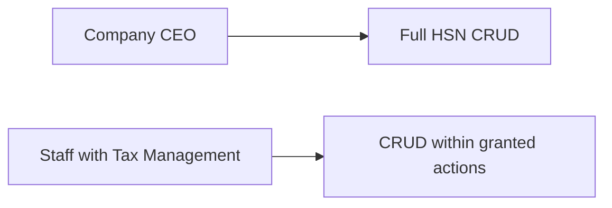
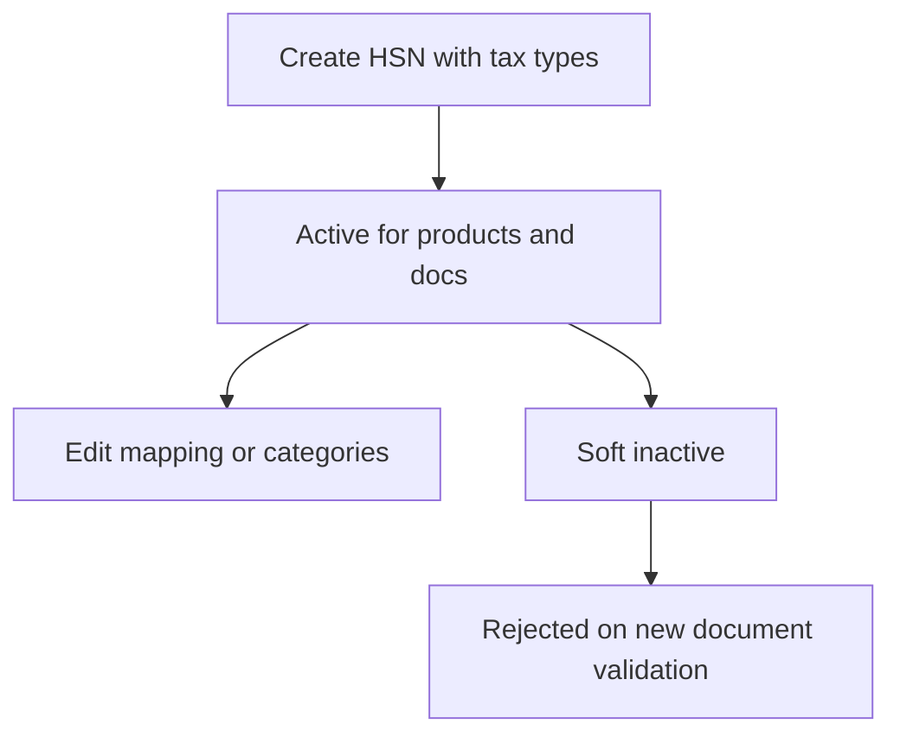
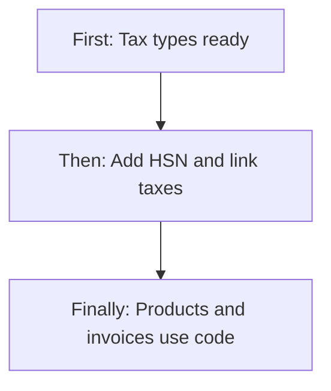
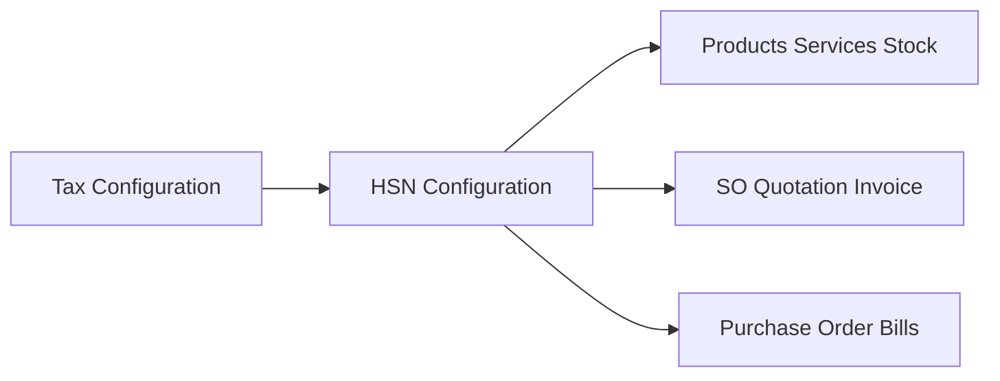
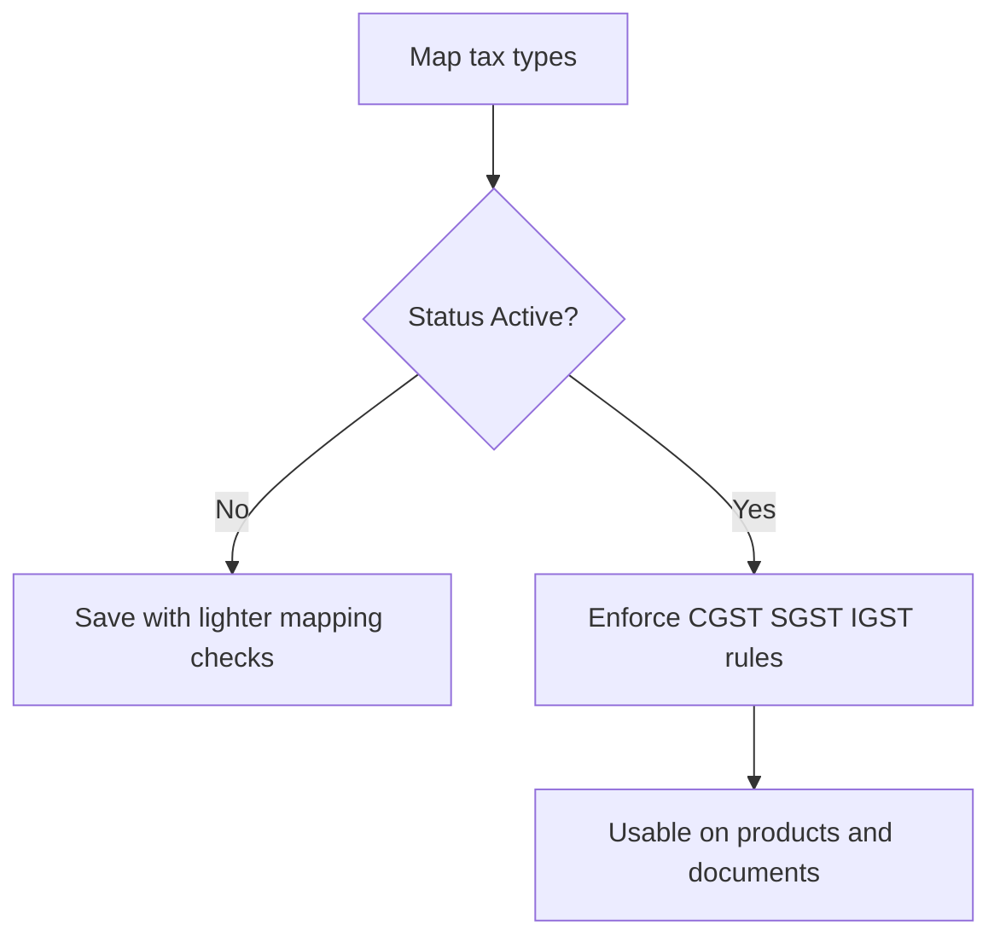

# HSN Configuration — Product & Business Documentation

## 1. Purpose & Business Need

HSN Configuration is the company master for **HSN and SAC-style codes** used on products, services, and commercial documents. Each code carries a description, optional chapter, product category/subcategory tags, **linked tax types**, effective date, and Active/Inactive status.

Seravion Connect does not maintain a separate SAC-only master. Service codes are stored in the same HSN catalogue and appear as **HSN/SAC** on invoices and related screens. Tax percentages on lines are resolved from the **tax types linked to the HSN**, not typed freely per document.

**Outcomes today:** maintain a reusable HSN/SAC catalogue; enforce GST-ready tax mappings for Active codes; soft-deactivate codes that must not be used on new documents; drive tax and posting consistency across inventory, services, sales, purchase, and invoicing.

**Sibling module:** [Tax Configuration](./tax-configuration.md) defines the tax types that HSN codes link to. Both screens share **Tax Management** permissions.

**Combined GST guide:** [GST Taxation with Tax & HSN](./gst-hsn-tax-workflow.md) — how CGST / SGST / IGST and HSN/SAC work under Indian norms, and the end-to-end workflow that maps both masters.

---

## 2. Users & Roles (who uses this and why)

### 2.1 Company CEO / Owner

Full access to HSN Configuration without granular Tax Management checks. Owns the catalogue of codes and tax mappings used company-wide.

### 2.2 Finance / inventory / setup staff (Tax Management permissions)

Staff with Tax Management Read, Add, Edit, and/or Delete maintain HSN codes under Setup & Configuration. They typically create tax types first, then map CGST, SGST, and IGST (and optional CESS) onto each Active HSN.

---

## 3. Access Control (RBAC)

### 3.1 How access works

- Menu **Setup & Configuration → HSN Configuration** appears when the user has Tax Management access (or CEO bypass).
- **CEO** may perform all HSN operations.
- Other employees need **Tax Management**:
  - **Read** — list and view
  - **Add** — create HSN codes
  - **Edit** — update mappings and attributes
  - **Delete** — soft inactive

Branch navigation may also expose an HSN entry; the main Setup sidebar is gated by Tax Management.

### 3.2 Role × action matrix

| Role | View list | View detail | Add | Edit | Inactive / Delete | Submit request | Receive / act | Approve | Reject |
|------|-----------|-------------|-----|------|-------------------|----------------|---------------|---------|--------|
| Company CEO | Yes | Yes | Yes | Yes | Yes | No | No | No | No |
| Staff with Tax Management Read | Yes | Yes | No | No | No | No | No | No | No |
| Staff with Tax Management Add | Yes | Yes | Yes | No | No | No | No | No | No |
| Staff with Tax Management Edit | Yes | Yes | No | Yes | No | No | No | No | No |
| Staff with Tax Management Delete | Yes | Yes | No | No | Yes | No | No | No | No |

**Record-level rules:**
- HSN **code value cannot be changed** after create (locked on edit).
- **Active** HSN must link tax types that support both **intra-state (CGST + SGST)** and **inter-state (IGST)** posting, with consistent rates.
- Linked tax types on an Active HSN must themselves be **Active** with rate greater than zero.
- Operational dropdowns return **Active** HSN only.
- Documents that validate HSN reject Inactive or soft-deleted codes.

This module does **not** use request/approve for HSN changes.

---

## 4. Capabilities & Features

### 4.1 HSN / SAC master

Each record stores:

- HSN/SAC code (4, 6, or 8 digits)
- Description (required)
- Optional chapter
- One or more product categories: Asset, Consumables, Resale
- Optional product subcategories (e.g. Chemicals, Machine, Insecticide, PPE)
- One or more linked tax types
- Effective-from date
- Active / Inactive status

### 4.2 Tax mapping for GST posting

For an **Active** HSN, the system requires a mapping that can support:

- Intra-state supply via **Central + State** tax types
- Inter-state supply via **Integrated** tax type
- Rate consistency between CGST/SGST halves and full IGST (within a small tolerance)

Inactive HSN records can be saved with weaker mapping checks so catalogues can be prepared offline.

### 4.3 Tax details lookup for products

Other screens can ask for an HSN’s linked tax details and total rate when a product or service selects that code.

---

## 5. CRUD Operations

### 5.1 Create (Add)

**Who:** CEO, or staff with Tax Management Add.

**First:** User opens HSN Configuration → **Add HSN**.  
**Then:** Enters code, description, categories, at least one tax type, effective date, and status; saves.  
**Finally:** If status is Active, mapping rules are enforced; the code becomes available in Active HSN dropdowns for products, services, and documents.

### 5.2 Read — List

**Who:** CEO, or staff with Tax Management Read.

List shows HSN Code, Description, Chapter, Product Category, Product Subcategory, Tax Type, Status, Created By, Created Date, with row actions. Search and filters narrow the catalogue. Pagination is server-driven.

### 5.3 Read — Detail / Get details

**Who:** same as Read.

**View** opens the shared form locked. Audit fields (created/modified) are shown. Tax types display according to what the detail load returns.

Users can also resolve an HSN by code string from APIs used by other modules (not a separate HSN UI screen).

### 5.4 Update (Edit)

**Who:** CEO, or staff with Tax Management Edit.

**First:** Open Edit from the list.  
**Then:** Change description, chapter, categories, subcategories, tax types, effective date, or status. **HSN code stays locked.**  
**Finally:** Save re-validates Active mapping rules. Changing tax types may require effective-from to be today or future in the UI.

### 5.5 Inactive / Delete

**Who:** CEO, or staff with Tax Management Delete.

Delete soft-inactivates the HSN (status Inactive; record retained). Status can also be set Inactive on edit.

Inactive codes drop out of Active dropdowns and fail document validation where HSN must be Active.

Reactivation is done by editing Status back to Active (mapping rules then apply).

---

## 6. Request & Approval Flows

This module does not use request/approve. Creates, updates, and soft deletes apply immediately when permitted.

---

## 7. Forms — Add vs Edit Field Access

Add, Edit, and View share **Add HSN** (`/add-hsn`), switched by navigation mode.

| Field (business name) | On Add | On Edit | Notes |
|----------------------|--------|---------|-------|
| HSN Code | Required, editable | **Locked** | 4, 6, or 8 digits only |
| Description | Required, editable | Editable | Minimum length 5 |
| Chapter | Optional, editable | Editable | |
| Product Category | Required multi-select | Editable | Asset / Consumables / Resale |
| Product Subcategory | Optional multi-select | Editable | Enabled after category chosen; cleared if categories emptied |
| Tax Types | Required multi-select | Editable | At least one; Active HSN must satisfy GST mapping rules |
| Effective From | Required, editable | Editable | Today/future for new; today/future if tax types changed on edit |
| Status | Required, editable | Editable | Active / Inactive |
| Created / Modified audit | Hidden | Hidden on edit; shown locked on view | View only |

Save is disabled in view mode.

---

## 8. Lists, Dropdowns, Details & Data Rendering

### 8.1 List rendering

- **Columns:** HSN Code, Description, Chapter, Product Category, Product Subcategory, Tax Type, Status, Created By, Created Date.
- **Search:** Debounced search (server uses 3+ characters against code or description).
- **Filters:** Status (Active/Inactive), Product Category (multi), Tax Type (multi from tax dropdown), Created Date range.
- **Actions:** View, Edit, Delete (permission-gated); **Add HSN** (Add permission).
- **Pagination:** Server page size / page number.

### 8.2 Dropdowns & lookups

| Control | Options source | Behavior |
|---------|----------------|----------|
| Product Category | Fixed | Asset, Consumables, Resale |
| Product Subcategory | Fixed list | Chemicals, Machine, Sprayer, Powder, Insecticide, Rodenticide, Monitoring Trap, Equipment, PPE, Bag, Fuel, Insect Repellent, Electronic Device, etc. |
| Tax Types | Active tax types from Tax Configuration | Multi-select; labels include rate |
| HSN dropdown (other modules) | Active HSN codes | Used on product/service and document flows |
| HSN tax details | Linked tax types for one HSN | Returns tax breakdown and total rate for product UX |

### 8.3 Detail / get-details rendering

Edit/View load by HSN ID. Categories and subcategories normalize to multi-select selections. Tax types returned as display labels (name with rate) rather than numeric IDs — the edit screen attempts to match those labels back to dropdown options, which can fail to pre-select correctly.

---

## 9. How It Works (end-to-end user flows)

### 9.1 Setup staff — Create an Active HSN with GST mapping

**First:** Ensure Tax Configuration has Active CGST, SGST, and IGST types with consistent rates (e.g. 9 + 9 and 18).  
**Then:** Add HSN with code, description, categories, and those tax types; set Effective From and Active.  
**Finally:** Products and services can select the code; invoices validate it and post GST using the mapping.

### 9.2 Setup staff — Edit mapping

**First:** Open Edit on an HSN.  
**Then:** Change linked tax types and/or categories; adjust Effective From if required; save.  
**Finally:** New documents and lookups see the updated rates; HSN code itself never changes.

### 9.3 Setup staff — Retire a code

**First:** Confirm operations no longer need the code on new documents.  
**Then:** Delete (soft inactive) or set Status Inactive.  
**Finally:** Code leaves Active dropdowns; document validation rejects it for new use.

### 9.4 Product / service user — Consume HSN (cross-module)

**First:** On product or service form, pick an Active HSN from the dropdown.  
**Then:** System loads linked tax details for display/totals where wired.  
**Finally:** Sales, purchase, and invoice lines carry the HSN/SAC and derive tax from the master mapping.

---

## 10. Cross-Module Interactions

| Area | Relationship |
|------|----------------|
| Tax Configuration | Tax types linked to HSN; cannot delete a tax type while HSN links exist |
| Inventory products | Store HSN code; taxes via HSN master (product HSN often not freely rewritten after create) |
| Services | Store HSN; validate Active HSN; may copy linked tax types onto the service |
| Sales orders / Quotations | Snapshot HSN on lines; tax % from master |
| Purchase orders | Item HSN from product; tax from HSN |
| Invoicing | Line HSN/SAC validated as Active and not soft-deleted; PDF shows HSN/SAC |
| Bills | Line HSN/SAC stored for commercial use |
| Stock | Snapshots product HSN; rejects inactive HSN where validated |

---

## 11. Data the Business Cares About

| Attribute | Meaning |
|-----------|---------|
| HSN / SAC Code | Statutory classification code (4/6/8 digits) |
| Description | What the code covers |
| Chapter | Optional chapter reference |
| Product Category | Asset / Consumables / Resale tagging |
| Product Subcategory | Finer inventory tagging |
| Tax Types | GST components linked for posting and rates |
| Effective From | When this definition applies |
| Status | Active (usable) or Inactive (retired) |

---

## 12. Rules, Validations & Constraints

- HSN code required; numeric; length **4, 6, or 8**; unique.
- Description required (minimum length).
- At least one product category; at least one tax type.
- **Active** HSN: linked tax types must be Active with rate > 0; must support CGST+SGST and IGST paths without duplicate core categories; CGST/SGST and IGST rates must stay consistent within tolerance.
- HSN code immutable after create.
- Soft delete sets Inactive; does not hard-remove.
- Effective-from present/future rules on create and when tax mapping changes.
- Document flows that validate HSN reject Inactive or soft-deleted codes.

---

## 13. Loopholes, Gaps & Current Limitations

1. **Edit tax prefill is fragile** — detail API returns tax types as display strings (name-rate), not IDs; Edit may not re-select the correct tax types until the user re-picks them.
2. **Multi-select filters vs single server params** — list UI can send comma-joined status/category/tax filters while the list API expects single values; multi-filter results may be wrong or error.
3. **No separate SAC master** — SAC-style codes share the HSN table; labeling is HSN/SAC in documents only.
4. **Branch sidebar HSN entry** may not carry the same module key as Setup → HSN Configuration.
5. **Dropdown labels** emphasize code/name; description may be empty in some product pickers.
6. **Client-side filtered list** may be computed but not always what the table renders (server page remains source of truth).
7. **No approve workflow** — mapping changes that affect GST apply immediately for permitted users.

---

## 14. Existing Functionality Summary

Fully available today:

- HSN/SAC list with search, filters, pagination, RBAC actions
- Add / Edit / View on a shared form with locked code on edit
- Multi category / subcategory tagging
- Required tax-type multi-select with Active GST mapping validation
- Soft inactive and Active-only operational dropdowns
- Cross-module consumption by products, services, SO, quotation, PO, invoice, bills, and stock
- Shared Tax Management permissions with Tax Configuration

Not available: dedicated SAC-only master, request/approve for HSN changes, editable HSN code after create.

---

## 15. Reference — APIs, Screens & UI Actions

### 15.1 APIs

| Method | Path | Purpose (plain language) | Used by (screen/flow) |
|--------|------|--------------------------|------------------------|
| POST | `/api/v1/tax/hsn-codes` | Create HSN code | Add HSN |
| PUT | `/api/v1/tax/hsn-codes/update?id=` | Update HSN (code unchanged) | Edit HSN |
| GET | `/api/v1/tax/hsn-codes/by-id?id=` or `?hsn=` | Get one HSN by id or code | Edit / View; other modules |
| GET | `/api/v1/tax/hsn-codes` | Paginated HSN list | HSN Configuration list |
| GET | `/api/v1/tax/hsn-codes/dropdown` | Active HSN pick list | Product / service / document pickers |
| GET | `/api/v1/tax/hsn-codes/products?id=` | Tax details + total rate for an HSN | Product tax display |
| DELETE | `/api/v1/tax/hsn-codes?id=` | Soft inactive HSN | List delete |

### 15.2 Frontend Screen Routes

| Route | Screen purpose | Primary users |
|-------|----------------|---------------|
| `/hsn` | HSN / SAC list | CEO, Tax Management users |
| `/add-hsn` | Add / Edit / View HSN | Same |

### 15.3 Click Events, Filters, Search & Controls

| Screen / Route | Control | Type | What happens |
|----------------|---------|------|--------------|
| `/hsn` | Add HSN | Button | Opens `/add-hsn` in add mode |
| `/hsn` | Search | Text | Debounced search to list API |
| `/hsn` | Status filter | Tags | Active / Inactive |
| `/hsn` | Product Category filter | Multi-select | Asset / Consumables / Resale |
| `/hsn` | Tax Type filter | Multi-select | From Active tax dropdown |
| `/hsn` | Created Date | Date range | Filters by created date |
| `/hsn` | View / Edit / Delete | Row actions | View/edit form or soft inactive |
| `/hsn` | Pagination | Pager | Server pages |
| `/add-hsn` | HSN Code | Text | Digits only; locked on edit |
| `/add-hsn` | Description | Text | Required |
| `/add-hsn` | Chapter | Text | Optional |
| `/add-hsn` | Product Category | Multi-select | Required; clearing resets subcategory |
| `/add-hsn` | Product Subcategory | Multi-select | Optional; depends on category |
| `/add-hsn` | Tax Types | Multi-select | Required; Active GST rules on save |
| `/add-hsn` | Effective From | Date | Required; future rules when mapping changes |
| `/add-hsn` | Status | Radio | Active / Inactive |
| `/add-hsn` | Save | Button | Create/update; disabled in view |
| `/add-hsn` | Cancel / Back | Button | Returns to list |
