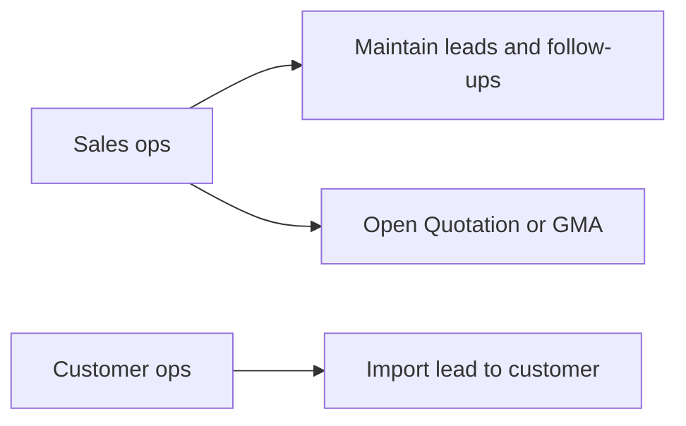
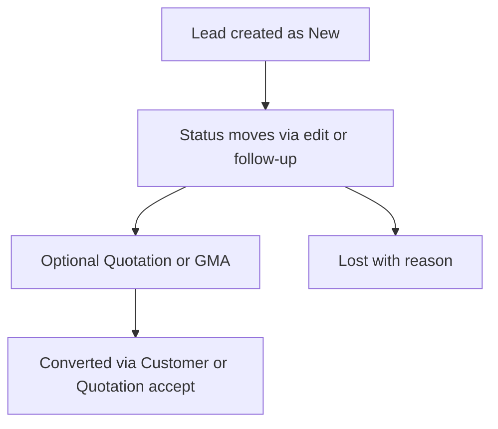
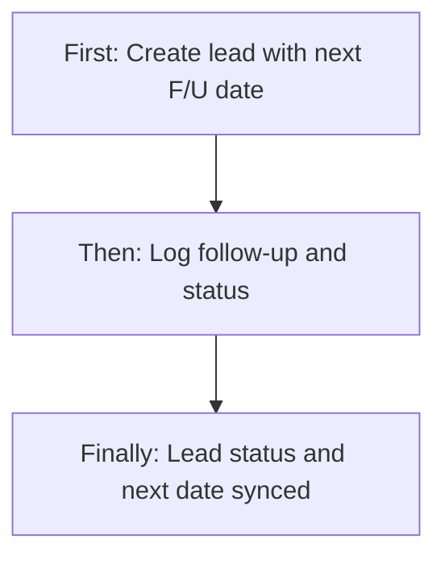
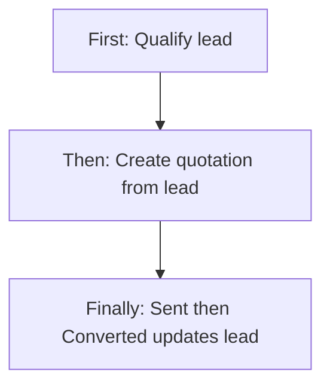
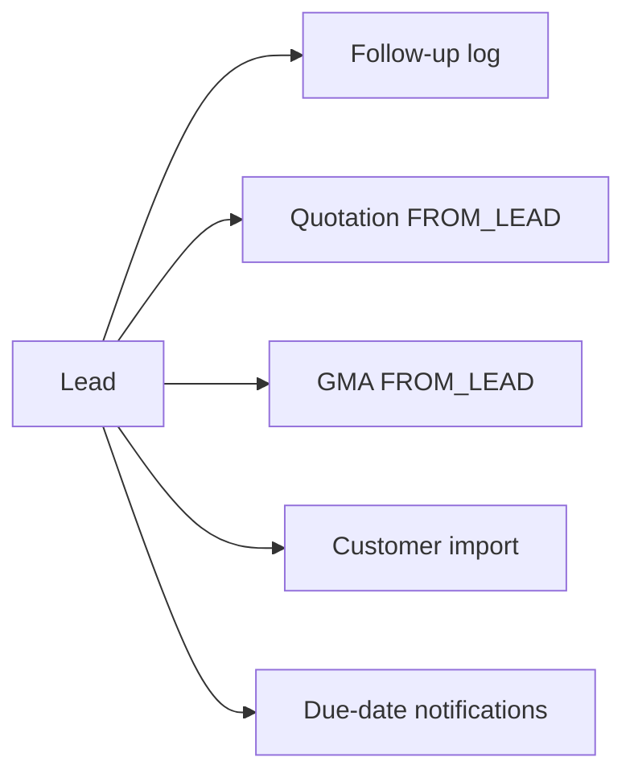
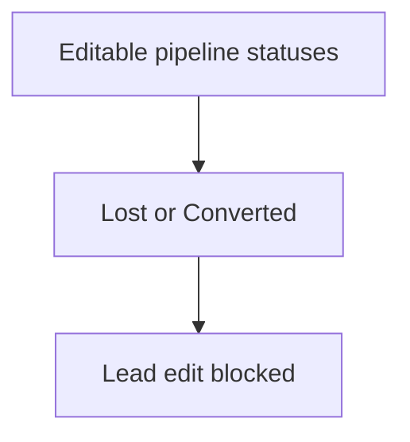

# Leads & Follow-up Management — Product & Business Documentation

## 1. Purpose & Business Need

Sales and branch teams need one place to capture **incoming demand** (who contacted us, what they want, which branch owns it) and to keep a **dated conversation trail** so opportunities do not go cold.

**Lead & Follow up Management** (sidebar label) is that pipeline. A **Lead** is the opportunity record — contact details, source, priority, product vs service interest, budget band, description, and pipeline status. A **Follow-up** is a dated interaction log against that lead: what was discussed, how contact was made, what status the lead moved to, and whether another action is scheduled.

**Outcomes today:**
- Create leads (including draft-style incomplete saves) and maintain them until Lost or Converted
- Filter and search the lead list by status, source, priority, type, branch, and date
- Log follow-ups that **update the lead’s status and next follow-up date** in the same step
- Open lead detail with a follow-up history tab; drill into a single follow-up
- Hand off into **Quotation** and **GMA** from qualified pipeline stages; convert via **Customer** import-from-lead or quotation acceptance
- Daily reminder notifications when a lead’s next follow-up date is today (except Lost / Converted)

**What this module is not:** A separate Follow-up Management permission module (removed from the catalog), lead assignment/SLA desks, hard delete/inactive of leads, Task linkage, or a dedicated “Convert to Customer” button on the lead screen.

---

## 2. Users & Roles (who uses this and why)

### 2.1 Company CEO / Owner

Full bypass of granular permissions. Can create leads, edit, log follow-ups, and open all screens.

### 2.2 Sales / CRM operators (Leads Management access)

Staff granted **Leads Management** Read / Add / Edit use the list, create/edit forms, lead view, and follow-up entry (UI gates follow-up from the list on **Edit**).

### 2.3 Branch users

Same screens when granted Leads Management; branch filter and branch field scope work to the user’s allowed branches.

### 2.4 Downstream modules (no Leads write required for their own flows)

- **Quotation** / **GMA** users pick pipeline leads from their own screens
- **Customer** users can **Import from Lead** and mark the lead Converted

---

## 3. Access Control (RBAC)

### 3.1 How access works

Platform module key: **Leads Management** (`LEADS_MANAGEMENT`).

| Permission | Allows (business) |
|------------|-------------------|
| **Read** | Lead list, lead detail, lead-by-id |
| **Add** | Create Lead (header button) |
| **Edit** | Edit lead; **Follow-up** action on list rows |
| **Delete / Approve / Request / Export** | Exist in the permission catalog but **are not used** by lead or follow-up screens |

A former **Follow-up Management** module was removed from the permission catalog. Follow-up APIs remain, but they are checked against a **different authority name** than Leads Management (see Gaps). Non-CEO users who only hold `LEADS_MANAGEMENT_*` can be blocked when saving or reading follow-ups even though the UI shows those actions.

Sidebar entry: **Lead & Follow up Management** → `/leads`, shown with Leads Management **Read**.

Route protection maps `/leads`, `/add-lead`, `/lead/…`, `/add-followup`, `/follow-up-detail`, `/followup/…`, and related aliases to **Leads Management Read**.

### 3.2 Role × action matrix

| Role | View list | View detail | Add | Edit | Inactive / Delete | Submit request | Receive / act | Approve | Reject |
|------|-----------|-------------|-----|------|-------------------|----------------|---------------|---------|--------|
| Company CEO | Yes | Yes | Yes | Yes | No (not built) | No | No | No | No |
| Staff with Leads Read | Yes | Yes | No | No | No | No | No | No | No |
| Staff with Leads Add | Yes | Yes | Yes | No | No | No | No | No | No |
| Staff with Leads Edit | Yes | Yes | No | Yes (+ list Follow-up button) | No | No | No | No | No |
| Staff without Leads Management | No menu / blocked routes | No | No | No | No | No | No | No | No |

**Record-level:** List filtering can restrict by branch. Lost and Converted leads **cannot be edited** on the lead form (server rule). Follow-up create still applies whatever status the user posts (no separate approver inbox).

**UI vs route nuance:** View Lead **+ Add Follow-up**, Create Quotation, and Create GMA are not wrapped in the same Add/Edit permission checks as the list; route access only requires Read.

---

## 4. Capabilities & Features

### 4A. Lead pipeline master

Capture source, branch, priority, contact (name, mobile, alternate, email), product vs service, service type when service, budget band, description, next follow-up date, and status. IDs look like `LD-{year}-{code}`.

### 4B. Follow-up interaction log

Each follow-up stores interaction summary, contact mode, status the lead should move to, optional lost reason, and optional next scheduled date/time + agenda. Saving a follow-up **writes history and syncs selected fields onto the parent lead** (see §4E and §10).

### 4C. Lead detail with tabs

View screen shows summary chips (status, priority, source, branch, next follow-up) and two tabs: **Basic Lead Information** and **Follow-up Log**.

### 4D. Downstream handoffs from View Lead

- **Create Quotation** — for Qualified / Quotation Sent / Negotiation (hidden or disabled for New / Converted / Lost)
- **Create GMA** — similar stage gating; New shows a disabled “manager approval” style message
- **No Convert to Customer** button on the lead UI (conversion is via Customer or Quotation accept)

### 4E. Cross-compatibility of Follow-up ↔ Lead fields (core design)

Follow-up is not an isolated diary. On create, these fields are intentionally linked:

| Business concept | On Follow-up | On Lead (synced) | Compatibility rule today |
|------------------|--------------|------------------|--------------------------|
| Pipeline status | **Status updated to** | **Status** | Follow-up sets lead status to the chosen value |
| Next action date | **Next follow-up date** (and time on follow-up only) | **Next follow-up date** | Copied to lead when “Schedule next action” = Yes; **cleared on lead** when No |
| Next action time | **Next follow-up time** | *(none on lead)* | Time lives only on the follow-up row |
| Lost reason | **Lost reason** | **Lost reason** | Synced when status updated to Lost |
| Interaction / outcome text | **Interaction summary** | Shown as **Last follow-up summary** on lead responses | Derived from latest history for list/detail |
| Last interaction date | Follow-up **created** timing / scheduled date displays | **Last follow-up date** on lead response | List/detail show last activity from history enrichment |
| Contact channel | **Contact mode** | *(not stored on lead)* | Lead does not keep last contact mode |
| Agenda / reason for next call | **Reason / agenda** | *(not stored on lead)* | Only on follow-up; list “Next Action” column reads this |

**Also linked outside this module:**
| Concept | Lead field | Other module | Compatibility |
|---------|------------|--------------|---------------|
| Conversion | Status → Converted | Customer **Import from Lead**; Quotation **Accepted** | Lead locked for edit after Converted |
| Quotation progress | Status → Quotation Sent | Quotation **Sent** | Lead status updated by quotation flow |
| GMA presence | **GMA status** on lead | GMA sheet with lead link | Lead defaults to Not Created; **not kept in sync** when GMA moves |
| Quotation presence on lead list | **Quotation status** display | Quotation module | Display is stubbed as “Not Created” and does **not** reflect real quotations |
| Reminders | **Next follow-up date** | Notification “lead follow-up due” | Fires for today’s date if not Lost/Converted |

### 4F. Standalone follow-up list (secondary)

A Follow-up Management list screen exists (branch sidebar / direct route) with client-side search. It is **not** the main sidebar entry. Columns include follow-up id, lead name, a “quotation linked” display that falls back to lead id, contact mode, status, next date/time, and notes.

### 4G. Draft leads

Leads can be saved with draft-oriented status so incomplete records skip full required-field enforcement until promoted to a real pipeline status.

---

## 5. CRUD Operations

### 5.1 Create (Add)

**Who:** Staff with Leads **Add** (or CEO).

**First:** Open **Create Lead** from the list → Add Lead form.  
**Then:** Enter source, branch, priority, name, mobile, type, description (≥ 20 characters for non-draft), next follow-up date, and other optional fields. Status is fixed to **New** on the form for a normal create.  
**Finally:** Save. Lead appears on the list with id, next follow-up date, and status. Create can notify interested parties of a new lead.

**Required (non-draft business rules):** Source, branch, priority, lead name (min length), 10-digit mobile, valid email if provided, lead type, description length, next follow-up date (today or future), service type when type is Service. Mobile and email must be unique among leads.

### 5.2 Read — List

**Who:** Leads **Read**.

List loads with server pagination (page size 10). Columns: Lead ID, Lead Name, Contact Info (mobile + email), Lead Type, Next F/U Date, Lead Source, Created Date, Last F/U Date, GMA Status, Priority, Status.

Filters: statuses, sources, priorities, lead types, branches, date range. Search box (placeholder mentions Lead ID; server also supports name/mobile/email-style search). Empty state when no rows match.

Row actions: View, Edit (Edit permission), Follow-up (Edit permission). Delete is **hidden**.

### 5.3 Read — Detail / Get details

**Who:** Leads **Read**.

Opening a lead loads by id into View Lead: summary header, basic information, last follow-up summary/lost reason when present, and Follow-up Log loaded by lead id (newest first). Selecting a history row opens Follow-up Detail.

### 5.4 Update (Edit)

**Who:** Leads **Edit**.

**First:** Edit from list → Add Lead in edit mode (loads full lead by id).  
**Then:** Change editable fields and status as allowed.  
**Finally:** Save. Field-level audit is recorded server-side (no audit screen in the product UI).

**Hard stops:** Cannot edit when status is **Lost** or **Converted**. **Mobile** and **Source** are immutable after create. In **Quotation Sent** / **Negotiation**, name, lead type, and service type cannot change. Setting **Lost** requires a lost reason.

### 5.5 Inactive / Delete

**This module does not support inactive or delete for leads or follow-ups.** There is no soft-inactive flag. Terminal business states are **Lost** and **Converted**. Front-end delete helpers exist for leads/follow-ups but are not wired to working list actions and have no matching delete APIs for this flow.

---

## 6. Request & Approval Flows

**This module does not use request / approve / reject inbox flows** for leads or follow-ups.

Comments in product logic mention possible future manager approval for reactivation from Lost; that gate is **not implemented**. GMA has its own approval lifecycle; it does not drive a Leads Management approve permission.

### 6.1 Submit request
N/A for this module.

### 6.2 Receive / inbox / pending actions
N/A. Daily **follow-up due** notifications are reminders, not approval tasks.

### 6.3 Approve / Reject / Return
N/A for lead/follow-up records.

---

## 7. Forms — Add vs Edit Field Access

### 7.1 Lead — Add vs Edit

| Field (business name) | On Add | On Edit | Notes |
|----------------------|--------|---------|-------|
| Lead ID | Locked (empty until saved) | Locked | System-generated |
| Created by / Created date | Locked (display) | Locked | Audit display |
| Lead date | Locked (today) | Locked | Set on create |
| Status | Locked as New | Editable (select) | UI may show lock cosmetics; control still changes status |
| Lead source | Editable / Required | Locked | Immutable after create |
| Branch | Editable / Required | Editable (may lock if only one branch) | |
| Priority | Editable / Required | Editable | |
| Lead name | Editable / Required | Locked in UI | Server also restricts in late pipeline stages |
| Mobile number | Editable / Required | Locked | Immutable after create |
| Alternate number | Editable | Editable | |
| Email | Editable | Editable | Uniqueness rechecked on update |
| Lead type | Editable / Required | Editable (server may block late stages) | |
| Service type | Editable / Required if Service | Same | |
| Budget range | Editable | Editable | |
| Lead description | Editable / Required (length) | Editable | Lock icon may be cosmetic |
| Next follow-up date | Editable / Required | Editable | Shared concept with follow-up schedule |
| Lost reason | Hidden unless Lost | Required when status Lost | Also set via follow-up when Lost |

**Roles:** Staff without Edit never open edit from the list. View-only users can still open View Lead if they have Read.

### 7.2 Follow-up — Add (edit path incomplete)

| Field (business name) | On Add | On “Edit” attempt | Notes |
|----------------------|--------|-------------------|-------|
| Lead context (id, name, type, branch, current status) | Read-only | Read-only | Prefill from navigation state / lead fetch |
| Interaction summary | Editable / Required (≥ 10) | Same form | |
| Update lead status | Editable / Required | Same | Writes to lead status |
| Contact mode | Editable (UI required) | Same | Not always validated before submit |
| Lost reason | Shown if Lost | Same | Syncs to lead |
| Schedule next action | Yes / No | Same | Controls date/time + lead next date |
| Next follow-up date / time | Required if Yes | Same | Date syncs to lead; time follow-up-only |
| Reason / agenda | If scheduled | Same | Follow-up only |

There is **no working follow-up update API**. The Add Follow-up screen can enter an “edit” mode from state, but the update call does not match a supported backend update — treat follow-ups as **append-only** in practice.

---

## 8. Lists, Dropdowns, Details & Data Rendering

### 8.1 List rendering

**Leads:** Server page/size, filters as above, format dates for next/last follow-up. GMA status and priority shown as labels. Refresh on navigate/filter change.

**Follow-up list (secondary):** Loads a flat follow-up collection; search is client-side; no server pagination parameters in the UI.

### 8.2 Dropdowns & lookups

| Control | Options / source | Dependents |
|---------|------------------|------------|
| Lead source | Website, Referral, Walk In, Cold Call, Social Media, Exhibition, Partner | — |
| Priority | Low, Normal, High, Urgent | — |
| Lead type | Product, Service | Service type appears when Service |
| Service type | Contract, Product Purchase, Jobbing | |
| Budget range | Under 5K … Over 50K, Not Discussed | |
| Branch | Current user’s branches | |
| Status (edit / follow-up) | Draft, New, Qualified, Quotation Sent, Negotiation, Converted, Lost | Lost reason when Lost |
| Contact mode (follow-up) | Call, Meeting, Site Visit, Email, WhatsApp, Other | |
| Lead dropdown (other modules) | Pipeline statuses Qualified / Quotation Sent / Negotiation (and quotation-specific lead dropdown) | Used by Quotation / Customer import |

### 8.3 Detail / get-details rendering

- Lead by id fills View Lead and Edit prefill.
- Follow-ups by lead id fill the Follow-up Log; mapping tolerates alternate property names (`dateExecuted`, `followUpType`, `leadStatus`) for older/mismatched shapes — primary fields are `nextFollowUpDate`, `contactMode`, `statusUpdatedTo`, `interactionSummary`, `reasonAgenda`.
- Follow-up by id fills Follow-up Detail (summary, previous→new status display, schedule block, agenda).
- View Lead “Due in …” uses a **hardcoded fallback** when due-days are not supplied.
- Follow-up Log header may show a **hardcoded completed count** rather than the live list length.

---

## 9. How It Works (end-to-end user flows)

### 9.1 Sales operator — Create lead and first follow-up

**First:** Open Lead & Follow up Management → Create Lead → fill contact, interest, next follow-up date → save.  
**Then:** From the list (or View Lead), open Add Follow-up → record call/meeting, set status (e.g. Qualified), choose whether to schedule next action.  
**Finally:** Lead list shows updated status, next F/U date, and last F/U date/summary; history appears on View Lead.

### 9.2 Sales operator — Move toward quotation

**First:** Qualify the lead (edit status or follow-up).  
**Then:** On View Lead, Create Quotation (when stage allows).  
**Finally:** When quotation is sent, lead becomes Quotation Sent; on accept, Converted (and lead edit is blocked).

### 9.3 Customer ops — Convert without quotation button on lead

**First:** In Customer entry, choose Import from Lead and pick the lead.  
**Then:** Complete customer create (non-draft).  
**Finally:** Lead status becomes Converted; further lead edits are refused.

### 9.4 Any authorized user — Follow lead until Lost

**First:** Log follow-ups while working the opportunity.  
**Then:** Set status Lost with reason (on edit or follow-up).  
**Finally:** Lead stops receiving due reminders; edit is blocked.

---

## 10. Cross-Module Interactions

| Module | Interaction |
|--------|-------------|
| **Follow-up (same area)** | Child history; syncs status, next date, lost reason onto lead |
| **Quotation** | Source From Lead requires lead id; send → Quotation Sent; accept → Converted; quotation lead dropdown uses pipeline statuses |
| **GMA** | Can reference lead id; lead’s GMA status field is **not** maintained in lockstep |
| **Customer / Contract** | Import from Lead sets Converted and stores lead id on customer |
| **Branch** | Lead branch id; names shown on responses |
| **Notifications** | New lead, status change, follow-up due |
| **Task Management** | **No** lead link |
| **Vendor / Stock / PO** | **No** direct lead link |

**Field compatibility across modules (summary):**

| Shared idea | Lead | Follow-up | Quotation / Customer / GMA |
|-------------|------|-----------|----------------------------|
| Lead identity | Lead ID | Lead ID (parent) | `leadId` on import / From Lead documents |
| Pipeline status | Status | Status updated to → writes lead | Quotation/Customer overwrite to Quotation Sent / Converted |
| Next contact date | Next follow-up date | Next date when scheduled | Not used by quotation/customer |
| Lost | Lost reason + status | Same via follow-up | Reminder scheduler skips Lost |
| Contact person | Name, mobile, email on lead | Not duplicated | Customer import can pull from lead |
| Assignment owner | Column reserved, **unused** | — | — |

---

## 11. Data the Business Cares About

### Lead
- Identity: Lead ID, lead date, created/updated by and when  
- Ownership context: Branch (assignment-to-user field exists in storage but is **not used** in forms/APIs)  
- Source & priority  
- Contact: name, mobile, alternate, email  
- Interest: lead type, service type, budget range, description  
- Pipeline: status (Draft, New, Qualified, Quotation Sent, Negotiation, Lost, Converted)  
- Scheduling: next follow-up date  
- Outcomes: lost reason; last follow-up date/summary (presentation)  
- Related flags: GMA status (often stale), quotation status display (stub)

### Follow-up
- Follow-up ID (`FP-…`)  
- Parent lead  
- Interaction summary, contact mode  
- Status updated to, lost reason  
- Next action scheduled flag, next date/time, reason/agenda  
- Created by / created at  

### Statuses (lead lifecycle)

Draft → New → Qualified → Quotation Sent → Negotiation → Converted  
                              ↘ Lost  

Transitions are **not** strictly enforced as a graph; Lost/Converted mainly lock further edits. Follow-up may set any status value including Converted/Lost directly.

---

## 12. Rules, Validations & Constraints

- Unique mobile and email on leads (drafts may omit them)  
- Non-draft required set as in §5.1; DB-level check reinforces non-draft required fields  
- Next follow-up date on lead create: today or future  
- Follow-up interaction summary minimum length; next date today/future when scheduled  
- Cannot edit lead in Lost or Converted  
- Mobile and source immutable after create  
- Late-stage restrictions on name / type / service type  
- Lost requires reason  
- Follow-up create always updates lead status to “status updated to”  
- Reminder job: next follow-up date = today and status not Lost/Converted  

---

## 13. Loopholes, Gaps & Current Limitations

1. **Permission name mismatch on follow-ups** — Follow-up create/read checks `LEAD_MANAGEMENT_*` while the real module is `LEADS_MANAGEMENT_*`. Non-CEO users can see Follow-up UI yet fail API calls.
2. **Follow-up Management module removed** — No separate RBAC module; everything should hang off Leads Management, but authorities were not fully aligned.
3. **Follow-up is create + read only** — No update/delete. UI still exposes update/delete client helpers and an edit mode that cannot succeed end-to-end.
4. **Standalone follow-up list API mismatch** — List screen calls a collection GET that the follow-up API does not implement as a paginated “all follow-ups” resource (by-id and by-lead only).
5. **Lead assignment unused** — Assigned-to column exists but never appears on forms or responses.
6. **No lead delete / inactive** — Delete UI hidden; no soft inactive.
7. **Edit lock cosmetics** — Banner/lock icons suggest read-only fields; several selects/text areas remain editable; server enforces a stricter subset.
8. **Quotation status on lead always “Not Created”** — Cross-module display is not compatible with real quotation data.
9. **GMA status on lead not synced** — Cross-module field present but stale.
10. **View Lead UX stubs** — Hardcoded “5 completed” and fallback “Due in 2 Days”.
11. **Column mislabel** — Follow-up tables label contact mode as “Contract Type”.
12. **Dead / shell screens** — Unrouted lead detail alternate; CRM dashboard routes that show mock lead/follow-up dashboards; breadcrumb path `/follow-ups` without a matching route; main sidebar does not list the standalone follow-up page.
13. **No Task integration; no Convert CTA on lead** — Conversion is indirect.
14. **Ungated View Lead actions** — Add Follow-up / Quotation / GMA not permission-wrapped like list actions.
15. **Lead dropdown without the same Read gate** as the main list API — broader exposure than the secured list.
16. **Unused category/pest enums** — Defined in the lead domain but not on forms.

---

## 14. Existing Functionality Summary

Fully available today for authorized users (subject to the follow-up authority bug):

- Lead create (including draft path), list with filters/search/pagination, detail, edit with status and field rules  
- Follow-up create that syncs status, next follow-up date, and lost reason onto the lead  
- Follow-up history on the lead and follow-up detail by id  
- Handoff buttons to Quotation and GMA from appropriate statuses  
- Conversion via Customer import-from-lead and Quotation acceptance  
- Due-date reminder notifications  
- Unique contact constraints and Lost/Converted edit locks  

Not available: request/approve for leads, assignment desks, SLA timers, lead/follow-up delete or inactive, reliable follow-up update, live quotation/GMA status mirrors on the lead card, Task links, or a dedicated Convert button on the lead UI.

---

## 15. Reference — APIs, Screens & UI Actions

### 15.1 APIs

| Method | Path | Purpose (plain language) | Used by (screen/flow) |
|--------|------|--------------------------|------------------------|
| POST | `/api/v1/leads` | Create lead | Add Lead |
| PUT | `/api/v1/leads?id=` | Update lead | Edit Lead |
| GET | `/api/v1/leads` | Paginated lead list + filters | Lead list |
| GET | `/api/v1/leads/by-id?id=` | Lead detail | View Lead, Edit prefill, Follow-up context |
| GET | `/api/v1/leads/dropdown` | Lightweight lead pick list | Customer import / other pickers |
| POST | `/api/v1/follow-ups` | Create follow-up; sync lead | Add Follow-up |
| GET | `/api/v1/follow-ups/lead?leadId=` | Follow-ups for one lead | View Lead log, Follow-up Detail tab |
| GET | `/api/v1/follow-ups?id=` | One follow-up | Follow-up Detail |
| GET | `/api/v1/quotations/dropdowns/leads` | Leads eligible for quotation | Add Quotation |
| (other modules) | Customer create with import-from-lead; Quotation send/accept | Set lead Converted / Quotation Sent | Customer / Quotation flows |

**Authorities (as coded):** Leads APIs use `LEADS_MANAGEMENT_ADD|EDIT|READ` (or CEO). Follow-up APIs use `LEAD_MANAGEMENT_ADD|READ` (or CEO) — note singular `LEAD_`.

### 15.2 Frontend Screen Routes

| Route | Screen purpose | Primary users |
|-------|----------------|---------------|
| `/leads` | Lead list (main entry) | Sales with Leads Read |
| `/add-lead` | Create / edit lead | Add / Edit |
| `/lead/:leadId` | View lead + follow-up log | Read |
| `/add-followup` / `/add-follow-up` | Log follow-up | Edit (list) / Read (view) |
| `/follow-up-detail` / `/followup/:followupId` | Follow-up detail | Read |
| `/follow-up-management` | Standalone follow-up list (secondary) | Branch sidebar / direct |
| `/lead-management`, `/followup-management`, `/follow-up-dashboard` | CRM shell dashboards (not the live lead list) | — |

### 15.3 Click Events, Filters, Search & Controls

| Screen / Route | Control | Type | What happens |
|----------------|---------|------|--------------|
| `/leads` | Create Lead | Button | Goes to Add Lead if Add allowed |
| `/leads` | Search | Text | Server search param |
| `/leads` | Status / Source / Priority / Type / Branch / Date filters | Filter panel | Refetch list with query params |
| `/leads` | Pagination | Pager | `pageNo` / `pageSize` |
| `/leads` | View | Row action | Opens View Lead |
| `/leads` | Edit | Row action | Opens Add Lead in edit mode if Edit allowed |
| `/leads` | Follow-up | Row action | Opens Add Follow-up with lead context if Edit allowed |
| `/add-lead` | Lead source, branch, priority, type, service type, budget, status | Selects | Set lead attributes; status mainly on edit |
| `/add-lead` | Next follow-up date | Date | Required on create; shared with follow-up schedule concept |
| `/add-lead` | Lost reason | Text | When status Lost |
| `/add-lead` | Submit / Update | Button | Create or update lead |
| `/lead/:id` | Basic / Follow-up Log tabs | Tabs | Switch detail vs history |
| `/lead/:id` | + Add Follow-up | Button | Navigate to Add Follow-up |
| `/lead/:id` | Create Quotation / Create GMA | Buttons | Navigate with lead context when stage allows |
| `/lead/:id` | History row View | Action | Open Follow-up Detail |
| `/add-followup` | Update lead status | Select | Becomes lead status on save |
| `/add-followup` | Contact mode | Select | Stored on follow-up only |
| `/add-followup` | Schedule next action Yes/No | Toggle | Shows/hides next date/time/agenda; clears or sets lead next date |
| `/add-followup` | Next date / time / agenda | Date/time/text | Follow-up schedule; date synced to lead if Yes |
| `/add-followup` | Save | Button | Create follow-up (update path not supported server-side) |
| `/follow-up-detail` | Add Follow-up | Button | Another follow-up for same lead |
| `/follow-up-management` | Search | Text | Client-side filter of loaded rows |
| `/follow-up-management` | + Add Follow-Up | Button | Add follow-up when Add allowed |
