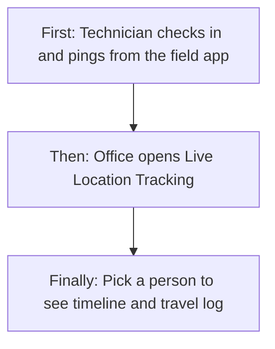
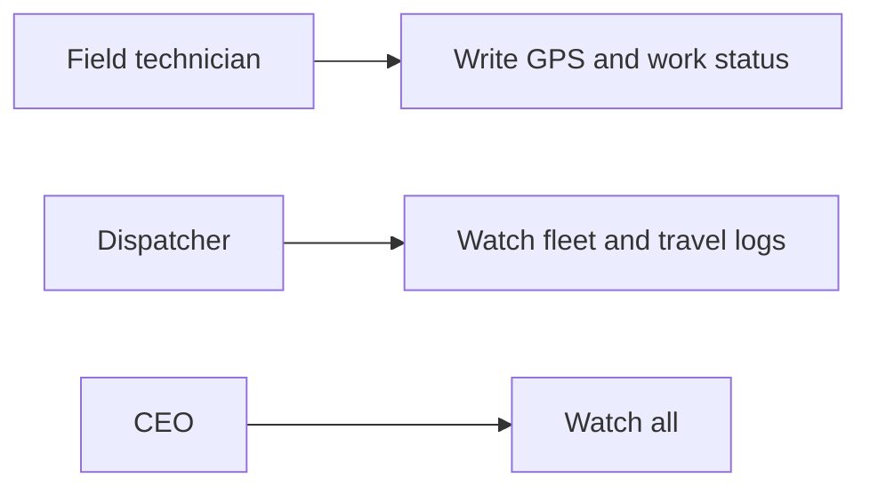
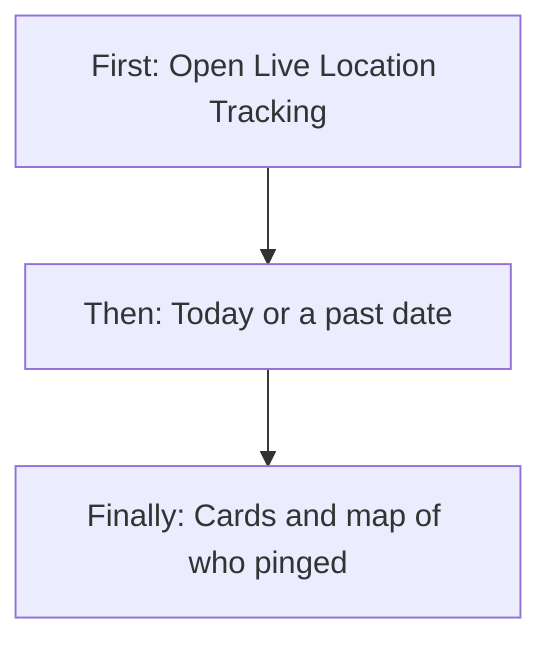
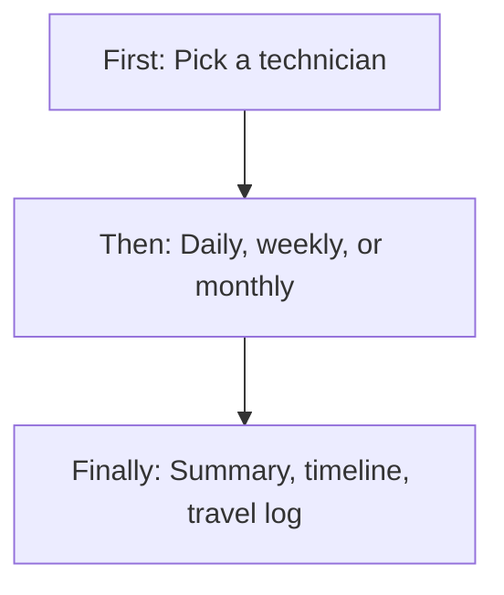
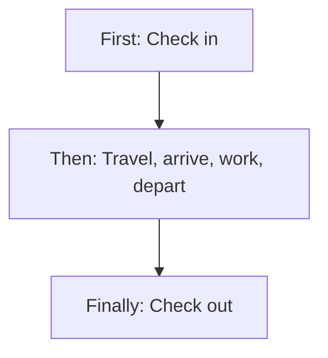
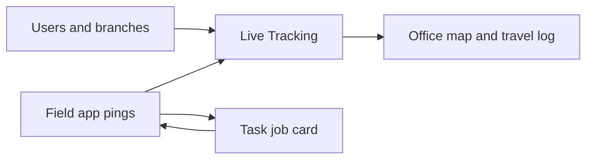
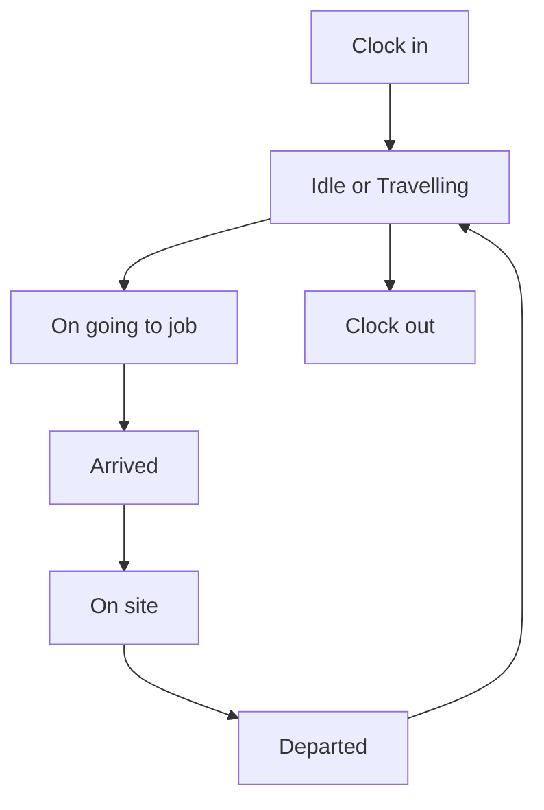

# Live Tracking Management — Product & Business Documentation

This document describes **Live Tracking** as it exists today. It is written so a dispatcher, branch supervisor, CEO, or tester can understand **who appears on the map**, **how a technician’s day is recorded from the field app**, **what Offline means**, and **how a travel log is built**. Office users **watch**; they do not type GPS points.

**Menu today:** Operations → **Live Location Tracking** (main screen). The same Operations group also shows **Performance Analytics**; that screen uses a **different** right (see §3).

Related: [Task Management](./task-management.md) (job cards the technician travels to), [Employee Management](./employee-management.md) (people and branches).

---

## 1. Purpose & Business Need

A pest-control (or similar field) company needs to know **where technicians are**, **whether they are travelling or on site**, and **what they did that day** — without calling each person.

**Live Tracking** is the **office watch desk**. The field app records GPS and work status (check-in, ping, start travel, arrived, on site, departed, check-out). The office screen shows the **latest point for each person who pinged that date**, a map, and (after picking a person) a **summary, timeline, and travel-log table**.

**Outcomes today:**

- Fleet list + map for a chosen date (today = live snapshot, or any past day with pings)
- Filter by the viewer’s branches; search the list by name / task / customer
- Open one technician: distance, active time, tasks done, clock-in, timeline, travel legs, route line
- Period on the profile: Daily / Weekly / Monthly
- Field app writes every location and status change (this is how data is born)

**What this module does not do:** it does not create job cards, assign technicians, or edit GPS history. The office cannot Add / Edit / Delete tracking rows. There is **no request / approve**. People who never checked in that day **do not appear** on the fleet list.

---

## 2. Users & Roles (who uses this and why)

| Who | Why |
|-----|-----|
| **CEO** | Full watch: fleet, map, any technician travel log |
| **Dispatcher / branch supervisor with Live Tracking View** | Same watch screens for people who pinged; branch filter uses that user’s branch list |
| **Field technician (application user)** | Does **not** use the office fleet screen to publish location. The **field app** check-in / ping / travel / arrive / on-site / depart / check-out **creates** the points the office sees |
| **No Live Tracking View** | **Live Location Tracking** hidden in Operations |
| **Performance Analytics viewer** | Separate right (Technician Performance View). Menu item currently sits under Live Tracking (see §3 and §13) |

---

## 3. Access Control (RBAC)

Login role plus **Live Tracking** rights. CEO bypasses.

Office live-tracking services only check **View**. Add / Edit / Delete may exist on the role screen for this module but **are not used** on the fleet page or on the live-tracking services.

Field writes require the person to be an **application (field) user**. They do **not** need Live Tracking View to ping.

| Role / right | View list | View detail | Add | Edit | Inactive / Delete | Submit request | Receive / act | Approve | Reject |
|--------------|-----------|-------------|-----|------|-------------------|----------------|---------------|---------|--------|
| CEO | Yes | Yes | No office create | No | No | No | No | No | No |
| Live Tracking **View** | Yes | Yes | No | No | No | No | No | No | No |
| Live Tracking Add / Edit / Delete only (no View) | Menu hidden | Route blocked | — | — | — | — | — | — | — |
| Field application user | No office fleet (unless they also have View) | No | **Yes — field pings only** | No | No | No | No | No | No |

**Record-level:** the fleet list is **everyone who recorded a point on that date** (then filtered by branch if chosen). It is **not** “only my team” beyond the branch filter. Branch filter matches if the **person’s assigned branches include** the chosen branch (not only their first branch). The branch **name** shown on the card is the **first** assigned branch.

**Performance Analytics** (Operations → Performance Analytics): the menu is gated by **Live Tracking View**, but the numbers load only if the user also has **Technician Performance View** (CEO included). See §4.4 and §13.

---

## 4. Capabilities & Features

### 4.1 Fleet live snapshot (list + map)

**Who:** anyone with Live Tracking View.  
**When:** opening Operations → Live Location Tracking.

The left pane is **Fleet Live Snapshot**. The right pane is the **map** with one marker per person on the (filtered) list.

**First:** choose date (default today; cannot pick a future day). Quick picks: **Today (Live)** and **Yesterday**.  
**Then:** optionally pick a branch (from the signed-in user’s branches) and type a list filter.  
**Finally:** cards and markers show people who have at least one location record that date. Empty list: “No technicians found”.

Each card shows: name, a status pill, branch, site (or “-”), customer, and task id when the latest ping is tied to a job.

### 4.2 Status the office cares about

The field app stores a **work status** on every point. The office also computes **Offline**.

| Status (as stored) | Easy meaning | Typical next |
|--------------------|--------------|--------------|
| **Clock in** | Shift started | Idle / Travelling / start travel to a task |
| **Idle** | Still near the last point (about 100 m) | Travelling or start travel |
| **Travelling** | Moved more than about 100 m, **not** on a task yet | Idle or start travel |
| **On going** | Going **to a chosen task** | Arrived |
| **Arrived** | At the customer site | On site |
| **On site** | Working | Departed |
| **Departed** | Left that job | Idle / Travelling / next task / clock out |
| **Clock out** | Shift ended | Must clock in again before pings |
| **Offline** (computed) | Clocked out, **or** last point older than **30 minutes** | Appears greyed; not a separate field ping |

**Active** on the office tabs = not Offline. The list still shows **everyone** for the date unless you use search (see §13: Active / Offline tabs do not hide cards).

On the map, the screen mainly styles **On site**, **Travelling**, **Idle**, and **Offline**. Other stored statuses (Clock in, On going, Arrived, Departed) may show as a generic / offline-looking badge.

### 4.3 Technician profile (summary, timeline, travel log, route)

**Who:** View user.  
**When:** click a fleet card, click a map marker, or pick a name in **Technician**.

The left pane switches to that person. **Back to Dashboard** returns to the fleet list.

**Period:** Daily (that date), Weekly (Monday–Sunday of that date), Monthly (1st–last of that month). Date cannot be in the future.

**Summary cards:**

| Card | Meaning |
|------|---------|
| **Distance** | Sum of straight-line distance between **every consecutive GPS point** in the period (kilometres, 2 decimals) |
| **Active** | Time from **first** point to **last** point in the period (not “moving only”) |
| **Tasks done** | How many **different jobs** have a **Departed** point in the period |
| **Clock in** | Time of the first **Clock in** event on the timeline (or “—” if none) |

**Timeline:** one row when **status or task changes** (not every 10-minute ping). Shows time, status label, site · customer, and task / service when known. Empty: “No timeline available for this technician.”

**Travel log table** (under the map): one row per **On going → Arrived** pair for the **same job**. Columns: date, departure, destination, customer, task, distance, duration, start, end, status. Departure is always labelled **Previous location**. Destination is the job’s **site name** (or “Task site”). Empty: “No travel log entries for this date.”

**Map in profile:** markers for that person; a route line from timeline points (status-change positions). If the timeline has no coordinates, the screen asks for the **latest point** for that person and date (a single marker, not a full breadcrumb).

### 4.4 Performance Analytics (same Operations group)

**Who:** menu visible with Live Tracking View; **data** needs Technician Performance View.

**What it is:** a **score and KPI desk** (completion, utilisation, rating, revenue, re-task, materials) — **not** a live map. List: Technician Performance & Productivity. Eye icon opens that person’s lifetime profile.

This is **not** CRUD of tracking points. Full KPI maths belong with that screen; Live Tracking only shares the Operations menu.

### 4.5 Leftover / mock screens (not the live product)

These routes still exist but are **not** on the Operations menu:

| Route | What you see |
|-------|----------------|
| Tracking map | Sample technicians and sample travel rows (not live GPS) |
| Technician live tracking list | Sample staff table; eye opens a sample map week |
| Live tracking detail | Sample Bangalore pins if opened with staff in hand |

Do **not** treat these as the live fleet. Use **Live Location Tracking** only.

---

## 5. CRUD Operations

This module has **no office Add / Edit / Delete** of location history. “Create” is the field app writing points. “Read” is the office watch desk.

### 5.1 Create (field app only — office has no Add)

**Who:** field application user.  
**When:** during the shift.

**First:** **Check in** with current latitude / longitude. Without this, periodic pings are refused (“Check in before sending periodic location pings”).  
**Then:** the app sends a **ping** about every 10 minutes (product intent). If the person is not already On going / Arrived / On site, the system sets **Idle** (moved ≤ about 100 m) or **Travelling** (moved more). On a task workflow, pings **repeat** the same status and job.  
**Then (job):** **Start travel** to a task (must confirm start-travel). Status becomes **On going**. That job is set to **In progress** on Task Management. Cannot start another job until **Departed**. Cannot start travel while **Clocked out**.  
**Then:** **Arrived** (only after On going, same job) → **On site** (only after Arrived) → **Departed** (only after On site). **Departed** marks that job **Completed** on Task Management (actual end time set).  
**Finally:** **Check out** (Clock out). Further pings require check-in again.

Success: a new location row exists; the office fleet (for that date) can show the latest one.

There is **no** office form to invent a technician on the map.

### 5.2 Read — List (fleet)

**Who:** Live Tracking View / CEO.  
**How it loads:** opening Live Location Tracking loads today’s rows. Changing date or branch reloads.

**Who appears:** only people with **at least one** location row that date. Latest row per person drives the card (status, site, customer, task, coordinates, time).

**Sort:** live (not Offline) first, then newest point first.

**Filters / search:**

| Control | Effect |
|---------|--------|
| Date | That calendar day (server local day + UTC day bounds) |
| Today / Yesterday | Sets the date |
| Branch | People whose **assigned branches include** that branch |
| Filter list | **On screen only** — name, task id, customer |
| Active / All / Offline tabs | Counts update; **list is not filtered** (gap) |
| Technician dropdown | Directory of technician-role users; picking one opens the profile even if they are not on today’s list |

**Empty:** “No technicians found”. No paging — full day list.

### 5.3 Read — Detail / Get details

**Who:** same as list.  
**How:** click card / marker / technician dropdown.

Loads that person’s **travel log** for Daily / Weekly / Monthly around the profile date (copied from the fleet date when you first open them). Fills name, date range, summary, timeline, travel table, and map route.

If they have no points in the period: summary zeros / dashes, empty timeline, empty travel log.

### 5.4 Update (Edit)

**This module does not use office Edit.** Location rows are not correctable on the web. Role **Edit** on Live Tracking does not unlock a form.

Field users cannot “edit” an old ping; they only **add** a new point.

### 5.5 Inactive / Delete

**This module does not inactive or delete** tracking history. There is no confirm-delete on the fleet screen. If a user or task is removed in another module, the database may block or clear the task link; the office has no delete button here.

---

## 6. Request & Approval Flows

This module does **not** use request / approve. Watching location does not create an inbox item. Field pings are saved immediately.

---

## 7. Forms — Add vs Edit Field Access

There is **no** office Add or Edit form for Live Tracking. The fleet page is filters + list + map + profile.

Field “forms” are the app actions (all require valid latitude / longitude):

| Action (business name) | On field create | On office | Notes |
|------------------------|-----------------|-----------|-------|
| Latitude / longitude | Required | Shown read-only on map / timeline | Office cannot type them |
| Check in | Required to start the day | Visible as Clock in on timeline | |
| Periodic ping | After check-in | Feeds latest point + distance | Idle vs Travelling from movement |
| Start travel + task | Required; must confirm start | Card shows that task’s customer / site | Sets job **In progress** |
| Arrived flag | Must be yes | Timeline Arrived | Only after On going |
| On site | After Arrived, same task | Timeline On site | |
| Departed | After On site, same task | Counts as **Tasks done** | Sets job **Completed** |
| Check out | Ends shift | Treated as Offline | |
| Date / branch / search | — | Editable filters | Date max = today |
| Period Daily / Weekly / Monthly | — | Profile only | |

**Never accessible to office roles:** inventing GPS, changing status by hand, deleting a ping.

---

## 8. Lists, Dropdowns, Details & Data Rendering

### 8.1 List rendering

| Item | Behaviour |
|------|-----------|
| Columns / cards | Not a grid: **cards** — name, status pill, branch, site, customer, task |
| Map | One marker per listed person (valid coordinates) |
| Sort | Not Offline first, then latest time |
| Pagination | None |
| Refresh | **No auto-refresh.** Change date/branch/tab or leave and return. “Today (Live)” is the label, not a ticking feed |
| Loading / error | Failed load → empty list and zero counts |

### 8.2 Dropdowns & lookups

| Control | Options | Search | Depends on |
|---------|---------|--------|------------|
| Branch | “All Branches” + signed-in user’s branches | Select | User’s branch list |
| Technician | Users with technician role (directory) | Select | Independent of who pinged today |
| Period (profile) | Daily, Weekly, Monthly | — | Profile open |
| Date | Calendar, max today | — | Fleet or profile |

The **Filter list** box is free text, not a dropdown. It does **not** call the server search (the server can search name / employee id / username, but the screen does not send it).

### 8.3 Detail / get-details rendering

Opening a person fills: display name (from travel log, else card, else directory), period range, four summary cards, timeline (status/task changes only), travel-log table (On going→Arrived legs only), map + route.

If the person is not on today’s fleet (picked from directory): profile still loads; map may use the last timeline point; branch on a synthetic pin may show “-”.

---

## 9. How It Works (end-to-end user flows)

### 9.1 Dispatcher — Watch today’s fleet

**First:** Operations → Live Location Tracking (needs View).  
**Then:** Date = Today (Live); optionally branch and search.  
**Finally:** cards + map of everyone who pinged today. Offline people still listed (last known pin).

### 9.2 Dispatcher — One technician’s day

**First:** click a card, marker, or Technician name.  
**Then:** choose Daily / Weekly / Monthly and a date.  
**Finally:** read distance, active time, tasks done, clock-in, timeline, travel table, and route. Back to Dashboard returns to the fleet.

### 9.3 Field technician — Shift that the office can see

**First:** Check in (GPS).  
**Then:** pings while idle or travelling; start travel to a job; arrived; on site; departed (job completes); next job or check out.  
**Finally:** office sees latest status on the fleet and the day’s timeline / travel legs on the profile.

### 9.4 Dispatcher — Yesterday’s history

**First:** Yesterday (or any past date ≤ today).  
**Then:** same list/map from that day’s last points.  
**Finally:** open a person; set Daily to that date (or Weekly/Monthly around it) for the log.

There is **no** inactive/delete journey and **no** request/approve journey.

---

## 10. Cross-Module Interactions

| Other area | Handoff |
|------------|---------|
| **Field app** | Only writer of GPS + status |
| **Task Management** | Start travel needs a real job id; sets that job **In progress**. **Departed** sets that job **Completed** (times filled). Card shows task number, customer, site, service from the job |
| **Users / roles** | Name, employee id, technician directory, assigned branches |
| **Branches** | Filter and card branch label |
| **Performance Analytics** | Same Operations menu; **different** View right and different numbers (not live GPS) |

Live Tracking does **not** post invoices, stock, or attendance by itself. Clock in / out here is **tracking status**, not the HR attendance register.

---

## 11. Data the Business Cares About

| Name | Meaning |
|------|---------|
| Person / employee id | Who is on the map |
| Branch name / city / type | First assigned branch on the card |
| Work status | Clock in → … → Clock out (see §4.2) |
| Offline | Clock out **or** last point older than 30 minutes |
| Last recorded time | When the latest point was saved |
| Latitude / longitude | Last known position |
| Job / task number | Job on the latest point (if any) |
| Customer / site / service | From that job |
| Period from–to | Daily = that day; Weekly = Mon–Sun; Monthly = calendar month |
| Distance (km) | Sum of hop-to-hop GPS distance |
| Active minutes | First point to last point |
| Tasks done | Distinct jobs with Departed |
| Timeline event | Status or job **changed** |
| Travel leg | On going until Arrived on the same job |

---

## 12. Rules, Validations & Constraints

| Rule | Outcome |
|------|---------|
| Office user without View | Menu / route blocked |
| Field ping without check-in | Refused |
| Ping after clock out | “Check in to continue” |
| Start travel without check-in | Refused |
| Start travel while On going / Arrived / On site | Finish current job (depart) first |
| Start travel / arrive / on site / depart with unknown job | Job not found |
| Arrive not after On going | Refused |
| On site not after Arrived | Refused |
| Departed not after On site | Refused |
| Task id on arrive/on-site/depart must match the open job | Conflict |
| Start travel confirm not yes | Refused |
| Latitude / longitude out of range | Refused |
| Fleet date in the future | Date control blocks (max today) |
| No pings that day | Empty fleet |
| Fewer than two points in a period | Distance 0; active 0; tasks done 0 |
| Travel log | Only complete **On going → Arrived** same job; incomplete travel has **no** table row |
| Idle vs Travelling | About **100 m** from last point |
| Offline | Clock out **or** last point older than **30 minutes** |
| Weekly period | Monday–Sunday of the chosen date |
| Deleted user / job link | Friendly “technician / task no longer exists” on constraint |

---

## 13. Loopholes, Gaps & Current Limitations

1. **No auto-refresh** — “Today (Live)” does not poll; the map can be stale until the user changes a filter or reopens the page.
2. **Active / All / Offline tabs** update counts but **do not hide cards**. The screen also sends a status query the server **does not use**.
3. **List search is local only** (name / task / customer). Server search (name / employee id / username) is unused.
4. **Map badges** highlight On site / Travelling / Idle / Offline. **On going**, **Arrived**, **Clock in**, **Departed** may look like a generic/offline pin.
5. **Route is not every ping** — timeline uses status/job **changes**; the routes call returns only the **latest** point, not a full breadcrumb.
6. **Travel log** skips legs that never reach Arrived; departure is never a named branch (“Previous location”).
7. **Distance / active time** include idle jitter and the whole first-to-last span (not “moving hours” only).
8. **People who never checked in that day are invisible** on the fleet (they can still be opened from the Technician dropdown with an empty log).
9. **Departed completes the job** on Task Management without the office complete screen (forms / photos). Start travel sets the job **In progress** (not only “travel started”).
10. **Leftover mock routes** (`/tracking-map`, `/Live-Tracking-Location`, `/live-tracking-detail`) show sample staff/maps — easy to confuse with live data if bookmarked.
11. **Performance Analytics** appears under Live Tracking View, but numbers need **Technician Performance View**. Opening the page with only Live Tracking can show empty KPIs / failed load. Employee profile opened without a row can fall back to a default person.
12. **Add / Edit / Delete** on the Live Tracking role have **no office buttons**.
13. **No export** of travel log from this screen.
14. Sample branch/technician lists remain in unused map files; the live page loads real branches and users.

---

## 14. Existing Functionality Summary

Fully available: field check-in / ping / task travel / arrive / on-site / depart / check-out; office fleet list + map by date and branch; technician profile with Daily/Weekly/Monthly summary, timeline, travel-log table, and route from timeline points; CEO and Live Tracking View.

Not available: office create/edit/delete of GPS; request/approve; auto-refresh live feed; filtering the list by Active/Offline; named depot-to-site legs; full ping polyline; travel-log export; using leftover mock tracking pages as production.

---

## 15. Reference — APIs, Screens & UI Actions

### 15.1 APIs

| Method | Path | Purpose (plain language) | Used by (screen/flow) |
|--------|------|--------------------------|------------------------|
| GET | `/api/v1/live-tracking/dashboard` | Latest point per technician for a date; optional branch, search, offline-after-minutes (default 30) | Live Location Tracking list |
| GET | `/api/v1/live-tracking/routes` | Latest map point per person for a date; optional user ids | Profile map fallback |
| GET | `/api/v1/live-tracking/technicians/{userId}/travel-log` | Summary, timeline, travel legs for Daily / Weekly / Monthly | Technician profile |
| POST | `/api/v1/mobile/technician-tracking/check-in` | Shift clock in | Field app |
| POST | `/api/v1/mobile/technician-tracking/ping` | Periodic GPS | Field app |
| POST | `/api/v1/mobile/technician-tracking/task/start-travel` | Start travel to a job | Field app |
| POST | `/api/v1/mobile/technician-tracking/task/arrived` | Arrived at site | Field app |
| POST | `/api/v1/mobile/technician-tracking/task/on-site` | Working on site | Field app |
| POST | `/api/v1/mobile/technician-tracking/task/departed` | Left site (job completed) | Field app |
| POST | `/api/v1/mobile/technician-tracking/check-out` | Shift clock out | Field app |
| GET | `/api/v1/technician-performance/summary` | Org KPI cards (needs Performance View) | Performance Analytics |
| GET | `/api/v1/technician-performance/dashboard` | Ranked technician table | Performance Analytics |
| GET | `/api/v1/technician-performance/employee` | One person lifetime KPIs | Employee performance |

Live-tracking GETs: CEO or `LIVE_TRACKING_MANAGEMENT_READ`. Field POSTs: `APPLICATION_USER`. Performance GETs: CEO or `TECHNICIAN_PERFORMANCE_READ`.

### 15.2 Frontend Screen Routes

| Route | Screen purpose | Primary users |
|-------|----------------|---------------|
| `/fleet-tracking` | Live Location Tracking — fleet + map + profile | Dispatcher / CEO |
| `/technician-performance` | Performance Analytics list | Same menu group |
| `/employee-performance` | One employee performance profile | From performance list |
| `/tracking-map` | Mock map (not live) | Leftover |
| `/Live-Tracking-Location` | Mock staff list (not live) | Leftover |
| `/live-tracking-detail` | Mock detail map (not live) | Leftover |
| `/perfomance-management` | Older performance page | Leftover |

### 15.3 Click Events, Filters, Search & Controls

| Screen / Route | Control | Type | What happens |
|----------------|---------|------|--------------|
| `/fleet-tracking` | Date | Date | Reloads fleet for that day (max today) |
| `/fleet-tracking` | Today (Live) | Button | Sets date to today |
| `/fleet-tracking` | Yesterday | Button | Sets date to yesterday |
| `/fleet-tracking` | Branch | Select | Reloads fleet for that branch |
| `/fleet-tracking` | Filter list | Text | Hides cards that do not match name / task / customer |
| `/fleet-tracking` | Technician | Select | Opens that person’s profile |
| `/fleet-tracking` | Active / All / Offline | Tabs | Updates counts; **does not filter the list** |
| `/fleet-tracking` | Technician card | Click | Opens profile |
| `/fleet-tracking` | Map marker | Click | Opens that person’s profile |
| `/fleet-tracking` (profile) | Back to Dashboard | Button | Clears selection; fleet list returns |
| `/fleet-tracking` (profile) | Period | Select | Daily / Weekly / Monthly reload of log |
| `/fleet-tracking` (profile) | Date | Date | Anchor date for the period (max today) |
| `/fleet-tracking` (profile) | Summary / timeline / travel table | Display | Filled from travel log |
| `/technician-performance` | Search | Text | Debounced search on performance table |
| `/technician-performance` | Branch / Role / Period / Date range | Filters | Reloads ranked table |
| `/technician-performance` | Eye | Button | Opens `/employee-performance` with that row |
| `/employee-performance` | Back to Dashboard | Link | Returns to performance list |
| `/Live-Tracking-Location` | Branch / technician / date / search | Filters | Filters **sample** staff only |
| `/Live-Tracking-Location` | Eye | Button | Sample map modal |
| `/Live-Tracking-Location` | Edit | Button | Does nothing (commented navigation) |
