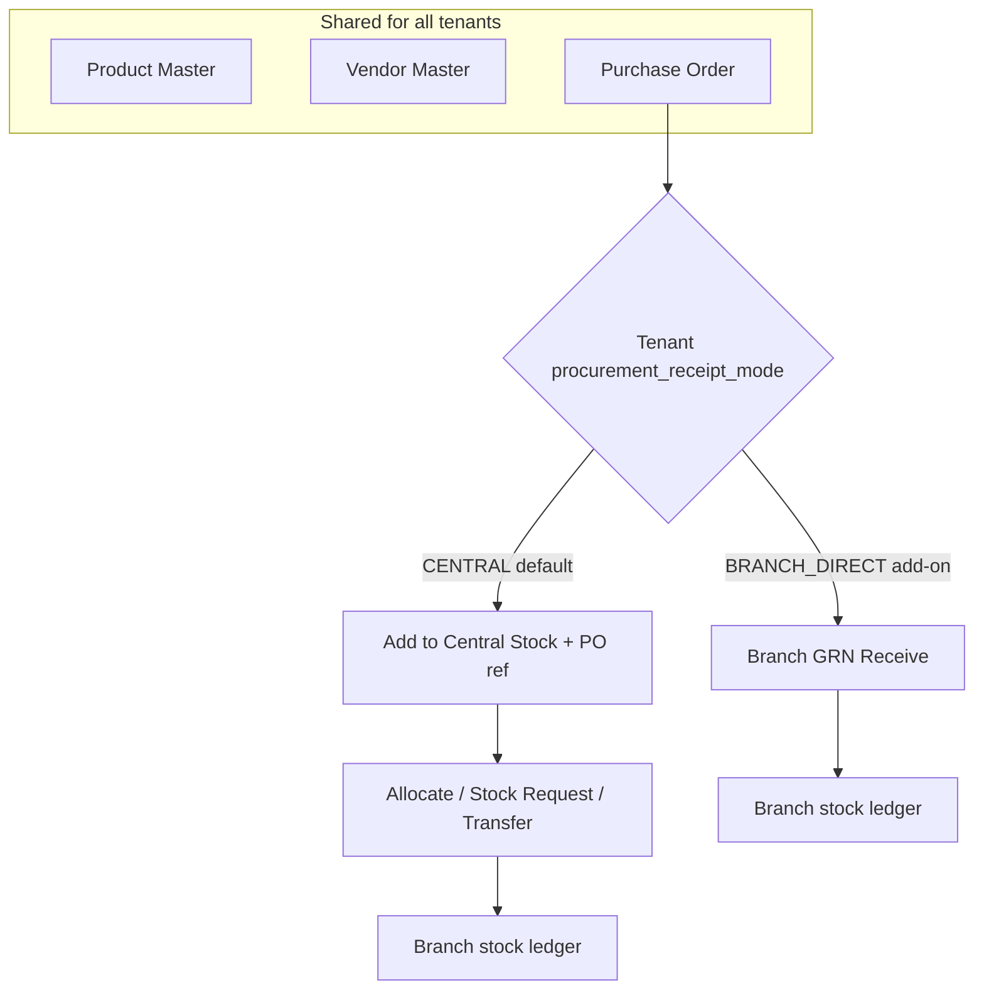
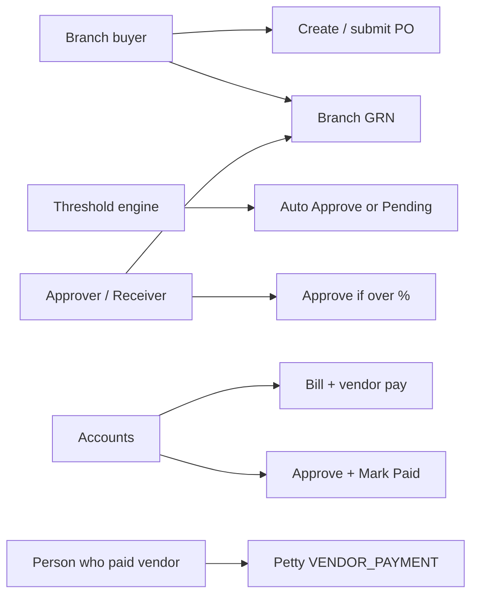
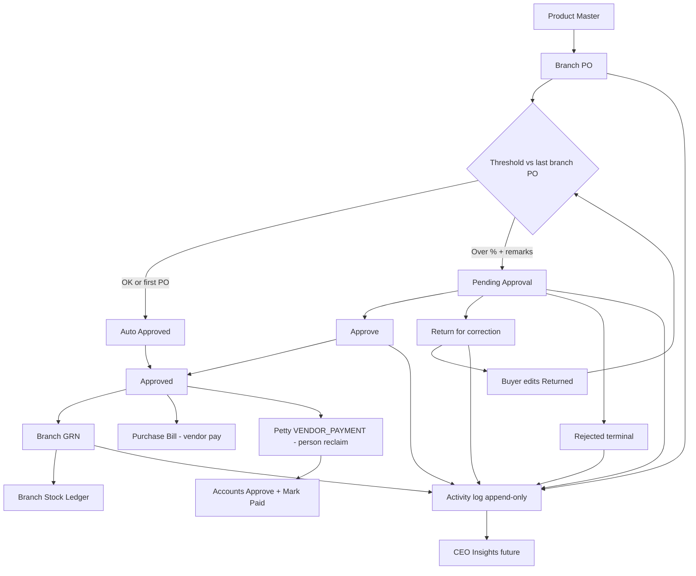

# Branch-Direct Procurement Enhancement — Product & Business Documentation

> **Status:** Proposed enhancement (not fully built). Use this doc to review, fine-tune, and approve before development.  
> **Related (as-built today):** `[purchase-order-management.md](./purchase-order-management.md)`, `[stock-management.md](./stock-management.md)`, `[product-management.md](./product-management.md)`, `[petty-cash.md](./petty-cash.md)`, `[vendor-management.md](./vendor-management.md)`  
> **Example tenant (mode on):** `PESTMED_` style clients who want **branch raises PO → branch receives stock** (bypass Central).  
> **Default for other tenants:** Keep today’s **Central Stock** receipt + allocate / request / transfer flow.

---


## 1. Purpose & Business Need

Multi-branch pest-control companies buy chemicals, machines, traps, and consumables in two different operating styles:


| Style                                | Who buys?                      | Where does stock land first?                               | Who needs this?                                   |
| ------------------------------------ | ------------------------------ | ---------------------------------------------------------- | ------------------------------------------------- |
| **CENTRAL** (today)                  | Often HO / central procurement | Central warehouse, then allocate / stock-request to branch | Clients who warehouse centrally                   |
| **BRANCH_DIRECT** (this enhancement) | Each branch raises its own PO  | **That branch’s stock ledger** via Branch GRN              | Clients like PESTMED_ who buy and receive locally |


This enhancement adds **BRANCH_DIRECT** as a **tenant-level add-on**. It does **not** remove Central workflow. Product Master stays shared. PO, stock, bill, and petty cash stay the same modules with extra screens / rules when the tenant mode is Branch-Direct.

### Outcomes this enhancement must deliver

1. Branch user creates PO from Product Master (same catalog as today).
2. Auto-approve or manual approve using **branch-level grand-total threshold** (vendor ignored for %).
3. Over-threshold inbox: **Approve**, **Reject**, or **Return for correction** (suggestions → buyer fixes → resubmit).
4. After Approve, branch can **Receive (GRN)** — partial OK — stock updates **that branch only** (bypass Central).
5. Assets on receive require serial / asset IDs.
6. **Purchase Bill** remains company AP (vendor gets paid by accounts).
7. **Petty Cash** `VENDOR_PAYMENT` is person reimbursement when staff paid the vendor personally — linked to Approved PO; validated by attachments; independent of Bill.
8. Amounts above petty max redirect to Bill (do not raise petty cap).
9. **Append-only activity logs** on PO / approve / request / GRN for timeline + future CEO Insights.
10. CENTRAL-mode tenants unchanged.


### What this is not

- Not a replacement Product Master.  
- Not forcing all tenants onto branch GRN.  
- Not auto-netting Petty + Bill on the same PO (they stay separate money stories).  
- Not a full ERP 3-way match engine in v1 (linkages + remaining qty/value rules yes; advanced dispute workflows can be phase-2).

---


## 2. Real-World Cast (use across all scenarios)

Use these names when reading flows and when demos / UAT scripts are written.


| Role in story                   | Example name                   | Branch              | Typical actions                               |
| ------------------------------- | ------------------------------ | ------------------- | --------------------------------------------- |
| Branch inventory / buyer        | **Riya Sharma**                | **Andheri West**    | Create PO, submit, receive GRN                |
| Branch manager / approver       | **Amit Patil**                 | **Andheri West**    | Approve over-threshold POs; can also Receive  |
| Second branch buyer             | **Sneha Kulkarni**             | **Pune Baner**      | Own branch POs (separate threshold baseline)  |
| Vendor A                        | **ChemSure Supplies**          | —                   | Chemicals                                     |
| Vendor B                        | **TrapTech India**             | —                   | Traps / tools (vendor may change next month)  |
| Accounts (AP / petty)           | **Neha Joshi**                 | HO / shared finance | Bill pay to vendor; petty Approve + Mark Paid |
| Person who paid vendor cash/UPI | **Amit Patil** (or field lead) | Andheri West        | Raises petty claim to get money back          |


**Sample products (Product Master — shared):**


| Product ID   | Name                | Category | Notes               |
| ------------ | ------------------- | -------- | ------------------- |
| PRD-CHEM-001 | Delta Force SC 1L   | CHEMICAL | Consumable          |
| PRD-TRAP-014 | Glue Board Large    | TRAP     | Consumable / resale |
| PRD-AST-003  | Battery Sprayer Pro | ASSET    | Needs serial on GRN |


**Tenant setting example (**`PESTMED_`**):**


| Setting                   | Example value                         |
| ------------------------- | ------------------------------------- |
| Procurement receipt mode  | `BRANCH_DIRECT`                       |
| PO value threshold %      | `20` (20%)                            |
| Petty cash max (existing) | e.g. ₹50,000 — unchanged; over → Bill |


---


## 3. Dual Mode Overview




| Topic                        | CENTRAL (keep)             | BRANCH_DIRECT (add-on)            |
| ---------------------------- | -------------------------- | --------------------------------- |
| Who creates PO               | Buyer (often HO or branch) | **Branch** raises PO for self     |
| Stock inbound                | Central entry              | **Branch GRN**                    |
| PO status → Received         | Via central qty sync       | Via GRN qty sync                  |
| Add to Central for that PO   | Allowed / expected         | **Blocked / hidden** for that PO  |
| Stock request Central→Branch | Normal                     | Optional (branch↔branch still OK) |


**Important:** Mode is stored **per tenant**. Freeze mode **on each PO at create time** (`receipt_mode_at_create`) so flipping tenant mode mid-month does not break open documents.

**Serving both client types safely:** see **§20 Safe Dual-Mode Implementation Contract** (defaults, mutual exclusion, what CENTRAL must never see).

---


## 4. Users & Roles (Branch-Direct)


### 4.1 Branch buyer / inventory

Creates Draft → Submit PO for their branch. After Approve, opens **Receive against PO** and posts GRN (full or partial). May also raise petty if they paid the vendor.

### 4.2 Branch approver / receiver

Reviews over-threshold POs (remarks required). Can **Approve**, **Reject**, or **Return for correction** (with suggestions). **Also allowed to Receive GRN** (client decision: both inventory and approver).

### 4.3 Accounts / AP

Creates **Purchase Bill** linked to PO (and ideally GRN). Records **vendor payment**. Separately, reviews **Petty Cash** claims, validates attachments, Approves, then **Marks Paid** so the person is reimbursed.

### 4.4 CEO / platform bypass

Can act across branches as today.




---


## 5. Access Control & RBAC Impact (critical — whole-system)

> **Yes — this enhancement affects RBAC.**  
> Branch-Direct needs a real **My Request / Received Request** pattern on Purchase Order (like Stock and Petty Cash). Today PO only checks **Read / Add / Edit / Delete**. **Request** and **Approve** keys exist in the platform catalog but are **not enforced** on PO APIs or UI. Wiring them carelessly can break **CENTRAL** clients and confuse permissions with Stock “Confirm Receipt”.


### 5.1 How PO RBAC works **today** (as-built)


| Permission  | PO today                                                                                                              |
| ----------- | --------------------------------------------------------------------------------------------------------------------- |
| **Read**    | List, detail, PDF                                                                                                     |
| **Add**     | Create PO                                                                                                             |
| **Edit**    | Update Draft **and all status transitions** (Submit → Pending, Approve, Ordered, Cancel)                              |
| **Delete**  | Soft-delete Draft                                                                                                     |
| **Request** | In catalog — **not checked**                                                                                          |
| **Approve** | In catalog — **not checked**; CEO refined Approve grants **do not** specially include PO (unlike Stock / GMA / Petty) |


**Controller gates (today):** create=`ADD`, update/status=`EDIT`, read=`READ`, delete=`DELETE`.  
There is **no** My Request tab, **no** Received inbox, **no** recipient-role routing on PO submit.

### 5.2 How workflow modules work (pattern we must align with)

Stock, Petty Cash, and GMA already use:


| UI / concept                 | Permission                                       | Meaning                                         |
| ---------------------------- | ------------------------------------------------ | ----------------------------------------------- |
| **My Request**               | Module **Request**                               | Documents **I** raised; submit / revoke / track |
| **Received Request** (inbox) | Module **Approve** + role ∈ **receiver roles**   | Pending items routed to me to decide            |
| Receiver roles               | Set in **Role Configuration** when Request is ON | Who gets notified / who can see inbox items     |
| Decide                       | Approve / Reject / **Return for correction**     | Not the same as “goods received”                |


**Role Configuration** (`docs/modules/rbac-role-configuration.md`): enabling **Request** on a module **requires** selecting receiver roles. That matrix is shared across the whole tenant — changing PO here affects every employee on those roles.

### 5.3 Naming trap (must not confuse in product or RBAC)


| Term                      | Means                                    | Module                      |
| ------------------------- | ---------------------------------------- | --------------------------- |
| **Received Request**      | Approver **inbox** (pending PO approval) | Purchase Order UI tab       |
| **Receive / Branch GRN**  | Physical **goods receipt** → stock ↑     | PO Detail action / Stock    |
| Stock **Confirm Receipt** | Confirm stock-request / transfer arrived | Stock Management (existing) |


Do **not** reuse one permission for both “approve the PO document” and “post GRN stock”. That mixes finance authorization with warehouse posting and breaks Stock’s existing Receive meaning.

### 5.4 Target RBAC model for BRANCH_DIRECT PO

Align PO with Petty/Stock **only when** `receipt_mode` / tenant mode needs workflow (see §20 — default CENTRAL stays legacy).

#### Tabs / surfaces (generic names)


| Surface                                            | Who sees it               | Permission                                       |
| -------------------------------------------------- | ------------------------- | ------------------------------------------------ |
| **Purchase Orders** (all / branch dashboard)       | Read                      | `PURCHASE_ORDER_MANAGEMENT_READ` + branch scope  |
| **My Request** (add-on tab)                        | Requester                 | `…_REQUEST` (or Add+Request) — POs I created     |
| **Received Request** (add-on tab / Approval Inbox) | Approver                  | `…_APPROVE` **and** my role ∈ PO recipient roles |
| **Add / Edit PO**                                  | Buyer                     | Add / Edit on Draft (and Returned if added)      |
| **Receive Against PO** (GRN)                       | Inventory and/or Approver | Separate rule — see §5.6                         |


#### Action → permission map (BRANCH_DIRECT)


| Business action                             | Required permission(s)     | Extra rules                                                                             |
| ------------------------------------------- | -------------------------- | --------------------------------------------------------------------------------------- |
| Create Draft                                | Add                        | Branch in user’s effective branches                                                     |
| Submit (→ Pending or Auto-Approved)         | Request (preferred) or Add | Pick **recipient roles** when over threshold (manual path); auto-approve may skip inbox |
| View My POs                                 | Request                    | Owner = requester                                                                       |
| View Approval Inbox                         | Approve                    | Role ∈ recipients on that PO **or** CEO bypass                                          |
| Approve / Reject / Return over-threshold PO | **Approve** (not Edit)     | Pending only; branch scope; Return → Returned; Reject → Rejected                        |
| Mark Ordered (optional)                     | Edit or Approve            | After Approved                                                                          |
| Post Branch GRN                             | See §5.6                   | Approved+ ; same branch                                                                 |
| Cancel after approve                        | Approve or Edit (policy)   | Block if GRN/petty paid/bill paid                                                       |
| CENTRAL Add to Central + PO ref             | Stock **Add**              | Only if PO snapshot = CENTRAL                                                           |


#### Auto-approve vs inbox


| Outcome on Submit                         | RBAC / inbox                                                                                                 |
| ----------------------------------------- | ------------------------------------------------------------------------------------------------------------ |
| Auto-Approved (first PO or ≤ threshold %) | No inbox item; audit “AUTO_APPROVED”; buyer still sees PO under My Request                                   |
| Pending (over %)                          | Create inbox row for **recipient roles**; notify those users; only Approve holders in those roles may decide |


### 5.5 Recipient roles (Role Configuration impact)

When BRANCH_DIRECT is enabled for a tenant, admins **must** configure:

**Role Configuration → Purchase Order Management → Request ON → select receiver roles**  
Examples: Branch Manager, Operations Head, Admin.


| Impact area             | What changes                                                                                                     |
| ----------------------- | ---------------------------------------------------------------------------------------------------------------- |
| Role matrix UI          | PO row must allow Request/Approve toggles like Stock/Petty (if currently hidden for PO, **enable for workflow**) |
| Standard role templates | Update Branch Manager / Inventory / Buyer templates for BRANCH_DIRECT tenants                                    |
| Existing employees      | Copying role permissions on hire/reassign picks up new Request/Approve — **migration checklist** for PESTMED_    |
| Notifications           | Submit-over-threshold → all active users in selected recipient roles (same pattern as Petty §6.5)                |
| CEO bypass              | Keep bypass for decide; still record audit as CEO                                                                |


**CENTRAL tenants:** do **not** force Request/Approve reconfiguration. Keep today’s Edit-based status changes unless they opt into workflow later.

### 5.6 Branch GRN permission (goods receive — separate from inbox)

Client decision: **both** branch inventory and approver can Receive goods.


| Option                                                                                                                 | Pros                                        | Cons                              |
| ---------------------------------------------------------------------------------------------------------------------- | ------------------------------------------- | --------------------------------- |
| **A (recommended):** GRN allowed if `(Stock Add or Stock Request/Edit receive-style) OR (PO Approve)` within PO branch | Matches “both”; reuses Stock inventory idea | Two modules to reason about       |
| **B:** New action e.g. `PURCHASE_ORDER_MANAGEMENT` custom “Receive goods”                                              | Clearest                                    | May need catalog/action extension |
| **C:** Only PO Edit                                                                                                    | Simple                                      | Too wide; same problem as today   |


**Recommended contract:**

```text
canPostBranchGrn(user, po) =
  po.receipt_mode == BRANCH_DIRECT
  AND po.status in (APPROVED, ORDERED, PARTIALLY_RECEIVED)
  AND user has access to po.branch_id
  AND (
       hasAuthority(PURCHASE_ORDER_MANAGEMENT_APPROVE)
    OR hasAuthority(STOCK_MANAGEMENT_ADD)          // inventory
    OR hasAuthority(STOCK_MANAGEMENT_REQUEST)      // branch requester style
  )
```

Fine-tune exact Stock permission in UAT; do **not** use Stock **Approve** alone (that is Central/transfer inbox, not branch GRN).

### 5.7 Dual-mode RBAC (protect CENTRAL clients)


| Behavior                   | CENTRAL (default)                                         | BRANCH_DIRECT                   |
| -------------------------- | --------------------------------------------------------- | ------------------------------- |
| Approve Pending PO         | **Keep Edit** (as today) **or** accept Approve if present | **Require Approve** + recipient |
| My Request / Received tabs | Hidden / unused                                           | Shown                           |
| Recipient roles on submit  | Not required                                              | Required when over threshold    |
| Threshold auto-approve     | Off                                                       | On                              |
| Branch GRN CTA / API       | Hidden / blocked                                          | Allowed per §5.6                |
| Central stock + PO ref     | Allowed (Stock Add)                                       | Blocked for that PO             |
| Petty Vendor Payment → PO  | Optional / unchanged                                      | Required Approved+ PO           |


**Unsafe:** Switching all tenants to “Approve-only” overnight → every CENTRAL buyer who approved via **Edit** loses ability until roles are retuned.

**Safe rollout:** Gate workflow UI + API checks with `receipt_mode_at_create == BRANCH_DIRECT` (and/or tenant mode). CENTRAL code path keeps `EDIT` for status.

### 5.8 System-wide blast radius (what else is touched)


| System area                                 | Risk if careless                                | Careful handling                                                              |
| ------------------------------------------- | ----------------------------------------------- | ----------------------------------------------------------------------------- |
| **Role Configuration**                      | PO Request without receivers; matrix validation | Same validation as Stock/Petty; document for CS                               |
| **Standard / template roles**               | New tenants miss Approve on Branch Manager      | Update templates + PESTMED_ role audit                                        |
| **Employee permission overrides**           | User-level overrides ignore new Request/Approve | Audit overrides on flip                                                       |
| **Notifications service**                   | Wrong audience or spam on auto-approve          | Notify inbox only when Pending; info-only on auto                             |
| **CEO refined Approve list**                | PO still excluded → CEO UX inconsistency        | Add PO to refined Approve set for BRANCH_DIRECT (or always for inbox)         |
| **Sidebar / route map**                     | New tabs need route guards                      | `rbacRouteMap` + tab visibility like Petty/GMA                                |
| **PurchaseOrderController** `@PreAuthorize` | Status update still EDIT-only                   | Split endpoints or branch inside service by mode + action                     |
| **Stock APIs**                              | GRN vs Central confuse authorities              | Mutual exclusion + separate GRN permission check                              |
| **Petty Cash**                              | PO picker needs PO Read/Request                 | Dropdown of Approved+ POs in user’s branch; don’t require PO Approve to claim |
| **Bills**                                   | Unchanged AP permissions                        | Keep Bill Add/Edit; no PO Approve required to bill                            |
| **Branch scope**                            | Cross-branch approve/receive                    | Enforce `po.branch_id` ∈ user’s branches (CEO = all)                          |
| **Mobile**                                  | If PO goes mobile later                         | Same Request/Approve semantics; out of P0 unless needed                       |
| **Analytics / exports**                     | “Who approved” empty on auto                    | Store `approved_by = SYSTEM` / `AUTO`                                         |


### 5.9 Suggested role profiles (BRANCH_DIRECT tenant example)


| Persona                       | PO Read | PO Add   | PO Edit   | PO Request | PO Approve   | Stock Add/Request | Petty Request | Petty Approve |
| ----------------------------- | ------- | -------- | --------- | ---------- | ------------ | ----------------- | ------------- | ------------- |
| Branch buyer (Riya)           | ✓       | ✓        | ✓ (draft) | ✓          | —            | ✓ (for GRN)       | ✓             | —             |
| Branch manager (Amit)         | ✓       | optional | optional  | optional   | ✓ (receiver) | optional          | ✓             | optional      |
| HO inventory (CENTRAL tenant) | ✓       | ✓        | ✓         | —          | —            | ✓ Central         | —             | —             |
| Accounts (Neha)               | ✓       | —        | —         | —          | —            | —                 | —             | ✓ + Edit/Pay  |
| CEO                           | bypass  | bypass   | bypass    | bypass     | bypass       | bypass            | bypass        | bypass        |


Receiver roles for PO Request (example): **Branch Manager**, **Operations Head**.

### 5.10 UI flow vs RBAC (My Request / Received)

```text
BRANCH_DIRECT buyer (Request)
  → My Request → Add PO → Submit
       → Auto-Approved → stays on My Request (Approved)
       → Pending → appears on Approver’s Received Request

BRANCH_DIRECT approver (Approve + receiver role)
  → Received Request → Approve / Reject / Return for correction
  → on Return: buyer edits (Returned) → resubmit → threshold again
  → (optional) after Approve, same user may open PO Detail → Receive Against PO (GRN)

CENTRAL buyer (Add/Edit as today)
  → Purchase Orders list → Add → Submit/Approve via Edit
  → No My/Received tabs required
  → Stock user Add to Central with PO ref
```


### 5.11 Implementation order (RBAC-safe)

1. Keep CENTRAL path on `EDIT` status transitions.
2. Add PO snapshot `receipt_mode_at_create`.
3. For BRANCH_DIRECT only: enforce Request on submit, Approve on decide, store `recipient_role_ids` on PO (like Petty).
4. Add My Request / Received Request UI gated by mode + permissions.
5. Wire Branch GRN with §5.6 (not Stock Approve inbox).
6. Role-matrix + template + PESTMED_ role audit before production flip.
7. Never remove Edit-based approve for CENTRAL in the same release without a migration playbook.


### 5.12 Fine-tune decisions (RBAC-specific)


| #   | Decision                                    | Proposal                                                                      |
| --- | ------------------------------------------- | ----------------------------------------------------------------------------- |
| R1  | Submit permission                           | **Request** for BRANCH_DIRECT (fallback Add for migration week)               |
| R2  | Approve permission                          | **Approve** + recipient — decisions: Approve / Reject / Return for correction |
| R3  | CENTRAL approve                             | Keep **Edit**                                                                 |
| R4  | GRN who                                     | Stock Add/Request **OR** PO Approve (branch-scoped)                           |
| R5  | Store recipients on PO                      | Yes (snapshot at submit) — like Petty                                         |
| R6  | Auto-approve inbox                          | No inbox row                                                                  |
| R7  | Enable PO Request/Approve in Role matrix UI | Yes when module supports workflow                                             |


---


## 6. Tenant Configuration (new add-on settings)

**Suggested admin page (add-on):**  
**Settings → Procurement Settings** (generic name)


| Field                                    | Type                        | Meaning                                               |
| ---------------------------------------- | --------------------------- | ----------------------------------------------------- |
| Procurement receipt mode                 | `CENTRAL` | `BRANCH_DIRECT` | Which inbound path is primary                         |
| PO auto-approve threshold %              | Number (e.g. 20)            | Max % increase vs last branch PO before manual review |
| Block Central inbound when Branch-Direct | Yes (recommended)           | Prevent double stock                                  |
| Freeze mode on PO create                 | Yes (recommended)           | Snapshot mode on PO header                            |


Only tenant admins / CEO maintain these. Not per-branch in v1 (threshold % is tenant-wide; comparison is per-branch history).

---


## 7. Threshold & Auto-Approve Rules (frozen)


### 7.1 Comparison baseline


| Rule                 | Decision                                                                                                  |
| -------------------- | --------------------------------------------------------------------------------------------------------- |
| What is compared?    | This PO **grand total** vs **last Approved+ PO grand total**                                              |
| Same branch?         | **Yes — required**                                                                                        |
| Same vendor?         | **No — ignored** (vendors change month to month)                                                          |
| Which last PO?       | Last with status **Approved, Ordered, Partially Received, or Received** (not Draft / Pending / Cancelled) |
| First PO for branch? | **Auto-approve (option A)** — no baseline                                                                 |


### 7.2 Decision on Submit

```text
On Submit (Draft → Pending, or direct submit):

  baseline = last Approved+ PO for same branch_id
  if baseline is null:
       → AUTO APPROVED  (first PO for branch)
  else:
       pct = (new_grand_total - baseline.grand_total) / baseline.grand_total * 100
       if pct <= tenant_threshold_pct:
            → AUTO APPROVED
       else:
            → require remarks (justify higher purchase)
            → status PENDING_APPROVAL
            → Approver / Receiver must Approve
```

**Notes for fine-tuning:**

- Negative % (cheaper than last month) → still ≤ threshold → auto-approve.  
- Remarks field: mandatory only when over threshold. Store on PO for audit.  
- Show buyer a preview: “Last Andheri West PO was ₹80,000; this is ₹1,05,000 (+31%). Threshold 20% — needs approval + remarks.”


### 7.3 Real-world threshold scenarios


#### Scenario T1 — First PO for Andheri West → auto

1. Andheri West has never had an Approved+ PO.
2. Riya creates PO-AW-1001 to ChemSure, grand total **₹45,000**.
3. Submits → **Auto Approved** (no remarks).
4. Ready for Receive / Bill / Petty rules.


#### Scenario T2 — Within 20% → auto

1. Last Approved+ Andheri West PO (any vendor) = **₹80,000**.
2. Riya creates PO-AW-1002 to **TrapTech** (different vendor), total **₹92,000** (+15%).
3. Threshold 20% → **Auto Approved**. Vendor change does **not** reset or block.


#### Scenario T3 — Over 20% → remarks + manual

1. Baseline still ₹80,000.
2. Riya creates PO-AW-1003, total **₹1,10,000** (+37.5%).
3. UI blocks submit without **Remarks** (“Monsoon chemical stocking + 2 sprayers”).
4. Status **Pending Approval** → Amit Approves → **Approved**.


#### Scenario T4 — Pune Baner independent baseline

1. Sneha’s Pune Baner last PO = ₹25,000.
2. Her new PO ₹28,000 (+12%) → auto for **Pune**, unrelated to Andheri’s ₹80,000 history.

---


## 8. Purchase Order Lifecycle (Branch-Direct)


### 8.1 Status path

```text
DRAFT
  → PENDING_APPROVAL        (over threshold only)
       → APPROVED           (manual Approve)
       → RETURNED           (Return for correction — editable; resubmit)
       → REJECTED           (terminal reject; opposite of Approve)
  → APPROVED                (also via auto-approve on submit)
  → ORDERED                 (optional)
  → PARTIALLY_RECEIVED
  → RECEIVED
  → CANCELLED               (buyer/finance cancel when allowed; not the same as Reject)
```

**Resubmit from Returned:**

```text
RETURNED → (branch edits lines / qty / vendor notes) → Submit again
  → threshold re-evaluated
       ≤ % or first-baseline rules → AUTO APPROVED
       > % → PENDING_APPROVAL again (same or updated recipients)
```

**Suggested simplification for Branch-Direct:** after Approve, allow **Receive** without forcing “Mark as Ordered”. Keep Ordered as optional “sent to vendor”.

### 8.1A Approver decisions (BRANCH_DIRECT inbox) — Approve / Reject / Return

Head Manager (or configured receiver) on **Received Request** gets **three** decisions (Petty-style; correction loop the business wants — GMA intent / Petty as-built):


| Decision                  | Status                  | Required input                                                     | Next                                        |
| ------------------------- | ----------------------- | ------------------------------------------------------------------ | ------------------------------------------- |
| **Approve**               | Approved                | Optional remarks                                                   | Buyer may Order / Receive GRN               |
| **Reject**                | **Rejected** (terminal) | **Rejection reason** (mandatory)                                   | No edit/resubmit; new PO if still needed    |
| **Return for correction** | **Returned**            | **Correction notes / suggestions** (mandatory, min length e.g. 10) | Branch buyer edits on My Request → resubmit |


**Correction suggestions (examples Head Manager can write):**

- “Remove Glue Board Large; add Glue Board Medium instead.”  
- “Cut Delta Force qty from 40 to 25 — excess vs last month usage.”  
- “Drop Battery Sprayer from this PO; raise separate asset PO.”  
- “Vendor change OK but justify monsoon spike in remarks.”

Correction notes are stored on the PO and shown on **Edit PO** / **My Request** so the branch manager sees exactly what to change. Full text is kept in the **activity log** (see §17).

**Reject vs Cancel vs Return**


|                   | Reject           | Return for correction | Cancel                                      |
| ----------------- | ---------------- | --------------------- | ------------------------------------------- |
| Who               | Approver (inbox) | Approver (inbox)      | Buyer / policy (open PO)                    |
| Editable after?   | No               | Yes (requester)       | No (terminal)                               |
| Resubmit same PO? | No               | Yes                   | No                                          |
| Typical use       | Hard no          | Soft fix then retry   | Abandon before/after approve per guardrails |


### 8.1B Real-world correction scenario

1. Riya submits PO-AW-1005 Andheri West, grand total ₹1,20,000 (+50% vs baseline) with remarks.
2. Status **Pending Approval** → Amit (Head / Branch Manager) opens **Received Request**.
3. Amit chooses **Return for correction** with notes: “Remove PRD-TRAP-014; reduce PRD-CHEM-001 from 40→28 L; keep sprayer.”
4. PO → **Returned**. Riya notified; opens **My Request** → Edit.
5. Riya applies changes → new total ₹95,000 (+18.75%) → Submit.
6. Threshold ≤ 20% → **Auto Approved** (or still Pending if still over).
7. Each step written to PO activity log (who, when, from→to, notes).


### 8.2 Compatible with today’s PO UI


| Existing page (as-built)  | Still used? | Branch-Direct change                                                                                     |
| ------------------------- | ----------- | -------------------------------------------------------------------------------------------------------- |
| **Purchase Orders** list  | Yes         | Filters: status, branch; badges Auto-Approved / Needs approval / Returned                                |
| **Add Purchase Order**    | Yes         | Threshold preview; remarks when over %                                                                   |
| **Edit Purchase Order**   | Yes         | Editable when **Draft** or **Returned**; show correction notes banner when Returned                      |
| **Purchase Order Detail** | Yes         | Actions: Approve, Reject, Return for correction, Receive, View GRNs, Activity log, Link Bill, Open Petty |


### 8.3 New / add-on pages (generic names)


| Generic page name                            | Menu idea                               | Purpose                                                    |
| -------------------------------------------- | --------------------------------------- | ---------------------------------------------------------- |
| **Procurement Settings**                     | Settings / Admin                        | Mode + threshold %                                         |
| **PO Approval Inbox** / **Received Request** | Procurement → Approvals                 | Pending POs — Approve / Reject / Return                    |
| **Receive Against PO** (Branch GRN)          | From PO Detail action **Receive**       | Create GRN, lines, serials, delivery details               |
| **GRN Detail / List**                        | Procurement → Goods Receipts *or* Stock | View partial/full receipts linked to PO                    |
| **PO Activity / Audit Timeline**             | On PO Detail (panel)                    | User logs for every request/approve/GRN event              |
| **Petty Cash Add** (existing)                | Finance → Petty cash                    | When category Vendor Payment → **must select Approved PO** |


---


## 9. Branch GRN — Receive (bypass Central)


### 9.1 Business meaning

**Branch GRN** = proof that goods from the vendor arrived **at the branch**. Posting GRN:

1. Increases that branch’s `stock_ledger` (assets / consumable / resell buckets as applicable).
2. Creates / updates movement log with reference type e.g. `PO_BRANCH_GRN`.
3. For **ASSET** lines: requires serial / asset IDs → create `asset_units` at **that branch**.
4. Updates PO to Partially Received or Received from summed GRN qty.
5. Does **not** create Central stock entry.


### 9.2 Partial receive (frozen)

- Multiple GRNs per PO allowed until remaining qty = 0 (or PO closed).  
- Each GRN can receive subset of lines / qty.  
- Remaining stock can be received later on another GRN.  
- Over-receive: **block by default** (fine-tune: allow with override remark).


### 9.3 GRN form fields (suggested)


| Section  | Fields                                                                                         |
| -------- | ---------------------------------------------------------------------------------------------- |
| Header   | PO number (locked), branch (locked), vendor (locked), GRN date, GRN number (system)            |
| Delivery | Delivery person name, vehicle / courier ref, vendor invoice no., optional photos               |
| Optional | Warehouse gate slip, remarks                                                                   |
| Lines    | Product, ordered qty, already received, **receiving now**, UOM, batch / mfg / expiry (if used) |
| Assets   | Per unit serial / asset ID (required when product is ASSET)                                    |


### 9.4 Who can open Receive

From **Purchase Order Detail**, action **Receive** when status is Approved / Ordered / Partially Received.  
Allowed: **branch inventory role** **or** **approver/receiver** for that branch.

### 9.5 Real-world GRN scenarios


#### Scenario G1 — Full receive in one go

1. PO-AW-1001 Approved: 20× Delta Force, 10× Glue Board.
2. Riya opens **Receive Against PO**.
3. Enters delivery person “Ramesh (ChemSure)”, invoice INV-8891.
4. Receives full qty → Andheri West stock ↑ → PO **Received**.


#### Scenario G2 — Partial then remaining

1. Same day only 12× Delta Force arrive.
2. GRN-1 posts 12 → PO **Partially Received**; stock +12.
3. Next week GRN-2 posts remaining 8 + all Glue Boards → PO **Received**.


#### Scenario G3 — Asset serials

1. PO includes 2× Battery Sprayer Pro.
2. On GRN, Riya must enter serials e.g. `AST-AW-2401`, `AST-AW-2402`.
3. Without serials → cannot complete asset lines.
4. Units appear under Andheri West asset pool.


#### Scenario G4 — Double-post guard

1. Tenant is BRANCH_DIRECT.
2. User tries **Add to Central Stock** with this PO ref → **blocked** with message to use Branch GRN.
3. Prevents Central + Branch double quantity.

---


## 10. Purchase Bill (AP) — company pays vendor


### 10.1 Business meaning (frozen)

**PO → Bill → Payment** = **accounting record** that the **company / accounts** pays the **vendor**.  
This is **not** reimbursement to an employee.

Works **separately** from Petty Cash. No automatic deduction of petty claims from billable PO value in v1.

### 10.2 UI (existing + light add-on)


| Page                                 | Use                                                                 |
| ------------------------------------ | ------------------------------------------------------------------- |
| **Add / Edit Bill** (existing)       | Link `purchase_order_id`; vendor must match PO                      |
| Optional add-on                      | Select one or more **GRN** references on the bill for clearer audit |
| Payment recording (existing AP path) | Marks vendor as paid in AP sense                                    |


### 10.3 Partial GRN + bill

- Accounts may bill for received portion only (recommended practice).  
- System v1: allow bill linked to PO even if partial; show “Received value vs Billed value” on PO Detail for manual control.  
- Fine-tune later: hard-cap bill ≤ received value.


### 10.4 Real-world bill scenario


#### Scenario B1 — Company pays vendor

1. PO-AW-1001 Received (or partial).
2. Neha creates Bill against PO-AW-1001 / GRN-1 for ChemSure.
3. Records payment from company bank → **vendor** receives money.
4. Unrelated whether Amit also filed a petty claim for something else on another PO.

---


## 11. Petty Cash — person paid vendor, wants money back


### 11.1 Business meaning (frozen)

If an **individual** (branch manager / staff) **already paid the vendor** from personal UPI/cash against a branch PO, they raise **Petty Cash** so **branch / company accounts reimburses them**.


|                            | Purchase Bill              | Petty Cash `VENDOR_PAYMENT`                                    |
| -------------------------- | -------------------------- | -------------------------------------------------------------- |
| Who paid vendor initially? | Company                    | **Person**                                                     |
| Document purpose           | AP + vendor settlement     | **Reimburse the person**                                       |
| Validation                 | Bill / GRN / invoice       | **Attachments** (receipt, UPI screenshot) reviewed by accounts |
| Paid means                 | Vendor got company payment | **Person got reimbursement**                                   |


### 11.2 Rules (frozen)


| Rule                           | Decision                                                                                                    |
| ------------------------------ | ----------------------------------------------------------------------------------------------------------- |
| Category                       | `VENDOR_PAYMENT`                                                                                            |
| PO required?                   | **Yes — Approved+ PO** (Approved / Ordered / Partial / Received)                                            |
| Before GRN?                    | **Allowed** (stock may arrive late)                                                                         |
| Amount vs PO                   | Up to **full PO grand total** allowed; **manual** validation via attachments (no hard remaining-stock gate) |
| Petty + Bill same PO           | **Both allowed** — separate channels                                                                        |
| Amount > petty max (e.g. ₹50k) | **Do not raise cap** → **redirect to Bill** (company should pay vendor via AP)                              |
| Mark Paid                      | Accounts marks petty **Paid** after reimbursing the claimant                                                |


### 11.3 UI flow (existing Petty + add-on fields)

**Page:** **Add Petty Cash** / **My Request** (existing)

When category = **Vendor Payment**:

1. Show required dropdown: **Approved PO** (filtered to user’s branch / eligible POs).
2. Prefill hint: PO grand total, vendor name, branch.
3. If amount > petty max → error: “Amount exceeds petty limit. Create a Purchase Bill against this PO instead.”
4. Attachments mandatory (as today).
5. Submit → Approver inbox → Approve → **Record Payment / Mark Paid** (existing) → person reimbursed.

**PO Detail add-on panel:** list related petty claims (id, amount, status) for visibility — informational only, not netting.

### 11.4 Real-world petty scenarios


#### Scenario P1 — Manager paid vendor before stock arrived

1. PO-AW-1002 Approved, goods still in transit.
2. Amit paid ChemSure ₹18,000 from personal UPI for urgent chemicals on that PO.
3. Amit → **Add Petty Cash** → category Vendor Payment → select PO-AW-1002 → amount ₹18,000 → attach UPI screenshot + vendor note.
4. Neha reviews attachments → Approves → Marks **Paid** → Amit gets ₹18,000 back from branch accounts.
5. Later Riya still posts Branch GRN when stock arrives (independent).


#### Scenario P2 — Over petty max → Bill

1. Same pattern but amount ₹72,000.
2. Petty submit blocked → “Use Purchase Bill”.
3. Neha creates Bill and pays **vendor** from company account (person should not have paid personally at that size — process correction).


#### Scenario P3 — Petty and Bill both on same PO (allowed)

1. Small advance paid by Amit via petty ₹10,000.
2. Remaining ₹70,000 paid by company via Bill.
3. System does **not** auto-balance; accounts uses attachments + PO Detail panels to avoid mistakes.
4. Fine-tune phase-2: soft warning “₹10,000 already claimed on petty for this PO”.

---


## 12. Full Lifecycle Story (one continuous example)

**Tenant:** PESTMED_ · Mode: BRANCH_DIRECT · Threshold: 20%  
**Branch:** Andheri West  
**Last Approved+ PO grand total:** ₹80,000 (any vendor)

### Step-by-step


| Step | Actor                | Screen (generic)                  | What happens                                                                                                 |
| ---- | -------------------- | --------------------------------- | ------------------------------------------------------------------------------------------------------------ |
| 1    | Catalog already done | **Product Master**                | PRD-CHEM-001, PRD-TRAP-014, PRD-AST-003 exist                                                                |
| 2    | Riya                 | **Add Purchase Order**            | Branch Andheri West, vendor ChemSure, lines + prices → grand total **₹1,05,000** (+31%)                      |
| 3    | System               | Threshold preview                 | Over 20% → remarks required                                                                                  |
| 4    | Riya                 | Same form                         | Remarks: “Monsoon prep + 1 sprayer” → Submit → **Pending Approval**                                          |
| 5    | Amit                 | **PO Approval Inbox** / PO Detail | Approves → **Approved**                                                                                      |
| 6    | Amit (cash)          | Vendor shop / UPI                 | Pays ₹15,000 personally for urgent part of order                                                             |
| 7    | Amit                 | **Add Petty Cash**                | Vendor Payment + PO-AW-1003 + ₹15,000 + attachments → Pending                                                |
| 8    | Neha                 | **Petty Received**                | Validates attachments → Approve → **Mark Paid** → Amit reimbursed                                            |
| 9    | Riya                 | **Receive Against PO**            | GRN-1: partial chemicals + 1 sprayer with serial `AST-AW-2409` → Andheri stock ↑ → PO **Partially Received** |
| 10   | Neha                 | **Add Bill**                      | Bill for received portion / agreed invoice → company pays ChemSure (AP)                                      |
| 11   | Riya                 | **Receive Against PO**            | GRN-2: remaining qty → PO **Received**                                                                       |
| 12   | —                    | **Stock Ledger** (branch)         | Andheri West balances reflect both GRNs; Central not used                                                    |


**If this tenant were CENTRAL instead:** steps 9–11 would be Add to Central Stock + allocate/request — not Branch GRN.

---


## 13. Cross-Module Compatibility Matrix


| From → To                     | BRANCH_DIRECT behavior                                                  |
| ----------------------------- | ----------------------------------------------------------------------- |
| Product Master → PO           | Same product dropdown; Active SKUs only                                 |
| PO → Branch GRN               | Hard link `purchase_order_id`; qty remaining                            |
| Branch GRN → Branch stock     | Direct ledger ↑; movement log                                           |
| Branch GRN → PO status        | Partial / Received sync                                                 |
| PO → Bill                     | Existing link; vendor match; independent of petty                       |
| PO → Petty                    | Required when category Vendor Payment; Approved+                        |
| Petty Paid                    | Reimburses person; does not post stock; does not pay vendor in AP sense |
| BRANCH_DIRECT → Central entry | Block for linked PO                                                     |
| Branch ↔ Branch transfer      | Still available after stock is at branch                                |
| Other tenant CENTRAL          | Unchanged path                                                          |





---


## 14. UI Inventory — Existing vs Add-on


### 14.1 Existing pages (reuse)


| Generic / current name                             | Module                                                               |
| -------------------------------------------------- | -------------------------------------------------------------------- |
| Product Master list / Add / Edit / View            | Product                                                              |
| Purchase Orders list                               | PO                                                                   |
| Add Purchase Order                                 | PO                                                                   |
| Purchase Order Detail                              | PO                                                                   |
| Add to Central Stock                               | Stock (CENTRAL tenants; hidden/blocked for BRANCH_DIRECT PO inbound) |
| Stock Ledger / Dashboard                           | Stock                                                                |
| Stock Request / Transfer / Receive                 | Stock (branch↔branch / central paths)                                |
| Vendor list / Add                                  | Vendor                                                               |
| Bills list / Add                                   | AP Bills                                                             |
| Petty Cash Dashboard / My Request / Received / Add | Petty                                                                |


### 14.2 Add-on pages / surfaces (generic names for design)


| Add-on name                                          | Type                             | Priority |
| ---------------------------------------------------- | -------------------------------- | -------- |
| **Procurement Settings**                             | New settings page                | P0       |
| **Threshold preview** on Add/Edit PO                 | Panel on existing form           | P0       |
| **PO Remarks** (over threshold)                      | Field on existing form           | P0       |
| **PO Approval Inbox**                                | New list (or filter on PO list)  | P0       |
| **Receive Against PO**                               | New wizard / form from PO Detail | P0       |
| **GRN List / GRN Detail**                            | New                              | P1       |
| **PO Detail — Receipts panel**                       | Section                          | P0       |
| **PO Detail — Bills panel**                          | Section                          | P1       |
| **PO Detail — Petty claims panel**                   | Section                          | P1       |
| **Petty — Approved PO picker**                       | Field when Vendor Payment        | P0       |
| **Petty — Redirect to Bill** message                 | Validation UX                    | P0       |
| **PO Activity / Audit Timeline**                     | Panel on PO Detail               | P0       |
| Hide / disable Central inbound CTA for BRANCH_DIRECT | Guard on Stock UI                | P0       |


---


## 15. Cancel, Edit, and Guardrails


| Situation                                             | Rule                                                                |
| ----------------------------------------------------- | ------------------------------------------------------------------- |
| Edit when **Draft** or **Returned**                   | Allow line/header changes; show correction-notes banner if Returned |
| Edit when Pending / Approved+                         | **Block** (amend phase-2)                                           |
| Resubmit from Returned                                | Re-run threshold; may auto-approve or go Pending again              |
| **Reject** (approver)                                 | Terminal **Rejected**; reason mandatory; no resubmit on same PO     |
| **Return for correction**                             | Status Returned; correction notes mandatory; requester notified     |
| Cancel PO with no GRN and no paid petty/bill          | Allow → Cancelled (distinct from Rejected)                          |
| Cancel after any GRN qty                              | **Block** (or reverse GRN first — phase-2)                          |
| Cancel after petty Paid or bill payment               | **Block** / finance override only                                   |
| Second GRN after full Received                        | Block                                                               |
| CENTRAL user posts Central entry for BRANCH_DIRECT PO | Block                                                               |
| Petty on Draft / Pending / Returned / Rejected PO     | Block — Approved+ only                                              |
| Petty amount > max                                    | Block — redirect to Bill                                            |


---


## 16. Notifications (suggested)


| Event                                 | Who                                                  |
| ------------------------------------- | ---------------------------------------------------- |
| PO auto-approved                      | Buyer (info)                                         |
| PO pending (over threshold)           | Approver / Receiver roles for branch                 |
| PO approved (manual)                  | Buyer                                                |
| PO **returned for correction**        | Buyer (requester) — include correction notes preview |
| PO **rejected**                       | Buyer — include rejection reason                     |
| PO resubmitted after return           | Approver / Receiver roles (if Pending again)         |
| GRN posted                            | Buyer + branch manager (optional)                    |
| Petty submitted (Vendor Payment + PO) | Petty recipient roles                                |
| Petty Paid                            | Claimant                                             |


---


## 17. Activity logs & CEO Insights (required foundation)

Every BRANCH_DIRECT procurement action must append an **immutable activity / audit log** (user + timestamp + action + from/to status + payload summary). This is required for **PO Detail timeline** now and **CEO dashboard Insights** later — do not rely only on soft `updated_by` on the header.

### 17.1 What must be logged


| Domain                  | Example events (`action` codes)                                               | Key payload fields                                                                                            |
| ----------------------- | ----------------------------------------------------------------------------- | ------------------------------------------------------------------------------------------------------------- |
| **PO request**          | `PO_DRAFT_SAVED`, `PO_SUBMITTED`, `PO_RESUBMITTED`, `PO_REVOKED` (if allowed) | actor, branch, vendor, grand_total, line count, threshold_pct, baseline_po_id, calculated_pct, auto_or_manual |
| **Threshold**           | `PO_THRESHOLD_EVALUATED`, `PO_AUTO_APPROVED`                                  | baseline total, new total, %, tenant threshold, result                                                        |
| **Approve side**        | `PO_APPROVED`, `PO_REJECTED`, `PO_RETURNED_FOR_CORRECTION`                    | actor, decision, remarks / rejection_reason / **correction_notes**, recipient_roles                           |
| **Buyer correction**    | `PO_LINES_UPDATED` (while Returned)                                           | before/after line snapshot or diff summary                                                                    |
| **Ordered**             | `PO_MARKED_ORDERED`                                                           | actor                                                                                                         |
| **Branch GRN**          | `GRN_CREATED`, `GRN_LINE_POSTED`, `GRN_COMPLETED`                             | grn_id, qtys, serials, delivery person, invoice no., stock ledger deltas                                      |
| **Stock effect**        | `STOCK_LEDGER_ADJUSTED` (or link movement log id)                             | product_id, branch_id, qty buckets, reference_type=`PO_BRANCH_GRN`                                            |
| **Bill / Petty (link)** | `BILL_LINKED`, `PETTY_CLAIM_LINKED`, `PETTY_PAID` (optional cross-ref)        | related ids + amounts                                                                                         |
| **Guards**              | `CENTRAL_INBOUND_BLOCKED`, `GRN_BLOCKED`                                      | reason                                                                                                        |


CENTRAL-mode POs should keep logging on existing Central receive sync where practical (`PO_STATUS_SYNCED_FROM_CENTRAL`) so CEO Insights can compare modes later.

### 17.2 Where logs appear


| Surface                             | Use                                                          |
| ----------------------------------- | ------------------------------------------------------------ |
| **PO Detail → Activity timeline**   | Full history for that PO (request → decisions → GRNs)        |
| **GRN Detail → Activity**           | Create/post events for that receipt                          |
| **Received Request / My Request**   | Last action + actor (list columns)                           |
| **Export / API**                    | Filterable audit extract for finance                         |
| **CEO Insights dashboard (future)** | Aggregate from this log store — do not invent a second truth |


### 17.3 CEO Insights (future — design for now)

Design the log so a later dashboard can answer without schema rewrites:


| Insight theme    | Example questions                                                |
| ---------------- | ---------------------------------------------------------------- |
| Approval load    | How many POs Pending / Returned / Rejected per branch per month? |
| Correction loops | Avg returns per PO; top correction reasons; time Draft→Approved  |
| Threshold health | % auto-approved vs manual; how often over threshold by branch    |
| Reject patterns  | Reject rate by vendor / branch / approver                        |
| GRN latency      | Time Approved → first GRN; Partial→full Received                 |
| Spend            | Grand total trends vs baseline; spike POs with remarks           |
| Compliance       | GRNs missing serials attempts; blocked Central posts             |
| Petty vs Bill    | Claims linked to POs; amounts vs PO value (informational)        |


**Storage suggestion:** dedicated `purchase_order_activity_log` (and/or reuse platform audit with `entity_type=PO|GRN`) — append-only, indexed by `po_id`, `branch_id`, `actor_id`, `action`, `created_at`.

### 17.4 Minimum fields on PO Detail / exports (also)

- Threshold baseline PO id + % calculated + auto vs manual  
- Buyer over-threshold remarks  
- Latest correction notes / rejection reason  
- GRN list with qty per line + remaining to receive  
- Linked bills / petty (informational)  
- Mode snapshot: BRANCH_DIRECT vs CENTRAL  
- Full activity timeline (§17.1)

---


## 18. Phased Delivery Suggestion


| Phase  | Scope                                                                                                                                                                                                                      |
| ------ | -------------------------------------------------------------------------------------------------------------------------------------------------------------------------------------------------------------------------- |
| **P0** | Tenant mode + threshold; **Approve / Reject / Return for correction**; activity log on PO+GRN; Branch GRN full/partial + asset serials; block Central double-post; Petty PO required + max→Bill redirect; RBAC My/Received |
| **P1** | GRN list, PO panels (GRN/Bill/Petty/Activity), Approval Inbox polish, soft warning if petty already claimed on PO; correction-notes banner UX                                                                              |
| **P2** | Hard bill ≤ received value; PO amend after approve; GRN reverse; CEO Insights dashboard on activity logs; optional soft payment netting warnings                                                                           |


---


## 19. Fine-Tune Checklist (for your review)

Mark each as **Keep / Change / Decide**:


| #   | Topic                             | Current proposal                                                                   |
| --- | --------------------------------- | ---------------------------------------------------------------------------------- |
| 1   | Threshold baseline                | Last Approved+ PO **same branch only** (vendor ignored)                            |
| 2   | First PO for branch               | **Auto-approve**                                                                   |
| 3   | Over threshold                    | Remarks + manual Approve                                                           |
| 4   | Ordered step                      | Optional after Approve (Receive allowed on Approved)                               |
| 5   | Who can Receive                   | Branch inventory **or** Approver/Receiver                                          |
| 6   | Partial GRN                       | Allowed; remaining later                                                           |
| 7   | Over-receive                      | Block                                                                              |
| 8   | Assets                            | Serials required on GRN                                                            |
| 9   | Bill vs Petty                     | Separate; no auto-net                                                              |
| 10  | Petty before GRN                  | Allowed; full PO value OK; attachment review                                       |
| 11  | Petty > max                       | Redirect to Bill (no cap raise)                                                    |
| 12  | Double stock                      | Block Central inbound for BRANCH_DIRECT PO                                         |
| 13  | Mode flip mid-year                | Freeze mode on PO at create                                                        |
| 14  | Soft warning petty+bill same PO   | Phase-1 nice-to-have                                                               |
| 15  | Bill hard-cap ≤ received          | Phase-2                                                                            |
| 16  | Default mode for existing tenants | `CENTRAL` (no behavior change until flip)                                          |
| 17  | Dual inbound on one PO            | **Forbidden** — Central XOR Branch GRN                                             |
| 18  | Threshold / Petty-PO rules        | **BRANCH_DIRECT only** (CENTRAL unchanged)                                         |
| 19  | PO My Request / Received Request  | **BRANCH_DIRECT only**; align with Stock/Petty pattern                             |
| 20  | PO Approve API                    | Wire **Approve** + recipients for BRANCH_DIRECT; keep **Edit** approve for CENTRAL |
| 21  | GRN vs inbox “Received”           | Separate permissions — do not conflate                                             |
| 22  | Role Configuration                | Enable PO Request/Approve + receiver roles; audit PESTMED_ roles before flip       |
| 23  | Approver decisions                | **Approve** / **Reject** (terminal) / **Return for correction** (Petty-style)      |
| 24  | Correction notes                  | Mandatory on Return; shown to buyer; logged                                        |
| 25  | Resubmit after Return             | Re-run threshold (may auto-approve)                                                |
| 26  | Activity logs                     | Append-only for PO request, decide, GRN, stock link — CEO Insights later           |
| 27  | Rejected vs Cancelled             | Distinct statuses                                                                  |


---


## 20. Safe Dual-Mode Implementation Contract

> **Goal:** Serve **both** client types in one product — existing **CENTRAL** clients unchanged, **BRANCH_DIRECT** clients (e.g. PESTMED_) on the enhancement — without double stock or broken PO status.


### 20.1 Verdict (compatibility)


| Question                                                       | Answer                                                                           |
| -------------------------------------------------------------- | -------------------------------------------------------------------------------- |
| Can both client types be served?                               | **Yes**                                                                          |
| Is this doc compatible with current as-built flow?             | **Yes** — additive, not a rewrite                                                |
| Is safe implementation realistic?                              | **Yes**, with tenant default `CENTRAL` + per-PO mode gate                        |
| Do existing Central clients break if only PESTMED_ is flipped? | **No**, if their mode stays `CENTRAL` and Central posting defaults are untouched |


**Bottom line:** Implement as a **tenant-mode fork on receive + optional PO submit rules**, not as a replacement of today’s Central PO → Central Stock path.

### 20.2 Compatibility matrix (enhancement vs as-built)


| Area                                | Current (as-built)                  | Enhancement                    | Conflict if ungated?                     | Safe rule                                                                 |
| ----------------------------------- | ----------------------------------- | ------------------------------ | ---------------------------------------- | ------------------------------------------------------------------------- |
| Product Master                      | Shared SKU                          | Same                           | No                                       | Shared                                                                    |
| PO create (branch + vendor + lines) | Exists                              | Same + threshold on submit     | Threshold would surprise CENTRAL clients | Threshold / auto-approve **only** when mode = `BRANCH_DIRECT`             |
| PO → Received                       | Via Central `purchaseOrderRef` sync | Via Branch GRN sync            | **Yes** — two writers, one status        | Branch by **PO receipt mode snapshot**                                    |
| Stock inbound                       | Central only                        | + Branch GRN                   | Double stock if both used                | Mutual exclusion per PO                                                   |
| Allocate / request / transfer       | Exists                              | Still OK after stock at branch | No                                       | Keep for both                                                             |
| Bill ↔ PO                           | Exists, independent                 | Same                           | No                                       | Unchanged                                                                 |
| Petty `VENDOR_PAYMENT`              | Category exists, **no PO link**     | Approved PO required           | Forcing PO would change CENTRAL petty UX | PO-required **only** for `BRANCH_DIRECT` (or optional picker for CENTRAL) |
| Tenant settings                     | Not present                         | New                            | No                                       | Additive; default `CENTRAL`                                               |


### 20.3 Dual-serve pattern (must implement)

```text
DEFAULT for every existing tenant:  procurement_receipt_mode = CENTRAL
PESTMED_ (and similar):             procurement_receipt_mode = BRANCH_DIRECT

On each PO at create: snapshot receipt_mode_at_create
  → CENTRAL PO       → only Central entry may advance receive / Partial / Received
  → BRANCH_DIRECT PO → only Branch GRN may advance receive / Partial / Received
  → cross-path always blocked
```


| Tenant type            | What they see / use                                                                                                                                                                             |
| ---------------------- | ----------------------------------------------------------------------------------------------------------------------------------------------------------------------------------------------- |
| **Existing / CENTRAL** | Same UI: PO → Approve → Ordered → **Add to Central** → allocate / request / transfer. No Branch GRN button. No forced threshold. Petty can stay as today (Vendor Payment without mandatory PO). |
| **BRANCH_DIRECT**      | Threshold on submit; **Receive Against PO**; hide/block Central inbound for that PO; Petty Vendor Payment requires Approved+ PO; over petty max → Bill                                          |


Existing clients **do not change behavior** if default mode stays `CENTRAL` and new logic is behind that flag / PO snapshot.

### 20.4 What CENTRAL tenants must never see / hit


| Guard                                                                    | CENTRAL experience                      |
| ------------------------------------------------------------------------ | --------------------------------------- |
| Branch GRN create API                                                    | Reject or not exposed                   |
| PO Detail **Receive** (Branch GRN) CTA                                   | Hidden                                  |
| Auto-approve / threshold remarks                                         | Off (manual Approve / Ordered as today) |
| Forced Petty → PO                                                        | Off                                     |
| Changes to Central `syncPurchaseOrderStatusIfRefPresent` for CENTRAL POs | Behavior stays as today                 |


### 20.5 What BRANCH_DIRECT tenants must never do on a BRANCH_DIRECT PO


| Guard                                                  | Behavior                       |
| ------------------------------------------------------ | ------------------------------ |
| **Add to Central Stock** with this PO ref              | **Blocked** (API + hide CTA)   |
| Central qty sync advancing this PO to Partial/Received | **No-op / blocked**            |
| Receive without Approved+ (per lifecycle)              | Blocked                        |
| Both Central entry and Branch GRN for same PO          | Impossible by mutual exclusion |


### 20.6 Safe vs unsafe implementation checklist

**Do this (safe):**

1. Default `procurement_receipt_mode = CENTRAL` for all current tenants — zero behavior change until a tenant is flipped.
2. Snapshot mode **on the PO** at create (`receipt_mode_at_create`) — do not rely only on live tenant setting when posting stock.
3. Single receive-status updater: `if CENTRAL → central sync; if BRANCH_DIRECT → GRN sync`.
4. Block Central entry when PO mode is BRANCH_DIRECT; block Branch GRN when PO mode is CENTRAL.
5. Threshold / auto-approve / remarks only for BRANCH_DIRECT.
6. Petty PO-required only for BRANCH_DIRECT (CENTRAL keeps free Vendor Payment unless product later opts in).
7. Shared Product / Vendor / Bill APIs unchanged for the CENTRAL path.
8. Movement / audit tag inbound as Central vs `PO_BRANCH_GRN` so reports stay honest.
9. RBAC: My Request / Received Request + wire PO **Request/Approve** **only** for BRANCH_DIRECT; keep CENTRAL status changes on **Edit** (see §5).
10. Do not conflate inbox **Received Request** with Branch **GRN Receive** or Stock Confirm Receipt.
11. Before flipping a tenant: audit Role Configuration (PO Request + receiver roles + Approve) and employee overrides.

**Do not do this (unsafe):**

1. Replace Central receive with GRN for everyone.
2. Always auto-approve POs for CENTRAL clients.
3. Allow both Central + GRN on the same PO (double stock).
4. Change `syncPurchaseOrderStatusIfRefPresent` without a mode check.
5. Force Petty → PO for CENTRAL overnight.
6. Flip tenant mode without a plan for open POs (use snapshot; old POs keep old path).
7. Switch all tenants to Approve-only overnight (breaks CENTRAL users who approve via Edit).
8. Give Stock **Approve** alone as the GRN permission (wrong inbox semantics).


### 20.7 Residual risks (manageable)


| Risk                                                          | Mitigation                                                            |
| ------------------------------------------------------------- | --------------------------------------------------------------------- |
| Same PO status field, two receive sources                     | Mode snapshot + mutual exclusion                                      |
| CENTRAL UI still shows Add to Central for BRANCH_DIRECT users | Hide CTA + API block                                                  |
| Product create still makes zero Central placeholders          | Harmless; BRANCH_DIRECT simply does not post real Central inbound qty |
| Tenant flips mode mid-year                                    | Old POs keep snapshot; new POs use new mode                           |
| Petty + Bill double-pay (BRANCH_DIRECT)                       | Accepted by design; soft warning in P1                                |
| Analytics assume Central-only inbound                         | Include Branch GRN movement type in inventory / procurement reports   |


### 20.8 Mode flip / rollout


| Step | Action                                                                          |
| ---- | ------------------------------------------------------------------------------- |
| 1    | Ship code with default `CENTRAL` — no tenant flipped                            |
| 2    | UAT on a sandbox tenant set to `BRANCH_DIRECT`                                  |
| 3    | Flip production tenant (e.g. PESTMED_) only after UAT                           |
| 4    | Open POs created before flip: keep `receipt_mode_at_create` they were born with |
| 5    | Document for CS: which tenants are which mode                                   |


### 20.9 Implementation contract summary

```text
SAFE = default CENTRAL
    + per-PO receipt_mode snapshot
    + mutually exclusive inbound (Central XOR Branch GRN)
    + BRANCH_DIRECT-only threshold + Petty-PO rules
    + BRANCH_DIRECT-only PO My Request / Received + Request/Approve wiring
    + CENTRAL keeps Edit-based PO status (no forced RBAC migration)
    + no change to Central posting for CENTRAL POs
```

**RBAC deep dive:** §5 (My Request / Received, receiver roles, GRN vs inbox, blast radius).

---


## 21. One-Page Summary

**Branch-Direct tenants:** Branch raises PO → threshold vs last Approved+ PO of **same branch** → auto-approve or Pending → Head Manager **Approve / Reject / Return for correction** (buyer fixes & resubmits; threshold runs again) → **Branch GRN** → branch stock → Bill (vendor pay) + Petty (person reclaim). Every request/decide/GRN step writes **activity logs** for timeline + future CEO Insights.  

**Other tenants:** unchanged Central receive + allocate/transfer — default mode `CENTRAL`, guarded so Branch-Direct add-ons do not alter their path (see §20). PO stays Edit-based approve without forced My Request / Received tabs.

---

*Document version: 1.3 (Return for correction + Reject; activity logs / CEO Insights foundation). Update when decisions in §5.12, §8.1A, §17, §19, or §20 change.*