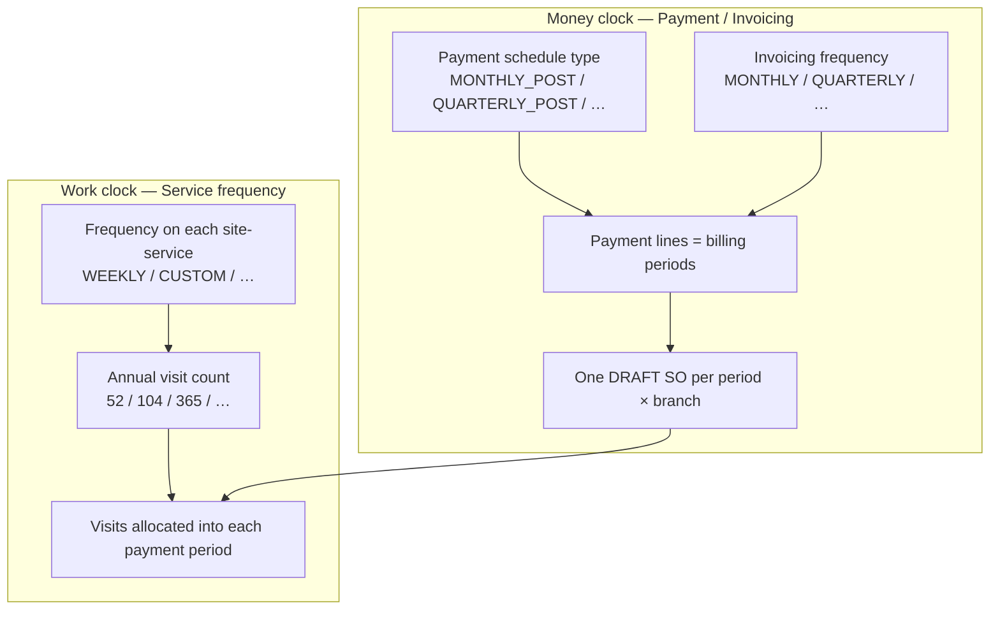
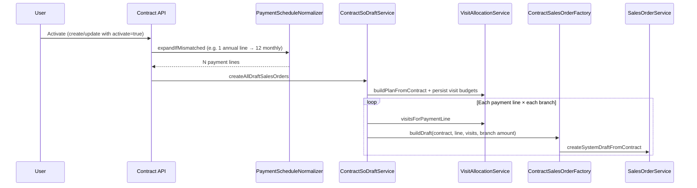

# Contract Sales Order Creation — Payment Terms, Service Frequencies & Visit Allocation

**Audience:** Product, Operations, Finance, Implementation, QA  
**Scope:** How Seravion Connect turns an **ACTIVE service contract** into **DRAFT Sales Orders (SOs)**, how **payment / billing periods** decide *how many* SOs exist, and how **site-service visit frequencies** decide *how many visits* land on each SO — without double-counting or overlapping periods.

**Related code (backend):**

| Area | Location |
|------|----------|
| Activate → draft SOs | `ContractServiceImpl.onContractActivated` → `ContractSoDraftService` |
| Payment period expand | `ContractPaymentScheduleNormalizer` |
| Visit split per period | `ContractVisitAllocationService` |
| SO payload from contract | `ContractSalesOrderFactory` |
| Multi-branch amount split | `ContractBranchSoSupport` |
| SO auto-heal (retain/soft-patch) | `ContractSoHealService` + `SalesOrderService.softPatchContractPeriodSo` |
| Service frequency enum | `GmaFrequency` |
| Excel frequency parse (import) | `ERP_ETL/.../frequency_parser.py` |

**Related docs:** [Sales Order Cancel & Visit Redistribution](./sales-order-cancel-visit-redistribution.md)

---

## 1. Purpose (Easy English)

A pest-control AMC contract usually has:

1. **Money schedule** — how the customer is billed (Monthly, Quarterly, Half-yearly, Advance, Milestone, Custom).
2. **Work schedule** — how often each **site + service** is visited (Weekly, Twice a week, Daily, Monthly, Custom annual counts, etc.).

These are **two different clocks**. The system must:

- Create the right **number of Sales Orders** from the money schedule.
- Put the right **visit counts** on each SO from the work schedule.
- Split visits so **Σ visits across all SOs = annual plan** for that site-service (no overlap, no missing visits).
- Put **remainder / “extra” visits on the last period(s)** when the year does not divide evenly.

**Business outcome:** One clear SO per billing period (per branch), each holding only that period’s money slice and visit budget, ready for tasks, job cards, and invoicing.

---

## 2. Two clocks — never confuse them



| Concept | What it controls | Examples |
|---------|------------------|----------|
| **Payment schedule / invoicing frequency** | How many **billing periods** (payment lines) → how many **SOs** | Monthly → 12 SOs in a 1-year contract |
| **Service visit frequency** | How many **visits per year** for that site-service, then split across those periods | Weekly → 52 visits/year; “twice a week” → 104 |

**Rule of thumb:**

> Billing Monthly does **not** mean “1 visit per month.”  
> A **Daily** service on a **Monthly** bill still gets ~365 visits/year, split across **12** SOs (~30–31 visits each, remainder on last months).

---

## 3. End-to-end flow (activation)



### Steps in plain language

1. Contract becomes **ACTIVE**.
2. Backend **normalizes payment lines** when schedule says Monthly/Quarterly/etc. but the stored lines don’t match (e.g. one “Year 1” import row → **12** monthly rows).
3. For each **payment line** and each **branch** that has sites:
   - Split that line’s **amount** by branch service value share.
   - Allocate **visits** for that period from the visit plan.
   - Create one **DRAFT** `SERVICE_CONTRACT` SO linked to that payment line.
4. Ops later **releases** each SO to OPEN before scheduling tasks.

**SO count formula (single branch):**

```
SO count ≈ number of payment lines
```

**Multi-branch:**

```
SO count ≈ payment lines × branches that have sites with services
```

---

## 4. Payment terms → how many SOs (money clock)

Contract duration drives **term months** (used for period count and for scaling annual visits on non-12-month terms):

| Duration option | Term months |
|-----------------|-------------|
| SIX_MONTHS | 6 |
| ONE_YEAR | 12 |
| TWO_YEARS | 24 |
| THREE_YEARS | 36 |
| CUSTOM | Months between start and end (inclusive-style count) |

### 4.1 Expected period count by payment schedule

| Payment schedule | Period size | Formula (1-year = 12 months) | Periods / SOs (1 yr, 1 branch) |
|------------------|-------------|------------------------------|-------------------------------|
| **MONTHLY_POST** | 1 month | `ceil(termMonths / 1)` | **12** |
| **QUARTERLY_POST** | 3 months | `ceil(termMonths / 3)` | **4** |
| **HALF_YEARLY_POST** | 6 months | `ceil(termMonths / 6)` | **2** |
| **ADVANCE_100** | Uses **invoicing frequency** for SO rows | Same as table below | e.g. Monthly invoicing → **12** SO rows (payment still “advance”) |
| **CUSTOM** | Uses **invoicing frequency** | Same as invoicing table | Depends on frequency |
| **MILESTONE** | Manual rows | User-defined | As many milestones as entered |

### 4.2 Invoicing frequency → months per period (CUSTOM / ADVANCE SO schedule)

| Invoicing frequency | Months per period | SOs in 1 year |
|---------------------|-------------------|---------------|
| MONTHLY | 1 | 12 |
| QUARTERLY | 3 | 4 |
| HALF_YEARLY | 6 | 2 |
| ANNUALLY | 12 | 1 |
| ON_MILESTONE / ON_SERVICE_COMPLETION | (not auto-split by months) | Keep user / milestone lines |

### 4.3 Money split across periods

Default UI/import may seed equal slices (`total ÷ N`). On **activate**, after the visit plan is built, each payment line amount is set to:

```
Σ (periodVisits × (serviceSaleValue ÷ annualFrequency))
```

for services present that period — so mixed frequencies produce uneven SO/payment amounts (e.g. ₹5k, ₹5k, ₹20k, …). The last mutable line absorbs rounding so the year still sums to contract total.

See §8.1 for the full Monthly + Quarterly worked example.

Each period row also keeps:

- **Period label** — `P1…P12` (monthly), `Q1…Q4`, `H1…H2`, `Y1…`
- **Description** — date range like `Jul – Aug 2026`
- **Due date** — last day of that billing period (anniversary-style from contract start)

### 4.4 Worked payment scenarios (1 branch, ONE_YEAR)

| Scenario | Payment type | Invoice plan | Payment lines | Draft SOs |
|----------|--------------|--------------|---------------|-----------|
| A | MONTHLY_POST | On schedule — Monthly | 12 | **12** |
| B | QUARTERLY_POST | Quarterly | 4 | **4** |
| C | HALF_YEARLY_POST | Half-yearly | 2 | **2** |
| D | ADVANCE_100 | Monthly SO schedule | 12 SO-period rows | **12** (customer still pays advance) |
| E | ADVANCE_100 | Annually | 1 | **1** |
| F | MILESTONE | On milestone | e.g. 3 user milestones | **3** |
| G | CUSTOM + MONTHLY | Monthly | 12 | **12** |

### 4.5 Activation safeguard (important)

If the header says **MONTHLY_POST** but only **one** payment line exists (classic import “Year 1 / full annual value”), activation **rebuilds** the 12 monthly lines **before** creating SOs.  
If any line is **paid** or **locked**, expand is skipped (Finance-safe).

---

## 5. Service frequencies → annual visits (work clock)

Frequencies live on each **contract site → service** row (`frequency` + optional `annualFrequency`).

### 5.1 Standard ERP enum defaults (`GmaFrequency`)

| Frequency | Default annual visits (12-month term) |
|-----------|----------------------------------------|
| WEEKLY | **52** |
| FORTNIGHTLY | **26** |
| MONTHLY | **12** |
| QUARTERLY | **4** |
| CUSTOM | **Must supply `annualFrequency`** (0 alone is invalid for planning) |

### 5.2 Common “multiplier” / custom patterns (import & GMA)

Excel / GMA often encode richer language. Import maps these into `CUSTOM` + an explicit annual count:

| Business wording | Typical annual visits | Stored frequency | Notes |
|------------------|----------------------|------------------|-------|
| Weekly / once a week | 52 | WEEKLY | Plain weekly |
| Twice a week / weekly ×2 | **104** | CUSTOM | 52 × 2 |
| Thrice a week / 3× weekly | **156** | CUSTOM | 52 × 3 |
| Fortnightly | 26 | FORTNIGHTLY | Every 2 weeks |
| Monthly | 12 | MONTHLY | Once a month |
| 3× monthly / thrice in a month | **36** | CUSTOM | 12 × 3 |
| Quarterly | 4 | QUARTERLY | |
| Daily | **365** | CUSTOM | Calendar days |
| Alternative / alternate days | **180** | CUSTOM | ≈ 365 ÷ 2 |
| Annually / once a year | **1** | CUSTOM | |
| Fully custom (e.g. 302) | **302** | CUSTOM | Explicit annual kept as-is |

**Visit count basis (Daily-style only):**

| Basis | When annual resolves to 365/260 | Effect |
|-------|----------------------------------|--------|
| CALENDAR_DAILY | Daily (365) | Use **365** |
| BUSINESS_DAILY | Daily | Use **260** working-day year |

Explicit CUSTOM totals that are **not** 365/260 (e.g. 302, 104) are **not** overwritten by visit-count basis.

### 5.3 Non–12-month contract terms

If term months ≠ 12, annual visits are scaled:

```
annual' = round(annual × termMonths / 12)
```

Example: Weekly (52) on a **6-month** contract → ~26 visits for the term.

### 5.4 Same site, multiple services (no overlap)

Each **(site, serviceType)** pair is planned **independently**.

Example — Site Biocon:

| Service | Frequency | Annual visits |
|---------|-----------|---------------|
| Rodocon | Weekly twice | 104 |
| Moscon | Monthly | 12 |
| Roachcon | Daily | 365 |

They do **not** share a visit pool. Each gets its own split across payment periods. Tasks later consume visits **per service line** on the SO.

### 5.5 Multiple sites

Same rule: allocation key is **contractSiteId + serviceTypeId**.  
Site A Weekly and Site B Weekly are separate annual buckets.

---

## 6. How visits are divided across SOs (the split algorithm)

### 6.1 Core algorithm (even spacing through the year)

For each site-service with `annualVisits` and `N` payment periods, visits are spread **evenly across the term** (cumulative floor), **not** piled only on the last SO(s):

```
for period i = 0 .. N-1:
  visits[i] = floor((i+1) × annual / N) − floor(i × annual / N)
```

Σ visits across all periods always equals **annual**.

**Why this matters — Quarterly service under Monthly billing**

Quarterly means **one service every 3 months**. With 12 monthly SOs the plan is:

| P1 | P2 | P3 | P4 | P5 | P6 | P7 | P8 | P9 | P10 | P11 | P12 |
|----|----|----|----|----|----|----|----|----|-----|-----|-----|
| 0 | 0 | **1** | 0 | 0 | **1** | 0 | 0 | **1** | 0 | 0 | **1** |

Wrong (old remainder-on-last style): `0,0,0,0,0,0,0,0,1,1,1,1` — four visits dumped into P9–P12, missing Q1–Q3 work.

**Bold** in tables = periods above the floor average (evenly spaced extras), not “only at year end.”

---

> **How to read every table below**  
> - Assumption: **ONE_YEAR** contract, **1 branch**.  
> - Row sum always equals **Annual**.  
> - Same frequency list under **each payment term**.  
> - Any other CUSTOM annual `N` uses: `split(N, periodCount)`.

**Frequency catalogue used in all tables**

| Service frequency (business wording) | Stored typically as | Annual visits |
|--------------------------------------|---------------------|---------------|
| Monthly service | MONTHLY | 12 |
| Quarterly service | QUARTERLY | 4 |
| Fortnightly | FORTNIGHTLY | 26 |
| Weekly (once a week) | WEEKLY | 52 |
| Twice a week | CUSTOM | 104 |
| Thrice a week (3×/week) | CUSTOM | 156 |
| 4× a week | CUSTOM | 208 |
| 3× a month | CUSTOM | 36 |
| Daily (calendar) | CUSTOM + CALENDAR_DAILY | 365 |
| Daily (business days) | CUSTOM + BUSINESS_DAILY | 260 |
| Alternative / alternate days | CUSTOM | 180 |
| Annually (once a year) | CUSTOM | 1 |
| Custom 14 (example) | CUSTOM | 14 |
| Custom 302 (example) | CUSTOM | 302 |

---

### 6.2 Monthly billing — `MONTHLY_POST` / Invoice Monthly → **12 SOs** (P1…P12)

| Service frequency | Annual | Split across P1 → P12 | Pattern (plain English) |
|-------------------|--------|------------------------|-------------------------|
| Monthly service | 12 | 1, 1, 1, 1, 1, 1, 1, 1, 1, 1, 1, 1 | 1 visit every month |
| Quarterly service | 4 | 0, 0, **1**, 0, 0, **1**, 0, 0, **1**, 0, 0, **1** | **1 visit every 3 months** (P3, P6, P9, P12) |
| Fortnightly | 26 | 2, 2, 2, 2, 2, **3**, 2, 2, 2, 2, 2, **3** | ~2/month; extras spaced |
| Weekly (once) | 52 | 4, 4, **5**, 4, 4, **5**, 4, 4, **5**, 4, 4, **5** | ~4–5/month, evenly spaced |
| Twice a week | 104 | 8, **9**, **9**, 8, **9**, **9**, 8, **9**, **9**, 8, **9**, **9** | ~8–9/month, evenly spaced |
| Thrice a week | 156 | 13, 13, 13, 13, 13, 13, 13, 13, 13, 13, 13, 13 | 13 every month |
| 4× a week | 208 | 17, 17, **18**, 17, 17, **18**, 17, 17, **18**, 17, 17, **18** | ~17–18/month |
| 3× a month | 36 | 3, 3, 3, 3, 3, 3, 3, 3, 3, 3, 3, 3 | 3 every month |
| Daily (calendar 365) | 365 | 30, 30, **31**, 30, **31**, 30, 30, **31**, 30, **31**, 30, **31** | ~30–31/month, spaced |
| Daily (business 260) | 260 | 21, **22**, **22**, 21, **22**, **22**, 21, **22**, **22**, 21, **22**, **22** | ~21–22/month |
| Alternative days | 180 | 15, 15, 15, 15, 15, 15, 15, 15, 15, 15, 15, 15 | 15 every month |
| Annually (once/year) | 1 | 0, 0, 0, 0, 0, 0, 0, 0, 0, 0, 0, **1** | Single visit on **P12** |
| Custom 14 | 14 | 1, 1, 1, 1, 1, **2**, 1, 1, 1, 1, 1, **2** | Mostly 1; extras on P6 & P12 |
| Custom 302 | 302 | 25, 25, 25, 25, 25, **26**, 25, 25, 25, 25, 25, **26** | Mostly 25; extras spaced |

---

### 6.3 Quarterly billing — `QUARTERLY_POST` / Invoice Quarterly → **4 SOs** (Q1…Q4)

| Service frequency | Annual | Split across Q1–Q4 |
|-------------------|--------|---------------------|
| Monthly service | 12 | 3, 3, 3, 3 |
| Quarterly service | 4 | 1, 1, 1, 1 |
| Fortnightly | 26 | 6, **7**, 6, **7** |
| Weekly (once) | 52 | 13, 13, 13, 13 |
| Twice a week | 104 | 26, 26, 26, 26 |
| Thrice a week | 156 | 39, 39, 39, 39 |
| 4× a week | 208 | 52, 52, 52, 52 |
| 3× a month | 36 | 9, 9, 9, 9 |
| Daily (calendar 365) | 365 | 91, 91, 91, **92** |
| Daily (business 260) | 260 | 65, 65, 65, 65 |
| Alternative days | 180 | 45, 45, 45, 45 |
| Annually (once/year) | 1 | 0, 0, 0, **1** |
| Custom 14 | 14 | 3, **4**, 3, **4** |
| Custom 302 | 302 | 75, **76**, 75, **76** |

---

### 6.4 Half-yearly billing — `HALF_YEARLY_POST` / Invoice Half-yearly → **2 SOs** (H1 / H2)

| Service frequency | Annual | H1 / H2 |
|-------------------|--------|---------|
| Monthly service | 12 | 6 / 6 |
| Quarterly service | 4 | 2 / 2 |
| Fortnightly | 26 | 13 / 13 |
| Weekly (once) | 52 | 26 / 26 |
| Twice a week | 104 | 52 / 52 |
| Thrice a week | 156 | 78 / 78 |
| 4× a week | 208 | 104 / 104 |
| 3× a month | 36 | 18 / 18 |
| Daily (calendar 365) | 365 | 182 / **183** |
| Daily (business 260) | 260 | 130 / 130 |
| Alternative days | 180 | 90 / 90 |
| Annually (once/year) | 1 | 0 / **1** |
| Custom 14 | 14 | 7 / 7 |
| Custom 302 | 302 | 151 / 151 |

---

### 6.5 Annual billing — Invoice Annually / single period → **1 SO** (Y1)

All annual visits sit on the **one** SO for that branch. No multi-period split.

| Service frequency | Annual | Split across Y1 |
|-------------------|--------|-----------------|
| Monthly service | 12 | 12 |
| Quarterly service | 4 | 4 |
| Fortnightly | 26 | 26 |
| Weekly (once) | 52 | 52 |
| Twice a week | 104 | 104 |
| Thrice a week | 156 | 156 |
| 4× a week | 208 | 208 |
| 3× a month | 36 | 36 |
| Daily (calendar 365) | 365 | 365 |
| Daily (business 260) | 260 | 260 |
| Alternative days | 180 | 180 |
| Annually (once/year) | 1 | 1 |
| Custom 14 | 14 | 14 |
| Custom 302 | 302 | 302 |

---

### 6.6 Advance payment (`ADVANCE_100`) — SO count follows **invoicing frequency**

Customer may pay 100% advance as one commercial payment, but **SO rows** still follow the invoice / SO schedule:

| Invoicing frequency on Advance | SO count (1 year) | Use visit split table |
|--------------------------------|-------------------|------------------------|
| MONTHLY | 12 | §6.2 Monthly |
| QUARTERLY | 4 | §6.3 Quarterly |
| HALF_YEARLY | 2 | §6.4 Half-yearly |
| ANNUALLY | 1 | §6.5 Annual |

Visit numbers are identical to the matching billing table above; only the commercial “who pays when” differs.

---

### 6.7 Milestone / Custom payment schedules

| Schedule | SO / period count | Visit split |
|----------|-------------------|-------------|
| **MILESTONE** | As many milestone rows as entered | `split(annual, milestoneCount)` — same even-spacing rule |
| **CUSTOM** + Monthly invoicing | 12 | Same as §6.2 |
| **CUSTOM** + Quarterly | 4 | Same as §6.3 |
| **CUSTOM** + Half-yearly | 2 | Same as §6.4 |
| **CUSTOM** + Annually | 1 | Same as §6.5 |

Example — **3 milestones**, Weekly (52): `split(52, 3)` → **17, 17, 18**.

---

## 7. Master comparison matrix (all payment terms × all frequencies)

| Service frequency | Annual | Monthly (12 SO) | Quarterly (4 SO) | Half-yearly (2 SO) | Annual (1 SO) |
|-------------------|--------|-----------------|------------------|--------------------|---------------|
| Monthly service | 12 | 1 every month | 3, 3, 3, 3 | 6 / 6 | 12 |
| Quarterly service | 4 | **0,0,1** repeating (every 3rd month) | 1, 1, 1, 1 | 2 / 2 | 4 |
| Fortnightly | 26 | 2s with **3** on P6 & P12 | 6, **7**, 6, **7** | 13 / 13 | 26 |
| Weekly (once) | 52 | 4,4,**5** repeating | 13×4 | 26 / 26 | 52 |
| Twice a week | 104 | 8/**9** alternating pattern | 26×4 | 52 / 52 | 104 |
| Thrice a week | 156 | 13 every month | 39×4 | 78 / 78 | 156 |
| 4× a week | 208 | 17,17,**18** repeating | 52×4 | 104 / 104 | 208 |
| 3× a month | 36 | 3 every month | 9×4 | 18 / 18 | 36 |
| Daily (calendar 365) | 365 | ~30–31 spaced | 91,91,91,**92** | 182 / **183** | 365 |
| Daily (business 260) | 260 | ~21–22 spaced | 65×4 | 130 / 130 | 260 |
| Alternative days | 180 | 15 every month | 45×4 | 90 / 90 | 180 |
| Annually (once/year) | 1 | all on **P12** | all on **Q4** | all on **H2** | 1 |
| Custom 14 | 14 | mostly 1; **2** on P6 & P12 | 3,**4**,3,**4** | 7 / 7 | 14 |
| Custom 302 | 302 | mostly 25; **26** on P6 & P12 | 75,**76**,75,**76** | 151 / 151 | 302 |

**Multi-service site:** look up **each** service row separately, then put all those visit lines on the **same** period SO.  
**Multi-branch:** repeat the whole matrix once per branch (separate SOs).

---

## 8. Money vs visits on one SO (alignment)

**Correct commercial rule:** SO amount for a period = **sum of (visits × unit price)** for services that actually run that period.  
Unit price stays `serviceSaleValue ÷ annualFrequency`. **Do not** flatten every month to `contractTotal ÷ 12` when frequencies differ.

```
unitPrice     = serviceSaleValue ÷ annualFrequency
lineValue     = visitsOnThatSO × unitPrice
SO total      = Σ lineValue for services with visits > 0 that period
```

Services with **0 visits** that month are **omitted** from the SO (and contribute **₹0** that month).

Visits and money stay on the **same** period SO: you do not put January visits on the March SO.

### 8.1 One site, mixed frequencies under Monthly billing

**Example:** Service 1 Monthly + Service 2 Quarterly, Monthly billing, total ₹1,20,000.

| | Service 1 | Service 2 | Contract |
|--|-----------|-----------|----------|
| Frequency | Monthly | Quarterly | Monthly billing |
| Annual visits | 12 | 4 (on **P3, P6, P9, P12**) | — |
| Sale value | ₹60,000 | ₹60,000 | **₹1,20,000** |
| Unit price | 60,000÷12 = **₹5,000** | 60,000÷4 = **₹15,000** | — |

**Month-by-month SO amounts (pattern like ₹5k, ₹5k, ₹20k, …):**

| Period | Services on SO | Amount on SO |
|--------|----------------|--------------|
| P1 | S1 only (1 visit) | **₹5,000** |
| P2 | S1 only | **₹5,000** |
| **P3** | S1 (₹5,000) + S2 (₹15,000) | **₹20,000** |
| P4 | S1 only | **₹5,000** |
| P5 | S1 only | **₹5,000** |
| **P6** | S1 + S2 | **₹20,000** |
| P7 | S1 only | **₹5,000** |
| P8 | S1 only | **₹5,000** |
| **P9** | S1 + S2 | **₹20,000** |
| P10 | S1 only | **₹5,000** |
| P11 | S1 only | **₹5,000** |
| **P12** | S1 + S2 | **₹20,000** |

**Detail — non-quarter month (P1):**

| Line | Visits | Amount |
|------|--------|--------|
| Service 1 | 1 | **₹5,000** |
| Service 2 | 0 → omitted | — |
| **SO total** | | **₹5,000** |

**Detail — quarter month (P3):**

| Line | Visits | Amount |
|------|--------|--------|
| Service 1 | 1 | **₹5,000** |
| Service 2 | 1 | **₹15,000** |
| **SO total** | | **₹20,000** |

**Year check:**

- 8 × ₹5,000 = ₹40,000 (S1-only months)  
- 4 × ₹20,000 = ₹80,000 (S1+S2 months)  
- **Total = ₹1,20,000**  
- Service 1 across year: 12 × ₹5,000 = ₹60,000  
- Service 2 across year: 4 × ₹15,000 = ₹60,000  

#### Wrong model (do not use)

Flattening every SO to ₹10,000 (`1,20,000 ÷ 12`) and scaling Service 1 up on months without Service 2. That mis-states which month’s work is worth how much.

#### One-line summary

> **SO amount = only the services present that month × their unit prices** (e.g. ₹5k + ₹5k + ₹20k + …), not a flat equal installment every month.

On activate, payment-line amounts are set from this same visit × unit-price math so the billing schedule and SO schedule stay aligned.

---

## 9. Multi-branch contracts

Sites can belong to different branches.

For **each** payment period:

1. Split period **amount** by each branch’s share of total service sale value.
2. Create an SO **only for that branch’s sites**.
3. Visit budgets for that SO include only those site-service keys.

**Example:** 12 monthly periods × 2 branches → up to **24** draft SOs.

Branch A’s visits never consume Branch B’s period capacity (same as cancel/redistribute rules).

---

## 10. Full worked example (like client Biocon-style)

**Contract**

- Duration: ONE_YEAR  
- Payment: MONTHLY_POST  
- Invoice: On schedule — Monthly  
- Total: ₹13,20,000  
- 1 site, 1 branch  

**After activation (correct)**

- **12** payment lines (P1…P12), ~₹1,10,000 each  
- **12** DRAFT/OPEN SOs  

**Services on site**

| Service | Frequency | Annual |
|---------|-----------|--------|
| S1 | Weekly | 52 |
| S2 | Twice a week | 104 |
| S3 | Daily | 365 |
| S4 | Monthly | 12 |

**Total planned visits on contract** = 52 + 104 + 365 + 12 = **533**  
**Across 12 SOs:** each SO’s visit sum varies slightly because remainders land on later months; **year total stays 533**.

Sample for **Weekly (52)** on Monthly billing:

| Period | Visits |
|--------|--------|
| P1, P2 | 4 |
| P3 | 5 |
| P4, P5 | 4 |
| P6 | 5 |
| … pattern `4,4,5` repeats … |
| **Sum** | **52** |

Sample for **Quarterly service (4)** on Monthly billing:

| Period | Visits |
|--------|--------|
| P3, P6, P9, P12 | **1** each |
| All other months | 0 |
| **Sum** | **4** |

If the contract had been wrongly left with **one** “Year 1” payment line, activation would have created **1** SO with **all** visits and the full amount — that is the failure mode the payment-schedule normalizer and this document are designed to prevent.

---

## 11. What is *not* overlapping

| Risk | How the system avoids it |
|------|---------------------------|
| Same visit counted in two months | Each visit budget cell belongs to **one** payment line / SO |
| Two services stealing each other’s visits | Separate keys per site + serviceType |
| Two branches fighting for one period | Separate SOs + branch-scoped remaining visits |
| Re-creating a cancelled period SO | Remaining = period plan − completed on cancelled SOs ([cancel doc](./sales-order-cancel-visit-redistribution.md)) |
| Double invoice same period | Billing gates / period invoice rules on payment line |

---

## 12. Ops checklist before / after activate

**Before activate**

- [ ] Payment type + invoice plan match commercial intent (Monthly → expect 12 periods).  
- [ ] Payment grid shows the right number of rows (or rely on activate expand for scheduled types).  
- [ ] Each site-service has frequency (and `annualFrequency` if CUSTOM).  
- [ ] Sum of payment line amounts = total sale value.  
- [ ] Sum of service sale values = total sale value.  
- [ ] Preview visit plan (API / UI) — annual vs allocated totals match; warnings empty.

**After activate**

- [ ] SO Schedule count = payment periods × branches.  
- [ ] Spot-check one high-frequency service (Daily / Weekly ×2): early SO visits ≈ base, last SO(s) hold remainders.  
- [ ] Σ visits on all SOs for a service = annual plan.  
- [ ] Release periods to OPEN only when ready for tasks.

---

## 13. Acceptance criteria (Easy English)

1. Monthly billing + 1-year contract creates **12** payment periods and **12** draft SOs per branch.  
2. Quarterly / half-yearly / annual billing create **4 / 2 / 1** SOs per branch for a 1-year term.  
3. Weekly / fortnightly / monthly / quarterly / custom / daily / twice-weekly / thrice-weekly all convert to a clear **annual visit count**, then split across those periods.  
4. When annual visits do not divide evenly across periods, extras are **spaced through the year** (not only piled on the last SO) — e.g. Quarterly service under Monthly billing is one visit every 3 months.  
5. Multiple services on one site and multiple sites never share or overwrite each other’s visit budgets.  
6. Multi-branch contracts create separate SOs and amounts per branch without mixing sites.  
7. Activating a contract whose header is Monthly but had a single annual payment row **rebuilds** monthly periods before SO creation (unless lines are paid/locked).

---

## 14. Glossary

| Term | Meaning |
|------|---------|
| **Payment line / billing period** | One money slice of the contract; parent of one period SO (per branch) |
| **Sales Order (SO)** | Executable period document: sites, services, visits, value |
| **Annual frequency** | Planned visits for that site-service over the contract term year (scaled if term ≠ 12 months) |
| **Visit plan / visit budget** | Per-period planned visits stored for allocation and remaining-visit logic |
| **Remainder / cover-up** | Extra visits assigned to the last `annual % periods` SOs |
| **Visit count basis** | Calendar 365 vs business 260 for daily-style annual totals |

---

## 15. Change log

| Date | Change |
|------|--------|
| 2026-08-04 | Initial whole-doc: payment scenarios, frequency matrix, remainder rules, multi-site/branch, activation expand |
| 2026-08-04 | Backend: `ContractPaymentScheduleNormalizer` on activate so Monthly headers cannot silently create 1 SO from a single annual payment line |
| 2026-08-04 | Expanded §6: full frequency catalogue + complete split tables per payment term and §7 master matrix |
| 2026-08-04 | Visit split: even spacing (cumulative floor) so Quarterly under Monthly = P3/P6/P9/P12, not last-4 dump; docs + `splitAcrossPeriods` updated |
| 2026-08-04 | §8.1: mixed frequencies — SO amount = visits × unit price (₹5k / ₹20k pattern), not flat total÷12; activate applies visit-based payment amounts |
| 2026-08-04 | §16: SO auto-heal (retain existing SOs) — manual API, UI amend, ETL ACTIVE amend HTTP heal |

---

## 16. SO auto-heal (retain existing SOs)

For **ACTIVE** contracts whose payment schedule is already trusted, heal fixes wrong SO coverage **without** cancelling SOs that already have tasks.

### Behaviour

1. Rebuild visit budgets; refresh unpaid/unlocked payment amounts via `applyVisitBasedPaymentAmounts`.
2. For each payment line × branch:
   - **Existing DRAFT/OPEN SO** → soft-patch visits/prices/period label (`planned = max(periodBudget, executed)`); cancel unpaid **DRAFT** invoices after a real patch.
   - **Posted / SENT / PAID invoice** on that SO → skip money/visit patch (`SKIPPED_POSTED_INVOICE`); still create missing period SOs.
   - **No non-cancelled SO** → create DRAFT via `createBranchDraftSalesOrdersForLine`.
3. Completed tasks stay on the **same SO id**.

### Manual API (one-shot)

| Endpoint | Notes |
|----------|--------|
| `POST /api/v1/contracts/{contractId}/heal-sales-orders?dryRun=true\|false` | Single contract; **dryRun=true** first |
| `POST /api/v1/contracts/heal-sales-orders/batch?dryRun=true\|false` | Body optional: `{ "contractIds": [...], "status": "ACTIVE" }` |

RBAC: `CONTRACT_MANAGEMENT_EDIT` or CEO. Response: `ContractSoHealReport` (patched / created / skipped + per-SO deltas).

**Ops — heal all ACTIVE contracts (no frontend):**

```bash
# 1) Login → copy JWT
# 2) Dry-run ALL ACTIVE (default dryRun=true)
curl -s -X POST "http://localhost:8080/api/v1/contracts/heal-sales-orders/batch?dryRun=true" \
  -H "Authorization: Bearer YOUR_JWT" \
  -H "Content-Type: application/json" \
  -H "X-Tenant-ID: YOUR_TENANT" \
  -d "{}"

# 3) Apply ALL ACTIVE
curl -s -X POST "http://localhost:8080/api/v1/contracts/heal-sales-orders/batch?dryRun=false" \
  -H "Authorization: Bearer YOUR_JWT" \
  -H "Content-Type: application/json" \
  -H "X-Tenant-ID: YOUR_TENANT" \
  -d "{}"

# Optional: only listed contracts
curl -s -X POST "http://localhost:8080/api/v1/contracts/heal-sales-orders/batch?dryRun=false" \
  -H "Authorization: Bearer YOUR_JWT" \
  -H "Content-Type: application/json" \
  -d "{\"contractIds\":[\"CTR-154B26AB71\"]}"

# Single contract dry-run then apply
curl -s -X POST "http://localhost:8080/api/v1/contracts/CTR-154B26AB71/heal-sales-orders?dryRun=true" \
  -H "Authorization: Bearer YOUR_JWT"
curl -s -X POST "http://localhost:8080/api/v1/contracts/CTR-154B26AB71/heal-sales-orders?dryRun=false" \
  -H "Authorization: Bearer YOUR_JWT"
```

**Unit tests (backend):**

```bash
cd seravion-connect-backend
./mvnw.cmd -Dtest=ContractSoHealServiceTest,SoftPatchContractPeriodSoTest test
```

| Class | Covers |
|-------|--------|
| `ContractSoHealServiceTest` | dryRun vs apply, retain+create, posted invoice skip, terminal/exists/no-visits skips, 404, no payment lines, batch |
| `SoftPatchContractPeriodSoTest` | executed floor, SENT/PAID skip, product/cancelled/fulfilled gates, no-positive-lines, draft-cancel flag |

### UI amend

After a successful contract amend commit, `ContractServiceImpl` calls `ContractSoHealService.healContractApply` (same path as the API).

### Customer ETL ACTIVE amend

When `active_contract_amend_mode` / `--amend-active-contracts`:

1. ETL still scales financials + writes amendment log in SQL.
2. ETL **does not** INSERT empty DRAFT SO shells for new branches.
3. After the amend transaction **commits**, ETL calls:

   `POST {backend_base_url}/api/v1/contracts/{contractId}/heal-sales-orders?dryRun=false`

Config (`ERP_ETL/config/import.yaml`):

| Key | Purpose |
|-----|---------|
| `heal_sos_on_active_amend` | Default `true` |
| `backend_base_url` | e.g. `http://localhost:8080` |
| `backend_heal_token` | JWT with contract edit authority |
| `backend_tenant_id` | Optional `X-Tenant-ID` |

Heal HTTP failure is reported as an import error for that contract (retry once); do not leave fat/missing SOs silently.
