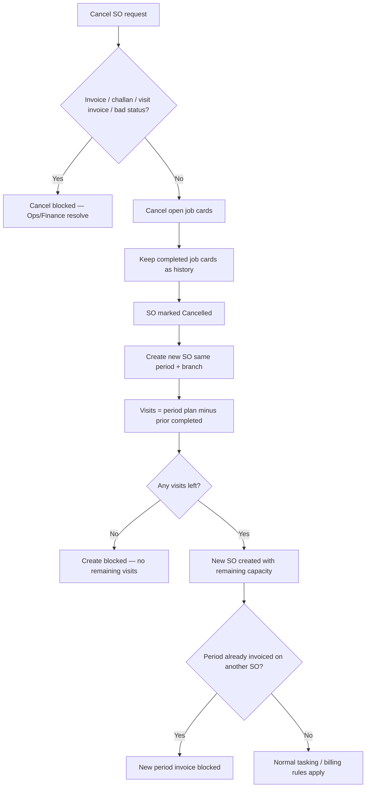

# Sales Order Cancel & Visit Redistribution — Business Guide

## 1. Purpose & Business Need

Contract service work is often planned in **billing periods** (for example: Month 1, Month 2, or “50% Advance”). Each period gets a **Sales Order (SO)** that holds the planned visit count for sites and services.

In real operations, a period SO sometimes needs to be cancelled and recreated — wrong period selected, wrong branch mix, or open job cards that should not continue. Previously, if even one job card was already **completed**, cancel was blocked. That forced awkward workarounds and made it hard to keep history while freeing the billing period for a clean replacement SO.

This change allows a **safe cancel** when finance has not billed the period, keeps completed work as history, soft-cancels only open job cards, and when you create a **new SO for the same billing period**, automatically gives only the **remaining visits** (period plan minus visits already completed on cancelled SOs for that period and branch).

**Business outcomes:**

- Operations can fix a bad period SO without losing proof of completed visits.
- The replacement SO cannot “re-grant” visits that were already done.
- Finance cannot accidentally invoice the same billing period twice across old and new SOs.
- Product sales and one-time SOs keep their existing cancel rules (this redistribute logic is for contract period SOs).

---

## 2. Who this affects

| Role | What they notice |
|------|------------------|
| **Sales / Contract ops** | Can cancel an Open/Draft contract SO even if some visits are completed (when not billed / no challans). When recreating for the same period, visit quantities show the remaining balance. |
| **Dispatchers / Task planners** | After cancel, open job cards are cancelled; completed job cards stay completed on the old SO. New tasks are booked only against the new SO’s remaining capacity. |
| **Finance** | Cancel is still blocked if an invoice (including visit invoices) or challan path is active. A new SO for a period that was already invoiced on another SO cannot get another period invoice draft. |
| **Branch managers** | Remaining visits and active SO checks are **branch-aware** — another branch’s SO does not consume this branch’s slot or remaining visits. |

---

## 3. Core rules (plain language)

### 3.1 When can you cancel a Sales Order?

You **can cancel** an Open or Draft SO when **all** of the following are true:

- Status is Draft or Open (not Fulfilled, Billed, or already Cancelled).
- No challans / product dispatch against the SO.
- No **active** (non-cancelled) invoice linked to the SO.
- No active **visit invoices** raised from visits on that SO.

You **can cancel even if** some job cards are **Completed**. Those completed cards stay as history. Open cards (Pending, Overdue, Travel started, In progress, and similar open states) are auto-cancelled with the SO.

### 3.2 What happens to job cards on cancel?

| Job card state | On SO cancel |
|----------------|--------------|
| Completed | **Kept as Completed** on the cancelled SO (history). |
| Open (pending / overdue / in progress / travel started, etc.) | **Cancelled** with the SO. |
| Already cancelled | Left as cancelled. |

Completed work is **not moved** onto the new SO. It stays on the old cancelled SO for audit and visit history.

### 3.3 How does the replacement SO get its visit count?

For a **service contract** SO tied to a **billing period** (contract payment line) and **branch**:

> **New planned visits = Period budget − Visits already completed on cancelled SOs for that same period + branch**

Rules:

- Count is per **site + service** (each service line has its own remaining).
- New SO starts with **executed visits = 0**; capacity is already reduced by lowering the planned visits.
- If **every** line has zero remaining, create is **rejected** with a clear message: no remaining visits for this billing period.
- If the user tries to enter more visits than remaining, the system **caps** to remaining (does not inflate capacity).
- Product sale / one-time SOs are **not** part of this redistribute math.

### 3.4 Invoice safety (cannot double-bill a period)

| Situation | Result |
|-----------|--------|
| Cancel while SENT / PARTIAL / PAID / OVERDUE invoice exists | **Cancel blocked** — contact Finance. |
| Cancel while DRAFT invoice exists **and has payments** | **Cancel blocked** — contact Finance. |
| Cancel while only **DRAFT** invoice(s) with **no payments** | **Cancel allowed** — drafts are auto-cancelled with the SO. |
| Finance cancels or deletes the draft first, then SO cancel | **Allowed** (manual path). |
| Cancel while only cancelled invoices exist | **Cancel allowed**. |
| Cancelled SO | Still **cannot** be invoiced. |
| New SO for same period, but an earlier SO for that period already has a live invoice | **New period invoice blocked** — period already billed. |
| Visit-based invoicing already created non-draft visit invoices for the SO | **Cancel blocked** until those invoices are cancelled/credited in Finance. |

---

## 4. Real scenarios — Positive (should work)

### Scenario A — Empty Open SO

**Story:** Ops created SO-100 for “April – Branch Andheri” by mistake. No job cards yet. No invoice.

**Action:** Cancel SO-100.

**Result:** SO becomes Cancelled. Period becomes free again for a correct SO.

---

### Scenario B — Only open job cards

**Story:** SO-101 has 3 Pending job cards. Customer asks to pause and redo the period SO.

**Action:** Cancel SO-101 (no invoice, no challan).

**Result:** All 3 job cards become Cancelled. SO Cancelled. Period can be recreated.

---

### Scenario C — Mix of completed and open work (core new case)

**Story:**

- Period budget for Cockroach service at Site A = **4 visits**.
- SO-102 used that period.
- Tech completed **1** visit; **1** Pending job card remains.
- No invoice, no challan.

**Action:** Cancel SO-102.

**Result:**

- Completed job card stays **Completed** on SO-102 (history).
- Pending job card is **Cancelled**.
- SO-102 is **Cancelled**.

**Then recreate** a new SO for the same April period + same branch:

- New line visits = **4 − 1 = 3**.
- Team can schedule up to **3** more visits on the new SO.
- The old completed visit remains visible on the cancelled SO’s history / execution summary.

---

### Scenario D — Use remaining visits on the new SO

**Story:** After Scenario C, new SO-103 has 3 visits remaining. Ops schedules 3 tasks and completes them.

**Result:** Capacity exhausts normally on SO-103. No extra visits beyond 3.

---

### Scenario E — Product sale / one-time SO

**Story:** A product sale SO needs cancel. It has no contract billing period redistribution.

**Result:** Existing cancel rules still apply (invoice / challan / status). There is **no** “remaining visits” recalculation — that logic is only for contract period service SOs.

---

### Scenario F — Period only has cancelled prior SOs

**Story:** April period had SO-104, which was cancelled. No Open SO exists for April on this branch.

**Result:** April still appears as a **selectable** billing period. When creating the new SO, the form shows **remaining visits** (budget minus any completed history from cancelled SOs), not the full original budget if some visits were already done.

---

## 5. Real scenarios — Reverse / blocked (should fail safely)

### Scenario G — Completed work already invoiced

**Story:** SO has 1 completed visit and a Sent/Paid invoice for the period.

**Action:** Try to cancel.

**Result:** **Blocked.** Message points to Finance. Completed history must not be used to reopen billing by cancelling under an active invoice.

---

### Scenario H — Products already dispatched

**Story:** SO has challans (goods out).

**Action:** Try to cancel.

**Result:** **Blocked.** Dispatch has started; cancel is not allowed.

---

### Scenario I — SO already Fulfilled or Billed

**Story:** Period work finished and SO moved to Fulfilled/Billed.

**Action:** Try to cancel.

**Result:** **Blocked.** Those statuses are not cancellable.

---

### Scenario J — Another Open SO still holds the period

**Story:** Branch Andheri already has an Open SO for April. User tries to create a second Open SO for the same April period on Andheri.

**Result:** **Blocked** (conflict). Only after the active one is cancelled (or otherwise removed from the “active” set) can a replacement be created.

---

### Scenario K — All visits already completed on cancelled SOs

**Story:** Period budget = 4. Earlier cancelled SOs already have **4** completed visits for that site/service.

**Action:** Create a new SO for the same period.

**Result:** **Blocked** — “No remaining visits for this billing period.” There is nothing left to schedule.

---

### Scenario L — User tries to type more visits than remaining

**Story:** Remaining = 2. User (or an old draft) tries to set visits = 5.

**Result:** System does **not** allow over-capacity. Visits are limited to remaining (or create is rejected if nothing remains).

---

### Scenario M — Invoice from a cancelled SO

**Story:** Someone tries to raise a FROM-SO invoice against a Cancelled SO.

**Result:** **Blocked.** Cancelled SOs are not invoiceable.

---

### Scenario N — Period already billed on an old SO; new SO tries auto/manual period invoice

**Story:**

1. Old SO for April was invoiced (Sent/Paid) then somehow replaced in operations thinking.
2. Or: cancel was never possible because invoice existed — but if a new SO is created for the same period after invoice history on another SO for that period…

**Rule in force:** If **any** SO for that payment period (+ branch) already has a **non-cancelled** invoice, the **new** SO cannot get another period invoice draft.

**Result:** Double billing of the same commercial period is blocked.

---

### Scenario O — Visit invoicing already happened

**Story:** Contract bills per visit / every N visits. Visit invoice events already exist for this SO’s completed visits.

**Action:** Try to cancel the SO.

**Result:** **Blocked** until Finance cancels/credits those visit invoices. Protects money trail tied to those visits.

---

### Scenario P — Two branches, same contract period

**Story:**

- Branch Andheri has Open SO for April.
- Branch Bandra also needs April work.

**Result:** Andheri’s Open SO does **not** block Bandra’s April SO. Remaining completed visits are also counted **per branch**. One branch’s history does not steal the other’s capacity.

---

### Scenario Q — System / amend draft recreate after cancel

**Story:** After a safe cancel, the system or an amend flow drafts a new contract SO for the same period.

**Result:** Draft uses the **same reduced remaining visits** path as manual create — not the full original period budget.

---

### Scenario R — Task eligibility after cancel

**Story:** Dispatcher looks for SOs eligible for new tasks.

**Result:**

- Cancelled SO never appears as eligible for new tasks.
- New SO appears only when it has **remaining visit capacity** greater than zero.

---

## 6. How screens behave for users

### 6.1 Cancel Sales Order modal

- System checks live eligibility before/around cancel.
- If cancel is allowed but completed job cards exist, user sees a **warning**, not a hard stop:  
  *Completed cards kept as history; open cards will be cancelled.*
- If invoice, challan, or status blocks cancel, the modal shows those blockers clearly.

### 6.2 Add Sales Order (contract period hydrate)

- When user picks a contract billing period, planned visits on the form prefer **remaining visits** when the system provides them.
- Lines with **zero remaining** drop out of the hydrate (nothing left to sell/schedule for that service).
- Totals follow the reduced visit quantities.

### 6.3 Tasks after recreate

- New tasks consume capacity from the **new SO’s reduced visit plan**.
- Historical completed visits stay on the **cancelled** SO for reporting and audit.

---

## 7. Cross-module picture (what stays consistent)

| Module touchpoint | Behavior after this change |
|-------------------|----------------------------|
| **Tasks** | Create/schedule limited by new SO visit capacity; cancel soft-clears open cards only. |
| **Visit history** | Completed visits on cancelled SO remain visible for that SO. |
| **Contract billing periods** | Cancelled period can become selectable again; UI can show remaining vs planned. |
| **Invoicing** | Cancelled SO not invoiceable; period double-bill guard across SOs. |
| **Quotation / GMA reverse on cancel** | Unchanged from existing cancel behavior. |

---

## 8. Acceptance checklist (business)

- [ ] Open SO with no tasks cancels successfully (when not billed / no challan).
- [ ] Open SO with only open job cards cancels; those cards become cancelled.
- [ ] Open SO with completed + open cards, no invoice: cancel OK; completed kept; open cancelled.
- [ ] Recreate same period + branch: visits = budget − prior completed.
- [ ] If prior completed uses full budget: create rejected with clear “no remaining visits” message.
- [ ] Active Open SO on same period + branch still blocks a second active SO.
- [ ] Invoice SENT/PAID (or draft with payments) still blocks cancel.
- [ ] DRAFT invoice with no payments: SO cancel allowed; draft auto-cancelled (or Finance cancels/deletes draft first).
- [ ] Visit invoices still block cancel until cleared in Finance.
- [ ] New SO cannot period-invoice if another SO for that period already has a live invoice.
- [ ] Other branch’s SO does not block or consume this branch’s remaining visits.
- [ ] Product sale / one-time cancel path unchanged (no redistribute).
- [ ] Cancel modal warns on completed history instead of treating it as a hard block when otherwise eligible.

---

## 9. What changed (basic summary)

In simple terms, Sales Order cancel and recreate for **contract billing periods** now work like this:

1. **You can cancel** an Open/Draft service SO even after some visits are completed — as long as the SO is not tied to active invoices, visit invoices, challans, or closed statuses.
2. **Completed visits stay on the old SO** as history. Only open job cards are cancelled with the SO.
3. **When you create a new SO for the same period and branch**, the system gives only the **leftover visits** (what was planned for the period minus what was already completed earlier).
4. **If nothing is left**, you cannot create another SO for that period.
5. **Finance is protected:** SENT/paid invoices still block SO cancel. A **draft with no payments** can be revoked with the SO (or cancelled by Finance first). You still cannot bill the same period twice across an old and a new SO.
6. **Branches stay separate:** one branch’s cancelled history and open SOs do not take away another branch’s capacity.
7. **Product sales / one-time orders** keep the old cancel behavior; this remaining-visit logic is for contract period service work.
8. On the screens, cancel shows a **friendly warning** about completed history, and Add Sales Order loads **remaining** visit counts for the period when available.

Nothing in this summary requires technical knowledge to operate day to day: cancel safely when allowed, recreate with leftover visits, and let Finance keep control of billing.
