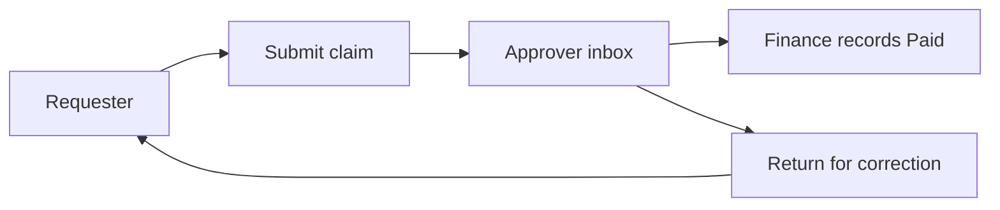
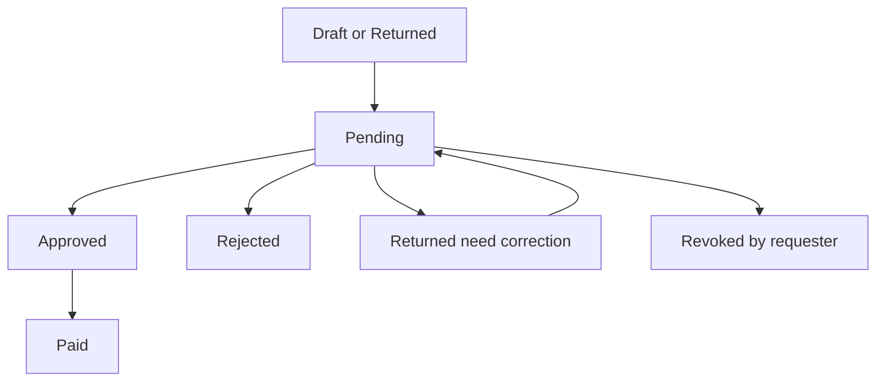
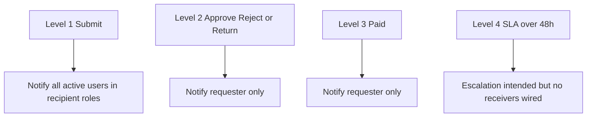
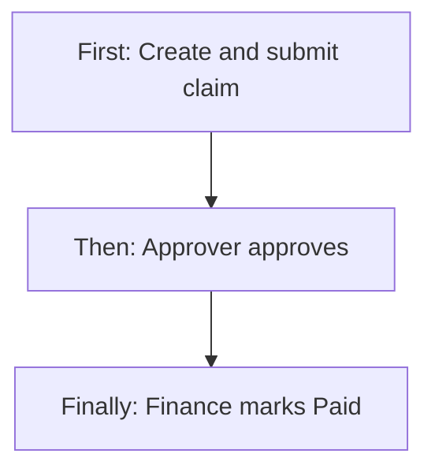
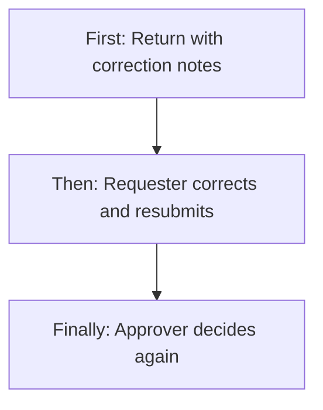
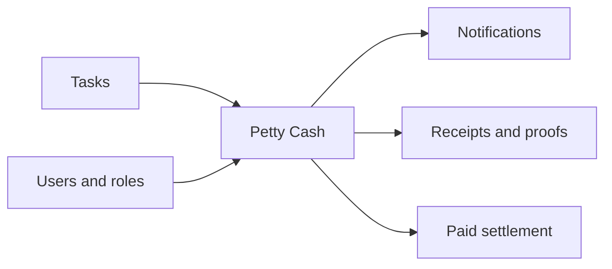
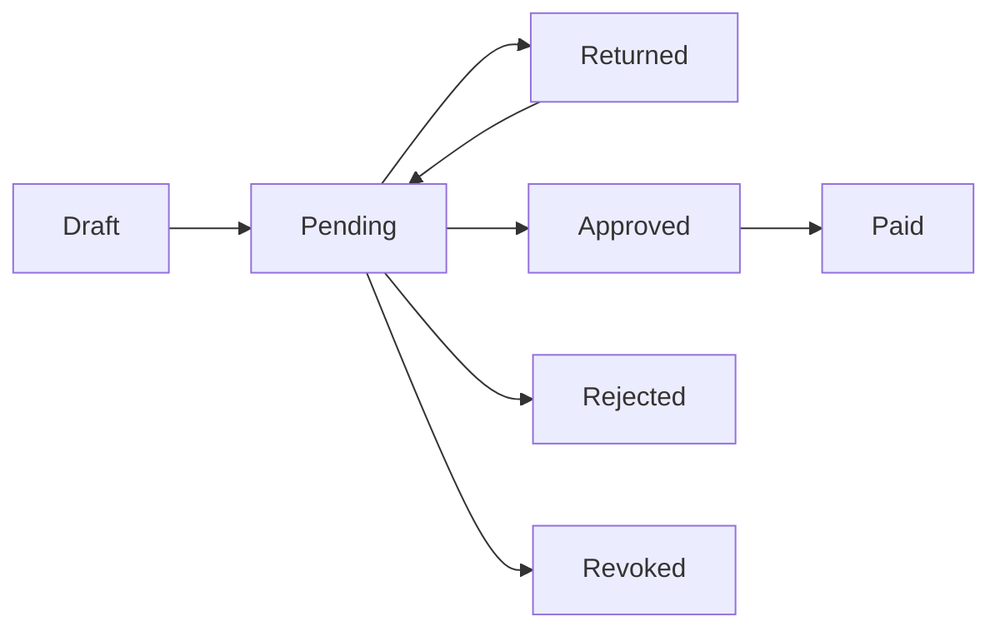

# Petty Cash Management — Product & Business Documentation

## 1. Purpose & Business Need

Field staff and office employees often spend small amounts out of pocket (fuel, conveyance, chemicals, stationery, vendor payments, and similar). Finance needs a controlled path from **claim → review → correction if needed → approval → payment**, with receipts and an audit trail.

**Petty Cash Management** (web menu: **Finance & Accounts → Petty cash**; mobile: Petty Cash screens) is that expense reimbursement workflow. Requesters create drafts, attach receipts, choose who should review (by role), and submit. Approvers Approve, Reject, or **Return for correction**. After Approve, finance (or an authorized payer) records **Paid** with transaction proof.

**Outcomes today:**

- Create and edit Draft / Returned requests (web + mobile)
- Submit to Pending with recipient roles and notifications
- Approver inbox (Received) — Approve / Reject / Return for correction
- Record payment (Paid) with mode, reference, date, optional proof
- Requester revoke while Pending
- Dashboard / My Request / Received lists, filters, Excel export
- Link expense to a task (field job tagging)
- Receipt and payment-proof documents with download

**What this module is not:** General AP bills, payroll salary, or hard-deleting claims. Rejected / Returned / Revoked rows stay for history.

**Channels:** Central **Web ERP** (full approve + pay + export) and **Mobile app** (primarily create, track own requests, receipts; bulk settlement typically on web per mobile product notes).

---

## 2. Users & Roles (who uses this and why)

### 2.1 Requester (technician / staff)

Creates expenses for themselves, attaches receipts, submits for review, edits when Draft or Returned, revokes while Pending, tracks until Paid.

### 2.2 Approver / supervisor (operations or line manager)

Has Petty Cash **Approve** and is in the request’s **recipient roles**. Reviews Pending items in Received inbox: Approve (with approved amount), Reject (reason), or Return for correction (notes).

### 2.3 Finance / payer

Has Petty Cash **Edit** and/or **Approve**. After status is Approved, records payment (Paid). Often done on web; mobile notes that high-level settlement may require the web portal.

### 2.4 Company CEO / platform bypass

Can view, decide, and pay without being limited to recipient-role membership (platform bypass).

### 2.5 Read-only finance / ops

Petty Cash **Read** opens the menu and Dashboard list (branch-scoped expenses). May not see My Request or Received without Request / Approve rights.

---

## 3. Access Control (RBAC)

### 3.1 How access works

Module: **Petty Cash Management**.

| Permission | Business effect |
|------------|-----------------|
| **Read** | Menu, open screens, Dashboard expense list |
| **Request** (or Add fallback on web) | **My Request** tab, Add Request |
| **Approve** | **Received Request** tab; decide Approve / Reject / Return (also must be on recipient roles, except CEO bypass) |
| **Edit** | Can Record Payment (with Approve also allowed to pay) |
| **Export** | Excel export and (with rules) document download gates on server |

**Record-level rules:**

- **My Request:** only claims where I am the requester  
- **Received:** claims whose recipient roles include my role (inbox)  
- **Dashboard (All):** expenses in my effective branches (CEO → all active branches)  
- **Decide:** Pending + (CEO/ROOT bypass **or** Approve permission **and** my role ∈ recipient roles)  
- **Pay:** Approved + (CEO/ROOT bypass **or** Edit **or** Approve) — payer need not be a recipient  
- **View detail:** owner, or Read + eligible viewer rules, or bypass  
- **Revoke / edit after return:** requester only  

Mobile Application Users use the same petty-cash APIs for own list/create/detail; approval settlement for supervisors may still rely on web for full finance pay workflows.

### 3.2 Role × action matrix

| Role | View list | View detail | Add | Edit | Inactive / Delete | Submit request | Receive / act | Approve | Reject |
|------|-----------|-------------|-----|------|-------------------|----------------|---------------|---------|--------|
| Requester (Request) | My (+ Dashboard if Read) | Own | Yes | Own Draft/Returned | Revoke Pending only | Yes | No | No | No |
| Approver (Approve + recipient) | Received (+ Dashboard if Read) | Inbox items | If also Request | No (except pay if Edit/Approve) | No | If also Request | Yes | Yes | Yes (+ Return) |
| Finance payer (Edit/Approve) | Dashboard if Read | Yes if allowed | If Request | Record Pay on Approved | No | If Request | Pay inbox* | Pay is not Approve | No |
| CEO | Yes | Yes | Yes | Yes | Revoke N/A typically | Yes | Yes | Yes | Yes |
| Read only | Dashboard | Per view rules | No | No | No | No | No | No | No |

\*Web Received tab is built around **pendingApproval**; Approved→Pay may need status filter or opening detail with Pay — see Gaps.

**Return for correction** is a third decision (not Approve/Reject) — same Approve permission as decide.

---

## 4. Capabilities & Features

### 4.1 Three list tabs (web)

| Tab | Purpose |
|-----|---------|
| **Dashboard** | Branch expense overview (statuses typically exclude Draft unless filtered) |
| **My Request** | Requester’s own claims; Add / Edit / Revoke |
| **Received Request** | Approver inbox for Pending (and related segments) |

Mobile: status tabs such as All / Pending / Approved / Paid / Returned / Rejected on **own** list.

### 4.2 Create & submit expense

Category, expense date range, amount (policy cap e.g. ₹50,000), description, optional task / sales-order refs, justification, bank or UPI payout preference, optional prior approval, receipts (images/PDF), recipient roles (or send-to-all configured roles). Save as Draft then Submit, or submit after create flow.

### 4.3 Approve / Reject / Return (need correction)

On Pending:  
- **Approve** — set approved amount (≤ requested), optional remarks → **Approved**  
- **Reject** — rejection reason + remarks → **Rejected** (terminal for edit)  
- **Return** — correction notes (≥ 10 characters) → **Returned**; requester fixes and resubmits → **Pending** again  

### 4.4 Record payment (Paid)

On Approved: payment mode (Bank / UPI / Cash / Cheque), transaction reference (unique), payment date (not future), optional finance remarks and payment proof → **Paid**.

### 4.5 Revoke

Requester cancels a **Pending** claim → **Revoked** (kept for history).

### 4.6 Documents & export

Receipt / payment-proof download; filtered Excel export for finance reporting.

### 4.7 Task tagging

Optional link to assigned tasks (mobile/web task dropdown) so field expenses attach to job context.

### 4.8 Notifications (who is alerted at each level)

In-app notifications fire at key status changes. Recipients depend on the **workflow level** (submit vs decide vs pay vs SLA). See **§6.5** for the full matrix.

---

## 5. CRUD Operations

### 5.1 Create (Add)

**Who:** Users with Petty Cash Request (web My tab) or mobile Application Users creating own claims.

**First:** Open Add Petty Cash; fill category, dates, amount, description, payment preference, receipts.  
**Then:** Save Draft (server always stores Draft on create) and/or open Submit to pick recipients.  
**Finally:** On Submit, status becomes **Pending**; approvers in selected roles are notified.

Required for a successful submit (business rules): at least one receipt; amount &gt; 0 and within max; description length; valid expense dates (not future, within max age window); recipient roles (unless pre-approved path rules apply); pre-approver identity if marked pre-approved.

### 5.2 Read — List

| Surface | Columns / content |
|---------|-------------------|
| Web list | Request ID, employee, category, dates, amount, status, branch (as configured) |
| Mobile list | ID, category icon, date range, amount, status pill |
| Filters | Search, status, category, branch, amount range, date range (Received web applies fewer filters today) |

Empty: no rows for scope / filters.

### 5.3 Read — Detail / Get details

Loads full claim: expense block, payment preference, receipts, review fields (approved amount, rejection reason, **correction notes**), payment block if Paid, audit timeline, linked task info.

### 5.4 Update (Edit)

**Who:** Requester only.  
**When:** Status **Draft** or **Returned**.  
Can change expense and payment preference fields; new receipts append (max receipts). Then resubmit from Returned/Draft.

Form is fully locked for other statuses (Pending, Approved, Paid, Rejected, Revoked).

### 5.5 Inactive / Delete

**No hard delete** on client or as a primary API.  
**Revoke** = status Revoked while Pending.  
Rejected / Returned / Paid / Revoked remain for audit. No soft-delete flag — status lifecycle only.

---

## 6. Request & Approval Flows

### 6.1 Submit request

**Who:** Requester.  
**From:** Draft or Returned.  
**First:** Complete form + receipts; choose recipients (roles) or send-to-all.  
**Then:** Submit validates policy (amount, dates, duplicates, age).  
**Finally:** Status **Pending**; audit SUBMITTED; notify recipient-role users.

### 6.2 Receive / inbox / pending actions

**Who:** Users with Approve whose role is on the request.  
**Web:** Received Request tab (default pending-approval segment).  
**Actions:** Open detail → Make Decision; list may offer Review.

### 6.3 Approve / Reject / Return (need correction)

| Decision | Required inputs | New status | What happens next |
|----------|-----------------|------------|-------------------|
| **Approve** | Approved amount &gt; 0 and ≤ requested | **Approved** | Waiting for payment recording |
| **Reject** | Rejection reason + remarks | **Rejected** | End of edit path; history kept |
| **Return** | Correction notes (≥ 10 chars) | **Returned** | Requester edits and resubmits |

**First:** Approver opens Pending claim.  
**Then:** Chooses Approve, Reject, or Return for Correction and fills required fields.  
**Finally:** Requester notified; status drives Edit / Pay / closed.

### 6.4 Record Paid

**Who:** Edit or Approve (or CEO).  
**First:** Open Approved claim.  
**Then:** Enter payment mode, transaction reference, payment date; optional proof/remarks.  
**Finally:** Status **Paid**; requester notified; claim settled.

### 6.5 Notifications — who gets what at which level

Notifications are raised only for **active users** resolved at publish time. Draft save, draft update, and **Revoke** do **not** send notifications today.

| Workflow level | When it fires | Event (business name) | Priority | Who receives | Who does **not** get it | Message intent | Deep link intent |
|----------------|---------------|------------------------|----------|--------------|-------------------------|----------------|------------------|
| **1. Submit** | Requester submits Draft/Returned → Pending | Petty Cash request submitted | Normal | **All active users** whose **role is in the request’s recipient roles** (the roles chosen on submit / send-to-all) | Requester; users outside those roles; inactive users | New claim amount + category needs review | Approver received / inbox detail |
| **2a. Approve** | Approver decides Approve | Petty Cash Approved | High | **Requester only** (the employee who filed the claim) | Approver; other recipient-role users; finance (unless they are the requester) | Your request for ₹… has been approved | Requester “My” detail |
| **2b. Reject** | Approver decides Reject | Petty Cash Rejected | High | **Requester only** | Approver / other roles | Your request was rejected (+ reason) | Requester “My” detail |
| **2c. Return (need correction)** | Approver decides Return | Petty Cash Returned | Normal | **Requester only** | Approver / other roles | Your request needs corrections (+ correction notes) | Requester “My” detail |
| **3. Paid** | Finance/payer records payment | Petty Cash Paid | High | **Requester only** | Payer; prior approvers (unless same person is requester) | Your request for ₹… has been disbursed | Requester “My” detail |
| **4. SLA / escalation** | Scheduler: still **Pending** longer than **48 hours** (by created time) | Petty Cash SLA Breach | Critical | **Intended** for finance/admin escalation — **receiver list is empty in current build**, so no one is actually notified until this is wired | Everyone in practice today | Claim pending over 48 hours | Approver received detail |

**How recipient roles are chosen on Submit (level 1):**

- Requester picks one or more **approver roles**, or uses **send to all** roles configured on Petty Cash **Request** permission (receiver roles).  
- Web admin users use their own Request permission receiver roles; Application (mobile) users may use their own config or a **union** of other users’ configured receiver roles when their own list is empty.  
- Notification goes to **every active user holding any selected recipient role** — not only one named person.

**Practical scenarios**

| Scenario | Notification outcome |
|----------|----------------------|
| Tech submits to “Operations Supervisor” role (3 active supervisors) | All **3** get Submit notification |
| One supervisor Approves | Only the **technician** gets Approved (High) |
| Supervisor Returns for correction | Only the **technician** gets Returned (Normal) with notes |
| Finance marks Paid | Only the **technician** gets Paid (High) |
| Tech Revokes while Pending | **No** notification to approvers |
| Pending &gt; 48 hours | SLA event published with **empty** audience (gap) |
| Resubmit after Return | Same as Submit again — recipient-role users notified again |

---

## 7. Forms — Add vs Edit Field Access

| Field (business name) | On Add (Draft) | On Edit Draft / Returned | Notes |
|----------------------|----------------|--------------------------|-------|
| Category | Editable / expected | Editable | Fuel, travel, chemical, etc. |
| Expense date from / to | Editable / required on submit | Editable | Not future; within age policy |
| Amount | Editable / required on submit | Editable | Cap e.g. ₹50,000 |
| Description | Editable / required on submit | Editable | Min length on submit |
| Related task | Optional | Optional | From tasks dropdown |
| Sales order / refs / justification | Optional | Optional | |
| Payment mode requested | Bank Transfer or UPI | Same | Cash/Cheque only on **Pay** |
| Bank / UPI details | By mode | By mode | |
| Prior approval flag + by whom + reference | Optional | Optional | By whom required if flagged |
| Recipient roles | On submit modal | On submit | Required when not pre-approved path |
| Receipts | Upload | Append (max 5); cannot remove via API | Required ≥1 on submit |
| Status | Always Draft on create | Unchanged until submit | Body status not used to force Pending on save |
| Correction notes | Hidden / from prior return | Visible on detail; not cleared on resubmit | Set by Return decision |
| Approved amount / rejection | Hidden until decided | Read on detail | |
| Payment processed fields | Hidden | Hidden until Pay | |

**When status is not Draft/Returned:** entire request form locked on web.  
**Detail actions by status:** Edit (Draft/Returned), Revoke (Pending), Decide (Pending), Record Payment (Approved).

---

## 8. Lists, Dropdowns, Details & Data Rendering

### 8.1 List rendering

- Pagination; search by ID / employee / category  
- Status pills: Pending (attention), Approved/Paid (success), Rejected (danger), Returned (info), Draft, Revoked  
- Web My: Edit / Revoke by status; Received: Review / Pay by status; Dashboard: View  

### 8.2 Dropdowns & lookups

| Control | Options / source |
|---------|------------------|
| Category | Fixed expense categories (asset, chemical, fuel, conveyance, office, salary advance, travel, vendor, rent, overtime, petrocard, …) |
| Tasks | Assigned / eligible tasks for tagging |
| Eligible recipients | Roles from Petty Cash Request receiver configuration |
| Users (pre-approver etc.) | User dropdown by branch / app user as used on form |
| Rejection reason | Insufficient documentation, Exceeds policy limit, Not authorized, Duplicate claim, Other |
| Payment mode (request) | Bank Transfer, UPI |
| Payment mode (pay) | Bank Transfer, UPI, Cash, Cheque |
| Status / segment filters | Pending approval, pending payment, completed today, history, etc. |

### 8.3 Detail rendering

Shows expense, attachments (download), reviewer block (approved amount, remarks, rejection, **correction notes**), payment settlement block, audit log entries (draft saved, submitted, approved, returned, paid, …).

---

## 9. How It Works (end-to-end user flows)

### 9.1 Technician / requester — claim to paid (happy path)

**First:** Add Petty Cash; enter amount, category, task, receipts; save/submit.  
**Then:** Approver Approves with approved amount; finance Records Payment.  
**Finally:** Status Paid; requester sees settlement on My Request / mobile tabs.

### 9.2 Approver — Approve

**First:** Open Received → Pending claim.  
**Then:** Make Decision → Approve; enter approved amount (may be less than requested).  
**Finally:** Status Approved; waiting for Pay.

### 9.3 Approver — Reject

**First:** Open Pending claim.  
**Then:** Reject with reason (e.g. insufficient documentation) and remarks.  
**Finally:** Status Rejected; requester cannot edit; history retained.

### 9.4 Approver — Need correction (Return) then resubmit

**First:** Approver Returns with correction notes (what to fix: missing receipt page, wrong category, etc.).  
**Then:** Requester opens Edit on Returned, updates fields/adds receipts, Submits again.  
**Finally:** Back to Pending for a new decision; then Approve → Pay as usual.

### 9.5 Finance — Record Paid

**First:** Open Approved request.  
**Then:** Record Payment — mode, unique transaction reference, date, optional proof.  
**Finally:** Paid; audit and notification to requester.

### 9.6 Requester — Revoke Pending

**First:** Realize claim was wrong while still Pending.  
**Then:** Revoke from My Request or detail.  
**Finally:** Revoked; not paid; not editable as a live claim.

### 9.7 Mobile field expense (from mobile system docs)

**First:** On site, open Add Petty Cash.  
**Then:** Category, amount, task tag, receipt, submit (or draft).  
**Finally:** Track under status tabs until Approved and Paid (payment often completed on web).

### 9.8 Pre-approved expense path

**First:** Mark prior approval and select who pre-approved (and reference if used).  
**Then:** Recipient role rules may relax depending on configuration.  
**Finally:** Still goes through submit → Pending → decide → pay unless product config says otherwise; pre-approval is documented on the claim for the reviewer.

### 9.9 Dashboard / export audit

**First:** Finance opens Dashboard with Read.  
**Then:** Filters by branch, category, dates, amounts; Export Excel.  
**Finally:** Offline report for settlement and compliance.

---

## 10. Cross-Module Interactions

| Module | Interaction |
|--------|-------------|
| **Tasks** | Task dropdown tags expense to a field job |
| **Users / Branches / Roles** | Requester identity, branch scope, recipient roles, pre-approver |
| **Notifications** | Level-based alerts: Submit → recipient-role users; Approve/Reject/Return/Paid → requester; SLA breach event exists but receivers empty (see §6.5) |
| **Document / storage** | Receipt and payment-proof files |
| **Sales orders** (optional refs) | Reference fields when used on form |
| **RBAC** | Request / Approve / Edit / Export / Read |
| **Mobile app** | Create, list own, detail, receipts; supervisors may approve via APIs; pay often web |

---

## 11. Data the Business Cares About

| Attribute | Meaning |
|-----------|---------|
| Request ID | Unique claim id |
| Status | Draft, Pending, Approved, Rejected, Returned, Paid, Revoked |
| Category | Type of expense |
| Expense dates | When money was spent |
| Amount / Approved amount | Claimed vs sanctioned |
| Description / justification | Business narrative |
| Related task | Job link |
| Payment mode requested | How requester wants reimbursement |
| Bank / UPI details | Payout instructions |
| Pre-approved | Prior verbal/written approval flag |
| Recipient roles | Who should decide |
| Correction notes | What to fix after Return |
| Rejection reason | Why rejected |
| Payment mode processed | How finance paid |
| Transaction reference / payment date | Settlement proof |
| Receipts / payment proof | Attachments |
| Audit log | Who did what when |

---

## 12. Rules, Validations & Constraints

- Submit only from Draft or Returned  
- Decide only from Pending  
- Pay only from Approved  
- Revoke only from Pending by requester  
- Approved amount ≤ requested and &gt; 0  
- Return notes ≥ 10 characters  
- Reject needs reason + remarks  
- Receipt required to submit; max receipt count; file type/size limits  
- Amount max policy; expense date not future; max age (e.g. 30 days)  
- Duplicate claim check (same requester/amount/dates; excludes Rejected/Revoked)  
- Transaction reference unique on pay; length bounds; payment date ≤ today  
- Requested payout mode Bank/UPI only; processed mode may include Cash/Cheque  

---

## 13. Loopholes, Gaps & Current Limitations

1. **Detail Decide / Pay / Edit / Revoke buttons are status-only on web** — little RBAC/ownership check in UI (server still enforces decide/pay/requester rules).  
2. **Received list defaults to pending-approval segment** — Approved rows for Pay may be hard to find without status change / detail deep link.  
3. **Received filters** (branch, category, amount, date) not fully sent to API.  
4. **Save Draft button** may be unwired on web even though draft create/update APIs exist; mobile documents draft explicitly.  
5. **Correction notes / prior review fields** not cleared on resubmit after Return.  
6. **Receipts append-only** — cannot remove via API after upload.  
7. **Empty branch assignment** can weaken list branch filtering (cross-branch risk).  
8. **Dashboard / create** rely more on login than strict module Add on some APIs.  
9. **Pay** does not require being a recipient role (any Edit/Approve).  
10. **Export** UI may show without Export permission check (server still gates export).  
11. Mobile: bulk payment settlement expected on **web**.  
12. Alternate detail route may be less tightly mapped in route guards than the main detail path.  
13. **SLA breach notification** publishes with an **empty receiver list** — no finance/admin actually gets the Critical alert today.  
14. **Revoke** does not notify recipient-role users that the Pending item left their inbox.  
15. Draft save/update never notifies (by design).

---

## 14. Existing Functionality Summary

Fully available today:

- Draft → Submit → Pending → Approve / Reject / Return → (resubmit) → Approve → Paid  
- Revoke Pending  
- My / Received / Dashboard lists (web); mobile own list + status tabs  
- Receipts, payment proof, Excel export  
- Task tagging, recipient roles, notifications, audit trail  
- Policy validations (amount, dates, duplicates, receipt)  

Not / partially available:

- Hard delete of claims  
- Fully consistent UI gating on every detail button  
- Perfect Received “pending payment” list UX for Pay  
- Clearing correction context automatically on resubmit  

---

## 15. Reference — APIs, Screens & UI Actions

### 15.1 APIs

| Method | Path | Purpose (plain language) | Used by (screen/flow) |
|--------|------|--------------------------|------------------------|
| GET | `/api/v1/petty-cash/expenses` | Branch expense dashboard list | Web Dashboard tab |
| GET | `/api/v1/petty-cash/requests/my` | My requests (alt) | Integrations |
| GET | `/api/v1/petty-cash/requests/my/list` | My requests paginated | Web My / Mobile list |
| GET | `/api/v1/petty-cash/requests/received` | Approver inbox | Web Received |
| POST | `/api/v1/petty-cash/requests` | Create Draft | Add form |
| PUT | `/api/v1/petty-cash/requests/update` | Update Draft/Returned | Edit form |
| PUT | `/api/v1/petty-cash/requests/{id}/submit` | Submit to Pending | Submit modal |
| PUT | `/api/v1/petty-cash/requests/{id}/revoke` | Revoke Pending | My / Detail |
| PUT | `/api/v1/petty-cash/requests/{id}/decision` | Approve / Reject / Return | Decision modal |
| PUT | `/api/v1/petty-cash/requests/{id}/pay` | Record Paid | Pay modal |
| GET | `/api/v1/petty-cash/requests/by-id` | Detail | Detail screens |
| GET | `/api/v1/petty-cash/requests/eligible-recipients` | Recipient roles | Submit |
| GET | `/api/v1/petty-cash/tasks-dropdown` | Tasks for tagging | Add form |
| GET | `/api/v1/petty-cash/documents/download` | Download attachment | Detail |
| GET | `/api/v1/petty-cash/export` | Export | Finance |
| GET | `/api/v1/petty-cash/received/export` | Inbox export | Approvers |
| GET | `/api/v1/petty-cash/export/filtered` | Filtered Excel | Web Export modal |

### 15.2 Frontend Screen Routes

| Route | Screen purpose | Primary users |
|-------|----------------|---------------|
| `/petty-cash-management` | Dashboard / My / Received lists | All petty-cash users |
| `/petty-cash-add-request` | Add or edit Draft/Returned | Requesters |
| `/petty-cash-detail` | View, decide, pay, revoke | Requesters / approvers / finance |
| `/petty-cash/view/:id` | Alternate detail entry | Viewers |
| Mobile Petty Cash list / add / detail | Field create & track | Technicians |

### 15.3 Click Events, Filters, Search & Controls

| Screen / Route | Control | Type | What happens |
|----------------|---------|------|--------------|
| List | Dashboard / My / Received tabs | Tabs | Switch data source & actions |
| List | + Add Request | Button | Opens add (My + Request) |
| List | Search | Text | Debounced `q` |
| List | Status / category / branch / amount / date filters | Filters | Narrow list (Received partial) |
| List | View / Edit / Revoke / Review / Pay | Row actions | Navigate or act by status |
| List | Export Excel | Button + modal | Download filtered report |
| List | Revoke confirm | Modal | Pending → Revoked |
| Add/Edit | Category, dates, amount, description | Inputs | Expense capture |
| Add/Edit | Task / SO refs | Dropdowns | Tagging |
| Add/Edit | Bank / UPI fields | Inputs | Payout preference |
| Add/Edit | Prior approval | Toggle + user | Pre-approved path |
| Add/Edit | Receipt upload / remove (UI) | Files | Attachments |
| Add/Edit | Submit | Button + recipients modal | Draft/Returned → Pending |
| Detail | Edit Request | Button | If Draft/Returned |
| Detail | Revoke | Button | If Pending |
| Detail | Make Decision | Button + modal | Approve / Reject / Return |
| Detail | Approve tab + approved amount | Form | → Approved |
| Detail | Reject tab + reason + remarks | Form | → Rejected |
| Detail | Return tab + correction notes | Form | → Returned (need correction) |
| Detail | Record Payment | Button + modal | → Paid |
| Detail | Payment mode / date / txn ref / proof | Form | Settlement |
| Detail | Download receipt | Link/button | File download |
| Mobile list | Status tabs / filters / FAB Add | Controls | Own claims |
| Mobile add | Save Draft / Submit | Buttons | Draft or Pending |
| Mobile detail | Download receipt | Button | Local save |

---

## Appendix A — Overall scenario cheat sheet

| Scenario | Path |
|----------|------|
| Clean reimbursement | Draft → Submit *(notify recipient roles)* → Approve *(notify requester)* → Pay *(notify requester)* |
| Missing docs | Pending → Return *(notify requester)* → Edit → Resubmit *(notify recipient roles again)* → Approve → Pay |
| Policy breach | Pending → Reject *(notify requester)* |
| Wrong claim filed | Pending → Revoke *(no notification)* |
| Partial sanction | Approve with lower approved amount → Pay that amount *(requester notified on both)* |
| Field tech on mobile | Mobile create/submit → Web/supervisor decide → Web pay *(same notification levels)* |
| Pre-approved spend | Flag prior approval → Submit → Decide → Pay |
| Finance audit | Dashboard filters + Export Excel |
| Stuck Pending &gt; 48h | SLA Critical event raised but **no receivers wired** yet |

## Appendix B — Sources

- Web: Petty Cash Management screens in the ERP frontend  
- Backend: Petty Cash Management APIs and status workflow  
- Mobile product notes: `auriconnect_erp_mobile_system_docs.md` (Petty Cash sections)
