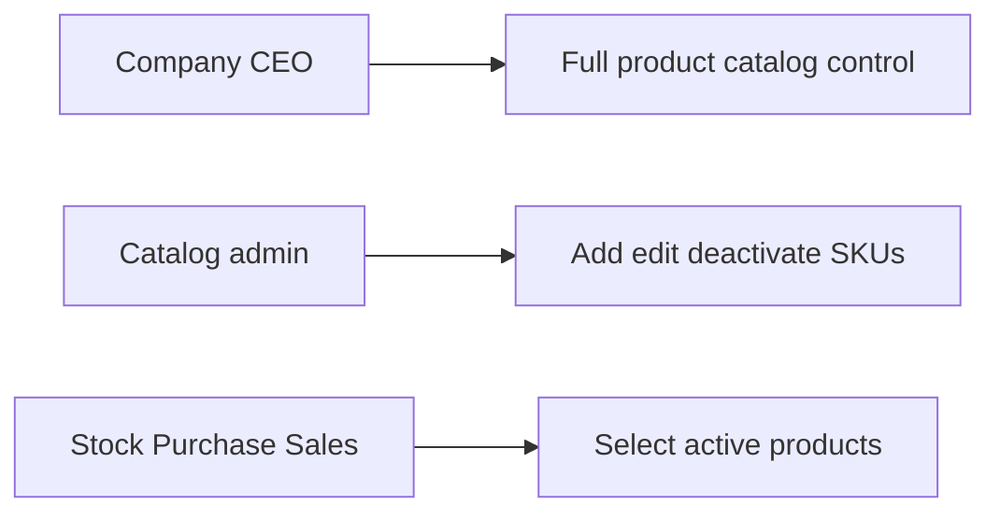
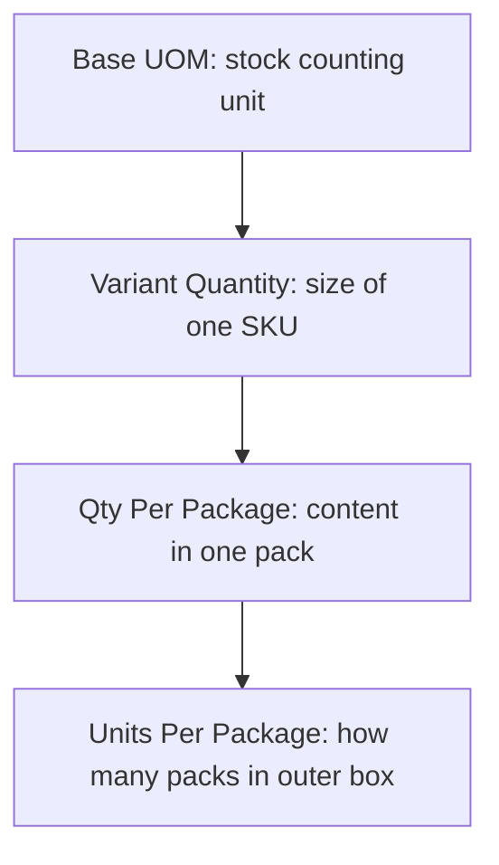
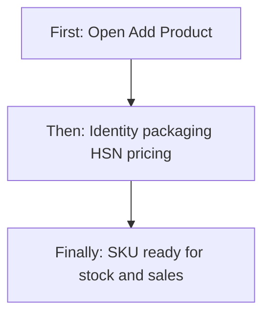
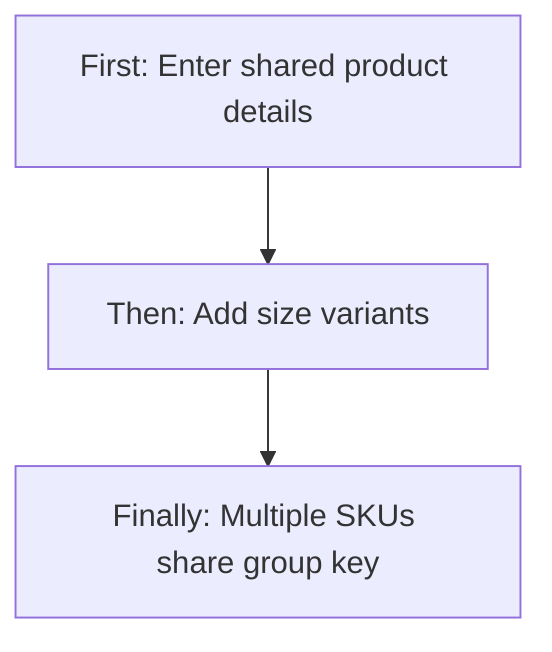
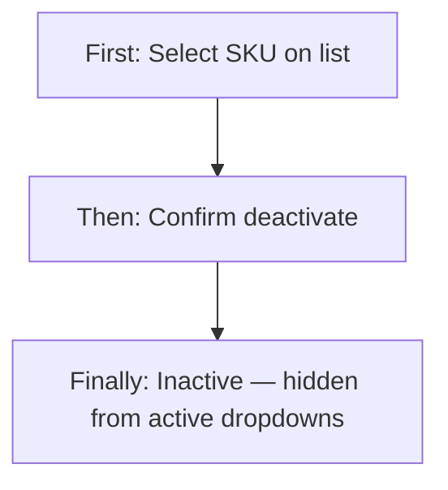
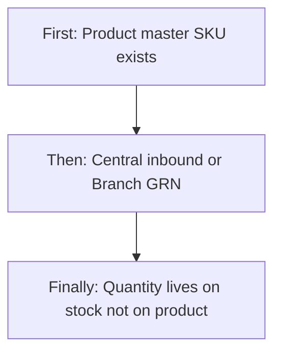
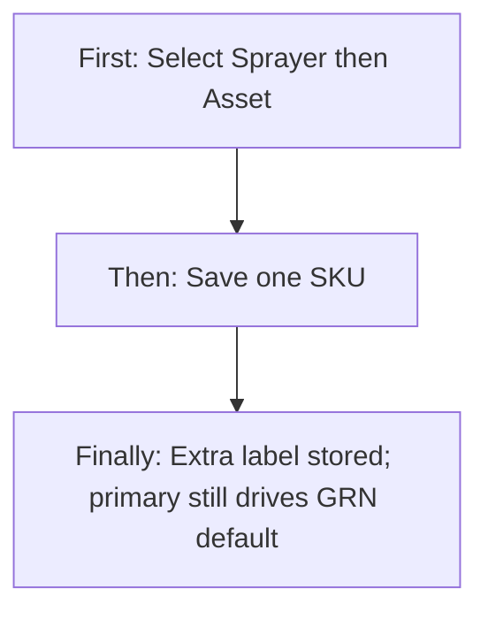
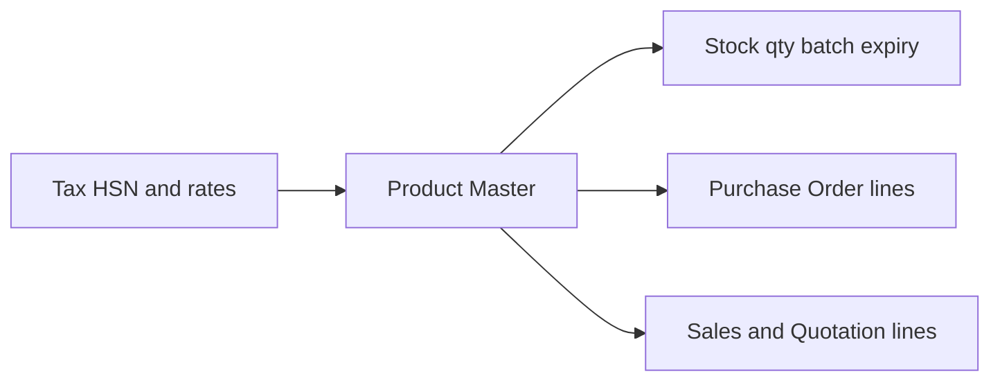
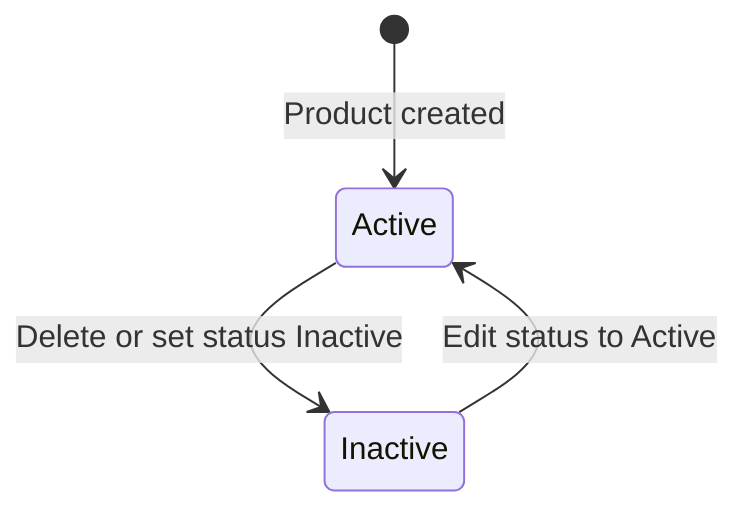

# Product Management (Product Master) — Product & Business Documentation

## 1. Purpose & Business Need

Pest-control and multi-branch operations need a single **product master** for chemicals, machines, tools, consumables, and resale items. **Product Management** (shown in the menu as **Product Master** under Inventory & Services) is where the company registers each sellable/stockable **SKU**, its packaging, tax classification (HSN), pricing, and optional size variants.

Every stock movement, purchase order line, sales order line, and quotation line points to a **product ID from this master**. Without a correct product master, stock quantities, GST on invoices, and purchase costing cannot stay consistent across branches.

**Outcomes today:** create products with or without multiple size variants; attach **one or more categories** (primary plus extra categories); attach brand, HSN, UOM, and packaging; soft-deactivate products; list/search/filter; sync zero-quantity stock ledger placeholders when a product is created; feed Stock, Purchase, Sales, and Quotation.

**What this module is not:** it does **not** hold live warehouse quantity, batch numbers, manufacturing dates, or expiry dates. Those belong to **Stock Management** (Central inbound) or **Purchase Order Branch GRN** (branch-direct inbound). Extra categories are **labels on the SKU**; they do **not** auto-split received quantity into Assets / Consumable / Resell.

---

## 2. Users & Roles (who uses this and why)

### 2.1 Company CEO / Owner

Full access to Product Master without needing explicit Product Management permissions. Defines the catalog that all branches use.

### 2.2 Inventory / catalog administrators

Staff with **Product Management** permissions maintain the catalog: add SKUs, edit pricing and packaging, deactivate obsolete items, manage brands.

### 2.3 Downstream users (Stock, Purchase, Sales)

Do not create products here unless they also have Product Management access. They **select** active products from dropdowns in their own modules.

---

## 3. Access Control (RBAC)

### 3.1 How access works

Access is controlled by the **Product Management** module permissions, unless the user is **CEO** (full access):

| Permission | Allows |
|------------|--------|
| **Read** | Open Product Master list, view detail, view row action |
| **Add** | **Add Product** button and create screens; create brand |
| **Edit** | Edit row action and update product |
| **Delete** | Soft-delete (mark Inactive) from list |

Sidebar item **Product Master** appears with Product Management **Read** (or CEO / Super Admin bypass).

Request and Approve permissions exist in the platform catalog for this module but are **not used** by Product Management screens or APIs.

### 3.2 Role × action matrix

| Role | View list | View detail | Add | Edit | Inactive / Delete | Submit request | Receive / act | Approve | Reject |
|------|-----------|-------------|-----|------|-------------------|----------------|---------------|---------|--------|
| Company CEO | Yes | Yes | Yes | Yes | Yes (soft inactive) | No | No | No | No |
| Staff with Product Management Read | Yes | Yes | No | No | No | No | No | No | No |
| Staff with Product Management Add | Yes | Yes | Yes | No | No | No | No | No | No |
| Staff with Product Management Edit | Yes | Yes | No | Yes | No | No | No | No | No |
| Staff with Product Management Delete | Yes | Yes | No | No | Yes (soft inactive) | No | No | No | No |
| Staff without Product Management | No | No | No | No | No | No | No | No | No |

**Record-level rules:**
- Product dropdowns used elsewhere return **Active** products only (product status and variant status both Active).
- Soft-deleted products remain in history; stock and past documents keep their product links.
- Product list dropdown API does not require Product Management Read (any authenticated user can load active products for other modules).

---

## 4. Capabilities & Features

### 4.1 Product list (Product Master)

Paginated catalog of SKU rows with search, status/category/package/date filters, and View / Edit / Delete actions.

### 4.2 Add product — single SKU or multi-variant

One create flow supports:
- **Base-only:** one product = one SKU row
- **Variants-wise:** one logical product creates a **BASE** row plus one row per size/pack variant, all sharing a **group key**

### 4.3 Edit product (single SKU row)

Edit updates **one SKU row** at a time. There is no multi-variant editor on Edit — each variant is a separate row in the list.

### 4.4 View product detail

Read-only view of identity, packaging, tax, pricing, media, and audit. No Edit button on the detail page (edit from list).

### 4.5 Brand (Company/Brand) master

Inline create and select of brands used on products.

### 4.6 Soft deactivate

Delete from list marks the product **Inactive**. Status can also be set Active/Inactive on Add/Edit.

### 4.7 Deep domain features (explained in detail below)

- **UOM and packaging quantities** (Base UOM, Secondary UOM, Qty Per Package, Units Per Package, Variant Quantity)
- **HSN and GST** (tax classification and rate display/calculation)
- **Variants** (group key, per-SKU codes and pricing)
- **Multiple categories** (primary category + extra categories — see **§4E**)
- **What is missing** (batch, expiry, manufacturing date on product; extra categories do not drive stock split)

---

## 4A. How UOM, Package Quantities & Stock Qty Work (in depth)

This is the most important mental model for Product Master.

### 4A.1 Mental model in one sentence

**Each product row is one SKU.** Stock quantities for that SKU are counted in the **Base UOM**. Packaging fields describe how the product is packed for purchase/display — they do **not** automatically convert stock when you receive or sell.

There is **no automatic unit conversion engine** today (e.g. the system does not convert 12 bottles × 250 ML into liters of stock by itself).

### 4A.2 UOM & quantities (how they actually work)

This is the packaging and quantity model as built today. Read the table first, then the deep explanation under each field.

| Field | Meaning | Example |
|-------|---------|---------|
| **Base UOM** | Unit stock is counted in | `ML` |
| **Secondary UOM** | Optional label only — **not used** in stock / PO / sales math | — |
| **Variant Quantity** | Size of this SKU in Base UOM | `250` + ML = 250 ml bottle |
| **Qty Per Package** | Content per package in Base UOM | often `250` ML per bottle |
| **Units Per Package** | Outer pack count | `12` bottles per box |

Also related (supporting fields, not in the core five):

| Field | Meaning | Example |
|-------|---------|---------|
| **Package Type** | Shape of the sellable/stockable pack | `BOTTLE`, `BOX`, `PACKET` |
| **Variant Package Type** | Package type for that size line | May differ per variant |

**View screen** formats Qty Per Package as: `{qty} {baseUom} Per {packageType}` (e.g. `250 ML Per BOTTLE`).

---

#### Base UOM — deep explanation

**What it is:** The official measuring unit for this SKU. Every stock ledger, purchase line default UOM, and sales quantity for this product ID is interpreted in this unit.

**Why it matters:** If Base UOM = `ML`, then stock quantity `10` means **10 units of this SKU measured as ML-sized items** (for a 250 ML bottle SKU, that is typically “10 bottles”, not “10 milliliters of bulk liquid”). The system does not reinterpret stock as total milliliters unless your business process enters quantity that way.

**Rules in practice:**
- **Required** on create
- Copied onto stock entries when goods are received
- Purchase Order line UOM **defaults** to Base UOM
- After create, persistence treats Base UOM as **not updatable** (Edit UI may still show it — treat as set-once)

**Examples of allowed values:** LTR, KG, GRAM, ML, SET, PKT, NO, NOS, TUBE, SQ_MT (UI may show a subset). There is **no separate UOM master table** — values are fixed lists.

**Common mistake:** Expecting Base UOM to auto-convert with Secondary UOM (e.g. ML ↔ LTR). That conversion **does not exist**.

---

#### Secondary UOM — deep explanation

**What it is:** An optional second unit label stored on the product for human reference (e.g. “we also think of this in LTR”).

**What it is not:** It is **not** used by Stock, Purchase Order, or Sales calculation logic. Changing Secondary UOM never changes stock balances, PO defaults, or invoice quantities.

**When teams still fill it:** For display/communication only — for example Base UOM = `ML` and Secondary UOM = `LTR` as a reminder that 1000 ML = 1 LTR in the real world. The ERP will **not** apply that math for you.

**Rules in practice:**
- Optional
- Editable as metadata
- Safe to leave blank if unused

---

#### Variant Quantity — deep explanation

**What it is:** The **size of this SKU** expressed as a number whose unit is the **Base UOM**.

**Formula for reading the label:**

> **SKU size = Variant Quantity + Base UOM**  
> Example: `250` + `ML` → **250 ml bottle**

**Why it is separate from stock qty:** Variant Quantity describes *what one piece of this SKU is* (the size printed on the label). Stock quantity describes *how many of those pieces you have*.

| Concept | Question it answers | Example |
|---------|---------------------|---------|
| Variant Quantity | How big is one SKU? | 250 (ML) |
| Stock quantity | How many SKUs on hand? | 40 bottles of that 250 ML SKU |

**With variants:** each size is its own product row:
- Variant A: Variant Quantity `100`, Base UOM `ML` → 100 ml SKU
- Variant B: Variant Quantity `250`, Base UOM `ML` → 250 ml SKU  

Those two never share one stock bucket — each has its own product ID.

**Required** on create for the SKU / variant line.

---

#### Qty Per Package — deep explanation

**What it is:** How much **content** (measured in **Base UOM**) sits inside **one package** of this SKU.

**Typical pattern:** Qty Per Package often **equals** Variant Quantity when one package = one bottle of that size.

| Setup | Qty Per Package reading |
|-------|-------------------------|
| Base UOM `ML`, Package Type `BOTTLE`, Qty Per Package `250` | **250 ML per bottle** |
| Base UOM `KG`, Package Type `BAG`, Qty Per Package `5` | **5 KG per bag** |

**View wording:** `250 ML Per BOTTLE`

**How it differs from Variant Quantity:**
- **Variant Quantity** = size identity of the SKU (what this product *is*)
- **Qty Per Package** = packaging content amount for that package type (how much content one pack holds)

In most chemical catalog setups they are filled with the **same number**. They can diverge if packaging language differs from size language, but the system does **not** enforce that they match.

**Required** on create. Used as packaging metadata — **not** multiplied into stock automatically.

---

#### Units Per Package — deep explanation

**What it is:** The **outer pack count** — how many **inner sellable units** (bottles/pieces) make one outer package (box/carton).

**Example:** `12` → **12 bottles per box**

**Business reading of a full pack story:**

> One **BOX** contains **12** bottles.  
> Each bottle holds **250 ML** (Qty Per Package / Variant Quantity with Base UOM ML).  
> So one outer box *physically* holds 12 × 250 ML = 3000 ML of chemical — but the ERP will **not** calculate or stock “3000 ML” unless a user enters quantity that way.

**What Units Per Package does:**
- Stores packaging info for users (“ordered by the dozen / box of 12”)
- Can be overridden per variant on create
- Defaults to `0` if omitted on bulk create

**What Units Per Package does not do:**
- Multiply stock receipts by 12
- Convert Box → Bottle → ML
- Drive Purchase or Sales line quantity conversion automatically

**Operational implication:** If a PO buys **1 BOX**, the operator must decide whether the line quantity is `1` (one box) or `12` (twelve bottles / SKUs). Product Master alone does not force either interpretation.

UI labels vary slightly: **Unit Per Package** (Add), **Units Per Package** (Edit), **Unit Per Pakage** (View typo).

---

### 4A.3 How the five fields fit together (one picture)

Think of three layers:

1. **Measure** — Base UOM (and unused Secondary UOM label)  
2. **SKU size** — Variant Quantity (how big one piece is)  
3. **Packaging** — Package Type + Qty Per Package + Units Per Package (how pieces are boxed)

**Nothing in layers 2–3 auto-converts stock.** Stock always answers: “How many of this product ID do I have?” in the counting convention your warehouse uses with Base UOM.

---

### 4A.4 Worked example — chemical with two sizes

You sell **Cockroach Gel** in 100 ML and 250 ML bottles, 12 bottles per outer box.

| What you enter | 100 ML variant | 250 ML variant |
|----------------|----------------|----------------|
| Base UOM | ML | ML |
| Secondary UOM | (blank or LTR — unused in math) | (blank or LTR) |
| Variant Quantity | 100 | 250 |
| Package Type | BOTTLE | BOTTLE |
| Qty Per Package | 100 | 250 |
| Units Per Package | 12 | 12 |

**Reading the 250 ML row:**
- SKU size = 250 ML bottle  
- Content per bottle = 250 ML  
- Outer pack = 12 bottles per box  

**What stock counts:**
- Central Stock receives **10** of the 100 ML SKU → stock +10 on that product ID (not “1000 ML” auto-total)
- The 250 ML SKU is a **different product ID**
- 100 ML and 250 ML stock never merge unless a report sums by **group key**

**Physical reality vs system reality:**
- Physical: 2 boxes of 250 ML = 24 bottles = 6000 ML of gel  
- System (typical): stock quantity `24` on the 250 ML product ID, if receipts were entered per bottle/SKU  

---

### 4A.5 Quick “do / don’t” for Units Per Package and Qty Per Package

| Field | Does | Does not |
|-------|------|----------|
| **Qty Per Package** | Describe content per pack in Base UOM | Auto-update stock when package type changes |
| **Units Per Package** | Describe outer pack count (e.g. 12/box) | Multiply PO/stock qty by 12 or convert UOMs |

---

### 4A.6 Base UOM vs Secondary UOM (summary)

| | Base UOM | Secondary UOM |
|--|----------|---------------|
| Required | Yes | No |
| Used by Stock / PO / Sales | Yes | **No** — stored only |
| Role | Stock counting unit | Optional human label |
| Editable after create | Persist may block change | Editable as metadata |

---

### 4A.7 Allowed UOM and package values (as built)

**Base / Secondary UOM examples:** LTR, KG, GRAM, ML, SET, PKT, NO, NOS, TUBE, SQ_MT (UI may show a subset).

**Package types:** BOTTLE, PACKET, POUCH, BOX, BAG, CAN, SET, PIECE, TIN, TUBE (UI may show a subset).

There is **no separate UOM master table** — values are fixed lists on the product.

---

## 4B. How Variants Work (in depth)

### 4B.1 Architecture

- There is **no separate Variants table**.
- **One database row = one stockable SKU**.
- Multi-variant create generates:
  1. One **BASE** row (`variantName = BASE`)
  2. One row per variant (e.g. `100 ML`, `250 ML`)
  3. All rows share the same **group key** (a grouping UUID — **not** the stock product ID)

Stock, purchase, and sales always use the **individual product ID** (`PRD-…`), never the group key as the foreign key.

### 4B.2 What you enter per variant (Add screen)

| Field | Required | Meaning |
|-------|----------|---------|
| Variant Name | Yes | Label (e.g. 100 ML) |
| Variant Product Code | Yes | Unique business code for that SKU |
| Variant Package Type | Yes | Package for that size |
| Variant Quantity | Yes | Size amount (with Base UOM) |
| Units Per Package | Optional | Override outer pack count for this size |
| Barcode / QR | Optional | |
| Variant Status | Yes | Active / Inactive |
| Purchase / Selling / Base / Tax / Total | Pricing per SKU | Tax/Total auto on Add |

Product display name for variants becomes: `{Product Name} ({Variant Name})`.

### 4B.3 Uniqueness

- **Product Code** unique per row
- **Variant SKU** unique when provided
- Variant product code must not equal the base product code

### 4B.4 Edit / View limitations

- **Edit** works on **one SKU row** only — no “edit all variants of this family” UI
- **View** does not show a variants table even when a group key exists
- To change another size, open that SKU’s row from the list

---

## 4C. How HSN and GST Work (in depth)

### 4C.1 What Product Master stores

| Stored on product | Meaning |
|-------------------|---------|
| **HSN Code** (text) | Tax classification code selected from Tax Module |
| **Tax Amount** | Numeric amount calculated or entered with pricing |
| **Base Price** | Pre-tax price |
| **Purchase Price / Selling Price / Total Cost** | Commercial pricing fields |

Product Master does **not** store a permanent list of which CGST/SGST/IGST checkboxes were selected. On create, the UI uses HSN-linked tax rates to **compute** Tax Amount and Total Cost, then saves those numbers plus the HSN code.

### 4C.2 How rates are loaded

1. User selects **HSN** from Tax Module dropdown  
2. System loads tax rows linked to that HSN (e.g. CGST, SGST, IGST, CESS with default %)  
3. **Add screen:** user can check which rates to include; **Total GST %** = sum of checked rates; Tax Amount and Total Cost auto-calculate  
4. **Edit screen:** tax rows are display-only; Total GST comes from the HSN mapping total  
5. **View screen:** tax % display is currently **hardcoded placeholders** (not live HSN rates) — see gaps

### 4C.3 Inclusive vs exclusive pricing

There is **no** “tax inclusive / exclusive” flag on the product. Base Price is labeled **(Pre-tax price)**. Tax Amount is treated as an add-on amount for Total Cost in the create UI math.

### 4C.4 CGST / SGST / IGST (where they really live)

True GST type categories (Central / State / Integrated / Cess) live in the **Tax Module**. HSN mappings there define which tax types and rates apply. Product Master only **reads** that mapping for display/calculation and stores the **HSN string** + computed amounts.

**Caveat:** the HSN “total rate” may sum CGST + SGST + IGST together, which can **double-count** full GST if all three rates are added (e.g. 9+9+18). Purchase Order and Product detail inherit this same pattern — operators should verify percentages when configuring HSN in Tax Module.

### 4C.5 Validation gap

Creating a product does **not** verify that the HSN exists in Tax Module. An invalid or mistyped HSN can still save; detail enrichment then returns no taxes.

### 4C.6 Base UOM / HSN immutability note

Once created, **Base UOM** and **HSN Code** are marked not updatable in persistence. The Edit UI may still show them editable, but changes may not stick — treat them as set-at-create for operational purposes.

---

## 4D. Batch ID, Expiry & Manufacturing Date — Where They Live

| Field | On Product Master? | Where it exists |
|-------|--------------------|-----------------|
| Batch number / Batch ID | **No** | Stock entry when goods are received |
| Manufacturing date | **No** | Stock entry |
| Expiry / expiration date | **No** | Stock entry |

**Why:** the same SKU can have many batches with different expiry dates. Batch and expiry are properties of a **stock receipt**, not of the product catalog definition.

**Stock rules (related):** for consumables, manufacturing and expiry must both be empty or both set, and expiry must be after manufacturing.

**Legacy gap:** an older inventory add screen still has an Expire Date on variants, but the current Product Master Add/Edit/View screens do **not** include batch or expiry.

---

## 4E. Extra Categories (multi-category) — in depth

### 4E.1 Why this exists

A pest-control SKU is often **one physical item** that the business talks about in more than one way. Example: a **sprayer** is a machine/tool for the catalog, and also an **asset** for stock custody. Previously the catalog allowed **only one category**. Operators then either mis-tagged the SKU (so GRN defaulted to the wrong bucket) or created duplicate products.

**As built today:** the user can select **several categories** on Add and Edit. The system stores:

| Piece | Business meaning |
|-------|------------------|
| **Primary category** | The **first** selected category. This is still the official classification used by stock default split, PO line category, ledger category filter, and most reports. |
| **Extra categories** | The remaining selected categories, kept as additional labels on the same SKU. Existing products with only one category keep extras empty. |

Selecting Chemical + Asset does **not** create two products. It is still **one SKU, one product ID, one stock bucket**.

### 4E.2 What the user sees

**Add / Edit:** Category is a **multi-select** (chips). At least one category is required. The first chip is treated as primary.

**List:** Category column shows **all** selected labels joined (not primary only).

**View:** Shows joined category labels.

**Other modules (PO line, Branch GRN default split, Central stock auto-split):** they still see **only the primary category**. Extra labels are **not** sent as a list on the PO line.

### 4E.3 How this does **not** change receiving stock (critical)

When goods are received, quantity is split into **Assets / Consumable / Resell**. That split is decided as follows:

| Receive path | How split is decided |
|--------------|----------------------|
| **Branch GRN** (branch-direct PO) | User can type the three quantities. If they leave them blank, the system defaults **100% of qty** from **primary** category only: Asset / Sprayer / Electric pump / Machine / Trap / Tool → all Assets; Resale → all Resell; everything else (including Chemical, Consumable, Other) → all Consumable. |
| **Add to Central Stock** | User **always** ticks and types the three buckets. Extra categories never auto-fill those checkboxes. |

**Worked example**

SKU: “Handheld Sprayer”. Categories selected: **Sprayer** (first / primary) + **Asset** (extra).

- Catalog list shows: Sprayer, Asset.  
- Branch GRN default: **all qty → Assets** (because primary is Sprayer). Extra “Asset” did not change that — it would have been Assets anyway.  
- If the user had selected **Chemical** first and **Asset** second: GRN default would be **all Consumable**. The extra Asset tag would **not** move any qty into Assets. The receiver must type Assets qty by hand if some units are serialized assets.

**Rule to train:** Extra categories are for **finding and describing** the SKU. They are **not** a mixed-split engine. Mixed Assets + Consumable on one receipt is always a **manual split** on the receive screen.

### 4E.4 List filter caveat

The Product Master filter includes Asset / Consumable / Resale in the category picker, but the list filter that is actually sent still matches **primary category only**, and some of those values may not be applied. A SKU whose primary is Chemical and extra is Asset will **not** appear when filtering “Asset”. Search by name/code still finds it.

### 4E.5 Downstream modules (what they copy)

| Module | What it uses |
|--------|----------------|
| Stock ledger category column | Primary category name only |
| Purchase Order line “product category” | Primary only |
| Branch GRN default Assets/Consumable/Resell | Primary only |
| Product dropdown in other modules | Returns the full category list if the client reads it; current PO receive screen uses the single primary on the PO line |

---

## 5. CRUD Operations

### 5.1 Create (Add)

**Who:** CEO, or staff with Product Management **Add**.

**First:** User opens Product Master and clicks **Add Product**.

**Then:** User completes identity (name, code, **one or more categories**, brand, status), Units & Packaging (Base UOM, package type, Qty Per Package, optional Units Per Package), HSN + pricing, optional images. Optionally clicks **Add Variant** for multiple sizes. The first category is primary; further categories are extra labels only.

**Finally:** System creates one SKU (or BASE + variant SKUs). Zero-quantity stock ledger placeholders are prepared for the new product(s). User returns to the list.

### 5.2 Read — List

**Who:** CEO, or staff with Product Management **Read**.

Columns: Product (name, brand, SKU), Category (**all labels joined**), HSN Code, Base UOM, Package, Default (total cost), Status, Created Date, Created By.

Search is server-side (name, code, also HSN and brand on the server). Filters: Status, Category, Package Type, Date range. Pagination is server-side. Status filter **All** still tends to show Active only because the list defaults to Active when status is omitted. Category filter matches **primary** category, not extra labels.

### 5.3 Read — Detail / Get details

**Who:** Same as list.

Opens View Product with sections: Basic Information, Media, Units & Packaging, Tax Configuration, Default Pricing, Audit. Loads full product by ID and attempts HSN tax enrichment.

### 5.4 Update (Edit)

**Who:** CEO, or staff with Product Management **Edit**.

Opens one SKU for edit. Product Code is locked. Updates packaging, pricing, status, media, description, brand, category as allowed. Does not provide multi-variant editing.

### 5.5 Inactive / Delete

**Who:** CEO, or staff with Product Management **Delete**.

**First:** User clicks Delete on a list row.

**Then:** Confirmation asks to delete the product (wording says irreversible).

**Finally:** Product is **soft-deleted** — status becomes **Inactive**; record remains. Reactivation is possible by editing status back to Active (subject to business use). Variant status is not necessarily forced inactive on delete.

Inactive can also be set via the Status radio on Add/Edit without using Delete.

---

## 6. Request & Approval Flows

**This module does not use request/approve.** Products are created and updated directly. Stock requests that mention products belong to **Stock Management**, not Product Master.

---

## 7. Forms — Add vs Edit Field Access

| Field (business name) | On Add | On Edit | Notes |
|----------------------|--------|---------|-------|
| Product Name | Editable / Required | Editable | |
| Product Code | Editable / Required | **Locked** | Tied to SKU row |
| Category (multi-select) | Editable / Required (at least one) | Editable | First selected = primary; rest = extra labels. Does not auto-split stock. |
| Sub-Type | Editable / Optional | Editable | |
| Company / Brand | Editable / Required | Editable | Can add new brand |
| Description | Editable / Optional | Editable | |
| Status | Editable / Required | Editable | Active / Inactive |
| Product Image(s) | Editable / Optional | Editable | Max 5; PNG/JPG; 2MB |
| Base UOM | Editable / Required | Editable in UI | Persist may block change |
| Secondary UOM | Editable / Optional | Editable | Not used in stock math |
| Package Type | Editable / Required | Editable | |
| Qty Per Package | Editable / Required | Editable | Content per package in Base UOM |
| Unit(s) Per Package | Editable / Optional | Editable | Outer pack count |
| HSN Code | Editable / Required | Editable in UI | Persist may block change |
| Tax rate checkboxes | Editable (Add) | Display only | Affect calc; IDs not saved |
| Total GST | Locked / Auto | Locked / Auto | |
| Purchase Price | Editable / Required | Editable | |
| Selling Price | Editable / Optional | Editable | |
| Base Price | Editable / Required | Editable | Pre-tax |
| Tax Amount | Locked / Auto | Locked / Auto | |
| Total Cost | Locked / Auto | Locked / Auto | |
| Multi-variant section | Editable | **Hidden** | Add only |
| Variant Name / Code / Qty / Package / Barcode / Status / Pricing | Editable when variants added | No UI; loaded fields still submitted | |
| Batch ID | **Hidden** | **Hidden** | Exists only on Stock |
| Expiry / Manufacturing date | **Hidden** | **Hidden** | Exists only on Stock |
| Audit fields | Hidden | Read-only | Created/Updated by and dates |

---

## 8. Lists, Dropdowns, Details & Data Rendering

### 8.1 List rendering

| Element | Behavior |
|---------|----------|
| Columns | Product (thumb/name/brand/SKU), Category, HSN, Base UOM, Package, Default cost, Status, Created Date, Created By |
| Search | Server-side; name/code |
| Filters | Status, Category, Package Type, Date range |
| Pagination | Server-side |
| Row actions | View, Edit, Delete (permission-gated) |
| Empty state | Standard table empty handling |

### 8.2 Dropdowns & lookups

| Dropdown | Source | Notes |
|----------|--------|-------|
| Category | Fixed list (multi-select) | Chemical, Sprayer, Electric pump, Machine, Trap, Tool, Other, Asset, Consumable, Resale. First = primary. |
| Sub-Type | Fixed list | Pest-control oriented subtypes |
| Company / Brand | Brand master API | Can create brand inline |
| Base UOM / Secondary UOM | Fixed list | No UOM master API |
| Package Type | Fixed list | |
| HSN Code | Tax Module HSN dropdown | Then loads linked tax rates |
| Product dropdown (other modules) | Active products API | Used by Stock/PO/Sales |

### 8.3 Detail / get-details rendering

Loads product by ID into View sections. Qty Per Package is shown with Base UOM and Package Type text. Tax section on View currently shows hardcoded CGST/SGST/IGST/CESS percentages rather than live HSN data. Variants of the same group are **not** listed on View.

---

## 9. How It Works (end-to-end user flows)

### 9.1 Catalog admin — Add a single chemical SKU

**First:** User with Add permission opens Product Master → Add Product.

**Then:** Enters name, code, category Chemical, brand, Base UOM ML, Package Bottle, Qty Per Package 250, Units Per Package 12, selects HSN, enters purchase/base prices (tax auto-fills), saves.

**Finally:** One Active SKU exists; stock modules can receive quantity against this product ID; HSN drives GST on purchase/sales later.

### 9.2 Catalog admin — Add product with size variants

**First:** User starts Add Product and fills shared identity, Base UOM, HSN.

**Then:** Clicks Add Variant for 100 ML and 250 ML with separate product codes, quantities, and prices.

**Finally:** System creates BASE + two variant SKUs under one group key. Each size is stocked separately.

### 9.3 Catalog admin — Deactivate obsolete SKU

**First:** User with Delete permission finds the SKU on the list.

**Then:** Confirms Delete (or Edits status to Inactive).

**Finally:** Product becomes Inactive and drops from active product dropdowns; historical stock/documents keep the link.

### 9.4 Warehouse user — Receive stock with batch and expiry (cross-module)

**First:** Product already exists in Product Master (no batch on product).

**Then:** If the company receives at Central, user **Adds to Central Stock** and types Assets / Consumable / Resell. If the company is on **branch-direct** purchase, user **Receives Against PO (Branch GRN)** instead — extra categories on the SKU do not auto-fill that split.

**Finally:** Stock holds batch/expiry and quantity buckets; Product Master still only defines the catalog attributes.

### 9.5 Catalog admin — Tag a sprayer as Asset as well

**First:** User opens Add or Edit and selects **Sprayer** then **Asset**.

**Then:** Saves the SKU. List shows both labels.

**Finally:** Purchase and receive still treat **Sprayer** as primary (default all qty to Assets on Branch GRN). The extra Asset tag is for people reading the catalog, not for mixed-split math.

---

## 10. Cross-Module Interactions

| Related area | Connection |
|--------------|------------|
| **Tax Module** | HSN master and tax type rates (CGST/SGST/IGST/CESS). Product stores HSN code and computed tax amounts. |
| **Stock Management** | Uses product ID; copies product code, name, HSN, Base UOM. Holds **quantity, batch, manufacturing date, expiry**. Product create triggers zero-qty ledger placeholders. Inactive product can soft-affect stock entries. |
| **Purchase Order** | Lines reference product ID; UOM defaults to Base UOM; GST % from HSN mapping or override; line shows **primary** category only. Branch GRN default split uses primary category (see Stock / PO docs). |
| **Sales Order / Quotation** | Lines reference product ID; tax from HSN; only Active products selectable. |
| **Brand master** | Owned under Product Management permissions; used on every product. |
| **Service / GMA / Tasks** | May reference inventory products for materials usage. |

---

## 11. Data the Business Cares About

| Attribute | Business meaning |
|-----------|------------------|
| Product ID | System key used everywhere (`PRD-…`) |
| Product Name / Code | Display name and unique business code |
| Group Key | Links BASE + variants of one logical product |
| Category (primary) | Official classification; drives Branch GRN default split and ledger category |
| Extra categories | Additional labels on the same SKU; not used for auto-split |
| Sub-Type | Pest-control subtype |
| Brand | Manufacturer / company brand |
| Status / Variant Status | Active usable vs Inactive retired |
| Base UOM | Unit of stock measurement |
| Secondary UOM | Optional reference unit (unused in calculations) |
| Package Type | Bottle, box, packet, etc. |
| Qty Per Package | Content amount per package in Base UOM |
| Units Per Package | How many units in an outer pack |
| Variant Name / Quantity / SKU / Barcode | Size identity and scanning |
| HSN Code | GST classification |
| Purchase / Selling / Base / Tax / Total Cost | Commercial pricing |
| Media | Product images |
| Audit | Created/updated/deleted by and when |

**Not on product (on stock instead):** batch ID, manufacturing date, expiry date, live quantity buckets (asset / consumable / resale / in-transit / reserved).

---

## 12. Rules, Validations & Constraints

- Product Name required (min length enforced in UI).
- Product Code required and **unique**.
- Category, Brand, Status, HSN, Base UOM, Qty Per Package required on create.
- Purchase Price required; Base Price required in UI create flow.
- Variant rows require name, product code, package type, quantity, status, purchase price.
- Max **5** images; **2 MB** each; JPEG/PNG only.
- Only **one Active** meaning for dropdown: both product status and variant status Active.
- Soft delete → Inactive (no hard remove).
- HSN existence is **not** strictly validated on product create.
- No UOM conversion between Base and Secondary or package counts.
- Update path is partial (only sent fields change) and may skip some create-time validations.

---

## 13. Loopholes, Gaps & Current Limitations

1. **No UOM conversion:** Qty Per Package and Units Per Package are descriptive; stock does not auto-convert boxes ↔ bottles ↔ ML.
2. **Secondary UOM unused** in Stock/Purchase/Sales logic.
3. **Batch / expiry / manufacturing date missing** on Product Master — correct place is Stock, but users looking on Product screens will not find them.
4. **Variants only on Add:** cannot manage the full variant family on Edit or View.
5. **View tax percentages hardcoded** — not live HSN rates.
6. **Tax checkbox selections not saved** — only computed amounts + HSN string persist.
7. **HSN total rate may double-count** CGST+SGST+IGST when summed.
8. **Delete confirmation says irreversible** but action is soft Inactive.
9. **Base UOM / HSN** shown editable on Edit but persistence may ignore changes.
10. **Product Code / Package Type** sometimes missing required asterisk in UI while still validated.
11. **Label inconsistencies:** “Unit Per Package” vs “Units Per Package”; View typo “Unit Per Pakage”.
12. **List category filters** still match **primary** category only. Extra categories are not searched. Filter UI may list Asset / Consumable / Resale while the applied filter set can drop those values. Status **All** still defaults to Active on the server.
12a. **Extra categories do not drive stock split** on Central inbound or Branch GRN. Mixed buckets require the receiver to type quantities.
13. **Sidebar related-route highlighting** may not match live add/edit/view paths.
14. **Legacy Add Product route** still exists with expiry on variants — parallel to Product Master and easy to confuse.
15. **No Product request/approve** despite unused REQUEST/APPROVE permission keys.
16. **Product dropdown API** has no Product Management Read check — any authenticated user can list Active products.

---

## 14. Existing Functionality Summary

**Available today:**
- Product Master list with search, filters, pagination
- Add single SKU or multi-variant (BASE + variants under group key)
- Edit single SKU row
- View detail (with known tax display gap)
- Soft deactivate
- Brand create/select
- HSN selection from Tax Module with rate-assisted pricing on Add
- Packaging metadata: Base UOM, Secondary UOM, Package Type, Qty Per Package, Units Per Package
- Multiple categories on one SKU (primary + extra labels)
- Cross-use by Stock, Purchase, Sales, Quotation via product ID
- RBAC-gated Add / View / Edit / Delete on list

**Not available:**
- Automatic UOM / package conversion
- Batch ID, expiry, manufacturing date on the product catalog
- Multi-variant edit/view family management
- Request/approve for product changes
- Extra categories used as an auto-split engine for Assets / Consumable / Resell
- Dedicated UOM master table
- Reliable live GST breakdown on View screen

---

## 15. Reference — APIs, Screens & UI Actions

### 15.1 APIs

| Method | Path | Purpose (plain language) | Used by (screen/flow) |
|--------|------|--------------------------|------------------------|
| GET | `/api/v1/inventory-products` | Paginated product list | Product Master list |
| GET | `/api/v1/inventory-products/by-id?id=` | Product detail + HSN tax enrichment | View, Edit |
| POST | `/api/v1/inventory-products/upsert` | Create product (optional variants) | Add Product |
| PUT | `/api/v1/inventory-products/update?id=` | Update one SKU | Edit Product |
| DELETE | `/api/v1/inventory-products/delete?id=` | Soft deactivate product | List Delete |
| GET | `/api/v1/inventory-products/dropdown` | Active products for other modules | Stock, PO, Sales dropdowns |
| GET | `/api/v1/inventory-products/group-summary` | Variant group stock summary | Available; not used by current Product Master UI |
| POST | `/api/v1/inventory-products/variant-bulk` | Bulk create variants | Available; UI uses upsert instead |
| GET/POST | `/api/v1/inventory/brands` | List / create brands | Add, Edit brand picker |
| GET | `/api/v1/tax/hsn-codes/dropdown` | HSN lookup | Add, Edit tax section |
| GET | `/api/v1/tax/hsn-codes/products?id=` | Tax rates for selected HSN | Add, Edit tax section |

### 15.2 Frontend Screen Routes

| Route | Screen purpose | Primary users |
|-------|----------------|---------------|
| `/product-management` | Product Master list | CEO, Product Management Read+ |
| `/add-and-manage-product` | Add product / variants | CEO, Product Management Add |
| `/edit-and-manage-product` | Edit one SKU | CEO, Product Management Edit |
| `/view-and-manage-product` | View product detail | CEO, Product Management Read |
| `/add-product` | Legacy inventory add (not Product Master CTA) | Avoid for new catalog work |

### 15.3 Click Events, Filters, Search & Controls

| Screen / Route | Control | Type | What happens |
|----------------|---------|------|--------------|
| Product Master list | Add Product | Button | Opens add screen (Add permission) |
| Product Master list | Search | Text | Server search by name/code |
| Product Master list | Status / Category / Package / Date | Filters | Refines list |
| Product Master list | Pagination | Page controls | Server page change |
| Product Master list | View | Row action | Opens view detail |
| Product Master list | Edit | Row action | Opens edit form |
| Product Master list | Delete | Row action | Soft-deactivate confirm |
| Add Product | Add Variant | Button | Adds another size/SKU block |
| Add Product | Remove variant | Icon | Removes that variant block |
| Add / Edit Product | Category | Multi-select chips | First category = primary; rest stored as extra labels |
| Add Product | HSN select | Dropdown | Loads tax rates; enables GST calc |
| Add Product | Tax checkboxes | Checkbox | Changes Total GST and pricing math |
| Add Product | Qty Per Package / Unit Per Package | Number | Saves packaging metadata |
| Add Product | Base UOM / Secondary UOM | Dropdown | Saves units |
| Add Product | Save Product | Button | Creates SKU(s) via upsert |
| Edit Product | Product Code | Locked field | Cannot change |
| Edit Product | Update Product | Button | Saves changes to one SKU |
| View Product | Back | Button | Returns to list |
| Brand picker | + Add Company/Brand | Action | Creates brand then selects it |
