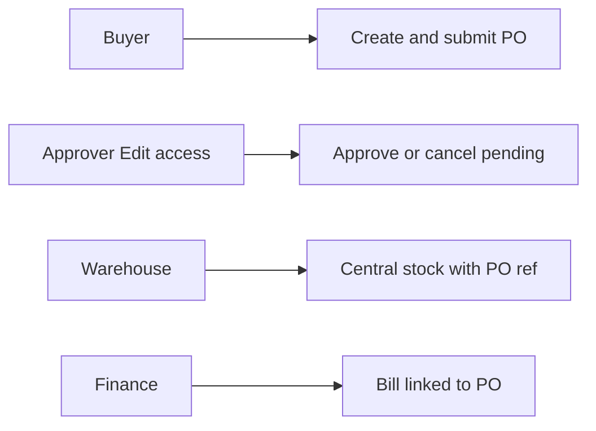
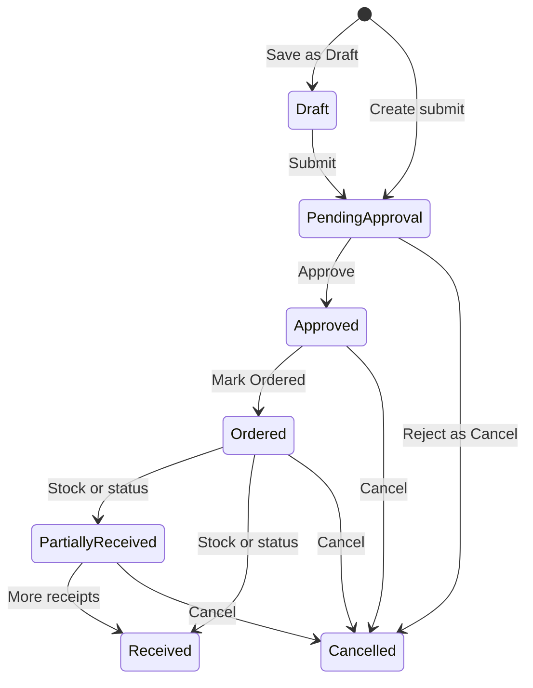
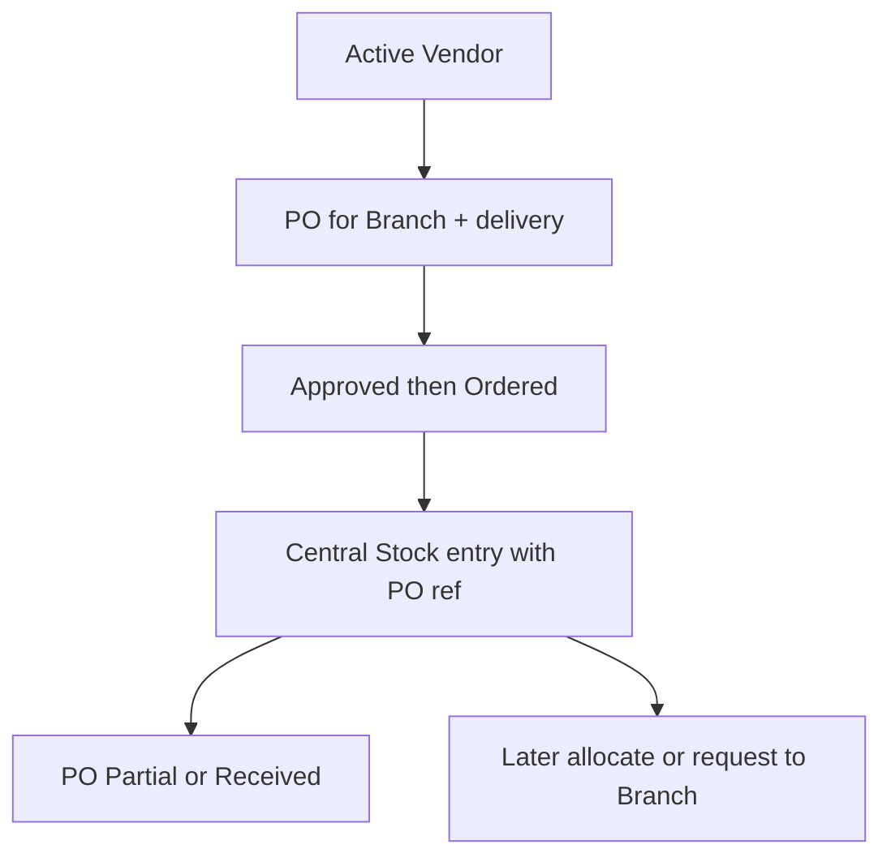
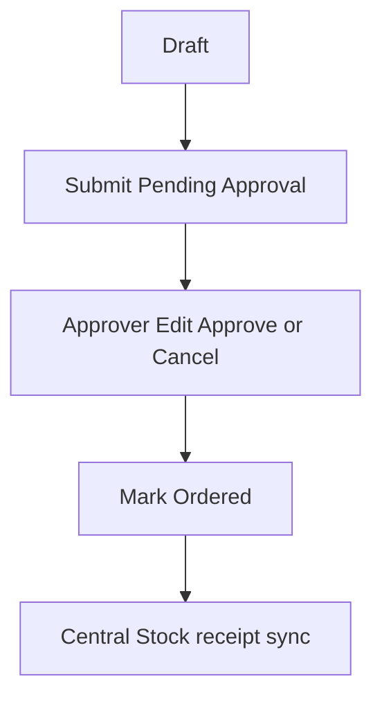
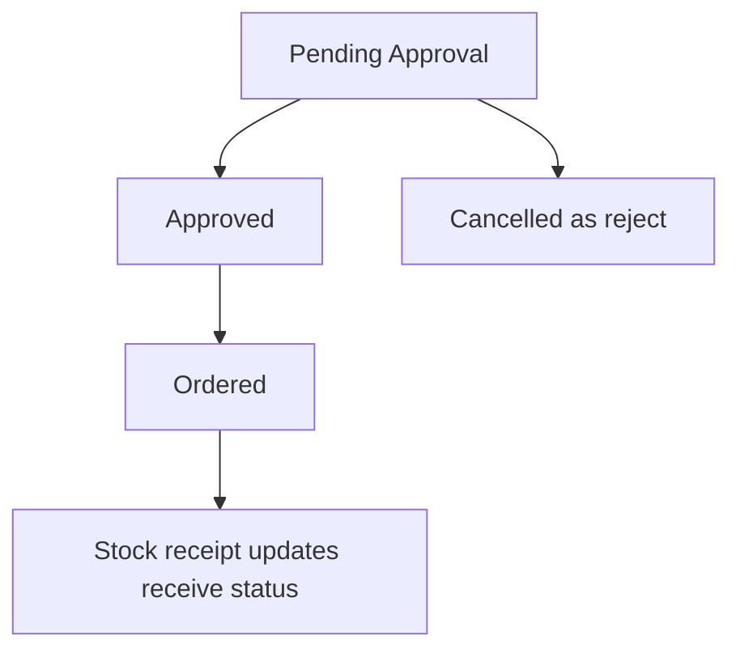
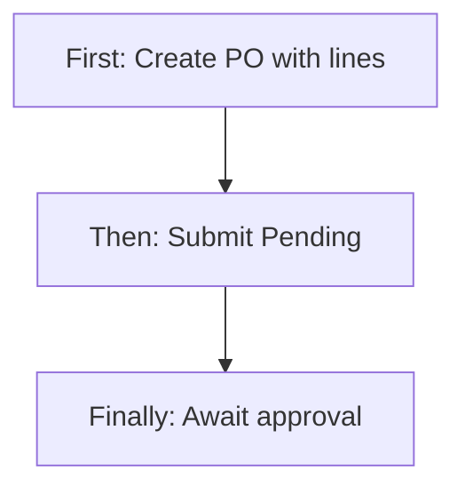
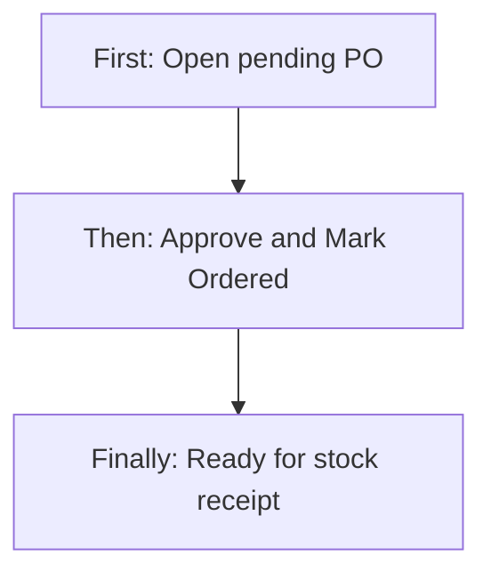
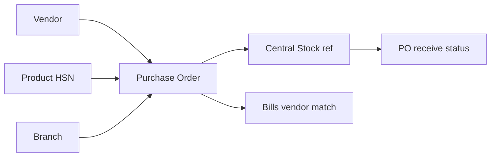
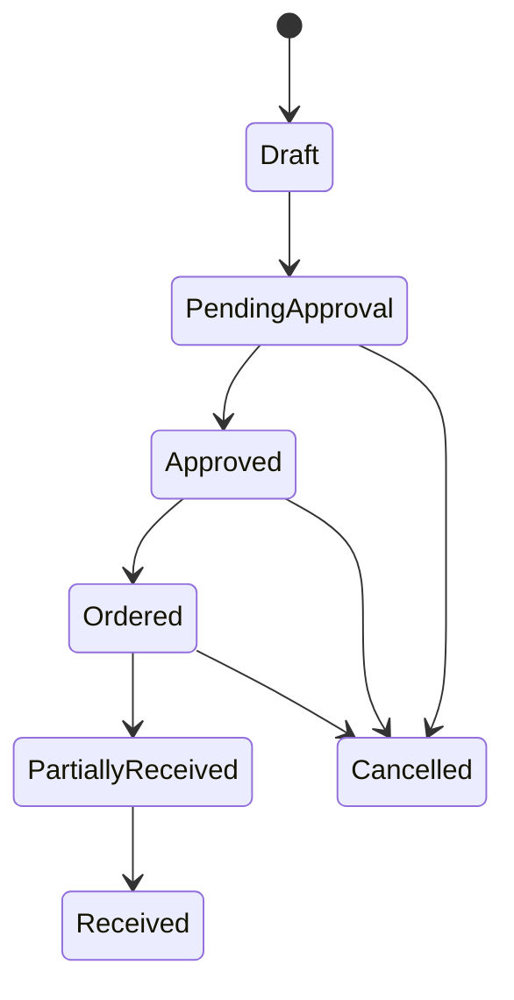

# Purchase Order Management — Product & Business Documentation

## 1. Purpose & Business Need

Procurement needs a controlled document to **order goods from vendors** for a **branch**, with priced lines, tax, delivery details, and a clear path from draft → approval → ordered → received. **Purchase Order Management** (menu: Procurement → Purchase Orders) is that document layer.

POs connect **Vendor** (who supplies), **Product Master** (what is bought + HSN for GST), **Branch** (where goods are intended), **Central Stock** (receipt reference that can advance PO status), and **Bills** (AP can link a bill to a PO and must match vendor).

**Outcomes today:**
- Create Draft or submit to Pending Approval
- Approve and Mark as Ordered via status updates
- Soft-delete Drafts only; cancel via Cancelled status
- Line items with product, qty, UOM, price, GST % (server-validated from HSN tax master)
- Branch + delivery address/contact/date
- PDF download
- Stock central entries referencing the PO can set Partially Received / Received
- Bills can link PO id with vendor-match validation

**What this module is not:** Contract-linked POs, TDS on PO, payment terms on PO, dedicated GRN, 3-way match, separate Approve/Reject inbox, or vendor-catalog enforcement on lines.

---

## 2. Users & Roles (who uses this and why)

### 2.1 Company CEO / Owner

Full access. Can create, edit statuses, delete drafts, download PDFs.

### 2.2 Procurement buyers

Staff with Purchase Order **Add / Edit / Read** create and submit POs, then move Approved → Ordered.

### 2.3 Approvers (intended)

Notifications target roles such as Branch Manager (and escalation to Operations Head for aged pending). In practice, **any user with Edit** can set status to Approved or Cancelled while pending — there is **no separate Approve permission gate** on the API.

### 2.4 Warehouse / stock users

Receive goods on Central Stock with a PO reference; system may update PO to Partially Received / Received.

### 2.5 Finance / AP users

Link bills to a PO; vendor on bill must match PO vendor.

---

## 3. Access Control (RBAC)

### 3.1 How access works

| Permission | Allows |
|------------|--------|
| **Read** | List, detail, PDF |
| **Add** | Create PO |
| **Edit** | Update fields (when Draft) and **all status transitions** including Approve / Ordered / Cancel |
| **Delete** | Soft-delete Draft only |

**Request / Approve** permission keys exist in the platform catalog but are **not checked** by Purchase Order APIs. Submit and approve both use Add/Edit.

CEO bypasses granular checks. CEO’s refined Approve grants do **not** specially include Purchase Order (unlike Stock/GMA/etc.).

Sidebar: **Procurement → Purchase Orders** with Purchase Order **Read**.

### 3.2 Role × action matrix

| Role | View list | View detail | Add | Edit | Inactive / Delete | Submit request | Receive / act | Approve | Reject |
|------|-----------|-------------|-----|------|-------------------|----------------|---------------|---------|--------|
| Company CEO | Yes | Yes | Yes | Yes | Soft-delete Draft | Yes (status) | Via Stock | Yes (via Edit) | Cancel status |
| Staff with PO Read | Yes | Yes | No | No | No | No | No | No | No |
| Staff with PO Add | Yes | Yes | Yes | Limited | No | Yes (create/submit) | No | No* | No |
| Staff with PO Edit | Yes | Yes | No | Yes | No | Yes (draft→pending) | No | Yes* | Yes* (Cancelled) |
| Staff with PO Delete | Yes | Yes | No | No | Draft only | No | No | No | No |

\*Approve/Reject are **status updates** on Edit, not dedicated Approve permission.  
\*Goods **receive** is not a PO button — it is Central Stock with PO reference (or status set manually if Edit allowed).

---

## 4. Capabilities & Features

### 4.1 PO list

Paginated list with search, filters (status, vendor, branch, date range), View, Download PDF, Edit/Delete for Drafts.

### 4.2 Add / Edit PO

Header: dates, branch, vendor, delivery, authorization note. Lines: products with qty, UOM, price, GST. Actions depend on status (Save Draft, Submit, Approve, Mark Ordered).

### 4.3 View PO

Read-only detail and PDF download. Edit navigation exists from view (status not always respected).

### 4.4 Status-driven lifecycle

See **§4A** for every status and trigger.

### 4.5 Tax on lines

Dynamic GST % from product HSN → tax master rates (sum of default rates), with fallback slab validation.

### 4.6 Cross-module hooks

Vendor validation, Product ACTIVE, Branch ACTIVE, Stock receipt sync, Bill–PO vendor match.

---

## 4A. Status Lifecycle (deep dive)

### Statuses that exist

| Status | Business meaning |
|--------|------------------|
| **Draft** | Working document; structural edit allowed; can soft-delete |
| **Pending Approval** | Submitted; waiting decision; structure locked |
| **Approved** | Authorized to proceed |
| **Ordered** | Confirmed with vendor / in fulfillment |
| **Partially Received** | Some qty received vs ordered (often via stock sync) |
| **Received** | All line qtys covered by receipts (often via stock sync) |
| **Cancelled** | Stopped; also used as “reject” outcome from pending |

**Not in the model:** Rejected (distinct), Hold, Closed, Inactive, Contract-linked statuses.

### What each transition does

| From → To | Who / how | Structural edit? | Notes |
|-----------|-----------|------------------|-------|
| → Draft | Buyer Save Draft | Yes | Create with Draft or update Draft |
| Draft → Pending | Submit | No after | Notifies Branch Managers on **create** submit; update-submit may notify empty list (gap) |
| Pending → Approved | Edit + Approve | No | Note-only updates while pending |
| Pending → Cancelled | Edit status Cancel | No | Treated as reject; event may say rejected |
| Approved → Ordered | Mark as Ordered | No | |
| Ordered / Partial → Received / Partial | Stock sync or Edit | No | Stock sums CSTK qty by product vs PO lines |
| Any open → Cancelled | Edit (rules allow) | No | Terminal with Received |

**Terminal:** Received, Cancelled — no further business edits.

### UI button matrix (as built)

| Status on form | Buttons shown |
|----------------|---------------|
| Create / Draft | Save as Draft, Submit |
| Pending Approval | Approve |
| Approved | Mark as Ordered |
| Ordered / Partial / Received / Cancelled | Cancel (navigate back) only; fields locked |

**No UI buttons** for Reject (must use Cancelled via API/status), Cancel PO, or Mark Received — receive is expected via Stock.

### Escalation (background)

Pending POs aged ~24h notify Branch Manager; ~48h escalate toward Operations Head. This is notification-only, not auto-approve.

---

## 4B. Vendor → Stock → Branch Compatibility (deep dive)

### Branch on the PO

- **Branch** is required (must be Active).
- List defaults/filters by the user’s branches.
- **Delivery address / contact / expected date** describe where/how goods should arrive (free text + contact), not a separate warehouse entity.

**Compatibility:** PO is **branch-scoped for intent**, but goods receipt in this product is typically **Central Stock** with a PO reference — not a direct “receive into branch ledger from PO” button on the PO screen. Branch stock still follows Stock Management allocation/transfer after central receipt (see Stock docs).

### Vendor compatibility on PO

| Check | Enforced? |
|-------|-----------|
| Vendor exists and **Active** | Yes |
| If **Registered**, GST present + valid format | Yes |
| Snapshot supplier GST (or URP if blank unregistered) | Yes |
| Vendor **product supplies / MOQ / rates** | **No** |
| Vendor **contract** dates / has-contract | **No** |
| Blocked vendors | Active-only load — Blocked not Active |

### Product compatibility on lines

| Check | Enforced? |
|-------|-----------|
| Product Active | Yes |
| One line per product id per PO | Yes |
| UOM from product Base UOM (override allowed) | Yes |
| HSN used for GST expectation | Yes (from product) |
| Stock available | **No** (PO is purchase, not issue) |

### Stock → PO status sync

When Central Stock is created/updated/inactivated with `purchaseOrderRef` = PO number or id:

1. System finds the PO  
2. Sums received qtys per product across those central entries  
3. Compares to PO line quantities  
4. Sets **Received** (all lines covered), **Partially Received**, or reverts when qty cleared  
5. Marks update as system stock receipt  

**Direction:** Stock updates PO status. Setting PO to Received on the PO form does **not** create stock.

### Branch-level gap

There is **no** first-class “PO receipt into Branch” document. Enterprise expectation of PO → Branch GRN is only partially met by: PO branch field + Central receipt + later Stock allocation/transfer to branch.

---

## 4C. Contract-Based POs — Status: Missing

Vendor master can store **Has Contract**, contract type, dates, SLA, billing, and product supplies. **Purchase Order does not read any of that.**

| Enterprise contract-PO behavior | In Seravion PO today |
|--------------------------------|----------------------|
| Select contract on PO | **Missing** |
| Pull rates from contract / vendor supplies | **Missing** |
| Remaining contract quantity | **Missing** |
| Block PO if contract expired | **Missing** |
| Contract number on PO PDF | **Missing** |

**Configured nearby, not compatible:** Vendor contract and supplies are informational for Vendor Management only. Buyers can order any Active product at any price from an Active vendor.

---

## 4D. Request & Approve — How It Actually Works

### Model

Not a separate request document. The **PO itself** moves:

**Draft → Pending Approval → Approved → Ordered → (Partial) Received**

### Who submits

Buyer with Add/Edit: Save Draft or Submit (Pending Approval).

### Who is notified

On create as Pending: Branch Manager role users (PO submitted). Escalation scheduler for aged pending. Approver is **not** chosen from Stock-style receiver roles on the PO module.

### Who approves / rejects

User with **Edit** opens the PO and clicks **Approve**, or sets Cancelled (reject path). There is **no PO approval inbox** tab like Stock’s Received Requests.

### Hold / return to draft

**Not supported.**

---

## 4E. Bills Compatibility (AP)

| Behavior | Match quality |
|----------|---------------|
| Bill may store **purchase order id** | Supported |
| If linked, **bill vendor must equal PO vendor** | **Enforced** |
| Line qty / price / tax must match PO | **Not enforced** |
| GRN document required | **No** — optional free-text GRN reference on bill |
| 3-way match PO ↔ receipt ↔ bill | **Missing** |
| Auto-create bill from PO | **Missing** |

**Practical flow:** Ordered/Received PO → Finance creates Bill → optionally links PO → vendor must match → TDS/GST handled on **Bill**, not on PO.

### Payment terms

- **On Vendor:** payment terms enum exists  
- **On Bill:** vendor payment terms can be snapshotted  
- **On PO:** **no payment terms field** — terms are not carried on the purchase order document itself  

---

## 4F. Dynamic GST, TDS, Finance & Product Mapping

### GST on PO (dynamic)

1. Each line selects an **Active inventory product**  
2. Product **HSN** loads linked tax types’ default rates  
3. **Expected GST %** = sum of those rates (same caveat as elsewhere: CGST+SGST+IGST may double-count if all linked)  
4. Non-draft: omit GST → use expected; if provided must match; if HSN unmapped → GST must be in {0, 5, 12, 18, 28}  
5. Line math:  
   - Base = Qty × Price  
   - Tax = Base × GST%  
   - Line total = Base + Tax  
   - Header: Subtotal, Total Tax, Grand Total (server-computed)

**Stored:** gst % and tax amount per line; total tax on header. **No** CGST/SGST/IGST split columns on PO.

Buyer GST (company) may show on the form for display; supplier GST snapshotted from vendor.

### TDS

| Layer | TDS |
|-------|-----|
| Purchase Order | **Not present** |
| Vendor master | **Not present** |
| Bills (AP) | TDS applicable / section / rate / amount |

PO is **pre-TDS**. Tax deduction is a bill-time concern.

### Finance / ledger

PO create/approve does **not** post GL journals. Financial impact starts when:
- Stock receives inventory (stock ledger), and/or  
- Bill posts AP (and TDS), and/or  
- Payment clears creditor  

### Product mapping

- Line **product id** → Product Master  
- Name/HSN for display/PDF from product  
- UOM defaults to product Base UOM  
- Duplicate product lines on one PO rejected  

---

## 5. CRUD Operations

### 5.1 Create (Add)

**Who:** CEO or PO **Add**.

**First:** Add Purchase Order; choose branch, vendor, delivery, lines with products/qty/price.  
**Then:** Save as Draft or Submit (Pending Approval).  
**Finally:** PO number generated; pending notify managers (on create submit).

### 5.2 Read — List

**Who:** Read.  
Search and filters (status, vendor, branch, dates). Pagination server-side. Actions depend on status.

### 5.3 Read — Detail

**Who:** Read.  
Full header, lines, totals, PDF. View may offer Edit navigation even when list would not.

### 5.4 Update (Edit)

**Who:** Edit.  
Structural changes only in **Draft**. After submit, updates are status/note oriented. Approve / Mark Ordered from buttons.

### 5.5 Inactive / Delete

**Hard inactive status:** None.  
**Soft-delete:** Draft only.  
**Cancel:** Status Cancelled (keeps record).  
No reactivation of Cancelled into Draft.

---

## 6. Request & Approval Flows

### 6.1 Submit request

**First:** Buyer completes PO and clicks Submit (or creates already Pending).  
**Then:** Status Pending Approval; structure locked.  
**Finally:** Waiting for Approve or Cancel.

### 6.2 Receive / inbox / pending actions

**No dedicated PO inbox.** Approvers are expected to open the PO from the list (or notification) and use Edit. Escalation emails/notifications for aged pending may apply.

### 6.3 Approve / Reject / Return

| Decision | How | Outcome |
|----------|-----|---------|
| Approve | Button / status Approved | Ready to Mark Ordered |
| Reject | Status Cancelled (no Reject label in UI) | Cancelled |
| Hold / return to Draft | **Not available** | — |

---

## 7. Forms — Add vs Edit Field Access

| Field (business name) | On Add / Draft Edit | After non-Draft | Notes |
|----------------------|---------------------|-----------------|-------|
| PO Number | Locked (auto) | Locked | |
| PO Date | Editable / Required | Locked | |
| Status | Draft / Submitted select | Driven by buttons | |
| Buyer GST | Locked (company) | Locked | Display |
| Branch | Editable / Required | Locked | Active branch |
| Vendor | Editable / Required | Locked | Active vendor |
| Vendor Address | Editable (may not persist) | Locked | Gap if not in payload |
| Vendor GST | Editable / snapshotted | Locked | |
| Product lines | Editable | Locked | Add/remove in Draft |
| Qty / Price / GST % | Editable | Locked | GST validated server-side |
| Tax / Line total / Header totals | Locked calc | Locked | |
| Delivery address / contact / date | Editable / Required | Locked | |
| Authorized person | Locked (current user name) | Locked | May not persist |
| Designation / Note | Editable | Note may update when pending | |
| Payment terms | **Hidden** | **Hidden** | Not on PO |
| TDS | **Hidden** | **Hidden** | Bills only |
| Contract | **Hidden** | **Hidden** | Not linked |
| Receive qty | **Hidden** | Via Stock | Not on PO lines |

---

## 8. Lists, Dropdowns, Details & Data Rendering

### 8.1 List rendering

Columns for PO identity, vendor, status, amounts, dates (as implemented). Draft: View, Download, Edit, Delete. Others: View, Download.

### 8.2 Dropdowns & lookups

| Control | Source |
|---------|--------|
| Vendor | Active vendors dropdown + vendor by id |
| Product | Inventory products dropdown + by id (price/UOM/GST hints) |
| Branch | Current user branches |
| Status filter | Draft through Cancelled |

### 8.3 Detail rendering

Header, vendor, delivery, line grid with tax, totals, PDF. Some empty GST placeholders may show sample-looking defaults in view (gap).

---

## 9. How It Works (end-to-end user flows)

### 9.1 Buyer — Create and submit PO

**First:** Add PO for a branch; pick Active vendor and products; set qty/price.  
**Then:** Submit for approval.  
**Finally:** Pending Approval; waiting Approve.

### 9.2 Approver — Approve and order

**First:** Open pending PO.  
**Then:** Approve → Mark as Ordered.  
**Finally:** PO Ordered; warehouse can receive against PO ref.

### 9.3 Warehouse — Receive into Central (updates PO)

**First:** Add Central Stock; set purchase order reference to PO id/number.  
**Then:** Enter received qty (and batch/expiry as required).  
**Finally:** PO becomes Partially Received or Received; later allocate to branch via Stock.

### 9.4 Finance — Bill against PO

**First:** Create Bill; select same vendor; link PO.  
**Then:** Enter bill lines/TDS/GST as bill rules require.  
**Finally:** Bill saved if vendor matches PO; no forced line match to PO.

### 9.5 Buyer — Cancel / reject path

**First:** Pending or open PO.  
**Then:** Set Cancelled (UI may lack Reject button — use allowed status path).  
**Finally:** Terminal Cancelled; no Draft restore.

---

## 10. Cross-Module Interactions

| Module | Interaction | Compatibility |
|--------|-------------|---------------|
| **Vendor** | Active + GST-if-Registered | Good basic; no catalog/contract |
| **Product Master** | Lines + HSN→GST | Good |
| **Branch** | Required Active branch | Intent only; receipt often Central |
| **Stock / Central** | PO ref syncs receive status | One-way stock→PO |
| **Bills** | Optional PO link; vendor match | Partial; no 3-way |
| **Payments / Ledger** | Not posted by PO | Via Bill/Payment later |
| **Contract (vendor)** | Not read by PO | **Gap** |
| **TDS** | On Bills | **Not on PO** |
| **Payment terms** | On Vendor/Bills | **Not on PO** |

---

## 11. Data the Business Cares About

| Attribute | Meaning |
|-----------|---------|
| PO Number / Date / Status | Document identity and lifecycle |
| Vendor + supplier GST | Who is paid / taxed |
| Branch + delivery | Where goods are intended |
| Lines: product, qty, UOM, price, GST%, tax, total | Commercial content |
| Subtotal / Total tax / Grand total | Payable merchandise value (pre-TDS) |
| Note / authorized person / designation | Governance text |
| Soft-delete flags | Draft removal |

**Not on PO:** contract id, payment terms, TDS, received qty columns, CGST/SGST split, GRN number.

---

## 12. Rules, Validations & Constraints

- Vendor Active; Registered ⇒ GST valid.  
- Branch Active; products Active; unique product per PO.  
- Qty > 0; price ≥ 0.  
- GST rules strict on non-draft (HSN expected % or allowed slabs).  
- Totals always recalculated server-side.  
- Soft-delete only in Draft.  
- Pending: no structural field changes.  
- Terminal: Received / Cancelled.

---

## 13. Loopholes, Gaps & Current Limitations

### Process / enterprise
1. **No contract-based PO** despite vendor contracts.  
2. **No vendor supply catalog / MOQ / rate enforcement**.  
3. **No PO approval inbox**; Approve = Edit permission.  
4. **Reject = Cancelled**; no Rejected/Hold/return-to-Draft.  
5. **REQUEST/APPROVE permissions unused** on PO APIs.  
6. **No TDS or payment terms on PO**.  
7. **No GRN / 3-way match**; bill links vendor only.  
8. **Branch intent vs Central receipt** — no direct PO→Branch GRN.  
9. **PO Received status does not post stock**.  
10. Draft create may still hit strict GST path vs draft update relaxed (inconsistency risk).  
11. Submit-via-update notification recipients may be empty.  
12. Approver lookup by createdBy full name vs username may miss users.

### UI / RBAC
13. Create button not clearly Add-gated; Approve not Approve-gated.  
14. Dead `PurchaseEdit` route duplicate; `/purchase-edit` RBAC map gap.  
15. View Edit always available.  
16. No Cancel/Reject/Receive buttons for several statuses.  
17. Some form fields (authorized person, vendor address) may not persist.  
18. No outbound links PO → Bill/Stock/Vendor.  
19. Shipment routes mapped in RBAC but not implemented.  
20. Detail placeholder GST strings / dead View Log control.

---

## 14. Existing Functionality Summary

**Available today:**
- PO list/search/filter/PDF  
- Draft → Pending → Approved → Ordered → Partial/Received / Cancelled  
- Vendor + branch + delivery + product lines  
- Dynamic GST from HSN tax master + line/header totals  
- Soft-delete Draft  
- Stock receipt reference updates PO receive status  
- Bill optional PO link with vendor match  
- Notifications / escalation for pending  

**Not available:**
- Contract POs, payment terms on PO, TDS on PO  
- Dedicated approve inbox & Approve permission  
- GRN, 3-way match, line-level bill match  
- Vendor catalog enforcement  
- Direct branch goods receipt from PO  

---

## 15. Reference — APIs, Screens & UI Actions

### 15.1 APIs

| Method | Path | Purpose (plain language) | Used by |
|--------|------|--------------------------|---------|
| GET | `/api/v1/purchase-orders` | Paginated PO list | List, Bills |
| GET | `/api/v1/purchase-orders/get-by-id?id=` | PO detail | Edit, View, Bills |
| POST | `/api/v1/purchase-orders` | Create PO | Add |
| PUT | `/api/v1/purchase-orders/update?id=` | Update / status change | Edit, Approve, Ordered |
| DELETE | `/api/v1/purchase-orders/delete?id=` | Soft-delete Draft | List |
| GET | `/api/v1/purchase-orders/download-pdf?id=` | PDF | List, View |

*(Stock central entry APIs carry `purchaseOrderRef` and trigger status sync — Stock module.)*

### 15.2 Frontend Screen Routes

| Route | Screen purpose | Primary users |
|-------|----------------|---------------|
| `/purchase-orders` | PO list | Read+ |
| `/add-purchase-order/:id?` | Create / edit PO | Add / Edit |
| `/purchase-edit/:id?` | Alternate edit entry | Edit |
| `/purchase-order-detail` | View PO | Read |

### 15.3 Click Events, Filters, Search & Controls

| Screen | Control | Type | What happens |
|--------|---------|------|--------------|
| List | Create / Add | Button | Open add form |
| List | Search / Status / Vendor / Branch / Date | Filters | Refine list |
| List | View / Download | Actions | Detail / PDF |
| List | Edit / Delete | Actions | Only Draft |
| Add/Edit | Vendor / Product / Branch selects | Dropdowns | Hydrate GST/UOM/price |
| Add/Edit | Add Item / remove | Actions | Draft only |
| Add/Edit | Save as Draft | Button | Status Draft |
| Add/Edit | Submit | Button | Pending Approval |
| Add/Edit | Approve | Button | Approved |
| Add/Edit | Mark as Ordered | Button | Ordered |
| View | Edit / PDF | Actions | Navigate / download |
| Bills | PO link | Dropdown | Vendor must match |
| Central Stock | PO reference | Text | Syncs PO receive status |
