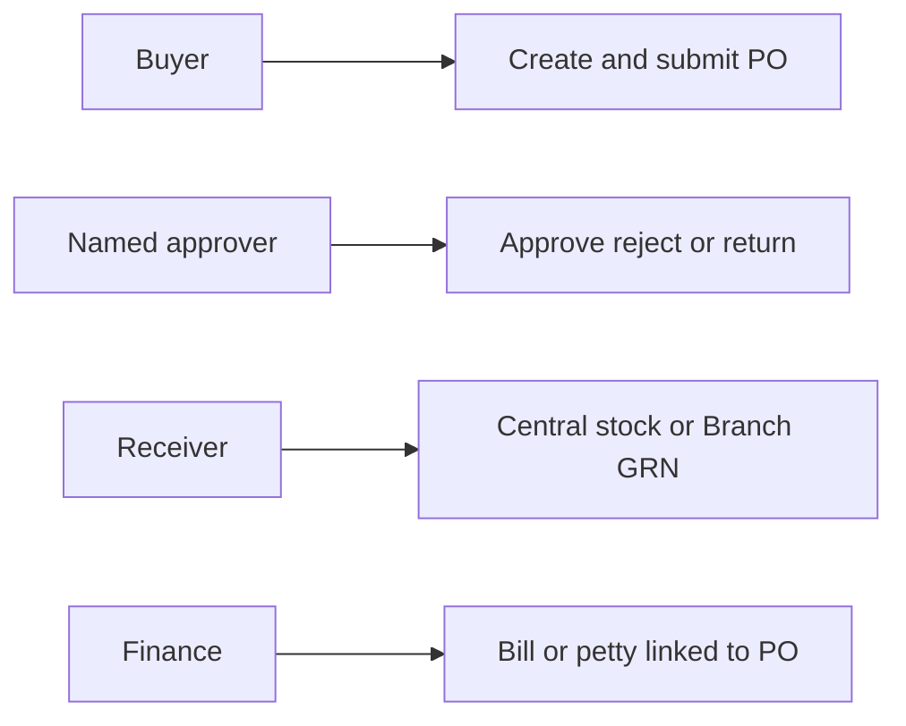
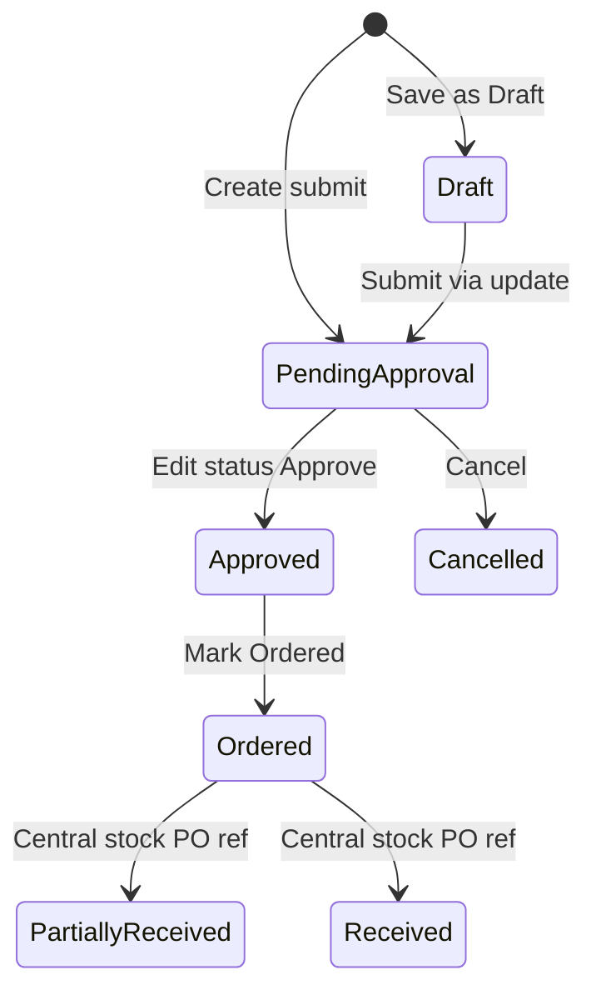
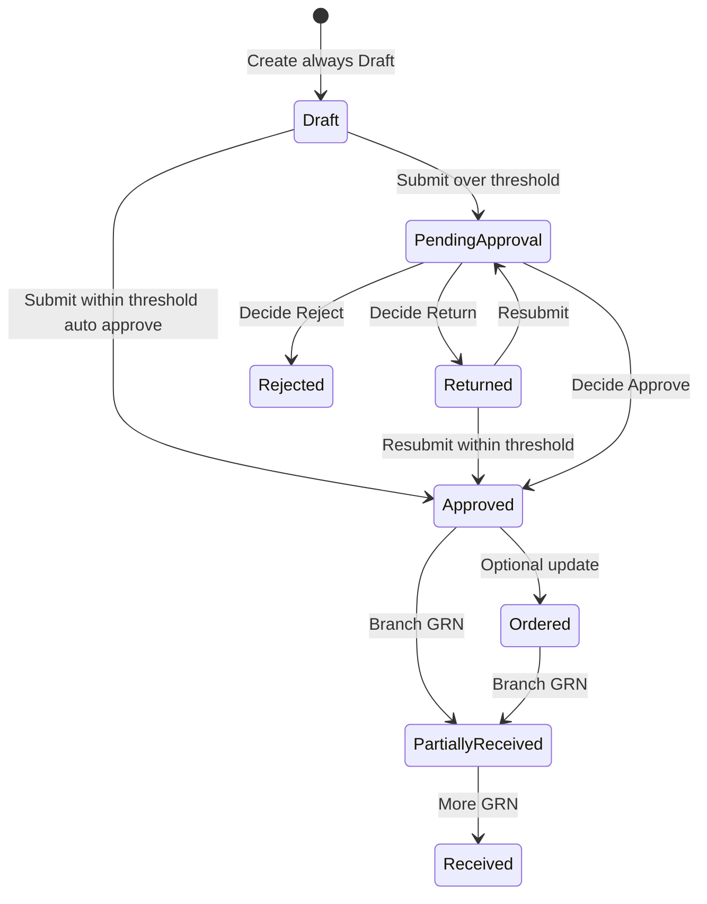
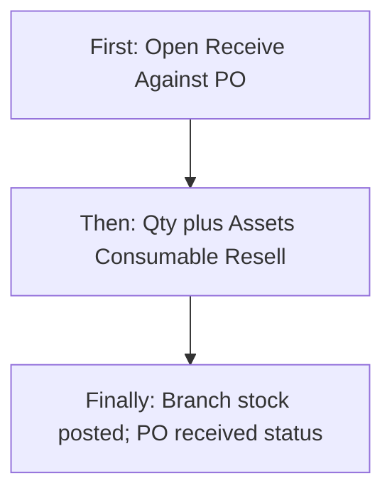
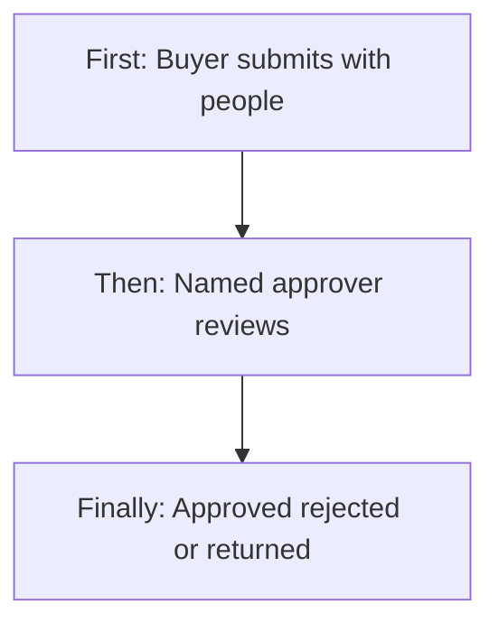
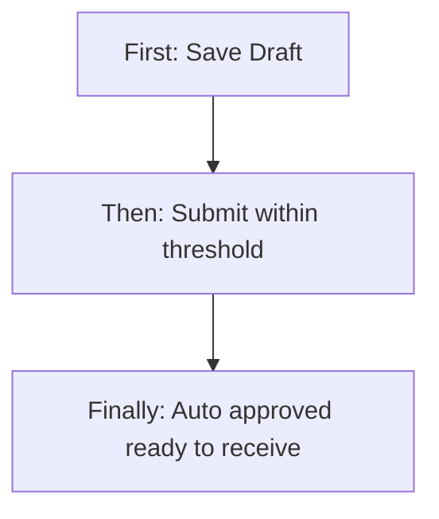
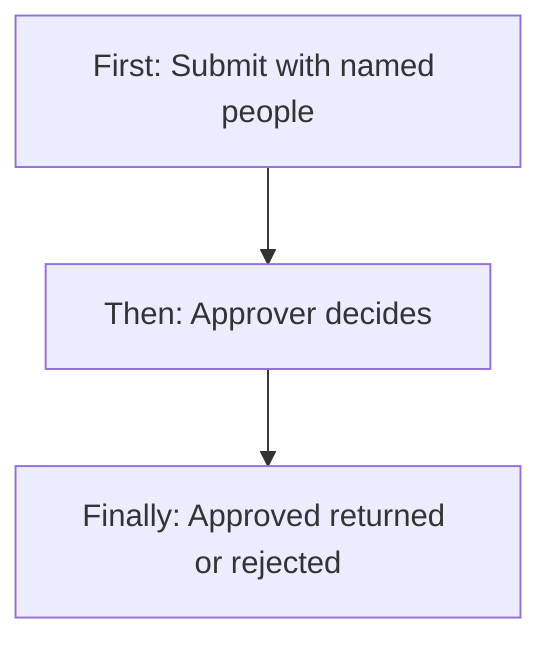
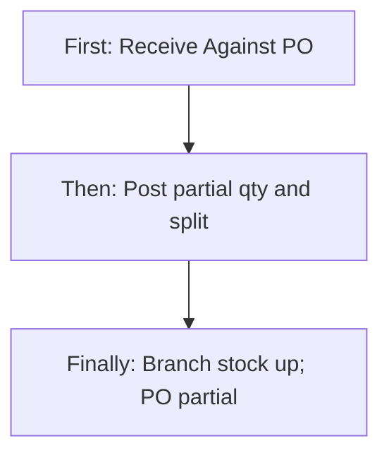
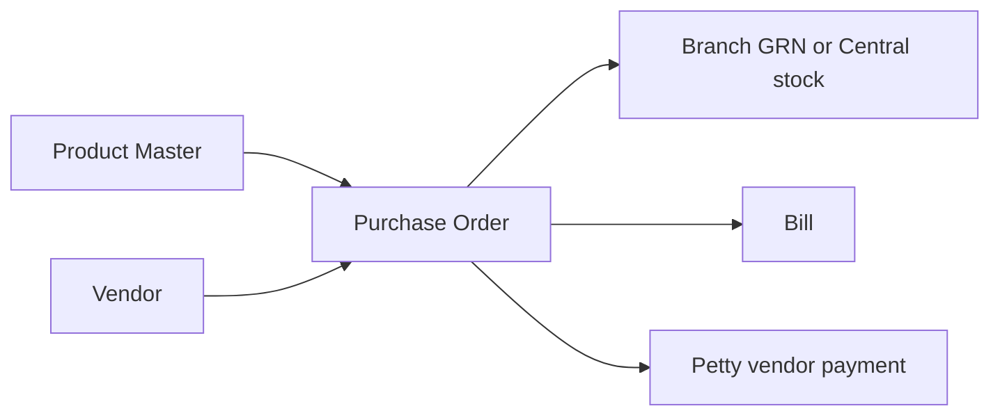
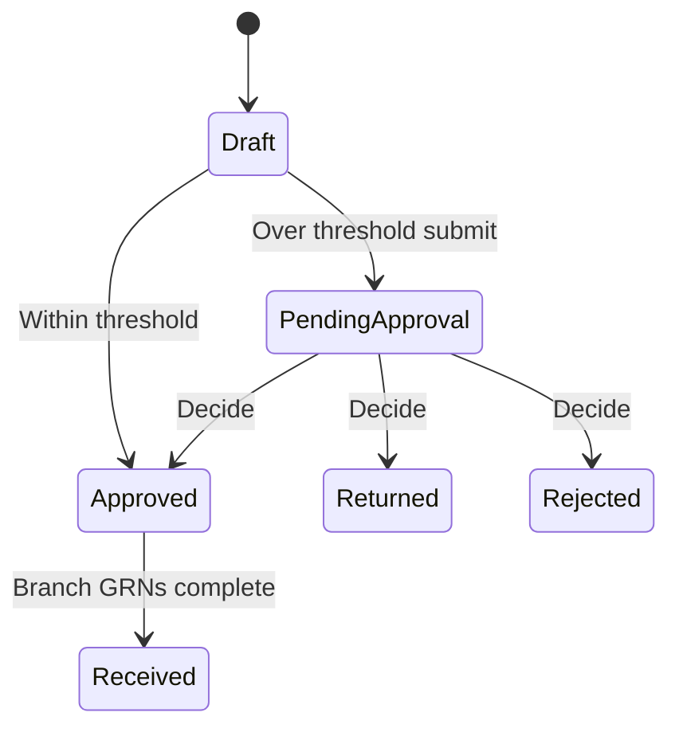

# Purchase Order Management — Product & Business Documentation

## 1. Purpose & Business Need

Procurement needs a controlled document to **order goods from vendors** for a **branch**, with priced lines, tax, delivery details, and a clear path from draft through approval to goods receipt. **Purchase Order Management** (menu: Procurement → Purchase Orders) is that document layer.

The company can run procurement in **two operating styles**. The style is a **tenant setting**. Each PO **remembers the style it was created under**, so flipping the setting later does not rewrite old POs.

| Style | Who typically buys | Where goods land | How goods are received |
|-------|--------------------|------------------|------------------------|
| **Central** | Head office / central buyer | Central warehouse first | Add to Central Stock with a PO reference (Stock Management) |
| **Branch-direct** | The branch that needs the goods | **That branch’s stock** immediately | **Receive Against PO (Branch GRN)** — not Central Stock |

POs still connect **Vendor** (who supplies), **Product Master** (what is bought + HSN for GST), **Branch** (where goods are intended), **Stock** (receipt), **Bills** (AP can link a bill; vendor must match), and **Petty Cash** (vendor-payment claims on branch-direct POs).

**Outcomes today:**
- Create Draft; submit for approval (or auto-approve on branch-direct when value is within threshold)
- Named **approver people** on branch-direct submit (not only “anyone with Edit”)
- Approve, Reject, or **Return for correction** on branch-direct pending POs
- Distinct statuses: Returned, Rejected, Approved, Ordered, Partially Received, Received, Cancelled
- Line items with product, qty, UOM, price, GST % validated from HSN; header **CGST / SGST / IGST** buckets from vendor vs branch state
- PDF download; activity timeline
- Branch GRN with Assets / Consumable / Resell split, batch, and asset serials
- Petty cash vendor-payment must pick an Approved+ PO when the tenant is branch-direct

**What this module is not:** Contract-linked POs, TDS on the PO itself, a full 3-way match engine, GRN photos / reverse GRN, or extra categories on PO lines (those live on Product Master only).

---

## 2. Users & Roles (who uses this and why)

### 2.1 Company CEO / Owner

Full access. Can create, decide pending branch-direct POs even if not named as a recipient, change procurement settings, and receive. On submit over threshold, CEO may omit named recipients.

### 2.2 Branch / procurement buyers

Staff with Purchase Order **Add** create drafts. Staff with **Request** (or Add) **submit** branch-direct POs, pick **who must approve**, and write justification when the value jumps above threshold. They later open **Receive Against PO** if they also have Stock Add, Stock Request, or PO Approve (and belong to the PO branch).

### 2.3 Named approvers (branch-direct)

People selected on submit (typically users who can receive Purchase Order requests and hold **Approve**). They work the **Received** tab and **Decide**: Approve, Reject, or Return. If no people were stored (legacy), the system falls back to role + same branch.

### 2.4 Central-mode editors

On **Central** POs, moving Pending → Approved is still an **Edit** status change on the form — there is no named-recipient inbox for that older path.

### 2.5 Warehouse / stock users

- **Central POs:** receive via **Add to Central Stock** with PO reference.  
- **Branch-direct POs:** receive **only** via Branch GRN. Central inbound is blocked when the tenant setting says so.

### 2.6 Finance / AP / petty

Link bills to a PO (vendor must match). On branch-direct, a petty **vendor payment** claim must pick an Approved+ PO for the same branch; amount cannot exceed PO grand total; amounts above ₹50,000 are directed to a Purchase Bill instead of petty.

---

## 3. Access Control (RBAC)

### 3.1 How access works

| Permission | Allows |
|------------|--------|
| **Read** | List, detail, PDF, GRN list, threshold preview |
| **Add** | Create PO; can also submit |
| **Edit** | Update fields when the status allows; **Central** approve / ordered / cancel via status update |
| **Delete** | Soft-delete **Draft only** |
| **Request** | **My** POs tab; submit; eligible-recipient picker |
| **Approve** | **Received** tab; **Decide** on branch-direct pending POs |

**Procurement settings:** anyone with PO Read can view; **only CEO** can change Central vs Branch-direct, threshold %, and “block Central inbound”.

**Branch GRN create:** CEO, or Stock **Add**, or Stock **Request**, or PO **Approve**. Non-CEO must belong to the PO’s branch.

Sidebar: **Procurement → Purchase Orders**. **Procurement Settings** is a separate screen.

### 3.2 Role × action matrix

| Role | View list | View detail | Add | Edit | Inactive / Delete | Submit request | Receive / act | Approve | Reject |
|------|-----------|-------------|-----|------|-------------------|----------------|---------------|---------|--------|
| Company CEO | Yes | Yes | Yes | Yes | Soft-delete Draft | Yes | Yes (both receive paths) | Yes | Yes (Reject / Cancel by path) |
| Staff with PO Read | Yes (own branches if scoped) | Yes | No | No | No | No | No | No | No |
| Staff with PO Add | Yes | Yes | Yes | Limited | No | Yes (create/submit) | No* | No | No |
| Staff with PO Edit | Yes | Yes | No | Yes when Draft/Returned (BD) or Draft (Central) | No | Status on Central | No* | Central only (status) | Central Cancel |
| Staff with PO Request | My tab | Yes | No (cannot create without Add) | No | No | Yes (submit) | No* | No | No |
| Staff with PO Approve | Received tab | Yes | No | Decide only | No | No | Can post GRN | Yes (BD Decide) | Yes (BD Reject) |
| Staff with PO Delete | Yes | Yes | No | No | Draft only | No | No | No | No |
| Stock Add / Request | — | PO used on GRN | No | No | No | No | **Branch GRN** | No | No |

\*Goods receive is **not** a generic PO Edit button. Central = Stock Central inbound. Branch-direct = Receive Against PO.

**Record-level rules:**
- Lists without an explicit branch filter are scoped to the user’s branches.
- Branch-direct Decide: if named people exist, **only those user IDs** (plus CEO) may decide — **branch membership is not re-checked** on that path. If the people list is empty, role + branch apply.
- Own POs do not appear in the Received inbox.
- Rejected POs cannot be resubmitted. Returned POs can be edited and submitted again.

---

## 4. Capabilities & Features

### 4.1 PO dashboard

Tabs when the tenant is branch-direct: **All**, **My**, **Received**. Central-only tenants mainly use the All list.

List: search, filters (status, vendor, branch, date range), View, Download PDF, Edit/Delete for Drafts, Receive when the PO is receivable.

### 4.2 Add / Edit PO

Header: dates, branch, vendor, delivery address/contact, authorization note. Lines: products with qty, UOM, price, HSN (from product), GST %. Tax multi-select on the form is a **preview**; the server stores GST % and computes CGST/SGST/IGST on the header.

**Branch-direct create always saves Draft.** Submitting Pending on create is rejected. Buyer then uses **Submit** and picks approvers.

**Central create** may save Draft or go straight to Pending Approval.

### 4.3 View PO / Decide

Read-only detail, PDF, activity. Branch-direct Pending: **Decide** (Approve / Reject / Return). Receivable statuses: **Receive Against PO**. GRN history and remaining qty per product are shown.

### 4.4 Status-driven lifecycle

See **§4A**. Two different machines share some status names.

### 4.5 Tax on lines and header buckets

See **§4B**.

### 4.6 Branch GRN

See **§4C**. Same Assets / Consumable / Resell idea as Central inbound, posted to the **branch** ledger.

### 4.7 Threshold auto-approve (branch-direct)

See **§4D**. Compares this PO’s grand total to the last completed PO **for the same branch** (vendor is ignored for the %).

### 4.8 Petty cash vendor payment

See **§4E**. Not a PO type — a rule on petty claims.

### 4.9 Procurement settings

Tenant-wide: receipt mode (Central vs Branch-direct), PO value threshold %, block Central inbound for branch-direct POs.

---

## 4A. Status Lifecycle (deep dive)

### Statuses that exist

| Status | Business meaning |
|--------|------------------|
| **Draft** | Working document; structural edit allowed; can soft-delete |
| **Pending Approval** | Submitted; waiting a decision; structure locked |
| **Returned** | Approver sent it back with comments; buyer may edit and resubmit (**branch-direct**) |
| **Rejected** | Stopped; **cannot** resubmit — raise a new PO (**branch-direct**) |
| **Approved** | Authorized. Branch-direct may **GRN from Approved** without Mark Ordered |
| **Ordered** | Confirmed with vendor / in fulfillment (optional on branch-direct) |
| **Partially Received** | Some qty received vs ordered |
| **Received** | All line qtys covered by receipts |
| **Cancelled** | Stopped; also used as Central “reject” from pending |

### Central PO transitions

On Central, **Edit** can still move Ordered / Partial toward Received or Cancelled. Stock with a PO reference also advances Partially Received / Received.

### Branch-direct PO transitions

| From → To (branch-direct) | Who / how | Structural edit? |
|---------------------------|-----------|------------------|
| Create → Draft | Add | Yes |
| Draft / Returned → Pending or Approved | **Submit** (not ordinary update) | After submit, no |
| Pending → Approved / Rejected / Returned | **Decide** only | No |
| Approved → Ordered / Cancelled | Update | No lines |
| Approved / Ordered / Partial → Partial / Received | **Branch GRN only** — status update to Received is rejected | No |
| Any → Cancel after a GRN exists | Blocked | — |
| Rejected → anything | Blocked | Must create new PO |

**Not in the model:** Hold, Closed, Inactive, Contract-linked statuses. Central still has **no** Returned/Rejected as first-class Decide outcomes (cancel is used instead).

---

## 4B. Tax / HSN buckets (deep dive)

Each line carries **GST %** and **HSN** (from Product Master). The server checks GST % against the **active HSN tax master**:

- **Inter-state** (vendor state ≠ branch state, using GSTIN first two digits when needed): expected % is the **IGST** rates for that HSN, not CGST+SGST+IGST added together.
- **Intra-state:** expected % is **CGST + SGST** for that HSN.
- Missing state is treated as **intra**.
- Unmapped HSN: allowed slabs 0 / 5 / 12 / 18 / 28.

Line tax = qty × price × GST %. That tax is split onto the **PO header**:

- Intra: split between CGST and SGST by their rate ratio (or 50/50 if rates missing).
- Inter: all **IGST**.

The Add form’s tax checkboxes and extra GST number fields are **preview / display**. They are not stored as separate tax-key arrays on the PO.

**Product extra categories** are not on PO lines and do not change tax.

---

## 4C. Branch GRN — receive against PO (deep dive)

### When it applies

Only if the PO was created in **branch-direct** mode and status is **Approved, Ordered, or Partially Received**. Central POs must still use Add to Central Stock.

### What the receiver does

**First:** Opens the PO and chooses **Receive Against PO**.

**Then:** Enters GRN date, optional delivery person, vehicle/courier, vendor invoice number, remarks. For each product still remaining, enters **qty now**. The screen **defaults** Assets / Consumable / Resell from the line’s **primary product category**, then the user may type a mixed split (the three numbers must add up to qty now). Changing qty **resets** the default split.

**Assets qty > 0:** each asset unit needs a **serial / asset ID**. The user can generate the next IDs, preview them, and assign each unit to the **branch pool** or to an **employee**. Mixed receipts (some assets + some consumable) are allowed; serials are required only for the asset portion.

**Consumable / resell:** batch is expected on the screen; if omitted on save, the system can fill `{PO code}-{product}`.

**Finally:** Stock of the **PO branch** increases in those three buckets. Asset units are created at that branch. The PO becomes Partially Received or Received. A GRN document is stored (visible code like `{PO}-G01`). Activity records GRN created and stock adjusted.

### Remaining quantity

Cannot receive more than ordered minus already GRN’d qty for that product. Partial receipts are normal (multiple GRNs).

### Who can post

CEO, or Stock Add, or Stock Request, or PO Approve — and (except CEO) the user must be assigned to the PO branch.

### What Branch GRN is not

It is not Central Stock. It does not use extra product categories for the default split. It does not reverse. It does not attach gate-slip photos in this version.

---

## 4D. Threshold and named approvers (branch-direct, deep dive)

### Baseline

Look at the last PO for **this branch** that already reached Approved or later (Approved, Ordered, Partially Received, Received). Ignore vendor. Compare:

> (this grand total − baseline) / baseline × 100  

If that % is **greater than** the tenant threshold (default **20%**), the PO **needs approval**. If there is **no baseline** (first PO for the branch) or the increase is within threshold, submit **auto-approves**.

### Submit

Buyer must send **justification remarks** and **recipient people** when over threshold (CEO may skip the people list). Recipients are chosen from an eligible list: users who can receive Purchase Order requests, hold Approve, match branch (CEO role skipped for branch match), not the submitter. CEO users are default-selected.

**First:** Buyer finishes the Draft and clicks Submit.  
**Then:** If over threshold, modal: remarks + people. If within threshold, submit auto-approves.  
**Finally:** Pending POs appear in each named person’s **Received** tab. Auto-approved POs are ready to receive (and the creator is notified).

### Decide

Approver opens the PO and chooses Approve, Reject, or Return (with comments on reject/return).

- **Approve:** PO becomes Approved; buyer can GRN.  
- **Return:** buyer edits lines on Returned, then submits again.  
- **Reject:** terminal; new PO required.

---

## 4E. Petty cash and bills (deep dive)

**Bills:** optional link to PO; bill vendor must equal PO vendor. No automatic bill from GRN.

**Petty vendor payment (branch-direct tenant):** the claim **must** pick an Approved+ PO; claim branch = PO branch; amount ≤ PO grand total; above ₹50,000 the user is told to create a **Purchase Bill** instead. Petty does not auto-create a bill. Central mode / other petty categories: PO remains optional.

---

## 5. CRUD Operations

### 5.1 Create (Add)

**Who:** CEO or PO **Add**.

**First:** Open Add Purchase Order; choose branch and vendor; add product lines (qty, price, GST).

**Then:** Save. Branch-direct → always **Draft**. Central → Draft or Pending depending on the action.

**Finally:** PO number is assigned by the system. Authorized person is the current user (the form field is display-only).

### 5.2 Read — List

**Who:** PO **Read** (All), **Request** (My), **Approve** (Received).

Columns typically include PO number, vendor, branch, status, dates, totals. Filters: status, vendor, branch, date range. Search by PO / vendor text as implemented on the dashboard.

### 5.3 Read — Detail / Get details

Loads header, lines, tax buckets, received qty by product, GRN summary, activity. Decide / Receive / PDF according to status and permissions.

### 5.4 Update (Edit)

**Who:** PO **Edit**, when status allows.

**Branch-direct:** structural edit only on **Draft** or **Returned**. Pending cannot be “approved” by Edit — must Decide. Received qty cannot be faked by status update.

**Central:** Draft remains fully editable; Pending can be Approved/Cancelled via Edit status.

### 5.5 Inactive / Delete

**Who:** PO **Delete**.

Only **Draft** can be soft-deleted. Returned / Rejected / Approved documents cannot be deleted this way. Cancel is a status, not delete.

---

## 6. Request & Approval Flows

**Central:** Submit is a status on create/update; approve is Edit. There is **no** named-recipient inbox.

**Branch-direct:** This module **does** use Request and Approve.

### 6.1 Submit request

Buyer with Request or Add calls Submit with remarks and recipient people when required. See §4D.

### 6.2 Receive / inbox / pending actions

**Received** tab lists branch-direct POs waiting for the current user (named list, or legacy role). Own POs excluded. CEO sees others’ pending BD POs.

### 6.3 Approve / Reject / Return

**First:** Approver opens the PO from Received or detail.  
**Then:** Reviews lines, tax, threshold context, remarks. Chooses Approve, Reject, or Return.  
**Finally:** Status changes; buyer is notified; on Approve the branch can GRN.

---

## 7. Forms — Add vs Edit Field Access

| Field (business name) | On Add | On Edit | Notes |
|----------------------|--------|---------|-------|
| PO number | Hidden (system) | Locked | Assigned on create |
| PO date | Editable | Editable while Draft/Returned | |
| Delivery date | Editable | Same | |
| Branch | Required, editable | Locked after create in practice | Threshold baseline is per branch |
| Vendor | Required, editable | Editable while Draft/Returned | Must stay aligned with bills later |
| Delivery address / contact / designation | Editable | Same when editable | |
| Authorized person | Display | Display | Server sets current user on create |
| GST / vendor GST display | Display | Display | Snapshot; extra typed GST fields not stored |
| Note / authorization note | Editable | Same when editable | |
| Line product | Required | Editable when Draft/Returned | Active products only |
| Line qty / UOM / price / GST % | Required | Same when editable | GST validated from HSN |
| HSN on line | From product, locked | Locked | |
| Tax type checkboxes | Preview only | Preview only | Not persisted as keys |
| Recipient people | Hidden on create | **Submit modal only** | Not on create/update body |
| Justification remarks | Submit modal | Submit modal | Required over threshold |
| Correction / rejection notes | Hidden | Shown when Returned/Rejected | Read-only |
| Status | Hidden / implied Draft (BD) | Locked display; actions change it | |
| GRN split / serials | Hidden | Hidden on PO form | Separate Receive screen |

---

## 8. Lists, Dropdowns, Details & Data Rendering

### 8.1 List rendering

Dashboard tabs All / My / Received (BD). Pagination and filters as on the dashboard. Empty state when no POs match.

### 8.2 Dropdowns & lookups

| Dropdown | Source | Notes |
|----------|--------|-------|
| Branch | Active branches user can use | Required; scopes threshold and GRN |
| Vendor | Active vendors | GST snapshot on save |
| Product (per line) | Active product dropdown | Fills HSN, UOM, primary category |
| Eligible recipients | Users who can approve this branch’s POs | Submit modal; CEO default selected |
| Approved PO (petty) | Approved+ POs for a branch | Petty vendor payment |

### 8.3 Detail / get-details rendering

Opening a PO loads header + lines + CGST/SGST/IGST + remaining qty + GRN list + activity. Buttons: Edit (if allowed), Submit (Draft/Returned), Decide (Pending BD + Approve permission), Receive (receivable BD), PDF, GRN view.

---

## 9. How It Works (end-to-end user flows)

### 9.1 Buyer — Branch-direct PO within threshold

**First:** Buyer creates a Draft for Andheri West.  
**Then:** Submits. System compares to last Approved+ PO for that branch; increase is within 20%.  
**Finally:** PO is **Approved** immediately. Buyer (or stock user) can Receive Against PO.

### 9.2 Buyer and manager — Over-threshold named approval

**First:** Buyer submits a much larger PO and selects Amit as recipient, with remarks.  
**Then:** Amit sees it on Received, reviews, Approves (or Returns / Rejects).  
**Finally:** On Approve, branch can GRN; on Return, buyer fixes Draft-like Returned document and resubmits.

### 9.3 Receiver — Partial Branch GRN with mixed split

**First:** Approved PO has 100 bottles of gel (primary Chemical) and 2 sprayers (primary Sprayer).  
**Then:** Receiver GRNs 40 gel as Consumable (default) and 2 sprayers as Assets with serials; gel remaining 60 waits for a later GRN.  
**Finally:** Branch ledger +40 consumable and +2 assets; PO Partially Received.

### 9.4 Central-mode buyer — Classic path

**First:** Create and submit to Pending.  
**Then:** User with Edit sets Approved then Ordered.  
**Finally:** Warehouse Adds to Central Stock with PO reference; PO moves to Partial/Received. Branch-direct GRN is not used.

### 9.5 Attempt Central inbound on a branch-direct PO

**First:** User opens Add to Central Stock and types the BD PO number.  
**Then:** System blocks when “block Central inbound” is on.  
**Finally:** User must use Receive Against PO instead.

---

## 10. Cross-Module Interactions

| Related area | Connection |
|--------------|------------|
| **Product Master** | Line product ID; HSN; Base UOM default; **primary** category for GRN default split; extra categories ignored on the line |
| **Vendor** | Must be active; GST snapshot |
| **Branch** | Required; list scope; threshold baseline; GRN posts to this branch |
| **Stock Management** | Central inbound + PO ref **or** Branch GRN to branch ledger; BD POs skip Central status sync |
| **Bills** | Optional PO link; vendor must match |
| **Petty Cash** | Vendor payment + BD mode requires Approved+ PO |
| **Notifications** | BD submit → selected people; decide/auto-approve → creator. Central pending still notifies Branch Manager role name |
| **Asset units** | Created on GRN when Assets qty > 0 |

---

## 11. Data the Business Cares About

| Attribute | Business meaning |
|-----------|------------------|
| PO number / visible code | Document identity (e.g. vendor letters + sequence) |
| Receipt mode at create | Central vs Branch-direct snapshot |
| Status | Lifecycle |
| Branch / Vendor | Where and from whom |
| Lines | Product, qty, UOM, price, HSN, GST %, tax amount |
| Header CGST / SGST / IGST | GST buckets |
| Grand total | Threshold and petty cap reference |
| Auto-approved | Threshold path |
| Recipient people | Who may Decide |
| Justification / return / reject notes | Audit of the decision |
| Received qty by product | Remaining for GRN |
| GRN header | Date, delivery, vehicle, vendor invoice, remarks |
| GRN line split | Assets / Consumable / Resell + serials / batch |
| Activity log | Append-only timeline |

---

## 12. Rules, Validations & Constraints

- Branch-direct create cannot start as Pending Approval.
- Draft → Pending via ordinary update is rejected on BD; use Submit.
- Pending → Approved via ordinary update is rejected on BD; use Decide.
- Receive via status update is rejected on BD; use GRN.
- GRN qty cannot exceed remaining. Split must sum to qty now.
- Asset serial count must match integer Assets qty when Assets > 0.
- Cancel after any GRN is blocked.
- Delete = Draft only.
- Bill vendor must equal PO vendor.
- Petty vendor payment (BD): Approved+ PO, same branch, amount ≤ grand total, > ₹50,000 → bill.
- GST % must match HSN mapping (non-draft) or allowed slab.

---

## 13. Loopholes, Gaps & Current Limitations

1. **Two approve worlds:** Central still uses **Edit** status; BD uses **Approve + named people**. Easy to train the wrong path.
2. **Request without Add** cannot create a PO; My tab still needs Request.
3. **Named Decide does not re-check branch** if the user is on the people list.
4. **CEO can skip recipients** even when over threshold.
5. **Extra categories** on Product Master never reach the PO line; GRN default uses primary only.
6. **Tax checkboxes** on the form are not saved; header buckets are server-computed.
7. **No GRN reverse**, photos, or over-receive override.
8. **Returned** cannot be deleted (only Draft).
9. **Frontend leftover** older Edit-approve screen is not the live form.
10. **Approved PO dropdown** used by petty; a generic “all PO dropdown” call from the UI may not exist on the server.
11. **Detail Edit** may rely on in-memory row rather than the URL id.
12. **Mark Ordered** is optional for BD receive; Central UI still teaches Ordered-then-stock.
13. **No 3-way match** of billed vs received vs ordered value in this version.

---

## 14. Existing Functionality Summary

**Available today:**
- Central and Branch-direct modes (snapshotted per PO)
- Draft, submit, auto-approve, named inbox, Decide (approve / reject / return)
- Line pricing + HSN GST validation + CGST/SGST/IGST header
- PDF, activity, My / Received tabs
- Branch GRN with qty split, serials, remaining qty, PO status
- Block Central inbound for BD POs
- Petty vendor-payment PO rules; bill vendor match
- Soft-delete Draft; cancel rules

**Not available:**
- Extra categories on lines / auto mixed-split from extras
- GRN reverse / photos
- Dedicated Approve permission on **Central** POs
- Automatic bill from GRN
- Contract-linked PO / TDS on PO

---

## 15. Reference — APIs, Screens & UI Actions

### 15.1 APIs

| Method | Path | Purpose (plain language) | Used by (screen/flow) |
|--------|------|--------------------------|------------------------|
| POST | `/api/v1/purchase-orders` | Create PO | Add PO |
| PUT | `/api/v1/purchase-orders/update?id=` | Update when allowed | Edit PO |
| GET | `/api/v1/purchase-orders` | Filtered list | Dashboard All |
| GET | `/api/v1/purchase-orders/get-by-id?id=` | Detail | View, Edit, Receive |
| DELETE | `/api/v1/purchase-orders/delete?id=` | Soft-delete Draft | List delete |
| GET | `/api/v1/purchase-orders/download-pdf?id=` | PDF | List / detail |
| GET | `/api/v1/purchase-orders/my` | My POs | My tab |
| GET | `/api/v1/purchase-orders/received` | Approver inbox | Received tab |
| GET | `/api/v1/purchase-orders/eligible-recipients` | People picker | Submit modal |
| GET | `/api/v1/purchase-orders/threshold-preview` | Whether approval needed | Submit UX |
| PUT | `/api/v1/purchase-orders/{id}/submit` | Submit BD PO | Submit |
| PUT | `/api/v1/purchase-orders/{id}/decision` | Approve / reject / return | Decide |
| POST | `/api/v1/purchase-orders/{id}/grn` | Post Branch GRN | Receive Against PO |
| GET | `/api/v1/purchase-orders/{id}/grn` | GRNs for a PO | Detail |
| GET | `/api/v1/purchase-orders/grn/{grnId}` | One GRN | GRN detail |
| GET | `/api/v1/purchase-orders/{id}/activity` | Timeline | Detail |
| GET | `/api/v1/purchase-orders/dropdown-approved` | Approved+ POs | Petty |
| GET/POST | `/api/v1/purchase-orders/asset-ids/next` and `/preview` | Next asset IDs | GRN assets |
| GET/PUT | `/api/v1/procurement-settings` | Mode, threshold, block central | Settings |

### 15.2 Frontend Screen Routes

| Route | Screen purpose | Primary users |
|-------|----------------|---------------|
| `/purchase-orders` | Dashboard All / My / Received | Buyers, approvers |
| `/add-purchase-order/:id?` | Add or edit form | Add / Edit |
| `/purchase-edit/:id?` | Same live form | Edit |
| `/purchase-order-detail` | View, Decide, Receive entry | All with Read |
| `/purchase-orders/receive/:poId` | Branch GRN | Receivers |
| `/purchase-orders/grn/:grnId` | GRN view | Receivers, auditors |
| `/procurement-settings` | Tenant procurement mode | CEO (save), Read (view) |

### 15.3 Click Events, Filters, Search & Controls

| Screen / Route | Control | Type | What happens |
|----------------|---------|------|--------------|
| Dashboard | All / My / Received | Tabs | Switches list (BD) |
| Dashboard | Search / status / vendor / branch / dates | Filters | Refines list |
| Dashboard | View / PDF / Edit / Delete / Receive | Row actions | Opens the matching screen |
| Add/Edit PO | Branch, vendor, lines | Form | Builds the PO |
| Add/Edit PO | Save Draft | Button | Creates/updates Draft |
| Add/Edit PO | Submit | Button | Opens recipient modal (BD) or pending (Central) |
| Add/Edit PO | Approve / Mark Ordered | Button | **Central** Edit path only |
| Submit modal | Recipients + remarks | Modal | Sends Submit |
| Detail | Decide | Actions | Approve / Reject / Return |
| Detail | Receive Against PO | Button | Opens GRN |
| Receive Against PO | Qty now | Number | Remaining cap; resets split default |
| Receive Against PO | Assets / Consumable / Resell | Numbers | Must sum to qty now |
| Receive Against PO | Generate / preview serials | Actions | Asset IDs |
| Receive Against PO | Assignment branch pool / employee | Dropdown | Asset custody |
| Receive Against PO | Post GRN | Button | Posts branch stock |
| Procurement settings | Mode / threshold % / block central | Form | CEO save |
