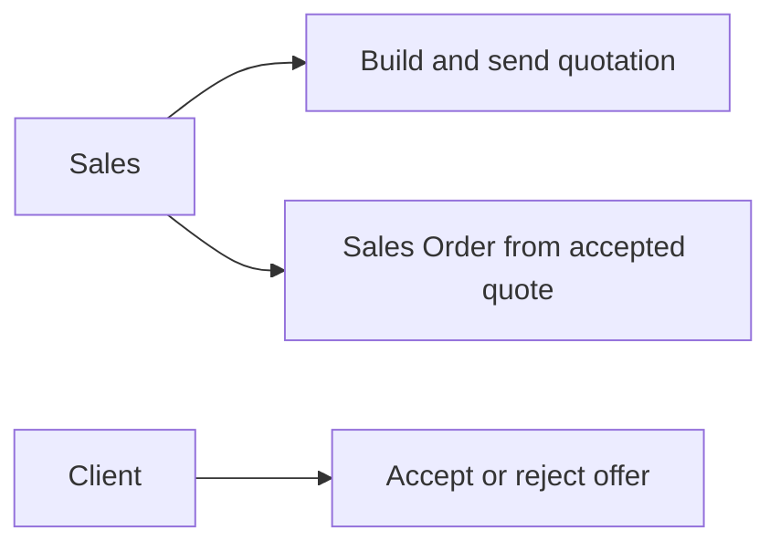
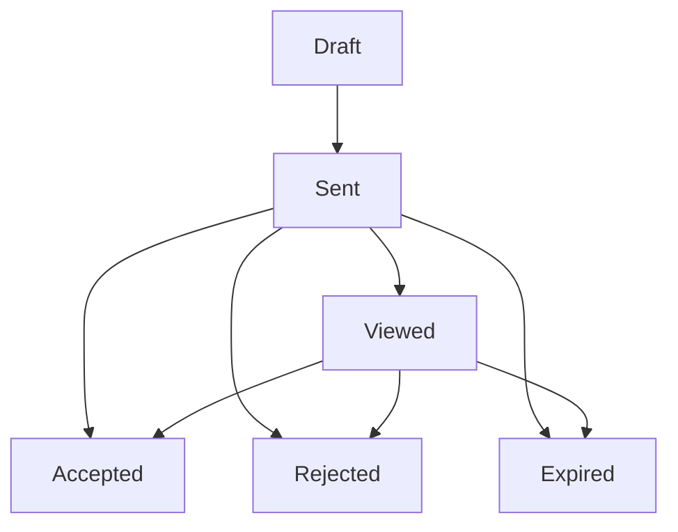
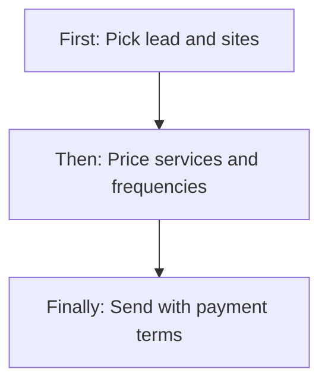
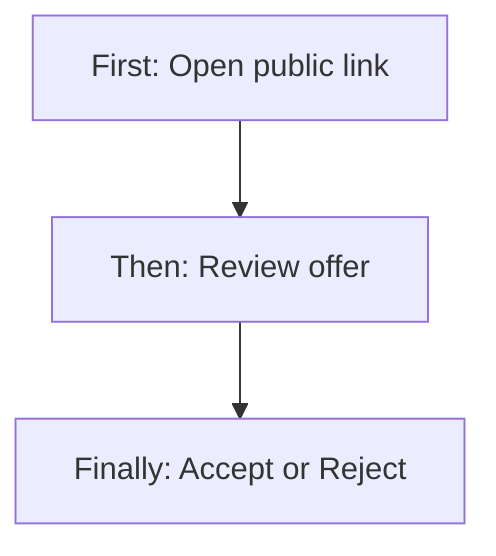
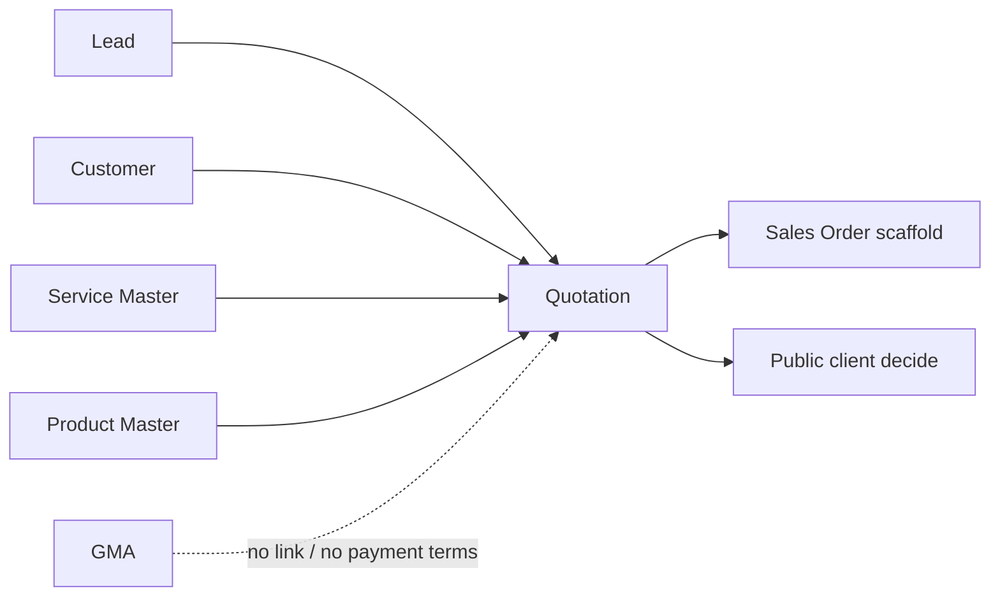
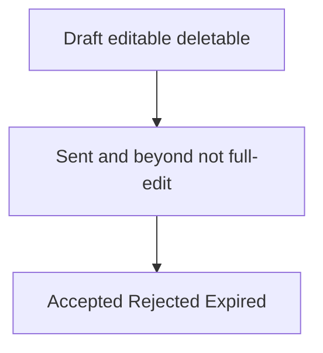

# Quotation Management — Product & Business Documentation

## 1. Purpose & Business Need

Pest-control and product sales teams need a **commercial offer** the client can review: which sites, which services (with visit pattern), optional products with tax, how long the offer is valid, and **how payment will work** — without turning the quote into a full costing / margin worksheet.

**Quotation Management** (CRM → Quotation Management) is that offer document. Sales create a draft from a **Lead**, an existing **Customer**, or a **new prospect**, price **service** and/or **product** lines, set **validity** and **payment terms**, then **Send** (email + PDF + public client link). The client (or staff) can **Accept** or **Reject**. Accepted quotes can feed **Sales Order** scaffolding; lead status moves toward conversion on send/accept.

**Outcomes today:**
- Draft / send / resend / view PDF quotations
- Service lines with Service Master pricing (fixed / area / inspection) and visit frequency
- Contract (AMC) mode with contract frequency, duration, and proposed start
- Product lines with HSN/GST from Product Master
- Payment terms (standard enums + custom text) and special terms
- Soft-delete of drafts only; expire by valid-till date
- Public client view and accept/reject via token link

**What this module is not:**
- A **margin / gross-profit** worksheet (those live on **GMA**, not on Quotation)
- A GMA sheet or “quote from GMA” source (no From GMA)
- An internal request/approve inbox (accept/reject is a **commercial** decision)
- Automatic convert-to-contract (flag exists; no convert flow in product today)

**Related docs:** [`leads-follow-up-management.md`](./leads-follow-up-management.md), [`service-management.md`](./service-management.md), [`product-management.md`](./product-management.md).

---

## 2. Users & Roles (who uses this and why)

### 2.1 Company CEO / Owner

Full access to list, create, edit drafts, send, PDF, delete drafts.

### 2.2 Sales / CRM operators

Staff with **Quotation Management** permissions prepare offers, send to clients, download PDFs, and manage drafts.

### 2.3 Client (external)

Opens the **public quotation link** (token), may view the offer, and can Accept or Reject without logging into the ERP.

### 2.4 Downstream users

- **Sales Order** users pick eligible **Accepted** quotations to scaffold an order  
- **Lead** operators open Create Quotation from qualified pipeline stages  

---

## 3. Access Control (RBAC)

### 3.1 How access works

Platform module: **Quotation Management**.

| Permission (catalog) | Intended use in UI |
|----------------------|--------------------|
| **Read** | List, view, open add/edit routes |
| **Add** | Create Quotation / Save as Draft / Send (create path) |
| **Edit** | Edit draft from list/view; update draft |
| **Delete** | Soft-delete draft |
| **Export / Download** | Download PDF (UI accepts either) |
| **Request / Approve** | Seeded in platform catalog but **not used** for quotation workflows |

Sidebar: **CRM → Quotation Management** with Quotation Management Read.

**Important:** Quotation APIs today do **not** enforce module authorities the same way as Invoice/Sales Order — any authenticated user who can reach the API may call them. UI still gates buttons with Quotation Management permissions. CEO bypass applies in the UI.

### 3.2 Role × action matrix

| Role | View list | View detail | Add | Edit | Inactive / Delete | Submit request | Receive / act | Approve | Reject |
|------|-----------|-------------|-----|------|-------------------|----------------|---------------|---------|--------|
| Company CEO | Yes | Yes | Yes | Yes (draft) | Soft-delete draft | No | No | No* | No* |
| Staff with Quotation Read | Yes | Yes | No | No | No | No | No | No | No |
| Staff with Quotation Add | Yes | Yes | Yes | No | No | No | No | No | No |
| Staff with Quotation Edit | Yes | Yes | No | Yes (draft only) | No | No | No | No | No |
| Staff with Quotation Delete | Yes | Yes | No | No | Soft-delete draft | No | No | No | No |
| Client (public link) | Public view | Public view | No | No | No | No | Yes (decide) | Accept* | Reject* |
| Staff without Quotation Management | Menu blocked if Read missing | — | No | No | No | No | No | No | No |

\*Accept/Reject are **commercial decisions** (staff status update or client public decision), **not** RBAC Approve/Reject permissions. Staff Accept/Reject controls are **not exposed on the main Quotation screens** today (API exists; UI mostly shows status after the fact). Client public Accept/Reject **does** exist.

**Record-level:** Only **DRAFT** quotations can be edited or soft-deleted. Sent/Viewed/Accepted/Rejected/Expired are not editable as a full form rewrite.

---

## 4. Capabilities & Features

### 4A. Commercial offer lifecycle

Create Draft → Send (email + PDF + public token) → Client may View → Accept or Reject → or Expire when valid-till passes. Resend for eligible non-terminal statuses.

### 4B. Source selection (who the offer is for)

| Source | What sales picks | What is stored |
|--------|------------------|----------------|
| From Lead | Pipeline lead (Qualified / Quotation Sent / Negotiation) | Lead link; contact shown read-only |
| From Customer | Existing customer | Customer id; contact shown read-only |
| New Prospect | Name, phone, email, address… | Prospect snapshot on the quotation |

No **From GMA** source.

### 4C. Services, pricing modes, and frequencies (core)

Quotations reuse **Service Management** catalogs (category → sub-category → active services). Each service line uses the service’s **price type**:

| Price type | What sales enters / sees | How line amount is built |
|------------|--------------------------|--------------------------|
| **Fixed** | Pick fixed tier / category fixed price | Rate × total visits |
| **Area-based** | Area (sqft), base + per-sqft rules from service | Computed rate × visits |
| **Inspection** | Inspection pricing from service | Rate × visits |

**Two frequency layers (do not confuse):**

| Layer | When | Options (business) | Purpose |
|-------|------|--------------------|---------|
| **Contract frequency** | Service mode = Contract (AMC) | Monthly, Quarterly, Half Yearly, Yearly | How often the **contract** is billed / structured |
| **Visit frequency (per service line)** | Contract mode: editable; One-time: forced to Single | Single, Monthly, Quarterly, Yearly, Weekly (UI) | How often **visits** run; drives **total visits** and line total |

Backend visit frequencies: One-time, Monthly, Quarterly, Half Yearly, Yearly. UI also offers Weekly (may not align with every backend enum). Yearly on the line may not map cleanly to backend Yearly in all builds — treat as a known gap.

**Contract duration** (AMC): Six months, One year, Two years, Three years + **proposed start date**.

**GMA comparison (frequencies only):** GMA uses Weekly, Fortnightly, Monthly, Quarterly, Custom (+ annual frequency). Quotation does **not** copy GMA frequencies and does **not** open From GMA. They are parallel commercial tools, not linked sheets.

### 4D. Products and tax

For Product / Combined quotes: pick inventory products, qty, unit price; HSN and CGST/SGST/IGST come from product/HSN master. Service lines do **not** carry HSN/GST columns.

### 4E. Payment terms (quotation has them; GMA does not)

Quotation is where **client payment expectations** are set for the offer:

| Payment term | Meaning |
|--------------|---------|
| Full Advance | Entire amount before / at start |
| 50% Advance / 50% Completion | Split |
| Net 15 | Due in 15 days |
| Net 30 | Due in 30 days |
| Custom | Free-text additional terms (required when Custom is chosen on send / non-draft) |

Also: **Valid till**, **Special terms/conditions**, **Internal notes** (not on client PDF).

**GMA does not define payment terms.** Margin / GM fields on GMA are deliberately **out of scope** for Quotation — sales do not enter overall gross margin, with/without documentation GM, or site GM on a quote.

### 4F. Locations and branch

One or more locations: address, city, state, pincode, map URL, service category/sub-category, assign branch. Services are added **per location**.

### 4G. Pricing summary (commercial totals only)

Service subtotal, product subtotal, tax, discount (type/value/amount), **grand total**. No margin, markup, or GP %.

### 4H. Attachments & PDF

Up to five attachments (size/type limits). Download PDF for staff; send attaches PDF to client email. Public page uses the tokenized offer.

---

## 5. CRUD Operations

### 5.1 Create (Add)

**Who:** Quotation Management **Add** (UI).

**First:** Create Quotation → choose source (Lead / Customer / New Prospect) and fill identity.  
**Then:** Set quotation type (Service / Product / Combined), service mode (One-time / Contract), frequencies and duration if Contract; add locations; add service lines (and/or products); set valid till, payment terms, special terms; optional attachments and internal notes.  
**Finally:** **Save as Draft** or **Send**. Send moves to Sent, issues public token, emails PDF, and may update linked lead to Quotation Sent.

### 5.2 Read — List

**Who:** **Read**.

Columns: Quotation No, Source, Client Name, Quotation Type, Branch, Total Amount, Status, Valid Till, Created Date & Time, Created By, Actions.

Filters: status, quotation type, branch, created date range, amount range, source type. Search by quotation id / client name. Server pagination (page size 10). Empty when no matches.

Actions: View; Edit (draft + Edit permission); Download PDF; Delete (draft + Delete permission). List does **not** show Send/Resend buttons (handlers exist unused).

### 5.3 Read — Detail / Get details

**Who:** **Read** (staff) or public token (client).

View shows status timeline, client block, configuration (type, mode, contract frequency/duration/start), service tables, product tables, pricing summary, terms (valid till, payment terms, special terms), attachments, audit. Staff: Close, PDF, Send (draft), Resend, Edit (draft).

Opening a public link may move Sent → Viewed.

### 5.4 Update (Edit)

**Who:** **Edit**, and only while status is **DRAFT**.

Full replace of draft header, locations, services, products, terms. Same form as Add. After Sent, commercial content is not rewritten via this form.

### 5.5 Inactive / Delete

**No inactive status.** Soft-delete is allowed for **DRAFT** only, with a deletion reason (mistake, duplicate, client withdrew, pricing error, other + detail). Reactivation of a deleted draft is not a product flow.

---

## 6. Request & Approval Flows

**This module does not use internal request / approve / reject inboxes** (no Quotation Request permission workflow).

Commercial decision flow:

### 6.1 Submit / send offer

Sales **Sends** (or creates already Sent). Client receives email/PDF/link.

### 6.2 Receive / act

Client opens public link; staff may Resend. Status may become Viewed.

### 6.3 Accept / Reject / Return

- **Client:** Accept or Reject on the public page (token).  
- **Staff API:** Can set Accepted/Rejected from Sent/Viewed; **main Quotation UI does not expose Accept/Reject buttons**.  
- **No Return-for-correction** status. Expired is automatic when valid till has passed for Sent/Viewed.

On Accept, linked lead may become Converted. On Send, lead may become Quotation Sent.

---

## 7. Forms — Add vs Edit Field Access

Same screen for Add and Edit. Edit only for Draft.

| Field (business name) | On Add | On Edit (Draft) | Notes |
|----------------------|--------|-----------------|-------|
| Source type | Editable / Required | Editable | Lead / Customer / New Prospect |
| Lead / Customer picker | Editable when source matches | Editable | |
| Lead/Customer ID, contact, phone, email, address | Locked (display) | Locked | Prefill from master |
| Prospect name, phone, email, address, city, state… | Editable / Required when New Prospect | Editable | Some UI fields may not all persist |
| Quotation type | Editable / Required | Editable | Service / Product / Combined |
| Service mode | Editable if service/combined | Editable | One-time / Contract |
| Contract frequency / duration / start | Required if Contract | Same | Hidden for One-time |
| Location address, city, state, pincode, branch, category, sub-category | Editable / Required as applicable | Editable | Country often locked to India |
| Service name, pricing tier, area sqft, rate, visit frequency, visits | Editable | Editable | Frequency locked to Single if One-time |
| Product name, qty, prices, tax display | Editable | Editable | HSN/tax from product |
| Discount / tax / grand total | Editable / calculated | Same | **No margin fields** |
| Valid till | Editable / Required | Editable | |
| Payment terms | Editable / Required | Editable | Custom text if Custom |
| Special terms | Editable | Editable | |
| Internal notes | Editable | Editable | Not on client PDF |
| Attachments | Editable | Editable | Limits apply |

**Never on Quotation form:** Overall / site gross margin, GM with/without documentation (GMA-only concepts).

**View mode:** Read-only; Send/Resend/Edit/PDF as status allows.

---

## 8. Lists, Dropdowns, Details & Data Rendering

### 8.1 List rendering

Server pagination and filters (§5.2). Status badges for Draft, Sent, Viewed, Accepted, Rejected, Expired, Revised (Revised is displayable but rarely produced by live flows). Amount shows grand total.

### 8.2 Dropdowns & lookups

| Control | Source | Dependents |
|---------|--------|------------|
| Lead | Quotation leads dropdown (qualified pipeline) | Contact display; deep-link from Lead View |
| Customer | Customers dropdown | Contact/address display |
| Branch | Current user branches | Location assign |
| Category / Sub-category | Service catalogs | Filters which services appear |
| Service | Active services for category/sub-category | Price type, tiers, pest type, linked products (combined) |
| Product | Inventory products dropdown | HSN, UOM, selling price |
| Contract frequency | Monthly / Quarterly / Half Yearly / Yearly | Contract mode only |
| Visit frequency | Single / Monthly / Quarterly / Yearly / Weekly (UI) | Disabled unless Contract; drives visit count |
| Payment terms | Full Advance, 50/50, Net 15, Net 30, Custom | Custom opens free text |
| Delete reason | Fixed reason list | Other → detail text |

### 8.3 Detail / get-details rendering

Staff get-by-id fills View and Edit. Public get-by-token fills client page and may mark Viewed. Service lines show price type, rates, visits, totals; View table may omit visit-frequency column even when stored. Payment terms and special terms appear in Terms section; PDF includes payment wording and frequency labels.

---

## 9. How It Works (end-to-end user flows)

### 9.1 Sales — Quote a lead with services (AMC)

**First:** From Lead View (Qualified+) or Quotation list → Create Quotation → From Lead.  
**Then:** Choose Combined or Service, Contract mode, contract frequency/duration/start; add site(s); pick services and visit frequencies; set payment terms and valid till.  
**Finally:** Send → client gets offer; lead may show Quotation Sent.

### 9.2 Sales — One-time product/service offer

**First:** Create quotation, One-time mode.  
**Then:** Add services (visit frequency locked to Single) and/or products with tax.  
**Finally:** Draft or Send; no contract frequency/duration block.

### 9.3 Client — Decide on the offer

**First:** Open public link from email.  
**Then:** Review services, totals, payment terms.  
**Finally:** Accept or Reject; staff see status on list/view; accepted lead may Convert.

### 9.4 Sales — Soft-delete a bad draft

**First:** On list, Delete on a Draft.  
**Then:** Choose reason (and detail if Other).  
**Finally:** Quote removed from active list (soft-deleted).

---

## 10. Cross-Module Interactions

| Module | Interaction |
|--------|-------------|
| **Lead** | Source From Lead; Create Quotation from Lead View; send → Quotation Sent; accept → Converted |
| **Customer** | Source From Customer |
| **Service Management** | Categories, services, FIXED / AREA_BASED / INSPECTION pricing for lines |
| **Product / Stock** | Product lines, HSN/GST, selling price |
| **Branch** | Location assign branch |
| **Sales Order** | Eligible Accepted quotes; scaffold pulls quotation detail (payment/frequency not necessarily copied field-for-field into SO) |
| **GMA** | **No quotation↔GMA link.** GMA carries **margins**; Quotation carries **payment terms**. Frequencies differ (see §4C). |
| **Contract** | `contractId` / convert flag exist conceptually; **no live convert-from-quotation flow** documented in APIs used by this UI |
| **Invoice** | No direct quotation sync |

### 10.1 Quotation vs GMA (wise contrast)

| Concern | Quotation | GMA |
|---------|-----------|-----|
| Purpose | Client-facing commercial offer | Field / survey / costing sheet |
| Payment terms | **Yes** (enums + custom) | **No** |
| Margins / GM | **No** (by design for this module) | **Yes** |
| Visit / frequency model | Contract freq + line visit freq (pest quote pattern) | Weekly / Fortnightly / Monthly / Quarterly / Custom |
| Linked as source | Lead / Customer / Prospect | Own From Lead path; not “From Quotation” |

---

## 11. Data the Business Cares About

### Header
- Quotation number, status, branch context, source type, lead/customer/prospect  
- Type: Service / Product / Combined; mode: One-time / Contract  
- Contract frequency, duration, proposed start  
- Subtotals, tax, discount, grand total  
- Valid till, payment terms, custom payment text, special terms, internal notes  
- Sent / viewed / accepted / rejected / expired times  
- Public token; soft-delete reason  

### Service line (per location)
- Service identity, price type, tier/area inputs, rate per visit, **visit frequency**, total visits, line total  

### Product line
- Product, HSN, qty, unit price, tax splits, line total  

### Statuses
Draft → Sent → Viewed → Accepted | Rejected | Expired  
Revised exists as a label/status value but is not a primary live edit path.

---

## 12. Rules, Validations & Constraints

- Non-draft: source fields consistent (lead XOR customer XOR prospect); locations required unless product-only; Contract needs frequency, duration, start; payment terms required; Custom needs text; valid till required (default often ~15 days if omitted on create)  
- Draft: relaxed required set for incomplete saves  
- Edit/delete only in Draft  
- Accept/Reject only from Sent/Viewed (staff API / public)  
- Resend blocked for Draft / Accepted / Rejected / Expired  
- Attachments: count, type, size limits  
- Soft-delete requires reason; Other needs detail  
- Line total ≈ rate × visits (area-based may recompute rate)  
- **No margin validation** (fields absent)  

---

## 13. Loopholes, Gaps & Current Limitations

1. **API RBAC weak** — Quotation endpoints lack the same authority checks as other finance modules; UI gates only.  
2. **No margin on quotation** — intentional vs GMA; do not expect GM fields here.  
3. **GMA not linked** — no From GMA; payment terms exist only on Quotation.  
4. **Staff Accept/Reject UI missing** — statuses appear on list/filters; public client decide exists; staff buttons largely absent.  
5. **List Send/Resend unused** — Add/View support send; list handlers not bound.  
6. **Frequency UI vs backend** — Weekly / Yearly mapping inconsistencies; Half Yearly on contract header but not always on line picker.  
7. **Customer resolve stub** — backend may not enrich customer name/email from master on all paths.  
8. **Convert to contract / Revised** — fields/events exist; no complete product journey.  
9. **Dead UI** — unused filter component, unrouted quotation dashboards, unused service-config modal / view upload wiring.  
10. **Prospect payload gaps** — some form fields (e.g. company/map) may not all save.  
11. **Source display mismatch** — list source pills vs API `FROM_CUSTOMER` naming.  
12. **View Edit/Send** not always wrapped in the same RBAC hooks as the list.  
13. **Send from incomplete draft** — send path may not re-run full non-draft validation in all cases.

---

## 14. Existing Functionality Summary

Fully available today:

- Quotation list with filters/search/pagination  
- Add/Edit draft with Lead / Customer / Prospect sources  
- Service lines from Service Master (fixed / area / inspection) with visit frequency and contract AMC settings  
- Product lines with HSN/GST  
- Payment terms + valid till + special/internal notes (**no margins**)  
- Save Draft, Send, Resend, PDF download  
- Soft-delete drafts with reason  
- Public client view + Accept/Reject  
- Lead status updates on send/accept; Sales Order can consume Accepted quotes  

Not available or incomplete: GMA-linked quotes, margin entry, internal approve inbox, staff Accept/Reject UI on main screens, inactive lifecycle, full convert-to-contract journey.

---

## 15. Reference — APIs, Screens & UI Actions

### 15.1 APIs

| Method | Path | Purpose (plain language) | Used by (screen/flow) |
|--------|------|--------------------------|------------------------|
| GET | `/api/v1/quotations` | Paginated quotation list | List |
| POST | `/api/v1/quotations` | Create draft or send | Add Quotation |
| PUT | `/api/v1/quotations/{id}` | Update draft | Edit Quotation |
| GET | `/api/v1/quotations/by-id?id=` | Full detail | View / Edit |
| DELETE | `/api/v1/quotations?id=` | Soft-delete draft (+ reason body) | Delete modal |
| POST | `/api/v1/quotations/{id}/send` | Send to client | Add / View |
| POST | `/api/v1/quotations/{id}/resend` | Resend | Add / View |
| GET | `/api/v1/quotations/{id}/pdf` | Download PDF | List / View |
| POST | `/api/v1/quotations/{id}/attachments` | Upload files | Add payload |
| PATCH | `/api/v1/quotations/{id}/status?status=` | Staff Accept/Reject | API (little UI) |
| GET | `/api/v1/quotations/dropdowns/leads` | Lead picker | Add |
| GET | `/api/v1/quotations/dropdowns/services` | Services (alt path) | — |
| GET | `/api/v1/quotations/dropdowns/products` | Products (alt path) | — |
| GET | `/api/v1/quotations/public/{id}?token=` | Client view | Public link |
| POST | `/api/v1/quotations/public/{id}/decision` | Client Accept/Reject | Public link |
| GET | `/api/v1/services/dropdown` | Services by category | Add form |
| GET | `/api/v1/sales-orders/eligible-quotations` | Accepted quotes for SO | Sales Order |
| GET | `/api/v1/sales-orders/scaffold/quotation` | Prefill SO from quote | Sales Order |

### 15.2 Frontend Screen Routes

| Route | Screen purpose | Primary users |
|-------|----------------|---------------|
| `/Quotation-Management` | Quotation list | Sales with Read |
| `/Add-Quotation` / `/Add-Quotation/:id` | Create / edit draft | Add / Edit |
| `/edit-quotation/:id` | Edit alias | Edit |
| `/view-quotation` / `/view-quotation/:id` | View detail | Read |
| Public quotation URL | Client decide | External client |

### 15.3 Click Events, Filters, Search & Controls

| Screen / Route | Control | Type | What happens |
|----------------|---------|------|--------------|
| List | Create Quotation | Button | Opens Add if Add allowed |
| List | Search | Text | Server search |
| List | Status / Type / Branch / Date / Amount / Source | Filters | Refetch list |
| List | Pagination | Pager | pageNo / pageSize |
| List | View / Edit / PDF / Delete | Row actions | Navigate or modal (edit/delete draft-gated) |
| Add/Edit | Source radios | Radio | Lead / Customer / Prospect sections |
| Add/Edit | Lead / Customer select | Dropdown | Prefill contact |
| Add/Edit | Quotation type / Service mode | Select | Shows service and/or product; contract block |
| Add/Edit | Contract frequency / duration / start | Select / date | AMC only |
| Add/Edit | Category / Sub-category / Service | Selects | Loads pricing tiers by price type |
| Add/Edit | Visit frequency / visits | Select / number | Line total; locked Single if one-time |
| Add/Edit | Area sqft / tier | Inputs | Area-based / fixed pricing |
| Add/Edit | Product / qty | Selects / number | Tax from HSN |
| Add/Edit | Discount type / value | Select / number | Updates grand total |
| Add/Edit | Payment terms / custom text | Select / text | Custom requires text |
| Add/Edit | Valid till / special terms / notes | Date / text | Terms block |
| Add/Edit | Attachments | Upload | Max files/size |
| Add/Edit | Save as Draft / Send / Resend | Buttons | Persist or email |
| View | Send / Resend / Edit / PDF / Close | Buttons | Status-dependent |
| Delete modal | Reason + confirm | Modal | Soft-delete draft |
| Public page | Accept / Reject | Buttons | Client decision |
