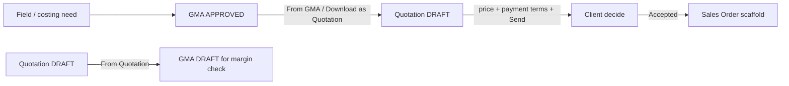
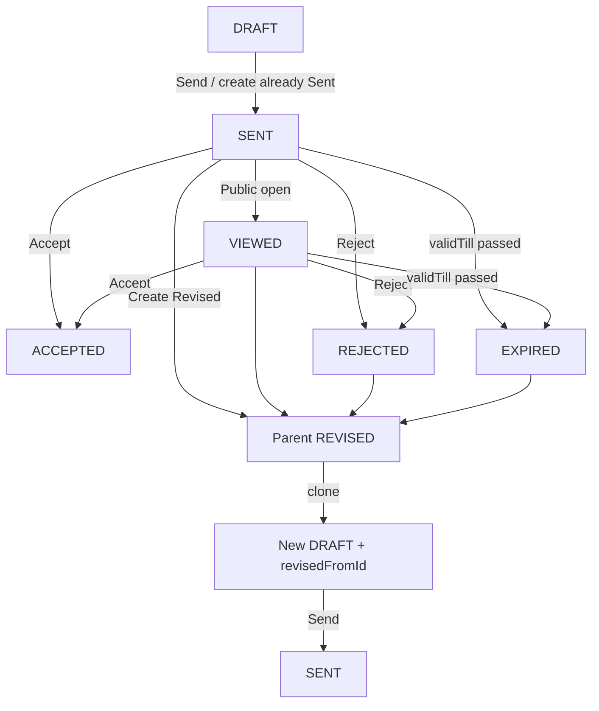
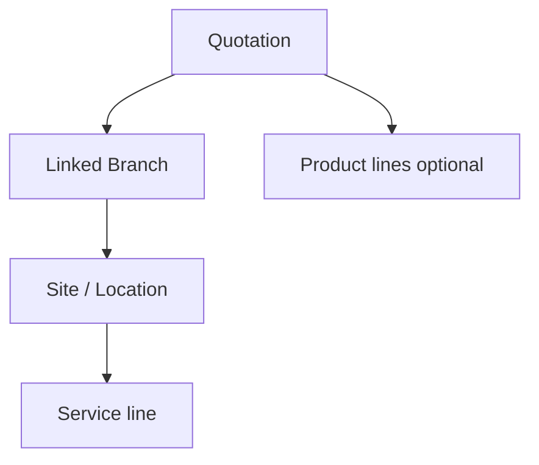
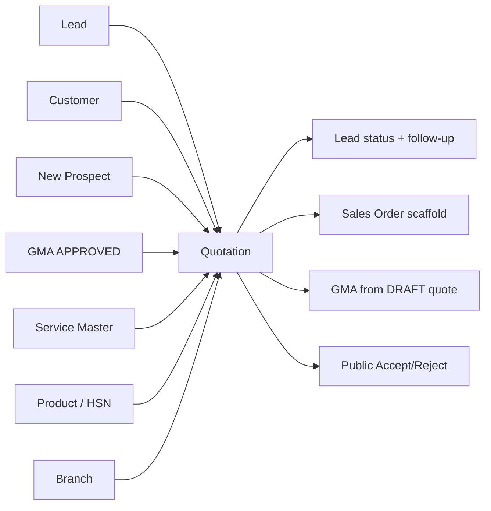

# Quotation Management — Deep Product & Business Guide

> **Module:** CRM → Quotation Management  
> **Audience:** Product, sales ops, QA, and engineers onboarding to Seravion Connect  
> **Related:** [`gma-management.md`](./gma-management.md), [`leads-follow-up-management.md`](./leads-follow-up-management.md), [`service-management.md`](./service-management.md), [`product-management.md`](./product-management.md)

This document explains **what Quotation is for**, **every way to create and work a quotation**, **how pricing and visits really work**, **how GMA and Quotation sync**, and **what happens after Send / Accept**. It is written from live product behaviour (frontend + backend), not marketing stubs.

---

## 1. Purpose — why Quotation exists

Pest-control and product sales need a **client-facing commercial offer**: which branches and sites, which services (with visit pattern), optional products and tax, how long the offer is valid, and **how payment will work**.

**Quotation Management** is that offer. It is **not** a margin worksheet. Gross margin, chemicals, manpower hours, and documentation costs live on **GMA (Gross Margin Analysis)**. Quotation is the commercial twin: rates, visits, line totals, payment terms, PDF, and client Accept / Reject.

### 1.1 Business outcomes

| Outcome | What the product does |
|---------|------------------------|
| Build an offer | Draft from Lead, Customer, New Prospect, or Approved GMA |
| Price correctly | Service Master FIXED / AREA_BASED / INSPECTION + visit math |
| Contract AMC | Contract mode with billing frequency, duration, proposed start |
| Sell products | Product / Combined lines with HSN GST |
| Set commercial terms | Valid till, payment terms, special terms, internal notes |
| Deliver the offer | Send / Resend email + PDF + public token link |
| Close the deal | Staff or client Accept / Reject; revise and re-offer |
| Feed operations | Accepted quotes can scaffold **Sales Order**; From-Lead updates lead status |

### 1.2 What Quotation is **not**

- A **GMA / margin** sheet (no GM%, chemicals, manpower costing on the quote form)
- An **internal approval inbox** (Accept/Reject are commercial decisions, not RBAC Approve)
- A finished **convert-to-contract** journey (flags exist; full convert flow is incomplete)
- Automatic geo-assignment of branch from pincode (Linked Branch is explicit)

### 1.3 Quotation vs GMA (one business coin, two faces)

| Concern | Quotation | GMA |
|---------|-----------|-----|
| Purpose | Client commercial offer | Costing / margin sheet |
| Payment terms | Yes | No |
| Margins / chemicals / manpower | No | Yes |
| Hierarchy | Branch → Site → Service (commercial) | Same tree + cost blocks |
| From the other module | From **APPROVED** GMA | From **DRAFT** Quotation only (pre-Send margin check) |

---

## 2. Users & access

### 2.1 Who uses it

| Actor | Why |
|-------|-----|
| Company CEO / Owner | Full commercial control |
| Sales / CRM staff | Create, edit drafts, send, PDF, revise |
| Client (external) | Opens public token link; Accept / Reject |
| Sales Order users | Pick Accepted quotations to scaffold orders |
| Lead operators | Create Quotation from qualified pipeline |

### 2.2 RBAC (UI)

Platform module: **Quotation Management**.

| Permission | UI use |
|------------|--------|
| **Read** | List, view, open routes |
| **Add** | Create / Save Draft / Send (create path) |
| **Edit** | Edit draft |
| **Delete** | **Delete** button on **DRAFT** quotations only (reason required) |
| **Export / Download** | PDF |

**Request / Approve** appear in the catalog but are **not** used for quotation workflows.

**Important:** Quotation APIs today do **not** enforce module authorities as strictly as Invoice / Sales Order. The **UI** gates buttons; CEO bypass applies in UI. Treat API hardening as a known gap.

**Record rule:** Only **DRAFT** quotations can be fully edited or **deleted**. After Send, change commercial content via **Create Revised Quotation** (new draft). Sent / Viewed / Accepted / Rejected / Expired / Revised quotations cannot be deleted.

---

## 3. Status lifecycle (deep)

### 3.1 Statuses

| Status | Meaning |
|--------|---------|
| **DRAFT** | Editable; not yet offered |
| **SENT** | Email/PDF/token issued |
| **VIEWED** | Client opened public link (from SENT) |
| **ACCEPTED** | Commercial yes (staff or client) |
| **REJECTED** | Commercial no |
| **EXPIRED** | `validTill` passed while SENT/VIEWED (scheduler, Asia/Kolkata) |
| **REVISED** | Parent marked when a new draft is cloned for renegotiation |

### 3.2 Transitions

| Action | Allowed from | Result |
|--------|--------------|--------|
| Edit | DRAFT only | Update draft |
| Delete | DRAFT only | Delete draft (reason required); disappears from quotation list |
| Send | DRAFT | → SENT, token, email PDF |
| Resend | SENT / VIEWED (blocked for DRAFT / ACCEPTED / REJECTED / EXPIRED) | Re-email |
| Accept / Reject | SENT / VIEWED | Terminal commercial status |
| Create Revised | SENT / VIEWED / REJECTED / EXPIRED (not DRAFT, not ACCEPTED) | New DRAFT; parent → REVISED |
| Expire | SENT / VIEWED past valid till | EXPIRED |

### 3.3 From Lead — lead + follow-up sync

Only when `sourceType = FROM_LEAD`. Never overwrites lead **Converted** or **Lost**.

| Quotation event | Lead status | System follow-up |
|-----------------|-------------|------------------|
| Send | Quotation Sent | Quotation {QT} sent |
| Reject | Negotiation | Quotation {QT} rejected |
| Create Revised | Negotiation | Revised quotation {new} from {old} |
| Accept | Converted | Quotation {QT} accepted |

---

## 4. Every way to **make** a quotation

There are **four commercial sources**, plus **revise**, plus **GMA download**. Each path is explained end-to-end.

### 4.1 Path A — From Lead

**When to use:** Pipeline lead is ready for a commercial offer (typically Qualified / Quotation Sent / Negotiation).

**UI entry points**
1. Quotation list → **+ Create Quotation** → Source **From Lead** → pick lead  
2. **Lead View** → Create Quotation (deep-link with `leadId`)

**API:** `POST /api/v1/quotations` with `sourceType=FROM_LEAD`, `leadId`

**What prefills**
- Contact person, phone, email (read-only display)
- First site may inherit address / city / state / pincode / map / branch from lead when empty
- Quotation type may follow lead type when available

**Validation (non-draft / send)**
- Lead must exist; source XOR (no customer / prospect / gmaSheetId together)
- Lead dropdown is scoped to allowed pipeline statuses and user’s branches

**Then:** Configure type / mode / Branch→Site→Service / products / terms → **Save as Draft** or **Send**.

**Finally:** On Send, lead → Quotation Sent + follow-up.

---

### 4.2 Path B — From Customer

**When to use:** Offer to an existing customer account (renewal, upsell, additional site).

**UI:** Create Quotation → **From Customer** → search customer.

**API:** `POST /api/v1/quotations` with `sourceType=FROM_CUSTOMER`, `customerId`

**What prefills**
- Contact + billing-style address into display / first site when empty

**Caveat:** Backend customer name/email enrichment on some send paths is still incomplete (stubbed email possible). Prefer verifying client block on View / PDF before Send.

---

### 4.3 Path C — Add New (New Prospect)

**When to use:** Walk-in / cold offer with no lead or customer master row yet.

**UI:** Create Quotation → **Add New** → enter Full Name, Phone, Email, Address, City, State, Pincode, Country, etc.

**API:** `POST /api/v1/quotations` with `sourceType=NEW_PROSPECT` + nested `prospect`

**Deep rule — prospect persistence**
- On **full Send / non-draft create**, prospect is stored on the quotation.
- On **Save as Draft**, source/send validation is relaxed; prospect row may **not** be fully persisted until a later non-draft save. Do not assume draft-only prospect data is durable like Lead/Customer links.

---

### 4.4 Path D — From GMA (Approved sheet → commercial draft)

**When to use:** Margin sheet is APPROVED; sales need a client quote whose **service totals match Site Proposed Price**, without chemicals / GM on the quote.

**UI entry points**
1. Create Quotation → **From GMA** → pick Approved GMA → system **immediately** creates (or reuses) a DRAFT and navigates to **Edit Quotation**  
2. GMA screens → **Download as Quotation** (creates/reuses draft + Quotation PDF)

**API**
- `POST /api/v1/quotations/from-gma/{gmaSheetId}` — idempotent for existing **DRAFT** of that GMA  
- `GET /api/v1/quotations/from-gma/{gmaSheetId}/pdf` or GMA `…/quotation-pdf`

**Hard gates**
- GMA must be **APPROVED** and not deleted  
- GMA must have a real **Linked Branch** (no invented default branch)  
- Reuses existing DRAFT for same `gmaSheetId` instead of duplicating

**What copies into Quotation**

| Copied | Not copied |
|--------|------------|
| Branch → Site → Service commercial tree | Chemicals / manpower / hours |
| Address, city, state, country, **pincode**, map, category, sub-category, area | GM%, documentation costs |
| Rate per visit + total visits (then **scaled**) | Payment terms from GMA (quote defaults **NET_30**, valid till **+30 days**) |
| Contract mode/duration/start when GMA services are CONTRACT | Product lines |
| `gmaSheetId` as source | GMA lead/customer as XOR source (only GMA id) |

**Rate scaling (critical behaviour)**  
For each site, service line rates are scaled so:

\[
\sum(\text{ratePerVisit} \times \text{totalVisits}) = \text{siteProposedPriceYear}
\]

Relative weights of lines are preserved; the last line absorbs rounding. If proposed price ≤ 0 or base sum ≤ 0, scaling is a no-op.

**Edit hydrate (From GMA)**
- Source type = From GMA; dropdown shows selected GMA (`gmaSheetId` + client name) and is **locked** on edit  
- Contact Person / Phone / Email filled from resolved GMA client  
- Service cards load Service Master price type (FIXED / AREA / INSPECTION) for UI, but **keep commercial scaled rates** until sales changes a tier/area

**Defaults on create-from-GMA**
- Quotation type: **SERVICE**  
- `validTill`: +30 days  
- `paymentTerms`: NET_30  
- If any GMA service is CONTRACT → quote Contract mode (duration from sheet; contract frequency often forced Monthly)

---

### 4.5 Path E — Create Revised Quotation

**When to use:** Client rejected, expired, or negotiation after Send — need a **new** offer number, not an in-place edit of SENT.

**UI:** View Quotation → **Create Revised Quotation**

**API:** `POST /api/v1/quotations/{id}/revise`

**Result**
- Parent → **REVISED**  
- New **DRAFT** with new quotation number and `revisedFromId` = parent  
- Commercial payload cloned for edit / Send  
- From Lead: lead → Negotiation + follow-up

---

### 4.6 Path F — Save Draft vs Send on Add/Edit

| Action | Behaviour |
|--------|-----------|
| **Save as Draft** | `saveDraft=true`; relaxed required fields; status DRAFT; incomplete offers allowed |
| **Send** (from Add create) | Full source + send validation; SENT + token + email |
| **Send** (from existing DRAFT) | `POST /{id}/send` — moves to SENT; known gap: may not re-run full `validateForSend` in all cases |
| **Resend** | Re-email only; does not rewrite commercial body |

---

## 5. Quotation configuration (type, mode, contract)

### 5.1 Quotation type

| Type | Services | Products | Send expectation |
|------|----------|----------|------------------|
| **SERVICE** | Yes | No | At least one Branch→Site→Service |
| **PRODUCT** | No | Yes | Locations optional |
| **COMBINED** | Yes | Yes | At least one service and one product in UI |

### 5.2 Service mode

| Mode | Meaning |
|------|---------|
| **One-Time** | Single engagement; no AMC contract block |
| **Contract (AMC)** | Requires Contract Frequency, Duration, Proposed Start |

### 5.3 Two frequency layers (do not confuse)

| Layer | Where | Purpose |
|-------|-------|---------|
| **Contract frequency** | Header (AMC only) | Billing / contract cadence: Monthly / Quarterly / Half Yearly / Yearly |
| **Visit frequency** | Each service line | How often technicians visit: Single / Weekly / Fortnightly / Monthly / Quarterly / Custom (+ legacy Half Yearly / Yearly on hydrate) |

**Contract duration:** Six months / One year / Two years / Three years — also feeds visit-count math for service lines.

### 5.4 Visit math (how totals are derived)

Frontend derives `totalVisits` from frequency + mode + contract duration:

| Visit frequency | Annual baseline (one year) |
|-----------------|----------------------------|
| Single / One-time | 1 |
| Weekly | 52 |
| Fortnightly | 26 |
| Monthly | 12 |
| Quarterly | 4 |
| Half Yearly | 2 |
| Yearly | 1 |
| Custom | User-entered total |

- **One-time line** → force Single, `totalVisits = 1`  
- **Contract** → scale annual baseline by contract months:  
  `totalVisits ≈ round((annual/12) × contractMonths)`  
- **Visits/Month** is a **UI helper** that updates `totalVisits`; it is **not** a separate DB column  
- **Line total (commercial)** ≈ `ratePerVisit × totalVisits`

---

## 6. Branch → Site → Service (Cost Breakdown)

Quotation Cost Breakdown mirrors GMA’s tree but **commercial only**.

### 6.1 Linked Branch

1. **Add Branch** → choose **Linked Branch** (from current user’s branches)  
2. If the user has exactly one branch, UI may auto-bind it  
3. Sites inherit the parent branch id  
4. From GMA: branch comes from GMA sheet / site branch — missing branch fails create  

There is **no** automatic “pincode decides branch” logic.

### 6.2 Site fields

| Field | Notes |
|-------|-------|
| Site name | Display on PDF site block |
| Address | Min length enforced on send |
| City / State / Country | Cascading selects; country often India |
| **Pincode** | Optional 6-digit when entered; From GMA copies site pincode (fallback prospect pincode) |
| Google Map URL | Optional |
| Category / Sub-category | Drives which services appear (e.g. Commercial / Internal) |
| Area (sqft) | Site reference; also used for AREA_BASED service math when applicable |

### 6.3 Service Configuration card (per service)

Under each site: **Service Configuration** cards (collapsible), similar layout to GMA but **without** chemicals / manpower / GM.

Typical fields:
- Service Type (from catalog after category/sub-category)
- Service Mode (Contract / One-Time) per line
- Frequency, Total Visits / Custom, Visits/Month
- Pest Type (from service master, display)
- **Service line pricing** table (depends on price type)

Labels use commercial language: **Rate per Visit**, **Total Visits**, **Line Total**, **Per Month** (not GMA “Cost/Year” costing language).

---

## 7. Service Master pricing — FIXED, AREA_BASED, INSPECTION

Quotations reuse **Service Management** catalogs. When a service is selected (or hydrated from GMA), the quote loads that service’s **price type** and master options.

### 7.1 FIXED

| UI | Storage | Amount |
|----|---------|--------|
| **Select Tier** (or single tier label) | `categoryFixedId` / tier name, `ratePerVisit` | `rate × totalVisits` |

Sales can still override rate manually after picking a tier.

### 7.2 AREA_BASED

| UI | Storage | Amount |
|----|---------|--------|
| Area Rate Selection, Base Price, Area (SQFT), computed Rate | `categoryAreaPricingId`, `areaSqftUsed`, base / per-sqft / increment snapshots | Rate from area formula (ceil rupee rules on backend when enrichers apply), then `rate × visits` |

Changing area recalculates rate from the selected area option.

### 7.3 INSPECTION

| UI | Storage | Amount |
|----|---------|--------|
| **Inspection Fee** select (tier list) | `categoryInspectionId`, `ratePerVisit` | `rate × totalVisits` |

### 7.4 From GMA + Service Master together

1. Create-from-GMA stores lines as commercial rates (often as FIXED in DB) with visits from GMA, then **scales** to proposed price.  
2. On Edit hydrate, UI reloads Service Master price type / tiers / area options for a **wise** editor experience.  
3. **Scaled commercial rate is preserved** — selecting a master tier later will overwrite rate if the user chooses a new tier intentionally.

### 7.5 Pricing Summary (quote footer)

| Component | Meaning |
|-----------|---------|
| Services subtotal | Sum of service line totals |
| Products subtotal | Sum of product line totals (incl. line tax where applicable) |
| **Apply GST on services** (optional) | Quote-level GST on services subtotal only |
| GST Type | INTRA (CGST+SGST 50/50) or INTER (IGST) |
| Tax selection | Tax master components → combined % |
| Discount | Percentage (capped) or flat |
| Grand total | After tax and discount |

Product lines always use **HSN / product taxes** when HSN exists. Service GST is **opt-in** and separate from product HSN tax.

---

## 8. Product lines

For **Product** or **Combined**:

1. Pick inventory product (dropdown)  
2. Quantity + unit price (defaults from selling/base price)  
3. HSN, UOM, CGST/SGST/IGST from product/HSN master  
4. Line total = taxable amount + tax  

Attachments and notes do not change tax math.

---

## 9. Terms, attachments, PDF

### 9.1 Commercial terms

| Field | Rules |
|-------|-------|
| Valid till | Required; create often defaults ~+15 days; From GMA +30 |
| Payment terms | Full Advance / 50–50 / Net 15 / Net 30 / Custom |
| Custom payment text | Required on send when Custom (≥10 chars) |
| Special terms | Optional, length-capped |
| Internal notes | Staff only — **not** on client PDF |

### 9.2 Attachments

- Max **5** files  
- Typical types: PDF, JPEG, PNG, DOC, DOCX  
- Size limit ~5MB each  
- Via create payload or `POST /{id}/attachments`

### 9.3 Client PDF (commercial layout)

1. Company header + proposal title/date + client “To”  
2. Meta: Quotation No, Valid Till, Service Mode, Payment Terms  
3. Marketing intro / bullets  
4. Services included (only services on this quote)  
5. **Site-wise commercial proposal** — address/category + table: Service, Pest Type, Frequency, Visits, Rate/Visit, Amount  
6. Products (if any) + Pricing Summary  
7. Signatory + Terms (incl. custom payment / special terms)

Staff PDF: `GET /api/v1/quotations/{id}/pdf`.

---

## 10. Client decision & public link

1. On Send, system issues `publicToken` and emails PDF (email failure does not roll back SENT).  
2. Client opens `GET /api/v1/quotations/public/{id}?token=` → may move SENT → VIEWED.  
3. Client Accept / Reject: `POST …/public/{id}/decision`.  
4. Staff can also Accept / Reject on **View Quotation** (Sent/Viewed) via status API.

Public payload is slim (identity, status, totals, canAccept/Reject flags) — not a full edit form.

---

## 11. Lists, screens, and controls

### 11.1 List — Quotation Management

**Route:** `/Quotation-Management`

| Column | Notes |
|--------|-------|
| Quotation No | Business number |
| Source | Lead / Customer / Prospect / GMA |
| Client Name | Resolved display name |
| Quotation Type | Service / Product / Combined |
| Branch | From locations |
| Total Amount | Grand total |
| Status | Badge |
| Valid Till | Date |
| Created Date & Time / Created By | Audit |

**Filters:** Status, Quotation Type, Branch (if multi-branch), Created date range, Amount range, Source Type (Lead / Customer / Prospect — **FROM_GMA may be missing from filter chips**). Search by quotation id / client. Page size 10.

**Row actions:** View; Edit (**DRAFT** only); PDF; **Delete** (**DRAFT** only, reason required). List does **not** expose Send/Resend/Accept (those live on Add/View).

### 11.2 Add / Edit

**Routes:** `/Add-Quotation`, `/Add-Quotation/:id`, `/edit-quotation/:id`

Same form. Edit only while DRAFT. From GMA selection on create redirects into Edit after draft creation.

### 11.3 View

**Routes:** `/view-quotation`, `/view-quotation/:id`

Timeline, client block, configuration, services/products, pricing, terms, attachments, audit. Actions: Close, PDF, Send (draft), Resend, Accept/Reject, Create Revised, Edit (draft).

---

## 12. Cross-module map

| Module | Interaction |
|--------|-------------|
| **Lead** | From Lead; Create from Lead View; send/reject/revise/accept sync |
| **Customer** | From Customer |
| **Service Management** | Catalog + FIXED / AREA / INSPECTION |
| **Product / Stock** | Product lines + HSN GST |
| **Branch** | Linked Branch on Cost Breakdown |
| **GMA** | Bidirectional commercial sync (see §4.4 and §13) |
| **Sales Order** | Eligible **Accepted** quotes; scaffold by quotation id |
| **Contract** | Conceptual convert flag; journey incomplete |
| **Invoice** | No direct quotation sync |

### 12.1 Sales Order handoff

- Eligible: status **ACCEPTED**, not deleted, `salesOrderConsumed=false`  
- APIs: `GET /api/v1/sales-orders/eligible-quotations`, `GET /api/v1/sales-orders/scaffold/quotation?quotationId=`  
- Field-for-field SO mapping is owned by Sales Order module; payment/frequency may not copy 1:1.

---

## 13. GMA ↔ Quotation sync (both directions, precise)

### 13.1 From GMA → Quotation

| Item | Rule |
|------|------|
| Gate | GMA **APPROVED** |
| Idempotency | Reuse existing Quotation **DRAFT** for same `gmaSheetId` |
| Money | Scale service rates to **siteProposedPriceYear** |
| Source | `FROM_GMA` + `gmaSheetId` only |
| After | Edit terms / payment / Send as normal quotation |

### 13.2 From Quotation → GMA

| Item | Rule |
|------|------|
| API | `POST /api/v1/gma/sheets/from-quotation/{quotationId}` |
| Gate | Quotation must be **DRAFT** (margin check **before** Send) — **not** Accepted |
| Copies | Branch/site/services rates & visits; proposed price from service subtotals |
| Does not copy | Payment terms, products, service GST, chemicals (empty for fill) |
| Idempotency | Reuse existing GMA DRAFT for that quotation when present |

> Older docs saying “From Quotation = ACCEPTED only” are **wrong** relative to current code.

---

## 14. Validations & constraints (checklist)

**Draft save**
- Relaxed required set; attachments still max 5  
- Incomplete Branch/Site/Service allowed  

**Send / non-draft**
- Source XOR consistent (lead **or** customer **or** prospect **or** gmaSheetId)  
- SERVICE/COMBINED: locations + service lines as required  
- CONTRACT: frequency, duration, proposed start  
- Payment terms required; Custom needs text  
- Valid till required  
- FIXED: tier id or name; INSPECTION: id or positive rate  
- Address/city length rules on locations  

**Lifecycle**
- Edit: **DRAFT only**  
- Delete: **DRAFT only** (reason required; draft leaves the quotation list). Non-draft statuses cannot be deleted.  
- Accept/Reject: SENT/VIEWED  
- Revise: SENT/VIEWED/REJECTED/EXPIRED  

**Line math**
- Commercial line ≈ rate × totalVisits  
- Area-based may recompute rate from sqft rules  

---

## 15. End-to-end scenarios (playbooks)

### Scenario 1 — AMC offer from a Qualified Lead

1. Lead View (Qualified+) → Create Quotation → From Lead.  
2. Type Service or Combined; Mode **Contract**; set Contract Frequency / Duration / Start.  
3. Add Branch → Linked Branch → Add Site(s) → categories → services.  
4. For each service: pick FIXED / Area / Inspection inputs; set visit frequency; confirm line totals.  
5. Optional products + Apply GST on services.  
6. Valid till + Payment terms (+ custom text if needed).  
7. **Send** → client email; lead → Quotation Sent.  
8. Client Accept → lead Converted; quote eligible for Sales Order.

### Scenario 2 — One-time product + service combo for a Customer

1. From Customer → Combined → One-Time.  
2. One site, one-time services (Single visit), plus product lines.  
3. Draft or Send; no contract block.

### Scenario 3 — Approved GMA → Quotation → Send

1. Approve GMA (Linked Branch + site proposed prices set).  
2. Quotation → From GMA → select sheet (or GMA Download as Quotation).  
3. Land on Edit: GMA selected, client name shown, Branch→Site→Service filled, rates scaled to proposed.  
4. Review Service Master pricing UI; adjust only if commercial negotiation needs it.  
5. Set payment terms / special terms → Send.

### Scenario 4 — Draft quote → GMA margin check → back to quote

1. Build Quotation as **DRAFT** (do not Send yet).  
2. Create GMA **From Quotation** (DRAFT gate).  
3. Complete chemicals / manpower / GM on GMA; Approve.  
4. Optionally create/refresh Quotation From GMA for commercial send.  
5. Send quotation when commercial terms are ready.

### Scenario 5 — Rejected offer → Revised Quotation

1. View Sent/Viewed/Rejected/Expired quote → Create Revised.  
2. Parent becomes REVISED; edit new DRAFT; Send again.  
3. From Lead: Negotiation + follow-up.

### Scenario 6 — Delete a DRAFT quotation

1. Quotation list → **Delete** on a **DRAFT** row only.  
2. Choose deletion reason (if **Other**, enter detail) → confirm.  
3. Draft is deleted and no longer appears in the list.  
4. Sent / Viewed / Accepted / Rejected / Expired / Revised quotations have **no Delete** action.

---

## 16. Data the business cares about

### Header
Quotation number, status, source type, lead/customer/gma/prospect, type, mode, contract fields, subtotals, tax, discount, grand total, valid till, payment terms, special/internal notes, public token, revise link, deletion reason (when a **DRAFT** was deleted), timestamps (sent/viewed/accepted/rejected/expired).

### Per site
Site name, address block, pincode, map, category/sub-category, area, **branchId**, nested services.

### Per service line
Service id/name/code, price type, tier/area/inspection refs, rate per visit, visit frequency, total visits, line total, display order.

### Per product line
Product, HSN, qty, unit price, tax splits, line total.

---

## 17. Known gaps & limitations (honest)

1. **API RBAC** weaker than Invoice/SO — UI gates primarily.  
2. **Send from existing draft** may skip full send validation in some paths.  
3. **NEW_PROSPECT** on draft-only save may not persist prospect fully.  
4. **Customer enrich** on backend incomplete on some paths.  
5. **List filter** may omit FROM_GMA; source pill labels can mismatch.  
6. **List** has no Send/Resend/Accept row actions.  
7. **Convert to contract** incomplete.  
8. **No margin fields** on Quotation — intentional vs GMA.  
9. Some dead/unwired UI (dashboard variants, unused modals).  
10. Public client experience depends on token APIs; dedicated public React page may be limited in this package.

---

## 18. API & screen reference

### 18.1 Core APIs

| Method | Path | Purpose |
|--------|------|---------|
| GET | `/api/v1/quotations` | Paginated list |
| POST | `/api/v1/quotations` | Create draft or send |
| PUT | `/api/v1/quotations/{id}` | Update draft |
| GET | `/api/v1/quotations/by-id?id=` | Detail |
| DELETE | `/api/v1/quotations?id=` | **Delete DRAFT only** (reason required). Non-draft → rejected |
| POST | `/api/v1/quotations/{id}/send` | Send |
| POST | `/api/v1/quotations/{id}/resend` | Resend |
| GET | `/api/v1/quotations/{id}/pdf` | Staff PDF |
| POST | `/api/v1/quotations/{id}/attachments` | Upload |
| PATCH | `/api/v1/quotations/{id}/status?status=` | Staff Accept/Reject |
| POST | `/api/v1/quotations/{id}/revise` | Clone revised draft |
| POST | `/api/v1/quotations/from-gma/{gmaSheetId}` | Create/reuse from GMA |
| GET | `/api/v1/quotations/from-gma/{gmaSheetId}/pdf` | PDF via from-GMA |
| GET | `/api/v1/quotations/dropdowns/leads` | Lead picker |
| GET | `/api/v1/quotations/public/{id}?token=` | Public view |
| POST | `/api/v1/quotations/public/{id}/decision` | Client decision |

**Related:** `POST /api/v1/gma/sheets/from-quotation/{quotationId}`, GMA quotation-pdf, Sales Order eligible/scaffold endpoints.

### 18.2 Frontend routes

| Route | Purpose |
|-------|---------|
| `/Quotation-Management` | List |
| `/Add-Quotation` | Create |
| `/Add-Quotation/:id` / `/edit-quotation/:id` | Edit draft |
| `/view-quotation` / `/view-quotation/:id` | View |

---

## 19. Functionality summary

**Available today**
- Four create sources: Lead, Customer, New Prospect, From GMA  
- Revise flow; **Delete** for **DRAFT** quotations only (reason required)  
- Branch → Site → Service commercial tree + Linked Branch + pincode  
- Service Master FIXED / AREA_BASED / INSPECTION with visit math  
- Product HSN GST + optional service GST  
- Payment terms, validity, special/internal notes, attachments  
- Send / Resend / PDF / public Accept-Reject  
- Lead status + follow-up sync  
- GMA ↔ Quotation commercial sync (APPROVED→Quote; DRAFT Quote→GMA)  
- Sales Order from Accepted  

**Not available / incomplete**
- Margin entry on Quotation  
- Internal approve inbox for quotes  
- Full convert-to-contract journey  
- Perfect API-level RBAC parity with finance modules  

---

*Document refreshed against Seravion Connect Quotation + GMA sync behaviour (including From-GMA rate scaling to site proposed price, DRAFT-only From-Quotation GMA, and Service Master pricing on the quote form).*
