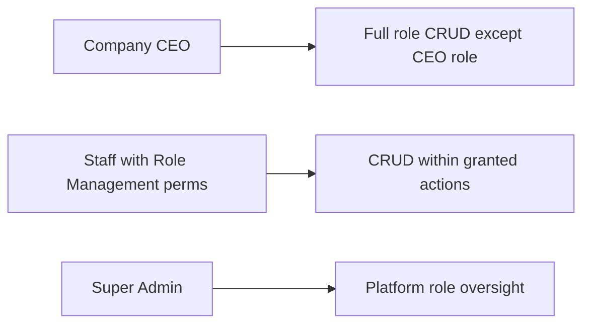
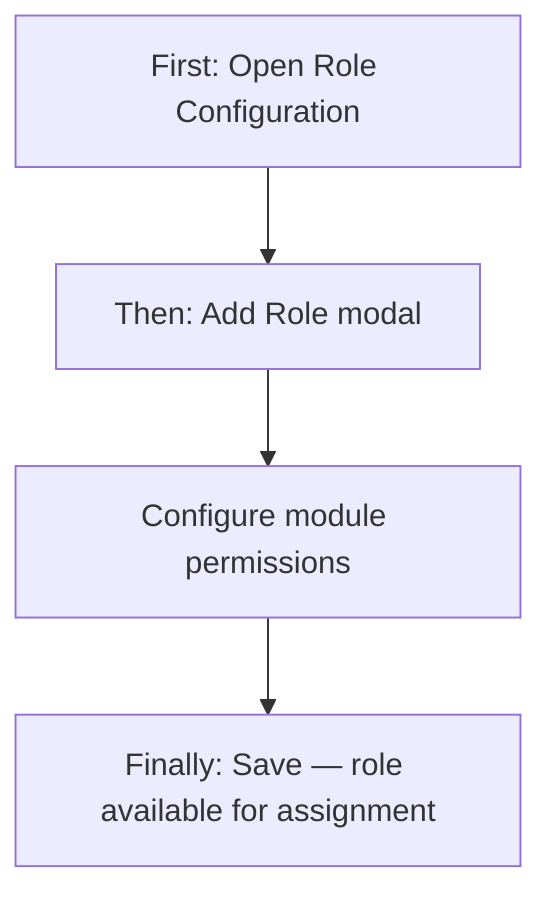
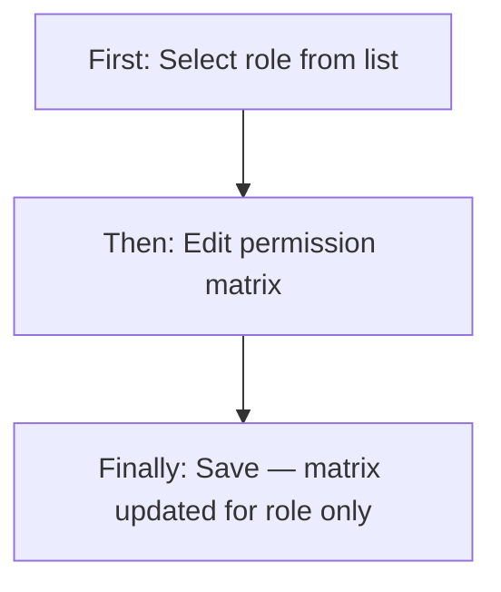
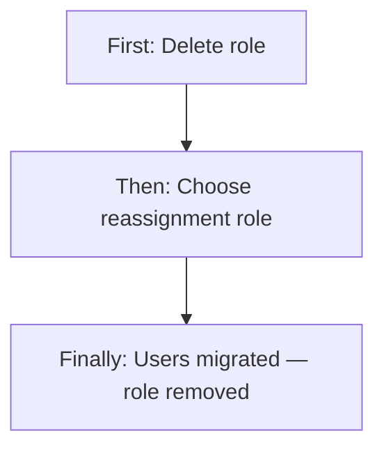
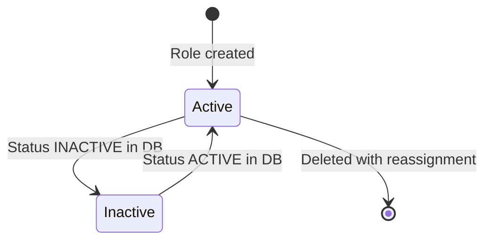

# Role Configuration (RBAC) — Product & Business Documentation

## 1. Purpose & Business Need

Every company using Seravion Connect needs a controlled way to define **who can access which parts of the system** and **what actions they may perform** (view, add, edit, delete, export, submit requests, approve requests). Role Configuration is the administrative area where company leaders and authorized staff **create job roles**, **assign a module-by-module permission matrix**, and **maintain those roles over time**.

A role is not just a label — it is a reusable access profile. When an employee is created or updated elsewhere in the product, their role and individual permission overrides are applied from this configuration. Roles can also be marked as **Application User** roles, which skip web module permissions and are intended for mobile-only users.

**Outcomes today:** company-specific roles with fine-grained module permissions; standard Seravion role templates available when creating new roles; safe role deletion with user reassignment; analytics showing role usage; platform Super Admin can manage roles across tenants from a separate screen.

**Related module — not the same screen:** **Salary & Leave Configuration** (`/salary-leave-config`) defines pay and leave **policy per role** (RSL Management permissions). Routes named `*-role-configuration` under Salary & Leave are **not** this RBAC screen. See [`salary-leave-configuration.md`](./salary-leave-configuration.md).

---

## 2. Users & Roles (who uses this and why)

### 2.1 Company CEO / Owner

Has full access to role management without needing explicit Role Management permissions. Can create, view, edit, and delete roles (except the built-in CEO role). Uses this area to shape how managers, accountants, technicians, and other staff interact with the ERP.

### 2.2 Authorized company staff (Role Management permissions)

Employees granted **Role Management** permissions (Read, Add, Edit, and/or Delete) can perform only the actions their matrix allows. A user with Read-only access can view roles and permission details but cannot change them.

### 2.3 Seravion Super Admin

Uses a separate **Role Management** screen under the Super Admin area. This is for platform-level role oversight and analytics. Super Admin access is based on login role, not the tenant permission matrix.

---

## 3. Access Control (RBAC)

### 3.1 How access works

Access to Role Configuration is determined by the logged-in user’s **role** and **module permissions**:

- **CEO** bypasses granular checks and may perform all role operations (except deleting the CEO role).
- **Super Admin** bypasses tenant module checks on the Super Admin role screen.
- **Other employees** need explicit **Role Management** permissions:
  - **Read** — open the screen, view role list and details
  - **Add** — create new roles
  - **Edit** — update role description, application-user flag, and permission matrix
  - **Delete** — remove a role (with mandatory reassignment when users are assigned)

The sidebar menu item **Role Configuration** appears only when the user has Role Management **Read** access (or CEO / Super Admin bypass).

### 3.2 Role × action matrix (Role Management module)

| Role | View list | View detail | Add | Edit | Inactive / Delete | Submit request | Receive / act | Approve | Reject |
|------|-----------|-------------|-----|------|-------------------|----------------|---------------|---------|--------|
| Company CEO | Yes | Yes | Yes | Yes | Yes (not CEO role) | No | No | No | No |
| Staff with Role Management Read | Yes | Yes | No | No | No | No | No | No | No |
| Staff with Role Management Add | Yes | Yes | Yes | No | No | No | No | No | No |
| Staff with Role Management Edit | Yes | Yes | No | Yes | No | No | No | No | No |
| Staff with Role Management Delete | Yes | Yes | No | No | Yes (not CEO role) | No | No | No | No |
| Super Admin (platform screen) | Yes | Yes | Yes | Yes | Yes (not "Super Admin" role by name) | No | No | No | No |

**Record-level rules:**
- The **CEO** role cannot be deleted.
- On the Super Admin screen, a role named **Super Admin** cannot be edited or deleted from the UI.
- Inactive roles are excluded from role dropdowns used elsewhere (e.g., employee assignment, request receivers).

**Note:** Role Configuration itself does **not** use submit/approve workflows. Request and Approve actions configured **inside** a role’s permission matrix apply to **other modules** (e.g., Stock, Petty Cash, HRM), not to approving role changes.

---

## 4. Capabilities & Features

### 4.1 Role list and analytics

The main screen shows summary statistics (total roles, active roles, permission counts) and a card list of all roles. Each card shows role name, description, status badge, and action buttons. Users can search by role name or description and filter by **Active** or **Inactive** status (client-side on the loaded list).

### 4.2 Create role

Users with Add access open a modal to define a new role. They may:
- Pick a **standard Seravion role template** (pre-fills permissions from the platform catalog) or start with a **custom empty profile**
- Enter role name and description
- Mark the role as an **Application User** role (skips web permission matrix)
- Configure the **module permission matrix** (unless Application User)
- Set status to Active or Inactive in the form (see gaps — backend always creates as Active today)

### 4.3 View and edit role

View mode opens the same modal in read-only form. Edit mode allows changing description, Application User flag, status selection, and the full permission matrix. Role name is editable in the form on edit, but the system does not persist name changes on update (see gaps).

### 4.4 Permission matrix

For each system module (e.g., Branch Management, Employee User Management, Stock Management), the administrator toggles actions:

- **Read, Add, Edit, Delete, Export, Download** — standard access toggles
- **Request** — allows submitting requests in that module; requires selecting **receiver roles** (who receives the request)
- **Approve** — allows approving incoming requests in that module

The matrix enforces dependencies: enabling Add/Edit/Delete/Export typically requires Read to be enabled first; disabling Read clears dependent actions.

Request and Approve toggles are only enabled for modules that support workflows (Employee Management, Stock, GMA, HRM, Petty Cash, and related labels).

### 4.5 Delete role with reassignment

Deleting a role requires choosing another active role to **reassign all employees** currently on the deleted role. The system copies the target role’s permission matrix onto each reassigned employee. The CEO role cannot be deleted. If no employees use the role, reassignment is still required by the delete dialog today.

### 4.6 Application User roles

When **Is Application User** is checked, the permission matrix is hidden. These roles are intended for mobile app users who do not need web module access. Employee creation flows can filter to Application User roles only.

### 4.7 Platform vs tenant roles

- **Tenant Role Configuration** (`/role-configuration`) manages roles inside the company’s own account.
- **Super Admin Role Management** (`/seravionadmin/role-management`) is a platform view with similar UI but without tenant module permission checks.
- **Public role templates** and **public role permissions** are used only when creating a new role from a standard template — they do not replace tenant roles for day-to-day operations.

---

## 5. CRUD Operations

### 5.1 Create (Add)

**Who:** CEO, or staff with Role Management **Add**.

**First:** User opens Role Configuration and clicks **Add Role**.

**Then:** User completes the modal — name, description, optional Application User flag, and permission matrix (or selects a standard template to pre-fill permissions). For each module where **Request** is enabled, at least one receiver role must be selected.

**Finally:** On save, the new role is created as **Active** with the configured matrix stored. The list refreshes and the role becomes available in employee and dropdown flows.

### 5.2 Read — List

**Who:** Anyone with Role Management **Read** (or CEO / Super Admin).

The list loads all roles (preferring analytics data when available, which includes user counts per role). Cards show name, description, and status. Search and status filters apply on the client side. There is **no pagination** — all roles load at once.

### 5.3 Read — Detail / Get details

**Who:** Same as list.

**First:** User clicks the **View** (eye) icon on a role card.

**Then:** A modal opens and loads full role detail including the permission matrix (unless Application User).

**Finally:** User reviews permissions in read-only mode and closes the modal.

### 5.4 Update (Edit)

**Who:** CEO, or staff with Role Management **Edit**.

**First:** User clicks **Edit** on a role card.

**Then:** User changes description, Application User flag, status selection, and/or permission toggles. Saving replaces the entire permission matrix for that role.

**Finally:** Changes are saved. **Existing employees assigned to this role are not automatically updated** — their individual permission copies remain until an administrator edits each user or deletes/reassigns the role.

### 5.5 Inactive / Delete

**Inactive:** The UI allows selecting Inactive status on create/edit, but the backend does not currently accept or persist status changes through the role create/update APIs. Status exists in the database and appears in analytics/list when set by other means; dropdowns exclude inactive roles.

**Delete:** **Who:** CEO, or staff with Role Management **Delete**.

**First:** User clicks **Delete** on a role card.

**Then:** A confirmation modal requires selecting a **Reassign Role** from active roles.

**Finally:** All employees on the deleted role are moved to the reassignment role and receive that role’s permission copy. The role and its matrix are removed. CEO role deletion is blocked.

---

## 6. Request & Approval Flows

**This module does not use request/approve for role changes.** There is no “submit role for approval” or “approve new role” workflow within Role Configuration.

What **does** exist is **configuration of Request and Approve permissions** inside a role’s matrix for **other business modules**. When an administrator enables **Request** on a module row, they must pick which **receiver roles** get those requests. When **Approve** is enabled, users with that role can approve/reject requests in that module — the UI shows informational text only; no extra picker is required for Approve.

---

## 7. Forms — Add vs Edit Field Access

| Field (business name) | On Add | On Edit | Notes |
|----------------------|--------|---------|-------|
| Role Name | Editable / Required | Editable in UI | Backend does not update name on edit |
| Description | Editable / Required | Editable | |
| Status (Active / Inactive) | Editable | Editable | Sent from UI but **not persisted** by create/update APIs today |
| Is Application User | Editable | Editable | Hides permission matrix when checked |
| Standard role template | Editable (create only) | Hidden | Loads public template permissions |
| Module permission matrix | Editable (if not App User) | Editable (if not App User) | Full replace on save |
| Request receiver roles | Editable per module | Editable per module | Required when Request is on |

---

## 8. Lists, Dropdowns, Details & Data Rendering

### 8.1 List rendering

- **Layout:** Card grid (not a data table), one card per role
- **Columns shown on card:** Role name, description snippet, status badge (Active/Inactive)
- **Search:** Client-side on name and description
- **Status filter:** Active / Inactive chips (client-side)
- **Pagination:** None
- **Stats bar:** Total roles, active roles, modules/permissions counts (from analytics API when available)

### 8.2 Dropdowns & lookups

| Dropdown | Purpose | Source |
|----------|---------|--------|
| Standard Seravion Roles | Pre-fill new role from platform template | Platform public role list |
| Custom (Empty Profile) | Start with blank permissions | No pre-fill |
| Request receiver roles | Per-module: who receives requests | Active tenant roles |
| Reassign role (delete) | Target role for users on deleted role | Active tenant roles |

**Module and action catalogs** for the matrix are loaded from the system module list and action list (Read, Add, Edit, Delete, Approve, Request, Export, etc.).

### 8.3 Detail / get-details rendering

Opening View or Edit loads role by ID and builds the matrix:
- One row per module (filterable by module search inside the modal)
- One column per system action
- Toggle switches per cell
- Expandable receiver multi-select when Request is enabled
- Footer shows count of selected permissions

Application User roles show a message that module permissions are disabled.

---

## 9. How It Works (end-to-end user flows)

### 9.1 Company administrator — Create a new manager role

**First:** Administrator with Add access opens Role Configuration and clicks **Add Role**.

**Then:** They select template “Custom (Empty Profile)”, enter name and description, and enable Read/Add/Edit on Branch Management and Employee User Management. They save.

**Finally:** The role appears in the list and in employee creation dropdowns. New employees assigned this role still need their permission copy saved at user creation time.

### 9.2 Company administrator — Edit role permissions

**First:** User with Edit access opens a role and clicks **Edit**.

**Then:** They adjust toggles (e.g., add Stock Management Read) and save.

**Finally:** The role matrix updates. **Employees already on this role keep their old permissions** until individually updated or until the role is deleted and they are reassigned.

### 9.3 Company administrator — Delete obsolete role

**First:** User with Delete access clicks **Delete** on a role that still has employees.

**Then:** They choose a reassignment role (e.g., “General Staff”) and confirm.

**Finally:** Employees move to the new role and receive that role’s permissions. The old role is removed.

### 9.4 Super Admin — Platform role oversight

**First:** Super Admin opens **Role Management** under the Super Admin menu.

**Then:** They create, view, edit, or delete roles using the same modal pattern (no tenant module permission checks on buttons).

**Finally:** Changes apply in the platform context. The **Super Admin** named role is protected from edit/delete in the UI.

---

## 10. Cross-Module Interactions

| Related area | How Role Configuration connects |
|--------------|--------------------------------|
| **Employee User Management** | New employees pick a **role**; administrators also set a **permission matrix** per user (often copied from the role at assignment time). User permissions drive actual login access. |
| **Branch Management** | No direct link, but Branch Management permissions are rows in the role matrix. |
| **Request-based modules** | Stock, Petty Cash, GMA, HRM, etc. use **Request receiver roles** configured here. |
| **Salary & Leave Configuration (RSL)** | Separate module and sidebar item (`/salary-leave-config`, `RSL_MANAGEMENT`). Defines salary, overtime, and leave policy **per role**. Uses roles from this module but does not change access permissions. Full documentation: [`salary-leave-configuration.md`](./salary-leave-configuration.md). **Naming trap:** routes `/add-role-configuration`, `/edit-role-configuration`, `/view-role-configuration` belong to Salary & Leave, not RBAC. |
| **Dropdowns across ERP** | Active roles feed employee forms, filters, and request routing. |

---

## 11. Data the Business Cares About

| Attribute | Business meaning |
|-----------|------------------|
| Role name | Unique label (e.g., “Branch Manager”, “Accountant”) |
| Description | Human-readable purpose of the role |
| Status | Active (usable in dropdowns) or Inactive (hidden from dropdowns) |
| Application User flag | Mobile-only role without web module matrix |
| Module permissions | Per-module allowed actions |
| Request receivers | Which roles receive submitted requests for a module |
| User count | How many employees currently use the role (analytics) |

**Built-in roles:** Every tenant has a **CEO** role with broad permissions seeded at onboarding. CEO cannot be deleted.

---

## 12. Rules, Validations & Constraints

- Role **name** and **description** are required on create.
- Role **name** must be unique within the tenant.
- **Application User** flag is required (true/false).
- If **Request** is enabled for a module, at least one **receiver role** must be selected before save (UI validation).
- **CEO role** cannot be deleted.
- Deleting a role with assigned users **requires** a reassignment role.
- Permission matrix is **fully replaced** on each update (not merged).
- Unrecognized action names in the payload are silently ignored.
- New roles are created as **Active** in the backend regardless of UI status selection.
- Role name changes on edit are **not saved** by the backend today.

---

## 13. Loopholes, Gaps & Current Limitations

1. **Status field not persisted:** The UI shows Active/Inactive on create and edit, but create/update APIs do not accept `status` — new roles are always Active; status cannot be changed through the standard save flow.
2. **Role name not updated on edit:** The edit form allows changing the name, but the backend only updates description and Application User flag.
3. **Permission changes do not cascade:** Updating a role’s matrix does not refresh permissions for employees already assigned to that role.
4. **Delete modal always requires reassignment:** Even when zero users are on a role, the UI still forces picking a reassignment role (backend allows delete without reassignment when user count is zero).
5. **Delete copy omits request receivers:** When users are reassigned during role delete, their new user permissions copy `allowed` flags but not `receiver_role_ids` from the target role.
6. **Super Admin screen has no module RBAC:** Any Super Admin can edit/delete all roles except by name match “Super Admin”.
7. **Route naming collision:** Paths `/add-role-configuration`, `/edit-role-configuration`, `/view-role-configuration` are **Salary & Leave Configuration** screens but are mapped to **Role Management** in the route guard — not RBAC Role Configuration (`/role-configuration`). Users with only RSL or only Role Management permissions may hit inconsistent access. See [`salary-leave-configuration.md`](./salary-leave-configuration.md) section 13.
8. **No list pagination:** Large tenants load all roles at once.
9. **Duplicate UI:** Tenant and Super Admin role screens are near-identical implementations with slight label differences.
10. **Legacy permission APIs unused:** Separate role-permission assign endpoints exist in the API layer but the UI uses create/update role only.

---

## 14. Existing Functionality Summary

**Available today:**
- Full role list with search and status filter (client-side)
- Create role with standard template or custom matrix
- View and edit role details and permissions in modals
- Application User roles without web matrix
- Delete role with employee reassignment and permission copy
- Analytics/report endpoints for role and user counts
- Module and action catalogs for matrix building
- Request receiver configuration for workflow modules
- Tenant and Super Admin role management screens
- RBAC-gated sidebar and action buttons on tenant screen

**Not available:**
- Request/approve workflow for role changes themselves
- Reliable inactive role management through the UI save flow
- Automatic permission sync to employees when a role matrix changes
- Paginated role list

---

## 15. Reference — APIs, Screens & UI Actions

### 15.1 APIs

| Method | Path | Purpose (plain language) | Used by (screen/flow) |
|--------|------|--------------------------|------------------------|
| GET | `/api/v1/role/get-all` | List all roles | Role list |
| GET | `/api/v1/role?roleId=` | Get one role with permission matrix | View / Edit modal |
| GET | `/api/v1/role/analytics` | Role stats and roles with user counts | Tenant list stats |
| GET | `/api/v1/role/seravion/analytics` | Platform-wide role analytics | Super Admin list stats |
| POST | `/api/v1/role/create` | Create role with permissions | Add modal |
| PUT | `/api/v1/role/update?roleId=` | Update role and replace matrix | Edit modal |
| DELETE | `/api/v1/role/delete?roleId=&reassignRoleId=` | Delete role and reassign users | Delete modal |
| GET | `/api/v1/role/dropdown` | Active roles for dropdowns | Receivers, delete reassignment |
| GET | `/api/v1/role/dropdown/public` | Platform role templates | Create modal template picker |
| GET | `/api/v1/role/permissions/public?roleId=` | Platform template permissions | Template pre-fill |
| GET | `/api/v1/modules` | Module catalog for matrix rows | Add/Edit modal |
| GET | `/api/v1/actions` | Action catalog for matrix columns | Add/Edit modal |

### 15.2 Frontend Screen Routes

| Route | Screen purpose | Primary users |
|-------|----------------|---------------|
| `/role-configuration` | Tenant role list and modals | CEO, staff with Role Management Read+ |
| `/seravionadmin/role-management` | Platform Super Admin role list and modals | Super Admin |

### 15.3 Click Events, Filters, Search & Controls

| Screen / Route | Control | Type | What happens |
|----------------|---------|------|--------------|
| `/role-configuration` | Add Role | Button | Opens create modal (requires Add permission) |
| `/role-configuration` | Search bar | Text filter | Filters cards by name/description (client-side) |
| `/role-configuration` | Status filter chips | Filter | Active / Inactive (client-side) |
| `/role-configuration` | View (eye) | Row action | Opens read-only modal |
| `/role-configuration` | Edit (pencil) | Row action | Opens edit modal |
| `/role-configuration` | Delete (trash) | Row action | Opens delete + reassignment modal |
| Add/Edit modal | Standard role template | Dropdown | Loads public template permissions |
| Add/Edit modal | Module search | Text filter | Filters matrix rows by module label |
| Add/Edit modal | Action toggles | Switch | Enables/disables permission per module |
| Add/Edit modal | Request receivers | Multi-select | Sets who receives requests for that module |
| Add/Edit modal | Is Application User | Checkbox | Hides matrix when checked |
| Add/Edit modal | Status radio | Radio | Active/Inactive (UI only — not persisted on save) |
| Add/Edit modal | Create / Save | Button | Submits create or update |
| Delete modal | Reassign Role | Dropdown | Required before delete confirm |
| Delete modal | Delete | Button | Calls delete with reassignment |
| `/seravionadmin/role-management` | Create New Role | Button | Always visible for Super Admin |
| `/seravionadmin/role-management` | Edit / Delete | Row action | Hidden for role named "Super Admin" |
